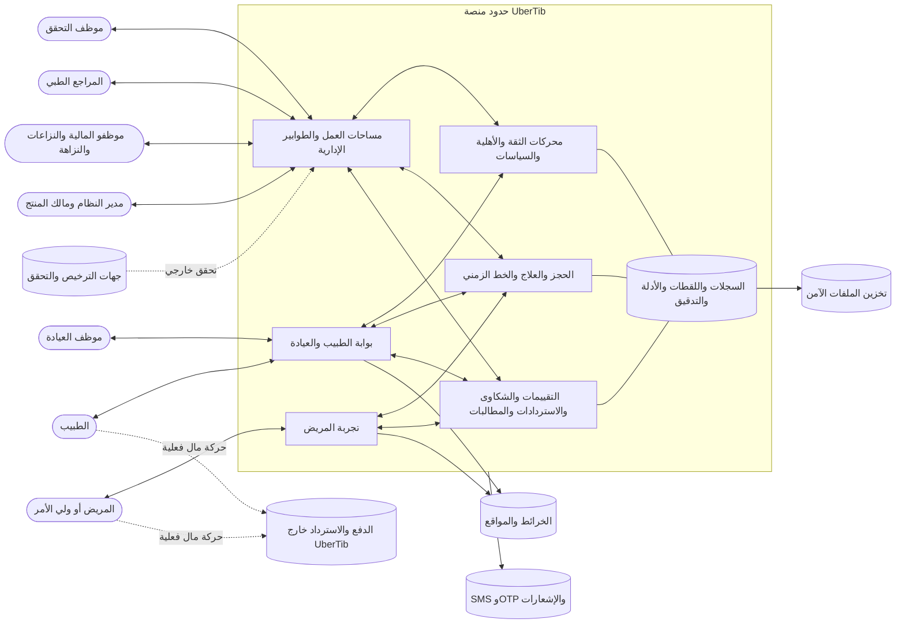

# النظرة الأولية للبرمجية: UberTib

**الإصدار:** 1.0  
**التاريخ:** 2026-08-15  
**المنهج:** Problem-Based SRS — Software Glance  
**المدخلات:** `00-business-context.md` و`01-customer-problems.md`

## الوصف

UberTib منصة تنسيق وثقة لخدمات طب الأسنان في حلب تربط المريض أو ولي الأمر بالطبيب المؤهل في فرع وخدمة محددين، ثم تحفظ رحلة موحدة للحجز والاتفاق والعلاج والمتابعة والتقييم والمشكلة. يتفاعل المريض عبر تطبيق عربي، بينما يستخدم الطبيب وموظفو العيادة بوابة تشغيلية، وتستخدم فرق UberTib لوحة إدارة قائمة على التحقق والطوابير والمراجعة. تجمع المنصة الحقائق والأدلة والأسعار والأحداث ثم تنتج قرارات أهلية وتصنيف وحماية ومخاطر قابلة للتفسير، مع إبقاء التشخيص والقرارات الطبية الحساسة بيد البشر. تسجل المنصة الاتفاقات والدفعات والاستردادات والتعويضات التي تمت خارجها، لكنها لا تجمع المال أو تحتجزه أو تحوله في الإصدار الأول.

## مخطط حدود النظام

## حدود النظام

### الممثلون

- **المريض أو ولي الأمر:** يحدد الحاجة، يبحث، يحجز، يوافق على الخطة والشروط، يؤكد الدفع الخارجي، يتابع العلاج، يقيّم، ويفتح مشكلة.
- **الطبيب:** يقدم بياناته وفروعه وخدماته وأدلته وأسعاره وتوفره وخططه العلاجية ويتابع الحالات.
- **موظف العيادة:** يدير المواعيد والحضور وتسجيل الدفعات والأدلة ضمن صلاحيات مفوضة.
- **موظف التحقق:** يتحقق من الحقائق المهنية والمنشآت والأجهزة والوثائق دون اختيار النتيجة المحسوبة.
- **المراجع الطبي:** يراجع الأدلة والقرارات التي تحتاج حكمًا طبيًا بشريًا.
- **موظفو المالية والنزاعات والنزاهة:** يطابقون التأكيدات ويديرون الاستردادات والمطالبات والتقييمات والاستثناءات.
- **مدير النظام ومالك المنتج:** يديران الصلاحيات والسياسات والجاهزية والتقارير دون تجاوز فصل الواجبات.

### الأنظمة والجهات الخارجية

- **جهات الترخيص والتحقق:** مصادر أو مراجع لصحة التراخيص والوثائق والاعتمادات.
- **وسائل الدفع الخارجية:** مكان تنفيذ الدفع أو الاسترداد أو التعويض بين الأطراف؛ ليست تكامل دفع داخل الإصدار الأول.
- **SMS وOTP والإشعارات:** قنوات للتوثيق والتنبيه مع بدائل عند التعطل.
- **الخرائط والمواقع:** مساعدة المريض في تحديد المنطقة والفرع والوصول إليه.
- **تخزين الملفات الآمن:** حفظ الأدلة والوثائق والصور والأشعة مع التحكم بالوصول.

## المكونات المفاهيمية عالية المستوى

- **تجربة المريض:** نقطة دخول عربية مبنية على الحاجة والموعد والموقع بدل الرموز الداخلية.
- **بوابة الطبيب والعيادة:** مساحة لإدارة بيانات مقدم الخدمة والفروع والأسعار والحجوزات والعلاج والأدلة والسجل المالي للحالات.
- **مساحات العمل الإدارية:** طوابير تحقق ومراجعة واستثناء ونزاع ومتابعة مالية.
- **محركات الثقة والأهلية والسياسات:** تحول الحقائق المعتمدة إلى تصنيف وأهلية وفئات سعرية وحماية ومخاطر مع أسباب ونسخ زمنية.
- **إدارة الحجز والعلاج:** تحافظ على حالة الموعد والخطة والمراحل والمتابعة والخط الزمني المشترك.
- **إدارة الحالات اللاحقة:** تنظم التقييمات والشكاوى والنزاعات والاستردادات والمطالبات والاعتراضات.
- **السجلات واللقطات والأدلة:** تحفظ الحقيقة التاريخية والموافقات والأحداث والوصول والتغييرات دون محو الأثر.

## الواجهات

| الواجهة | النوع | الطرف المتصل | الغرض المفاهيمي |
|---|---|---|---|
| تطبيق المريض | تطبيق هاتف | المريض وولي الأمر | البحث والحجز والموافقة والمتابعة والتقييم وفتح المشكلات |
| بوابة الطبيب | ويب/PWA | الطبيب | الخدمات والفروع والتوفر والخطط والأسعار والأدلة والحالات |
| مساحة موظف العيادة | ويب مقيد | موظف العيادة | المواعيد والحضور والدفعات المسجلة والتوثيق المفوض |
| لوحة الإدارة | ويب مكتبي | فرق UberTib | الطوابير والتحقق والمراجعة والسياسات والحالات والتقارير |
| واجهة التحقق الخارجي | مرجع/تكامل أو إجراء تشغيلي | جهات الترخيص | دعم التحقق من صحة الحقائق الخارجية |
| قنوات الرسائل | خدمة خارجية | SMS/OTP/Push | التحقق والتنبيه والتذكير والتصعيد |
| واجهة الخرائط | خدمة خارجية | مزود الخرائط | اختيار المنطقة وعرض موقع الفرع |
| واجهة الملفات | تخزين آمن | مخزن الوثائق والأدلة | حفظ واسترجاع الأدلة وفق الصلاحيات |
| سجل التنفيذ المالي الخارجي | تفاعل بشري موثق | المريض والطبيب/العيادة | توثيق ما حدث خارج المنصة دون نقل المال |

## اعتبارات البيانات

تحتاج المنصة إلى حفظ هويات وحسابات وأدوار، وبيانات الأطباء والتراخيص والفروع والتجهيزات والخدمات، والحقائق والأدلة ومصادرها وحالات التحقق. كما تحتاج إلى حفظ سياسات مؤرخة، ونتائج تصنيف وأهلية مع أسبابها، وأسعار وخطط علاجية ومراحل ومواعيد، ولقطات ثابتة للشروط وموافقات الأطراف. وتشمل البيانات أيضًا أحداث الدفعات الخارجية وتأكيداتها واعتراضاتها، والتقييمات والشكاوى والاستردادات والمطالبات والاعتراضات، إضافة إلى سجل وصول وتغيير وتنزيل غير قابل للمحو. تنشأ البيانات من المستخدمين والمراجعين والأنظمة الخارجية، ويجب التمييز دائمًا بين الحقيقة المقدمة والحقيقة المتحقق منها والقرار المحسوب والقرار البشري والتنفيذ الخارجي.

## التتبع إلى مشاكل العملاء

| المشكلة | معالجة النظرة الأولية لها |
|---|---|
| CP.01 | محركات الثقة والأهلية تربط صلاحية الخدمة بالطبيب والفرع، وتعرض تجربة المريض النتائج المؤهلة فقط. |
| CP.02 | يفصل Trust Core الحقائق والتحقق عن النتائج المحسوبة، ولا يمنح الممثلين واجهة لاختيار `S/P/H/I`. |
| CP.03 | تبدأ تجربة المريض بالحاجة وتعرض معاني عملية مع إبقاء التفاصيل الفنية اختيارية. |
| CP.04 | يدير Journey Core حقيقة موحدة للموعد وانتقاله إلى العلاج. |
| CP.05 | تحفظ السجلات لقطة الاتفاق والموافقات والسياسة التاريخية. |
| CP.06 | يوثق سجل التنفيذ الخارجي إبلاغ الطرف الأول وتأكيد الطرف الثاني أو اعتراضه دون تحريك المال. |
| CP.07 | تجمع إدارة الحجز والعلاج الخطة والمراحل والأدلة والمتابعة في خط زمني واحد. |
| CP.08 | تدير مكوّنات الحالات اللاحقة تقييمًا مرتبطًا بحالة مكتملة وموثقة. |
| CP.09 | تنظم Case Core مسارات الشكوى والنزاع والاسترداد والمطالبة والاعتراض. |
| CP.10 | تقدم لوحة الإدارة طوابير تحقق ومراجعة، بينما ينتج المحرك النتيجة من الوقائع. |
| CP.11 | تفصل السجلات والتخزين الآمن والصلاحيات بيانات الهوية والصحة والمال وتحتفظ بالأثر. |
| CP.12 | تحدد واجهات عربية للهاتف والويب وقنوات يمكنها تحمل الانقطاع وإعادة المحاولة. |
| CP.13 | تحفظ السياسات واللقطات والأسباب والتدقيق لإعادة إنتاج القرار التاريخي. |
| CP.14 | توفر مساحة الإدارة رؤية للطوابير والاستثناءات والمهل وجودة الإطلاق. |

## بوابة جودة Step 2

- [x] يشمل التتبع جميع مشاكل العملاء الأربعة عشر.
- [x] الوصف مفاهيمي ولا يتضمن متطلبات تفصيلية.
- [x] مخطط Mermaid يوضح حدود النظام والممثلين والجهات الخارجية.
- [x] النظام لا يتضمن بوابة دفع أو محفظة أو تحويل أموال في الإصدار الأول.
- [x] فُصلت الحقيقة والقرار المحسوب والمراجعة البشرية والتنفيذ الخارجي.

