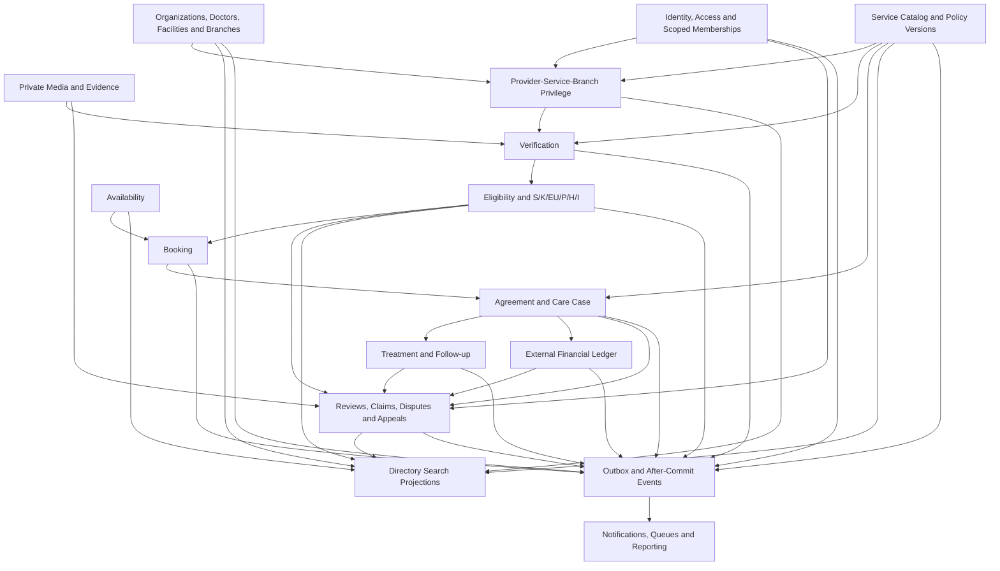

# Software Vision: UberTib

**Version:** 1.0  
**Date:** 2026-08-23  
**Status:** Approved planning baseline  
**Method:** Problem-Based SRS — Step 4 (Software Vision)  
**Authoritative source:** `UberTib_SRS_Etkan_v1.1.pdf`  
**Inputs:** `00-business-context.md`, `01-customer-problems.md`, `02-software-glance.md`, `03-customer-needs.md`, and product-owner decisions confirmed on 2026-08-23

This vision is derivative. If it conflicts with the authoritative SRS or a later explicit product-owner decision, the higher source governs and this document must be revised.

**Approved supplemental decision [PO-2026-08-23](decisions/PO-2026-08-23-confirmed-defaults.md):** The product owner confirmed the Laravel/Filament/React Native/MySQL direction, a vendor-neutral single-region deployment, the low-thousands planning envelope, provisional operational deadlines and retention defaults, an SRS-derived G01–G04 evaluation decomposition with versioned launch defaults, a licensed clinical production gate, visible customer-evaluation behavior for S/P/H/I under calibration, and an external-only financial operating model. Values derived from this decision remain versioned and may be superseded prospectively without changing historical snapshots.

## Vision

For patients and families in Aleppo who need trustworthy access to dental care, UberTib is a dental-service coordination and operational trust platform that identifies providers eligible for a specific service at a specific branch, preserves the treatment and financial agreement, and maintains one auditable journey from booking through completion or dispute. Unlike general directories, unverified recommendations, or clinic-only management systems, UberTib combines service-specific eligibility, versioned evidence, verified patient experience, structured treatment follow-up, and human-reviewed exception handling while keeping diagnosis with clinicians and all actual money movement outside the platform in V1.

The vision elaborates the system boundary defined in [`02-software-glance.md`](02-software-glance.md): patients use an Arabic mobile application; doctors, clinics, and UberTib teams use role-specific web workspaces; a shared backend enforces the same eligibility, policy, authorization, workflow, and audit rules for every channel.

## Stakeholders

| Stakeholder | Role in UberTib | Primary interest | Decision or access boundary |
|---|---|---|---|
| Patient | Searches, books, accepts plans, confirms external payments, follows treatment, reviews, and raises issues | Safe choice, understandable terms, continuity, and recourse | Own records and actions only |
| Guardian or authorized family member | Acts for a patient through a verified, scoped grant | Legitimate booking, consent, follow-up, and financial confirmation | Active grant scopes only; no shared credentials |
| Doctor | Supplies professional facts, services, availability, prices, plans, clinical evidence, and case responses | Fair service-specific eligibility and manageable workflows | Assigned services, branches, and treatment relationships |
| Clinic scheduler | Manages delegated booking, rescheduling, cancellation, attendance, and no-show actions | Efficient branch operations | Booking and attendance data for assigned branches only; no clinical attachments or financial review |
| Clinical assistant | Supports assigned treatment cases and documentation under clinician authority | Safe and complete case operations | Minimum clinical access for assigned cases only; no financial, claim, policy, or tenant-wide access |
| Clinic financial reporter | Reports externally received payments or executed refunds | Accurate patient account history | May report but may not confirm or adjudicate own report |
| Verification officer | Verifies identity, license, qualification, facility, branch, equipment, and documentary facts | Reliable inputs | Verifies facts but cannot choose computed outcomes |
| Medical reviewer | Reviews sensitive eligibility, grade, clinical claim, and appeal cases | Patient safety and defensible clinical governance | Clinical decisions only; cannot execute financial actions |
| Financial operations reviewer | Reviews external payment, refund, and compensation evidence | Accurate operational financial records | Cannot alter clinical grades or self-approve reported events |
| Claims and integrity reviewer | Collects evidence, routes disputes, and reviews verified-experience concerns | Fair, timely case resolution | Cannot issue unreviewed medical or fraud conclusions |
| Policy author and approver | Drafts and approves future-effective rules | Controlled product evolution | Author and approver must be different for sensitive policies |
| System administrator | Manages accounts, role assignments, platform configuration, monitoring, and support | Reliable and supportable operations | Cannot directly write S/P/H/I or silently modify append-only records |
| Product owner and sponsor | Owns scope, launch readiness, commercial policy, and product outcomes | Successful Aleppo launch and sustainable trust | Final product-policy authority below the SRS |
| Licensed dental reviewer or committee | Approves service definitions, risk tiers, evidence, follow-up, and launch readiness | Clinically defensible service catalog | Required production gate for real-patient service activation |
| Development, QA, security, and operations teams | Build, verify, deploy, monitor, and support the platform | Clear contracts and production evidence | Must preserve traceability and the UI/UX handoff boundary |
| Syrian legal and regulatory advisors | Review privacy, guardianship, health-record, commercial, and protection rules | Local legal fitness | Production sign-off where local law is unresolved |
| External service providers | SMS/OTP, push, maps, object storage, malware scanning, and verification sources | Reliable supporting services | No authority over UberTib domain decisions |

## Product Overview

### Purpose

UberTib reduces the risk of choosing a dentist from generic reputation or incomplete information. It establishes service-and-branch-specific eligibility, makes the agreed price and treatment path durable, records external financial facts without acting as a payment processor, and gives every participant a coherent timeline and governed route for correction, refund follow-up, claim, dispute, review, and appeal.

### In scope for V1

- Aleppo only and dentistry only.
- The SRS G01–G04 service groups and an SRS-derived provisional evaluation decomposition; permanent production service identities and complete definitions require later product and licensed clinical approval.
- Arabic-first patient experience with RTL and weak-connectivity support.
- Patient, guardian, doctor, clinic, reviewer, finance, operations, policy, audit, and administrative roles.
- Doctor, facility, branch, license, equipment, service, and evidence verification.
- System-computed eligibility, `S`, `K`, `EU`, A/B/C/D/F, `P`, `H`, and internal `I`, with reproducible snapshots and human review gates. The grade unit is doctor + treatment domain/service + branch/facility + measurement period; there is no universal doctor grade. `PENDING_EVALUATION` is not `F`, there is no `E`, and raw `I` is never public. Patient discovery presents practical eligibility and reasons, with internal symbols available only as controlled explanatory detail.
- Search, comparison, availability, booking, alternative appointment, rescheduling, cancellation, attendance, and no-show management.
- Versioned treatment plans, stages, consent, evidence, follow-up, completion, and one case timeline.
- Immutable `FinancialTermsSnapshot` and append-only records of externally executed payments, refunds, and compensation actions.
- Verified patient-experience rating `R`, kept separate from scientific classification.
- Complaints, disputes, refunds, non-funded protection assessment, claims, evidence, decisions, and appeals. `funded_protection_enabled` is false by default: while disabled, `H` may be calculated for evaluation but the platform exposes no protected amount, reserve, payout state, promise, or financial obligation.
- Notifications, operational queues, reporting, policy versions, idempotency, private files, and audit/provenance records.

### Explicitly out of scope for V1

- Payment gateway, card processing, wallet, escrow, platform-held balance, automated settlement, payout, or automatic refund.
- A promise of funded financial protection before an approved source of funds and legal policy exist.
- Orthodontics, non-dental specialties, telemedicine, video consultation, insurance administration, or a general longitudinal EMR.
- AI diagnosis, prescription, autonomous treatment planning, or an autonomous final decision on fraud, suspension, material downgrade, or compensation.
- Paid ranking, advertisements that influence eligibility, loyalty, referral, or advanced promotion programs.
- Cities outside Aleppo or uncontrolled publication of services lacking licensed clinical approval.
- Production UI/UX design by Codex; substantial patient, clinic, and admin interface work is handed to Claude after backend behavior and contracts are stable.

### Key benefits

1. Patients see choices that are eligible for the requested service and branch at the time of search and booking.
2. Doctors and clinics receive a transparent, evidence-based route to service activation without manually selecting their own grade, pricing class, protection, or risk output.
3. Both parties retain an immutable record of the accepted plan, stages, price, policy, protection wording, cancellation terms, and external financial confirmations.
4. UberTib teams operate through prioritized verification and exception queues with separation of duties and complete audit history.
5. The platform remains useful under weak connectivity and can evolve through future policy versions without rewriting historical cases.

### Success metrics

The Step 0 success criteria remain controlling. V1 specifically targets:

- 100% of searchable and bookable provider-service-branch combinations pass current eligibility gates at display and confirmation time.
- 100% of S/P/H/I and grade decisions retain versioned inputs, calculations, reasons, and policy references; zero interfaces allow direct manual grade selection.
- 100% of started treatment plans and reported financial events reference an immutable accepted terms snapshot.
- Zero money collection, holding, transfer, settlement, or payout operations are executed by UberTib.
- 100% of published reviews belong to one eligible completed case and obey duplicate and integrity checks.
- 100% of sensitive decisions receive the required distinct human review and auditable reason.
- At the initial low-thousands scale, ordinary API reads meet p95 ≤ 500 ms, writes p95 ≤ 800 ms, and search p95 ≤ 1 second, excluding file-transfer and external-provider latency.
- Recovery objectives are RPO ≤ 15 minutes and RTO ≤ 4 hours after production infrastructure approval and restore testing.

## High-Level Features

| Feature | Description | Primary benefit | Priority | Customer-needs trace |
|---|---|---|---|---|
| Identity, guardian, and scoped consent | Maintains independently authenticated identities, verified patient relationships, branch memberships, and purpose-scoped grants with evidence, validity, revocation, and explicit attachment access | Prevents credential sharing and unauthorized family, clinic, or cross-patient access | Must-have | CN.11.1, CN.11.2 |
| Provider, branch, and service verification | Captures and verifies provider, facility, license, qualification, equipment, service, and evidence facts | Establishes trustworthy eligibility inputs without allowing staff to choose outcomes | Must-have | CN.01.2, CN.02.1, CN.10.1 |
| Versioned catalog, policies, and decision engines | Publishes future-effective service and policy versions and computes S/K/EU, grade, P/H/I, gates, reasons, and snapshots | Produces reproducible decisions that can change prospectively without altering history | Must-have | CN.02.2, CN.13.1, CN.13.2, CN.14.2 |
| Patient discovery and comparison | Returns only eligible doctors and branches for the requested service with practical price, funded-protection availability, rating, location, and availability information | Supports an understandable, evidence-informed choice | Must-have | CN.01.1, CN.03.1 |
| Concurrency-safe booking lifecycle | Controls request, provider response, alternative, confirmation, rescheduling, cancellation, attendance, no-show, expiry, and eligibility rechecks on material fact changes and before confirmation | Creates a reliable shared appointment truth and prevents double booking | Must-have | CN.01.2, CN.04.1, CN.04.2, CN.12.1 |
| Versioned treatment agreement and timeline | Preserves plans, versions, stages, prices, terms, consent, evidence, follow-up, completion, and amendments | Makes the accepted clinical and commercial journey understandable and auditable | Must-have | CN.05.1, CN.05.2, CN.07.1, CN.07.2 |
| External financial operations ledger | Records reported, confirmed, partial, disputed, corrected, and reversed external payments and refunds without moving money | Provides a shared financial history without turning UberTib into a payment system | Must-have | CN.06.1, CN.06.2 |
| Reviews, complaints, claims, disputes, and appeals | Allows at most one review per eligible completed case within the policy deadline and connects every post-treatment action to the original case, evidence, policy, deadlines, human decisions, and external execution | Gives patients and providers a fair, traceable resolution path | Must-have | CN.08.1, CN.08.2, CN.09.1, CN.09.2 |
| Operational queues, readiness gates, and reporting | Prioritizes verification, medical, financial, claim, integrity, and policy work and controls service launch or expansion through separately recorded medical, legal, operational, and technical approvals plus an accountable product-owner decision | Lets limited operational teams manage exceptions and prevents unready scope from reaching patients | Must-have | CN.10.1, CN.14.1, CN.14.2 |
| Security, private evidence, audit, and resilience | Applies least privilege, staff separation of duties, branch and relationship scoping, MFA, private file controls, immutable audit, idempotency, drafts, and safe retries | Protects sensitive data and preserves correctness during weak connectivity or repeated requests | Must-have | CN.10.2, CN.11.1, CN.11.2, CN.12.1, CN.12.2, CN.13.2 |

## Environment and Constraints

### Deployment environment

- Vendor-neutral single-region Linux deployment for V1.
- Laravel 13 modular monolith and versioned REST API.
- MySQL 8 as the production system of record.
- Redis for queues, cache, rate limits, and distributed coordination.
- Private S3-compatible object storage with separate quarantine and clean areas.
- One web deployment and at least one queue worker initially, horizontally repeatable without changing domain boundaries.
- UTC persistence and `Asia/Damascus` business display timezone.
- Hosting provider, country, cross-border processing, and data-residency approval remain production gates.

### Application channels

- React Native patient application for Android and iOS consuming `/api/v1` contracts.
- Filament-based doctor/clinic workspace invoking Laravel application actions directly through session/CSRF-protected web adapters, not internal REST calls.
- Filament-based UberTib administration and review workspace invoking the same application actions, policies, transactions, workflows, and audit services.
- Interface architecture must support Arabic, RTL, accessibility, clear non-color state cues, server-side drafts, safe retries, and idempotent submissions.
- V1 is online-first and does not promise general bidirectional offline synchronization. Multipart or resumable upload is introduced only above an approved size/connectivity threshold with an authorized upload session, checksums, expiry, and cleanup policy.
- Detailed visual design, component behavior, and substantial UI implementation belong to the later Claude UI/UX handoff.

### External integrations

- SMS/OTP and push-notification providers behind replaceable adapters.
- Maps/geocoding for location assistance; maps must not be the only method of selecting or finding a branch.
- License and credential verification through approved external sources or recorded human verification.
- Mandatory fail-closed malware scanning for private production uploads; scanner failure keeps the object quarantined and unavailable.
- Actual payment and refund execution remains a documented human interaction outside UberTib; V1 has no payment-provider integration or payment webhook.

### Security and privacy constraints

- Deny-by-default authorization must combine capability, organization, branch, assignment, patient relationship, grant scope, workflow state, and conflict-of-interest checks.
- Organization and branch access is granted through temporally valid scoped memberships containing user, organization, optional branch, capability/role, start, expiry, and revocation. Every API query, Filament base query, job, export, notification, and file action must apply the same scope and be covered by cross-branch isolation tests. A user may hold different capabilities at different branches without inheriting organization-wide access.
- Patients are platform identities, not clinic-owned accounts. A booking creates only a bounded treatment relationship and never grants tenant-wide access.
- Guardian grants record patient, grantee, authority basis and evidence, explicit scopes, start, expiry, revocation, verifier, and policy version. Clinical attachments are excluded by default. Revocation or expiry is effective on the next request and any previously issued signed link expires within at most 60 seconds. Legal age and capacity remain a Syrian-law production gate.
- Sensitive doctor, clinic, reviewer, finance, policy, and administrator accounts require non-SMS MFA. Patient OTP uses six digits, a five-minute expiry, single use, hashed storage, at most five verification attempts, and at most three sends per 15 minutes per phone/account/IP combination; resend invalidates the prior code without resetting failure counts.
- Clinical and financial attachments are private. The initial allowlist is PDF, JPEG, and PNG; limits are 10 MB per image, 25 MB per PDF, and 10 files per action. Every upload requires extension plus magic/MIME/decode validation, opaque UUID object names, an immutable SHA-256 evidence hash, quarantine-before-scan, and a freshly authorized download URL valid for at most 60 seconds.
- Health content, credentials, OTP values, private filenames, and signed URLs must not enter ordinary application logs or error payloads.
- Every authorized or denied sensitive view, download, creation, change, decision, export, grant, and revocation must preserve actor, purpose, scope, time, and provenance in protected audit records. Append-only records are corrected through linked events rather than update or deletion paths.
- The provisional dental retention rule is 11 years after case closure for adults; for children, retain until the 25th birthday, or the 26th birthday when treatment ended at age 17. This is an engineering benchmark, not a Syrian legal conclusion, and Syrian legal approval may supersede it prospectively before production.
- A versioned retention matrix must separately govern: OTP hash/metadata up to 24 hours; unverified accounts, draft evidence, and abandoned uploads for 90 days; orphan temporary uploads for 24 hours; identity proofs according to verification and dispute status; clinical, financial, policy, provenance, and audit evidence; authentication logs; encrypted backups; deletion deadlines; legal holds; and destruction records.
- Backup restoration must restore database and object evidence consistently, reapply deletion tombstones and legal holds, and verify quarantine/scan states before service reopening.

### Medical and commercial constraints

- The initial 26 G01–G04 `ServiceDefinition` records are a provisional evaluation decomposition derived from the SRS examples, not an authoritative final service list or clinical approval. An active evaluation definition does not make a doctor/branch searchable: each provider-service-branch association still requires verified evidence and current eligibility. Real-patient publication requires explicit product approval of service granularity, the launch-readiness gate, and licensed approval of the complete service card: risk, qualification, evidence, equipment, follow-up, case completion, reference pricing, protection, complaint, refund, and escalation rules.
- The launch-readiness gate records separate medical, legal, operational, and technical approvals, their owners and reasons, an accountable product-owner decision, effective date, and audit history before a service or geographic expansion reaches real patients.
- The approved S/K/EU and S/P/H/I policies are provisional, configurable, versioned, reproducible, and identified as under calibration during customer evaluation.
- Clinical diagnosis, treatment choice, and sensitive clinical judgment remain with an authorized clinician or medical reviewer.
- `funded_protection_enabled` remains false. Activation requires a future-effective policy, an identified external funding source, Business/Legal approval, two distinct human approvers, and an audit trail. Non-funded assessment may route complaints and external refund follow-up but cannot create a reserve, payout, promise, or obligation.
- SYP is the initial allowed currency; values are stored as integer minor units with an explicit ISO currency code so policy can expand later.
- Booking defaults are a 15-minute unsubmitted request hold; provider response within 12 hours or two hours before the appointment, whichever occurs first; and the same expiry rule for an alternative proposal. Eligibility and slot capacity are rechecked at submission and confirmation. Cancellation more than 24 hours before the visit is timely; late cancellation and no-show are recorded and disputable but never create an automatic charge.
- An externally reported payment or refund waits up to 72 hours for the counterparty response, then moves to human `REVIEW_REQUIRED`; timeout never confirms a financial fact. Reporter and final reviewer must be different users. Concurrent confirm/dispute actions allow one committed result and reject a stale version.
- V1 exposes no payment API, processor webhook, payment redirect, wallet, balance, payable, receivable, settlement, or payout operation. It records externally reported facts and supporting evidence only.

### Scale, performance, and continuity assumptions

- Planning envelope: 10,000 registered identities, 3,000 monthly active users, 500 daily active users, and 100 concurrent authenticated sessions.
- Capacity target: 20 sustained API requests/second and 75 requests/second for a 60-second burst.
- Data envelope: approximately 50,000 bookings/year, 500,000 audit events/year, and up to 500 GB of private files before capacity review.
- Availability target: 99.5% monthly for the V1 production service, excluding approved maintenance.
- Critical queues should begin processing within 30 seconds at baseline load; ordinary notifications should be dispatched within 60 seconds.
- RPO ≤ 15 minutes requires production MySQL binary-log point-in-time recovery and equivalent versioned object-storage recovery. RTO ≤ 4 hours must be demonstrated by a quarterly full restore exercise covering database state, object evidence, scan/quarantine metadata, deletion tombstones, and legal holds.
- Booking, idempotency, append-only correction, and snapshot tests must run against MySQL because SQLite is not sufficient evidence for production concurrency semantics.
- The release gate includes a 30-minute test with 100 authenticated sessions, a 75-RPS burst with error rate below 1%, and 100 concurrent attempts for one slot without exceeding capacity. It also requires allow/deny scope tests, OTP/MFA tests, protection-disabled and zero-money-movement contract tests, upload quarantine/scan/signed-link tests, retention/legal-hold/restore tests, and idempotency same-key/same-payload versus same-key/different-payload tests.
- Private-file usage has quotas, object lifecycle rules, cost monitoring, and a capacity-review trigger before the 500 GB planning envelope is reached.

## High-Level Architecture

```mermaid
flowchart TB
    subgraph Channels[User Channels]
        PatientApp[React Native Patient App]
        ClinicPanel[Filament Doctor and Clinic Workspace]
        AdminPanel[Filament Admin and Review Workspace]
    end

    subgraph Platform[Laravel Modular Monolith]
        Rest[Versioned REST Adapter]
        Web[Filament Web Adapters]
        Actions[Application Actions]

        subgraph Domains[Domain Modules]
            IAM[Identity, Access, Guardian and Consent]
            Directory[Doctor, Facility, Branch and Directory]
            Catalog[Service Catalog and Policy Versions]
            Privilege[Provider-Service-Branch Privileges]
            Evidence[Evidence and Verification]
            Trust[Eligibility, S/K/EU, Grade and P/H/I]
            Booking[Availability and Booking]
            Agreement[Agreement and Care Case]
            Treatment[Treatment Stages and Follow-up]
            Finance[External Financial Operations Ledger]
            Resolution[Reviews, Claims, Disputes and Appeals]
            Ops[Notifications, Work Queues and Reporting]
        end

        subgraph Integrity[Shared Integrity Services]
            AuthZ[Authorization and Separation of Duties]
            Audit[Audit and Provenance]
            Idempotency[Idempotency and Concurrency Control]
            Media[Private Media and Retention]
        end
    end

    MySQL[(MySQL 8 System of Record)]
    Redis[(Redis Queues, Cache and Locks)]
    Objects[(Private Object Storage)]

    SMS[SMS, OTP and Push Providers]
    Maps[Maps and Geocoding]
    Verify[License and Credential Sources]
    Scanner[Malware Scanner]
    PatientHuman([Patient or Guardian outside UberTib])
    ClinicHuman([Clinic outside UberTib])

    PatientApp --> Rest
    ClinicPanel --> Web
    AdminPanel --> Web
    Rest --> Actions
    Web --> Actions

    Actions --> IAM
    Actions --> Directory
    Actions --> Catalog
    Actions --> Privilege
    Actions --> Evidence
    Actions --> Trust
    Actions --> Booking
    Actions --> Agreement
    Actions --> Treatment
    Actions --> Finance
    Actions --> Resolution
    Actions --> Ops

    Actions --> AuthZ
    Actions --> Audit
    Actions --> Idempotency
    Actions --> Media

    Platform --> MySQL
    Platform --> Redis
    Media --> Objects

    Ops --> SMS
    Directory --> Maps
    Evidence -. recorded verification .-> Verify
    Media --> Scanner
    PatientHuman -. actual payment or refund outside UberTib .-> ClinicHuman
    PatientHuman -. uses .-> PatientApp
    ClinicHuman -. uses .-> ClinicPanel
    Finance -. records external facts only; no execution interface .-> Audit
```

### Architectural responsibilities

- React Native invokes the REST adapter with device-token authentication. Filament uses Laravel session and CSRF protection through web adapters. Both invoke the same application actions directly and do not duplicate business-critical authorization, pricing, classification, workflow, or financial rules.
- Application actions coordinate validated commands, authorization, transactions, state transitions, audit events, and after-commit side effects.
- Domain modules own their invariants while communicating through explicit application contracts and after-commit events rather than direct UI logic.
- The Agreement and Care Case module owns the stable care-case identity, participants, accepted treatment-plan version, `FinancialTermsSnapshot`, applicable policy references, consent, and the unified timeline contract consumed by Treatment, Finance, and Resolution.
- The Resolution module owns post-treatment review, complaint, refund-review, claim, dispute, and appeal workflows; it is distinct from the clinical care case.
- MySQL is authoritative for identity, policy, workflow, snapshots, append-only events, and audit references. Redis is never the sole source of business truth.
- Private object storage holds evidence bytes; the database holds ownership, purpose, hash, scan state, retention state, and access metadata.
- The financial module manages operational facts and obligations only. It has no balance engine, payment processor, settlement account, or payout capability.
- Future provider adapters may be introduced behind module boundaries, but must not reinterpret historical external/manual records.

### Dependency direction

This dependency order determines implementation sequence. No dependent module may bypass an upstream invariant by duplicating rules in a controller, Filament resource, React Native client, queue job, or report.

## Step 4 Quality Gate

- [x] The positioning statement identifies target users, need, category, benefit, alternative, and differentiation.
- [x] Business, patient, clinic, review, technical, external, and regulatory stakeholders are represented.
- [x] In-scope and out-of-scope boundaries match the authoritative SRS and confirmed decisions.
- [x] Ten high-level features trace to all 27 customer needs.
- [x] Deployment, scale, security, medical, commercial, performance, retention, and UI/UX constraints are stated.
- [x] Mermaid architecture and dependency diagrams expand the Software Glance without becoming detailed implementation design.
- [x] The architecture retains the V1 no-money-movement boundary.
- [x] The document is ready to feed Step 5 requirements specification.
- [x] Step 5 must preserve authoritative `FR-001` through `FR-047` as immutable SRS aliases while using dotted derivative IDs for CP → CN → FR traceability; the complete mapping belongs in `traceability-matrix.md`.
