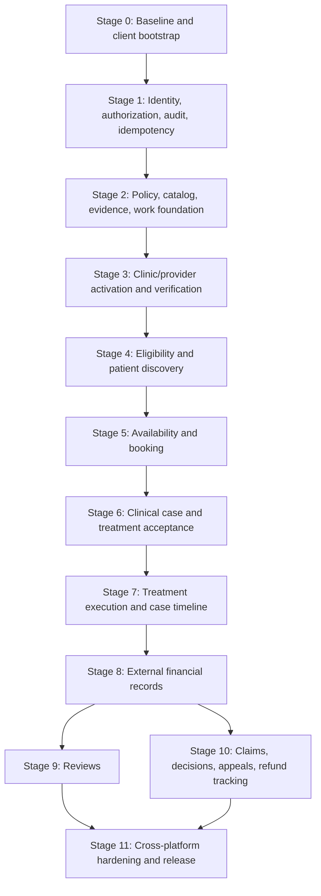

# UberTib Master Implementation Plan

**Phase:** 3 — Execution  
**Artifact role:** Canonical cross-platform implementation order and orchestration index  
**Baseline:** 2026-08-24  
**Detailed platform plans:**
- `docs/implementation/ADMIN_IMPLEMENTATION_PLAN.md`
- `docs/implementation/CLINIC_IMPLEMENTATION_PLAN.md`
- `docs/implementation/USER_IMPLEMENTATION_PLAN.md`

**Canonical product behavior:** `docs/PRD.md`  
**Canonical technical design:** `docs/SDD.md` and Phase 2 engineering documents  
**Testing owner:** `docs/TESTING_STRATEGY.md`  
**Coverage owner:** `docs/TRACEABILITY_MATRIX.md` — current requirement/design/test/task coverage  
**ID registry:** `docs/README.md`

## 1. Purpose

This document is the canonical execution order for UberTib V1 across the shared Laravel backend, Admin Filament panel, Clinic Filament panel, and Patient React Native application.

It does **not** duplicate the detailed task bodies in the three platform implementation plans. Those files remain the detailed owner of each `TASK-*` goal, expected files, migrations, tests, verification commands, and definition of done. This file determines **when** those tasks should be executed, which tasks form shared foundations, which work can proceed in parallel, and which cross-platform gates must be complete before downstream workflows are considered implemented.

The key implementation rule is:

> Build each business capability once in the shared Laravel application/domain layer, then expose it through the appropriate adapter: Admin Filament, Clinic Filament, and/or `/api/v1` for React Native.

A screen, Filament resource, or mobile feature is never considered complete when the authoritative backend action, authorization, lifecycle, persistence, audit/idempotency behavior, or required tests are missing.

## 2. Platform Architecture Used by This Plan

| Platform | Runtime / adapter | Routing / contract | Primary responsibility |
|---|---|---|---|
| Shared backend | Laravel `^13.17`, PHP `^8.3` | application actions, policies, models, jobs, queries | authoritative business state and rules |
| Admin | Filament 5 | existing `/admin` panel | governance, verification, policy, launch readiness, operations, sensitive human review |
| Clinic / Doctor | Filament 5 separate panel | proposed `/clinic` prefix | provider/branch operations, availability, booking response, clinician-authored treatment workflow |
| Patient | React Native | REST `/api/v1` | patient/guardian identity, discovery, booking, acceptance, case, finance records, reviews, claims |

The Clinic panel must remain separate from Admin resource discovery and authorization. The Patient client must never become a second business-rule engine.

## 3. Verified Starting Point

The existing repository already contains a meaningful but narrow Laravel implementation:

- the Laravel/Filament backend skeleton;
- the existing Admin Filament panel at `/admin`;
- service groups, services, versioned service definitions, clinical reviewer credentials, and service launch-gate records;
- service-definition lifecycle and launch-governance actions;
- one implemented public API: `GET /api/v1/catalog/service-groups`;
- Pest tests for the catalog/governance slice;
- Composer quality commands and MySQL compatibility configuration.

The wider V1 platform is still largely to be implemented: scoped identity/permissions, provider/branch activation, S/P/H/I evaluation, booking, cases, treatment, external financial records, reviews, claims, work queues, full patient APIs, Clinic panel, and React Native application.

The React Native patient repository/path and its actual build/test/lint commands are not yet verified. `TASK-PLATFORM-008` owns that bootstrap and must record the real commands before downstream mobile tasks use them.

## 4. Non-Negotiable Product and Safety Boundaries

Every implementation stage must preserve all of the following:

1. V1 is Aleppo-first and dental-only within approved service scope.
2. The current 26 service records are provisional evaluation records, not automatic production clinical approval.
3. Patients, clinics, and Admin users do not manually choose final `S`, `P`, `H`, `I`, scientific grade, or eligibility.
4. Source facts and governed policy versions drive system-derived classifications and eligibility.
5. `PENDING_EVALUATION` is distinct from scientific grade `F`.
6. Internal risk `I` is not exposed to ordinary patients or clinic users.
7. UberTib does not autonomously diagnose, prescribe, or author treatment plans; the treating clinician authors them.
8. Sensitive medical/legal/punitive/high-impact claim decisions remain accountable human decisions.
9. Accepted clinical and financial terms, eligibility decisions, governed decisions, and append-only event histories are never silently rewritten.
10. V1 performs **no electronic payment, wallet, custody, escrow, settlement, payout, transfer, capture, or platform-executed refund**.
11. Financial functionality records external events, confirmations, disputes, obligations, and external execution facts only.
12. Private identity/clinical/financial/claim evidence is never public filesystem content.
13. Authorization is deny-by-default and enforced server-side; hiding a UI control is not authorization.
14. Booking confirmation must synchronously revalidate safety-critical state and cannot trust stale search/cache data.
15. Retry-prone sensitive commands must be idempotent and concurrency-safe.

Any task implementation that violates one of these boundaries is incomplete even when its local tests or UI appear functional.

## 5. Detailed Plan Ownership

Use this master file to select the next work package, then open the owning detailed plan for implementation instructions.

| Detailed plan | Primary task allocations | Detailed responsibility |
|---|---|---|
| Admin | foundation through governance/operations tasks | shared security, audit, policy, evidence, verification, eligibility, Admin operations, sensitive reviews |
| Clinic | provider-side task continuation | separate Filament panel, provider/branch facts, availability, booking response, clinician workflows, clinic-side finance/claims |
| Patient | patient-facing task continuation | mobile/API identity, discovery, booking, acceptance, patient finance/reviews/claims, connectivity/RTL |

This master plan does not redefine task bodies. If a task description conflicts with product/design sources, the higher-priority canonical document wins and the inconsistency must be corrected before implementation continues.

## 6. Allocated Task Registry Snapshot

The three detailed plans currently allocate **82 implementation tasks**.

| Domain | Allocated task IDs | Highest allocated |
|---|---|---:|
| PLATFORM | `TASK-PLATFORM-001`–`TASK-PLATFORM-013` | 013 |
| IDENTITY | `TASK-IDENTITY-001`–`TASK-IDENTITY-007` | 007 |
| AUDIT | `TASK-AUDIT-001`–`TASK-AUDIT-003` | 003 |
| POLICY | `TASK-POLICY-001` | 001 |
| CATALOG | `TASK-CATALOG-001`–`TASK-CATALOG-002` | 002 |
| OPS | `TASK-OPS-001`–`TASK-OPS-004` | 004 |
| ELIG | `TASK-ELIG-001`–`TASK-ELIG-011` | 011 |
| BOOKING | `TASK-BOOKING-001`–`TASK-BOOKING-011` | 011 |
| CLINICAL | `TASK-CLINICAL-001`–`TASK-CLINICAL-009` | 009 |
| FINANCE | `TASK-FINANCE-001`–`TASK-FINANCE-011` | 011 |
| REVIEWS | `TASK-REVIEWS-001`–`TASK-REVIEWS-003` | 003 |
| CLAIMS | `TASK-CLAIMS-001`–`TASK-CLAIMS-009` | 009 |

These IDs are append-only and are synchronized with the canonical `docs/README.md` registry. Future task allocations must update the registry without renumbering, reusing, or repurposing existing IDs.

## 7. Execution Lanes

Implementation should be managed through five coordinated lanes rather than three isolated applications.

| Lane | Owns | Rule |
|---|---|---|
| Shared Domain / Backend | migrations, models, actions, policies, query services, jobs, state transitions, audit | implemented once and reused everywhere |
| Admin Filament | governance and operational adapters | cannot contain unique business rules |
| Clinic Filament | provider/clinician adapters under separate panel | cannot bypass provider/branch/case scope |
| Patient API + React Native | `/api/v1` plus mobile consumption | server remains authoritative |
| Quality / Operations | tests, concurrency, security, monitoring, recovery, release evidence | required continuously, not deferred to final week |

Parallel work is allowed only after shared contracts and data ownership are stable enough to avoid duplicate implementations.

## 8. Canonical Cross-Platform Dependency Graph



The stage sequence below overrides the presentation-wave order in a detailed platform plan when a shared task is a prerequisite for another platform. For example, `TASK-OPS-002` is implemented early as a shared work-item primitive even though the Admin plan groups its Admin-facing surface later.

---

# Stage 0 — Baseline, Repository Verification, and Mobile Bootstrap

## Goal

Freeze the verified engineering baseline, make the current backend safe to extend, and bootstrap the mobile codebase without prematurely implementing business flows.

## Execute

- `TASK-PLATFORM-001` — harden the existing Admin panel entry boundary.
- `TASK-PLATFORM-008` — bootstrap/verify the React Native patient application and record real commands.

## Work that may run in parallel

The React Native skeleton can be bootstrapped while backend access hardening is implemented because it does not yet depend on business APIs.

## Exit gate

- verified backend quality commands remain green;
- Admin access is no longer equivalent to universal business authorization;
- React Native project path, package manager, build targets, test/lint/build commands, environment strategy, and RTL baseline are recorded from actual code;
- no production secrets are committed;
- no business feature is duplicated in the mobile client.

# Stage 1 — Shared Identity, Authorization, Audit, and Retry Safety

## Goal

Create the cross-platform trust boundary before adding protected business data.

## Execute in dependency order

1. `TASK-IDENTITY-001` — staff roles/coarse capabilities.
2. `TASK-AUDIT-001` — sensitive audit/provenance foundation.
3. `TASK-IDENTITY-002` — scoped staff/resource authorization.
4. `TASK-IDENTITY-003` — privileged authentication readiness.
5. `TASK-AUDIT-002` — idempotency/integrity-exception foundation.
6. `TASK-IDENTITY-005` — patient OTP request/verification application logic.
7. `TASK-IDENTITY-006` — mobile authentication transport and `/me` bootstrap.
8. `TASK-AUDIT-003` — patient API stable errors/correlation/idempotency boundary.
9. `TASK-IDENTITY-007` — guardian/family grants and represented-patient context.
10. `TASK-PLATFORM-009` — shared mobile API/cache/network-recovery layer.

`TASK-IDENTITY-004` belongs to the Clinic panel and is executed at the beginning of Stage 3 after its panel exists.

## Cross-platform rules established here

- authentication and authorization are separate;
- Admin/Clinic/Patient use the same application identity truth;
- provider, branch, case, guardian, purpose, workflow, and effective-period scope is rechecked server-side;
- all sensitive actions can be attributed to the actual actor;
- repeated commands cannot create duplicate business effects;
- mobile network timeout is treated as unknown outcome and reconciled from the server.

## Provider dependency

OTP application logic can be implemented behind an adapter while `Q-PLATFORM-003` is open. Production OTP delivery is not release-ready until a real approved provider/configuration exists.

## Exit gate

No protected downstream domain may begin until representative allow/deny tests prove scoped authorization and audit/idempotency foundations.

# Stage 2 — Policy, Catalog, Evidence, Work Queue, and Launch Governance Foundation

## Goal

Create the governed inputs and operational primitives required by eligibility, booking, cases, claims, and production publication.

## Execute

1. `TASK-POLICY-001` — general versioned/effective policy foundation.
2. `TASK-PLATFORM-002` — private evidence intake/quarantine/authorized access foundation.
3. `TASK-OPS-002` — unified operational work-item model **moved forward in master sequencing because downstream booking/claims tasks depend on it**.
4. `TASK-CATALOG-001` — Admin catalog/service-definition governance.
5. `TASK-OPS-001` — launch-gate review and publication operations.

`TASK-OPS-003` reporting remains later because meaningful source-domain data does not yet exist.

## Required data-order discipline

At this point migrations should establish only shared, justified foundations such as:

- roles/permissions/scoped grants;
- audit/idempotency/integrity records;
- versioned policies;
- evidence items/bindings and quarantine metadata;
- operational work items;
- any missing catalog/governance fields required by canonical designs.

Do not create booking, case, claim, or financial tables early merely to reserve schema names.

## Exit gate

- activated policy/history cannot be silently rewritten;
- evidence is private and unusable while quarantine/validation rules fail;
- work items reference authoritative source records instead of replacing domain state;
- catalog evaluation/production separation remains fail-closed;
- publication requires accountable launch gates.

# Stage 3 — Clinic Panel, Provider/Branch Activation, Pricing, and Verification

## Goal

Establish the provider-side source facts that eligibility can safely consume.

## Execute

### Clinic panel and scope

- `TASK-PLATFORM-005` — create separate Clinic Filament panel, proposed `/clinic` prefix.
- `TASK-IDENTITY-004` — Clinic panel access and provider/branch scope.

### Provider and service activation

- Admin/shared: `TASK-ELIG-001`–`TASK-ELIG-003` as their dependencies become available.
- Clinic: `TASK-ELIG-007`–`TASK-ELIG-009`.

The exact detailed task semantics remain in the Admin and Clinic plans. The cross-platform sequence is:

1. create provider/clinic/branch relationships and scoped access;
2. Clinic submits factual provider/service/branch information;
3. Clinic uploads/binds evidence through the shared evidence service;
4. Clinic records actual price inputs where required;
5. Admin verification reviews source facts/evidence;
6. approved/rejected facts retain provenance and effective/expiry context;
7. influential changes become eligible inputs for recalculation.

## Critical rule

No Clinic or Admin form may accept a final scientific grade, pricing class, protection level, risk profile, or eligibility decision as source input.

## Exit gate

At least one evaluation fixture can travel end-to-end from Clinic submission → Admin verification → approved source facts without fabricating production clinical approval.

# Stage 4 — Eligibility Engine, Recalculation, and Patient Discovery

## Goal

Turn approved facts and governed policies into immutable decisions, then expose only safe practical patient/clinic projections.

## Execute

1. `TASK-ELIG-004` — immutable eligibility evaluation engine.
2. `TASK-ELIG-005` — dependency-aware recalculation and automatic suspension.
3. `TASK-ELIG-006` — staff decision inspection/historical reproduction.
4. Clinic computed-status work from `TASK-ELIG-007`–`009` not already completed in Stage 3.
5. `TASK-CATALOG-002` — patient service catalog consumption and contract normalization.
6. `TASK-ELIG-010` — eligible-provider search API/mobile feature.
7. `TASK-ELIG-011` — patient-safe provider explanation.

## Parallelization

Once the eligibility read model/contract is stable:

- Clinic eligibility status projection can be built in parallel with Patient provider discovery;
- Admin reproduction/inspection can be built in parallel with patient-safe query projections;
- mobile catalog work can proceed before production eligibility formulas are licensed, using evaluation-safe fixtures.

## Clinical readiness gate

`Q-ELIG-001` means the engine structure, versioning, boundaries, pending behavior, and test framework may be completed, but provisional formulas/weights/thresholds/defaults must not be described as licensed production medical policy.

## Exit gate

- `PENDING_EVALUATION` and `F` are demonstrably distinct;
- final outcomes are system-derived from approved inputs;
- influential invalidation creates a new decision/suspension rather than mutating history;
- public/patient discovery returns only currently passing provider/service/branch combinations;
- raw internal `I` is absent from patient and ordinary Clinic projections;
- search performance verification path exists for the p95 target.

# Stage 5 — Availability and Booking Lifecycle

## Goal

Implement one transactional booking lifecycle shared by Clinic, Patient, and Admin operations.

## Execute

### Shared / Clinic booking foundation

- `TASK-BOOKING-003`–`TASK-BOOKING-006` from the Clinic plan.

### Patient booking

- `TASK-BOOKING-007`–`TASK-BOOKING-011`.

### Admin operational visibility

- `TASK-BOOKING-001`–`TASK-BOOKING-002` after booking source state exists.

## End-to-end flow to prove

1. Clinic publishes authorized availability/capacity for exact branch/service context.
2. Patient selects a currently discoverable provider/slot.
3. Patient submits idempotent booking request.
4. Backend synchronously revalidates publication, provider eligibility, branch readiness, actor authority, slot state, and capacity.
5. Clinic receives the request and may accept, reject with reason, or propose an alternative within the governing deadline.
6. Alternative remains non-confirmed until patient/guardian explicitly accepts.
7. Acceptance revalidates alternative capacity/readiness/eligibility.
8. Transactional concurrency prevents overbooking.
9. Cancellation/no-show creates governed auditable history.
10. Admin sees operational exceptions but cannot force a confirmation around failed safety checks.

## Mandatory quality gate

The production-engine test must prove **100 concurrent booking attempts cannot overbook configured capacity**. SQLite-only evidence is insufficient.

## Exit gate

The complete Patient ↔ Clinic booking handshake works through one server state machine with deterministic errors and no local/Filament-only statuses.

# Stage 6 — Clinical Case, Treatment Plan, and Immutable Acceptance

## Goal

Create clinician-authored treatment plans and patient acceptance without allowing the platform to become the diagnosing/treating authority.

## Execute

### Clinic / shared clinical authoring

- `TASK-CLINICAL-002`–`TASK-CLINICAL-004` as applicable to case access, plan authoring/versioning, and proposal.

### Patient case and acceptance

- `TASK-CLINICAL-007`–`TASK-CLINICAL-008`.

### Admin oversight

- `TASK-CLINICAL-001` once case projections exist.

## End-to-end flow to prove

1. booking/case relationship permits the authorized treating clinician to access the case;
2. clinician authors treatment plan draft/version;
3. required service, stages, prices, inclusions/exclusions, and terms are complete before proposal;
4. Patient reads the exact proposed version and linked financial terms;
5. Patient/authorized guardian accepts the exact version idempotently;
6. backend atomically creates immutable accepted clinical and financial snapshots;
7. accepted history cannot be edited in place;
8. later amendment is a new version requiring new acceptance.

## Exit gate

Tests must reject incomplete plans, stale versions, unauthorized authors/acceptors, and duplicate/concurrent acceptance while preserving one immutable accepted outcome.

# Stage 7 — Treatment Stages, Evidence, Follow-Up, and Unified Case Timeline

## Goal

Execute the accepted clinical workflow and expose a safe cross-domain patient timeline.

## Execute

- Clinic: remaining `TASK-CLINICAL-005`–`TASK-CLINICAL-006`.
- Patient: `TASK-CLINICAL-009`.
- supporting evidence/queue jobs reuse `TASK-PLATFORM-002` and `TASK-OPS-002`.

## End-to-end flow to prove

1. Clinic resolves current accepted treatment snapshot.
2. Treating clinician records stage progress.
3. Required evidence is bound to the exact stage and passes applicable validation.
4. Completion fails when required evidence/facts are missing.
5. Completion records actor/time/reason/evidence set and creates durable history.
6. Reopening, where allowed, is a governed audited transition.
7. Follow-up work/reminders derive from accepted terms/policy.
8. Patient timeline exposes only authorized patient-safe events.
9. Admin support/reviewer projections remain purpose/scoped rather than becoming unrestricted medical-record access.

## Exit gate

Historical plan/stage/evidence context is reproducible and no accepted treatment facts are silently replaced by current defaults.

# Stage 8 — External Financial Terms and Event Records

## Goal

Implement the full financial-record workflow while continuously proving that UberTib does not move money.

## Execute core financial model first

1. `TASK-FINANCE-001` — immutable terms and external-event foundation.
2. `TASK-FINANCE-002` — confirmation/dispute workflow.
3. Clinic `TASK-FINANCE-004`–`TASK-FINANCE-007`.
4. Patient `TASK-FINANCE-008`–`TASK-FINANCE-010` where applicable.

Defer refund/compensation execution-tracking tasks that depend on an approved claim decision until Stage 10:

- `TASK-FINANCE-003`.
- patient/clinic external refund execution tasks where the detailed plans bind them to claim decisions, including `TASK-FINANCE-011` when applicable.

## End-to-end flow to prove

1. plan acceptance creates immutable financial terms snapshot;
2. external money activity happens outside UberTib;
3. authorized Patient or Clinic actor reports an external event;
4. report begins as an unconfirmed assertion;
5. authorized counterparty/finance reviewer confirms or disputes through an appended event;
6. correction is another event, never mutation of the original assertion;
7. derived financial status is reproducible from ordered events;
8. no code path invokes a payment/custody provider.

## Architecture gate

Tests and code review must prove absence of platform payment primitives: no capture, charge, wallet, escrow, payout, settlement, card/bank credential storage, or platform refund execution.

# Stage 9 — Verified Reviews and Review Appeals

## Goal

Implement verified patient experience reviews independently from scientific/eligibility classification.

## Execute

- `TASK-REVIEWS-001` — Admin review integrity/appeal operations.
- `TASK-REVIEWS-002` — Clinic review participation/appeal capability.
- `TASK-REVIEWS-003` — Patient verified review submission.

## End-to-end flow to prove

1. completed verified experience satisfies review eligibility;
2. patient/authorized guardian may create at most one active review for the experience;
3. review rating `R` remains separate from `S/P/H/I`;
4. Clinic/eligible actor may submit an appeal only through governed policy;
5. Admin integrity review preserves original review/history and makes accountable decisions;
6. appeal never directly rewrites scientific classification or eligibility.

## Exit gate

Concurrent/replayed review submission cannot create duplicate active reviews and tests prove `R` does not feed eligibility calculations.

# Stage 10 — Claims, Evidence, Human Decisions, Appeals, and External Refund Tracking

## Goal

Implement refund/protection claim workflows from patient submission through Clinic evidence participation, Admin human decision, appeal, and external execution recording.

## Execute in dependency order

### Shared/Admin claim foundation

1. `TASK-CLAIMS-001` — claim/refund intake and routing.
2. `TASK-CLAIMS-002` — evidence/deadline control.
3. `TASK-CLAIMS-003` — sensitive human decisions with separation of duties.
4. `TASK-CLAIMS-004` — Admin appeal review.

### Clinic participation

5. `TASK-CLAIMS-005`–`TASK-CLAIMS-006`.

### Patient workflows

6. `TASK-CLAIMS-007` — refund/protection submission.
7. `TASK-CLAIMS-008` — claim list/detail projections.
8. `TASK-CLAIMS-009` — patient appeal submission.

### External execution tracking after decision

9. `TASK-FINANCE-003` and the corresponding Clinic/Patient external refund-execution tasks from their detailed plans, including `TASK-FINANCE-011` where applicable.

## End-to-end flow to prove

1. Patient submits an eligible refund/protection claim against immutable accepted terms/policy.
2. Protection claim requires an applicable accepted protection entitlement.
3. Required evidence/deadlines resolve from governing snapshot/version.
4. Missing/rejected/expired/accepted evidence remains distinguishable.
5. Deadline pause/extension creates an explicit reasoned event.
6. Clinic may provide evidence/response only within its case/provider scope.
7. system automation may prepare facts but cannot submit the final sensitive decision.
8. authorized human reviewer records findings/reasons/evidence/policy/actor/time.
9. separation-of-duties prevents impermissible self-review.
10. eligible appeal creates a new workflow referencing the immutable original decision.
11. approved monetary remedy becomes an external action due; UberTib still does not transfer funds.
12. after off-platform execution, an authorized party may record the external execution assertion and counterparty confirmation/dispute.

## Exit gate

No claim outcome can be confused with platform-paid compensation, and every sensitive decision/appeal remains attributable and reproducible.

# Stage 11 — Operations, Notifications, Privacy, Reporting, Resilience, and Release

## Goal

Harden the complete cross-platform system for production-like verification and operational support.

## Execute

### Operations and reporting

- complete `TASK-OPS-003` — operational reporting.
- `TASK-OPS-004` — Clinic actionable work feed.

### Privacy and retention

- `TASK-PLATFORM-003` — retention/deletion/legal-hold operations, using governed values and preserving `Q-PLATFORM-002`.

### Platform/client hardening

- `TASK-PLATFORM-004` — Admin/backend telemetry and release gates.
- `TASK-PLATFORM-006` and other Clinic support tasks defined before `TASK-PLATFORM-007` in the Clinic plan.
- `TASK-PLATFORM-007` — Clinic security/performance/RTL/release hardening.
- `TASK-PLATFORM-010` — mobile weak-connectivity drafts/reconciliation.
- `TASK-PLATFORM-011` — Arabic/RTL/accessibility integration.
- `TASK-PLATFORM-012` — final Patient/API security/performance/observability/release gate.

## Operational verification

Required release evidence includes, as applicable:

- p95 normal reads ≤ 500 ms;
- p95 normal writes ≤ 800 ms;
- provider search p95 ≤ 1 second;
- 75 rps burst handling;
- 30-minute performance run with error rate < 1%;
- 100 concurrent booking attempts cannot overbook;
- 99.5% availability design/operational evidence;
- RPO ≤ 15 minutes;
- RTO ≤ 4 hours;
- quarterly restore verification process;
- queue age/retry/failure monitoring;
- eligibility recalculation delay monitoring;
- evidence scan backlog monitoring;
- deadline/work-item breach monitoring;
- notification failure visibility where notification delivery is implemented;
- privacy-safe correlation/logging;
- Arabic/RTL/accessibility verification;
- no secrets/protected payloads in logs/client errors;
- zero-money-movement invariant verification.

## Exit gate

A release candidate may proceed only when every applicable requirement is implemented/tested or explicitly marked blocked in the traceability matrix, and production medical/governance gates are satisfied for the scope being released.

## 9. Cross-Platform Flow Matrix

| Flow | Admin responsibility | Clinic responsibility | Patient responsibility | Shared authoritative state |
|---|---|---|---|---|
| Identity/access | staff grants, privileged access | provider/branch scope | OTP, patient/guardian context | identity, grants, permissions, audit |
| Catalog | versions + launch gates | select approved services for activation | browse visible catalog | service definitions + readiness |
| Provider activation | verify facts/evidence | submit facts/evidence/price | none | approved facts/evidence |
| Eligibility | policy/governance/inspection | consume status/fix source blockers | search safe eligible providers | immutable decisions/gate results |
| Booking | operational oversight | availability + accept/reject/alternative | request + alternative acceptance + cancel | booking state/capacity/events |
| Treatment | scoped oversight | clinician authors plan/stages | review/accept/follow timeline | plan versions + accepted snapshots |
| External finance | review/operations | report/respond external events | report/respond external events | immutable terms + append-only events |
| Reviews | integrity/appeal review | affected-party appeal | verified review | review + appeal history |
| Claims | evidence/deadline/human decision/appeal review | evidence/response/eligible appeal | submit/read/appeal | claim/deadline/decision/appeal history |
| Operations | queues/reporting/privacy | scoped work feed | safe resulting states | work items + source-domain truth |

## 10. Cross-Platform API Delivery Order

The patient API should be implemented in the same dependency sequence as the domain, not all at once.

### API Batch A — identity

- `API-IDENTITY-001`–`API-IDENTITY-005`.

### API Batch B — public discovery

- preserve `API-CATALOG-001`;
- implement `API-ELIG-001`–`API-ELIG-002`.

Provider activation `API-ELIG-003`–`004` remains unnecessary as an external contract while Clinic uses Filament/in-process actions, unless another provider client is explicitly approved.

### API Batch C — booking

- `API-BOOKING-001`–`API-BOOKING-005`.

Clinic provider responses remain in-process through Filament/shared actions unless a separate external provider client is later approved.

### API Batch D — clinical

- `API-CLINICAL-001`–`API-CLINICAL-004`.

### API Batch E — external finance

- `API-FINANCE-001`–`API-FINANCE-005`.

### API Batch F — reviews and claims

- patient-relevant `API-REVIEWS-*` contracts;
- `API-CLAIMS-001`–`API-CLAIMS-005`.

No patient private-evidence binary-transfer endpoint is invented while the transport/provider decision remains open.

## 11. Database Migration Order

Migrations must follow domain dependency rather than platform ownership.

### Migration group 1 — trust foundation

- permission/role tables if not already installed;
- staff scope grants;
- patient/contact verification and guardian grants;
- audit/idempotency/integrity-exception storage.

### Migration group 2 — governance and evidence

- policy versions;
- private evidence items/bindings;
- work items;
- required extensions to existing catalog/launch governance only.

### Migration group 3 — provider and eligibility

- clinics/branches/providers/provider-branch assignments;
- activation requests;
- approved facts;
- provider service prices;
- eligibility decisions/gate results.

### Migration group 4 — booking

- appointment slots/capacity;
- bookings;
- alternatives;
- booking events.

### Migration group 5 — clinical

- cases;
- treatment plan versions/stages;
- accepted treatment snapshots;
- case treatment stages/follow-up records.

### Migration group 6 — external finance

- financial terms snapshots;
- append-only external financial events.

### Migration group 7 — reviews and claims

- reviews/review appeals;
- claims;
- claim deadline events;
- claim decisions;
- claim appeals.

### Migration group 8 — operational/privacy support

- legal holds and any approved rebuildable read-model structures not already present.

Every migration group must pass SQLite where supported and the production-engine/MySQL compatibility suite before downstream groups depend on it.

## 12. Parallel Development Strategy

Parallel implementation is encouraged only along safe seams.

| After milestone | Parallel work allowed |
|---|---|
| Stage 0 | mobile project bootstrap + backend security foundation |
| Stage 1 | policy foundation, evidence adapter foundation, Clinic panel shell |
| Stage 3 source-fact schema stable | Clinic activation UI + Admin verification UI |
| Stage 4 eligibility query stable | Clinic status projection + Patient provider search |
| booking model/actions stable | Clinic provider-response adapter + Patient booking API/mobile + Admin read projection |
| treatment-plan contract stable | Clinic plan authoring + Patient plan read/acceptance |
| finance event contract stable | Clinic finance adapter + Patient finance API/mobile + Admin finance review |
| claim schema/actions stable | Clinic evidence response + Patient submission/read + Admin review UI |

Parallel teams/agents must not fork business rules. Shared action/state changes are merged first; adapters consume them second.

## 13. Task Definition of Ready

A task is ready to implement only when:

- owning requirement IDs and canonical design references are known;
- any Blocker directly preventing correct design is resolved or the task explicitly excludes the blocked behavior;
- required predecessor tasks are complete;
- data ownership and state-machine ownership are clear;
- API contract exists when the task exposes patient REST behavior;
- permission decision exists for every actor action;
- stable error behavior is defined where applicable;
- expected tests/verification method are known;
- no downstream UX decision is required to define the business rule.

Visual design is not a prerequisite for implementing domain/application foundations, but engineering must not invent final UX navigation/layout to compensate for the absent UX pipeline.

## 14. Task Definition of Done

In addition to the detailed task's own checklist, every completed task must satisfy:

- requirement behavior is implemented in the owning domain rather than duplicated in an adapter;
- authorization is server-side and deny-by-default;
- valid and failure/validation behavior is covered;
- applicable state transitions use `STATE_MACHINES.md`;
- immutable/append-only history is preserved;
- idempotency/concurrency protection is applied where required;
- audit/provenance is attributable and privacy-safe;
- private evidence stays private;
- no money-movement capability is introduced;
- API behavior matches `API_CONTRACTS.md` and `ERROR_CATALOG.md` where applicable;
- `composer test:lint`, `composer test:types`, and targeted Pest tests pass;
- `composer test:mysql` passes for database/integrity/concurrency-sensitive work;
- repository 100% type/line coverage gates are preserved when running the complete quality suite;
- mobile tasks use only commands verified by `TASK-PLATFORM-008`;
- relevant docs remain consistent.

## 15. Continuous Test Gates

Do not defer testing until Stage 11.

### Per backend task

Run targeted Pest tests first, then applicable quality checks. Verified backend commands include:

```text
composer test:lint
composer test:types
composer test:type-coverage
composer test:coverage
composer test:unit
composer test:mysql
composer test
```

`composer test` does not substitute for the explicit MySQL suite.

### At every migration/state-machine milestone

Run `composer test:mysql` in addition to the default suite.

### At booking milestone

Run production-engine concurrency tests, including the 100-attempt capacity scenario.

### At immutable-history milestones

Run database/application tests proving accepted snapshots, policy versions, decisions, and append-only event records cannot be silently changed.

### At each patient API batch

Run contract, authorization, error, idempotency, privacy, and mobile consumption tests.

### Mobile commands

No command is treated as verified until `TASK-PLATFORM-008` creates/inspects the actual React Native project. Afterward the exact repository scripts become mandatory verification commands for Patient tasks.

## 16. Environment and Data Promotion Rules

### Evaluation

Evaluation may use the provisional service catalog and provisional/versioned policy fixtures for engineering tests, provided they are explicitly labeled evaluation data.

### Production

Production must fail closed when required launch gates, clinical approvals, policy readiness, provider/branch eligibility inputs, or infrastructure/provider requirements are absent.

Do not promote data by simply toggling UI flags. Governed publication/effective-dated policy workflows must be used.

### Financial mode

Production V1 must retain the record-only, non-funded financial boundary. Any configuration or code path suggesting payment authorization/custody is a release blocker.

## 17. Backward Compatibility and Existing Behavior

The current implemented public catalog route is production code evidence and must not be broken accidentally.

- Preserve `/api/v1` versioning.
- Preserve `API-CATALOG-001` success shape unless an explicit versioned contract change is approved.
- Normalize error behavior only in a backward-compatible way for existing consumers or through an explicitly coordinated version change.
- Existing service-definition/launch integrity tests are regression gates throughout the project.
- Do not replace the existing modular Laravel monolith with a new architectural style during feature implementation.
- Do not create a second backend for Clinic or Patient.

## 18. Open Decisions and Implementation Impact

| ID | Severity | Implementation behavior |
|---|---|---|
| `Q-PLATFORM-001` | Blocker | Continue only under explicitly approved `.spec` baseline; do not claim complete SRS reconciliation or invent missing SRS-only behavior. |
| `Q-CATALOG-001` | Major | Build catalog/governance mechanics; production clinical readiness of provisional 26 services waits for licensed approval. |
| `Q-ELIG-001` | Major | Build versioned eligibility engine/framework; production formulas/weights/thresholds/defaults wait for licensed approval. |
| `Q-PLATFORM-002` | Major | Implement retention mechanism/policy versioning; do not label provisional retention periods legally final. |
| `Q-OPS-001` | Major | Keep deployment provider-neutral until concrete production topology is selected. |
| `Q-PLATFORM-003` | Major | Use provider-neutral OTP/MFA/malware/storage/notification boundaries; do not invent provider contracts or patient binary evidence transport. |
| `Q-PLATFORM-004` | Minor | Treat low-thousands launch population as expected initial load and the 10,000-user target as engineering headroom unless a later approved source supersedes either value. |
| `CONFLICT-PLATFORM-001` | Major | Implement against verified current Laravel/PHP/package stack rather than obsolete historical stack assumptions. |
| `CONFLICT-PLATFORM-002` | Major | Keep disputed architecture-quality statements traceable and defer final NFR vs DR/TD classification until complete authoritative SRS reconciliation. |

`CONFLICT-CATALOG-001` remains permanently allocated but is **Resolved (2026-08-24)**: the currently verified `GET /api/v1/catalog/service-groups` route and current OpenAPI contract align for the implemented catalog slice. Broader feature-spec aspirations remain Planned and are not implementation evidence.

## 19. Explicitly Forbidden Implementation Shortcuts

The following shortcuts must be rejected during code review:

- copying eligibility logic into Admin, Clinic, and React Native independently;
- implementing authorization only through Filament `visible()` callbacks or mobile navigation guards;
- creating a “super admin bypass” that skips medical/financial/claim domain rules;
- allowing Clinic/Admin to enter final S/P/H/I values;
- treating cached provider search as current booking eligibility;
- optimistic local confirmation of booking/treatment acceptance/financial event without committed server response;
- mutating accepted plan/financial snapshots to represent an amendment;
- updating original external financial assertions to represent confirm/dispute/correction;
- using one unrestricted patient-record query for every staff role;
- putting private evidence on the public disk or exposing permanent public URLs;
- auto-deciding sensitive medical/legal/high-impact claims;
- adding payment gateway/wallet/escrow/payout/refund execution “for future compatibility” in V1;
- inventing an SMS/MFA/malware/object-storage provider because an adapter is needed;
- creating an external REST endpoint for an in-process Filament workflow without an actual external client requirement;
- defining final UI navigation/layout inside engineering implementation tasks.

## 20. Release Milestones

### Milestone A — Governed backend foundation

Complete Stages 0–2. Outcome: secure identity/audit/policy/evidence/work/catalog foundations exist.

### Milestone B — Provider readiness pipeline

Complete Stages 3–4. Outcome: Clinic can submit facts/evidence and the system can produce governed eligibility decisions and patient-safe discovery projections using approved/evaluation inputs.

### Milestone C — Booking MVP flow

Complete Stage 5. Outcome: Patient ↔ Clinic booking journey works end to end with concurrency safety and Admin oversight.

### Milestone D — Treatment coordination flow

Complete Stages 6–7. Outcome: clinician authors plan, patient accepts immutable version, stages/follow-up/timeline progress safely.

### Milestone E — Trust and financial record flow

Complete Stages 8–10. Outcome: external financial facts, reviews, claims, human decisions, appeals, and external refund obligations are represented without money movement.

### Milestone F — Production release candidate

Complete Stage 11 plus Phase 3 traceability/validation and Phase 4 verification. Outcome: every applicable requirement is covered or explicitly blocked, NFR evidence exists, and clinical/governance release gates are satisfied for the production scope.

## 21. Documentation Handoff Status

Phase 3 documentation is complete:

- `docs/TESTING_STRATEGY.md` contains the concrete append-only `TC-*` registry;
- `docs/TRACEABILITY_MATRIX.md` maps all 51 `FR-*` and 14 `NFR-*` requirements to design/platform impacts, `TASK-*`, and concrete `TC-*` coverage;
- `docs/README.md` is synchronized with the allocated `API-*`, `ERR-*`, `TASK-*`, and `TC-*` maxima;
- `docs/scripts/validate_docs.py` is implemented and executed by the documentation-validation GitHub Actions workflow;
- current mechanical documentation validation is clean with 0 failures and 0 warnings.

Phase 4 manual evidence/consistency verification is the active documentation stage. Any additional maintenance discovered there must preserve existing IDs and source priority. `Q-PLATFORM-001` continues to prevent a claim of complete authoritative-SRS reconciliation until readable SRS v1.1 text is available; it does not invalidate the completed `.spec`-baseline traceability work.

## 22. Final Execution Rule

When an implementation agent asks “what should I build next?” use this file to select the earliest incomplete stage whose dependencies are satisfied, then open the corresponding detailed platform plan and implement the exact `TASK-*` body from there.

Do not skip upstream safety/governance foundations to make a downstream interface appear complete. UberTib is complete only when Admin, Clinic, Patient, and the shared backend agree on the same authorization, state, immutable history, external-finance boundary, and audited domain truth.
