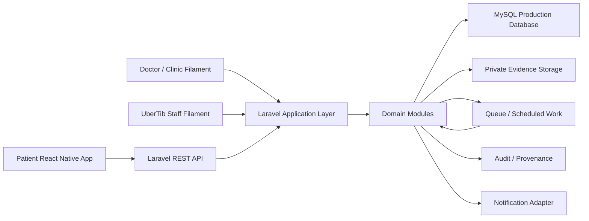
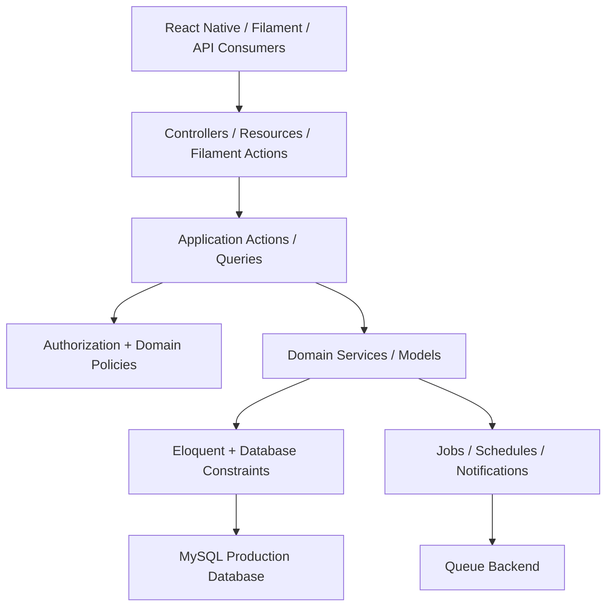
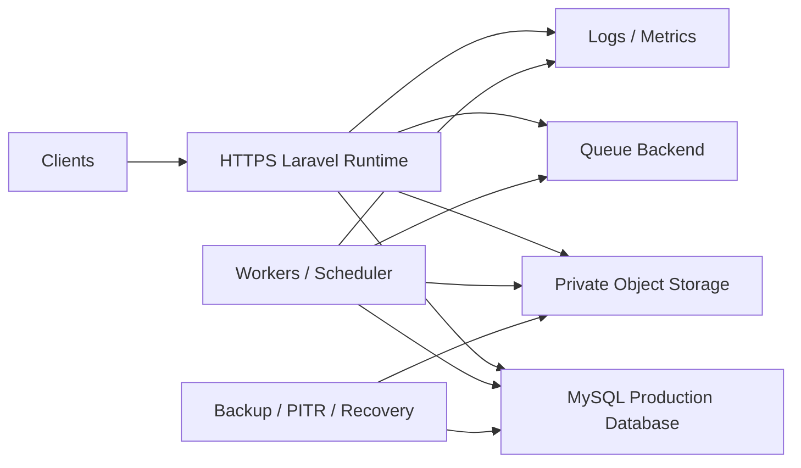

# UberTib System Architecture

**Phase:** 2 — Conditional Engineering Documentation  
**Mode:** Existing Repository  
**Baseline:** 2026-08-24  
**Product source:** `docs/PRD.md`  
**Technical source:** `docs/SDD.md`  
**Registry:** `docs/README.md`

## 1. Purpose

This document owns the system-level architecture for UberTib V1. Product behavior remains canonical in `docs/PRD.md`; detailed feature design remains canonical in `docs/SDD.md`.

UberTib is an Aleppo-first dental-service coordination platform. V1 must support governed service publication, provider eligibility, booking, treatment-case records, immutable accepted terms, external financial-event records, reviews, claims, policy versioning, audit, operations, and launch readiness.

Two boundaries are mandatory:

- production medical behavior requires licensed clinical approval;
- V1 records external financial activity but performs no electronic money movement.

`Q-PLATFORM-001` remains a Blocker for claiming complete reconciliation against readable SRS v1.1 content.

## 2. Architecture Style

UberTib V1 is a **modular Laravel monolith** with one primary transactional application boundary and explicit domain modules inside the existing Laravel backend.

Primary platform shape:

- Laravel backend for domain behavior, REST APIs, authorization, persistence, queues, schedules, and audit.
- Filament for authorized staff/doctor operational workspaces where applicable.
- React Native patient application consuming versioned REST APIs.
- **MySQL production persistence**, as required by the approved recovery NFR; local/test environments may use other repository-supported engines where the relevant behavior is also verified against MySQL.
- Private file/object storage for sensitive evidence.
- Laravel queue workers for genuinely asynchronous work.
- Provider-neutral production infrastructure until `Q-OPS-001` is resolved; this open item covers hosting/provider/topology and managed-versus-self-hosted choices, not the production database engine.

Microservices, distributed transactions, CQRS, event sourcing, Kubernetes, and similar distributed patterns are not required by the current scope.

## 3. Verified Existing Baseline

The backend is under `UberTip-Backend/` and currently establishes these implementation conventions:

- PHP `^8.3` and Laravel `^13.17`.
- Filament `~5.0`.
- Eloquent models and migrations.
- Application Actions for use cases.
- Versioned `/api/v1` routing.
- API controllers/resources.
- Explicit enums/data objects.
- Pest tests.
- Spatie Permission, Activitylog, Media Library, and Laravel Data.

The current meaningful business slice contains service groups, services, versioned service definitions, clinical reviewer credential snapshots, and launch-gate decisions.

The verified public API surface currently contains only:

`GET /api/v1/catalog/service-groups`

Feature specifications and OpenAPI files are design/contract evidence, not proof of implementation. `CONFLICT-CATALOG-001` is retained as a permanently allocated **Resolved (2026-08-24)** historical conflict because the verified implemented catalog route and current OpenAPI now align; broader planned contracts remain separate from implementation evidence.

## 4. Current vs V1 Target

| Concern | Current verified state | V1 target |
|---|---|---|
| Catalog | Evaluation/publication slice | Governed production catalog |
| Eligibility | Incomplete | Versioned facts, evidence, S/P/H/I, gates, recalculation, search |
| Booking | Not implemented | Transactional lifecycle with revalidation and capacity protection |
| Clinical case | Not implemented | Plans, accepted snapshots, stages, evidence, follow-up, timeline |
| Financial records | Record-only configuration intent | Append-only external financial-event workflows |
| Reviews/claims | Not implemented | Verified reviews, appeals, claims, deadlines, human review |
| Identity/RBAC | Framework baseline | Deny-by-default scoped authorization |
| Audit | Supporting package available | Full sensitive-action and decision provenance |
| Policy | Service-definition versioning partial | Versioned policies across applicable domains |
| Operations | Filament shell | Queues, reporting, launch governance |
| Infrastructure | Provider not established | Provider-neutral application topology with MySQL production persistence satisfying the approved NFRs |

## 5. System Context

`NOTIFY` is an abstract provider boundary. Concrete OTP/SMS/notification providers remain unresolved under `Q-PLATFORM-003`.

## 6. Architecture Drivers

### Safety and fail-closed decisions

Service publication, provider eligibility, booking confirmation, authorization, and sensitive evidence access fail closed when mandatory facts, approvals, credentials, policies, or evidence are missing or invalid.

The existing 26 service records are provisional evaluation records and do not establish production clinical readiness. They are candidate patient-facing family content; their count and naming are not architectural constants.

### Configuration over code for operational policy

Catalog content, family-to-procedure mapping, service risk level, clinical prerequisites, inclusions and exclusions, evidence, follow-up and completion rules, price-display modes, price bands, market-calibration thresholds, additional-cost categories and approved modifiers, proposal validity, currency and rounding policy are governed data or versioned policy resolved at runtime. They are not enums, constants, seeder literals, controller conditions, panel-resource literals, mobile constants, or environment variables. This is an architecture driver because it decides where these values live and who may change them, and because the safety invariants below must stay enforced in code while everything around them becomes data.

### Historical reproducibility

Accepted terms, computed decisions, policy versions, launch approvals, financial records, and audit history must preserve the version and evidence that governed the original event.

### Zero-money-movement V1

No V1 module, API, job, Filament action, or integration may authorize, capture, hold, transfer, settle, or refund funds electronically. Financial functionality records externally performed events and their confirmation, dispute, review, or external-execution status only.

### One business-logic path

React Native APIs and Filament adapters use the same application/domain behavior. Business rules are not duplicated in controllers, API resources, Filament components, or client code.

### Safe retries and concurrency

Booking, acceptance, evidence, financial-event, claim, and decision commands must tolerate retry and concurrency without duplicate business effects.

### Least privilege

Authorization combines actor identity with role, organization/clinic/branch, case/resource relationship, workflow responsibility, and purpose where required.

## 7. Domain Modules

| Module | Responsibility |
|---|---|
| Identity & Access | Accounts, verification, MFA/OTP, guardian grants, staff scopes |
| Catalog | Service groups, patient-facing service families, detailed procedure items, versioned mapping, definitions, public visibility |
| Eligibility | Facts, evidence, provider price facts, market observations, calibrated price policy, S/P/H/I, confidence, gates, decisions, recalculation |
| Booking | Requests, responses, alternatives, confirmation, cancellation, no-show |
| Clinical Case | Treatment plans and structured lines, typed commercial modifiers, third-party costs, amendments, accepted clinical terms, stages, evidence, follow-up, timeline |
| Financial Records | Financial terms snapshots and append-only external financial events |
| Reviews | Verified experience reviews and appeals |
| Claims & Disputes | Refund/protection claims, evidence, deadlines, decisions, appeals |
| Operations | Work queues, reporting, launch readiness |
| Policy | Versioned/effective rule sets, commercial and currency policy, historical reproduction |
| Audit & Integrity | Provenance, immutable history, idempotency evidence |
| Platform | Files, queues, notifications, runtime and observability concerns |

Modules share the Laravel process and database but retain clear ownership of rules.

## 8. Application Layering

Adapters handle framework concerns. Application Actions coordinate use cases. Domain services/models own calculations and lifecycle invariants. Persistence enforces durable integrity and concurrency-sensitive constraints.

## 9. Command Lifecycle

For sensitive writes:

1. authenticate the actor;
2. resolve authorization scope;
3. validate request shape;
4. resolve the effective policy/snapshot/version;
5. validate current business preconditions;
6. resolve idempotency where required;
7. start a transaction when atomicity is required;
8. acquire locks or rely on uniqueness constraints where contention matters;
9. execute the application action;
10. persist primary state plus required snapshots/events/audit;
11. commit;
12. dispatch non-critical asynchronous effects after commit;
13. return a stable result.

A queued operation must not be represented as a completed business outcome unless the authoritative state has actually been committed.

## 10. Read Lifecycle

Public and authenticated reads use explicit query/application paths and return only audience-appropriate fields.

Public output must not expose private evidence, reviewer details, credential data, internal risk `I`, protected clinical payloads, or unnecessary internal database identifiers.

Cached discovery output cannot replace current validation at booking confirmation.

## 11. Data Architecture

### Relational source of truth

Core business state is relational and requires transactions, constraints, foreign keys, indexes, and locking where appropriate.

The approved `NFR-PLATFORM-002` / `NFR.02` baseline explicitly requires **MySQL point-in-time recovery** for production. Therefore **MySQL is the required production relational engine for the current V1 baseline**. `Q-OPS-001` does not leave the engine itself undecided; it leaves the hosting/provider/topology, managed-versus-self-hosted deployment, HA arrangement, backup implementation, and related operational choices unresolved.

SQLite may remain appropriate for local or isolated tests supported by the repository, but all engine-sensitive migrations, constraints, locking/concurrency behavior, and recovery assumptions must also be verified against MySQL before production release.

### Immutable history

The following require immutable or append-only handling where defined by their owning requirements:

- accepted treatment/financial snapshots;
- computed eligibility/classification decisions;
- activated policy versions used for historical reproduction, including price-band, commercial-option, and currency policy;
- activated catalog and procedure definition versions and the mapping versions they were used with;
- external financial events;
- launch-gate decisions;
- credential snapshots;
- sensitive audit records.

Corrections create linked later records rather than rewriting prior historical truth.

### Derived views

Unified case timelines, financial timelines, operational queues, and reports may use projections/read models for performance. They remain derived from authoritative domain records.

## 12. Private Evidence Architecture

Sensitive evidence remains private by default.

The architecture must support opaque object names, ownership metadata, type/content validation, SHA-256 integrity, quarantine until scanning succeeds, fresh authorization before download, short-lived access, audited downloads, retention rules, and legal holds.

Concrete storage and malware-scanning providers remain unresolved under `Q-OPS-001` and `Q-PLATFORM-003`.

## 13. Background Processing

Queues are appropriate for work that does not belong in the synchronous correctness boundary, including:

- notifications and reminders;
- malware scan orchestration;
- scheduled eligibility reevaluation;
- retryable background recalculation;
- deadline and escalation processing;
- report refresh where justified;
- retention/deletion processing.

Every job must be retry-safe. Critical state transitions must first be durably committed.

## 14. Caching

Caching is an optimization only.

The existing catalog endpoint demonstrates bounded public caching. Similar caching is acceptable for non-critical public reads.

Do not rely on stale cache for booking capacity, final booking confirmation, expired eligibility, permission revocation, claim/financial decision state, or launch readiness after approval expiry/revocation.

No production cache technology is mandated yet.

## 15. Authorization

Authorization is deny-by-default and evaluates:

1. authentication;
2. coarse role/permission capability;
3. organization/clinic/branch scope;
4. case/resource relationship;
5. workflow responsibility;
6. purpose/subject-matter restrictions where required;
7. separation of duties for sensitive decisions.

Spatie Permission may provide coarse capabilities, but domain scope must be enforced by policies, actions, and scoped queries.

Equivalent rules apply to REST, Filament, jobs, private files, exports, search, queues, and notifications.

## 16. API Architecture

External/mobile contracts remain versioned under `/api/v1` unless a later approved contract version changes that convention.

API rules:

- thin controllers;
- application actions for mutations;
- explicit resources/data objects;
- stable errors documented in `docs/api/ERROR_CATALOG.md`;
- contracts documented in `docs/api/API_CONTRACTS.md`;
- explicit idempotency for retry-prone commands;
- server-side authorization;
- no sensitive field exposure based only on client-side hiding;
- implementation verified against real routes/tests.

## 17. Filament Architecture

Filament is an adapter to the same application layer used by APIs. It must not maintain separate copies of eligibility formulas, booking state rules, financial-event logic, claim decision logic, policy activation rules, or scoped authorization semantics.

The existing panel shell does not establish authoritative business screens. UX layout/navigation/components remain owned by the later UX pipeline.

## 18. Notifications

Notifications are side effects of authoritative domain events or scheduled obligations, not authoritative business state.

Delivery metadata should distinguish queued, attempted, delivered/accepted where available, failed, retrying, and permanently failed/escalated states.

Provider selection remains unresolved, so `docs/integrations/INTEGRATION_CONTRACTS.md` remains omitted until a concrete contract exists.

## 19. Observability

Required privacy-safe signals include:

- correlation IDs;
- application errors;
- queue age/retries/failures;
- deadline breaches;
- eligibility recalculation delay;
- scan backlog/failure;
- notification failure;
- availability and latency;
- backup/restore status;
- integrity/reproduction exceptions.

Ordinary logs must not contain OTP values, credential secrets, private evidence locations, temporary download links, or protected health payloads.

## 20. Provider-Neutral Deployment Topology

`Q-OPS-001` prevents selecting a hosting provider or concrete MySQL deployment product/topology in this document; it does not reopen the approved MySQL engine requirement.

No cloud vendor, container platform, managed MySQL product, CDN, or cache product is selected here. The MySQL engine itself is fixed by the approved production recovery requirement; its concrete service/provider and operational topology remain open.

## 21. Availability and Recovery

The production architecture must support the approved targets:

- 99.5% monthly availability excluding approved maintenance;
- **MySQL point-in-time recovery**;
- RPO ≤15 minutes;
- RTO ≤4 hours;
- quarterly restore verification;
- recovery of relational state and private evidence;
- preservation of required quarantine/scan metadata, deletion tombstones, and legal holds.

Provider-specific implementation belongs in `docs/ops/INFRASTRUCTURE.md` after `Q-OPS-001` is resolved or with explicitly marked provider-neutral alternatives. Provider neutrality must not weaken or substitute the MySQL PITR requirement.

## 22. Performance and Scale

The modular monolith must support the `NFR-PLATFORM-001` engineering envelope:

- ≥10,000 registered identities;
- 3,000 monthly active users;
- 500 daily active users;
- 100 concurrent authenticated sessions;
- ordinary reads p95 ≤500 ms;
- ordinary writes p95 ≤800 ms;
- provider search p95 ≤1 second;
- 75 requests/second burst within approved thresholds;
- no overbooking during 100 concurrent attempts for one slot.

The low-thousands Aleppo launch expectation and the 10,000-identity engineering envelope remain explicitly distinguished under `Q-PLATFORM-004`.

Scaling should first use sound schema/indexing, bounded queries, safe background processing, and runtime capacity. Distributed domain services require measured evidence before introduction.

## 23. Medical Governance Boundary

Production clinical behavior must preserve versioned rules, evidence provenance, licensed reviewer approval, approval expiry/revocation, immutable decision history, and fail-closed publication/booking behavior.

The software may evaluate configured rules, but it must not present provisional configuration as licensed clinical truth or generate autonomous diagnosis/treatment plans.

Configurability does not weaken this boundary. A change to a procedure's clinical scope, risk level, provider qualification, equipment requirement, required evidence, clinically meaningful inclusion or exclusion, follow-up, completion, escalation, or safety gate is Admin-editable **as a draft only**; activation requires a licensed clinical reviewer holding a current credential. Catalog and commercial administrators are separate authorities from that reviewer, and no generic administrator role substitutes for either.

`Q-CATALOG-001` and `Q-ELIG-001` remain production-governance constraints.

## 24. Financial Governance Boundary

Allowed V1 architecture:

- immutable financial terms snapshots;
- external payment/refund assertions;
- confirmations and disputes;
- refund/compensation decisions;
- external execution records;
- operational follow-up;
- evidence and audit.

Excluded from V1 architecture:

- payment capture;
- wallet/custody/escrow;
- payout/settlement;
- platform-executed refunds;
- platform-funded protection.

Future money-movement capability requires a new authoritative product decision and separate security, compliance, integration, and migration design.

## 25. Open Architecture Items

| ID | Severity | Impact |
|---|---|---|
| Q-PLATFORM-001 | Blocker | Full SRS reconciliation cannot yet be certified. |
| Q-CATALOG-001 | Major | Provisional service records are not production clinical approval. |
| Q-ELIG-001 | Major | Production S/P/H/I policies require licensed approval. |
| Q-PLATFORM-002 | Major | Retention values need final legal/compliance validation. |
| Q-OPS-001 | Major | Hosting/provider/topology remains unresolved, including managed-versus-self-hosted MySQL deployment, HA, backup implementation, cache/queue/storage, and release infrastructure; the production database engine remains MySQL. |
| Q-PLATFORM-003 | Major | OTP/MFA, malware scanning, evidence-storage and notification providers remain unresolved. |
| Q-PLATFORM-004 | Minor | Launch population and capacity headroom remain separately stated. |
| CONFLICT-PLATFORM-001 | Major | Historical stack planning cannot override verified current package constraints. |
| CONFLICT-PLATFORM-002 | Major | Some `.spec` architecture statements await final NFR vs DR/TD classification. |

`CONFLICT-CATALOG-001` remains permanently allocated but is **Resolved (2026-08-24)**: the verified implemented catalog route and current OpenAPI contract align. It is not an open architecture blocker.

## 26. Implementation Rules

1. Extend existing Laravel conventions before adding new abstractions.
2. Keep one transactional source of truth unless measured requirements prove otherwise.
3. Keep business behavior out of presentation adapters.
4. Use database constraints/transactions for concurrency-sensitive invariants.
5. Treat retries as normal for sensitive commands.
6. Correct immutable history by new linked records, never silent rewrites.
7. Fail closed for readiness, eligibility, authorization, and private evidence.
8. Do not introduce V1 money-movement capability.
9. Do not treat evaluation catalog data as production clinical approval, and do not let a visibility flag promote it.
10. Do not claim routes, providers, integrations, or infrastructure that are not established by evidence.
11. Keep hosting and infrastructure services provider-neutral while `Q-OPS-001` is open, while preserving MySQL as the approved production database engine.
12. Do not implement unresolved `Q-*` or `CONFLICT-*` as confirmed behavior.
13. Represent expected operational change as governed data or versioned policy and keep safety/integrity invariants in code. Do not build a general rule-scripting engine, dynamic code execution, database-stored code, or a generic workflow or state-machine designer in order to avoid all future development.

## 27. Related Canonical Documents

- `docs/PRD.md` — product behavior.
- `docs/SDD.md` — detailed technical design.
- `docs/architecture/COMPONENT_DESIGN.md` — component/module design.
- `docs/api/API_CONTRACTS.md` — API contracts.
- `docs/api/ERROR_CATALOG.md` — stable errors.
- `docs/database/ERD.md` — persistent data model.
- `docs/database/DFD.md` — data movement.
- `docs/domain/STATE_MACHINES.md` — lifecycle transitions.
- `docs/domain/PERMISSIONS_MATRIX.md` — authorization matrix.
- `docs/ops/CONFIGURATION.md` — runtime configuration.
- `docs/ops/INFRASTRUCTURE.md` — deployment/recovery.
- `docs/ops/MONITORING.md` — monitoring.

This file owns only system-level architecture. Endpoint fields, table schemas, lifecycle transitions, permissions, tests, and implementation tasks belong to their respective canonical documents.