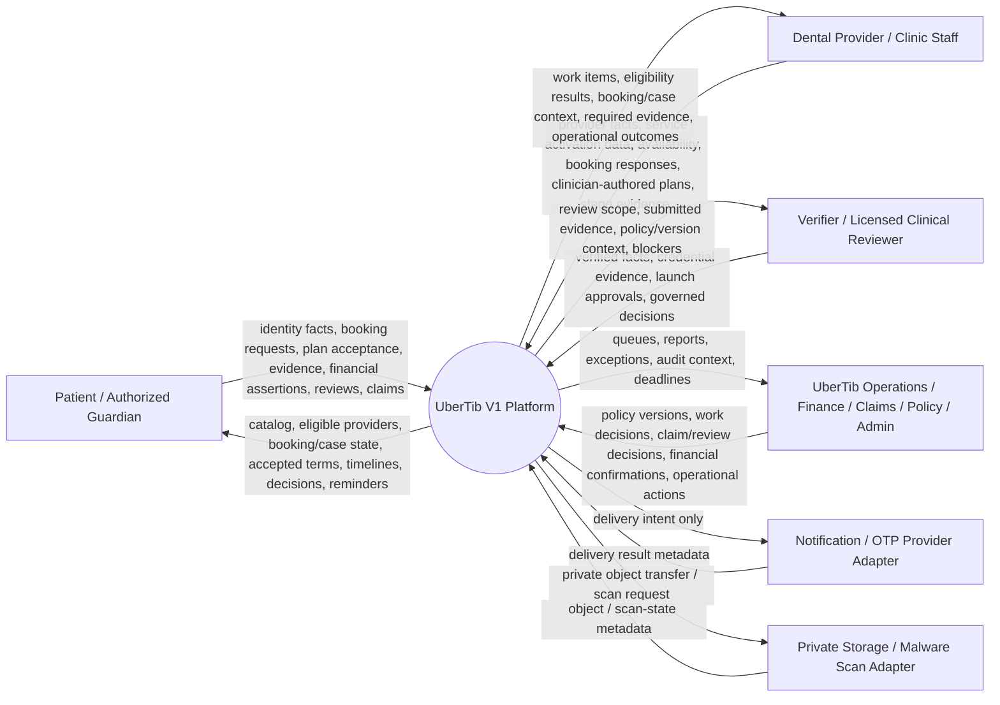
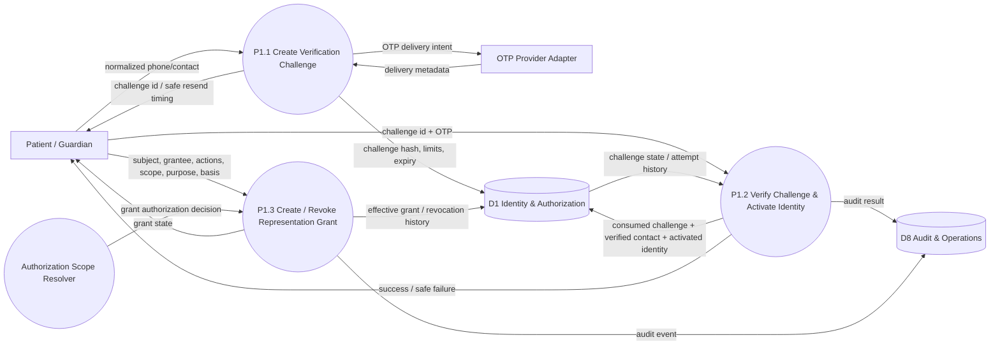
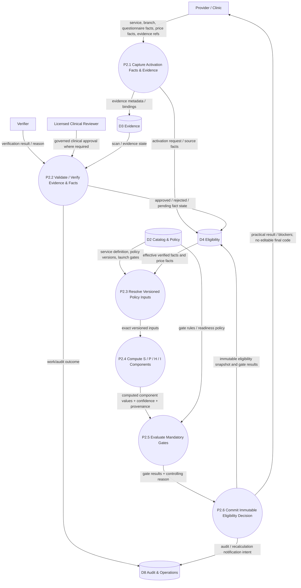
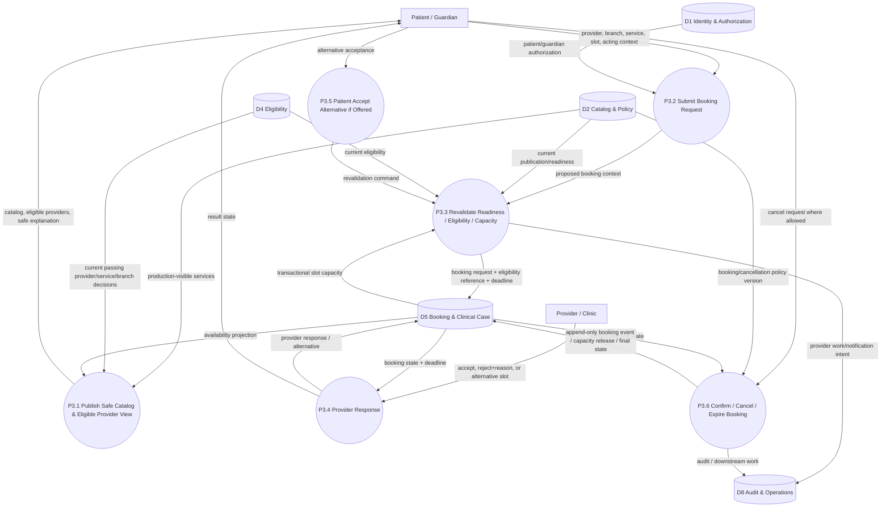
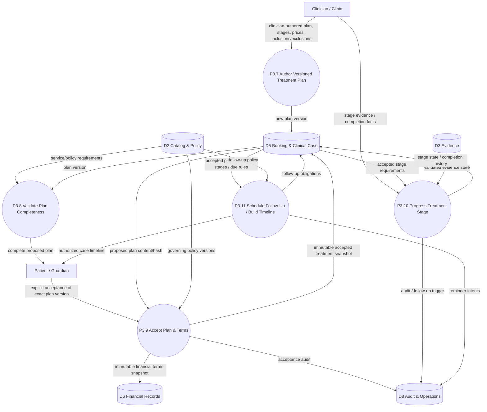
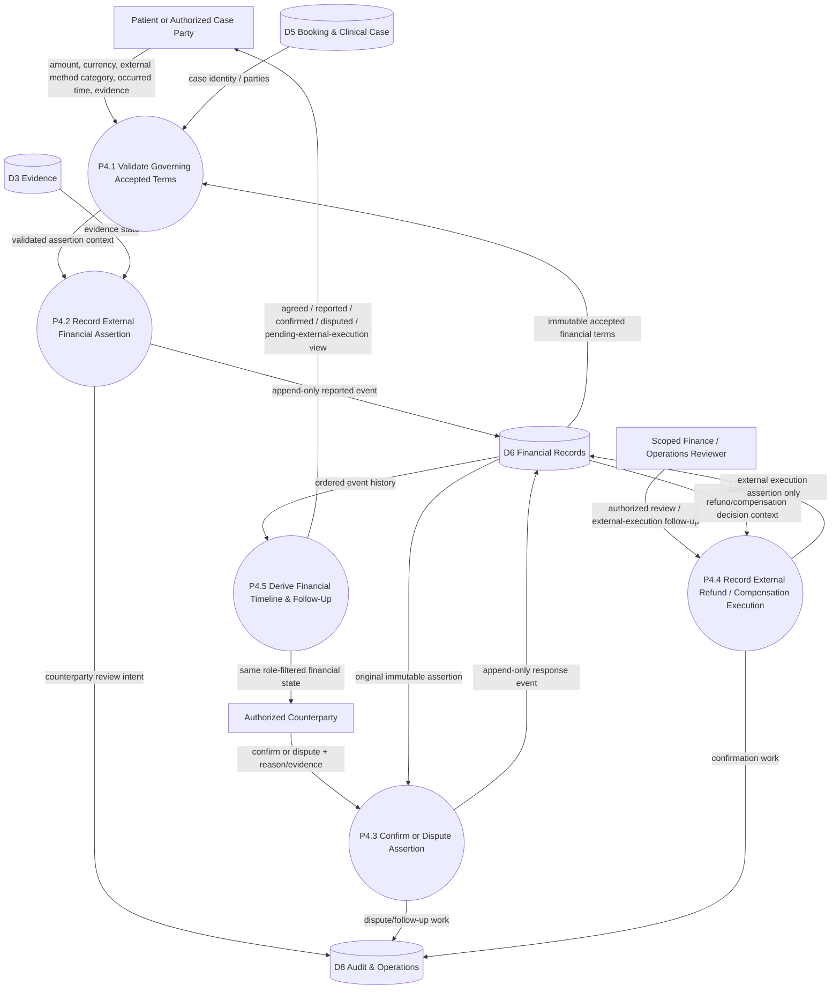
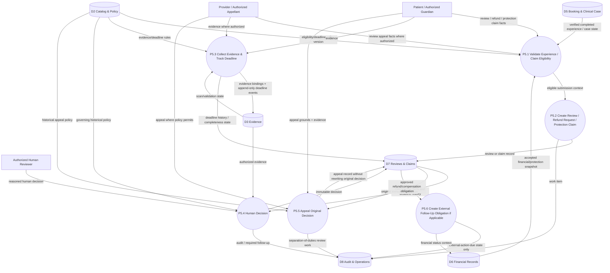
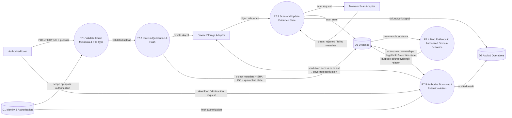
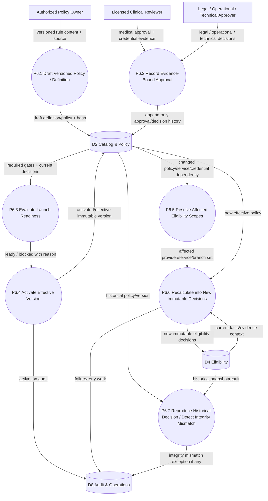

# UberTib Data Flow Diagrams

**Phase:** 2 — Conditional Engineering Documentation  
**Mode:** Existing Repository  
**Baseline:** 2026-08-24  
**Product source:** `docs/PRD.md`  
**Technical sources:** `docs/SDD.md`, `docs/architecture/SYSTEM_ARCHITECTURE.md`, `docs/architecture/COMPONENT_DESIGN.md`  
**Data source:** `docs/database/ERD.md`  
**API source:** `docs/api/API_CONTRACTS.md`  
**Registry:** `docs/README.md`

## 1. Purpose and Scope

This document defines the information flows required by UberTib V1. It complements `docs/database/ERD.md`: the ERD owns relational structure, while this file shows how information moves between actors, application processes, and authoritative data stores.

The diagrams intentionally focus on flows where ordering, provenance, authorization, or information transformation matters. Trivial create/read/update/delete interactions are omitted.

Two product boundaries apply to every flow:

- production medical behavior requires licensed clinical approval and versioned governance;
- UberTib V1 records externally performed financial activity but performs no electronic payment, wallet, escrow, settlement, payout, custody, or refund transfer.

`Q-PLATFORM-001` remains a Blocker for claiming complete reconciliation against readable SRS v1.1 text. `Q-CATALOG-001`, `Q-ELIG-001`, `Q-PLATFORM-002`, `Q-PLATFORM-003`, and `Q-OPS-001` continue to govern production clinical, retention, provider, and infrastructure details.

## 2. DFD Conventions

- **External entity** — a person, role group, or provider outside the UberTib application process boundary.
- **Process** — an UberTib application/domain capability that transforms, validates, or routes information.
- **Data store** — an authoritative or durable logical store represented physically by one or more ERD tables.
- **Derived view** — rebuildable/read-only information assembled from authoritative stores.
- **Provider adapter** — an external delivery/storage/scanning boundary whose concrete vendor is not selected.

The diagrams use logical stores rather than duplicating every table name. Section 4 maps each logical store to the ERD.

## 3. System Context DFD

There is intentionally **no payment gateway or money-transfer entity** in the context diagram.

## 4. Logical Data Stores

| Store | Logical responsibility | Main ERD tables |
|---|---|---|
| D1 — Identity & Authorization | identities, verified contacts, guardian grants, staff/provider scope | `users`, `identity_contacts`, `contact_verification_challenges`, `guardian_grants`, `providers`, `clinics`, `branches`, `provider_branch_assignments`, `staff_scope_grants` |
| D2 — Catalog & Policy | stable services, versioned definitions, policy versions, launch governance | `service_groups`, `services`, `service_definitions`, `policy_versions`, `clinical_reviewer_credentials`, `service_launch_gates` |
| D3 — Evidence | private evidence metadata, scan state, resource binding, legal hold | `evidence_items`, `evidence_bindings`, `legal_holds` |
| D4 — Eligibility | source facts, price facts, activation requests, computed immutable decisions/gates | `service_activation_requests`, `approved_facts`, `provider_service_prices`, `eligibility_decisions`, `eligibility_gate_results` |
| D5 — Booking & Clinical Case | capacity, booking lifecycle, treatment/case/follow-up history | `appointment_slots`, `bookings`, `booking_alternatives`, `booking_events`, `cases`, `treatment_plan_versions`, `treatment_plan_stages`, `accepted_treatment_snapshots`, `case_treatment_stages`, `follow_ups` |
| D6 — Financial Records | immutable accepted financial terms and append-only external financial facts | `financial_terms_snapshots`, `financial_events` |
| D7 — Reviews & Claims | verified reviews, appeals, claims, deadlines, human decisions | `reviews`, `review_appeals`, `claims`, `claim_deadline_events`, `claim_decisions`, `claim_appeals` |
| D8 — Audit & Operations | idempotency, work queues, audit/provenance, notifications, integrity exceptions | `work_items`, `audit_events`, `idempotency_records`, `integrity_exceptions`, `notification_intents` |

Framework cache/session/job tables are operational implementation details and are not separate business data stores in this DFD.

## 5. Level 0 DFD — V1 Business Information Flow

```mermaid
flowchart TD
    PATIENT[Patient / Guardian]
    PROVIDER[Provider / Clinic]
    REVIEWER[Verifier / Clinical Reviewer]
    STAFF[UberTib Staff]

    P1((P1 Identity & Access))
    P2((P2 Catalog, Evidence & Eligibility))
    P3((P3 Booking & Clinical Case))
    P4((P4 External Financial Records))
    P5((P5 Reviews, Claims & Appeals))
    P6((P6 Policy, Operations & Audit))

    D1[(D1 Identity & Authorization)]
    D2[(D2 Catalog & Policy)]
    D3[(D3 Evidence)]
    D4[(D4 Eligibility)]
    D5[(D5 Booking & Clinical Case)]
    D6[(D6 Financial Records)]
    D7[(D7 Reviews & Claims)]
    D8[(D8 Audit & Operations)]

    PATIENT -->|verification / representation data| P1
    P1 -->|authenticated / scoped context| PATIENT
    PROVIDER -->|identity / scope data| P1
    STAFF -->|role and scope administration| P1
    P1 <--> D1

    PATIENT -->|service discovery criteria| P2
    PROVIDER -->|activation facts, prices, evidence| P2
    REVIEWER -->|fact verification / clinical approvals| P2
    P2 -->|catalog / eligibility explanation| PATIENT
    P2 -->|eligibility / blockers| PROVIDER
    P2 <--> D2
    P2 <--> D3
    P2 <--> D4

    PATIENT -->|booking request / acceptance / cancellation| P3
    PROVIDER -->|booking response / treatment plan / stage completion| P3
    P3 -->|booking / case / treatment state| PATIENT
    P3 -->|case work / patient decisions| PROVIDER
    P3 <--> D4
    P3 <--> D5
    P3 <--> D3

    PATIENT -->|external payment/refund assertions| P4
    PROVIDER -->|counterparty confirmation/dispute| P4
    STAFF -->|authorized financial review / external-action follow-up| P4
    P4 -->|financial timeline / confirmation state| PATIENT
    P4 -->|financial timeline / follow-up state| PROVIDER
    P4 <--> D5
    P4 <--> D6
    P4 <--> D3

    PATIENT -->|review / refund request / protection claim / appeal| P5
    PROVIDER -->|review appeal / claim evidence where authorized| P5
    STAFF -->|human review / decision / appeal review| P5
    P5 -->|claim, review and appeal state| PATIENT
    P5 -->|decision / required response state| PROVIDER
    P5 <--> D5
    P5 <--> D6
    P5 <--> D7
    P5 <--> D3

    REVIEWER -->|governed approval / decision| P6
    STAFF -->|policy / work assignment / escalation| P6
    P6 -->|work queues / exceptions / reporting| STAFF
    P6 <--> D2
    P6 <--> D8

    P1 -->|audit / security events| D8
    P2 -->|audit / work / notification intents| D8
    P3 -->|audit / work / notification intents| D8
    P4 -->|audit / work / notification intents| D8
    P5 -->|audit / work / notification intents| D8
```

## 6. Level 1 — Identity Verification and Representation

**Requirements:** FR-IDENTITY-002–003, NFR-IDENTITY-001–002, NFR-AUDIT-001–002.  
**APIs:** API-IDENTITY-001–005 where the mobile/API path is used.

This flow matters because authentication, patient ownership, and guardian acting identity must remain separate and auditable.

**Critical rules**

- OTP values are never stored or returned in plaintext.
- Resend invalidates the prior OTP without silently resetting accumulated failure controls.
- A guardian acts as the guardian identity; the patient remains the case owner.
- Revocation affects future authorization immediately while historical actions remain attributed and auditable.

## 7. Level 1 — Provider Service Activation and Eligibility

**Requirements:** FR-ELIG-002–017, FR-POLICY-001–002, FR-OPS-003, NFR-AUDIT-003.  
**APIs:** API-ELIG-002–004 where externally exposed.

This flow is central to the project because providers supply facts/evidence while the backend derives classification and eligibility. No actor directly selects final `S`, `P`, `H`, or `I` outcomes.

**Critical rules**

- `PENDING_EVALUATION` is different from scientific grade `F`.
- `I` is internal and not exposed as a patient rating.
- Production S/P/H/I formulas, weights, thresholds, and defaults remain governed by `Q-ELIG-001`.
- A passing component cannot override a failing or pending mandatory gate.
- Corrections create new facts and a new eligibility decision rather than rewriting historical decisions.

## 8. Level 1 — Patient Discovery and Booking

**Requirements:** FR-CATALOG-001, FR-ELIG-001, FR-ELIG-005–006, FR-BOOKING-001–003, NFR-AUDIT-002.  
**APIs:** API-CATALOG-001, API-ELIG-001–002, API-BOOKING-001–005.

**Critical rules**

- Search/discovery output is not sufficient for booking correctness; final confirmation revalidates safety-critical facts.
- Capacity protection is transactional and must resist concurrent overbooking.
- A provider alternative is not confirmed until patient acceptance and revalidation succeed.
- Cancellation/no-show consequences are recorded as later events and do not rewrite previous clinical or financial history.

## 9. Level 1 — Treatment Plan Acceptance and Case Progress

**Requirements:** FR-CLINICAL-001–005, FR-FINANCE-001, NFR-AUDIT-003.  
**APIs:** API-CLINICAL-001–004, API-FINANCE-001.

**Critical rules**

- The treatment plan is clinician-authored; UberTib does not autonomously diagnose or generate a treatment plan.
- Acceptance binds the exact plan version and creates immutable clinical and financial snapshots.
- Amendments create linked new versions/snapshots rather than editing previously accepted terms.
- Stage completion uses the accepted historical requirements, not mutable current defaults.

## 10. Level 1 — External Financial Event Recording

**Requirements:** FR-FINANCE-001–007, NFR-FINANCE-001, NFR-AUDIT-002–003.  
**APIs:** API-FINANCE-001–005.

This is a record-and-confirmation flow only. The platform never initiates the monetary transaction described by the record.

**Explicitly absent flows**

- no payment authorization request;
- no card/bank credential submission for payment execution;
- no wallet or balance update;
- no escrow/custody movement;
- no payout/settlement instruction;
- no UberTib-executed refund.

## 11. Level 1 — Verified Review, Refund Request, Claim, and Appeal

**Requirements:** FR-REVIEWS-001–002, FR-CLAIMS-001–005, FR-FINANCE-004, FR-FINANCE-007.  
**APIs:** API-REVIEWS-001–002, API-CLAIMS-001–005.

**Critical rules**

- Review `R` is separate from `S/P/H/I`.
- One active review is tied to one verified eligible experience according to policy.
- Sensitive medical/legal/high-impact financial decisions are human-attributed.
- Deadline extensions/pauses create additional events and do not erase the original deadline.
- An approved refund/compensation decision may create an externally executable obligation but never causes UberTib to transfer funds.

## 12. Level 1 — Private Evidence Intake and Access

**Requirements:** NFR-PLATFORM-003, NFR-PLATFORM-004 and evidence-bearing FRs.  
**Contract status:** detailed `API-PLATFORM-*` transfer contract remains intentionally unallocated pending `Q-PLATFORM-003` / `Q-OPS-001`.

No provider-specific presigned, multipart, chunked, or resumable protocol is defined here.

## 13. Level 1 — Policy Activation, Launch Readiness, and Recalculation

**Requirements:** FR-POLICY-001–002, FR-OPS-003, FR-ELIG-003–006, NFR-AUDIT-003.

The current implemented service-definition/launch-gate slice is evidence for this pattern. Production medical publication still depends on licensed clinical approval; the 26 evaluation records are not production-ready merely because they exist in the database.

## 14. Derived Read Flows

The following outputs are derived views and are not separate authoritative stores:

| Derived output | Authoritative inputs | Requirements |
|---|---|---|
| Eligible provider search | D2 + D4 + relevant D5 availability | FR-ELIG-001, FR-ELIG-005–006 |
| Unified case timeline | D5 + authorized D6 + D7 metadata + D8 attribution where required | FR-CLINICAL-005, FR-AUDIT-002 |
| Financial timeline | D6 + accepted terms context from D5 | FR-FINANCE-006–007 |
| Operations queues | underlying D2/D3/D4/D5/D6/D7 state + D8 coordination records | FR-OPS-001 |
| Operational reports | authoritative domain records with explicit filters/time windows | FR-OPS-002 |

A stale projection may improve read performance but must never override synchronous validation for booking confirmation, permission revocation, expired eligibility, launch readiness, or sensitive decisions.

## 15. Audit and Notification Flow Rule

For all Level 1 processes:

1. authoritative domain state is committed first when the business outcome must be durable;
2. required audit/provenance/idempotency information is committed atomically where necessary;
3. non-critical notification delivery is dispatched after commit;
4. notification delivery failure changes delivery/operations state, not the already committed business decision;
5. logs and notification payloads must exclude secrets, OTP values, private storage paths, temporary access links, and unnecessary clinical/financial payloads.

## 16. Authorization Boundaries

Information flow is denied by default. Every protected flow resolves the actor plus applicable organization/clinic/branch, patient/case relationship, guardian grant, work responsibility, purpose, and separation-of-duties requirement.

Cross-scope requests may be returned as not found when existence itself is protected. Client-side hiding is never an authorization control.

## 17. Weak-Connectivity Behavior

`NFR-PLATFORM-006` affects information transport but not authoritative truth:

- clients may retry safe reads and idempotent writes;
- retry-prone writes use the idempotency rules from `API_CONTRACTS.md`;
- drafts may be retained client-side or server-side where the final workflow allows it, but a draft is not a committed booking, accepted treatment plan, financial event, or claim;
- asynchronous upload/retry support must preserve evidence hash, ownership, purpose, and scan state;
- cached discovery data cannot replace booking-time validation.

## 18. Current Implementation vs Target DFD

| Area | Current verified information flow | V1 target status |
|---|---|---|
| Catalog | Public request → `ListVisibleServiceGroups` → existing catalog/launch data → API response | Existing narrow slice |
| Launch governance | Service definition + credential + launch-gate actions → append-only readiness state | Existing narrow slice / extend |
| Identity/guardian | Framework user baseline only | Proposed |
| Provider eligibility | Not verified as implemented | Proposed / clinically governed |
| Booking/case | Not verified as implemented | Proposed |
| Financial records | Configuration intent only; no money movement | Proposed record-only flow |
| Reviews/claims | Not verified as implemented | Proposed |
| Private evidence lifecycle | Supporting package capability exists; compliant business flow not verified | Proposed / provider-neutral |
| Operations/audit | Framework/package support exists; full V1 business flow not verified | Proposed / extend |

## 19. Requirement Coverage

| Flow | Primary coverage |
|---|---|
| Identity verification / representation | FR-IDENTITY-002–003, NFR-IDENTITY-001–002 |
| Provider activation / eligibility | FR-ELIG-002–017, FR-POLICY-001–002, FR-OPS-003 |
| Discovery / booking | FR-CATALOG-001, FR-ELIG-001, FR-BOOKING-001–003 |
| Treatment / case progress | FR-CLINICAL-001–005, FR-FINANCE-001 |
| External financial records | FR-FINANCE-001–007, NFR-FINANCE-001 |
| Reviews / claims / appeals | FR-REVIEWS-001–002, FR-CLAIMS-001–005 |
| Evidence lifecycle | NFR-PLATFORM-003–004 plus evidence-bearing FRs |
| Policy / launch / recalculation | FR-POLICY-001–002, FR-OPS-003, FR-ELIG-003–006 |
| Audit / retries / notifications | FR-AUDIT-001–003, NFR-AUDIT-001–003, NFR-PLATFORM-008 |

## 20. Open Items Affecting Data Flow

| ID | Severity | DFD impact |
|---|---|---|
| Q-PLATFORM-001 | Blocker | Complete SRS-to-flow reconciliation cannot yet be certified. |
| Q-CATALOG-001 | Major | Production catalog flow cannot treat provisional records as clinically approved. |
| Q-ELIG-001 | Major | Production S/P/H/I calculation inputs/thresholds remain clinically governed. |
| Q-PLATFORM-002 | Major | Retention/destruction flow needs final legal/compliance validation. |
| Q-OPS-001 | Major | Concrete hosting/storage/queue topology remains provider-neutral. |
| Q-PLATFORM-003 | Major | OTP/MFA, storage, malware-scan and notification provider contracts remain unresolved. |
| CONFLICT-PLATFORM-001 | Major | Historical stack assumptions do not override the verified Laravel/PHP baseline. |
| CONFLICT-CATALOG-001 | Major | Registry wording should be reviewed because current route and current OpenAPI now align. |
| CONFLICT-PLATFORM-002 | Major | Final NFR vs DR/TD classification awaits complete SRS reconciliation. |

## 21. Document Boundary

This file does not define:

- database columns or indexes beyond what is owned by `docs/database/ERD.md`;
- exact lifecycle statuses, which are owned by `docs/domain/STATE_MACHINES.md`;
- role/action authorization decisions, which are owned by `docs/domain/PERMISSIONS_MATRIX.md`;
- endpoint field-level contracts, which are owned by `docs/api/API_CONTRACTS.md`;
- stable error behavior, which is owned by `docs/api/ERROR_CATALOG.md`;
- screen layout, navigation, information architecture, or visual design, which remain deferred to the UX pipeline.

No new canonical `DR-*`, `TD-*`, `ASM-*`, `API-*`, `ERR-*`, or `SCR-*` identifiers are introduced by this DFD.