# UberTib Entity Relationship Design

**Phase:** 2 — Conditional Engineering Documentation  
**Mode:** Existing Repository  
**Baseline:** 2026-08-23  
**Product source:** `docs/PRD.md`  
**Technical sources:** `docs/SDD.md`, `docs/architecture/COMPONENT_DESIGN.md`, `docs/api/API_CONTRACTS.md`  
**Registry:** `docs/README.md`

## 1. Purpose and Scope

This document owns the relational data design for UberTib V1. It distinguishes the schema verified in the current Laravel repository from the minimum proposed relational entities needed by the confirmed product requirements.

The database remains the transactional source of truth for identities and authorization scope, catalog publication, provider/service/branch eligibility, booking, clinical cases, immutable accepted terms, external financial-event records, reviews, claims, operations, policy versions, audit, and evidence metadata.

Two boundaries are non-negotiable:

- the 26 seeded dental service records are provisional evaluation records and candidate patient-facing family content; they do not by themselves establish production medical readiness, and their count is not a schema constant;
- operational catalog, pricing, commercial, and currency policy live in governed rows, not in application constants; the safety invariants in section 14 remain enforced in schema and code;
- V1 records externally performed financial activity and must not contain payment capture, wallet, escrow, settlement, payout, or platform refund-execution data models.

`Q-PLATFORM-001` still blocks a claim of complete end-to-end SRS reconciliation. `Q-CATALOG-001`, `Q-ELIG-001`, `Q-PLATFORM-002`, and `Q-OPS-001` continue to govern production medical, retention, provider-selection, and infrastructure details. `Q-PLATFORM-003` is Resolved for the provider-neutral evidence-transfer contract.

## 2. Schema Status Vocabulary

- **Existing** — verified from current migrations in `UberTip-Backend/database/migrations/`.
- **Proposed** — required by confirmed V1 behavior but no current migration was verified.
- **Logical** — required data shape; the final physical table may be provided by an installed package if it satisfies the documented integrity and audit requirements.
- **Governed** — may be populated for production only after the applicable clinical/legal/operational approval.

Proposed table and column names are engineering design, not product requirements. They may be refined before implementation without changing the owning `FR-*` / `NFR-*` behavior.

## 3. Relational Conventions for Proposed Tables

Unless a table section states otherwise:

- primary key: `id BIGINT UNSIGNED AUTO_INCREMENT PRIMARY KEY`;
- client-addressable business resources also receive `public_id CHAR(36) NOT NULL UNIQUE` so external APIs need not expose sequential database IDs;
- mutable records include `created_at TIMESTAMP NOT NULL` and `updated_at TIMESTAMP NOT NULL`;
- append-only records include `created_at TIMESTAMP NOT NULL` and no business update path;
- monetary values use `DECIMAL(18,2)` plus an explicit ISO-style `currency VARCHAR(3)`; they are records only and never platform-held balances;
- policy/decision snapshots that must be reproduced may use JSON for immutable structured content while searchable identity/state fields remain relational columns;
- destructive cascades are avoided for historical medical, financial, claim, policy, launch, and audit data; references normally use `RESTRICT` once history exists;
- foreign keys and durable unique constraints protect invariants in addition to application validation.

## 4. Verified Existing Schema

### 4.1 `users` — Existing

**Requirements served:** current identity baseline; future FR-IDENTITY-001–003 extension.

| Column | Type / Nullability / Default | Reason |
|---|---|---|
| `id` | BIGINT UNSIGNED, PK | Current Laravel identity key. |
| `name` | VARCHAR, NOT NULL | Existing display/name field. |
| `email` | VARCHAR, NOT NULL, UNIQUE | Existing login/contact identity. |
| `email_verified_at` | TIMESTAMP, NULL | Existing verification marker. |
| `password` | VARCHAR, NOT NULL | Existing credential storage. |
| `remember_token` | VARCHAR(100), NULL | Laravel remember-token support. |
| `created_at`, `updated_at` | TIMESTAMP, NULL in Laravel default migration | Existing timestamps. |

**Existing supporting tables:** `password_reset_tokens` and `sessions` are framework authentication/session support, not business-domain entities in this ERD.

**Migration impact:** retain the table. Phone/contact verification should be added through proposed contact entities rather than overloading the existing email field.

### 4.2 `service_groups` — Existing

**Requirements:** FR-CATALOG-001.

| Column | Type / Nullability / Default | Reason |
|---|---|---|
| `id` | BIGINT UNSIGNED, PK | Internal relation key. |
| `code` | VARCHAR(3), NOT NULL, UNIQUE | Stable public group identity such as G01–G04. |
| `name_ar` | VARCHAR, NOT NULL | Arabic-first catalog label. |
| `name_en` | VARCHAR, NOT NULL | Existing English label. |
| `description_ar` | TEXT, NOT NULL | Patient-readable Arabic description. |
| `display_order` | SMALLINT UNSIGNED, NOT NULL, UNIQUE | Stable group ordering. |
| `is_active` | BOOLEAN, NOT NULL, DEFAULT TRUE, INDEX | Operational visibility control. |
| `created_at`, `updated_at` | TIMESTAMP | Existing timestamps. |

**Integrity:** current database triggers make `code` immutable.

### 4.3 `services` — Existing, Patient-Facing Family Layer

**Requirements:** FR-CATALOG-001, FR-CATALOG-002.

This table **is** the patient-facing service family layer of the two-layer catalog. No rename or replacement is required, and existing stable identities are preserved. Detailed procedure content lives in `procedure_items` (section 6.9) and is joined by `service_family_procedure_maps` (section 6.11).

| Column | Type / Nullability / Default | Reason |
|---|---|---|
| `id` | BIGINT UNSIGNED, PK | Internal relation key. |
| `service_group_id` | BIGINT UNSIGNED, FK → `service_groups.id`, NOT NULL | Owning group. |
| `code` | VARCHAR(7), NOT NULL, UNIQUE | Stable public service code. |
| `slug` | VARCHAR, NOT NULL, UNIQUE | Stable URL/client identity. |
| `name_ar` | VARCHAR, NOT NULL | Arabic service name. |
| `name_en` | VARCHAR, NOT NULL | Existing English service name. |
| `description_ar` | TEXT, NOT NULL | Patient-readable purpose text. |
| `display_order` | SMALLINT UNSIGNED, NOT NULL | Ordering within group. |
| `is_active` | BOOLEAN, NOT NULL, DEFAULT TRUE, INDEX | Operational visibility. |
| `created_at`, `updated_at` | TIMESTAMP | Existing timestamps. |

**Constraints / indexes:** unique (`service_group_id`, `display_order`); FK delete is restricted. Current trigger makes `service_group_id`, `code`, and `slug` immutable.

**Governed mutability:** `name_ar`, `name_en`, `description_ar`, `display_order`, and `is_active` are Admin-maintainable governed data. `is_active` is the prospective visibility and retirement control; retirement never deletes a family that history references. Adding a family is an insert, not a code change; the `display_order` uniqueness constraint per group means reordering is a governed multi-row update rather than an ad-hoc edit.

**Migration note:** the immutable `service_group_id` trigger means regrouping a family that already has history requires a successor family plus a mapping supersession, not an in-place move. That is the intended behavior under `FR-CATALOG-002`, not a limitation to work around.

### 4.4 `service_definitions` — Existing / Governed

**Requirements:** FR-CATALOG-001, FR-POLICY-001, FR-OPS-003.

| Column | Type / Nullability / Default | Reason |
|---|---|---|
| `id` | BIGINT UNSIGNED, PK | Definition identity. |
| `service_id` | BIGINT UNSIGNED, FK → `services.id`, NOT NULL | Stable service being versioned. |
| `version` | INT UNSIGNED, NOT NULL | Service-local version. |
| `status` | VARCHAR(24), NOT NULL, INDEX | Definition lifecycle state. |
| `audience` | VARCHAR(16), NOT NULL, INDEX | Evaluation vs production audience. |
| `source_reference` | VARCHAR, NOT NULL | Provenance to source material/approval package. |
| `definition` | JSON, NOT NULL | Versioned structured service definition. |
| `content_hash` | CHAR(64), NOT NULL, INDEX | Integrity binding for approvals. |
| `effective_from` | TIMESTAMP, NULL | Effective start. |
| `effective_until` | TIMESTAMP, NULL | Effective end. |
| `created_at`, `updated_at` | TIMESTAMP | Existing timestamps. |

**Constraints / indexes:** unique (`service_id`, `version`); index (`status`, `audience`). Existing triggers prohibit funded protection in V1, protect activated/terminal definition immutability, and allow deletion only while draft.

### 4.5 `clinical_reviewer_credentials` — Existing / Governed

**Requirements:** FR-OPS-003, Q-CATALOG-001.

| Column | Type / Nullability / Default | Reason |
|---|---|---|
| `id` | BIGINT UNSIGNED, PK | Credential snapshot identity. |
| `supersedes_credential_id` | BIGINT UNSIGNED, NULL, UNIQUE, self-FK | Immutable replacement chain. |
| `user_id` | BIGINT UNSIGNED, FK → `users.id`, NOT NULL | Reviewed clinician identity. |
| `verified_by_user_id` | BIGINT UNSIGNED, FK → `users.id`, NOT NULL | Independent verifier. |
| `status` | VARCHAR(16), NOT NULL, INDEX | Credential snapshot state. |
| `issuing_authority` | VARCHAR, NOT NULL | Credential issuer. |
| `practice_scope` | VARCHAR(64), NOT NULL | Relevant professional scope. |
| `registration_hash` | CHAR(64), NOT NULL, INDEX | Privacy-preserving registration integrity. |
| `verification_evidence_reference` | VARCHAR, NOT NULL | Evidence reference used by current slice. |
| `verified_at` | TIMESTAMP, NOT NULL | Verification time. |
| `expires_at` | TIMESTAMP, NOT NULL, INDEX | Readiness expiry. |
| `created_at`, `updated_at` | TIMESTAMP | Existing timestamps. |

**Integrity:** current triggers forbid update and delete; corrections use superseding snapshots.

### 4.6 `service_launch_gates` — Existing / Governed

**Requirements:** FR-OPS-003.

| Column | Type / Nullability / Default | Reason |
|---|---|---|
| `id` | BIGINT UNSIGNED, PK | Append-only gate decision identity. |
| `service_definition_id` | BIGINT UNSIGNED, FK → `service_definitions.id`, NOT NULL | Definition being approved/rejected/revoked. |
| `type` | VARCHAR(16), NOT NULL | Gate category. |
| `sequence` | INT UNSIGNED, NOT NULL | Ordered decision history within gate type. |
| `status` | VARCHAR(16), NOT NULL, INDEX | Decision state. |
| `approved_by_user_id` | BIGINT UNSIGNED, FK → `users.id`, NULL | Accountable actor where applicable. |
| `clinical_reviewer_credential_id` | BIGINT UNSIGNED, FK → `clinical_reviewer_credentials.id`, NULL | Clinical approval credential snapshot. |
| `responsible_role` | VARCHAR(64), NOT NULL | Accountable role label. |
| `approved_content_hash` | CHAR(64), NULL | Binds approval to exact content. |
| `approval_evidence_reference` | VARCHAR, NULL | Current evidence reference. |
| `decision_reason` | TEXT, NULL | Reason for decision. |
| `decided_at` | TIMESTAMP, NULL | Effective decision time. |
| `expires_at` | TIMESTAMP, NULL, INDEX | Approval expiry where applicable. |
| `created_at`, `updated_at` | TIMESTAMP | Existing timestamps. |

**Constraints / indexes:** unique (`service_definition_id`, `type`, `sequence`); index (`service_definition_id`, `type`, `id`). Existing triggers make the table append-only.

## 5. Proposed Identity, Clinic, and Provider Schema

### 5.1 `identity_contacts` — Proposed

**Requirements:** FR-IDENTITY-002, NFR-IDENTITY-002.

Columns: `id`; `user_id BIGINT UNSIGNED NOT NULL FK users`; `type VARCHAR(16) NOT NULL`; `value_normalized VARCHAR(191) NOT NULL`; `verified_at TIMESTAMP NULL`; `is_primary BOOLEAN NOT NULL DEFAULT FALSE`; timestamps.

**Constraints / indexes:** unique (`type`, `value_normalized`) prevents duplicate active identity for the same normalized contact; index (`user_id`, `is_primary`) supports account bootstrap.

### 5.2 `contact_verification_challenges` — Proposed

**Requirements:** FR-IDENTITY-002, NFR-IDENTITY-002.

Columns: `id`; `public_id CHAR(36) UNIQUE NOT NULL`; `contact_type VARCHAR(16) NOT NULL`; `contact_value_normalized VARCHAR(191) NOT NULL`; `code_hash VARCHAR(255) NOT NULL`; `attempt_count SMALLINT UNSIGNED NOT NULL DEFAULT 0`; `send_count_window SMALLINT UNSIGNED NOT NULL DEFAULT 1`; `window_started_at TIMESTAMP NOT NULL`; `expires_at TIMESTAMP NOT NULL`; `consumed_at TIMESTAMP NULL`; `invalidated_at TIMESTAMP NULL`; `request_ip_hash CHAR(64) NULL`; `created_at TIMESTAMP NOT NULL`.

**Indexes:** (`contact_type`, `contact_value_normalized`, `created_at`) supports send throttling; `expires_at` supports cleanup. Raw OTP values are never stored.

### 5.3 `guardian_grants` — Proposed

**Requirements:** FR-IDENTITY-003, NFR-IDENTITY-001, NFR-AUDIT-001.

Columns: `id`; `public_id`; `subject_user_id BIGINT FK users`; `grantee_user_id BIGINT FK users`; `granted_by_user_id BIGINT NULL FK users`; `legal_or_grant_basis VARCHAR(255) NOT NULL`; `actions_json JSON NOT NULL`; `data_scope_json JSON NOT NULL`; `purpose VARCHAR(255) NOT NULL`; `effective_from TIMESTAMP NOT NULL`; `effective_until TIMESTAMP NULL`; `revoked_at TIMESTAMP NULL`; `revoked_by_user_id BIGINT NULL FK users`; `revocation_reason TEXT NULL`; timestamps.

**Indexes:** (`subject_user_id`, `grantee_user_id`, `effective_from`, `effective_until`) supports access checks; `revoked_at` supports active-grant filtering.

### 5.4 `clinics` — Proposed

**Requirements:** FR-ELIG-001–007, FR-BOOKING-001–003, FR-IDENTITY-001.

Columns: `id`; `public_id`; `name_ar VARCHAR(255) NOT NULL`; `name_en VARCHAR(255) NULL`; `is_active BOOLEAN NOT NULL DEFAULT TRUE`; timestamps.

**Indexes:** `is_active`; unique `public_id`. A clinic is the organizational owner of one or more branches.

### 5.5 `branches` — Proposed

**Requirements:** FR-ELIG-001–007, FR-BOOKING-001–003.

Columns: `id`; `public_id`; `clinic_id BIGINT FK clinics`; `name_ar VARCHAR(255) NOT NULL`; `area VARCHAR(128) NOT NULL`; `address_text TEXT NULL`; `latitude DECIMAL(10,7) NULL`; `longitude DECIMAL(10,7) NULL`; `is_active BOOLEAN NOT NULL DEFAULT TRUE`; timestamps.

**Indexes:** (`clinic_id`, `is_active`); `area`; optional (`latitude`, `longitude`) only if location queries use them. Location data supports Aleppo service discovery and branch identity; exact map-provider behavior is not defined here.

### 5.6 `providers` — Proposed

**Requirements:** FR-ELIG-001–017, FR-BOOKING-001–003.

Columns: `id`; `public_id`; `user_id BIGINT FK users UNIQUE`; `display_name_ar VARCHAR(255) NOT NULL`; `display_name_en VARCHAR(255) NULL`; `is_active BOOLEAN NOT NULL DEFAULT TRUE`; timestamps.

**Indexes:** `is_active`; unique `user_id`; unique `public_id`.

### 5.7 `provider_branch_assignments` — Proposed

**Requirements:** FR-ELIG-001–007.

Columns: `id`; `provider_id BIGINT FK providers`; `branch_id BIGINT FK branches`; `effective_from TIMESTAMP NOT NULL`; `effective_until TIMESTAMP NULL`; `status VARCHAR(24) NOT NULL`; timestamps.

**Constraints / indexes:** index (`provider_id`, `branch_id`, `effective_from`, `effective_until`); prevent overlapping duplicate active assignments for the same provider/branch through transactional/application validation plus a database strategy chosen during implementation.

### 5.8 `staff_scope_grants` — Proposed

**Requirements:** FR-IDENTITY-001, NFR-IDENTITY-001.

Columns: `id`; `user_id BIGINT FK users`; `clinic_id BIGINT NULL FK clinics`; `branch_id BIGINT NULL FK branches`; `capability_key VARCHAR(128) NOT NULL`; `subject_matter_scope VARCHAR(128) NULL`; `purpose VARCHAR(255) NULL`; `effective_from TIMESTAMP NOT NULL`; `effective_until TIMESTAMP NULL`; `revoked_at TIMESTAMP NULL`; timestamps.

**Indexes:** (`user_id`, `capability_key`, `revoked_at`); (`clinic_id`, `branch_id`). This supplements coarse package roles/permissions with domain scope. Spatie package-owned tables are not duplicated here because their physical migrations are not currently present in the repository.

## 6. Proposed Catalog, Policy, Evidence, Pricing, and Eligibility Schema

### 6.1 `policy_versions` — Proposed / Governed

**Requirements:** FR-POLICY-001–002, FR-ELIG-002–017, FR-BOOKING-002–003, FR-CLAIMS-001–005.

Columns: `id`; `public_id`; `domain VARCHAR(32) NOT NULL`; `policy_key VARCHAR(128) NOT NULL`; `scope_key VARCHAR(255) NOT NULL`; `version INT UNSIGNED NOT NULL`; `status VARCHAR(24) NOT NULL`; `rules_json JSON NOT NULL`; `content_hash CHAR(64) NOT NULL`; `source_reference VARCHAR(255) NOT NULL`; `effective_from TIMESTAMP NULL`; `effective_until TIMESTAMP NULL`; timestamps.

**Constraints / indexes:** unique (`domain`, `policy_key`, `scope_key`, `version`); index (`domain`, `policy_key`, `scope_key`, `status`, `effective_from`); index `content_hash`. Activated historical versions are immutable. `service_definitions` remain their existing specialized versioned model rather than being moved into this generic table.

### 6.2 `service_activation_requests` — Proposed

**Requirements:** FR-ELIG-007–008.

Columns: `id`; `public_id`; `provider_id BIGINT FK providers`; `branch_id BIGINT FK branches`; `service_definition_id BIGINT FK service_definitions`; `requested_by_user_id BIGINT FK users`; `state VARCHAR(32) NOT NULL`; `answers_json JSON NOT NULL`; `submitted_at TIMESTAMP NULL`; timestamps.

**Indexes:** (`provider_id`, `branch_id`, `service_definition_id`); (`state`, `submitted_at`) for verification queues. No column accepts final S/P/H/I outcome entry.

### 6.3 `approved_facts` — Proposed

**Requirements:** FR-ELIG-002–008, FR-AUDIT-002.

Columns: `id`; `public_id`; `provider_id BIGINT NULL FK providers`; `branch_id BIGINT NULL FK branches`; `service_id BIGINT NULL FK services`; `fact_key VARCHAR(128) NOT NULL`; `value_json JSON NOT NULL`; `source_type VARCHAR(64) NOT NULL`; `source_reference VARCHAR(255) NULL`; `verification_state VARCHAR(24) NOT NULL`; `verified_by_user_id BIGINT NULL FK users`; `verified_at TIMESTAMP NULL`; `effective_from TIMESTAMP NOT NULL`; `effective_until TIMESTAMP NULL`; `supersedes_fact_id BIGINT NULL self-FK`; `created_at TIMESTAMP NOT NULL`.

**Indexes:** (`provider_id`, `branch_id`, `service_id`, `fact_key`, `effective_from`); (`verification_state`, `effective_until`). Once used in an immutable decision, corrections create a new fact linked by `supersedes_fact_id` rather than rewriting historical input.

### 6.4 `provider_service_prices` — Proposed

**Requirements:** FR-ELIG-009, FR-ELIG-014, FR-ELIG-018.

Columns: `id`; `public_id`; `provider_id BIGINT FK providers`; `branch_id BIGINT FK branches`; `service_id BIGINT NULL FK services`; `procedure_item_id BIGINT NULL FK procedure_items`; `price_display_mode VARCHAR(24) NOT NULL`; `amount DECIMAL(18,2) NULL`; `amount_min DECIMAL(18,2) NULL`; `amount_max DECIMAL(18,2) NULL`; `currency VARCHAR(3) NOT NULL`; `source_reference VARCHAR(255) NULL`; `effective_from TIMESTAMP NOT NULL`; `effective_until TIMESTAMP NULL`; `verified_at TIMESTAMP NULL`; `verified_by_user_id BIGINT NULL FK users`; `supersedes_price_id BIGINT NULL self-FK`; `created_at TIMESTAMP NOT NULL`.

**Indexes:** (`provider_id`, `branch_id`, `service_id`, `effective_from`); (`provider_id`, `branch_id`, `procedure_item_id`, `effective_from`); (`service_id`, `currency`, `effective_from`) and (`procedure_item_id`, `currency`, `effective_from`) support price-band classification.

**Constraints:** exactly one of `service_id` and `procedure_item_id` is present, so a price fact is scoped to a family or to a detailed procedure but never ambiguously to both. `price_display_mode` references an active `commercial_options` row of the price-mode category rather than a code enum; the amount columns required by each mode are validated by the application against that governed configuration. A zero `amount` is valid, and a free mode requires no positive amount — nothing in this table demands a positive price.

This is a price fact only, never a payment record. A change inserts a superseding row; the prior row keeps its effective period so an accepted snapshot's price stays attributable to the fact that produced it.

### 6.5 `evidence_items` — Proposed

**Requirements:** NFR-PLATFORM-003, FR-ELIG-007–008, FR-CLINICAL-003, FR-FINANCE-002–004, FR-CLAIMS-001–005.

Columns: `id`; `public_id`; `owner_user_id BIGINT FK users`; `purpose VARCHAR(64) NOT NULL`; `object_key VARCHAR(255) NOT NULL UNIQUE`; `mime_type VARCHAR(128) NOT NULL`; `extension VARCHAR(16) NOT NULL`; `size_bytes BIGINT UNSIGNED NOT NULL`; `sha256 CHAR(64) NOT NULL`; `scan_state VARCHAR(24) NOT NULL`; `scan_completed_at TIMESTAMP NULL`; `retention_policy_key VARCHAR(128) NULL`; `destroyed_at TIMESTAMP NULL`; `created_at TIMESTAMP NOT NULL`.

**Indexes:** `sha256`; (`owner_user_id`, `purpose`); (`scan_state`, `created_at`); `destroyed_at`. Business use is blocked until the required scan/validation state passes. Physical storage provider details remain outside the relational schema.

### 6.6 `evidence_bindings` — Proposed

**Requirements:** same evidence-bearing FRs as `evidence_items`.

Columns: `id`; `evidence_item_id BIGINT FK evidence_items`; exactly one nullable parent FK among `service_activation_request_id`, `case_treatment_stage_id`, `financial_event_id`, `claim_id`, `claim_appeal_id`, `review_appeal_id`; `purpose VARCHAR(64) NOT NULL`; `created_at TIMESTAMP NOT NULL`.

**Constraint:** database CHECK/application invariant requires exactly one parent FK per row. Unique (`evidence_item_id`, parent, `purpose`) prevents duplicate binding. Parent FKs are introduced only when their tables exist in migration order.

### 6.7 `eligibility_decisions` — Proposed / Governed

**Requirements:** FR-ELIG-002–006, FR-ELIG-010–017, FR-POLICY-002, NFR-AUDIT-003.

Columns: `id`; `public_id`; `provider_id BIGINT FK providers`; `branch_id BIGINT FK branches`; `service_id BIGINT FK services`; `service_definition_id BIGINT FK service_definitions`; `procedure_item_version_id BIGINT NULL FK procedure_item_versions`; `final_state VARCHAR(32) NOT NULL`; `scientific_grade VARCHAR(24) NULL`; `pricing_class VARCHAR(24) NULL`; `pricing_class_state VARCHAR(24) NOT NULL`; `price_policy_version_id BIGINT NULL FK policy_versions`; `protection_level VARCHAR(24) NULL`; `internal_risk_code VARCHAR(24) NULL`; `confidence_k DECIMAL(10,4) NULL`; `confidence_eu DECIMAL(10,4) NULL`; `controlling_gate VARCHAR(64) NULL`; `snapshot_json JSON NOT NULL`; `snapshot_hash CHAR(64) NOT NULL`; `evaluated_at TIMESTAMP NOT NULL`; `created_at TIMESTAMP NOT NULL`.

**Indexes:** (`provider_id`, `branch_id`, `service_id`, `evaluated_at`); (`service_id`, `final_state`, `evaluated_at`) for eligible-provider search; `snapshot_hash`. Decisions are immutable. `PENDING_EVALUATION` is stored as a final state and is not encoded as grade F.

`pricing_class_state` is relational rather than buried in the snapshot because discovery and operations both query it: it distinguishes a final classification from the policy's non-final calibration state under `FR-ELIG-019`. When it is non-final, `pricing_class` is null and the patient projection still shows the provider's own price. `price_policy_version_id` records which price policy produced the result, so a later policy change never alters this decision.

### 6.8 `eligibility_gate_results` — Proposed

**Requirements:** FR-ELIG-005.

Columns: `id`; `eligibility_decision_id BIGINT FK eligibility_decisions`; `gate_key VARCHAR(64) NOT NULL`; `state VARCHAR(24) NOT NULL`; `reason_code VARCHAR(128) NOT NULL`; `reason_text_ar TEXT NULL`; `created_at TIMESTAMP NOT NULL`.

**Constraints / indexes:** unique (`eligibility_decision_id`, `gate_key`); index (`gate_key`, `state`). Gate rows support explanation and identification of the controlling restrictive gate.

### 6.9 `procedure_items` — Proposed

**Requirements:** FR-CATALOG-002, FR-CLINICAL-006.

Columns: `id`; `public_id`; `code VARCHAR(32) NOT NULL UNIQUE`; `slug VARCHAR(160) NOT NULL UNIQUE`; `name_ar VARCHAR(255) NOT NULL`; `name_en VARCHAR(255) NULL`; `description_ar TEXT NULL`; `billing_unit VARCHAR(32) NOT NULL`; `display_order SMALLINT UNSIGNED NOT NULL`; `is_active BOOLEAN NOT NULL DEFAULT TRUE`; `retired_at TIMESTAMP NULL`; `superseded_by_procedure_item_id BIGINT NULL self-FK`; `source_reference VARCHAR(255) NULL`; timestamps.

**Indexes:** `is_active`; (`is_active`, `display_order`); `superseded_by_procedure_item_id`.

This is the detailed clinician-facing and billing-facing identity layer. `billing_unit` carries the quantity semantics — tooth, canal, arch, session, site, unit — as governed data rather than a code enum. `code` and `slug` are immutable once an accepted or historical record references the row; a changed meaning creates a successor and sets `superseded_by_procedure_item_id`. Retirement sets `retired_at` and clears `is_active` prospectively and never deletes referenced history. The roughly one hundred rows in the customer spreadsheet are imported here as evaluation-audience candidates; the count is not a schema constant.

### 6.10 `procedure_item_versions` — Proposed / Governed

**Requirements:** FR-CATALOG-002, FR-CATALOG-003, FR-ELIG-005, FR-CLINICAL-006.

Columns: `id`; `public_id`; `procedure_item_id BIGINT FK procedure_items`; `version INT UNSIGNED NOT NULL`; `status VARCHAR(24) NOT NULL`; `audience VARCHAR(16) NOT NULL`; `service_risk_level VARCHAR(24) NULL`; `minimum_scientific_grade VARCHAR(8) NULL`; `allowed_scientific_grades_json JSON NULL`; `clinical_review_state VARCHAR(24) NOT NULL`; `clinical_reviewer_credential_id BIGINT NULL FK clinical_reviewer_credentials`; `definition JSON NOT NULL`; `content_hash CHAR(64) NOT NULL`; `source_reference VARCHAR(255) NOT NULL`; `effective_from TIMESTAMP NULL`; `effective_until TIMESTAMP NULL`; timestamps.

**Constraints / indexes:** unique (`procedure_item_id`, `version`); index (`status`, `audience`); index (`procedure_item_id`, `status`, `effective_from`); index `content_hash`. Activated, retired, and superseded versions are immutable; only a draft is deletable. This mirrors the verified `service_definitions` pattern deliberately, so one governance mechanism covers both catalog layers.

`definition` carries the structured content that has no independent query need: required credentials, required branch and equipment capability, required evidence, inclusions, exclusions, follow-up rules, completion rules, escalation rules, and treatment restrictions. `service_risk_level`, `minimum_scientific_grade`, and `clinical_review_state` are relational because eligibility evaluation, launch readiness, and operational queues all filter on them.

The deliberate naming choice is `service_risk_level`, never `R`, because `R` is the verified patient-experience rating. Risk participates in eligibility only through the prerequisites this version states; it never decides eligibility alone.

### 6.11 `service_family_procedure_maps` — Proposed

**Requirements:** FR-CATALOG-002.

Columns: `id`; `public_id`; `service_id BIGINT FK services`; `procedure_item_id BIGINT FK procedure_items`; `display_order SMALLINT UNSIGNED NOT NULL`; `is_primary_family BOOLEAN NOT NULL DEFAULT FALSE`; `effective_from TIMESTAMP NOT NULL`; `effective_until TIMESTAMP NULL`; `supersedes_map_id BIGINT NULL self-FK`; `source_reference VARCHAR(255) NULL`; `created_at TIMESTAMP NOT NULL`.

**Constraints / indexes:** index (`service_id`, `effective_from`, `display_order`); index (`procedure_item_id`, `effective_from`); unique (`service_id`, `procedure_item_id`, `effective_from`). A mapping change inserts a superseding row and closes the prior row's effective period. A treatment-plan line records the map generation it was reached through, so a later remap never changes what an earlier case was planned against.

### 6.12 `market_price_observations` — Proposed / Governed

**Requirements:** FR-ELIG-019.

Columns: `id`; `public_id`; `service_id BIGINT NULL FK services`; `procedure_item_id BIGINT NULL FK procedure_items`; `locality VARCHAR(64) NOT NULL`; `amount DECIMAL(18,2) NOT NULL`; `currency VARCHAR(3) NOT NULL`; `observed_at TIMESTAMP NOT NULL`; `source_type VARCHAR(48) NOT NULL`; `source_reference VARCHAR(255) NULL`; `material_variant VARCHAR(64) NULL`; `provider_id BIGINT NULL FK providers`; `verification_state VARCHAR(24) NOT NULL`; `confidence_tier VARCHAR(24) NULL`; `verified_by_user_id BIGINT NULL FK users`; `verified_at TIMESTAMP NULL`; `superseded_by_observation_id BIGINT NULL self-FK`; `created_at TIMESTAMP NOT NULL`.

**Constraints / indexes:** exactly one of `service_id` and `procedure_item_id` is present; index (`locality`, `procedure_item_id`, `observed_at`); index (`locality`, `service_id`, `observed_at`); index (`verification_state`, `observed_at`). Corrections insert a superseding observation rather than editing the original, so a calibration result stays reproducible.

This corpus is evidence, not tariff. `provider_id` is nullable and populated only where product and legal rules permit attributing an observation to a named provider. The customer spreadsheet's prices may be loaded here as candidate pilot observations with their own `source_type`; loading them does not make them a market average.

### 6.13 `commercial_options` — Proposed / Governed

**Requirements:** FR-ELIG-018, FR-CLINICAL-006, FR-FINANCE-007.

Columns: `id`; `public_id`; `category VARCHAR(32) NOT NULL`; `option_key VARCHAR(64) NOT NULL`; `name_ar VARCHAR(255) NOT NULL`; `name_en VARCHAR(255) NULL`; `description_ar TEXT NULL`; `applies_to_json JSON NULL`; `requires_clinical_approval BOOLEAN NOT NULL DEFAULT FALSE`; `is_active BOOLEAN NOT NULL DEFAULT FALSE`; `effective_from TIMESTAMP NULL`; `effective_until TIMESTAMP NULL`; `approved_by_user_id BIGINT NULL FK users`; `source_reference VARCHAR(255) NULL`; timestamps.

**Constraints / indexes:** unique (`category`, `option_key`); index (`category`, `is_active`, `effective_from`).

`category` enumerates the governed kinds this table serves — price display mode, material or option upgrade, additional clinical service, third-party cost category, quantity-change rule, and external financial method category. Rows are the governed vocabulary that provider and clinician interfaces select from, which is what makes adding an approved modifier or third-party-cost category a data change rather than a release. Enabling an external financial method category is a label only and never activates a money-movement integration; that boundary stays in code and domain rules per section 14.

## 7. Proposed Booking Schema

### 7.1 `appointment_slots` — Proposed

**Requirements:** FR-BOOKING-001, NFR-AUDIT-002.

Columns: `id`; `public_id`; `provider_id BIGINT FK providers`; `branch_id BIGINT FK branches`; `service_id BIGINT FK services`; `starts_at TIMESTAMP NOT NULL`; `ends_at TIMESTAMP NOT NULL`; `capacity SMALLINT UNSIGNED NOT NULL`; `is_active BOOLEAN NOT NULL DEFAULT TRUE`; timestamps.

**Constraints / indexes:** CHECK `capacity > 0` and `ends_at > starts_at`; index (`provider_id`, `branch_id`, `service_id`, `starts_at`, `is_active`). Capacity correctness is enforced transactionally during booking confirmation, not by a cached counter alone.

### 7.2 `bookings` — Proposed

**Requirements:** FR-BOOKING-001–003.

Columns: `id`; `public_id`; `patient_user_id BIGINT FK users`; `acting_user_id BIGINT FK users`; `provider_id BIGINT FK providers`; `branch_id BIGINT FK branches`; `service_id BIGINT FK services`; `appointment_slot_id BIGINT FK appointment_slots`; `current_state VARCHAR(32) NOT NULL`; `eligibility_decision_id BIGINT FK eligibility_decisions`; `requested_at TIMESTAMP NOT NULL`; `confirmed_at TIMESTAMP NULL`; `cancelled_at TIMESTAMP NULL`; timestamps.

**Indexes:** (`patient_user_id`, `current_state`, `requested_at`); (`provider_id`, `branch_id`, `appointment_slot_id`, `current_state`); `eligibility_decision_id`. `acting_user_id` preserves guardian attribution without changing patient ownership.

### 7.3 `booking_alternatives` — Proposed

**Requirements:** FR-BOOKING-003.

Columns: `id`; `public_id`; `booking_id BIGINT FK bookings`; `proposed_slot_id BIGINT FK appointment_slots`; `proposed_by_user_id BIGINT FK users`; `state VARCHAR(24) NOT NULL`; `reason TEXT NULL`; `expires_at TIMESTAMP NOT NULL`; `accepted_at TIMESTAMP NULL`; timestamps.

**Indexes:** (`booking_id`, `state`); `expires_at`. Acceptance never implies capacity success until booking revalidation commits.

### 7.4 `booking_events` — Proposed, append-only

**Requirements:** FR-BOOKING-002–003, FR-CLINICAL-005, NFR-AUDIT-003.

Columns: `id`; `booking_id BIGINT FK bookings`; `event_type VARCHAR(48) NOT NULL`; `from_state VARCHAR(32) NULL`; `to_state VARCHAR(32) NULL`; `actor_user_id BIGINT NULL FK users`; `reason TEXT NULL`; `policy_version_id BIGINT NULL FK policy_versions`; `metadata_json JSON NULL`; `occurred_at TIMESTAMP NOT NULL`; `created_at TIMESTAMP NOT NULL`.

**Indexes:** (`booking_id`, `occurred_at`, `id`); (`event_type`, `occurred_at`). Corrections are later events; historical events are not updated/deleted.

## 8. Proposed Clinical Case Schema

### 8.1 `cases` — Proposed

**Requirements:** FR-CLINICAL-001–005, FR-FINANCE-001–007, FR-REVIEWS-001–002, FR-CLAIMS-001–005.

Columns: `id`; `public_id`; `booking_id BIGINT FK bookings UNIQUE`; `patient_user_id BIGINT FK users`; `provider_id BIGINT FK providers`; `branch_id BIGINT FK branches`; `service_id BIGINT FK services`; `current_state VARCHAR(32) NOT NULL`; `opened_at TIMESTAMP NOT NULL`; `closed_at TIMESTAMP NULL`; timestamps.

**Indexes:** (`patient_user_id`, `current_state`, `opened_at`); (`provider_id`, `branch_id`, `current_state`). The case is the stable aggregate root for treatment, financial records, reviews, and claims.

### 8.2 `treatment_plan_versions` — Proposed

**Requirements:** FR-CLINICAL-001–002, FR-CLINICAL-007.

Columns: `id`; `public_id`; `case_id BIGINT FK cases`; `version INT UNSIGNED NOT NULL`; `authored_by_user_id BIGINT FK users`; `state VARCHAR(24) NOT NULL`; `service_id BIGINT FK services`; `inclusions_json JSON NOT NULL`; `exclusions_json JSON NOT NULL`; `terms_json JSON NOT NULL`; `currency VARCHAR(3) NOT NULL`; `total_amount DECIMAL(18,2) NOT NULL`; `supersedes_version_id BIGINT NULL self-FK`; `amendment_summary_json JSON NULL`; `expires_at TIMESTAMP NULL`; `content_hash CHAR(64) NOT NULL`; `proposed_at TIMESTAMP NULL`; timestamps.

**Constraints / indexes:** unique (`case_id`, `version`); (`case_id`, `state`); (`state`, `expires_at`) supports the expiry sweep; `content_hash`; `supersedes_version_id`. Accepted historical content becomes immutable.

`total_amount` is derived from the version's lines and stored for query and display; it is never an independently editable figure. `supersedes_version_id` plus `amendment_summary_json` carry the disclosed amendment required by `FR-CLINICAL-007`: the changed lines, the reason per change, the resulting price difference, and the superseded version. A separate amendment table is deliberately avoided — the version chain already is the amendment history, and a parallel table would create two truths. `expires_at` is written from the effective proposal-validity policy and is never a code constant.

### 8.3 `treatment_plan_stages` — Proposed

**Requirements:** FR-CLINICAL-001.

Columns: `id`; `treatment_plan_version_id BIGINT FK treatment_plan_versions`; `sequence SMALLINT UNSIGNED NOT NULL`; `name_ar VARCHAR(255) NOT NULL`; `description_ar TEXT NULL`; `price_amount DECIMAL(18,2) NOT NULL`; `currency VARCHAR(3) NOT NULL`; `requirements_json JSON NOT NULL`; timestamps.

**Constraints:** unique (`treatment_plan_version_id`, `sequence`). Stage price is part of proposed/accepted terms and does not indicate platform payment custody. A stage groups lines for clinical sequencing; the billable detail lives in `treatment_plan_lines` (section 8.7) and a stage's price is derived from the lines assigned to it.

### 8.4 `accepted_treatment_snapshots` — Proposed, immutable

**Requirements:** FR-CLINICAL-002, NFR-AUDIT-003.

Columns: `id`; `public_id`; `case_id BIGINT FK cases`; `treatment_plan_version_id BIGINT FK treatment_plan_versions`; `accepted_by_user_id BIGINT FK users`; `snapshot_json JSON NOT NULL`; `snapshot_hash CHAR(64) NOT NULL`; `accepted_at TIMESTAMP NOT NULL`; `supersedes_snapshot_id BIGINT NULL self-FK`; `created_at TIMESTAMP NOT NULL`.

**Indexes:** (`case_id`, `accepted_at`); `snapshot_hash`; unique nullable `supersedes_snapshot_id` where database semantics permit. Amendments create a new linked snapshot.

### 8.5 `case_treatment_stages` — Proposed

**Requirements:** FR-CLINICAL-003.

Columns: `id`; `public_id`; `case_id BIGINT FK cases`; `accepted_treatment_snapshot_id BIGINT FK accepted_treatment_snapshots`; `source_stage_id BIGINT FK treatment_plan_stages`; `current_state VARCHAR(24) NOT NULL`; `completed_by_user_id BIGINT NULL FK users`; `completed_at TIMESTAMP NULL`; `reopened_at TIMESTAMP NULL`; timestamps.

**Constraints / indexes:** unique (`case_id`, `source_stage_id`); (`case_id`, `current_state`). Completion is blocked until required evidence/acknowledgments from the accepted snapshot are valid.

### 8.6 `follow_ups` — Proposed

**Requirements:** FR-CLINICAL-004.

Columns: `id`; `public_id`; `case_id BIGINT FK cases`; `purpose VARCHAR(255) NOT NULL`; `due_at TIMESTAMP NOT NULL`; `state VARCHAR(24) NOT NULL`; `scheduled_by_user_id BIGINT NULL FK users`; `rescheduled_from_follow_up_id BIGINT NULL self-FK`; `cancelled_reason TEXT NULL`; timestamps.

**Indexes:** (`case_id`, `due_at`, `state`); (`state`, `due_at`) supports reminder scheduling. Notification delivery state remains separate.

### 8.7 `treatment_plan_lines` — Proposed

**Requirements:** FR-CLINICAL-006, FR-CLINICAL-001, FR-FINANCE-001.

Columns: `id`; `public_id`; `treatment_plan_version_id BIGINT FK treatment_plan_versions`; `treatment_plan_stage_id BIGINT NULL FK treatment_plan_stages`; `procedure_item_version_id BIGINT FK procedure_item_versions`; `source_service_id BIGINT NULL FK services`; `service_family_procedure_map_id BIGINT NULL FK service_family_procedure_maps`; `sequence SMALLINT UNSIGNED NOT NULL`; `quantity DECIMAL(10,2) NOT NULL`; `billing_unit VARCHAR(32) NOT NULL`; `unit_price_amount DECIMAL(18,2) NOT NULL`; `line_total_amount DECIMAL(18,2) NOT NULL`; `currency VARCHAR(3) NOT NULL`; `included_components_json JSON NOT NULL`; `reason_code VARCHAR(64) NULL`; `reason_text_ar TEXT NULL`; timestamps.

**Constraints / indexes:** unique (`treatment_plan_version_id`, `sequence`); index (`treatment_plan_version_id`, `treatment_plan_stage_id`); index `procedure_item_version_id`.

The line binds the **exact procedure definition version**, not the mutable procedure item, so the inclusions and exclusions that governed the quote stay reproducible. `included_components_json` is the captured inclusion set from that version, which is what makes a later duplicate charge detectable. `service_family_procedure_map_id` records the mapping generation the patient reached the procedure through, so a later remap cannot rewrite the plan's provenance. A zero `unit_price_amount` is valid where the governing price mode is free.

### 8.8 `treatment_line_modifiers` — Proposed

**Requirements:** FR-CLINICAL-006, FR-CLINICAL-007.

Columns: `id`; `public_id`; `treatment_plan_line_id BIGINT FK treatment_plan_lines`; `commercial_option_id BIGINT FK commercial_options`; `category VARCHAR(32) NOT NULL`; `price_difference_amount DECIMAL(18,2) NOT NULL`; `currency VARCHAR(3) NOT NULL`; `quantity_delta DECIMAL(10,2) NULL`; `third_party_reference VARCHAR(255) NULL`; `third_party_party_name VARCHAR(255) NULL`; `reason_text_ar TEXT NOT NULL`; `created_at TIMESTAMP NOT NULL`.

**Constraints / indexes:** index (`treatment_plan_line_id`, `category`); index `commercial_option_id`. `category` must match the referenced option's category and must be one of the four governed kinds — additional clinical service, material or option upgrade, third-party cost, quantity change. `commercial_option_id` is NOT NULL precisely so no uncategorized surcharge can exist: there is no schema path for a free-text fee, which is the durable enforcement of `BP-16`. `reason_text_ar` is required because every difference must carry a patient-visible meaning.

An additional clinical service that constitutes a new procedure is represented as its own `treatment_plan_lines` row, not as a modifier fee; the modifier category exists for the commercial framing of a line that already has clinical authorship.

## 9. Proposed Financial Record Schema

### 9.1 `financial_terms_snapshots` — Proposed, immutable

**Requirements:** FR-FINANCE-001, FR-CLINICAL-002, NFR-AUDIT-003.

Columns: `id`; `public_id`; `case_id BIGINT FK cases`; `accepted_treatment_snapshot_id BIGINT FK accepted_treatment_snapshots`; `snapshot_json JSON NOT NULL`; `snapshot_hash CHAR(64) NOT NULL`; `accepted_at TIMESTAMP NOT NULL`; `supersedes_snapshot_id BIGINT NULL self-FK`; `created_at TIMESTAMP NOT NULL`.

**Indexes:** (`case_id`, `accepted_at`); `snapshot_hash`. Snapshot JSON preserves service, stages, amounts, currency, due structure, cancellation/refund/protection terms, and governing policy references.

### 9.2 `financial_events` — Proposed, append-only

**Requirements:** FR-FINANCE-002–007, NFR-FINANCE-001, NFR-AUDIT-003.

Columns: `id`; `public_id`; `case_id BIGINT FK cases`; `financial_terms_snapshot_id BIGINT FK financial_terms_snapshots`; `parent_event_id BIGINT NULL self-FK`; `event_type VARCHAR(48) NOT NULL`; `asserted_by_user_id BIGINT FK users`; `amount DECIMAL(18,2) NULL`; `currency VARCHAR(3) NULL`; `external_method_category VARCHAR(64) NULL`; `reason TEXT NULL`; `occurred_at TIMESTAMP NOT NULL`; `created_at TIMESTAMP NOT NULL`.

**Indexes:** (`case_id`, `occurred_at`, `id`) for financial timeline; (`parent_event_id`, `event_type`) for confirmation/dispute/correction chains; (`financial_terms_snapshot_id`, `event_type`). The table contains facts about external activity only; it has no gateway transaction, wallet balance, capture, settlement, or custody fields.

### 9.3 `currency_normalizations` — Proposed, append-only

**Requirements:** FR-POLICY-003.

Columns: `id`; `public_id`; `source_currency VARCHAR(3) NOT NULL`; `target_currency VARCHAR(3) NOT NULL`; `rate DECIMAL(20,8) NOT NULL`; `rate_source_key VARCHAR(64) NOT NULL`; `rate_source_reference VARCHAR(255) NULL`; `rounding_policy_key VARCHAR(64) NOT NULL`; `policy_version_id BIGINT FK policy_versions`; `effective_at TIMESTAMP NOT NULL`; `recorded_by_user_id BIGINT NULL FK users`; `created_at TIMESTAMP NOT NULL`.

**Constraints / indexes:** unique (`source_currency`, `target_currency`, `rate_source_key`, `effective_at`); index (`target_currency`, `effective_at`).

Normalization exists for internal analysis only. The patient-facing agreed amount stays in the applicable Syrian local currency, and no accepted `financial_terms_snapshots` or `accepted_treatment_snapshots` row is ever recomputed when a later rate arrives. `rate_source_key` and `rounding_policy_key` resolve against governed policy rather than naming a concrete provider in schema, so replacing the approved rate source is a policy change. No column defines a rate-lock period; any validity window belongs to the referenced policy version.

## 10. Proposed Review Schema

### 10.1 `reviews` — Proposed

**Requirements:** FR-REVIEWS-001.

Columns: `id`; `public_id`; `case_id BIGINT FK cases`; `reviewer_user_id BIGINT FK users`; `rating DECIMAL(3,2) NOT NULL`; `content TEXT NULL`; `state VARCHAR(24) NOT NULL`; `submitted_at TIMESTAMP NOT NULL`; `retired_at TIMESTAMP NULL`; timestamps.

**Constraints / indexes:** unique active-review invariant per case must be enforced with a database strategy compatible with MySQL plus application validation; index (`case_id`, `state`); (`state`, `submitted_at`). Rating `R` remains independent from S/P/H/I.

### 10.2 `review_appeals` — Proposed

**Requirements:** FR-REVIEWS-002.

Columns: `id`; `public_id`; `review_id BIGINT FK reviews`; `appellant_user_id BIGINT FK users`; `grounds TEXT NOT NULL`; `state VARCHAR(24) NOT NULL`; `policy_version_id BIGINT NULL FK policy_versions`; `decision_reason TEXT NULL`; `decided_by_user_id BIGINT NULL FK users`; `submitted_at TIMESTAMP NOT NULL`; `decided_at TIMESTAMP NULL`; timestamps.

**Indexes:** (`review_id`, `state`); (`state`, `submitted_at`). Appeal decisions do not rewrite the review or scientific classification.

## 11. Proposed Claims and Dispute Schema

### 11.1 `claims` — Proposed

**Requirements:** FR-CLAIMS-001–003.

Columns: `id`; `public_id`; `case_id BIGINT FK cases`; `claim_type VARCHAR(32) NOT NULL`; `claimant_user_id BIGINT FK users`; `financial_terms_snapshot_id BIGINT NULL FK financial_terms_snapshots`; `requested_amount DECIMAL(18,2) NULL`; `currency VARCHAR(3) NULL`; `requested_remedy VARCHAR(255) NULL`; `narrative TEXT NOT NULL`; `state VARCHAR(32) NOT NULL`; `policy_version_id BIGINT NULL FK policy_versions`; `submitted_at TIMESTAMP NOT NULL`; `closed_at TIMESTAMP NULL`; timestamps.

**Indexes:** (`case_id`, `state`, `submitted_at`); (`claim_type`, `state`, `submitted_at`). Protection claims must reference historical accepted protection context; refund requests validate against accepted financial terms.

### 11.2 `claim_deadline_events` — Proposed, append-only

**Requirements:** FR-CLAIMS-003.

Columns: `id`; `claim_id BIGINT FK claims`; `event_type VARCHAR(32) NOT NULL`; `original_due_at TIMESTAMP NOT NULL`; `resulting_due_at TIMESTAMP NOT NULL`; `actor_user_id BIGINT FK users`; `reason TEXT NOT NULL`; `created_at TIMESTAMP NOT NULL`.

**Indexes:** (`claim_id`, `created_at`, `id`); (`resulting_due_at`, `event_type`). Extensions/pauses never erase the original deadline.

### 11.3 `claim_decisions` — Proposed, immutable

**Requirements:** FR-CLAIMS-004.

Columns: `id`; `public_id`; `claim_id BIGINT FK claims`; `decided_by_user_id BIGINT FK users`; `decision VARCHAR(32) NOT NULL`; `findings_json JSON NOT NULL`; `reason TEXT NOT NULL`; `policy_version_id BIGINT NULL FK policy_versions`; `required_external_action_json JSON NULL`; `decided_at TIMESTAMP NOT NULL`; `created_at TIMESTAMP NOT NULL`.

**Indexes:** (`claim_id`, `decided_at`); (`decided_by_user_id`, `decided_at`) supports separation-of-duties audit. Sensitive decisions are human-attributed.

### 11.4 `claim_appeals` — Proposed

**Requirements:** FR-CLAIMS-005.

Columns: `id`; `public_id`; `claim_id BIGINT FK claims`; `original_decision_id BIGINT FK claim_decisions`; `appellant_user_id BIGINT FK users`; `grounds TEXT NOT NULL`; `state VARCHAR(24) NOT NULL`; `submitted_at TIMESTAMP NOT NULL`; `decided_at TIMESTAMP NULL`; `decided_by_user_id BIGINT NULL FK users`; `decision_reason TEXT NULL`; timestamps.

**Indexes:** (`claim_id`, `state`); (`original_decision_id`, `submitted_at`). Original decision remains immutable.

## 12. Proposed Operations, Audit, Idempotency, and Notifications

### 12.1 `work_items` — Proposed

**Requirements:** FR-OPS-001, NFR-PLATFORM-008.

Columns: `id`; `public_id`; `work_type VARCHAR(48) NOT NULL`; `source_type VARCHAR(48) NOT NULL`; `source_public_id CHAR(36) NOT NULL`; `state VARCHAR(24) NOT NULL`; `priority SMALLINT UNSIGNED NOT NULL`; `due_at TIMESTAMP NULL`; `assigned_to_user_id BIGINT NULL FK users`; `clinic_id BIGINT NULL FK clinics`; `branch_id BIGINT NULL FK branches`; `blocking_reason TEXT NULL`; timestamps.

**Indexes:** (`state`, `priority`, `due_at`); (`assigned_to_user_id`, `state`, `due_at`); (`clinic_id`, `branch_id`, `state`). The domain record referenced by `source_type/source_public_id` remains authoritative; work items are operational coordination records.

### 12.2 `audit_events` — Proposed logical table, append-only

**Requirements:** FR-AUDIT-001–002, NFR-AUDIT-001.

Columns: `id`; `actor_user_id BIGINT NULL FK users`; `effective_role VARCHAR(128) NULL`; `scope_json JSON NULL`; `action VARCHAR(128) NOT NULL`; `target_type VARCHAR(64) NOT NULL`; `target_public_id VARCHAR(64) NULL`; `outcome VARCHAR(32) NOT NULL`; `reason TEXT NULL`; `correlation_id VARCHAR(64) NOT NULL`; `safe_metadata_json JSON NULL`; `created_at TIMESTAMP NOT NULL`.

**Indexes:** (`target_type`, `target_public_id`, `created_at`); (`actor_user_id`, `created_at`); `correlation_id`; (`action`, `created_at`). This logical shape may map to Spatie Activitylog only if the final implementation satisfies append-only, privacy, searchability, and provenance requirements.

### 12.3 `idempotency_records` — Proposed

**Requirements:** FR-AUDIT-003, NFR-AUDIT-002.

Columns: `id`; `actor_user_id BIGINT NULL FK users`; `operation VARCHAR(128) NOT NULL`; `scope_key VARCHAR(255) NOT NULL`; `idempotency_key VARCHAR(191) NOT NULL`; `request_fingerprint CHAR(64) NOT NULL`; `status VARCHAR(24) NOT NULL`; `response_status SMALLINT UNSIGNED NULL`; `response_reference VARCHAR(255) NULL`; `committed_at TIMESTAMP NULL`; `expires_at TIMESTAMP NULL`; `created_at TIMESTAMP NOT NULL`.

**Constraints / indexes:** unique (`actor_user_id`, `operation`, `scope_key`, `idempotency_key`); index `expires_at`. Exact retries reuse the committed result; different payload fingerprint on the same key is rejected.

### 12.4 `integrity_exceptions` — Proposed

**Requirements:** FR-POLICY-002, NFR-AUDIT-003.

Columns: `id`; `public_id`; `subject_type VARCHAR(64) NOT NULL`; `subject_public_id VARCHAR(64) NOT NULL`; `check_type VARCHAR(64) NOT NULL`; `expected_hash CHAR(64) NULL`; `actual_hash CHAR(64) NULL`; `details_json JSON NULL`; `detected_at TIMESTAMP NOT NULL`; `resolved_at TIMESTAMP NULL`; `resolved_by_user_id BIGINT NULL FK users`; timestamps.

**Indexes:** (`subject_type`, `subject_public_id`, `detected_at`); (`resolved_at`, `detected_at`). Integrity mismatches are recorded, not silently repaired.

### 12.5 `notification_intents` — Proposed

**Requirements:** FR-CLINICAL-004, FR-OPS-001, NFR-PLATFORM-008.

Columns: `id`; `public_id`; `recipient_user_id BIGINT FK users`; `purpose VARCHAR(64) NOT NULL`; `source_type VARCHAR(48) NOT NULL`; `source_public_id VARCHAR(64) NOT NULL`; `intended_at TIMESTAMP NOT NULL`; `delivery_state VARCHAR(24) NOT NULL`; `attempt_count SMALLINT UNSIGNED NOT NULL DEFAULT 0`; `last_attempt_at TIMESTAMP NULL`; `delivered_at TIMESTAMP NULL`; `terminal_failure_at TIMESTAMP NULL`; timestamps.

**Indexes:** (`delivery_state`, `intended_at`); (`recipient_user_id`, `created_at`). Provider-specific message IDs are not defined until a concrete notification provider exists.

### 12.6 `legal_holds` — Proposed

**Requirements:** NFR-PLATFORM-004.

Columns: `id`; `public_id`; nullable subject FKs `case_id`, `evidence_item_id`, `user_id`; `reason TEXT NOT NULL`; `placed_by_user_id BIGINT FK users`; `placed_at TIMESTAMP NOT NULL`; `released_at TIMESTAMP NULL`; `released_by_user_id BIGINT NULL FK users`; timestamps.

**Constraint:** exactly one subject FK must be non-null. **Indexes:** (`case_id`, `released_at`), (`evidence_item_id`, `released_at`), (`user_id`, `released_at`). Active holds block deletion/destruction. Final retention periods remain governed by `Q-PLATFORM-002`.

## 13. Relationship Diagram

```mermaid
erDiagram
    USERS ||--o{ IDENTITY_CONTACTS : owns
    USERS ||--o{ GUARDIAN_GRANTS : subject_or_grantee
    USERS ||--o| PROVIDERS : represents
    CLINICS ||--o{ BRANCHES : owns
    PROVIDERS ||--o{ PROVIDER_BRANCH_ASSIGNMENTS : has
    BRANCHES ||--o{ PROVIDER_BRANCH_ASSIGNMENTS : includes

    SERVICE_GROUPS ||--o{ SERVICES : contains
    SERVICES ||--o{ SERVICE_DEFINITIONS : versions
    SERVICE_DEFINITIONS ||--o{ SERVICE_LAUNCH_GATES : gated_by
    USERS ||--o{ CLINICAL_REVIEWER_CREDENTIALS : reviewer
    CLINICAL_REVIEWER_CREDENTIALS ||--o{ SERVICE_LAUNCH_GATES : supports

    SERVICES ||--o{ SERVICE_FAMILY_PROCEDURE_MAPS : exposes
    PROCEDURE_ITEMS ||--o{ SERVICE_FAMILY_PROCEDURE_MAPS : mapped_by
    PROCEDURE_ITEMS ||--o{ PROCEDURE_ITEM_VERSIONS : versions
    CLINICAL_REVIEWER_CREDENTIALS ||--o{ PROCEDURE_ITEM_VERSIONS : approves
    SERVICES ||--o{ MARKET_PRICE_OBSERVATIONS : observed_for
    PROCEDURE_ITEMS ||--o{ MARKET_PRICE_OBSERVATIONS : observed_for
    COMMERCIAL_OPTIONS ||--o{ PROVIDER_SERVICE_PRICES : price_mode
    COMMERCIAL_OPTIONS ||--o{ TREATMENT_LINE_MODIFIERS : governs

    PROVIDERS ||--o{ SERVICE_ACTIVATION_REQUESTS : requests
    BRANCHES ||--o{ SERVICE_ACTIVATION_REQUESTS : scopes
    SERVICE_DEFINITIONS ||--o{ SERVICE_ACTIVATION_REQUESTS : governs
    PROVIDERS ||--o{ APPROVED_FACTS : has
    BRANCHES ||--o{ APPROVED_FACTS : has
    SERVICES ||--o{ APPROVED_FACTS : scopes
    PROVIDERS ||--o{ PROVIDER_SERVICE_PRICES : quotes
    SERVICES ||--o{ PROVIDER_SERVICE_PRICES : prices
    PROCEDURE_ITEMS ||--o{ PROVIDER_SERVICE_PRICES : prices

    PROVIDERS ||--o{ ELIGIBILITY_DECISIONS : receives
    BRANCHES ||--o{ ELIGIBILITY_DECISIONS : scopes
    SERVICES ||--o{ ELIGIBILITY_DECISIONS : evaluates
    SERVICE_DEFINITIONS ||--o{ ELIGIBILITY_DECISIONS : uses
    ELIGIBILITY_DECISIONS ||--o{ ELIGIBILITY_GATE_RESULTS : contains
    PROCEDURE_ITEM_VERSIONS ||--o{ ELIGIBILITY_DECISIONS : gates
    POLICY_VERSIONS ||--o{ ELIGIBILITY_DECISIONS : price_policy

    PROVIDERS ||--o{ APPOINTMENT_SLOTS : offers
    BRANCHES ||--o{ APPOINTMENT_SLOTS : hosts
    SERVICES ||--o{ APPOINTMENT_SLOTS : serves
    APPOINTMENT_SLOTS ||--o{ BOOKINGS : requested_for
    USERS ||--o{ BOOKINGS : patient
    ELIGIBILITY_DECISIONS ||--o{ BOOKINGS : validated_by
    BOOKINGS ||--o{ BOOKING_ALTERNATIVES : proposes
    BOOKINGS ||--o{ BOOKING_EVENTS : records
    BOOKINGS ||--|| CASES : opens

    CASES ||--o{ TREATMENT_PLAN_VERSIONS : has
    TREATMENT_PLAN_VERSIONS ||--o{ TREATMENT_PLAN_STAGES : contains
    TREATMENT_PLAN_VERSIONS ||--o{ TREATMENT_PLAN_LINES : bills
    TREATMENT_PLAN_STAGES ||--o{ TREATMENT_PLAN_LINES : groups
    PROCEDURE_ITEM_VERSIONS ||--o{ TREATMENT_PLAN_LINES : defines
    SERVICE_FAMILY_PROCEDURE_MAPS ||--o{ TREATMENT_PLAN_LINES : reached_through
    TREATMENT_PLAN_LINES ||--o{ TREATMENT_LINE_MODIFIERS : adjusted_by
    TREATMENT_PLAN_VERSIONS ||--o{ ACCEPTED_TREATMENT_SNAPSHOTS : accepted_as
    ACCEPTED_TREATMENT_SNAPSHOTS ||--o{ CASE_TREATMENT_STAGES : instantiates
    CASES ||--o{ FOLLOW_UPS : schedules

    CASES ||--o{ FINANCIAL_TERMS_SNAPSHOTS : governs
    ACCEPTED_TREATMENT_SNAPSHOTS ||--o{ FINANCIAL_TERMS_SNAPSHOTS : financial_terms
    FINANCIAL_TERMS_SNAPSHOTS ||--o{ FINANCIAL_EVENTS : contextualizes
    CASES ||--o{ FINANCIAL_EVENTS : records
    POLICY_VERSIONS ||--o{ CURRENCY_NORMALIZATIONS : governs

    CASES ||--o{ REVIEWS : verified_experience
    REVIEWS ||--o{ REVIEW_APPEALS : appealed_by
    CASES ||--o{ CLAIMS : has
    CLAIMS ||--o{ CLAIM_DEADLINE_EVENTS : deadline_history
    CLAIMS ||--o{ CLAIM_DECISIONS : decided_by
    CLAIMS ||--o{ CLAIM_APPEALS : appealed_by
    CLAIM_DECISIONS ||--o{ CLAIM_APPEALS : original_decision

    EVIDENCE_ITEMS ||--o{ EVIDENCE_BINDINGS : bound_as
    USERS ||--o{ AUDIT_EVENTS : acts
    USERS ||--o{ IDEMPOTENCY_RECORDS : scopes
    USERS ||--o{ NOTIFICATION_INTENTS : receives
```

The diagram intentionally omits framework cache/job/session tables and some operational cross-links so the business relationships remain readable. The detailed table definitions above are canonical for relationship intent.

## 14. Integrity Rules

1. Stable public catalog identities are immutable after creation, across both the family and the procedure layer.
2. Evaluation catalog data is not equivalent to production readiness, and no visibility or activation flag substitutes for the required approval.
3. Activated historical service definitions, credential snapshots, accepted snapshots, eligibility decisions, financial events, claim decisions, and audit records are not rewritten to correct history.
4. Corrections use superseding snapshots or compensating/later events.
5. Final S/P/H/I and eligibility outcomes are computed; no schema exposes a user-editable final-outcome field in activation requests or fact-entry tables.
6. `PENDING_EVALUATION` remains distinct from scientific grade F.
7. Booking confirmation must reference the eligibility decision used for revalidation and must not exceed slot capacity under concurrency.
8. Patient ownership and acting guardian identity are stored separately.
9. One active verified review is allowed per eligible completed case/experience.
10. Financial events are append-only external activity records. No table represents platform custody, settlement, payout, wallet balance, card/bank capture credentials, or platform-executed refund.
11. Claim/refund approval may create a required external action but cannot create an internal money-transfer transaction.
12. Evidence is unusable while quarantine/scan requirements are unsatisfied and cannot be destroyed under an active legal hold.
13. Idempotency uniqueness is enforced at the durable actor/operation/scope/key boundary.
14. Sensitive audit/provenance must reference safe metadata without storing OTP values, signed URLs, credential secrets, or unnecessary protected payloads.
15. A production activation of a clinically meaningful procedure-definition change requires an approving clinical reviewer credential reference; no schema path allows activation without it.
16. A treatment-line modifier requires an active `commercial_options` row and a reason; there is no column for an uncategorized or free-text surcharge.
17. A treatment-plan line binds a procedure **definition version** and the mapping generation it was reached through, so a later catalog, mapping, price, band, or currency change never alters what an earlier plan quoted.
18. `pricing_class` is null whenever `pricing_class_state` is non-final; the schema cannot record a classification the effective policy did not support.
19. Provider price facts, market observations, catalog identities, and commercial options are superseded rather than overwritten once history depends on them.
20. Nothing in the schema requires a positive price for a service or procedure to be production-ready.

## 15. Migration Plan and Dependency Order

No destructive migration of the existing catalog/governance slice is required by this design. Proposed migrations should be added in dependency order:

1. identity contacts/challenges, clinics, branches, providers, provider assignments, scoped grants;
2. policy versions; procedure items, procedure item versions, family-to-procedure maps, commercial options; service-activation/fact/price/evidence metadata; market price observations;
3. eligibility decisions and gate results;
4. appointment slots, bookings, alternatives, booking events;
5. cases, plan versions/stages, plan lines, line modifiers, accepted snapshots, case stages, follow-ups;
6. financial terms snapshots, append-only financial events, currency normalizations;
7. reviews/appeals and claims/deadlines/decisions/appeals;
8. evidence bindings once all referenced parent tables exist;
9. work items, audit/idempotency/integrity, notifications, and legal holds where not created earlier for dependency reasons.

Before any migration is implemented, the implementing task must verify current package-published tables for Spatie Permission, Activitylog, and Media Library so the application does not create duplicate physical concepts.

### 15.1 Catalog transition strategy

The existing evaluation catalog is not deleted or rebuilt. The transition is additive:

1. **Keep the 26 `services` rows and their primary keys.** They become the initial patient-facing families. Existing development and test evidence, including `ListServiceGroupsTest`, `CatalogIdentityIntegrityTest`, and the seeded definition versions, stays valid.
2. **Add the procedure layer as new tables.** No existing column is dropped and no existing trigger is relaxed.
3. **Import candidate procedure content separately** from the customer spreadsheet into `procedure_items` and evaluation-audience `procedure_item_versions`, carrying `source_reference` provenance. Import is a seeder or console import path, never compiled logic, and never sets `clinical_review_state` to approved.
4. **Create the initial mapping** in `service_family_procedure_maps` as reviewable data with an explicit `effective_from`, not as an implicit code default.
5. **Extend `provider_service_prices` before any price fact exists,** so `price_display_mode` can be NOT NULL without a backfill guess.
6. **Retire or remap prospectively.** A family whose future production grouping changes is retired through `is_active` and `retired_at` or superseded by a successor plus a mapping supersession; historical rows are never rewritten.
7. **Promote nothing by flag.** Moving imported content to the production audience requires the clinical and readiness gates, so the import step cannot create production medical content.

The count 26 and the roughly one hundred imported rows are properties of today's data, not migration constants.

## 16. Query and Index Verification Expectations

Indexes in this document are justified by concrete V1 query paths: catalog visibility; active authorization grants; provider/service/branch eligibility search; current price facts; work queues; booking/capacity lookup; patient/provider case lists; chronological case/financial/audit histories; claim deadline queues; notification retries; and retention/legal-hold checks.

Implementation must verify index usefulness with real MySQL query plans and production-shaped data. Do not add speculative secondary indexes solely because a column exists. Composite index order may be adjusted when actual query predicates are finalized, provided the documented query remains efficiently supported.

## 17. Open Data-Design Items

| ID | Severity | Database impact |
|---|---|---|
| Q-PLATFORM-001 | Blocker | Full authoritative-SRS reconciliation cannot yet be certified. |
| Q-CATALOG-001 | Major | The two-layer schema and its governance are settled; production service and procedure data still cannot be treated as clinically approved, whether seeded or imported. |
| Q-ELIG-001 | Major | Production S/H/I rule content, grade bands, and the price-policy calibration thresholds must be licensed/approved before production policy rows are activated; the `P` derivation shape itself is settled. |
| Q-PLATFORM-002 | Major | Final retention/deletion policy values may change retention jobs and legal-hold handling prospectively. |
| Q-PLATFORM-003 | Resolved | `PO-UX-17` fixes the provider-neutral evidence-transfer contract; it is no longer an open dependency. |
| Q-OPS-001 | Major | Hosting/database topology and concrete OTP/MFA, malware-scanning, evidence-storage, and notification vendor selection remain provider-neutral; logical schema is independent of the provider. |
| CONFLICT-PLATFORM-001 | Major | Historical stack assumptions cannot override current Laravel/MySQL-oriented repository evidence. |
| CONFLICT-PLATFORM-002 | Major | Final NFR vs DR/TD classification may refine documentation but does not justify silently changing product data semantics. |

## 18. Explicit Omissions

- Laravel cache, jobs, failed jobs, job batches, password-reset, and session tables are infrastructure/framework support and are not expanded in the business ERD.
- Spatie Permission/Activitylog/Media Library package tables are not defined physically because their published migrations are not currently verified in this repository; only UberTib-specific logical requirements are documented.
- No payment-gateway, wallet, escrow, settlement, payout, card-token, bank-account, or platform-refund transaction table exists in the V1 design.
- No AI diagnosis, prescription, or autonomous treatment-plan entity exists.
- No table stores executable rules, scripts, expressions, or generated code. Governed policy rows carry declarative values that named domain components interpret; a genuinely new rule shape is a code change with a new payload contract, not a scripting feature.
- No column expresses a fixed multiplier of a market comparison value, and no column records an uncategorized surcharge.
- `DFD.md` owns movement of information between actors/processes/stores; this ERD owns persisted relational structure only.
