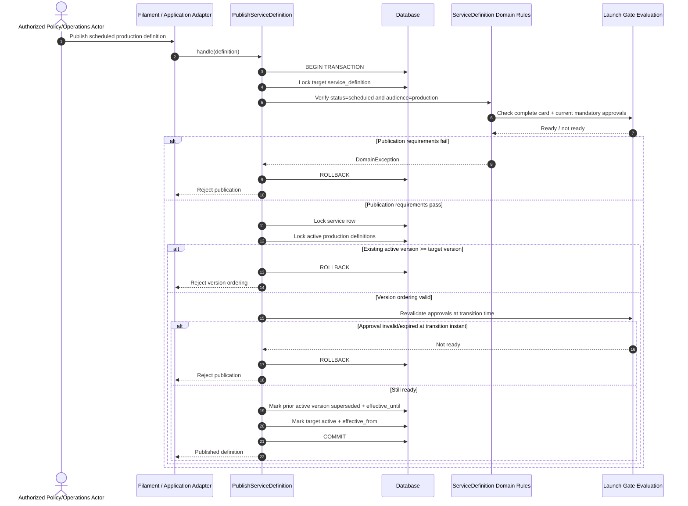
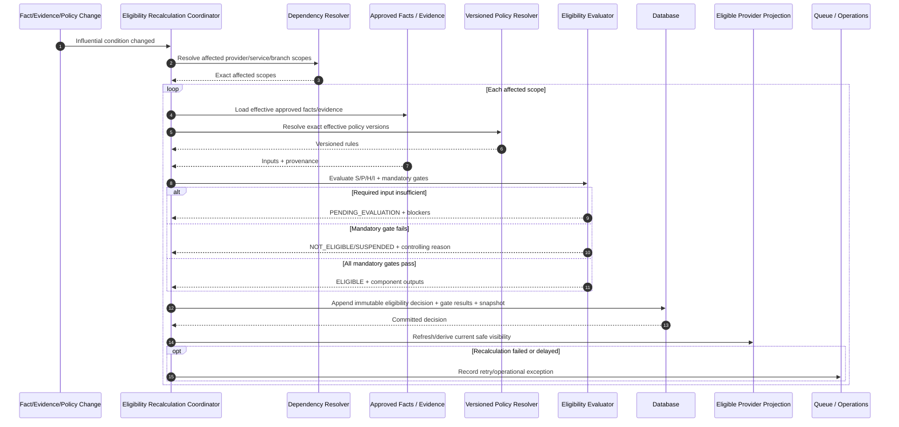
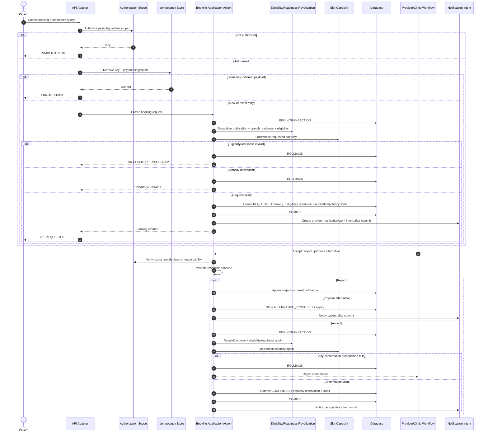
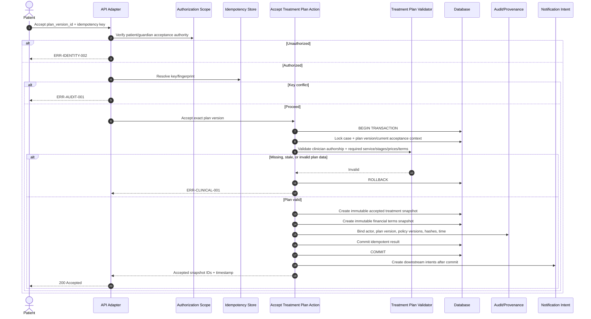
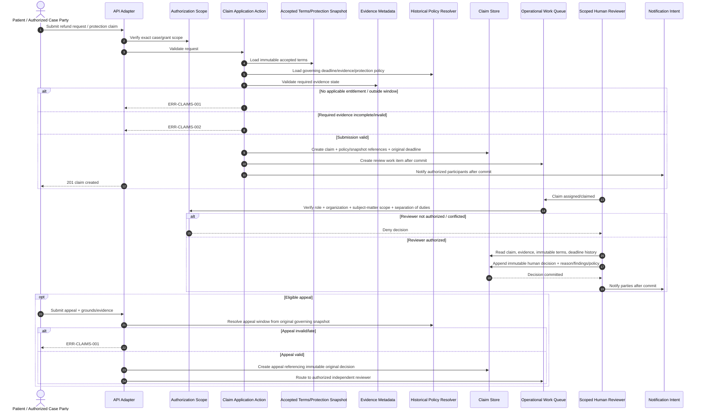
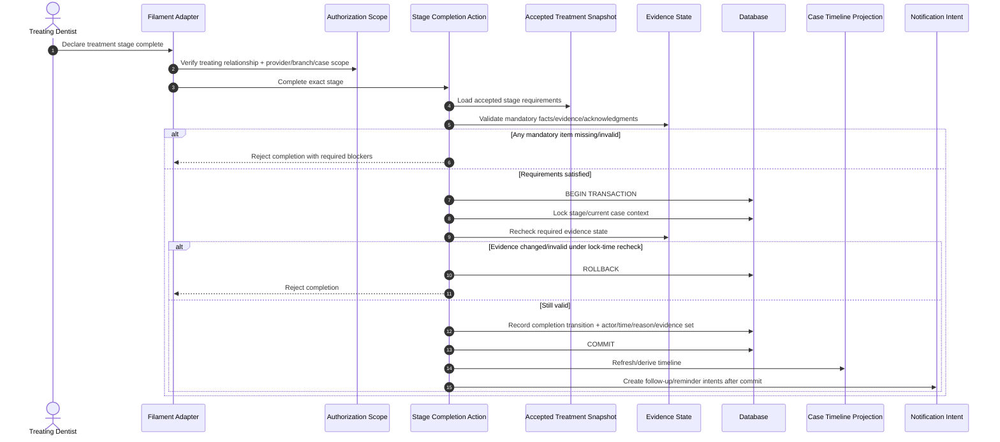
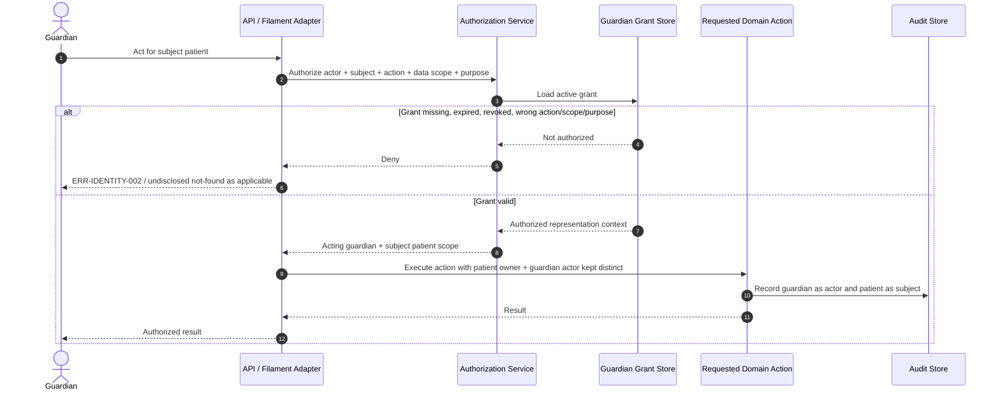
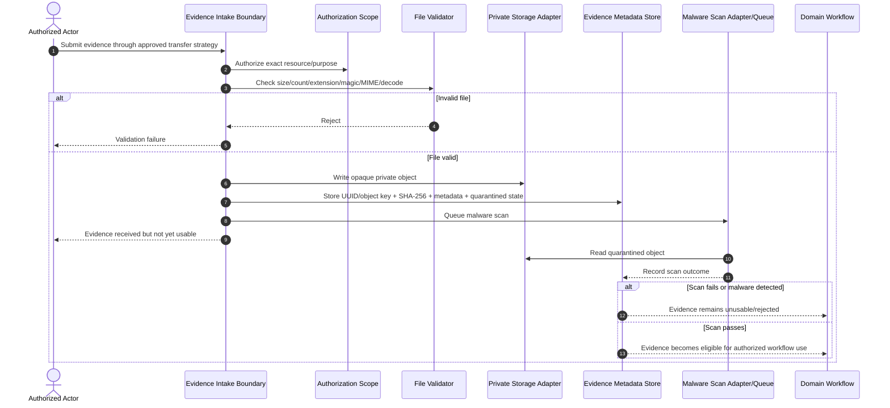

# UberTib Sequence Diagrams

**Phase:** 2 — Conditional Engineering Documentation  
**Mode:** Existing Repository  
**Baseline:** 2026-08-24  
**Product source:** `docs/PRD.md`  
**Technical sources:** `docs/SDD.md`, `docs/architecture/COMPONENT_DESIGN.md`, `docs/api/API_CONTRACTS.md`, `docs/database/ERD.md`, `docs/domain/STATE_MACHINES.md`, `docs/domain/PERMISSIONS_MATRIX.md`  
**Registry:** `docs/README.md`

## 1. Purpose and Scope

This document owns ordering-sensitive interaction flows for UberTib V1. It does not restate every CRUD operation and does not define UI navigation or visual design.

A sequence is documented only where order, authorization, historical snapshotting, concurrency, idempotency, fail-closed behavior, or post-commit side effects materially affect correctness.

The diagrams distinguish existing behavior from required V1 behavior. Only the service-definition publication flow is currently verified in the repository as an implemented business sequence. The remaining sequences are required/proposed designs derived from confirmed requirements and previously generated engineering documents.

`Q-PLATFORM-001` remains a Blocker for claiming complete reconciliation with readable SRS v1.1 text. Production medical calculations remain governed by `Q-CATALOG-001` and `Q-ELIG-001`. V1 remains record-only for financial activity and never moves money.

## 2. Sequence Conventions

- **Actor** means the authenticated human or public caller initiating the flow.
- **API / Filament** is an adapter; it never owns domain policy.
- **Application Action** coordinates authorization, validation, transaction boundaries, and domain services.
- **Policy / Evaluator** resolves governed rules and derived outcomes.
- **Database** represents authoritative transactional persistence.
- **Queue / Notification** represents post-commit non-authoritative delivery work.
- A failed precondition produces no authoritative business-state mutation.
- Retry-prone mutation flows must resolve idempotency before committing duplicate side effects.
- Immutable decisions/snapshots/events are appended or versioned, never silently overwritten.

## 3. Service Definition Publication — Existing

**Requirements:** FR-CATALOG-001, FR-POLICY-001, FR-OPS-003.  
**Implementation:** Existing `PublishServiceDefinition`, `ServiceDefinition`, `ServiceLaunchGate`, and launch-gate decision actions.



### Ordering Guarantees

1. Target definition and service scope are locked before active-version mutation.
2. Readiness is checked before mutation and again for the effective transition instant.
3. Supersession and new activation occur in one transaction.
4. A failed publication does not partially retire/supersede the previous version.
5. Existing code preserves a one-second handover when required to avoid ambiguous effective intervals.

## 4. Provider Eligibility Evaluation and Recalculation — Required / Governed

**Requirements:** FR-ELIG-002–006, FR-ELIG-008–017, FR-POLICY-002, NFR-AUDIT-003.  
**Status:** Proposed V1. Final production formulas/weights/thresholds remain governed by `Q-ELIG-001`.



### Failure and Safety Alternatives

- A missing required fact or expired evidence produces `PENDING_EVALUATION`; it is never converted to scientific grade `F`.
- A previously eligible scope whose required condition becomes invalid is removed from new-booking eligibility immediately through a new decision; the earlier decision remains historical truth.
- No human actor may directly submit final S/P/H/I or the final eligibility result.
- Recalculation affects only dependency-related scopes; it does not globally rewrite all providers.
- Booking-time safety does not trust the search projection; booking revalidates the current authoritative eligibility context again.

## 5. Booking Request, Provider Response, and Confirmation — Required

**Requirements:** FR-BOOKING-001–003, FR-ELIG-003, FR-ELIG-006, NFR-AUDIT-002.  
**APIs:** API-BOOKING-001, API-BOOKING-004 and related booking contracts.



### Alternative Appointment Acceptance

Patient acceptance of an alternative follows the same confirmation tail: authorize patient/guardian → verify proposal deadline/state → resolve idempotency → transaction → revalidate eligibility/readiness → lock/check capacity → confirm or fail without partial mutation.

### Concurrency Invariant

For 100 concurrent attempts against limited capacity, committed confirmations must never exceed configured slot capacity. Client-side availability and cached discovery state are insufficient; the authoritative confirmation transaction owns capacity correctness.

## 6. Treatment Plan Acceptance and Immutable Terms — Required

**Requirements:** FR-CLINICAL-001–002, FR-FINANCE-001, NFR-AUDIT-003.  
**API:** API-CLINICAL-003.



### Invariants

- Clinical content is authored by an authorized treating clinician, not generated as an autonomous platform diagnosis/treatment decision.
- Acceptance creates immutable snapshots; later amendments create new versions/snapshots.
- Treatment and financial snapshots commit atomically so the accepted clinical plan cannot diverge from the accepted commercial terms.
- Current policy changes never rewrite an already accepted snapshot.

## 7. External Payment Reporting and Confirmation/Dispute — Required, Record-Only

**Requirements:** FR-FINANCE-002–007, NFR-FINANCE-001, NFR-AUDIT-002–003.  
**APIs:** API-FINANCE-002, API-FINANCE-003.

```mermaid
sequenceDiagram
    autonumber
    actor Reporter as Authorized Case Party
    participant API as API Adapter
    participant Auth as Authorization Scope
    participant Idem as Idempotency Store
    participant Finance as Financial Record Action
    participant Terms as Financial Terms Snapshot
    participant DB as Append-Only Financial Store
    participant Counterparty as Authorized Counterparty/Reviewer
    participant Notify as Notification Intent

    Reporter->>API: Report external payment
    API->>Auth: Verify case scope
    API->>Idem: Resolve idempotency key
    API->>Finance: Validate event against accepted terms
    Finance->>Terms: Load immutable governing snapshot

    alt Snapshot/currency/amount context invalid
        Finance-->>API: ERR-FINANCE-001
        API-->>Reporter: Reject; no event appended
    else Valid external assertion
        Finance->>DB: Append reported_unconfirmed financial event
        Finance->>DB: Persist audit/idempotency result
        DB-->>Finance: Commit
        Finance->>Notify: Notify counterparty after commit
        API-->>Reporter: 201 recorded assertion
    end

    Counterparty->>API: Confirm or dispute event + idempotency key
    API->>Auth: Verify counterparty/reviewer scope
    API->>Finance: Validate current event relationship

    alt Confirm
        Finance->>DB: Append confirmation event linked to original
    else Dispute
        Finance->>DB: Append dispute event + reason/evidence references
    else Invalid/contradictory action
        Finance-->>API: ERR-FINANCE-001
    end

    DB-->>Finance: Ordered event history retained
```

### Money Boundary

No step calls a payment gateway, wallet, bank-transfer executor, settlement service, refund processor, escrow account, or payout mechanism. The workflow records assertions and confirmations/disputes about money that moved outside UberTib.

A correction never edits the original event. It appends a linked correction/reversal/superseding fact according to the governed financial-event model.

## 8. Refund Request / Protection Claim, Human Decision, and Appeal — Required

**Requirements:** FR-CLAIMS-001–005, FR-FINANCE-004, FR-FINANCE-007, FR-AUDIT-001.  
**APIs:** API-CLAIMS-001, API-CLAIMS-002, API-CLAIMS-005, API-FINANCE-004.



### Decision Boundary

Sensitive medical, financial, legal, compensation, claim, and dispute outcomes require an appropriately scoped human reviewer. The system may validate eligibility, evidence completeness, deadlines, assignment, and policy constraints, but it must not autonomously produce a final sensitive punitive/high-impact decision.

If a refund is approved, UberTib records the entitlement/decision. External refund execution is later reported through the financial-event workflow; UberTib itself does not execute the refund.

## 9. Treatment Stage Completion — Required

**Requirements:** FR-CLINICAL-003, FR-CLINICAL-005.  
**Status:** Proposed V1 provider/Filament workflow.



A reopening, when allowed by policy, is a separately attributed transition and never erases the original completion history.

## 10. Guardian-Scoped Patient Action — Cross-Cutting Authorization Sequence

**Requirements:** FR-IDENTITY-003, FR-IDENTITY-001, NFR-IDENTITY-001.  
**Applies to:** booking, case access, eligible claim/review actions, and other explicitly granted patient actions.



The system must never impersonate the patient when a guardian acts. Revocation or expiry must stop future authorization immediately while preserving historical attribution.

## 11. Private Evidence Intake and Use — Required, Provider-Neutral

**Requirements:** NFR-PLATFORM-003 plus evidence-bearing ELIG, CLINICAL, FINANCE, REVIEWS, and CLAIMS requirements.  
**Status:** Required design; concrete upload/storage/malware provider contract remains blocked by `Q-PLATFORM-003` and `Q-OPS-001`.



The diagram intentionally does not prescribe presigned URLs, multipart upload, resumable upload, vendor-specific scanning APIs, or provider credentials. Those details require resolution of the open provider/infrastructure questions.

## 12. Post-Commit Side-Effect Rule

The following side effects should occur only after the authoritative business transaction commits unless a specific transactionally-coupled invariant requires otherwise:

- notification delivery;
- reminder scheduling;
- downstream queue/work-item fan-out;
- recalculation jobs initiated by a committed fact/policy change;
- search/read-model refresh;
- report projection refresh.

A notification provider failure, worker retry, or delayed projection must not roll back an already committed booking, accepted snapshot, eligibility decision, financial event, or claim decision. Instead it creates observable retry/exception state under `NFR-PLATFORM-008`.

## 13. Idempotency Pattern for Mutation Sequences

Every mutation contract marked idempotent follows the same ordering:

```mermaid
sequenceDiagram
    autonumber
    actor Client
    participant Adapter
    participant Idem as Idempotency Store
    participant Action as Application Action
    participant DB as Database

    Client->>Adapter: Command + key + payload
    Adapter->>Idem: Resolve actor + operation + scope + key

    alt Existing committed key + same fingerprint
        Idem-->>Adapter: Original committed result
        Adapter-->>Client: Original result; no new side effect
    else Existing key + different fingerprint
        Idem-->>Adapter: Conflict
        Adapter-->>Client: ERR-AUDIT-001
    else New key
        Adapter->>Action: Execute
        Action->>DB: Transactional business writes + idempotency result
        DB-->>Action: Commit once
        Action-->>Adapter: Result
        Adapter-->>Client: Result
    end
```

The implementation must handle concurrent first use of the same key so only one business result commits.

## 14. Sequences Intentionally Omitted

No sequence diagram is created for simple read-only catalog retrieval, ordinary list/detail reads, generic reporting, or trivial CRUD because ordering does not materially change correctness.

No third-party integration sequence is defined because there is no concrete contracted OTP, malware scanning, notification, payment, or infrastructure provider. `docs/integrations/INTEGRATION_CONTRACTS.md` remains intentionally omitted unless such a provider contract is later approved.

No UX navigation or screen sequence is defined here. User-flow and interface sequencing belongs to the downstream UX documentation chain.

## 15. Requirement Coverage Summary

| Sequence | Primary Requirements | Implementation State |
|---|---|---|
| Service definition publication | FR-CATALOG-001, FR-POLICY-001, FR-OPS-003 | Existing |
| Eligibility evaluation/recalculation | FR-ELIG-002–006, FR-ELIG-008–017 | Proposed / governed |
| Booking request/response/confirmation | FR-BOOKING-001–003 | Proposed |
| Treatment-plan acceptance | FR-CLINICAL-001–002, FR-FINANCE-001 | Proposed |
| External financial record confirmation | FR-FINANCE-002–007 | Proposed, record-only |
| Claim/refund review and appeal | FR-CLAIMS-001–005 | Proposed |
| Treatment-stage completion | FR-CLINICAL-003 | Proposed |
| Guardian authorization | FR-IDENTITY-003 | Proposed |
| Private evidence intake | NFR-PLATFORM-003 + evidence-bearing FRs | Proposed; provider details blocked |
| Idempotent mutation pattern | FR-AUDIT-003, NFR-AUDIT-002 | Proposed shared pattern |

## 16. Open Governance Dependencies

- `Q-PLATFORM-001` — readable SRS v1.1 is still required before claiming complete source reconciliation.
- `Q-CATALOG-001` — provisional catalog records require licensed clinical production approval.
- `Q-ELIG-001` — production S/P/H/I formulas, weights, thresholds, and defaults require licensed clinical approval.
- `Q-PLATFORM-002` — retention/deletion periods require legal/compliance validation.
- `Q-PLATFORM-003` — concrete OTP/MFA, malware scanning, private-evidence, and related providers remain unresolved.
- `Q-OPS-001` — production hosting/deployment topology/provider remains unresolved.

No new canonical IDs are allocated by this document.