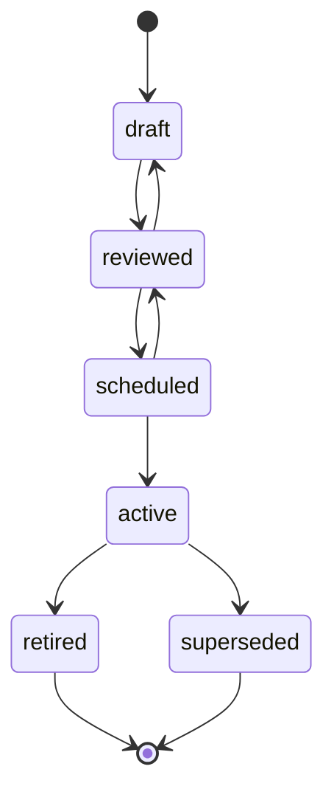
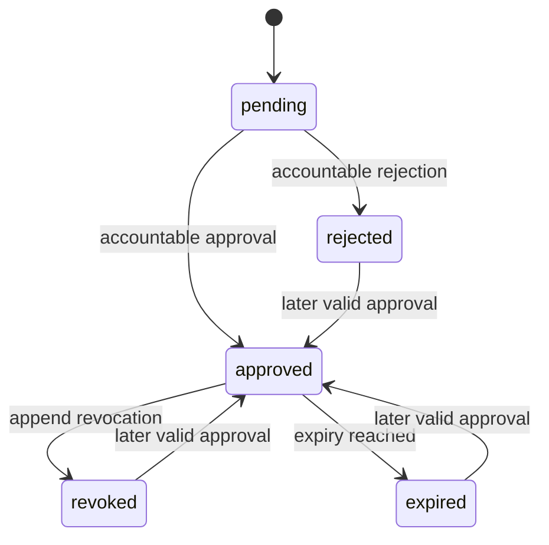
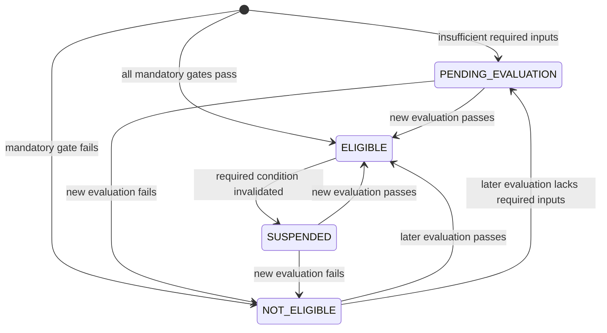
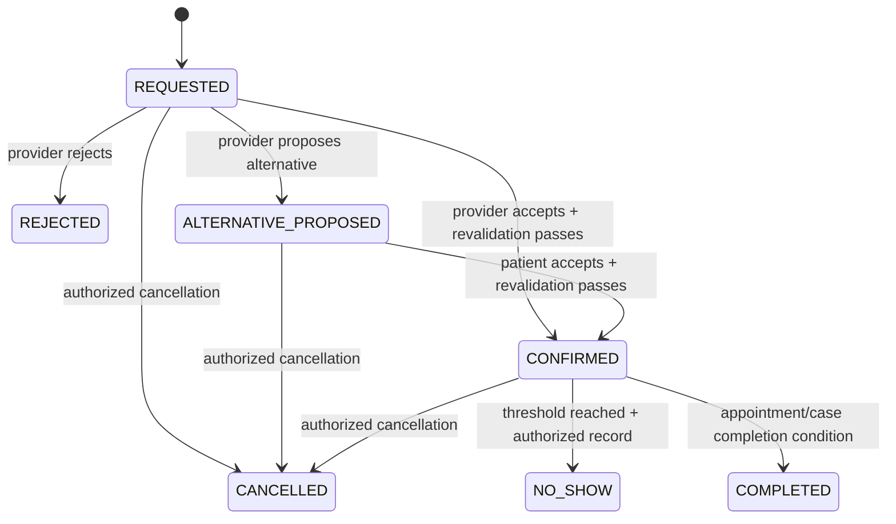
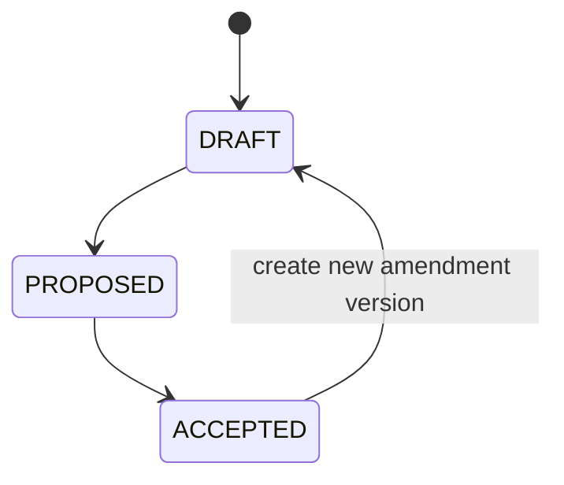
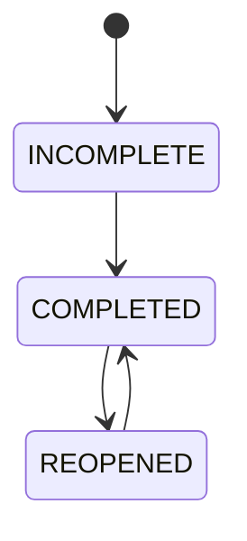
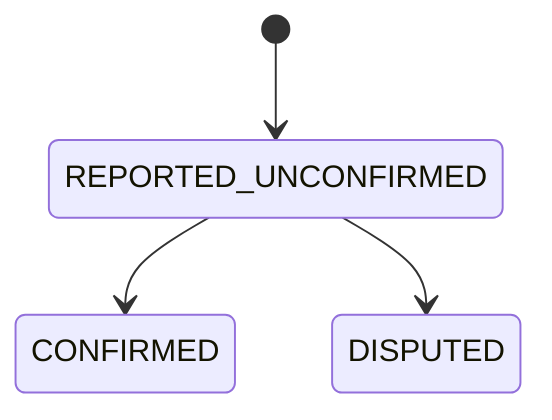
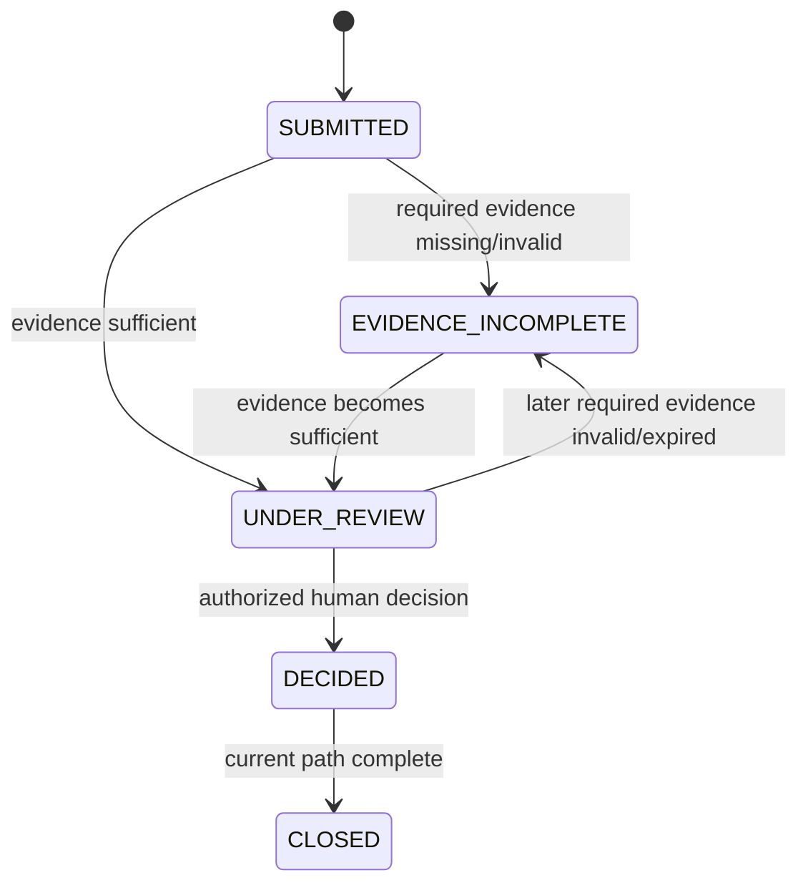
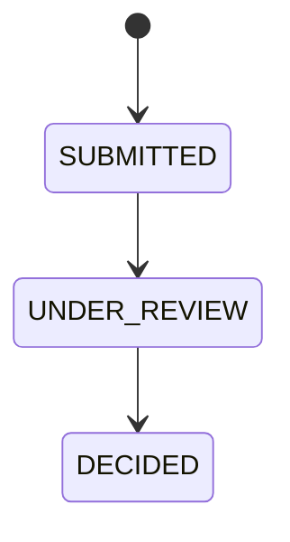

# UberTib State Machines

**Phase:** 2 — Conditional Engineering Documentation  
**Mode:** Existing Repository  
**Baseline:** 2026-08-24  
**Product source:** `docs/PRD.md`  
**Technical sources:** `docs/SDD.md`, `docs/architecture/COMPONENT_DESIGN.md`, `docs/database/ERD.md`, `docs/api/API_CONTRACTS.md`  
**Registry:** `docs/README.md`

## 1. Purpose and Rules

This document owns lifecycle states and transition rules for UberTib entities whose requirements depend on controlled state changes. It does not define UI workflow, screen navigation, visual labels, or implementation-specific presentation behavior.

Where an enum already exists in the repository, the exact implemented values are preserved. Where the wider V1 domain is not implemented, the state labels below are a normalized engineering vocabulary taken directly from approved requirement outcomes such as request, accepted, rejected, confirmed, cancelled, no-show, pending evaluation, disputed, appealed, and completed. No additional lifecycle state may be introduced during implementation without reconciling it with the owning requirement and this document.

`Q-PLATFORM-001` remains a Blocker for claiming complete reconciliation with readable SRS v1.1 text. Production medical transitions remain governed by `Q-CATALOG-001` and `Q-ELIG-001`.

State-machine principles:

1. invalid transitions fail without changing authoritative state;
2. retry-prone commands obey FR-AUDIT-003 / NFR-AUDIT-002 idempotency rules;
3. concurrency-sensitive transitions use transactional locking and/or durable uniqueness/capacity constraints;
4. accepted snapshots, decisions, launch-gate records, financial events, and other immutable history are not rewritten;
5. where a requirement describes reevaluation, correction, appeal, or amendment, a new record/version/event is created instead of mutating historical truth;
6. V1 never performs electronic money movement regardless of financial workflow state.

## 2. Status Classification

| Machine | Status | Implementation |
|---|---|---|
| Service Definition | Canonical and implemented | Existing enum/model lifecycle |
| Service Launch Gate effective state | Canonical and implemented | Existing append-only decisions |
| Clinical Reviewer Credential | Canonical and implemented | Existing enum/snapshot lifecycle |
| Policy Version | Canonical requirement | Partially implemented by Service Definition pattern |
| Eligibility | Canonical outcome machine | Proposed V1; immutable decisions |
| Booking | Canonical requirement machine | Proposed V1 |
| Treatment Plan / Accepted Terms | Canonical requirement machine | Proposed V1; version/snapshot based |
| Treatment Stage | Canonical requirement machine | Proposed V1 |
| External Financial Event | Canonical requirement machine | Proposed V1; append-only |
| Review | Canonical requirement machine | Proposed V1 |
| Review Appeal | Canonical requirement machine | Proposed V1 |
| Claim / Refund Request | Canonical requirement machine | Proposed V1 |
| Claim Appeal | Canonical requirement machine | Proposed V1 |

## 3. Service Definition Lifecycle — Existing

**Requirements:** FR-POLICY-001, FR-CATALOG-001, FR-OPS-003.  
**Existing enum:** `ServiceDefinitionStatus`.

Canonical states:

- `draft`
- `reviewed`
- `scheduled`
- `active`
- `retired`
- `superseded`

### Transition Table

| Current State | Action/Event | Actor/System | Conditions | Next State | Side Effects | Requirement |
|---|---|---|---|---|---|---|
| draft | Submit/review successfully | Authorized policy/review workflow | Required review checks pass | reviewed | Preserve version/content hash | FR-POLICY-001 |
| reviewed | Return for changes | Authorized reviewer/owner | Version not activated | draft | Version remains editable | FR-POLICY-001 |
| reviewed | Schedule | Authorized workflow | Scheduling/pre-publication conditions pass | scheduled | Ready for publication checks | FR-POLICY-001 |
| scheduled | Return for further review | Authorized workflow | Not yet active | reviewed | No historical active version changed | FR-POLICY-001 |
| scheduled | Publish production definition | System/application action | Production audience; complete card; all current launch gates approved; non-funded boundary passes; version higher than active | active | Existing active version becomes superseded atomically where applicable; effective times set | FR-CATALOG-001, FR-OPS-003 |
| active | Retire | Authorized workflow | Retirement permitted | retired | Historical decisions remain bound to original version | FR-POLICY-001 |
| active | Publish higher replacement | System/application action | Replacement passes publication rules | superseded | Effective end set atomically with replacement activation | FR-POLICY-001 |
| retired | Any lifecycle change | Any | Terminal | rejected | No state change | FR-POLICY-001 |
| superseded | Any lifecycle change | Any | Terminal | rejected | No state change | FR-POLICY-001 |

Current implementation also permits no-op writes within the same state. Only draft versions may be deleted. Activated/retired/superseded business content is immutable.

### Invalid Transitions

Examples rejected by current model rules include draft → scheduled, draft → active, reviewed → active, scheduled → retired, retired → active, and superseded → active.

### Concurrency

Publication locks the target definition and service, validates the active version set, and supersedes an existing active production definition atomically. Concurrent publication must not create two effective active versions for the same service and instant.

## 4. Service Launch Gate Effective State — Existing, Append-Only

**Requirements:** FR-OPS-003.  
**Existing enum:** `ServiceLaunchGateStatus`.

Decision values:

- `pending`
- `approved`
- `rejected`
- `revoked`
- `expired`

A `service_launch_gates` row is an append-only decision, not a mutable lifecycle row. The effective state for one definition + gate type is derived from the latest applicable decision plus approval expiry.

| Current Effective State | Action/Event | Actor/System | Conditions | Next Effective State | Side Effects | Requirement |
|---|---|---|---|---|---|---|
| pending / no accountable decision | Approve | Authorized accountable reviewer | Reason + evidence; future expiry; medical gate also requires current verified dental credential | approved | Append new decision bound to content hash | FR-OPS-003 |
| pending / no accountable decision | Reject | Authorized accountable reviewer | Reason + evidence | rejected | Append rejection | FR-OPS-003 |
| approved | Revoke | Authorized accountable workflow | Reason + evidence | revoked | Append revocation; readiness fails closed | FR-OPS-003 |
| approved | Approval time expires | System/time | `expires_at` reached | expired effective state | Production readiness fails closed; historical approval remains | FR-OPS-003 |
| rejected / revoked / expired | Later approve | Authorized accountable reviewer | Current evidence and all approval conditions satisfied | approved | Append a higher-sequence approval; prior decisions remain | FR-OPS-003 |

`pending` is not accepted by the current accountable decision action; it represents initial/effective absence of a qualifying decision rather than an accountable final decision.

## 5. Clinical Reviewer Credential Snapshot — Existing

**Requirements:** FR-OPS-003 and medical launch governance.  
**Existing enum:** `ClinicalReviewerCredentialStatus`.

States:

- `verified`
- `revoked`
- `expired`

Credential rows are immutable snapshots. A correction or renewed credential creates another snapshot/supersession relation rather than editing the previous record.

| Current State | Event | Actor/System | Conditions | Next State / Record | Side Effects | Requirement |
|---|---|---|---|---|---|---|
| verified | Credential reaches expiry | System/time | `expires_at` reached | expired effective state | Cannot support a new/current medical launch approval | FR-OPS-003 |
| verified | Credential revoked | Authorized verification workflow | Revocation evidence/reason | revoked effective state/new governed snapshot as implemented | Future/current readiness relying on current credential fails | FR-OPS-003 |
| revoked / expired | Credential reverified/renewed | Authorized verification workflow | New verified evidence | new verified snapshot | Historical snapshot remains immutable | FR-OPS-003 |

## 6. General Policy Version Lifecycle — Required / Partial

**Requirements:** FR-POLICY-001–002.

Canonical states explicitly approved by FR-POLICY-001:

- `draft`
- `reviewed`
- `scheduled`
- `active`
- `retired`
- `superseded`

The transition structure follows the Service Definition machine, but each policy domain may impose additional required reviewers/approvals. At most one version may be effective for the same policy key, scope, and instant unless an explicit precedence rule resolves overlap.

Historical decisions always use the captured historical version and are not recalculated against the current active policy unless a separate reevaluation requirement creates a new decision.

## 7. Eligibility Outcome Machine — Required, Immutable Decisions

**Requirements:** FR-ELIG-002–006, FR-ELIG-010–017, FR-POLICY-002.

Eligibility is not a mutable score field. Each evaluation creates an immutable decision for one provider + service + branch + effective policy context.

Canonical outcomes required by the approved behavior:

- `PENDING_EVALUATION` — required evidence/facts are insufficient or invalid for evaluation.
- `ELIGIBLE` — all mandatory current gates pass.
- `SUSPENDED` — a previously eligible scope becomes blocked because a required credential, approved fact, evidence item, or policy condition becomes invalid, expired, revoked, or unavailable.
- `NOT_ELIGIBLE` — evaluation completes and at least one mandatory gate fails. This is an eligibility outcome, not scientific grade `F`.

`F` remains a scientific grade and must not be used as an alias for `PENDING_EVALUATION` or a general eligibility state.

| Current Effective Outcome | Event | Actor/System | Conditions | Next Effective Outcome | Side Effects | Requirement |
|---|---|---|---|---|---|---|
| none | Evaluate | System | Mandatory facts/evidence insufficient | PENDING_EVALUATION | Persist immutable decision + blockers | FR-ELIG-008 |
| none / PENDING_EVALUATION / NOT_ELIGIBLE / SUSPENDED | Reevaluate | System | All mandatory gates pass | ELIGIBLE | Persist new immutable decision; eligible discovery may include scope | FR-ELIG-002, FR-ELIG-004 |
| none / PENDING_EVALUATION / ELIGIBLE / SUSPENDED | Reevaluate | System | One or more mandatory gates fail with sufficient evaluable facts | NOT_ELIGIBLE | Persist new immutable decision + controlling reason | FR-ELIG-005 |
| ELIGIBLE | Influential condition becomes invalid/expired/revoked/unavailable | System | Dependency affects this exact provider/service/branch | SUSPENDED | Persist new decision; block new bookings immediately; existing bookings enter a review workflow whose actor/state/deadline/outcome semantics remain unresolved under `Q-BOOKING-002` | FR-ELIG-003 |
| PENDING_EVALUATION | Missing inputs approved | System | Reevaluation can now run | derived by new evaluation | Old pending decision remains immutable | FR-ELIG-008 |

Existing bookings must not be auto-cancelled, auto-confirmed, or moved to another terminal state merely because the affected provider scope becomes `SUSPENDED`; `Q-BOOKING-002` must be resolved before those review-workflow semantics are implemented as product truth.

### Invalid Behavior

No user, administrator, reviewer, API, or Filament control may directly set final S/P/H/I or final eligibility. Corrections must change governed source facts/evidence/policy and cause a new evaluation.

## 8. Booking Lifecycle — Required

**Requirements:** FR-BOOKING-001–003, NFR-AUDIT-002.

Canonical booking outcomes are normalized directly from the approved booking requirements:

- `REQUESTED`
- `ALTERNATIVE_PROPOSED`
- `CONFIRMED`
- `REJECTED`
- `CANCELLED`
- `NO_SHOW`
- `COMPLETED`

A request is created only after submission-time eligibility/readiness/publication/capacity revalidation. Confirmation repeats the safety-critical revalidation.

| Current State | Action/Event | Actor/System | Conditions | Next State | Side Effects | Requirement |
|---|---|---|---|---|---|---|
| none | Submit booking request | Patient / authorized guardian | Publication, branch readiness, eligibility and capacity valid | REQUESTED | Audit; provider work/notification after commit | FR-BOOKING-001 |
| REQUESTED | Accept request | Authorized provider representative | Response within deadline; confirmation-time eligibility/readiness/capacity valid | CONFIRMED | Reserve/confirm capacity atomically; audit; notifications | FR-BOOKING-003, FR-BOOKING-001 |
| REQUESTED | Reject with reason | Authorized provider representative | Within response deadline | REJECTED | Record actor, branch, prior/result state, reason, time | FR-BOOKING-003 |
| REQUESTED | Propose alternative | Authorized provider representative | Within response deadline; proposal has valid alternative appointment context | ALTERNATIVE_PROPOSED | Record proposal + deadline; notify patient | FR-BOOKING-003 |
| ALTERNATIVE_PROPOSED | Accept alternative | Patient / authorized guardian | Proposal still within deadline; revalidation and capacity pass | CONFIRMED | Commit selected slot/capacity atomically; audit | FR-BOOKING-003, FR-BOOKING-001 |
| ALTERNATIVE_PROPOSED | Deadline expires / patient declines | System / patient | Applicable rule reached/decline recorded | **Unresolved — `Q-BOOKING-001`** | Preserve proposal/decline/expiry history; disable/reject later acceptance; do not infer `REJECTED`, `CANCELLED`, or return to `REQUESTED` | FR-BOOKING-003 |
| REQUESTED / ALTERNATIVE_PROPOSED / CONFIRMED | Cancel | Authorized actor | Actor permission and policy deadline/rules pass | CANCELLED | Release relevant capacity; append booking event; derive downstream consequences | FR-BOOKING-002 |
| CONFIRMED | Record no-show | Authorized party | Only after policy-defined no-show threshold | NO_SHOW | Append event; derive policy consequences; no money movement | FR-BOOKING-002 |
| CONFIRMED | Complete appointment/case booking step | Authorized workflow | Required appointment/treatment conditions satisfied | COMPLETED | Enables downstream verified-experience/case behavior as applicable | FR-BOOKING-001, FR-REVIEWS-001 |

The precise provider-response deadline is preserved from the approved requirement: **12 hours or two hours before the appointment, whichever occurs first**.

`Q-BOOKING-001` is intentionally not represented as an invented transition in the diagram below. Until that question is resolved, the implementation may record that the alternative is no longer acceptably actionable and reject a late acceptance, but it must preserve the current authoritative booking/history without fabricating a terminal or rollback state.

### Invalid Transitions and Errors

- Confirmation while eligibility/readiness/capacity is invalid is rejected (`ERR-ELIG-001`, `ERR-ELIG-002`, `ERR-BOOKING-001`).
- Actions invalid for current booking state are rejected (`ERR-BOOKING-002`).
- Provider/alternative actions after the response deadline are rejected (`ERR-BOOKING-003`).
- A no-show before the policy-defined threshold is rejected.
- Terminal outcomes cannot be overwritten by a contradictory later action; any authorized correction must be represented as later auditable history according to the governing policy rather than silent mutation.

### Concurrency and Repeated Actions

Capacity must remain correct under concurrent requests. An idempotent repeated booking command returns the original committed result. Competing requests cannot confirm beyond configured slot capacity.

## 9. Treatment Plan and Accepted Terms — Required, Versioned

**Requirements:** FR-CLINICAL-001–002, FR-FINANCE-001, NFR-AUDIT-003.

The treatment plan lifecycle is version based rather than mutable accepted content.

Canonical plan states:

- `DRAFT`
- `PROPOSED`
- `ACCEPTED`

An amendment after acceptance creates another plan version and, after acceptance, a new immutable accepted treatment/financial snapshot. It does not return the historical accepted version to draft.

| Current State | Action/Event | Actor/System | Conditions | Next State / Record | Side Effects | Requirement |
|---|---|---|---|---|---|---|
| none | Create plan | Authorized treating clinician | Clinician owns authorized case context | DRAFT | Store clinician authorship | FR-CLINICAL-001 |
| DRAFT | Propose plan | Authorized treating clinician | Required service, stages, prices, inclusions/exclusions and policy information complete | PROPOSED | Freeze content/version as proposal candidate | FR-CLINICAL-001 |
| PROPOSED | Accept plan | Patient / authorized guardian | Exact version current and complete | ACCEPTED + immutable snapshots | Atomically create accepted treatment and financial terms snapshots | FR-CLINICAL-002, FR-FINANCE-001 |
| ACCEPTED | Amend | Authorized treating clinician | Change is permitted and captured as new version | new DRAFT/PROPOSED version | Existing accepted snapshot unchanged | FR-CLINICAL-002 |

Acceptance is rejected when mandatory service, stage, price, or policy information is missing (`ERR-CLINICAL-001`). UberTib does not generate an autonomous diagnosis or treatment plan.

## 10. Treatment Stage Lifecycle — Required

**Requirements:** FR-CLINICAL-003.

The approved requirement explicitly distinguishes completion and reopening events. The canonical operational states are:

- `INCOMPLETE`
- `COMPLETED`
- `REOPENED`

| Current State | Action/Event | Actor/System | Conditions | Next State | Side Effects | Requirement |
|---|---|---|---|---|---|---|
| INCOMPLETE / REOPENED | Declare complete | Authorized treating doctor | Required stage facts, acknowledgments, and evidence from accepted snapshot are present and valid | COMPLETED | Record actor, time, reason/context and evidence set evaluated | FR-CLINICAL-003 |
| COMPLETED | Reopen | Authorized doctor/reviewer workflow | Authorized reason exists | REOPENED | Append reopening history; prior completion remains historical | FR-CLINICAL-003 |

Completion is rejected while any mandatory stage, field, acknowledgment, or evidence item is absent or invalid.

## 11. External Financial Event Lifecycle — Required, Append-Only

**Requirements:** FR-FINANCE-002–007, NFR-FINANCE-001, NFR-AUDIT-003.

Financial state is a **derived projection** over append-only event history. The original report is never updated from one status to another in-place.

Canonical projected states for a reported external payment/refund execution:

- `REPORTED_UNCONFIRMED`
- `CONFIRMED`
- `DISPUTED`

Corrections/reversals are additional events and may derive a later corrected projection without deleting earlier assertions.

| Current Projection | Action/Event | Actor/System | Conditions | Next Projection | Side Effects | Requirement |
|---|---|---|---|---|---|---|
| none | Report external payment/refund execution | Authorized case party | Valid case + immutable financial terms/approved refund context; valid amount/currency; idempotency passes | REPORTED_UNCONFIRMED | Append financial event; route counterparty review | FR-FINANCE-002, FR-FINANCE-004 |
| REPORTED_UNCONFIRMED | Confirm | Authorized counterparty/scoped reviewer | Scope and current workflow valid | CONFIRMED | Append confirmation event | FR-FINANCE-003 |
| REPORTED_UNCONFIRMED | Dispute | Authorized counterparty/scoped reviewer | Reason supplied; scope valid | DISPUTED | Append dispute event + evidence when supplied | FR-FINANCE-003 |
| CONFIRMED / DISPUTED | Governed correction/reversal/resolution | Authorized workflow | Governing financial policy permits it | newly derived projection | Append later event; never edit earlier records | FR-FINANCE-005 |

No state may mean “funds held by UberTib”, “captured”, “settled by UberTib”, “wallet balance”, or “platform refund executed”. Those behaviors are outside V1.

## 12. Review Lifecycle — Required

**Requirements:** FR-REVIEWS-001.

A review may exist only for an eligible verified completed experience and only one active review may exist for that experience.

Canonical review states used by the relational design are:

- `ACTIVE`
- `RETIRED`

| Current State | Action/Event | Actor/System | Conditions | Next State | Side Effects | Requirement |
|---|---|---|---|---|---|---|
| none | Submit review | Patient / active authorized guardian | Verified completed experience; within review window; no second active review | ACTIVE | Bind review to verified experience; update derived rating aggregate as applicable | FR-REVIEWS-001 |
| ACTIVE | Governed retirement | Authorized review-integrity workflow | Approved policy reason | RETIRED | Preserve review history and appeal history | FR-REVIEWS-001, FR-REVIEWS-002 |

Patient rating `R` remains independent of S/P/H/I.

## 13. Review Appeal Lifecycle — Required

**Requirements:** FR-REVIEWS-002.

Canonical states:

- `SUBMITTED`
- `DECIDED`

| Current State | Action/Event | Actor/System | Conditions | Next State | Side Effects | Requirement |
|---|---|---|---|---|---|---|
| none | Submit appeal | Authorized appellant | Appeal eligibility/window passes | SUBMITTED | Create appeal/work item; preserve original review | FR-REVIEWS-002 |
| SUBMITTED | Decide appeal | Authorized scoped reviewer | Evidence/policy review complete | DECIDED | Record reasoned decision; original review is not directly rewritten by the appeal record | FR-REVIEWS-002 |

## 14. Claim / Refund Request Lifecycle — Required

**Requirements:** FR-CLAIMS-001–004, FR-FINANCE-007.

Refund requests and protection claims share a controlled review lifecycle while retaining their different eligibility rules.

Canonical states:

- `SUBMITTED`
- `EVIDENCE_INCOMPLETE`
- `UNDER_REVIEW`
- `DECIDED`
- `CLOSED`

An approved financial remedy creates an obligation/amount due for **external execution**; it does not move money.

| Current State | Action/Event | Actor/System | Conditions | Next State | Side Effects | Requirement |
|---|---|---|---|---|---|---|
| none | Submit refund request | Authorized case party | Accepted financial terms + deadline rules pass | SUBMITTED | Create claim/work item; capture governing snapshot | FR-CLAIMS-001 |
| none | Submit protection claim | Eligible case party | Immutable accepted terms contain applicable active protection | SUBMITTED | Create claim/work item; no promised monetary outcome | FR-CLAIMS-002 |
| SUBMITTED / UNDER_REVIEW | Evidence validation finds missing/rejected/expired required evidence | System/reviewer | Versioned evidence rules | EVIDENCE_INCOMPLETE | Surface missing/rejected/expired items and deadline | FR-CLAIMS-003 |
| SUBMITTED / EVIDENCE_INCOMPLETE | Required evidence becomes sufficient | System/reviewer | Required evidence accepted and workflow deadline valid | UNDER_REVIEW | Route/assign human review | FR-CLAIMS-003, FR-CLAIMS-004 |
| UNDER_REVIEW | Submit sensitive decision | Authorized human reviewer | Role/org/subject scope valid; separation-of-duties passes | DECIDED | Immutable reasoned decision; record required external actions | FR-CLAIMS-004 |
| DECIDED | Close when no further eligible workflow remains | Authorized/system workflow | Decision final for current path and required operational recording complete | CLOSED | Preserve complete history | FR-CLAIMS-001–004 |

### Deadline Behavior

Original deadlines are retained. Authorized pauses/extensions append a reasoned deadline event and do not erase the original deadline. Expired submission or appeal windows are rejected rather than silently extending themselves.

### Invalid Transitions

- Protection claim submission without applicable accepted protection is rejected (`ERR-CLAIMS-001`).
- Required evidence missing/invalid blocks decision progression (`ERR-CLAIMS-002`).
- A sensitive decision by an actor outside required role/organization/subject scope is denied.
- Separation-of-duties violations are denied.
- A decision cannot directly trigger UberTib money movement.

## 15. Claim Appeal Lifecycle — Required

**Requirements:** FR-CLAIMS-005.

Canonical states:

- `SUBMITTED`
- `UNDER_REVIEW`
- `DECIDED`

| Current State | Action/Event | Actor/System | Conditions | Next State | Side Effects | Requirement |
|---|---|---|---|---|---|---|
| none | Submit appeal | Authorized case party | Original decision eligible; versioned appeal window valid; grounds/evidence rules pass | SUBMITTED | Preserve original decision; create appeal work item | FR-CLAIMS-005 |
| SUBMITTED | Assign/start review | Operations/system | Reviewer satisfies required scope and separation of duties | UNDER_REVIEW | Audit assignment | FR-CLAIMS-005, FR-CLAIMS-004 |
| UNDER_REVIEW | Decide appeal | Authorized human reviewer | Required evidence and policy review complete | DECIDED | Immutable reasoned appeal decision; original decision remains unchanged | FR-CLAIMS-005 |

## 16. State Changes That Create New Records Instead of Mutating History

The following are not ordinary in-place transitions:

| Situation | Required historical behavior |
|---|---|
| Eligibility recalculated | Create a new immutable eligibility decision. |
| Source fact corrected | Create/supersede governed fact; do not rewrite decision snapshots that used old fact. |
| Service/policy version changes | Create/activate new version; historical cases keep captured version. |
| Launch-gate decision changes | Append a higher-sequence decision. |
| Reviewer credential renewed/corrected | Create a new immutable credential snapshot. |
| Accepted treatment amended | Create a new treatment-plan version and new accepted snapshot after acceptance. |
| Accepted financial terms amended | Create a new immutable financial-terms snapshot. |
| Financial assertion confirmed/disputed/corrected | Append another financial event. |
| Claim/review appealed | Create an appeal record; preserve original decision/review. |
| Claim deadline paused/extended | Append a deadline event; preserve original deadline. |

## 17. Authorization Rule for Every Transition

A state transition is not authorized solely because the caller knows the resource ID or has a coarse role. Every transition must evaluate the applicable combination of:

- authenticated identity;
- role/capability;
- clinic/branch/organization scope;
- patient/case/resource relationship;
- active guardian grant where acting for another patient;
- workflow assignment/responsibility;
- subject-matter scope;
- purpose where required;
- separation-of-duties constraints.

The canonical actor/action matrix is owned by `docs/domain/PERMISSIONS_MATRIX.md`.

## 18. Idempotency and Concurrency Rules

For every transition exposed through a retry-prone sensitive command:

1. same idempotency key + materially identical request returns the original committed outcome;
2. same key + materially different request is rejected with `ERR-AUDIT-001`;
3. concurrent duplicates produce at most one committed business effect;
4. stale commands are revalidated against current state before mutation;
5. booking capacity, version activation, single-review uniqueness, immutable acceptance, and other contention-sensitive invariants require database-backed enforcement.

## 19. State/Event Audit Minimum

Every sensitive transition must preserve enough information to answer:

- what resource changed;
- prior and resulting state where a mutable aggregate exists;
- event/decision type where append-only history is used;
- actor identity and effective role/scope;
- patient vs acting guardian identity when different;
- branch/case/provider/service scope as applicable;
- time;
- reason when required;
- governing policy/snapshot/version;
- evidence references where required;
- correlation/idempotency reference where applicable;
- outcome (success/rejected/failed) without leaking protected payloads.

## 20. Machines Intentionally Not Finalized

The following state vocabularies are not finalized here because current approved sources do not establish enough canonical lifecycle states to do so safely:

- private evidence binary-transfer/upload session lifecycle — blocked by `Q-PLATFORM-003` provider/transfer-strategy decisions;
- notification provider delivery lifecycle beyond provider-neutral queued/attempted/success/failure operational metadata;
- detailed operational work-item states beyond the requirement that assignment, escalation, completion, reopening, and deadline breach are auditable;
- provider/clinic verification sub-state vocabulary not explicitly established by the currently readable source set.

Implementation must not invent these as product truth. When their source decisions become authoritative, update `docs/README.md` registry/open items as needed and then update this file.

## 21. Testing Obligations

`docs/TESTING_STRATEGY.md` owns the concrete append-only `TC-*` registry and the current state-machine test coverage. Implementation must preserve and execute coverage for every applicable state machine in this document, including:

- at least one test for each valid transition;
- at least one rejected invalid transition;
- authorization allow/deny tests for materially different actors;
- deadline-boundary tests where time controls transition validity;
- concurrency/idempotency tests where repeated commands can create duplicate effects;
- immutable-history tests for append-only/snapshot workflows;
- fail-closed tests for medical eligibility/publication transitions;
- explicit tests that financial transitions never perform platform money movement.

Concrete test IDs remain owned by `docs/TESTING_STRATEGY.md`, are mapped through `docs/TRACEABILITY_MATRIX.md`, and are synchronized in the canonical `docs/README.md` registry. Future test allocations must update that registry without renumbering existing IDs.