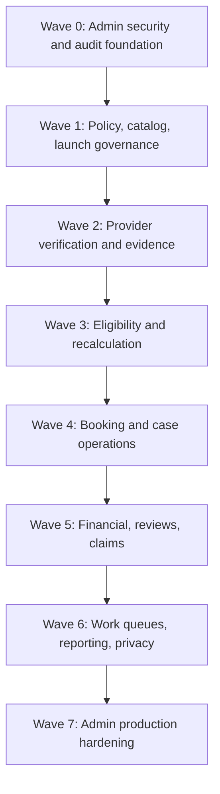

# UberTib Admin Implementation Plan

**Phase:** 3 — Execution  
**Plan:** 1 of 3 platform implementation plans  
**Platform:** Admin / Operations / Governance Dashboard  
**Runtime:** Existing Laravel application under `UberTip-Backend/`  
**Interaction layer:** Filament 5 admin panel  
**Baseline:** 2026-08-24  
**Canonical product behavior:** `docs/PRD.md`  
**Canonical technical design:** `docs/SDD.md` and Phase 2 engineering documents  
**Testing owner:** `docs/TESTING_STRATEGY.md`

## 1. Purpose

This plan defines the dependency-ordered implementation work required for the UberTib **Admin / Operations / Governance platform**. It is deliberately separated from the later Clinic/Doctor plan and Patient Mobile plan.

The Admin platform is not a universal override console. It exists to operate governed workflows: staff access, verification, policy/catalog governance, launch readiness, operational queues, eligibility oversight, booking/case operations, external financial-record review, review integrity, claims/disputes, audit, reporting, privacy operations, and production readiness.

This file does **not** define visual design, screen layout, component styling, navigation UX, microcopy, or wireframes. Filament resources/pages named below are implementation surfaces only. The UX pipeline remains responsible for presentation design.

`Q-PLATFORM-001` still prevents a claim of complete reconciliation against readable SRS v1.1. The approved `.spec` baseline remains the working requirement set for this implementation plan. Production medical readiness remains gated by `Q-CATALOG-001` and `Q-ELIG-001`.

## 2. Three-Plan Split and Ownership

Phase 3 implementation planning is split as follows:

| Plan | Owns | Does not own |
|---|---|---|
| **Admin** — this file | Staff authorization, governance, verification, policy/catalog publication, operational work, review/claim/finance operations, audit/reporting, shared governed backend primitives needed by staff workflows | Clinic-authored treatment workflows, clinic booking response UX, patient mobile UX |
| **Clinic / Doctor** — next file | Clinic/branch/dentist working surface, activation submissions, availability, booking response, clinician-authored treatment plans/stages/evidence, clinic-side financial assertions | Platform governance, final policy editing, administrative bypasses |
| **Patient Mobile** — third file | Patient identity/contact verification, discovery, booking, acceptance, case timeline, external financial assertions/confirmation, reviews, claims/appeals through APIs + React Native | Internal verification, raw risk `I`, governance, launch approvals |

Shared business rules remain implemented once in Laravel application/domain actions. Filament and API adapters call the same application use cases rather than reproducing eligibility, policy, booking, finance, or claim rules in presentation code.

After the three platform plans exist, `docs/IMPLEMENTATION_PLAN.md` should become the canonical cross-platform orchestration/index and preserve the dependency order across them.

## 3. Verified Starting Point

The repository already provides:

- Laravel `^13.17`, PHP `^8.3`, Filament `~5.0`;
- `AdminPanelProvider` mounted at `/admin` with Filament login and resource/page/widget discovery;
- `User` as a basic Laravel authenticatable model;
- Spatie Permission installed but not wired into the business authorization model;
- Spatie Activitylog and Media Library installed but not established as complete UberTib audit/evidence implementations;
- existing catalog models, service-definition lifecycle, clinical reviewer credential snapshots, launch-gate records/actions, and public catalog API;
- Pest, static analysis, 100% line/type coverage quality gates, and MySQL compatibility testing;
- no verified `app/Filament/Resources` business implementation yet;
- no complete identity/scoped-permission, provider activation, eligibility, booking, clinical case, finance, reviews, claims, or operations implementation.

The Admin plan therefore extends the existing Laravel/Filament architecture instead of creating a second backend.

## 4. Admin Actor Model

The implementation must preserve `docs/domain/PERMISSIONS_MATRIX.md`. Administrative login alone never grants all actions.

The functional staff categories used by Admin are:

- system/access administrator;
- verification staff;
- licensed clinical reviewer;
- legal accountable owner;
- product/operations owner;
- technical accountable owner;
- finance reviewer;
- review integrity reviewer;
- claim/dispute reviewer;
- policy owner/reviewer;
- operations staff.

A single person may hold more than one approved capability, but every request still evaluates organization, branch, case/resource, workflow responsibility, subject-matter scope, purpose, effective period, and separation-of-duties requirements where applicable.

## 5. Admin Functional Sections to Build

These are **functional sections**, not a visual-navigation specification.

| Section | Primary responsibilities | Canonical requirements |
|---|---|---|
| Access & Staff Scope | roles, permissions, scoped grants, privileged access | FR-IDENTITY-001, NFR-IDENTITY-001–002 |
| Catalog Governance | service groups/services, service-definition versions, evaluation/production status | FR-CATALOG-001, FR-POLICY-001–002 |
| Launch Readiness | medical/legal/operational/technical gates, evidence, expiry, publication | FR-OPS-003 |
| Provider Verification | provider/branch facts, licenses, equipment/evidence verification | FR-ELIG-007–008 |
| Eligibility Operations | S/P/H/I computation status, blocking facts, recalculation/suspension, explanations | FR-ELIG-002–017 |
| Booking Operations | booking state visibility, deadlines, exceptions, cancellation/no-show audit | FR-BOOKING-001–003 |
| Case Oversight | treatment/case timeline and evidence oversight without authoring treatment | FR-CLINICAL-001–005 |
| Financial Records | immutable accepted terms, external payment/refund events, confirm/dispute workflows | FR-FINANCE-001–007 |
| Review Integrity | verified review eligibility and appeals | FR-REVIEWS-001–002 |
| Claims & Disputes | refund/protection claims, evidence, deadlines, human decisions, appeals | FR-CLAIMS-001–005 |
| Work Queues | assignment, priority, due time, escalation, reopening | FR-OPS-001 |
| Reporting | operational metrics with explicit population/status/time rules | FR-OPS-002 |
| Policy Governance | versioned policy lifecycle and historical reproduction | FR-POLICY-001–002 |
| Audit & Integrity | provenance, immutable events/snapshots, idempotency/integrity exceptions | FR-AUDIT-001–003 |
| Privacy Operations | private evidence authorization, retention, deletion, legal hold | NFR-PLATFORM-003–004 |
| Operational Health | queue/recalculation/scan/notification/backup signals and release evidence | NFR-PLATFORM-002, NFR-PLATFORM-008 |

## 6. Core Admin Workflows

### 6.1 Staff access workflow

1. A system/access administrator authenticates through the Admin panel.
2. The system evaluates coarse capability and active staff-scope grants.
3. Protected resources apply resource-level authorization again; menu visibility is not authorization.
4. A staff permission/grant change is audited.
5. Revoked or expired grants stop access on the next authorization check.
6. Privileged production roles must satisfy the required non-SMS second factor once the approved provider/mechanism exists.

### 6.2 Catalog and production-publication workflow

1. Authorized policy/catalog staff prepare a versioned service definition.
2. Required reviewers record accountable gate decisions with evidence and reason.
3. Medical approval requires a current verified clinical reviewer credential.
4. Gate records remain append-only and are bound to the definition content hash.
5. Publication revalidates every current gate, version ordering, complete card, effective time, and non-funded financial boundary.
6. Publication atomically supersedes the previous production version where applicable.
7. Evaluation content never becomes production-visible merely because it exists in the database.

### 6.3 Provider activation and verification workflow

1. A provider/clinic submission created through the Clinic plan enters an operational verification queue.
2. Verification staff inspect submitted facts/evidence within exact provider/service/branch scope.
3. Evidence is private and cannot be used until its required validation/scanning state permits it.
4. Staff approve/reject/correct **source facts**, not final S/P/H/I outcomes.
5. Approved influential changes trigger dependency-aware eligibility evaluation/re-evaluation.
6. Missing required facts produce `PENDING_EVALUATION`, not scientific grade `F`.

### 6.4 Eligibility operations workflow

1. The system computes a new immutable eligibility decision from approved facts + effective policy.
2. Staff may inspect components, confidence, gates, provenance, and blocking reasons according to their permission scope.
3. Staff cannot directly change S, P, H, I, scientific grade, or final eligibility.
4. A correction changes the governed source fact/policy and triggers a new decision.
5. Expiry/revocation/unavailability of an influential input suspends affected scopes and blocks new bookings.
6. Existing bookings enter the configured review workflow; they are not silently rewritten.

### 6.5 Booking operations workflow

1. Admin operations can search/read scoped booking state and deadline history.
2. Provider response remains owned by the Clinic plan; patient acceptance remains owned by the Patient plan.
3. Admin cannot force confirmation around failed eligibility/readiness/capacity checks.
4. Cancellation/no-show events expose actor, reason, policy snapshot, prior state, resulting state, and downstream operational effects.
5. Exceptions become work items/audited events, not hidden state edits.

### 6.6 Financial operations workflow

1. Money is paid/refunded/compensated **outside UberTib**.
2. UberTib records assertions/events against an immutable accepted financial snapshot.
3. Authorized counterparty or finance workflow confirms or disputes the external event.
4. Dispute and correction are additional append-only events.
5. Refund/compensation approval creates an external action due, not a payment transaction.
6. External execution is recorded only after it occurred outside the platform.
7. No Admin action may authorize, capture, hold, transfer, settle, or refund funds electronically.

### 6.7 Claim/dispute workflow

1. Eligible patient/clinic actions create a claim/refund request.
2. Operations validates eligibility, policy snapshot, required evidence, and deadline state.
3. Missing evidence/deadline issues remain explicit and auditable.
4. Sensitive medical/legal/high-impact financial outcomes require an appropriately scoped human reviewer.
5. Separation-of-duties is enforced before decision submission.
6. The decision preserves findings, reasons, evidence references, policy version, actor, and required external actions.
7. Appeal creates a new workflow and preserves the original decision.

## 7. Implementation Conventions

All tasks below must follow these rules:

- Use existing application actions/query objects as the use-case boundary; Filament resources/pages remain adapters.
- Put authorization in policies/application checks and scoped queries, not only Filament visibility callbacks.
- Use stable public identifiers for client-addressable entities; internal IDs may remain internal.
- Use transactions/row locking/unique constraints for safety-critical state changes.
- Dispatch non-critical jobs/notifications after authoritative commit.
- Preserve append-only/immutable records required by ERD/STATE_MACHINES.
- Never create direct editable fields for final S/P/H/I or final eligibility.
- Never create payment gateway, wallet, escrow, settlement, payout, or card/bank credential flows.
- Private evidence never uses the public Laravel disk.
- Every sensitive action produces privacy-safe audit/provenance.
- Every task includes targeted Pest coverage and must preserve repository lint/static-analysis/coverage gates.

## 8. Dependency Waves

Do not start a downstream wave by duplicating missing upstream logic in Filament.

---

# Wave 0 — Admin Security, Scope, and Audit Foundation

## TASK-PLATFORM-001 — Harden the Existing Admin Panel Boundary
**Implements:** FR-IDENTITY-001, NFR-IDENTITY-001, NFR-PLATFORM-007  
**Goal:** Turn the existing `/admin` Filament shell into a deny-by-default operational entry point without granting broad domain access merely because a user can log in.  
**Dependencies:** None  
**Expected Files / Areas:** `app/Providers/Filament/AdminPanelProvider.php`; `app/Filament/*` (Proposed); authorization middleware/policies (Proposed)  
**Implementation Notes:** Preserve current panel ID/path. Add explicit panel-access eligibility and a shared authorization convention for all discovered resources/pages/actions. Remove/avoid framework informational widgets that expose unnecessary implementation detail in production if security review requires it.  
**Data / Migration Impact:** None required by this task.  
**API Impact:** None.  
**Tests Required:** Admin allow/deny panel access; authenticated user without staff grant denied; route changes cannot bypass panel access. See `TESTING_STRATEGY.md` §8.  
**Verification:** `php artisan test --compact tests/Feature/Admin/AdminPanelAccessTest.php`; `composer test:types`; `composer test:lint`  
**Definition of Done:**
- [ ] Admin entry is deny-by-default
- [ ] Panel access is separated from business-resource authorization
- [ ] Relevant tests pass
- [ ] No domain permission is implied by panel login

## TASK-IDENTITY-001 — Implement Staff Roles and Coarse Capabilities
**Implements:** FR-IDENTITY-001, NFR-IDENTITY-001  
**Goal:** Wire the installed permission package into the application identity model for coarse staff capabilities while keeping domain scope separate.  
**Dependencies:** TASK-PLATFORM-001  
**Expected Files / Areas:** `app/Models/User.php`; permission configuration/migrations; role/permission seed/bootstrap data (Proposed); tests  
**Implementation Notes:** Add role/permission support to `User`; define canonical coarse capabilities needed by the permissions matrix. Avoid a wildcard permission that bypasses branch/case/subject scope. System administrator manages access grants but is not automatically a clinical/finance/claim reviewer.  
**Data / Migration Impact:** Publish/create package permission tables only after verifying current repository state; seed only canonical roles/capabilities, not demo users.  
**API Impact:** None.  
**Tests Required:** role assignment/revocation; no implicit domain bypass; permission-cache invalidation behavior.  
**Verification:** `php artisan test --compact tests/Feature/Authorization/StaffRoleTest.php`; `composer test:mysql`; `composer test:types`  
**Definition of Done:**
- [ ] Coarse roles/capabilities are persisted
- [ ] No wildcard admin bypass exists
- [ ] Permission changes are testable and deterministic
- [ ] Relevant tests pass

## TASK-IDENTITY-002 — Implement Scoped Staff Grants and Resource Authorization
**Implements:** FR-IDENTITY-001, NFR-IDENTITY-001, FR-AUDIT-001  
**Goal:** Enforce organization, branch, workflow, subject-matter, purpose, and effective-period scopes consistently across Admin actions.  
**Dependencies:** TASK-IDENTITY-001, TASK-AUDIT-001  
**Expected Files / Areas:** `app/Models/StaffScopeGrant.php` (Proposed); `app/Policies/*` (Proposed); scoped query/action helpers (Proposed); migrations; Admin access-management resource (Proposed)  
**Implementation Notes:** Grants are explicit and effective-dated. Policies must re-check active grants on each protected action. Permission/menu visibility is convenience only. Audit grant create/change/revoke.  
**Data / Migration Impact:** Add scoped-grant persistence consistent with `ERD.md`; indexes for actor/scope/effective lookup.  
**API Impact:** None for Admin; later Clinic/API paths reuse the same authorization service.  
**Tests Required:** allow/deny matrix per representative role; wrong organization/branch denied; expired/revoked grant denied; identifier tampering denied.  
**Verification:** `php artisan test --compact tests/Feature/Authorization/ScopedStaffGrantTest.php`; `composer test:mysql`; `composer test`  
**Definition of Done:**
- [ ] All scope dimensions can be enforced
- [ ] Revocation/expiry is immediate at authorization time
- [ ] Grant changes are audited
- [ ] No resource can rely only on hidden UI actions

## TASK-AUDIT-001 — Implement Sensitive Audit and Provenance Foundation
**Implements:** FR-AUDIT-001–002, NFR-AUDIT-001, NFR-AUDIT-003  
**Goal:** Provide one attributable, privacy-safe audit/provenance mechanism used by every later Admin workflow.  
**Dependencies:** TASK-PLATFORM-001  
**Expected Files / Areas:** audit domain/action layer (Proposed); activity-log integration where appropriate; `audit_events` persistence per `ERD.md` (Proposed); correlation middleware (Proposed)  
**Implementation Notes:** Record actor, subject/resource, action, prior/result state reference, policy/version/snapshot IDs where relevant, timestamp, correlation ID, reason/evidence references. Do not copy sensitive payloads, OTPs, signed URLs, or private evidence content into logs/audit.  
**Data / Migration Impact:** Add append-only audit event storage if not satisfied by verified package schema; package tables must be inspected before reuse.  
**API Impact:** Stable correlation ID later propagates through API errors/jobs.  
**Tests Required:** append-only behavior; actor attribution; sensitive-field exclusion; correlation propagation.  
**Verification:** `php artisan test --compact tests/Feature/Audit/AuditProvenanceTest.php`; `composer test:mysql`; `composer test:types`  
**Definition of Done:**
- [ ] Sensitive actions can emit attributable audit records
- [ ] Audit records cannot silently rewrite history
- [ ] Protected payloads are excluded
- [ ] Relevant tests pass

## TASK-IDENTITY-003 — Enforce Privileged Authentication Readiness
**Implements:** NFR-IDENTITY-002, FR-IDENTITY-001  
**Goal:** Prepare Admin authentication so privileged production roles cannot operate with SMS-only authentication.  
**Dependencies:** TASK-IDENTITY-001  
**Expected Files / Areas:** authentication guards/middleware (Proposed); privileged-role access policy; provider adapter interface (Proposed); Admin panel auth flow integration (Proposed)  
**Implementation Notes:** Implement provider-neutral second-factor enforcement and test fakes. Do not invent a concrete vendor while `Q-PLATFORM-003` is open. Development bypasses must be explicit, environment-limited, and impossible in production.  
**Data / Migration Impact:** Only provider-neutral MFA state/challenge metadata if required by the approved implementation.  
**API Impact:** None required for Admin panel in this task.  
**Tests Required:** privileged role denied without approved second factor; ordinary test role behavior; production cannot enable insecure bypass.  
**Verification:** `php artisan test --compact tests/Feature/Auth/PrivilegedMfaTest.php`; `composer test`  
**Definition of Done:**
- [ ] Privileged-role gate is provider-neutral
- [ ] SMS alone cannot satisfy privileged production MFA
- [ ] No vendor-specific contract is invented
- [ ] Relevant tests pass

# Wave 1 — Policy, Catalog, and Launch Governance

## TASK-POLICY-001 — Implement the General Versioned Policy Foundation
**Implements:** FR-POLICY-001–002, NFR-AUDIT-003  
**Goal:** Create reusable domain infrastructure for versioned/effective-dated policies without forcing every policy domain into the existing service-definition table.  
**Dependencies:** TASK-AUDIT-001, TASK-IDENTITY-002  
**Expected Files / Areas:** `app/Models/PolicyVersion.php` (Proposed); policy enums/actions/query services (Proposed); migrations; tests; Admin policy resource/page (Proposed)  
**Implementation Notes:** Support draft → reviewed → scheduled → active → retired/superseded lifecycle, content hash/provenance, effective intervals, historical lookup, and overlap prevention/explicit precedence. Authorization belongs to policy owner/reviewer scopes.  
**Data / Migration Impact:** Add `policy_versions` per `ERD.md` with stable key/scope/version/effective dates/hash/status.  
**API Impact:** None unless later patient/clinic contracts expose derived policy results.  
**Tests Required:** valid/invalid transitions; active overlap prevention; immutability after activation; historical reproduction lookup.  
**Verification:** `php artisan test --compact tests/Feature/Policy/PolicyVersionLifecycleTest.php`; `composer test:mysql`; `composer test`  
**Definition of Done:**
- [ ] Policy lifecycle matches `STATE_MACHINES.md`
- [ ] Historical policy versions remain immutable/retrievable
- [ ] Scope/effective overlap is deterministic
- [ ] Relevant tests pass

## TASK-CATALOG-001 — Build Admin Catalog and Service-Definition Governance
**Implements:** FR-CATALOG-001, FR-POLICY-001–002  
**Goal:** Expose the existing service groups/services/definitions to authorized staff through governed Admin actions while preserving current lifecycle invariants.  
**Dependencies:** TASK-POLICY-001, TASK-IDENTITY-002  
**Expected Files / Areas:** existing catalog models/actions; `app/Filament/Resources/*Service*` (Proposed); catalog authorization policies; existing catalog tests  
**Implementation Notes:** Reuse existing `ServiceDefinition` model lifecycle and publication action. Draft editing must not permit editing activated historical definitions. Evaluation/production audience is explicit. The 26 seeded records remain evaluation-only.  
**Data / Migration Impact:** No redesign of existing catalog schema unless a verified requirement forces it.  
**API Impact:** Preserve `API-CATALOG-001`; Admin implementation must not change patient/public contract accidentally.  
**Tests Required:** Admin authorization; lifecycle action guards; evaluation/production separation; no edit of immutable versions; regression of existing catalog tests.  
**Verification:** `php artisan test --compact tests/Feature/Models/ServiceDefinitionTest.php`; `php artisan test --compact tests/Feature/Api/V1/Catalog/ListServiceGroupsTest.php`; `composer test`  
**Definition of Done:**
- [ ] Authorized staff can govern drafts/versions without bypassing model invariants
- [ ] Evaluation data cannot be published by ordinary editing
- [ ] Public catalog regression remains green
- [ ] Relevant tests pass

## TASK-OPS-001 — Complete Launch-Gate Review and Publication Operations
**Implements:** FR-OPS-003, FR-CATALOG-001, FR-POLICY-001  
**Goal:** Provide accountable Admin workflows for medical, legal, operational, and technical launch gates and production publication.  
**Dependencies:** TASK-CATALOG-001, TASK-IDENTITY-002, TASK-IDENTITY-003  
**Expected Files / Areas:** existing launch-gate models/actions; `ClinicalReviewerCredential`; Admin launch-readiness pages/resources (Proposed); policies/tests  
**Implementation Notes:** Record append-only gate decisions with actor, reason, evidence, content hash, expiry. Medical approval requires current verified dental credential. Publication must revalidate all gates at transaction time and atomically supersede the previous version.  
**Data / Migration Impact:** Extend only if Phase 2 ERD fields are missing; preserve append-only gate history.  
**API Impact:** Public production visibility changes only through existing governed publication behavior.  
**Tests Required:** each gate allow/deny; expired/revoked credential; stale hash; missing gate; concurrent publication; supersession.  
**Verification:** `php artisan test --compact tests/Feature/Models/ClinicalApprovalIntegrityTest.php`; `php artisan test --compact tests/Feature/Models/ServiceDefinitionTest.php`; `composer test:mysql`; `composer test`  
**Definition of Done:**
- [ ] Gate decisions are attributable and append-only
- [ ] Production publication fails closed
- [ ] Medical gate requires current clinical credential
- [ ] No provisional record is represented as clinically approved without real approval

# Wave 2 — Provider Verification and Private Evidence

## TASK-PLATFORM-002 — Implement Private Evidence Intake, Quarantine, and Authorized Download
**Implements:** NFR-PLATFORM-003, FR-ELIG-007, FR-CLINICAL-003, FR-CLAIMS-003  
**Goal:** Establish the shared private evidence service required by verification, cases, financial records, and claims.  
**Dependencies:** TASK-AUDIT-001, TASK-IDENTITY-002  
**Expected Files / Areas:** evidence models/services (Proposed); private storage adapter (Proposed); upload/download actions; malware-scan adapter interface; migrations; tests  
**Implementation Notes:** Validate extension + magic + MIME + decodability; enforce configured size/count limits; opaque UUID/object identity; SHA-256; quarantine until scan passes; fresh authorization for download; signed access ≤60 seconds when used; audit every sensitive download. Provider remains unresolved.  
**Data / Migration Impact:** Add `evidence_items` / `evidence_bindings` per `ERD.md`; never store private files on public disk.  
**API Impact:** Evidence-transfer API details remain intentionally blocked until provider/transport decision; Admin may use server-mediated Filament actions.  
**Tests Required:** validation failures; quarantine; malicious/rejected scan state; unauthorized download; expired signed access; audit access; binding integrity.  
**Verification:** `php artisan test --compact tests/Feature/Evidence/PrivateEvidenceTest.php`; `composer test:mysql`; `composer test`  
**Definition of Done:**
- [ ] Evidence is private by default
- [ ] Quarantine/scan lifecycle is enforced
- [ ] Downloads require current authorization and are audited
- [ ] No concrete provider is assumed

## TASK-ELIG-001 — Implement Provider/Branch Verification Work Context
**Implements:** FR-ELIG-007–008, FR-IDENTITY-001  
**Goal:** Give verification staff a scoped operational context for provider/service/branch source facts and activation submissions.  
**Dependencies:** TASK-IDENTITY-002, TASK-PLATFORM-002  
**Expected Files / Areas:** provider/clinic/branch models from `ERD.md` (Proposed where absent); activation request models; Admin verification resource/page (Proposed); policies/actions/tests  
**Implementation Notes:** Admin verifies submitted provider/branch facts; it does not silently become the owner of clinic-entered source facts. Every change carries actor/source/provenance. Clinical facts requiring clinician judgment route to licensed reviewer scope.  
**Data / Migration Impact:** Add missing clinics/branches/providers/assignments/service-activation persistence per ERD.  
**API Impact:** None directly; Clinic plan will create/update authorized source submissions through shared actions.  
**Tests Required:** branch/provider isolation; unassigned verifier denied; submitted facts preserve source; verification action audited.  
**Verification:** `php artisan test --compact tests/Feature/Eligibility/ProviderVerificationScopeTest.php`; `composer test:mysql`; `composer test`  
**Definition of Done:**
- [ ] Verification work is scoped to exact provider/service/branch
- [ ] Source ownership/provenance is preserved
- [ ] Staff cannot directly author final eligibility
- [ ] Relevant tests pass

## TASK-ELIG-002 — Implement Approved Facts and Activation Evidence Decisions
**Implements:** FR-ELIG-007–008, FR-AUDIT-001–002  
**Goal:** Convert submitted evidence/source facts into governed approved/rejected fact records that can safely drive eligibility.  
**Dependencies:** TASK-ELIG-001, TASK-PLATFORM-002  
**Expected Files / Areas:** approved-fact models/actions (Proposed); verification decision records; evidence bindings; Admin verification actions; jobs/tests  
**Implementation Notes:** Decision must record source, actor, reason, evidence, effective/expiry metadata, and affected scopes. A missing/expired fact is not fabricated. Corrections create new governed truth/history and trigger reevaluation rather than rewriting prior eligibility decisions.  
**Data / Migration Impact:** Add `approved_facts` and indexes for provider/service/branch/effective lookups.  
**API Impact:** Later Clinic status APIs may expose safe decision status/reasons, never private reviewer evidence.  
**Tests Required:** approve/reject; expiry; correction; evidence binding; provenance; unauthorized decision; reevaluation dispatch after commit.  
**Verification:** `php artisan test --compact tests/Feature/Eligibility/ApprovedFactWorkflowTest.php`; `composer test:mysql`; `composer test`  
**Definition of Done:**
- [ ] Eligibility consumes governed facts, not raw form fields
- [ ] Fact decisions are attributable/versionable
- [ ] Influential changes schedule reevaluation safely
- [ ] Relevant tests pass

# Wave 3 — Eligibility and Recalculation

## TASK-ELIG-003 — Implement Governed Eligibility Policy Inputs
**Implements:** FR-ELIG-009–015, FR-POLICY-001–002  
**Goal:** Persist and resolve versioned inputs required for price bands, scientific scoring/confidence, protection, risk, and gate policies without hardcoding them in Filament.  
**Dependencies:** TASK-POLICY-001, TASK-ELIG-002  
**Expected Files / Areas:** domain-specific policy payload validation (Proposed); price-band/price records; policy resolvers; Admin policy actions; tests  
**Implementation Notes:** Actual clinic price is a source fact; P is computed. S/H/I are computed. Formula/threshold content is versioned and effective-dated. Evaluation fixtures may be used, but production clinical values remain gated by `Q-ELIG-001`.  
**Data / Migration Impact:** Add `provider_service_prices` and relevant policy payload records per ERD.  
**API Impact:** No raw internal risk exposure.  
**Tests Required:** policy-version selection; price-band boundary framework; no direct P/H/I input; incomplete production policy fails closed.  
**Verification:** `php artisan test --compact tests/Feature/Eligibility/EligibilityPolicyInputTest.php`; `composer test:mysql`; `composer test`  
**Definition of Done:**
- [ ] Policy values are versioned, not environment/UI constants
- [ ] Direct final component editing is impossible
- [ ] Production policy can fail closed pending clinical approval
- [ ] Relevant tests pass

## TASK-ELIG-004 — Implement Immutable Eligibility Evaluation Engine
**Implements:** FR-ELIG-002, FR-ELIG-005, FR-ELIG-008–015, FR-POLICY-002, NFR-AUDIT-003  
**Goal:** Compute and persist one reproducible eligibility decision for an exact provider/service/branch/policy context.  
**Dependencies:** TASK-ELIG-002, TASK-ELIG-003  
**Expected Files / Areas:** eligibility evaluator/domain services (Proposed); decision/gate-result models; actions; tests  
**Implementation Notes:** Inputs are approved facts/evidence + effective policies. Missing required inputs yield `PENDING_EVALUATION`; this is never `F`. Most restrictive gate controls final eligibility. Persist component results, confidence, reason, inputs/policy snapshot/hash and evaluation time.  
**Data / Migration Impact:** Add `eligibility_decisions` and `eligibility_gate_results` per ERD; immutable after creation.  
**API Impact:** Later staff/patient queries consume safe projections; no mutation endpoint sets outcome.  
**Tests Required:** pending vs F; pass/fail gates; deterministic snapshot; no manual outcome path; historical reproduction framework. Clinical numeric boundary cases wait for approved formulas.  
**Verification:** `php artisan test --compact tests/Feature/Eligibility/EligibilityEvaluationTest.php`; `composer test:mysql`; `composer test`  
**Definition of Done:**
- [ ] Final decision is system-derived only
- [ ] Decision history is immutable/reproducible
- [ ] PENDING_EVALUATION is distinct
- [ ] Relevant non-clinical framework tests pass

## TASK-ELIG-005 — Implement Dependency-Aware Recalculation and Automatic Suspension
**Implements:** FR-ELIG-003–004, FR-ELIG-006, FR-ELIG-017, NFR-PLATFORM-008  
**Goal:** Reevaluate only affected scopes when an influential fact/evidence/policy/credential changes and block unsafe new bookings promptly.  
**Dependencies:** TASK-ELIG-004  
**Expected Files / Areas:** dependency resolver (Proposed); reevaluation jobs; scheduler hooks; suspension action; queue monitoring; tests  
**Implementation Notes:** Determine affected provider/service/branch scopes from source ownership metadata. Each reevaluation creates a new decision. Background lag is observable; booking confirmation still revalidates synchronously/currently rather than trusting stale projection.  
**Data / Migration Impact:** Reuse decision history; add only necessary dependency/index metadata justified by queries.  
**API Impact:** Later discovery/booking contracts consume latest safe state.  
**Tests Required:** credential/evidence expiry; targeted suspension; unaffected scopes unchanged; job retry/idempotency; delay/failed-job visibility.  
**Verification:** `php artisan test --compact tests/Feature/Eligibility/EligibilityRecalculationTest.php`; `composer test:mysql`; `composer test`  
**Definition of Done:**
- [ ] Influential invalidation blocks affected new bookings
- [ ] Recalculation does not rewrite history
- [ ] Unaffected scopes remain unchanged
- [ ] Failures are observable/retryable

## TASK-ELIG-006 — Build Staff Eligibility Decision Inspection and Reproduction
**Implements:** FR-ELIG-016–017, FR-POLICY-002, FR-AUDIT-002  
**Goal:** Let authorized staff inspect why a decision exists and reproduce historical decisions without editing them.  
**Dependencies:** TASK-ELIG-004, TASK-IDENTITY-002  
**Expected Files / Areas:** read/query services; Admin eligibility resource/page (Proposed); reproduction action; integrity-exception handling (Proposed)  
**Implementation Notes:** Staff view depends on scope. Internal `I` is restricted. Reproduction loads captured historical input/policy snapshots; mismatch creates an integrity exception instead of altering the original decision.  
**Data / Migration Impact:** May use `integrity_exceptions` per ERD.  
**API Impact:** Patient-safe explanation belongs to Patient plan/API and must expose less information than Admin.  
**Tests Required:** authorized/unauthorized inspection; historical reproduction; mismatch exception; no mutation of original decision.  
**Verification:** `php artisan test --compact tests/Feature/Eligibility/EligibilityReproductionTest.php`; `composer test`  
**Definition of Done:**
- [ ] Decisions are explainable to scoped staff
- [ ] Historical reproduction uses original snapshots
- [ ] Mismatch is auditable
- [ ] Original outcomes remain immutable

# Wave 4 — Booking and Case Operations

## TASK-BOOKING-001 — Implement Admin Booking Operations Read Model and Work Queue
**Implements:** FR-BOOKING-001–003, FR-OPS-001  
**Goal:** Provide scoped operational visibility into booking lifecycle, provider deadlines, alternatives, capacity conflicts, and blocked cases without giving Admin a safety override.  
**Dependencies:** TASK-ELIG-005, TASK-OPS-002  
**Expected Files / Areas:** booking models/actions created by shared/Clinic/Patient work as applicable; Admin booking query/resource (Proposed); work-item integration; tests  
**Implementation Notes:** Read canonical states from `STATE_MACHINES.md`. Admin may inspect/escalate work; provider accept/reject/alternative remains provider-scoped. Never implement “force confirmed” when revalidation fails.  
**Data / Migration Impact:** Booking tables/events follow `ERD.md`; this task primarily adds Admin read/projection integration.  
**API Impact:** None from Admin surface.  
**Tests Required:** scoped access; deadline visibility; terminal-state immutability; no force-confirm action; work-item creation on exception.  
**Verification:** `php artisan test --compact tests/Feature/Admin/BookingOperationsTest.php`; `composer test:mysql`; `composer test`  
**Definition of Done:**
- [ ] Operations can inspect actionable booking state
- [ ] Safety-critical checks cannot be bypassed
- [ ] Exceptions route to work instead of hidden edits
- [ ] Relevant tests pass

## TASK-BOOKING-002 — Implement Cancellation and No-Show Operational Oversight
**Implements:** FR-BOOKING-002, FR-AUDIT-001–002  
**Goal:** Make cancellation/no-show events, policy snapshots, reasons, and downstream consequences auditable to authorized operations.  
**Dependencies:** TASK-BOOKING-001, TASK-POLICY-001  
**Expected Files / Areas:** cancellation/no-show actions/events; Admin query/resource; policy resolver; tests  
**Implementation Notes:** No-show only after policy threshold. Cancellation validates actor/state/policy. Any financial/review consequence is derived as new records/events, not money movement or historical mutation. Admin correction, if later authorized, must be an auditable subsequent event, not direct state overwrite.  
**Data / Migration Impact:** Use booking event history and policy snapshot references.  
**API Impact:** Shared rules are reused by Clinic/Patient plans.  
**Tests Required:** early no-show denied; cancellation actor/state/deadline branches; provenance; derived consequence without money movement.  
**Verification:** `php artisan test --compact tests/Feature/Booking/CancellationNoShowTest.php`; `composer test:mysql`; `composer test`  
**Definition of Done:**
- [ ] Cancellation/no-show rules are centralized
- [ ] Operational history is attributable
- [ ] Downstream effects are append-only/derived
- [ ] Relevant tests pass

## TASK-CLINICAL-001 — Implement Admin Case and Treatment Oversight Projection
**Implements:** FR-CLINICAL-001–005, FR-OPS-001, NFR-IDENTITY-001  
**Goal:** Give authorized operations/reviewers a role-filtered case timeline for support, verification, claim, and follow-up work without allowing Admin to author a clinician treatment plan.  
**Dependencies:** TASK-IDENTITY-002, TASK-PLATFORM-002, TASK-OPS-002  
**Expected Files / Areas:** case/timeline query services; Admin case resource/page (Proposed); evidence authorization; tests  
**Implementation Notes:** Treating clinician authorship remains Clinic-owned. Admin views the accepted plan/version, stage/evidence status, follow-up state, financial/review/claim links only when purpose/scope permits. Avoid one oversized unrestricted “patient record” view.  
**Data / Migration Impact:** Uses case/treatment/timeline entities from ERD as Clinic implementation lands.  
**API Impact:** None from Admin.  
**Tests Required:** role-purpose filtering; unauthorized medical/evidence fields hidden/denied; no Admin treatment-plan authoring action; timeline ordering.  
**Verification:** `php artisan test --compact tests/Feature/Admin/CaseOversightTest.php`; `composer test`  
**Definition of Done:**
- [ ] Admin case access is purpose/scoped
- [ ] Clinical authorship remains clinician-only
- [ ] Private evidence stays protected
- [ ] Relevant tests pass

# Wave 5 — Financial Records, Reviews, and Claims

## TASK-FINANCE-001 — Implement Immutable Financial-Terms and External-Event Operations
**Implements:** FR-FINANCE-001–002, FR-FINANCE-005–007, NFR-FINANCE-001, NFR-AUDIT-003  
**Goal:** Provide Admin read/operations support for immutable financial snapshots and append-only records of money activity performed outside UberTib.  
**Dependencies:** TASK-CLINICAL-001, TASK-AUDIT-001  
**Expected Files / Areas:** financial snapshot/event models/actions (Proposed); Admin financial resource/page (Proposed); tests  
**Implementation Notes:** Financial snapshot is created from accepted terms; Admin cannot edit historical accepted price/terms. Event types represent assertions/confirmations/disputes/corrections/external execution records. No gateway or balance fields.  
**Data / Migration Impact:** Add `financial_terms_snapshots` and append-only `financial_events` per ERD.  
**API Impact:** Shared event actions support later Clinic/Patient APIs.  
**Tests Required:** immutability; append-only event sequence; case/snapshot linkage; explicit absence of money-movement behavior.  
**Verification:** `php artisan test --compact tests/Feature/Finance/FinancialRecordIntegrityTest.php`; `composer test:mysql`; `composer test`  
**Definition of Done:**
- [ ] Financial history is immutable/append-only
- [ ] Accepted terms cannot be rewritten
- [ ] No platform payment primitives exist
- [ ] Relevant tests pass

## TASK-FINANCE-002 — Implement Confirmation and Dispute Review Workflow
**Implements:** FR-FINANCE-003, FR-FINANCE-005–006, FR-AUDIT-003  
**Goal:** Allow authorized counterparties/finance reviewers to resolve externally reported payment assertions through additional events.  
**Dependencies:** TASK-FINANCE-001, TASK-IDENTITY-002  
**Expected Files / Areas:** confirm/dispute actions; finance reviewer Admin actions; idempotency integration; tests  
**Implementation Notes:** Confirm/dispute never updates the original report. Scope actor to counterparty or finance-review permission. Derived status is computed from ordered events. Duplicate commands must not create duplicate financial events.  
**Data / Migration Impact:** Reuse append-only event store; add idempotency linkage as required.  
**API Impact:** Shared application actions later exposed through `API-FINANCE-*`.  
**Tests Required:** authorized confirm/dispute; unauthorized actor; idempotent duplicate; derived status reproduction; original event unchanged.  
**Verification:** `php artisan test --compact tests/Feature/Finance/FinancialConfirmationDisputeTest.php`; `composer test:mysql`; `composer test`  
**Definition of Done:**
- [ ] Confirm/dispute is append-only
- [ ] Authorization matches counterparty/reviewer scope
- [ ] Repeated command is safe
- [ ] Relevant tests pass

## TASK-FINANCE-003 — Implement External Refund/Compensation Execution Tracking
**Implements:** FR-FINANCE-004, FR-CLAIMS-001, FR-FINANCE-007, NFR-FINANCE-001  
**Goal:** Track obligations and confirmations for refunds/compensation executed outside UberTib without creating a platform transfer path.  
**Dependencies:** TASK-FINANCE-001, TASK-CLAIMS-003  
**Expected Files / Areas:** external action-due projection/events; Admin finance operations action/page (Proposed); tests  
**Implementation Notes:** Claim/refund approval can create an amount/action due. Admin records external execution evidence/assertion only after off-platform execution. Counterparty confirmation/dispute is another event. Never add payment provider credentials, settlement jobs, or wallet balances.  
**Data / Migration Impact:** Reuse financial events/claim decision references; no payment tables.  
**API Impact:** Later APIs expose record status only.  
**Tests Required:** due → external-execution-report → confirmation/dispute; no “execute payment” method/action; immutable history.  
**Verification:** `php artisan test --compact tests/Feature/Finance/ExternalRefundTrackingTest.php`; `composer test`  
**Definition of Done:**
- [ ] External execution can be tracked
- [ ] UberTib never initiates money movement
- [ ] Status is reproducible from events
- [ ] Relevant tests pass

## TASK-REVIEWS-001 — Implement Review Integrity and Review-Appeal Operations
**Implements:** FR-REVIEWS-001–002, FR-AUDIT-001  
**Goal:** Provide scoped integrity review of verified patient reviews and policy-grounded appeals while preserving rating `R` independence from scientific classification.  
**Dependencies:** TASK-CLINICAL-001, TASK-IDENTITY-002, TASK-OPS-002  
**Expected Files / Areas:** review/review-appeal models/actions (Proposed); Admin integrity resource/page; policies/tests  
**Implementation Notes:** One active review per eligible completed experience. Appeal can affect publication eligibility only through an authorized integrity decision; it cannot directly edit rating content or feed R into S/P/H/I.  
**Data / Migration Impact:** Add `reviews` / `review_appeals` and uniqueness/integrity strategy per ERD.  
**API Impact:** Patient review/appeal APIs are implemented in Patient plan against the same actions.  
**Tests Required:** verified-experience gating; duplicate active review rejected; integrity role allow/deny; appeal preserves original rating; no S/P/H/I coupling.  
**Verification:** `php artisan test --compact tests/Feature/Reviews/ReviewIntegrityTest.php`; `composer test:mysql`; `composer test`  
**Definition of Done:**
- [ ] Review integrity is case-verified and scoped
- [ ] Appeals preserve source review history
- [ ] R remains classification-independent
- [ ] Relevant tests pass

## TASK-CLAIMS-001 — Implement Claim/Refund Operational Intake and Routing
**Implements:** FR-CLAIMS-001–002, FR-OPS-001  
**Goal:** Route eligible refund requests and protection claims into explicit governed workflows rather than informal support handling.  
**Dependencies:** TASK-FINANCE-001, TASK-OPS-002, TASK-POLICY-001  
**Expected Files / Areas:** claim models/actions (Proposed); Admin claims resource/page; work-item integration; tests  
**Implementation Notes:** Validate case, claimant, immutable terms/policy snapshot, entitlement, claim/refund type, requested remedy/amount, narrative, evidence references, and submission time. Protection claim requires applicable entitlement in accepted snapshot.  
**Data / Migration Impact:** Add `claims` per ERD and link to case/snapshot/policy.  
**API Impact:** Patient/Clinic plans expose creation endpoints; Admin uses shared domain actions/queries.  
**Tests Required:** eligible/ineligible claim; no protection entitlement; wrong case actor; work-item routing; no monetary promise/execution.  
**Verification:** `php artisan test --compact tests/Feature/Claims/ClaimIntakeTest.php`; `composer test:mysql`; `composer test`  
**Definition of Done:**
- [ ] Claims are explicit domain workflows
- [ ] Eligibility derives from accepted snapshot/policy
- [ ] Intake creates operational work
- [ ] No claim submission moves money

## TASK-CLAIMS-002 — Implement Claim Evidence and Deadline Control
**Implements:** FR-CLAIMS-003, FR-OPS-001, NFR-PLATFORM-008  
**Goal:** Resolve required evidence/deadlines from the governing policy snapshot and make missing/expired/accepted items operationally actionable.  
**Dependencies:** TASK-CLAIMS-001, TASK-PLATFORM-002  
**Expected Files / Areas:** deadline/evidence evaluators; `claim_deadline_events`; Admin claim evidence actions; scheduler/jobs; tests  
**Implementation Notes:** Original deadline is preserved. Pause/extension creates an authorized reasoned event. Missing/rejected/expired/accepted evidence states are distinct. Deadline breach creates/escalates work and monitoring signals.  
**Data / Migration Impact:** Add append-only `claim_deadline_events`; use evidence bindings.  
**API Impact:** Safe missing-item/deadline status later exposed to case parties.  
**Tests Required:** evidence branches; deadline boundary; extension/pause audit; unauthorized extension denied; breach escalation.  
**Verification:** `php artisan test --compact tests/Feature/Claims/ClaimEvidenceDeadlineTest.php`; `composer test:mysql`; `composer test`  
**Definition of Done:**
- [ ] Evidence/deadlines are policy-snapshot based
- [ ] Deadline changes are append-only events
- [ ] Breaches become visible work
- [ ] Relevant tests pass

## TASK-CLAIMS-003 — Implement Sensitive Human Claim/Dispute Decisions
**Implements:** FR-CLAIMS-004, FR-AUDIT-001–002, FR-IDENTITY-001  
**Goal:** Enforce accountable human review and separation-of-duties for medically, legally, or financially sensitive claim decisions.  
**Dependencies:** TASK-CLAIMS-002, TASK-IDENTITY-002  
**Expected Files / Areas:** decision models/actions; separation-of-duties policy; Admin reviewer actions; tests  
**Implementation Notes:** Decision requires assigned/scoped human reviewer, findings, reasons, evidence refs, policy version, actor/time, and external actions due. System automation may prepare facts but cannot submit final sensitive decision.  
**Data / Migration Impact:** Add immutable `claim_decisions` per ERD.  
**API Impact:** Case-party APIs consume decision status/result safely; no internal reviewer secrets.  
**Tests Required:** correct reviewer; wrong subject/organization scope; originator prohibited by SoD; incomplete decision rejected; automation cannot finalize.  
**Verification:** `php artisan test --compact tests/Feature/Claims/SensitiveHumanDecisionTest.php`; `composer test:mysql`; `composer test`  
**Definition of Done:**
- [ ] Final sensitive decision is human-attributed
- [ ] Separation-of-duties is enforced
- [ ] Decision is immutable/reasoned
- [ ] Relevant tests pass

## TASK-CLAIMS-004 — Implement Claim Appeal Review
**Implements:** FR-CLAIMS-005, FR-AUDIT-001  
**Goal:** Create a separate appeal workflow against an eligible decision without rewriting the original claim/decision.  
**Dependencies:** TASK-CLAIMS-003  
**Expected Files / Areas:** claim appeal model/actions; assignment policy; Admin appeal resource/page; tests  
**Implementation Notes:** Appeal records original decision, appellant, grounds, evidence and submission time. Check eligibility/deadline using governing snapshot. Reviewer assignment respects SoD. Appeal decision is additional history.  
**Data / Migration Impact:** Add `claim_appeals` per ERD.  
**API Impact:** Patient/Clinic appeal endpoint later calls same application action.  
**Tests Required:** within/outside appeal window; eligible actor; SoD reviewer assignment; original decision unchanged.  
**Verification:** `php artisan test --compact tests/Feature/Claims/ClaimAppealTest.php`; `composer test:mysql`; `composer test`  
**Definition of Done:**
- [ ] Appeal is independent auditable workflow
- [ ] Original claim decision is preserved
- [ ] Deadline and SoD rules are enforced
- [ ] Relevant tests pass

# Wave 6 — Work Queues, Reporting, Audit Operations, and Privacy

## TASK-OPS-002 — Implement Unified Operational Work Items
**Implements:** FR-OPS-001, FR-IDENTITY-001, NFR-PLATFORM-008  
**Goal:** Provide a common actionable work-item model for verification, booking exceptions, claims, evidence, deadlines, launch readiness, recalculation failures, and other approved operational work.  
**Dependencies:** TASK-IDENTITY-002, TASK-AUDIT-001  
**Expected Files / Areas:** `work_items` model/actions (Proposed); assignment/escalation/reopen actions; Admin operational page/resource; tests  
**Implementation Notes:** Work item references authoritative source resource; it does not duplicate its domain truth. Store responsible scope, state, priority, due time, blocking reason and assignment. Claiming/acting requires active permission and scope.  
**Data / Migration Impact:** Add `work_items` per ERD with indexes for status/assignee/due/scope queries.  
**API Impact:** None required.  
**Tests Required:** assignment, claim, complete, reopen, escalation, expired grant, cross-scope denial, source-state consistency.  
**Verification:** `php artisan test --compact tests/Feature/Operations/WorkItemTest.php`; `composer test:mysql`; `composer test`  
**Definition of Done:**
- [ ] Operational work has one scoped actionable model
- [ ] Source domain remains authoritative
- [ ] Assignment/escalation is audited
- [ ] Relevant tests pass

## TASK-OPS-003 — Implement Operational Reporting Read Models
**Implements:** FR-OPS-002, NFR-PLATFORM-001, NFR-PLATFORM-008  
**Goal:** Produce reproducible operational metrics without turning reporting tables/cache into authoritative business state.  
**Dependencies:** TASK-OPS-002 and relevant domain data sources  
**Expected Files / Areas:** reporting query/read-model services (Proposed); Admin report pages/widgets (Proposed); optional rebuild jobs; tests  
**Implementation Notes:** Every metric defines population, time window, state rules, disputed/provisional handling and refresh timestamp. Reports respect staff scope and privacy. Rebuildable projections may be cached; authoritative rows remain source of truth.  
**Data / Migration Impact:** Add only justified indexes/read projections; do not invent analytics warehouse for V1.  
**API Impact:** None required unless later approved.  
**Tests Required:** metric inclusion/exclusion boundaries; scoped reporting; disputed/provisional distinction; rebuild consistency.  
**Verification:** `php artisan test --compact tests/Feature/Operations/OperationalReportingTest.php`; `composer test:types`; `composer test`  
**Definition of Done:**
- [ ] Metrics have explicit reproducible definitions
- [ ] Reporting does not alter domain state
- [ ] Scope/privacy rules are enforced
- [ ] Relevant tests pass

## TASK-AUDIT-002 — Implement Idempotency and Integrity-Exception Operations
**Implements:** FR-AUDIT-003, FR-POLICY-002, NFR-AUDIT-002–003  
**Goal:** Prevent duplicate sensitive effects and provide operational visibility when historical reproduction/integrity checks fail.  
**Dependencies:** TASK-AUDIT-001, TASK-POLICY-001  
**Expected Files / Areas:** idempotency service/model; `idempotency_records`; `integrity_exceptions`; Admin integrity query/page; tests  
**Implementation Notes:** Same key + same command context returns prior result; same key + conflicting payload/context returns stable conflict behavior. Never expose sensitive stored payloads in Admin/logs. Integrity mismatch creates work/audit instead of silent repair.  
**Data / Migration Impact:** Add idempotency and integrity-exception tables per ERD.  
**API Impact:** Shared by later mutation APIs.  
**Tests Required:** duplicate replay; payload conflict; concurrent duplicate; historical mismatch; authorized integrity access.  
**Verification:** `php artisan test --compact tests/Feature/Audit/IdempotencyIntegrityTest.php`; `composer test:mysql`; `composer test`  
**Definition of Done:**
- [ ] Sensitive duplicates are safe
- [ ] Conflicting reuse is rejected deterministically
- [ ] Integrity mismatches are operationally visible
- [ ] Relevant tests pass

## TASK-PLATFORM-003 — Implement Retention, Deletion, and Legal-Hold Operations
**Implements:** NFR-PLATFORM-004, FR-AUDIT-001  
**Goal:** Provide policy-driven retention/deletion processing with legal-hold protection and auditable outcomes.  
**Dependencies:** TASK-POLICY-001, TASK-PLATFORM-002, TASK-AUDIT-001  
**Expected Files / Areas:** legal-hold model/actions; retention eligibility service; scheduled deletion jobs; Admin privacy/compliance operations surface (Proposed); tests  
**Implementation Notes:** Retention periods remain provisional pending `Q-PLATFORM-002`. Implement the mechanism so periods are versioned/configurable through governed policy, not hardcoded UI/env values. Legal hold blocks deletion. Orphan temporary objects/challenges follow approved short-retention rules when confirmed.  
**Data / Migration Impact:** Add `legal_holds`; deletion/audit references as needed.  
**API Impact:** None required.  
**Tests Required:** legal hold blocks deletion; expired vs retained boundary; evidence deletion authorization; audit of deletion; policy change affects future eligibility only as defined.  
**Verification:** `php artisan test --compact tests/Feature/Privacy/RetentionLegalHoldTest.php`; `composer test:mysql`; `composer test`  
**Definition of Done:**
- [ ] Retention mechanism is policy-driven
- [ ] Legal hold fails closed
- [ ] Deletion is auditable and evidence-aware
- [ ] No provisional period is mislabeled as legally approved

# Wave 7 — Operational Health and Admin Production Hardening

## TASK-PLATFORM-004 — Complete Admin Operational Telemetry and Release Gates
**Implements:** NFR-PLATFORM-001–002, NFR-PLATFORM-008, NFR-IDENTITY-001, NFR-FINANCE-001  
**Goal:** Make the Admin/governance implementation operationally supportable and safe to release before Clinic/Patient surfaces depend on it.  
**Dependencies:** All preceding Admin tasks applicable to the release  
**Expected Files / Areas:** correlation middleware; metrics/log hooks; queue failure handlers; health/readiness checks; test/load/recovery scripts/config; release documentation  
**Implementation Notes:** Instrument request latency/error rate, queue age/retry/failure, eligibility delay, scan backlog, deadline breaches, notification delivery failure, backup status, and invariant breaches as defined by `MONITORING.md`. Verify `UBERTIB_FINANCIAL_MODE=record_only_non_funded` and production catalog mode fail closed.  
**Data / Migration Impact:** No new business tables solely for dashboards unless justified; monitoring storage is provider-neutral.  
**API Impact:** Safe correlation ID/error behavior must not leak protected data.  
**Tests Required:** health checks; correlation propagation; simulated queue failure; production safety configuration; 100-concurrent-booking test once booking implementation exists; backup/restore exercise outside unit suite.  
**Verification:** `composer test:unit`; `composer test:mysql`; `composer test`; `npm run build` if Admin assets changed  
**Definition of Done:**
- [ ] Repository quality gates pass
- [ ] Production safety configuration fails closed
- [ ] Required operational signals exist without sensitive payloads
- [ ] Admin release does not claim unresolved clinical/legal/provider approvals

---

## 9. Cross-Platform Dependency Contract

The Clinic and Patient plans must **reuse**, not reimplement, these Admin/shared foundations:

- staff/scoped authorization semantics;
- private evidence service;
- audit/provenance and idempotency;
- policy/version lookup;
- catalog publication/readiness;
- approved-fact and eligibility evaluation/recalculation actions;
- booking state transition and revalidation services;
- case/financial snapshot/event integrity;
- review/claim workflows;
- work-item and monitoring conventions.

Clinic and Patient plans may add adapters, actor-specific commands, APIs, and client behavior, but cannot create alternate interpretations of the same state machine or business rule.

## 10. Explicitly Forbidden Admin Implementation

Do not implement any of the following while working this plan:

- an unrestricted “super admin can do anything” domain bypass;
- direct form fields for final S/P/H/I, scientific grade, or eligibility;
- AI-generated diagnosis, prescription, or treatment plan;
- payment gateway, card/bank capture, wallet, escrow, settlement, payout, or platform-executed refund;
- editing accepted historical terms/decisions/events in place;
- public storage/URLs for private medical/identity/financial evidence;
- automatic final medical/legal/punitive/high-impact financial claim decisions;
- publication of the 26 evaluation services as clinically approved merely to populate production;
- provider-specific OTP/MFA/malware/storage contracts before an actual provider is selected;
- UX layout/design work inside this engineering plan.

## 11. Awaiting Decisions / Governed Gates

These items must remain visible during implementation:

| ID | Severity | Admin impact |
|---|---|---|
| `Q-PLATFORM-001` | Blocker | Cannot claim full SRS-v1.1 reconciliation until readable authoritative text is available. Work continues only under the approved `.spec` baseline. |
| `Q-CATALOG-001` | Major | 26 provisional catalog records cannot be declared production medically ready without licensed clinical approval. |
| `Q-ELIG-001` | Major | Eligibility framework may be built, but production S/P/H/I formulas/weights/thresholds/defaults require licensed clinical approval. |
| `Q-PLATFORM-002` | Major | Retention/deletion policy values require legal/compliance validation; mechanism can be implemented without falsely finalizing values. |
| `Q-OPS-001` | Major | Hosting/deployment topology remains provider-neutral; do not hardwire infrastructure products into Admin code. |
| `Q-PLATFORM-003` | Major | OTP/MFA, malware scan, private storage, and notification providers are unresolved; use interfaces/fakes only. |
| `CONFLICT-PLATFORM-001` | Major | Use verified current Laravel/PHP/package stack, not historical stack assumptions. |

`CONFLICT-CATALOG-001` should be retained as an allocated historical conflict ID but reviewed for resolved status because the currently verified route and current OpenAPI contract align for the implemented catalog endpoint.

## 12. Admin Delivery Gates

The Admin plan is implementation-complete only when all applicable gates below are satisfied:

### Gate A — Security and authorization

- deny-by-default authorization is enforced server-side;
- every Admin resource/action has a canonical permission/scope decision;
- privileged role second-factor rule is enforceable without unsafe production bypass;
- private evidence access is reauthorized/audited.

### Gate B — Domain integrity

- no manual final S/P/H/I or eligibility path exists;
- accepted snapshots and append-only events are immutable;
- state changes use canonical state machines;
- booking safety checks cannot be overridden by Admin;
- financial code proves zero money movement.

### Gate C — Governance

- policy/service definitions are versioned/effective-dated;
- launch gates are accountable and fail closed;
- evaluation catalog remains separate from production readiness;
- sensitive claim decisions are human and separation-of-duties controlled.

### Gate D — Operations

- actionable work items expose failures/delays without replacing source truth;
- reports have reproducible metric definitions;
- queue/recalculation/evidence/deadline failures are observable;
- retention/legal-hold processing is auditable.

### Gate E — Engineering quality

- targeted feature tests are implemented for each delivered task;
- SQLite and MySQL suites pass where persistence behavior differs;
- `composer test` passes with existing 100% line/type coverage gates;
- production build passes if Admin assets changed;
- no unrelated behavior or API contract is changed.

## 13. Test-ID Note

`docs/TESTING_STRATEGY.md` currently intentionally allocates no placeholder `TC-*` IDs until executable test cases are concretely registered. For that reason this plan names the exact required test areas/files rather than referencing nonexistent TC IDs.

Before `docs/TRACEABILITY_MATRIX.md` and `docs/scripts/validate_docs.py` are finalized, Phase 3 must perform a registry synchronization pass that:

1. allocates concrete `TC-*` IDs for implemented/planned executable cases;
2. maps them to the tasks in all three platform plans;
3. updates `docs/README.md` highest allocated `TC` and `TASK` values without renumbering any existing IDs;
4. makes `docs/IMPLEMENTATION_PLAN.md` the canonical cross-platform task index.

## 14. Task Allocation Created by This File

This file allocates the following `TASK-*` identifiers append-only:

- `TASK-PLATFORM-001` through `TASK-PLATFORM-004`;
- `TASK-IDENTITY-001` through `TASK-IDENTITY-003`;
- `TASK-AUDIT-001` through `TASK-AUDIT-002`;
- `TASK-POLICY-001`;
- `TASK-CATALOG-001`;
- `TASK-OPS-001` through `TASK-OPS-003`;
- `TASK-ELIG-001` through `TASK-ELIG-006`;
- `TASK-BOOKING-001` through `TASK-BOOKING-002`;
- `TASK-CLINICAL-001`;
- `TASK-FINANCE-001` through `TASK-FINANCE-003`;
- `TASK-REVIEWS-001`;
- `TASK-CLAIMS-001` through `TASK-CLAIMS-004`.

Later Clinic and Patient implementation plans must continue each domain's task numbering from these maxima and must not reuse these IDs.

## 15. Next Platform Plan

The next Phase 3 file should be:

`docs/implementation/CLINIC_IMPLEMENTATION_PLAN.md`

It should begin from the shared foundations in this Admin plan and cover clinic/branch onboarding, doctor/staff scope, service activation submission, actual service pricing, availability, booking response, treatment-plan authoring, accepted amendments, treatment stages/evidence, follow-up, clinic-side external financial records, and clinic participation in claims/appeals without duplicating Admin governance rules.
