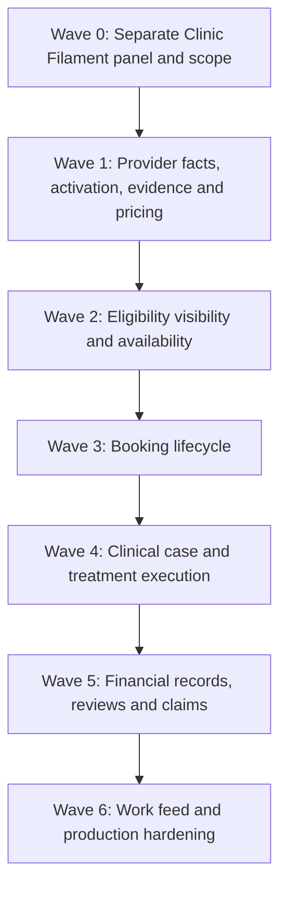

# UberTib Clinic / Doctor Implementation Plan

**Phase:** 3 — Execution  
**Plan:** 2 of 3 platform implementation plans  
**Platform:** Clinic / Dentist / Clinic Staff Dashboard  
**Runtime:** Existing Laravel application under `UberTip-Backend/`  
**Interaction layer:** Filament 5 — separate panel from Admin  
**Routing:** Separate Filament panel; proposed path prefix `/clinic`  
**Baseline:** 2026-08-24  
**Canonical product behavior:** `docs/PRD.md`  
**Canonical technical design:** `docs/SDD.md` and Phase 2 engineering documents  
**Authorization owner:** `docs/domain/PERMISSIONS_MATRIX.md`  
**Lifecycle owner:** `docs/domain/STATE_MACHINES.md`  
**Testing owner:** `docs/TESTING_STRATEGY.md`

## 1. Purpose

This plan defines the dependency-ordered implementation work for the UberTib **Clinic / Doctor Dashboard**.

The Clinic platform is a separate Filament panel inside the same Laravel application. It is not an extension of the Admin navigation and it does not grant administrative governance powers. Clinic users operate only their authorized provider, clinic, branch, booking, treatment, financial-record, review, and claim contexts.

The panel must reuse the same application actions, policies, models, state machines, audit infrastructure, evidence service, and domain rules used by Admin and the Patient API. Filament is an interaction adapter; eligibility, booking, clinical, financial, and claim behavior must not be reimplemented inside resource/page classes.

This file does not define visual design, layouts, colors, component styling, or navigation UX. Resource/page names below describe implementation ownership only. The UX chain may later refine presentation without changing the domain behavior in this plan.

`Q-PLATFORM-001` remains a Blocker for claiming complete reconciliation against readable SRS v1.1. Production catalog and S/P/H/I behavior remain governed by `Q-CATALOG-001` and `Q-ELIG-001`.

## 2. Filament Panel Decision

The Clinic dashboard shall be implemented as a **second Filament panel**, independent from the existing Admin panel.

Verified current state:

- `AdminPanelProvider` exists;
- Admin panel ID is `admin`;
- Admin panel path is `/admin`;
- no Clinic Filament panel is currently verified in the repository.

Required target:

| Concern | Admin | Clinic target |
|---|---|---|
| Panel provider | `AdminPanelProvider` | `ClinicPanelProvider` (Proposed) |
| Panel ID | `admin` | `clinic` (Proposed) |
| Route path | `/admin` | `/clinic` (Proposed prefix) |
| Resources | `App\Filament\Resources` / Admin-owned surfaces | `App\Filament\Clinic\Resources` (Proposed) |
| Pages | Admin operational/governance pages | `App\Filament\Clinic\Pages` (Proposed) |
| Widgets | Admin operational widgets | `App\Filament\Clinic\Widgets` (Proposed) |
| Identity source | shared `User` model | shared `User` model |
| Business actions | shared Laravel application layer | same shared application layer |
| Authorization | staff governance scopes | provider/clinic/branch/case scopes |

`/clinic` is a proposed concrete prefix because the requirement only states that Clinic must use a routing prefix different from Admin. It should remain easy to replace before implementation if another prefix is selected.

The Clinic panel must not discover Admin resources or inherit Admin-only actions accidentally.

## 3. Platform Ownership

The three platform plans divide responsibility as follows:

| Plan | Primary owner |
|---|---|
| Admin | governance, verification, policy, launch readiness, operational review, sensitive decisions, reporting |
| Clinic — this file | provider/branch submissions, prices, availability, booking response, clinician-authored plans/stages/evidence, clinic-side financial records, review/claim participation |
| Patient Mobile | patient verification, discovery, booking initiation, acceptance, case consumption, patient-side finance/review/claim actions |

Cross-platform workflows may span all three, but authoritative actions remain implemented once in Laravel.

Examples:

- Clinic submits evidence; Admin verifies it; eligibility engine computes the result.
- Patient requests booking; Clinic responds; Patient may accept an alternative; system confirms only after revalidation.
- Dentist authors a treatment plan; Patient accepts it; the system creates immutable accepted snapshots.
- Clinic reports an external payment; another authorized party may confirm/dispute it; UberTib never transfers money.
- Patient creates a claim; Clinic may respond with evidence; authorized Admin reviewers make sensitive decisions.

## 4. Verified Starting Point and Dependencies

The current repository already provides the Laravel/Filament foundation and a narrow catalog/governance domain, but no verified Clinic panel.

This plan depends on shared foundations defined by the Admin implementation plan. Clinic work must reuse them instead of creating alternate implementations.

Important upstream tasks include:

- `TASK-PLATFORM-001` — Admin/application access hardening foundation;
- `TASK-IDENTITY-001`–`003` — roles, scoped authorization, privileged auth readiness;
- `TASK-AUDIT-001`–`002` — audit/provenance and idempotency;
- `TASK-PLATFORM-002` — private evidence service;
- `TASK-POLICY-001` — versioned policy foundation;
- `TASK-ELIG-001`–`006` — provider verification, approved facts, policy inputs, eligibility/recalculation;
- `TASK-OPS-002` — operational work-item foundation;
- `TASK-FINANCE-001`–`003` — shared immutable financial-event model;
- `TASK-REVIEWS-001` — shared review integrity model;
- `TASK-CLAIMS-001`–`004` — shared claims/appeals model.

Clinic tasks can be developed in parallel with some Admin presentation tasks after the shared domain dependency exists, but must not create duplicate tables/actions to unblock the panel temporarily.

## 5. Clinic Actor and Scope Model

The Clinic panel supports the provider-side actor categories already established by the permissions model:

- treating dentist;
- clinic/provider representative;
- clinic staff acting within an explicit provider/branch/workflow grant.

The panel must never assume that every authenticated clinic user can see every branch or case.

Every protected query/action evaluates applicable scope:

1. authenticated application identity;
2. provider/clinic relationship;
3. branch grant;
4. service scope where relevant;
5. case/treating-clinician relationship for clinical data;
6. workflow responsibility;
7. effective period of the grant/assignment;
8. purpose and separation-of-duties where applicable.

A clinic user cannot gain access by manually changing a Filament record identifier or route parameter.

## 6. Clinic Functional Sections to Build

These are functional implementation sections, not final navigation design.

| Section | Responsibilities | Main requirements |
|---|---|---|
| Clinic Context | authorized provider/branch context and identity-safe switching | FR-IDENTITY-001, NFR-IDENTITY-001 |
| Provider & Branch Facts | maintain submitted provider/branch facts that require later verification | FR-ELIG-007–008 |
| Service Activation | request service activation, answer required questions, submit evidence | FR-ELIG-007–008 |
| Evidence | upload/view own authorized evidence and verification status | FR-ELIG-007, FR-CLINICAL-003, NFR-PLATFORM-003 |
| Pricing | submit actual provider/service/branch price inputs | FR-ELIG-009, FR-ELIG-014, FR-FINANCE-001 |
| Eligibility Status | read computed status, blockers, safe explanations, reevaluation status | FR-ELIG-002–017 |
| Availability | manage appointment slots/capacity for authorized branches/services | FR-BOOKING-001 |
| Booking Requests | respond accept/reject/alternative within policy deadline | FR-BOOKING-001–003 |
| Cancellation / No-show | provider-side lifecycle actions allowed by policy | FR-BOOKING-002 |
| Cases | access assigned/authorized patient cases | FR-CLINICAL-001–005 |
| Treatment Plans | dentist-authored plan versions and proposal lifecycle | FR-CLINICAL-001–002 |
| Treatment Stages | stage execution, evidence, completion, follow-up | FR-CLINICAL-003–005 |
| Financial Records | clinic-side external payment/refund assertions and confirmations/disputes | FR-FINANCE-001–007 |
| Reviews | view eligible published reviews and submit policy-grounded appeals | FR-REVIEWS-001–002 |
| Claims / Disputes | view/respond to relevant claims, submit evidence, participate in appeals | FR-CLAIMS-001–005 |
| Work Feed | actionable bookings, evidence requests, claim requests, follow-up and exceptions | FR-OPS-001 |

The Clinic panel must not expose policy editing, launch-gate approval, raw internal risk `I`, unrelated clinics, global operational reporting, staff-governance administration, or sensitive final claim-decision actions.

## 7. End-to-End Clinic Flow

### 7.1 Panel access and context

1. User authenticates through the Clinic Filament panel.
2. Panel access verifies that the identity has an active clinic/provider capability and scope.
3. System resolves the clinic/provider and branch contexts the actor may access.
4. Every resource query is constrained server-side to those scopes.
5. If the user loses the relevant grant, subsequent requests are denied even if a Filament page is already open.

### 7.2 Service activation flow

1. Clinic selects an approved service definition available for activation.
2. Clinic provides the required provider/service/branch source facts.
3. Clinic answers only factual questions defined by the effective activation policy/service definition.
4. Clinic uploads required private evidence.
5. Submission creates or updates an activation request; it does **not** create final eligibility.
6. Admin verification reviews facts/evidence.
7. Approved facts trigger eligibility evaluation.
8. Clinic sees resulting status or blockers through a safe read model.

The Clinic UI must never ask the dentist to select `A/B/C/D/F`, `P`, `H`, `I`, or final eligible/not-eligible outcome.

### 7.3 Price and eligibility flow

1. Clinic records the actual price for the exact service/provider/branch context.
2. Price is stored as a source input with effective period/provenance where required.
3. System resolves the active price-band policy and computes `P`.
4. Other approved facts/policies feed S/H/I and final eligibility automatically.
5. Clinic sees patient/provider-safe meaning and actionable blockers.
6. If an influential fact expires or is revoked, the system creates a new evaluation/suspension; Clinic cannot override it.
7. New affected bookings are blocked, while any already-existing booking follows the still-unresolved review workflow under `Q-BOOKING-002`; Clinic must not infer automatic cancellation, confirmation, or another terminal outcome.

### 7.4 Availability and booking flow

1. Authorized clinic staff/dentist manages branch/service availability and capacity.
2. Patient submits a booking request through the Patient API after request-time checks.
3. Clinic receives a scoped actionable request.
4. Provider may accept, reject with reason, or propose an alternative appointment within the response deadline.
5. Accept/alternative confirmation revalidates current eligibility, branch readiness, publication and capacity.
6. An alternative is actionable only while current and unexpired. If it expires or the patient explicitly declines it, the proposal becomes non-actionable, but the canonical resulting booking state remains unresolved under `Q-BOOKING-001`; Clinic must not infer `REJECTED`, `CANCELLED`, or return-to-`REQUESTED`.
7. Capacity is committed transactionally and cannot overbook under concurrent requests.
8. Clinic sees the canonical booking state; it does not maintain a second Filament-only status.

### 7.5 Cancellation and no-show flow

1. Clinic requests cancellation only when actor/state/policy allow it.
2. System creates an auditable transition/event with reason and governing policy context.
3. No-show can be recorded only after the configured threshold.
4. Any financial/review consequence is derived by the system as additional records/events.
5. Clinic cannot silently rewrite the original booking history.

### 7.6 Clinical case and treatment-plan flow

1. Confirmed/authorized workflow creates or exposes the patient case to the appropriate provider context.
2. Treating dentist authors a treatment-plan draft.
3. Draft can be revised until proposed.
4. Proposed plan contains the required clinical plan information and linked financial terms.
5. Patient/guardian acceptance happens through the patient-side workflow.
6. Acceptance creates immutable accepted clinical/financial snapshots.
7. Dentist cannot edit the accepted historical version; amendments create a new plan version and require new acceptance.

UberTib does not generate the diagnosis or treatment plan automatically.

### 7.7 Treatment-stage and evidence flow

1. Clinic opens the current accepted plan/stages.
2. Authorized treating clinician records stage progress.
3. Required evidence/acknowledgements are uploaded and bound to the exact stage.
4. Completion action rechecks required evidence and governing accepted snapshot.
5. Completion creates durable history and may trigger the next stage/follow-up.
6. Follow-up scheduling/reminders derive from the accepted plan/policy.

### 7.8 External financial-record flow

1. Payment/refund/compensation occurs outside UberTib.
2. Authorized clinic actor may report the external event against the correct case/financial snapshot.
3. Report is an assertion, not settlement.
4. Counterparty/authorized reviewer may confirm or dispute it.
5. Correction creates another event; the original report is never edited away.
6. Clinic sees derived financial status from event history.
7. No Clinic action can initiate a card charge, bank transfer, wallet movement, escrow release, payout, or electronic refund.

### 7.9 Review flow

1. Patient may publish a verified review only when eligibility rules are met.
2. Clinic may view reviews associated with its eligible completed experiences according to policy.
3. An affected authorized party may submit a review appeal with policy-grounded reason/evidence.
4. Clinic cannot edit the patient's rating/review directly.
5. Review rating `R` never changes S/P/H/I.

### 7.10 Claim/dispute flow

1. Patient creates an eligible claim/refund request.
2. Clinic sees only claims tied to its authorized case/provider context.
3. Clinic may provide requested evidence or an attributable response where the workflow permits it.
4. Clinic cannot make the final sensitive Admin decision merely because it is a party to the claim.
5. If an appeal right exists for the affected party, Clinic can submit the appeal through the shared claim-appeal action.
6. Claim/refund outcomes still create external obligations/records, never platform money movement.

## 8. Shared Implementation Conventions

All Clinic tasks must follow these constraints:

- Filament resources/pages invoke shared application actions/query services.
- No business rule lives only in a Filament callback.
- Authorization is enforced at query/action/policy level, not only by hiding buttons/navigation.
- Clinic data is scoped by provider/branch/case on the server.
- Accepted snapshots, eligibility decisions, financial events, and audit history are immutable as defined by canonical documents.
- Clinic users supply source facts; the system derives S/P/H/I and eligibility.
- Internal risk `I` is never exposed to ordinary Clinic actors.
- Clinical plans are authored only by authorized treating clinicians.
- Evidence remains private and uses the shared quarantine/download service.
- Every retry-prone sensitive command uses shared idempotency behavior where applicable.
- Notifications/work items are dispatched after authoritative commit.
- Clinic panel language/presentation must remain compatible with Arabic-first/RTL requirements, while UX specifics remain downstream.

## 9. Dependency Waves

---

# Wave 0 — Separate Clinic Filament Panel and Scope

## TASK-PLATFORM-005 — Create the Separate Clinic Filament Panel
**Implements:** FR-IDENTITY-001, NFR-IDENTITY-001, NFR-PLATFORM-007  
**Goal:** Add a second Filament panel isolated from Admin and mounted under a distinct route prefix.  
**Dependencies:** TASK-IDENTITY-001, TASK-AUDIT-001  
**Expected Files / Areas:** `app/Providers/Filament/ClinicPanelProvider.php` (Proposed); provider registration; `app/Filament/Clinic/{Resources,Pages,Widgets}` (Proposed)  
**Implementation Notes:** Proposed panel ID `clinic`, path `/clinic`. Use independent resource/page/widget discovery paths so Admin-only resources are not exposed. Reuse shared application identity and domain services.  
**Data / Migration Impact:** None.  
**API Impact:** None.  
**Tests Required:** route prefix isolation; Admin resources absent; Clinic resources absent from Admin; unauthenticated redirect/login behavior.  
**Verification:** `php artisan route:list --path=clinic`; `php artisan test --compact tests/Feature/Clinic/ClinicPanelTest.php`; `composer test:types`; `composer test:lint`  
**Definition of Done:**
- [ ] Clinic has a dedicated Filament panel
- [ ] Clinic routes do not use `/admin`
- [ ] Admin resources are not discovered in Clinic
- [ ] Shared backend remains one Laravel application

## TASK-IDENTITY-004 — Enforce Clinic Panel Access and Provider/Branch Scope
**Implements:** FR-IDENTITY-001, NFR-IDENTITY-001  
**Goal:** Allow only appropriately scoped clinic/provider actors to enter and operate the Clinic panel.  
**Dependencies:** TASK-PLATFORM-005, TASK-IDENTITY-002  
**Expected Files / Areas:** panel-access policy; provider/branch scope resolvers; Eloquent scoped queries; Clinic resource authorization; tests  
**Implementation Notes:** Clinic panel login does not imply access to all clinics/branches. Every query/action must resolve active grants/relationships and fail closed after expiry/revocation. Identifier tampering must not expose another clinic.  
**Data / Migration Impact:** Reuse staff/provider/branch grants from shared identity/provider domain.  
**API Impact:** None.  
**Tests Required:** allow correct scope; deny unrelated clinic/branch; revoked/expired scope; cross-route record tampering.  
**Verification:** `php artisan test --compact tests/Feature/Clinic/ClinicAuthorizationTest.php`; `composer test:mysql`; `composer test`  
**Definition of Done:**
- [ ] Panel access and resource access are separate checks
- [ ] Provider/branch isolation is server-enforced
- [ ] Grant revocation takes effect immediately
- [ ] Relevant tests pass

# Wave 1 — Provider Facts, Activation, Evidence, and Pricing

## TASK-ELIG-007 — Build Clinic Provider and Branch Fact Submission Context
**Implements:** FR-ELIG-007–008, FR-AUDIT-001  
**Goal:** Let Clinic actors maintain the factual provider/branch information required by activation workflows without self-approving it.  
**Dependencies:** TASK-IDENTITY-004, TASK-ELIG-001  
**Expected Files / Areas:** Clinic provider/branch resources/pages (Proposed); source-fact submission actions; provider/branch models; tests  
**Implementation Notes:** Separate submitted facts from Admin-approved facts. Preserve source actor, branch/service scope, effective/expiry metadata where applicable. Verified values cannot be silently overwritten; changes become new submissions requiring the governed review path when material.  
**Data / Migration Impact:** Reuse provider/clinic/branch and source-fact structures from `ERD.md`.  
**API Impact:** None.  
**Tests Required:** own-scope update; cross-branch denial; submitted vs approved truth; material change triggers review/recalculation path.  
**Verification:** `php artisan test --compact tests/Feature/Clinic/ProviderFactsTest.php`; `composer test:mysql`; `composer test`  
**Definition of Done:**
- [ ] Clinic can submit factual provider/branch data
- [ ] Clinic cannot self-approve governed facts
- [ ] Provenance is retained
- [ ] Relevant tests pass

## TASK-ELIG-008 — Implement Clinic Service Activation Request Workflow
**Implements:** FR-ELIG-007–008  
**Goal:** Let an authorized provider request activation for an exact service-definition version and branch.  
**Dependencies:** TASK-ELIG-007, TASK-CATALOG-001  
**Expected Files / Areas:** Clinic activation resource/page (Proposed); shared activation actions/models; requirement/question resolver; tests  
**Implementation Notes:** Resolve required questions/facts from the effective approved service/policy definition. Inputs are factual/choice answers used by backend evaluation; never expose controls for final S/P/H/I/eligibility. Submission enters Admin verification/work flow.  
**Data / Migration Impact:** Reuse `service_activation_requests` and related fact/evidence bindings.  
**API Impact:** None.  
**Tests Required:** correct service/branch/version scope; missing required answers; unapproved service unavailable; no final-outcome input accepted.  
**Verification:** `php artisan test --compact tests/Feature/Clinic/ServiceActivationTest.php`; `composer test`  
**Definition of Done:**
- [ ] Activation is exact provider/service/branch scoped
- [ ] Required source inputs are captured
- [ ] Final classifications cannot be submitted manually
- [ ] Verification workflow is triggered

## TASK-PLATFORM-006 — Integrate Private Evidence into Clinic Workflows
**Implements:** FR-ELIG-007, FR-CLINICAL-003, FR-CLAIMS-003, NFR-PLATFORM-003  
**Goal:** Allow Clinic actors to upload/view only authorized private evidence using the shared evidence service.  
**Dependencies:** TASK-PLATFORM-002, TASK-IDENTITY-004  
**Expected Files / Areas:** Clinic evidence upload/view actions; evidence bindings; shared private-storage service; tests  
**Implementation Notes:** Do not implement a second media pipeline. Preserve size/type/decode/hash/quarantine/scan rules. A quarantined/rejected item cannot satisfy a requirement. Downloads require fresh authorization and audit.  
**Data / Migration Impact:** Reuse `evidence_items` / `evidence_bindings`.  
**API Impact:** None for Clinic Filament panel.  
**Tests Required:** valid upload; invalid type/size; quarantine; unauthorized binding/download; scan rejection; audit on access.  
**Verification:** `php artisan test --compact tests/Feature/Clinic/ClinicEvidenceTest.php`; `composer test:mysql`; `composer test`  
**Definition of Done:**
- [ ] Clinic evidence uses private shared storage
- [ ] Quarantine/scan state is respected
- [ ] Cross-case/branch evidence access is denied
- [ ] Access is audited

## TASK-FINANCE-004 — Implement Provider Service Price Submission
**Implements:** FR-ELIG-009, FR-ELIG-014, FR-FINANCE-001  
**Goal:** Let the provider maintain the actual quoted/service price input for an authorized provider/service/branch context.  
**Dependencies:** TASK-ELIG-008, TASK-ELIG-003  
**Expected Files / Areas:** Clinic price resource/action (Proposed); `provider_service_prices`; policy/effective-date resolver; tests  
**Implementation Notes:** Clinic submits actual price only. Pricing class `P` remains computed from effective price bands. Historical accepted prices are never rewritten by later price updates.  
**Data / Migration Impact:** Reuse `provider_service_prices` from the canonical ERD.  
**API Impact:** Patient-safe prices later exposed through approved patient APIs, not through Filament.  
**Tests Required:** branch/service authorization; effective-date behavior; price validation; P is not writable; later price does not alter historical snapshots.  
**Verification:** `php artisan test --compact tests/Feature/Clinic/ProviderServicePriceTest.php`; `composer test:mysql`; `composer test`  
**Definition of Done:**
- [ ] Actual price is a source fact
- [ ] P remains system-computed
- [ ] Historical agreements remain immutable
- [ ] Relevant tests pass

# Wave 2 — Eligibility Visibility and Availability

## TASK-ELIG-009 — Build Clinic Eligibility and Readiness Projection
**Implements:** FR-ELIG-002–006, FR-ELIG-016–017  
**Goal:** Give Clinic actors an actionable read-only view of their computed service eligibility and blocking conditions.  
**Dependencies:** TASK-ELIG-004–006, TASK-IDENTITY-004  
**Expected Files / Areas:** Clinic eligibility query/page/resource (Proposed); shared decision projections; tests  
**Implementation Notes:** Show current effective outcome, safe component meaning, blockers, stale/recalculation state, policy/evaluation time as permitted. Do not expose raw internal `I` to ordinary clinic users and do not provide edit controls for S/P/H/I/final outcome.  
**Data / Migration Impact:** None beyond shared eligibility tables.  
**API Impact:** None.  
**Tests Required:** eligible/pending/suspended/not-eligible views; blocker visibility; raw I hidden; cross-provider denial; immutable decision.  
**Verification:** `php artisan test --compact tests/Feature/Clinic/EligibilityStatusTest.php`; `composer test`  
**Definition of Done:**
- [ ] Clinic can understand actionable eligibility state
- [ ] Internal/protected data is filtered
- [ ] No manual override exists
- [ ] Relevant tests pass

## TASK-BOOKING-003 — Implement Clinic Appointment Slot and Capacity Management
**Implements:** FR-BOOKING-001, NFR-AUDIT-002  
**Goal:** Provide authoritative availability/capacity inputs used by patient booking and provider response workflows.  
**Dependencies:** TASK-IDENTITY-004, TASK-ELIG-009  
**Expected Files / Areas:** `appointment_slots`; Clinic availability resource/page; slot actions; policies; tests  
**Implementation Notes:** Slot belongs to exact branch/service/provider context with capacity and time. Do not permit availability for a service context the actor cannot manage. Booking confirmation remains responsible for transactional capacity enforcement.  
**Data / Migration Impact:** Add/reuse `appointment_slots` per `ERD.md` with indexes supporting availability queries and locking.  
**API Impact:** Patient availability APIs consume shared query services later.  
**Tests Required:** create/update authorized slot; invalid interval/capacity; cross-branch denial; disabling slot blocks new selection; MySQL locking prerequisites.  
**Verification:** `php artisan test --compact tests/Feature/Clinic/AppointmentSlotTest.php`; `composer test:mysql`; `composer test`  
**Definition of Done:**
- [ ] Availability is authoritative and branch/service scoped
- [ ] Capacity inputs are validated
- [ ] Patient API can reuse the same query model
- [ ] Relevant tests pass

# Wave 3 — Booking Lifecycle

## TASK-BOOKING-004 — Build Incoming Clinic Booking Request Worklist
**Implements:** FR-BOOKING-001–003, FR-OPS-001  
**Goal:** Surface only actionable provider-side booking requests, response deadlines, and alternatives for authorized branches.  
**Dependencies:** TASK-BOOKING-003, TASK-OPS-002, patient booking creation action when available  
**Expected Files / Areas:** Clinic booking resource/page; shared booking query; work-item projection; tests  
**Implementation Notes:** Read canonical booking states/deadlines. Worklist is a projection; booking aggregate remains authoritative. Expired/non-actionable requests must not expose active response actions. Alternative expiry/decline must not be translated into an invented booking terminal/rollback state while `Q-BOOKING-001` is open.  
**Data / Migration Impact:** Reuse `bookings`, `booking_events`, `booking_alternatives`, `work_items`.  
**API Impact:** None.  
**Tests Required:** branch scoping; deadline ordering; actionable vs terminal states; expired alternative non-actionability without invented outcome; no access to unrelated patient bookings.  
**Verification:** `php artisan test --compact tests/Feature/Clinic/BookingWorklistTest.php`; `composer test`  
**Definition of Done:**
- [ ] Provider sees only scoped actionable requests
- [ ] Deadline/state source is canonical
- [ ] Work projection does not duplicate domain truth
- [ ] Relevant tests pass

## TASK-BOOKING-005 — Implement Provider Accept, Reject, and Alternative Actions
**Implements:** FR-BOOKING-001, FR-BOOKING-003, NFR-AUDIT-002  
**Goal:** Implement provider-side response actions with transaction-safe revalidation and deadline enforcement.  
**Dependencies:** TASK-BOOKING-004, TASK-ELIG-005, TASK-AUDIT-002  
**Expected Files / Areas:** shared booking response actions; Clinic Filament actions; booking events/alternatives; tests  
**Implementation Notes:** Accept revalidates publication/readiness/eligibility/capacity. Reject requires reason. Alternative stores proposed appointment context and awaits patient acceptance. Deadline is 12 hours or two hours before appointment, whichever occurs first. If the alternative expires or is declined, preserve history and disable acceptance but do not infer the resulting booking state until `Q-BOOKING-001` is resolved.  
**Data / Migration Impact:** Reuse booking/alternative/event structures.  
**API Impact:** Shared actions must also support patient alternative acceptance API.  
**Tests Required:** valid accept/reject/alternative; expired deadline; expired/declined alternative non-actionability without invented terminal state; failed eligibility/capacity; duplicate command idempotency; 100-way capacity test remains required globally.  
**Verification:** `php artisan test --compact tests/Feature/Booking/ProviderBookingResponseTest.php`; `composer test:mysql`; `composer test`  
**Definition of Done:**
- [ ] Provider responses follow canonical transitions
- [ ] Safety revalidation cannot be bypassed
- [ ] Alternative requires patient acceptance
- [ ] Unresolved alternative outcome is not fabricated
- [ ] Duplicate response is safe

## TASK-BOOKING-006 — Implement Provider Cancellation and No-Show Actions
**Implements:** FR-BOOKING-002, FR-AUDIT-001–002  
**Goal:** Allow provider-side cancellation/no-show only when current state, actor, deadline and policy permit it.  
**Dependencies:** TASK-BOOKING-005, TASK-POLICY-001  
**Expected Files / Areas:** shared cancellation/no-show actions; Clinic actions; booking event history; tests  
**Implementation Notes:** Record actor/reason/policy/prior/result state. No-show fails before the configured threshold. Consequences are derived through subsequent workflows; do not edit historical events.  
**Data / Migration Impact:** Reuse append-only `booking_events`.  
**API Impact:** Patient cancellation later invokes the same rule layer with a different actor scope.  
**Tests Required:** allowed/denied cancellation; premature no-show; terminal-state rejection; cross-branch denial; audit trail.  
**Verification:** `php artisan test --compact tests/Feature/Booking/ProviderCancellationNoShowTest.php`; `composer test`  
**Definition of Done:**
- [ ] Provider lifecycle actions are policy/state gated
- [ ] No-show threshold is enforced
- [ ] History is append-only/auditable
- [ ] Relevant tests pass

# Wave 4 — Clinical Case and Treatment Execution

## TASK-CLINICAL-002 — Implement Clinic Case Access and Treating-Clinician Scope
**Implements:** FR-CLINICAL-001–005, NFR-IDENTITY-001  
**Goal:** Expose only cases the clinic/provider actor is permitted to handle and distinguish treating-clinician authority from ordinary clinic staff access.  
**Dependencies:** TASK-BOOKING-005, TASK-IDENTITY-004  
**Expected Files / Areas:** case models/query services; Clinic case resource/page; clinician assignment/relationship authorization; tests  
**Implementation Notes:** Case remains patient-owned. Provider access derives from confirmed care context and active assignment/grant. Ordinary staff may not gain clinical authorship merely from branch access.  
**Data / Migration Impact:** Add/reuse `cases` and treating/provider relationships per `ERD.md`.  
**API Impact:** Patient case APIs consume role-filtered projections later.  
**Tests Required:** treating dentist allow; clinic staff restricted action; unrelated provider deny; patient ownership preserved.  
**Verification:** `php artisan test --compact tests/Feature/Clinic/ClinicCaseAccessTest.php`; `composer test:mysql`; `composer test`  
**Definition of Done:**
- [ ] Case access is provider/case scoped
- [ ] Clinical authorship requires treating-clinician authority
- [ ] Patient remains case owner
- [ ] Relevant tests pass

## TASK-CLINICAL-003 — Implement Dentist-Authored Treatment Plan Versioning
**Implements:** FR-CLINICAL-001–002, NFR-AUDIT-003  
**Goal:** Let authorized treating dentists author and version treatment plans without AI/system-generated diagnosis or silent historical edits.  
**Dependencies:** TASK-CLINICAL-002, TASK-POLICY-001  
**Expected Files / Areas:** `treatment_plan_versions`, `treatment_plan_stages`; plan actions; Clinic plan/stage resources/pages; tests  
**Implementation Notes:** Draft is editable; proposal freezes the submitted version for patient review. Amendment after acceptance creates a new version. System may validate required fields but does not author clinical conclusions.  
**Data / Migration Impact:** Reuse canonical treatment-plan/version/stage tables.  
**API Impact:** Patient plan-read/accept APIs consume the same version identity later.  
**Tests Required:** dentist-only authorship; draft revision; propose; accepted version immutable; amendment creates new version; unauthorized staff denied.  
**Verification:** `php artisan test --compact tests/Feature/Clinical/TreatmentPlanVersionTest.php`; `composer test:mysql`; `composer test`  
**Definition of Done:**
- [ ] Plans are clinician-authored
- [ ] Accepted history cannot be edited
- [ ] Amendments use new versions
- [ ] Relevant tests pass

## TASK-CLINICAL-004 — Implement Plan Proposal and Patient-Acceptance Handshake
**Implements:** FR-CLINICAL-002, FR-FINANCE-001, NFR-AUDIT-003  
**Goal:** Connect the Clinic plan proposal to the patient acceptance workflow and immutable accepted snapshots.  
**Dependencies:** TASK-CLINICAL-003, TASK-FINANCE-004, TASK-FINANCE-001  
**Expected Files / Areas:** shared propose/accept actions; accepted treatment snapshot; financial terms snapshot integration; Clinic read state; tests  
**Implementation Notes:** Clinic proposes; Patient/guardian accepts through patient-side contract. Acceptance atomically creates immutable clinical and financial snapshots tied to exact plan/policy/price version. Clinic may read acceptance state but cannot impersonate patient acceptance.  
**Data / Migration Impact:** Reuse `accepted_treatment_snapshots`, `financial_terms_snapshots`.  
**API Impact:** Patient acceptance endpoint is required by Patient plan; Clinic Filament invokes no patient-accept action.  
**Tests Required:** proposal → patient acceptance; unauthorized clinic acceptance denied; atomic snapshots; amendment requires new acceptance.  
**Verification:** `php artisan test --compact tests/Feature/Clinical/TreatmentPlanAcceptanceTest.php`; `composer test:mysql`; `composer test`  
**Definition of Done:**
- [ ] Acceptance identity is the patient/authorized guardian
- [ ] Clinical + financial terms are snapshotted immutably
- [ ] Clinic cannot fake patient acceptance
- [ ] Relevant tests pass

## TASK-FINANCE-005 — Implement Clinic Financial Terms Preparation
**Implements:** FR-FINANCE-001, FR-CLINICAL-001–002  
**Goal:** Capture provider-proposed financial terms that accompany a treatment-plan version before patient acceptance.  
**Dependencies:** TASK-CLINICAL-003, TASK-FINANCE-004  
**Expected Files / Areas:** financial term preparation/value objects; Clinic plan financial section; shared snapshot builder; tests  
**Implementation Notes:** Terms reference actual proposed price/service/stages and policy context. They are not a wallet/invoice-payment engine. Editing is allowed only while the associated proposal/version remains editable; accepted terms are immutable.  
**Data / Migration Impact:** Reuse plan data plus immutable financial snapshot on acceptance; avoid payment-transaction tables.  
**API Impact:** Patient plan payload later exposes patient-safe proposed terms.  
**Tests Required:** draft term validation; accepted terms immutable; new amendment creates new proposal; no gateway/balance fields.  
**Verification:** `php artisan test --compact tests/Feature/Finance/ClinicFinancialTermsTest.php`; `composer test`  
**Definition of Done:**
- [ ] Proposed financial terms are tied to plan version
- [ ] Accepted terms cannot be rewritten
- [ ] No money-movement primitive is introduced
- [ ] Relevant tests pass

## TASK-CLINICAL-005 — Implement Treatment Stage Execution and Evidence Completion
**Implements:** FR-CLINICAL-003–004, NFR-AUDIT-003  
**Goal:** Let the treating workflow record stage progress and complete stages only when accepted-plan evidence requirements are satisfied.  
**Dependencies:** TASK-CLINICAL-004, TASK-PLATFORM-006  
**Expected Files / Areas:** `case_treatment_stages`; stage transition/actions; Clinic stage page/resource; evidence bindings; tests  
**Implementation Notes:** Resolve requirements from the accepted snapshot, not mutable current defaults. Completion revalidates required evidence/acknowledgements and creates durable history. Invalid transitions fail without mutation.  
**Data / Migration Impact:** Reuse stage/event/evidence structures from ERD.  
**API Impact:** Patient timeline reads resulting stage state later.  
**Tests Required:** allowed transition; missing evidence denial; wrong clinician denial; accepted snapshot rule use; invalid transition rejection.  
**Verification:** `php artisan test --compact tests/Feature/Clinical/TreatmentStageTest.php`; `composer test:mysql`; `composer test`  
**Definition of Done:**
- [ ] Stage lifecycle matches `STATE_MACHINES.md`
- [ ] Evidence requirements are enforced from accepted snapshot
- [ ] Invalid transition cannot mutate state
- [ ] Relevant tests pass

## TASK-CLINICAL-006 — Implement Clinic Follow-Up Workflow
**Implements:** FR-CLINICAL-005, FR-OPS-001  
**Goal:** Track required follow-up from accepted plan/policy and surface actionable follow-up to the clinic.  
**Dependencies:** TASK-CLINICAL-005, TASK-OPS-002  
**Expected Files / Areas:** `follow_ups`; follow-up scheduler/actions; Clinic follow-up worklist; notification intents; tests  
**Implementation Notes:** Due dates derive from accepted treatment/policy data. Delivery failure does not change the clinical due state. Completion/escalation is auditable.  
**Data / Migration Impact:** Reuse/add `follow_ups` per ERD.  
**API Impact:** Patient reminders/timeline later reuse same authoritative state.  
**Tests Required:** due calculation from snapshot; scoped worklist; completion; overdue/escalation; failed notification does not complete follow-up.  
**Verification:** `php artisan test --compact tests/Feature/Clinical/FollowUpTest.php`; `composer test`  
**Definition of Done:**
- [ ] Follow-up is derived from accepted care context
- [ ] Clinic sees only assigned/scoped follow-up
- [ ] Delivery state is separate from clinical state
- [ ] Relevant tests pass

# Wave 5 — Financial Records, Reviews, and Claims

## TASK-FINANCE-006 — Implement Clinic External Financial Event Participation
**Implements:** FR-FINANCE-002–003, FR-FINANCE-005–007, NFR-FINANCE-001  
**Goal:** Let authorized Clinic actors report/confirm/dispute money activity that occurred outside UberTib.  
**Dependencies:** TASK-FINANCE-001–002, TASK-CLINICAL-004, TASK-AUDIT-002  
**Expected Files / Areas:** shared financial-event actions; Clinic financial resource/page; policies; tests  
**Implementation Notes:** Report is append-only assertion tied to case + immutable terms. Confirmation/dispute creates another event. Derived status is projected from ordered events. No electronic transfer action exists.  
**Data / Migration Impact:** Reuse `financial_events` and `financial_terms_snapshots`.  
**API Impact:** Patient counterparty actions later call the same shared actions.  
**Tests Required:** clinic report; authorized confirm/dispute; cross-case denial; duplicate idempotency; historical event immutable; no platform payment path.  
**Verification:** `php artisan test --compact tests/Feature/Finance/ClinicFinancialEventTest.php`; `composer test:mysql`; `composer test`  
**Definition of Done:**
- [ ] Clinic records external facts only
- [ ] Original assertions remain immutable
- [ ] Confirm/dispute is separately attributed
- [ ] No money movement exists

## TASK-FINANCE-007 — Implement Clinic External Refund / Compensation Record Participation
**Implements:** FR-FINANCE-004, FR-FINANCE-007, FR-CLAIMS-001, NFR-FINANCE-001  
**Goal:** Let Clinic actors see and record their permitted part of externally executed refund/compensation obligations.  
**Dependencies:** TASK-FINANCE-003, TASK-FINANCE-006  
**Expected Files / Areas:** Clinic external-action-due projection/actions; shared finance events; evidence binding; tests  
**Implementation Notes:** Approved obligation is not payment execution. Clinic may report external execution only after it occurred outside the platform; confirmation/dispute remains append-only.  
**Data / Migration Impact:** No wallet/payment tables; reuse financial/claim records.  
**API Impact:** Patient counterpart confirmation later reuses shared contract.  
**Tests Required:** obligation visibility scope; report execution; confirm/dispute; cannot mark execution through a synthetic gateway action.  
**Verification:** `php artisan test --compact tests/Feature/Finance/ClinicRefundTrackingTest.php`; `composer test`  
**Definition of Done:**
- [ ] External obligation and execution are distinct
- [ ] Clinic cannot initiate platform refund
- [ ] History remains reproducible
- [ ] Relevant tests pass

## TASK-REVIEWS-002 — Implement Clinic Review Visibility and Appeal Submission
**Implements:** FR-REVIEWS-001–002  
**Goal:** Allow an affected provider-side actor to view applicable verified reviews and submit a policy-grounded appeal without editing review content.  
**Dependencies:** TASK-REVIEWS-001, TASK-IDENTITY-004  
**Expected Files / Areas:** Clinic review query/resource; shared review-appeal submission action; evidence integration; tests  
**Implementation Notes:** Clinic cannot create patient reviews, edit rating/content, or use R as scientific classification. Appeal records appellant, review, reason, evidence and time; Admin integrity workflow owns the decision.  
**Data / Migration Impact:** Reuse `reviews` / `review_appeals`.  
**API Impact:** Patient review actions remain Patient plan responsibility.  
**Tests Required:** scoped review visibility; appeal submission; direct review edit denied; R isolated from eligibility.  
**Verification:** `php artisan test --compact tests/Feature/Reviews/ClinicReviewAppealTest.php`; `composer test`  
**Definition of Done:**
- [ ] Clinic can submit eligible appeals
- [ ] Review content/rating is not directly editable
- [ ] Admin remains decision owner
- [ ] R does not affect S/P/H/I

## TASK-CLAIMS-005 — Implement Clinic Claim Response and Evidence Participation
**Implements:** FR-CLAIMS-001–004, FR-OPS-001  
**Goal:** Allow provider-side parties to respond to relevant claims and provide evidence without owning the final sensitive decision.  
**Dependencies:** TASK-CLAIMS-001–003, TASK-PLATFORM-006, TASK-IDENTITY-004  
**Expected Files / Areas:** Clinic claims query/resource; claim-response/evidence actions; work items; tests  
**Implementation Notes:** Only claims tied to authorized cases/providers appear. Responses/evidence are attributable. The clinic cannot finalize sensitive medical/legal/high-impact financial outcomes when it is the affected party.  
**Data / Migration Impact:** Reuse claims/evidence/work items; add response event structure only if canonical design requires it rather than mutating claim truth.  
**API Impact:** None.  
**Tests Required:** scoped claim visibility; evidence submission; unrelated claim denied; clinic final-decision attempt denied; deadline state shown correctly.  
**Verification:** `php artisan test --compact tests/Feature/Claims/ClinicClaimResponseTest.php`; `composer test:mysql`; `composer test`  
**Definition of Done:**
- [ ] Clinic can participate but cannot self-adjudicate
- [ ] Responses/evidence are attributable
- [ ] Scope/deadline rules are enforced
- [ ] Relevant tests pass

## TASK-CLAIMS-006 — Implement Clinic Claim Appeal Participation
**Implements:** FR-CLAIMS-005, FR-AUDIT-001  
**Goal:** Allow an eligible affected provider-side actor to submit a claim appeal when the governing policy grants that right.  
**Dependencies:** TASK-CLAIMS-004, TASK-CLAIMS-005  
**Expected Files / Areas:** shared appeal submission action; Clinic appeal page/action; evidence binding; tests  
**Implementation Notes:** Original claim/decision stays immutable. Appeal records appellant, grounds, evidence and submission time. Eligibility/deadline derives from governing snapshot. Admin reviewer assignment/SoD remains outside Clinic authority.  
**Data / Migration Impact:** Reuse `claim_appeals`.  
**API Impact:** Patient-side appeal uses same application action with patient authorization later.  
**Tests Required:** eligible/ineligible appeal; expired deadline; unrelated provider denial; original decision unchanged.  
**Verification:** `php artisan test --compact tests/Feature/Claims/ClinicClaimAppealTest.php`; `composer test`  
**Definition of Done:**
- [ ] Eligible provider appeal can be submitted
- [ ] Original decision remains immutable
- [ ] SoD/reviewer assignment is not controlled by Clinic
- [ ] Relevant tests pass

# Wave 6 — Work Feed and Production Hardening

## TASK-OPS-004 — Build Clinic Actionable Work Feed and Status Projections
**Implements:** FR-OPS-001, FR-BOOKING-003, FR-CLINICAL-005, FR-CLAIMS-003, NFR-PLATFORM-008  
**Goal:** Give Clinic actors one scoped source of actionable work without duplicating domain state.  
**Dependencies:** TASK-OPS-002 and applicable Clinic workflows above  
**Expected Files / Areas:** Clinic dashboard/work page (Proposed); scoped `work_items` query; notification-intent reads; tests  
**Implementation Notes:** May include activation evidence requests, booking responses, treatment/follow-up items, claim evidence requests and blocked/retry statuses. Work item links to authoritative resource and does not store its own copy of business truth.  
**Data / Migration Impact:** Reuse `work_items` / `notification_intents`.  
**API Impact:** None.  
**Tests Required:** scope filtering; actionable state; resolved item removal/history; failed notification still leaves work visible.  
**Verification:** `php artisan test --compact tests/Feature/Clinic/ClinicWorkFeedTest.php`; `composer test`  
**Definition of Done:**
- [ ] Clinic receives a scoped actionable work projection
- [ ] Source domains remain authoritative
- [ ] Delivery failures are visible where relevant
- [ ] Relevant tests pass

## TASK-PLATFORM-007 — Complete Clinic Panel Security, Performance, RTL, and Release Hardening
**Implements:** NFR-PLATFORM-001, NFR-PLATFORM-005–008, NFR-IDENTITY-001, NFR-FINANCE-001  
**Goal:** Make the Clinic Filament panel safe and supportable for production use.  
**Dependencies:** All Clinic tasks applicable to release; TASK-PLATFORM-004  
**Expected Files / Areas:** Clinic panel middleware/config; policies; query optimization; logs/metrics; browser/feature tests; deployment checks  
**Implementation Notes:** Verify Arabic-first/RTL compatibility, authorization on every resource/action, safe error handling, query performance, pagination, weak-connectivity-safe mutation semantics where relevant, correlation IDs, queue/work visibility, and zero-money-movement invariant.  
**Data / Migration Impact:** Add only justified indexes discovered by measured queries; no new product feature.  
**API Impact:** None directly.  
**Tests Required:** full Clinic role/scope regression; N+1/query checks where practical; Arabic data; retry/idempotency; forbidden-route probing; financial invariant.  
**Verification:** `composer test:unit`; `composer test:mysql`; `composer test`; `npm run build`  
**Definition of Done:**
- [ ] Clinic panel is isolated from Admin
- [ ] Scope authorization is enforced end to end
- [ ] Arabic/RTL-compatible behavior is verified at implementation level
- [ ] No payment/money-movement path exists
- [ ] Full quality gates pass

## 10. Cross-Platform Dependency Summary

The Clinic plan intentionally owns provider-side interaction while depending on shared Laravel behavior.

| Clinic capability | Shared/Admin dependency | Patient dependency |
|---|---|---|
| Panel access | Identity/scoped grants | None |
| Activation submission | Catalog, evidence, Admin verification | None |
| Eligibility status | Approved facts, policy, evaluator | Patient discovery uses same decisions |
| Availability | Shared booking domain | Patient reads availability |
| Booking response | Eligibility + booking transaction | Patient creates request / accepts alternative |
| Treatment plan | Clinical model/policy | Patient reads/accepts plan |
| Stage progress | Evidence + accepted snapshot | Patient consumes timeline |
| External finance | Shared append-only finance domain | Patient may confirm/dispute/report counterpart facts |
| Review appeal | Review integrity domain | Patient creates verified review |
| Claim participation | Claim/work/evidence domain | Patient creates claim and may appeal |

## 11. Data Ownership Boundary

Clinic users may **submit or author**:

- provider/branch source facts within their scope;
- service activation requests and factual answers;
- private evidence within authorized workflows;
- actual provider prices;
- appointment availability/capacity;
- provider booking responses;
- provider-side cancellation/no-show actions when allowed;
- clinician-authored treatment plans/stages/evidence;
- clinic-side external financial assertions/confirmations/disputes;
- eligible review/claim appeals and claim evidence/responses.

Clinic users may **not author or override**:

- approved verification truth on behalf of Admin reviewers;
- production service publication;
- policy versions or launch gates;
- final S/P/H/I or final eligibility;
- internal risk `I`;
- patient acceptance identity;
- patient review content/rating;
- final sensitive claim decision where Clinic is not authorized/independent;
- platform-executed payments/refunds/transfers.

## 12. Testing Strategy for the Clinic Panel

Clinic implementation must add tests at three levels:

1. **Domain/application tests** for shared actions and state rules.
2. **Filament/feature tests** proving panel access, scoped queries and actions.
3. **Cross-platform contract tests** proving Clinic-generated state is consumed safely by Patient/Admin flows.

At minimum, every material Clinic action must include:

- happy path;
- validation failure;
- unauthorized/wrong-scope actor;
- invalid lifecycle state;
- expired/revoked dependency where relevant;
- duplicate/retry behavior where the action is retry-prone;
- audit/provenance assertion for sensitive actions.

`composer test:mysql` is mandatory for booking concurrency/locking, immutable constraints, and other production-database-sensitive behavior.

## 13. Awaiting Decisions / Governed Release Gates

These items do not prevent building the structural Clinic panel but prevent certain claims of production readiness:

| Item | Impact on Clinic implementation |
|---|---|
| `Q-PLATFORM-001` — readable SRS v1.1 | Cannot claim full source reconciliation |
| `Q-CATALOG-001` — clinical approval of provisional services | Clinic can use evaluation fixtures; production service activation/publication remains gated |
| `Q-ELIG-001` — approved production S/P/H/I formulas | Build engine/input/versioning/readiness behavior; do not label provisional formulas clinically approved |
| `Q-BOOKING-001` — alternative expiry/decline outcome | Make the proposal non-actionable and preserve history, but do not infer the resulting booking terminal/rollback state |
| `Q-BOOKING-002` — existing-booking review after eligibility suspension | Block new affected bookings, but do not invent review authority, deadline, state effect, cancellation/confirmation, or other outcome |
| `Q-PLATFORM-003` — concrete OTP/MFA/malware/storage/notification providers | Use provider-neutral interfaces/fakes; do not invent vendor contracts |
| `Q-OPS-001` — production infrastructure | MySQL is the required production relational engine; hosting/provider/topology, managed-vs-self-hosted deployment, HA/PITR implementation, cache/queue/storage/logging and release infrastructure remain unresolved |
| `Q-PLATFORM-002` — retention legal validation | Clinic uses shared retention mechanism; final legal periods remain governed |

## 14. Task ID Allocation in This Plan

This file continues the append-only task numbering established by `ADMIN_IMPLEMENTATION_PLAN.md`.

Allocated here:

- `TASK-IDENTITY-004`;
- `TASK-ELIG-007` through `TASK-ELIG-009`;
- `TASK-BOOKING-003` through `TASK-BOOKING-006`;
- `TASK-CLINICAL-002` through `TASK-CLINICAL-006`;
- `TASK-FINANCE-004` through `TASK-FINANCE-007`;
- `TASK-REVIEWS-002`;
- `TASK-CLAIMS-005` through `TASK-CLAIMS-006`;
- `TASK-OPS-004`;
- `TASK-PLATFORM-005` through `TASK-PLATFORM-007`.

These IDs are synchronized in `docs/README.md`. The Patient plan continues from the applicable maxima, and future task additions across all plans remain append-only without reusing or renumbering existing IDs.

## 15. Recommended Implementation Order

Implementation should proceed in this order:

1. separate Clinic Filament panel + provider/branch authorization;
2. provider facts/service activation/evidence/pricing;
3. computed eligibility/readiness projection;
4. availability and booking provider actions;
5. case access and treatment-plan versioning;
6. patient-acceptance handshake and accepted snapshots;
7. stage execution/evidence/follow-up;
8. external financial records;
9. review/claim participation;
10. unified Clinic work feed;
11. full Clinic security/performance/RTL/release hardening.

Do not wait for final UI design to implement the domain and authorization foundations, but do not treat temporary Filament resource layout as authoritative UX design.

## 16. Documentation Integration Status

`docs/implementation/USER_IMPLEMENTATION_PLAN.md` now owns the React Native patient application and the Laravel APIs it consumes. `docs/IMPLEMENTATION_PLAN.md` is the canonical cross-platform orchestration/index across the Admin, Clinic, and Patient plans.

This file remains the detailed owner of Clinic task bodies and provider-side execution dependencies. Future changes must keep the master implementation plan, testing strategy, traceability matrix, and `docs/README.md` registry synchronized without renumbering existing IDs.