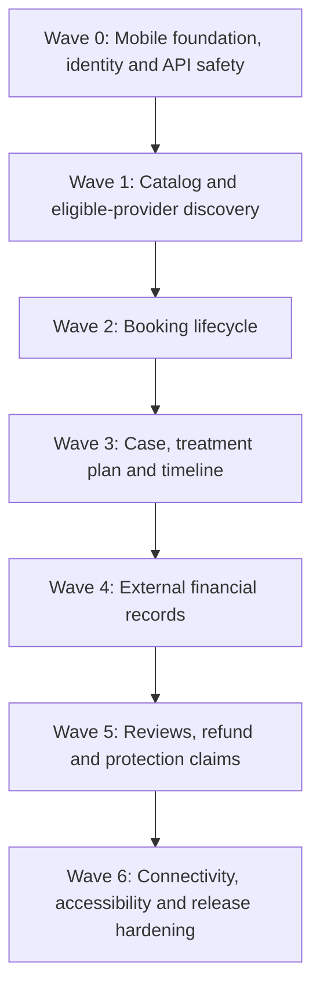

# UberTib Patient Mobile Implementation Plan

**Phase:** 3 — Execution  
**Plan:** 3 of 3 platform implementation plans  
**Platform:** Patient / Authorized Guardian Mobile Application  
**Backend:** Existing Laravel application under `UberTip-Backend/`  
**Client:** React Native patient application — repository/path not yet verified  
**API:** Versioned REST under `/api/v1`  
**Baseline:** 2026-08-24  
**Canonical product behavior:** `docs/PRD.md`  
**Canonical technical design:** `docs/SDD.md` and Phase 2 engineering documents  
**API owner:** `docs/api/API_CONTRACTS.md`  
**Authorization owner:** `docs/domain/PERMISSIONS_MATRIX.md`  
**Lifecycle owner:** `docs/domain/STATE_MACHINES.md`  
**Testing owner:** `docs/TESTING_STRATEGY.md`

## 1. Purpose

This plan defines the dependency-ordered implementation work for the UberTib **Patient Mobile Application** and the patient-facing Laravel API contracts it consumes.

The patient experience is Arabic-first and centered on practical actions: verify identity, browse approved services, find currently eligible providers, understand safe provider/service information, request and manage bookings, review and accept clinician-authored treatment plans, follow treatment progress, record external financial facts, submit verified reviews, and participate in refund/protection claim workflows.

The patient application must not expose internal algorithm mechanics as user decisions. Patients do not choose or edit `S`, `P`, `H`, `I`, scientific grade, risk classification, or final provider eligibility. Those outcomes are computed by the backend from governed facts and policies. Patient-facing responses show practical eligibility meaning, prices, availability, protection meaning where applicable, verified experience rating, and safe explanatory reasons.

UberTib V1 does **not** authorize, capture, hold, transfer, settle, or refund money. The mobile application records external financial assertions and confirmations only.

This plan does not define final visual layout, navigation hierarchy, component styling, brand tokens, wireframes, or microcopy. Those remain owned by the UX chain. Functional sections and mobile areas below describe implementation responsibility, not final screen design.

`Q-PLATFORM-001` remains a Blocker for claiming complete reconciliation against readable SRS v1.1. `Q-CATALOG-001` and `Q-ELIG-001` continue to gate production clinical readiness. `Q-PLATFORM-003` leaves the concrete OTP/MFA, malware-scanning, notification-provider, private-evidence transfer/provider choices unresolved.

## 2. Platform Ownership and Cross-Platform Contract

| Platform | Owns | Patient dependency |
|---|---|---|
| Admin | governance, verification, policy, launch readiness, sensitive decisions, operations | Patient sees only approved/safe projections and resulting workflow states |
| Clinic | provider facts, service activation, availability, booking response, clinician-authored plans/stages/evidence, clinic-side external financial assertions | Patient requests/accepts/responds to Clinic-created domain state |
| Patient — this file | identity verification, guardian context, discovery, booking initiation, plan acceptance, case consumption, patient-side external finance, reviews, claims/appeals | Uses shared Laravel application actions and `/api/v1` contracts |

The mobile client never becomes a second source of business truth. Laravel remains authoritative for eligibility, booking capacity/state, treatment acceptance, financial event history, review eligibility, claims, permissions, and audit.

## 3. Verified Starting Point

The current repository verifies:

- Laravel `^13.17` and PHP `^8.3` backend;
- `/api/v1` routing convention;
- one implemented public patient-consumable endpoint: `GET /api/v1/catalog/service-groups` (`API-CATALOG-001`);
- proposed patient API contracts already documented for identity, discovery, booking, clinical case, finance, reviews, and claims;
- shared domain architecture, error catalog, state machines, permissions, private-evidence design, audit/idempotency design, and testing strategy;
- no verified React Native patient project in the repository evidence inspected for this plan;
- no verified mobile authentication transport/token implementation;
- no approved concrete OTP delivery or private-evidence transfer provider.

Therefore React Native file paths, package scripts, navigation/state libraries, and exact authentication credential transport are **Proposed / to be verified during bootstrap**, not existing repository facts.

## 4. Patient and Guardian Actor Model

The mobile application supports:

- a patient acting for self;
- an authorized guardian/family representative acting for a patient within an explicit active grant.

Every patient-owned resource remains owned by the patient even when a guardian performs an action. The backend records the acting identity separately from the subject patient.

Guardian authorization is scoped by permitted actions, data scope, purpose, effective period, and legal/grant basis. Changing a local mobile “active patient” context never grants backend authority by itself. Every API request re-evaluates the active grant.

Revoked or expired grants stop future access immediately while historical actor attribution remains preserved.

## 5. Patient Functional Sections to Build

These are functional capabilities, not a final navigation specification.

| Section | Responsibilities | Main contracts / requirements |
|---|---|---|
| App Bootstrap | environments, API client, session restore, global error/network handling | NFR-PLATFORM-006–008 |
| Identity Verification | request OTP, verify OTP, activate patient identity | API-IDENTITY-001–003; FR-IDENTITY-002 |
| Guardian / Family Context | create/revoke grant where authorized, select represented patient context | API-IDENTITY-004–005; FR-IDENTITY-003 |
| Service Catalog | browse production-visible dental groups/services | API-CATALOG-001; FR-CATALOG-001 |
| Provider Discovery | search currently eligible provider/service/branch combinations | API-ELIG-001; FR-ELIG-001, FR-ELIG-005–006 |
| Provider Explanation | patient-safe reason, price/protection/rating/assessment context | API-ELIG-002; FR-ELIG-016–017 |
| Booking | create request, list/detail, accept alternative, cancel | API-BOOKING-001–005; FR-BOOKING-001–003 |
| Case | case summary and patient-safe treatment state | API-CLINICAL-001; FR-CLINICAL-001–005 |
| Treatment Plan | inspect clinician-authored version and accept exact version/terms | API-CLINICAL-002–003; FR-CLINICAL-001–002 |
| Case Timeline | treatment stages, follow-up, finance/review/claim timeline projection | API-CLINICAL-004; FR-CLINICAL-005 |
| Financial Terms | immutable accepted terms and historical context | API-FINANCE-001; FR-FINANCE-001 |
| External Financial Records | report external payment/refund facts; confirm/dispute; timeline | API-FINANCE-002–005; FR-FINANCE-002–007 |
| Reviews | submit one verified review for an eligible completed experience | API-REVIEWS-001; FR-REVIEWS-001 |
| Claims / Refunds | submit refund/protection claim, list/detail, appeal | API-CLAIMS-001–005; FR-CLAIMS-001–005 |
| Connectivity / Recovery | safe retry, stale-read handling, drafts where allowed | NFR-PLATFORM-006, NFR-AUDIT-002 |
| Accessibility / RTL | Arabic-first, RTL, accessible interaction semantics | NFR-PLATFORM-005 |

The application must never display raw internal risk `I`, private reviewer evidence, credential internals, database identifiers, signed storage paths, OTP values, or protected data outside the authorized patient/case context.

## 6. End-to-End Patient Journey

### 6.1 Entry and public discovery

1. Application starts and resolves environment/API configuration.
2. Public service catalog may load before patient authentication.
3. Production mode shows only production-visible service definitions.
4. Patient selects a practical service, not an algorithm classification.
5. Provider search returns currently passing provider/service/branch combinations only.
6. Search results may include safe price, protection meaning, verified-experience rating, location/branch summary, available appointment information, and assessment freshness when supported by the contract.
7. Cached discovery can assist weak connectivity, but stale data is never considered authoritative for booking.

### 6.2 Patient verification and session bootstrap

1. Patient provides a phone number to request verification.
2. Laravel creates a challenge; raw OTP is never returned or persisted.
3. Approved delivery adapter sends the OTP.
4. Patient submits challenge ID + six-digit code.
5. Successful verification activates/links at most one patient identity outcome.
6. Mobile stores only the minimum authentication credential required by the selected transport in device-protected storage.
7. App restores the session by resolving `/api/v1/me`; locally stored profile data is not authority.

OTP behavior must preserve five-minute expiry, single use, maximum five verification attempts, maximum three sends per 15 minutes per phone/account/IP scope, and resend invalidation without resetting accumulated failure protection.

### 6.3 Guardian/family representation

1. Authorized workflow creates a scoped guardian/family grant.
2. Mobile may expose available represented patient contexts returned by the backend.
3. User explicitly selects the acting context before performing represented actions.
4. Every booking/case/financial/review/claim API resolves both acting identity and patient subject.
5. Revocation immediately blocks subsequent represented actions.
6. Historical actions continue to show the real representative actor.

### 6.4 Provider discovery and explanation

1. Patient selects service and optional area/date filters.
2. Backend searches current eligible provider/service/branch decisions.
3. Patient sees only combinations passing current mandatory gates.
4. Patient may inspect a safe explanation for one exact provider + service + branch.
5. `PENDING_EVALUATION`, failing, expired, or suspended combinations are not misrepresented as eligible.
6. Internal `I` and internal calculation details remain hidden.
7. Search data is informational; booking performs current revalidation again.

If a previously eligible provider/service/branch becomes suspended, new affected bookings are blocked. Any already-existing booking remains governed by its authoritative current state while the review workflow specifics are unresolved under `Q-BOOKING-002`; the mobile client must not infer automatic cancellation, confirmation, or another outcome.

### 6.5 Booking request and provider response

1. Patient chooses an offered slot/provider/service/branch combination.
2. Mobile submits an idempotent booking request.
3. Backend revalidates service publication, provider eligibility, branch readiness, slot state/capacity, actor/guardian authority, and applicable policy.
4. Booking enters the canonical server state.
5. Clinic may accept, reject with reason, or propose an alternative.
6. Patient reads booking detail/list to see the current result and deadline context.
7. If an alternative is proposed, patient explicitly accepts it while it remains current and unexpired; backend revalidates eligibility and alternative capacity before confirmation.
8. If the proposal expires or the patient explicitly declines it, the proposal becomes non-actionable, but the resulting booking state remains unresolved under `Q-BOOKING-001`; the app must not infer `REJECTED`, `CANCELLED`, or return-to-`REQUESTED`.
9. Concurrent requests cannot overbook the slot.
10. Mobile never treats a local tap or timeout as confirmation without a committed server response.

### 6.6 Cancellation

1. Patient/guardian requests cancellation for a booking in an allowed state.
2. Backend resolves versioned cancellation policy and actor authority.
3. Cancellation creates an auditable state transition/event.
4. Any downstream financial/review consequence is derived from policy/history.
5. Mobile presents the authoritative resulting state and reason; it does not rewrite local history optimistically as final before server commit.

### 6.7 Treatment plan and acceptance

1. Treating dentist authors/proposes a treatment plan through Clinic Filament.
2. Patient fetches the exact proposed plan version plus linked financial terms.
3. Patient can review the full version that will be accepted.
4. Acceptance sends the exact version identity through an idempotent API command.
5. Backend rejects stale/incomplete/replaced versions.
6. Successful acceptance atomically creates immutable accepted clinical and financial snapshots.
7. Later amendment is a new version and requires a new acceptance workflow; previous accepted history remains unchanged.
8. UberTib never generates the diagnosis or clinician treatment plan for the patient.

### 6.8 Treatment progress and follow-up

1. Patient reads case summary and unified timeline.
2. Timeline shows only role-appropriate treatment-stage/follow-up/financial/review/claim events.
3. Clinic stage completion updates authoritative domain state.
4. Patient refreshes or receives the resulting in-system update when that delivery surface exists.
5. Follow-up status derives from accepted plan/policy and recorded clinical workflow.
6. Sensitive provider/admin-only evidence or internal risk data is never included in the patient projection.

### 6.9 External financial records

1. Accepted financial terms are displayed from the immutable snapshot.
2. Actual payment/refund/compensation occurs outside UberTib.
3. Patient may report an external payment against the correct case/snapshot.
4. The report creates an append-only assertion event; it does not charge the patient.
5. An authorized counterparty may confirm or dispute the assertion.
6. Patient can respond to an eligible external financial event when the contract grants counterparty authority.
7. Approved refund/compensation execution may be reported only after it happened outside UberTib.
8. Financial timeline derives the current interpretation from ordered events while preserving disputed/provisional distinctions.
9. Mobile must never contain “Pay now”, card capture, wallet balance, escrow release, payout, settlement, or platform-refund behavior in V1.

### 6.10 Verified review

1. Completed verified experience becomes review-eligible according to policy.
2. Patient submits one review for that eligible experience.
3. Backend rechecks eligibility and uniqueness.
4. Rating `R` is stored as patient experience feedback.
5. `R` never modifies S/P/H/I or provider eligibility calculations.
6. Duplicate/replayed submissions return deterministic idempotent/conflict behavior rather than creating duplicate active reviews.

### 6.11 Refund/protection claim

1. Patient opens the relevant case and chooses an allowed refund or protection claim action.
2. Backend resolves entitlement and deadlines from the immutable accepted terms/policy snapshot.
3. Patient provides required narrative/amount/evidence references defined by the contract.
4. Claim enters an explicit operational workflow; submission itself does not move money.
5. Patient reads current claim state, evidence completeness, deadlines, decision, and appeal availability through safe projections.
6. Sensitive final medical/legal/high-impact decision remains human-reviewed in Admin.
7. If appeal is allowed, patient submits a separate appeal; original decision remains immutable.
8. Any successful refund/compensation result becomes an external obligation/record until execution is performed and recorded outside UberTib.

## 7. Mobile Data and Connectivity Rules

### 7.1 Server authority

The following must never be considered final from local mobile state alone:

- authentication/guardian authority;
- provider eligibility;
- slot availability/capacity;
- booking state;
- treatment-plan acceptance;
- accepted financial terms;
- external financial-event confirmation/dispute;
- review eligibility;
- claim eligibility/deadline/decision;
- any audit-relevant mutation.

### 7.2 Cacheable reads

The client may cache rebuildable/read-only projections to improve weak-connectivity behavior, including catalog, prior provider-search results, booking summaries, case/timeline snapshots, and financial/claim summaries, provided that:

- cached content is distinguishable from a fresh server result where freshness matters;
- sensitive cached data is protected appropriately on device;
- logout/context change clears data that must not cross identities/patient contexts;
- stale discovery never enables a booking without server revalidation.

### 7.3 Mutations and retry

- Retry-prone sensitive mutations use the shared idempotency contract.
- The client must reuse the same idempotency key for the same logical retry and generate a new key for a genuinely new command.
- Network timeout after submission means **unknown outcome**, not failure. Client reconciles by fetching authoritative resource state before creating a new command.
- Do not queue automatic offline booking, plan acceptance, financial assertion, review, or claim submission without a defined idempotent reconciliation strategy.
- Long non-time-critical forms may keep local drafts, but a draft is never represented as server-submitted.

## 8. Mobile Error Handling Contract

The client maps stable backend errors from `ERROR_CATALOG.md` into user-safe states rather than parsing arbitrary message text.

Core mappings include:

- authentication/authorization → `ERR-IDENTITY-001`, `ERR-IDENTITY-002`;
- OTP throttling/verification → `ERR-IDENTITY-003`, `ERR-IDENTITY-004`;
- validation → `ERR-PLATFORM-001`;
- not-found/undisclosed → `ERR-PLATFORM-002`;
- rate limit → `ERR-PLATFORM-003`;
- idempotency conflict → `ERR-AUDIT-001`;
- eligibility unavailable/pending → `ERR-ELIG-001`, `ERR-ELIG-002`;
- booking capacity/state/deadline → `ERR-BOOKING-001`–`003`;
- treatment acceptance → `ERR-CLINICAL-001`;
- external finance invalid event → `ERR-FINANCE-001`;
- review eligibility → `ERR-REVIEWS-001`;
- claim eligibility/evidence → `ERR-CLAIMS-001`–`002`.

`ERR-BOOKING-003` makes an expired alternative action unavailable; it does not tell the client which booking state should result from expiry/decline while `Q-BOOKING-001` remains unresolved.

Unexpected errors show a safe generic state and correlation identifier when available. Raw stack traces, provider responses, secrets, private paths, or protected domain detail never reach the patient UI.

## 9. Dependency Waves

Backend domain foundations from Admin/Clinic plans may be developed earlier, but patient-facing tasks must not duplicate those models/actions to make an endpoint appear complete.

---

# Wave 0 — Mobile Foundation, Identity, and API Safety

## TASK-PLATFORM-008 — Bootstrap and Baseline the React Native Patient Application
**Implements:** NFR-PLATFORM-005–007  
**Goal:** Establish the React Native patient project with verified build/test/lint commands, environment separation, Arabic/RTL readiness, and feature-oriented structure.  
**Dependencies:** None for client bootstrap  
**Expected Files / Areas:** React Native project root `(Proposed — exact repository/path not currently verified)`; app configuration; `src/` feature/shared areas `(Proposed)`  
**Implementation Notes:** Use React Native as the fixed client technology. Do not silently select navigation/state/network libraries without recording the implementation decision. Establish development/test/production API base configuration without committing secrets. Record actual package scripts after bootstrap so later tasks use verified commands.  
**Data / Migration Impact:** None.  
**API Impact:** None.  
**Tests Required:** application bootstrap test; environment selection; RTL boot behavior; no production secret embedded in bundle/config.  
**Verification:** Backend unaffected: `composer test:lint`. Mobile: run the **verified scripts established by this task**; proposed/unverified commands must not be documented as existing.  
**Definition of Done:**
- [ ] React Native project exists and builds in supported development targets
- [ ] Test/lint/build commands are recorded from the actual project
- [ ] Environment configuration is explicit and secret-safe
- [ ] Arabic/RTL baseline is enabled without defining final UX

## TASK-IDENTITY-005 — Implement Patient OTP Request and Verification APIs
**Implements:** FR-IDENTITY-002, NFR-IDENTITY-002, NFR-AUDIT-002  
**Goal:** Implement `API-IDENTITY-001` and `API-IDENTITY-002` with safe OTP challenge lifecycle and at-most-one patient activation outcome.  
**Dependencies:** TASK-AUDIT-001; provider-neutral OTP adapter boundary  
**Expected Files / Areas:** Laravel auth/identity actions, controllers/FormRequests/resources `(Proposed)`; OTP challenge persistence from `ERD.md`; routes under `routes/api.php`; tests  
**Implementation Notes:** Six-digit OTP, five-minute expiry, hash-only storage, single use, max five attempts, max three sends/15m per phone/account/IP, resend invalidates prior without resetting accumulated protection. Provider credentials remain outside source. Account activation is concurrency-safe.  
**Data / Migration Impact:** Add verification challenge/contact identity tables required by `ERD.md` if absent.  
**API Impact:** Implement API-IDENTITY-001/002 and stable ERR mappings.  
**Tests Required:** valid/wrong/expired/used OTP; resend; send/attempt boundaries; concurrent activation; no OTP leakage.  
**Verification:** `php artisan test --compact tests/Feature/Api/V1/Auth/PatientOtpTest.php`; `composer test:mysql`; `composer test`  
**Definition of Done:**
- [ ] OTP rules are enforced application-side
- [ ] Parallel verification cannot duplicate patient identity
- [ ] Raw OTP never persists/returns
- [ ] Stable errors and audit/correlation behavior pass tests

## TASK-IDENTITY-006 — Implement Mobile Authentication Transport and Current-Identity Bootstrap
**Implements:** FR-IDENTITY-002, NFR-IDENTITY-001–002, NFR-PLATFORM-007  
**Goal:** Complete authenticated patient API access and `API-IDENTITY-003` without conflating Filament browser sessions with the mobile contract.  
**Dependencies:** TASK-IDENTITY-005, TASK-PLATFORM-008  
**Expected Files / Areas:** Laravel auth middleware/guard/credential lifecycle `(Proposed)`; `/api/v1/me`; React Native auth/session module `(Proposed)`  
**Implementation Notes:** Authentication transport is intentionally not fixed by current API docs. Before adding a new auth dependency, record the technical decision and its revocation/expiry behavior. Mobile stores only the minimum credential in device-protected storage and always resolves identity/scope from server.  
**Data / Migration Impact:** Only what the selected authenticated transport genuinely requires.  
**API Impact:** Implement API-IDENTITY-003; authenticated endpoints share the chosen mobile auth boundary.  
**Tests Required:** authenticated/unauthenticated access, revoked credential, logout/session clear, `/me` safe fields, no cross-user local cache.  
**Verification:** Backend targeted auth tests + `composer test`; mobile verified test/build scripts from TASK-PLATFORM-008.  
**Definition of Done:**
- [ ] Mobile authenticated requests use one documented transport
- [ ] `/me` is the source for current safe identity context
- [ ] Credential revocation stops access
- [ ] Secrets are not logged or stored in ordinary application state

## TASK-IDENTITY-007 — Implement Guardian Grant APIs and Represented-Patient Context
**Implements:** FR-IDENTITY-003, NFR-IDENTITY-001, NFR-AUDIT-001  
**Goal:** Implement `API-IDENTITY-004`/`005` and mobile represented-patient context without changing patient ownership.  
**Dependencies:** TASK-IDENTITY-006, TASK-IDENTITY-002  
**Expected Files / Areas:** guardian grant model/actions/policies; API controllers/resources; React Native representation-context module `(Proposed)`  
**Implementation Notes:** Persist explicit grantee, subject patient, actions, data scope, purpose, basis, effective interval and revocation history. Backend rechecks grant for every represented action. Mobile context switch is only a request context, never authorization itself.  
**Data / Migration Impact:** Add `guardian_grants` per ERD where absent.  
**API Impact:** Implement API-IDENTITY-004/005; remove any inappropriate cross-domain booking-error mapping if state-machine implementation confirms revocation is immediate.  
**Tests Required:** grant allow/deny, expiry/revocation, duplicate idempotency, actor attribution, patient ownership unchanged.  
**Verification:** targeted guardian API tests; `composer test:mysql`; `composer test`; mobile verified scripts.  
**Definition of Done:**
- [ ] Representation is explicit and scoped
- [ ] Revocation immediately affects future authorization
- [ ] Historical actor attribution is preserved
- [ ] Mobile cannot escalate scope by changing local patient context

## TASK-AUDIT-003 — Implement Patient API Idempotency, Correlation, and Stable Error Envelope
**Implements:** FR-AUDIT-001–003, NFR-AUDIT-001–002, NFR-PLATFORM-008  
**Goal:** Provide one reusable safety boundary for patient mutations and client reconciliation.  
**Dependencies:** TASK-AUDIT-001–002, TASK-IDENTITY-006  
**Expected Files / Areas:** API middleware/actions for idempotency/correlation/error rendering; patient mutation tests; React Native API error mapper `(Proposed)`  
**Implementation Notes:** Same idempotency key + same command returns original committed outcome; materially different reuse returns `ERR-AUDIT-001`. Every request/job carries safe correlation ID. Normalize proposed APIs to the documented error envelope without leaking sensitive details.  
**Data / Migration Impact:** Reuse `idempotency_records` / audit storage from shared foundation.  
**API Impact:** Cross-cutting for all patient mutations; current catalog 429/500 normalization may be included if backward-compatible.  
**Tests Required:** duplicate retry, conflicting key, timeout/reconciliation simulation, safe error fields, correlation propagation.  
**Verification:** targeted API infrastructure tests; existing catalog regression; `composer test`.  
**Definition of Done:**
- [ ] Patient mutations are retry-safe where contracts require it
- [ ] Stable errors map by code, not arbitrary message parsing
- [ ] Correlation identifiers cross API/job boundaries safely
- [ ] Sensitive detail is excluded from client errors

## TASK-PLATFORM-009 — Build the Shared Mobile API, Cache, and Network-Recovery Layer
**Implements:** NFR-PLATFORM-006–008, NFR-AUDIT-002  
**Goal:** Give the React Native app one consistent network layer for authenticated context, safe caching, idempotent mutation retry, and unknown-outcome reconciliation.  
**Dependencies:** TASK-PLATFORM-008, TASK-IDENTITY-006, TASK-AUDIT-003  
**Expected Files / Areas:** React Native shared API/cache/network modules `(Proposed)`  
**Implementation Notes:** Separate read cache from authoritative mutations. Preserve idempotency key across retry of same command. On mutation timeout, fetch authoritative resource before issuing a new command. Clear protected caches on logout or patient-context change. Do not globally hide connectivity failures.  
**Data / Migration Impact:** None server-side.  
**API Impact:** Consumes existing contracts without inventing endpoints.  
**Tests Required:** offline read fallback, stale marker metadata, timeout unknown-outcome flow, context cache isolation, idempotency key reuse/new-command rotation.  
**Verification:** mobile verified test/lint/build scripts established by TASK-PLATFORM-008.  
**Definition of Done:**
- [ ] Reads and mutations have distinct recovery semantics
- [ ] Patient contexts cannot share protected cached state accidentally
- [ ] Unknown mutation outcome reconciles from server
- [ ] Weak connectivity does not create duplicate business effects

# Wave 1 — Catalog and Eligible-Provider Discovery

## TASK-CATALOG-002 — Implement Patient Service Catalog Consumption and Contract Normalization
**Implements:** FR-CATALOG-001, FR-OPS-003, NFR-PLATFORM-005–006  
**Goal:** Make the production-visible catalog usable from React Native while preserving current implemented endpoint behavior.  
**Dependencies:** TASK-PLATFORM-009; upstream catalog/launch governance tasks  
**Expected Files / Areas:** existing `API-CATALOG-001`; Laravel error normalization where required; React Native catalog feature `(Proposed)`  
**Implementation Notes:** Consume `GET /api/v1/catalog/service-groups`. Production must never expose evaluation-only definitions. Cache is allowed because this is public/rebuildable data, but mode/readiness metadata must not be used to bypass server booking checks.  
**Data / Migration Impact:** None beyond upstream catalog work.  
**API Impact:** Preserve API-CATALOG-001 success shape; normalize stable errors without breaking data contract.  
**Tests Required:** existing catalog suite, mobile parsing/empty/error/stale-cache states, Arabic content handling.  
**Verification:** `php artisan test --compact tests/Feature/Api/V1/Catalog/ListServiceGroupsTest.php`; `composer test`; mobile verified scripts.  
**Definition of Done:**
- [ ] Mobile displays only server-visible catalog content
- [ ] Production/evaluation boundary is preserved
- [ ] Public catalog can recover from weak connectivity safely
- [ ] Existing backend contract regression remains green

## TASK-ELIG-010 — Implement Eligible-Provider Search API and Patient Discovery Feature
**Implements:** FR-ELIG-001, FR-ELIG-005–006, NFR-PLATFORM-001  
**Goal:** Implement `API-ELIG-001` and patient discovery using the current immutable eligibility decisions/read models.  
**Dependencies:** TASK-ELIG-005–006, TASK-CATALOG-002, TASK-PLATFORM-009  
**Expected Files / Areas:** Laravel provider search query/controller/resource `(Proposed)`; indexes/read model as designed; React Native provider-search feature `(Proposed)`  
**Implementation Notes:** Require service context; optional approved area/date filters. Return currently passing provider/service/branch combinations only. Include practical safe fields such as price/protection/rating/branch/availability where data exists. Never expose raw `I` or present `P` as scientific quality.  
**Data / Migration Impact:** Only indexes/read projections justified by ERD/query load; authoritative eligibility rows remain source.  
**API Impact:** Implement API-ELIG-001.  
**Tests Required:** passing-only filtering, exact branch scope, stale/suspended exclusion, privacy fields, pagination/filtering, p95 provider-search target verification.  
**Verification:** targeted provider search tests; `composer test:mysql`; performance verification per TESTING_STRATEGY; mobile verified scripts.  
**Definition of Done:**
- [ ] Search returns only currently eligible combinations
- [ ] Internal classifications remain private
- [ ] Results are practical and Arabic-safe
- [ ] Booking still revalidates independently

## TASK-ELIG-011 — Implement Patient-Safe Provider Eligibility Explanation
**Implements:** FR-ELIG-016–017  
**Goal:** Implement `API-ELIG-002` and patient-safe explanation/detail consumption for one exact provider/service/branch.  
**Dependencies:** TASK-ELIG-010  
**Expected Files / Areas:** safe eligibility projection/query; API controller/resource; React Native provider-detail/explanation feature `(Proposed)`  
**Implementation Notes:** Expose practical state, assessment time and safe reason/blocker summary only. Do not expose internal risk `I`, reviewer identities/evidence, raw calculation internals, or protected source facts. `PENDING_EVALUATION` is not grade `F`.  
**Data / Migration Impact:** None expected beyond shared eligibility model.  
**API Impact:** Implement API-ELIG-002.  
**Tests Required:** patient-safe filtering, exact scope, pending-vs-F, unavailable provider, stale decision handling.  
**Verification:** targeted eligibility API tests; `composer test`; mobile verified scripts.  
**Definition of Done:**
- [ ] Patient gets actionable safe explanation
- [ ] Confidential/internal classification fields are absent
- [ ] Pending is represented distinctly
- [ ] Detail never becomes an eligibility override path

# Wave 2 — Booking Lifecycle

## TASK-BOOKING-007 — Implement Patient Booking Creation API and Submission Flow
**Implements:** FR-BOOKING-001, FR-ELIG-006, NFR-AUDIT-002, NFR-PLATFORM-001  
**Goal:** Implement `API-BOOKING-001` and mobile booking submission with synchronous safety revalidation and transactional capacity protection.  
**Dependencies:** TASK-BOOKING-003–004, TASK-ELIG-010, TASK-AUDIT-003, TASK-IDENTITY-007  
**Expected Files / Areas:** shared booking action/model; API controller/request/resource; React Native booking-create feature `(Proposed)`  
**Implementation Notes:** Resolve patient/guardian context, service/provider/branch/slot, current publication/eligibility/readiness/capacity, and policy snapshot in one authoritative flow. Client uses idempotency and never marks confirmed locally before server outcome.  
**Data / Migration Impact:** Reuse booking/slot/events schema from shared implementation.  
**API Impact:** Implement API-BOOKING-001.  
**Tests Required:** happy path, guardian scope, ineligible/suspended provider, full slot, duplicate/conflicting key, 100-concurrent-attempt capacity test on production-like engine.  
**Verification:** booking API/concurrency suites; `composer test:mysql`; `composer test`; mobile verified scripts.  
**Definition of Done:**
- [ ] Booking submission revalidates all safety-critical facts
- [ ] Capacity cannot overbook under concurrency
- [ ] Duplicate retry cannot duplicate booking
- [ ] Patient receives authoritative canonical state

## TASK-BOOKING-008 — Implement Patient Booking List and Detail Projections
**Implements:** FR-BOOKING-001–003, FR-CLINICAL-005  
**Goal:** Implement `API-BOOKING-002`/`003` and scoped mobile booking history/current-detail behavior.  
**Dependencies:** TASK-BOOKING-007  
**Expected Files / Areas:** booking patient queries/resources; React Native booking list/detail feature `(Proposed)`  
**Implementation Notes:** Return safe canonical state, service/provider/branch/slot, deadlines, rejection/alternative reason where allowed, and actionable next-step flags derived server-side. Guardian sees only grants in active data scope. For suspended eligibility affecting an existing booking, expose the current authoritative booking state only; do not derive an unapproved outcome while `Q-BOOKING-002` is open.  
**Data / Migration Impact:** None beyond shared booking domain.  
**API Impact:** Implement API-BOOKING-002/003.  
**Tests Required:** self/guardian isolation, status filter, resource-not-found/undisclosed behavior, stale cached detail refresh, existing suspended-scope booking remains server-authoritative without an invented client state.  
**Verification:** targeted booking read API tests; `composer test`; mobile verified scripts.  
**Definition of Done:**
- [ ] Patient sees only authorized bookings
- [ ] State labels derive from canonical lifecycle
- [ ] Alternative/rejection/deadline information is safe and consistent
- [ ] Cached detail refreshes against server authority

## TASK-BOOKING-009 — Implement Patient Alternative Acceptance
**Implements:** FR-BOOKING-003, NFR-AUDIT-002  
**Goal:** Implement `API-BOOKING-004` and explicit patient/guardian acceptance of a provider-proposed alternative.  
**Dependencies:** TASK-BOOKING-006–008, TASK-AUDIT-003  
**Expected Files / Areas:** shared alternative acceptance action; API endpoint; React Native alternative-action flow `(Proposed)`  
**Implementation Notes:** Accept exact alternative/version only. At commit time revalidate actor authority, deadline, current eligibility/readiness and target slot capacity. Repeated acceptance returns original outcome; stale/full alternatives fail deterministically. When an alternative expires or is explicitly declined, preserve history and make acceptance non-actionable, but do not infer the resulting booking state while `Q-BOOKING-001` remains unresolved.  
**Data / Migration Impact:** Reuse booking alternatives/events and capacity structures.  
**API Impact:** Implement API-BOOKING-004.  
**Tests Required:** expired alternative rejected without asserting `REJECTED`, `CANCELLED`, or return-to-`REQUESTED`; replaced alternative; full slot; revalidation failure; duplicate/repeated acceptance; guardian authorization.  
**Verification:** targeted alternative API tests; `composer test:mysql`; mobile verified scripts.  
**Definition of Done:**
- [ ] Alternative requires explicit authorized acceptance
- [ ] Confirmation revalidates current safety/capacity
- [ ] Expired/declined alternative outcome is not fabricated
- [ ] Repeated taps/network retry cannot duplicate effect
- [ ] Client reconciles unknown outcome from booking detail

## TASK-BOOKING-010 — Implement Patient Booking Cancellation
**Implements:** FR-BOOKING-002, NFR-AUDIT-002  
**Goal:** Implement `API-BOOKING-005` and patient/guardian cancellation with versioned policy/state validation.  
**Dependencies:** TASK-BOOKING-008, TASK-BOOKING-002, TASK-AUDIT-003  
**Expected Files / Areas:** shared cancellation action; API endpoint; React Native cancellation flow `(Proposed)`  
**Implementation Notes:** Validate actor, booking state and governing cancellation policy; create auditable transition/event and downstream derived effects. No client-side final cancellation before server commit.  
**Data / Migration Impact:** Reuse booking events/policy snapshot references.  
**API Impact:** Implement API-BOOKING-005.  
**Tests Required:** allowed/forbidden states, deadline/policy boundary, guardian scope, duplicate command, downstream event history.  
**Verification:** targeted cancellation API tests; `composer test`; mobile verified scripts.  
**Definition of Done:**
- [ ] Cancellation follows canonical state machine
- [ ] Historical booking events remain intact
- [ ] Downstream consequences are derived, not local assumptions
- [ ] Retry behavior is deterministic

# Wave 3 — Case, Treatment Plan, and Timeline

## TASK-CLINICAL-007 — Implement Patient Case Summary and Unified Timeline APIs
**Implements:** FR-CLINICAL-001–005, FR-FINANCE-006, FR-AUDIT-002  
**Goal:** Implement `API-CLINICAL-001`/`004` and patient-safe mobile case/timeline consumption.  
**Dependencies:** TASK-CLINICAL-002–006, TASK-BOOKING-008, TASK-IDENTITY-007  
**Expected Files / Areas:** case/timeline queries/resources; API controllers; React Native case feature `(Proposed)`  
**Implementation Notes:** Compose role-filtered timeline from authoritative domain records; do not create a mutable timeline table as alternate truth unless Phase 2 design calls for rebuildable projection. Hide internal reviewer/risk/private evidence data.  
**Data / Migration Impact:** No new authoritative state expected.  
**API Impact:** Implement API-CLINICAL-001 and API-CLINICAL-004.  
**Tests Required:** patient/guardian scope, field filtering, event order, empty case timeline, revoked grant denial.  
**Verification:** targeted clinical read API tests; `composer test`; mobile verified scripts.  
**Definition of Done:**
- [ ] Patient can retrieve authorized case state/history
- [ ] Timeline is reproducible from authoritative records
- [ ] Confidential staff/internal fields are excluded
- [ ] Guardian attribution/scope is preserved

## TASK-CLINICAL-008 — Implement Treatment Plan Read and Immutable Patient Acceptance
**Implements:** FR-CLINICAL-001–002, FR-FINANCE-001, NFR-AUDIT-003  
**Goal:** Implement `API-CLINICAL-002`/`003` and patient review/acceptance of an exact clinician-authored plan version and linked terms.  
**Dependencies:** TASK-CLINICAL-004, TASK-CLINICAL-007, TASK-FINANCE-004, TASK-AUDIT-003  
**Expected Files / Areas:** shared acceptance action/snapshot models; API endpoints; React Native treatment-plan feature `(Proposed)`  
**Implementation Notes:** Return complete proposed/accepted version needed for informed acceptance. Command references exact version. On success atomically create immutable accepted clinical and financial snapshots. Reject stale, incomplete, replaced or unauthorized versions.  
**Data / Migration Impact:** Reuse treatment version/accepted snapshots/financial terms snapshot schema.  
**API Impact:** Implement API-CLINICAL-002/003.  
**Tests Required:** valid acceptance, stale/incomplete plan, guardian authority, duplicate/concurrent acceptance, snapshot immutability.  
**Verification:** treatment-plan API/snapshot tests; `composer test:mysql`; `composer test`; mobile verified scripts.  
**Definition of Done:**
- [ ] Exact plan/terms version is visible before acceptance
- [ ] Acceptance creates one immutable outcome
- [ ] Amendments cannot rewrite prior acceptance
- [ ] No automated diagnosis/treatment-plan generation is introduced

## TASK-CLINICAL-009 — Implement Patient Treatment Progress and Follow-Up Consumption
**Implements:** FR-CLINICAL-003–005, NFR-PLATFORM-006  
**Goal:** Present current treatment-stage progress and follow-up state from authoritative case/timeline data without giving the patient clinician-only mutation powers.  
**Dependencies:** TASK-CLINICAL-007–008, TASK-CLINICAL-005–006  
**Expected Files / Areas:** patient-safe clinical projections; React Native stage/follow-up feature `(Proposed)`  
**Implementation Notes:** Patient sees accepted plan stage state, completion/progress meaning, required patient acknowledgements only where a confirmed action exists, and follow-up status. Clinic-only evidence and clinical authoring remain inaccessible. Cache may support reading but current server state wins.  
**Data / Migration Impact:** None beyond shared clinical domain.  
**API Impact:** Prefer API-CLINICAL-001/004 projections; do not invent a new endpoint unless the canonical contract is amended first.  
**Tests Required:** role-filtered stage data, completed/in-progress/follow-up states, stale cache refresh, no clinic-only action exposure.  
**Verification:** backend projection tests; mobile verified scripts.  
**Definition of Done:**
- [ ] Patient progress is derived from accepted clinical workflow
- [ ] Clinician-only operations remain server-denied
- [ ] Follow-up state is clear and authoritative
- [ ] Weak-connectivity reads cannot mutate treatment state

# Wave 4 — External Financial Records

## TASK-FINANCE-008 — Implement Patient Accepted-Terms and Financial-Timeline Consumption
**Implements:** FR-FINANCE-001, FR-FINANCE-006–007, NFR-AUDIT-003  
**Goal:** Implement `API-FINANCE-001`/`005` and patient-safe immutable terms/event timeline.  
**Dependencies:** TASK-FINANCE-001–007, TASK-CLINICAL-008  
**Expected Files / Areas:** financial queries/resources/API controllers; React Native finance feature `(Proposed)`  
**Implementation Notes:** Show immutable accepted terms and ordered event interpretation with provisional/confirmed/disputed distinctions. Historical terms remain viewable where contract permits. Wording must describe records of external activity, never platform-held funds.  
**Data / Migration Impact:** None beyond shared financial domain.  
**API Impact:** Implement API-FINANCE-001/005.  
**Tests Required:** access, immutable versions, event-order derivation, disputed vs confirmed distinction, no wallet/gateway fields.  
**Verification:** targeted finance read API tests; architecture/no-money tests; `composer test`; mobile verified scripts.  
**Definition of Done:**
- [ ] Accepted terms cannot be rewritten
- [ ] Event timeline preserves uncertainty/disputes
- [ ] Client contains no platform balance/payment semantics
- [ ] Unauthorized case finance is inaccessible

## TASK-FINANCE-009 — Implement Patient External Payment Reporting
**Implements:** FR-FINANCE-002, FR-FINANCE-005, NFR-FINANCE-001, NFR-AUDIT-002  
**Goal:** Implement `API-FINANCE-002` and patient reporting of a payment already performed outside UberTib.  
**Dependencies:** TASK-FINANCE-008, TASK-AUDIT-003  
**Expected Files / Areas:** shared external payment assertion action; API endpoint; React Native external-payment-report form `(Proposed)`  
**Implementation Notes:** Validate case, accepted snapshot, amount/currency and authorized evidence references. Append assertion event and notify/queue counterparty review after commit. Never call a payment provider.  
**Data / Migration Impact:** Reuse append-only financial events/evidence bindings.  
**API Impact:** Implement API-FINANCE-002.  
**Tests Required:** valid report, wrong snapshot/currency, duplicate/conflicting key, unauthorized actor, no money-movement integration invoked.  
**Verification:** targeted finance mutation tests; architecture zero-money test; `composer test`; mobile verified scripts.  
**Definition of Done:**
- [ ] Submission records an assertion only
- [ ] Original assertion is append-only
- [ ] Duplicate retry is safe
- [ ] No charge/transfer path exists

## TASK-FINANCE-010 — Implement Patient Counterparty Confirm/Dispute Response
**Implements:** FR-FINANCE-003, FR-FINANCE-005, NFR-AUDIT-003  
**Goal:** Implement `API-FINANCE-003` for a patient when the patient is the authorized counterparty to an external financial assertion.  
**Dependencies:** TASK-FINANCE-008–009, TASK-AUDIT-003  
**Expected Files / Areas:** shared response action; API endpoint; React Native financial-event response flow `(Proposed)`  
**Implementation Notes:** Append confirmation/dispute event; never update original assertion. Resolve actor/case scope and current event chain. Concurrent contradictory responses follow canonical policy/state and remain auditable.  
**Data / Migration Impact:** Reuse financial event stream.  
**API Impact:** Implement patient-authorized branch of API-FINANCE-003.  
**Tests Required:** confirm/dispute, wrong counterparty, duplicate, contradictory concurrency, history immutability.  
**Verification:** targeted financial response tests; `composer test:mysql`; mobile verified scripts.  
**Definition of Done:**
- [ ] Patient can respond only when authorized counterparty
- [ ] Response is append-only
- [ ] Contradictory/concurrent behavior is deterministic
- [ ] Timeline reflects resulting interpretation without rewriting history

## TASK-FINANCE-011 — Implement External Refund-Execution Reporting
**Implements:** FR-FINANCE-004–005, FR-FINANCE-007, NFR-FINANCE-001  
**Goal:** Implement `API-FINANCE-004` for authorized assertion that an approved refund was executed outside UberTib.  
**Dependencies:** TASK-FINANCE-008, TASK-CLAIMS-007, TASK-AUDIT-003  
**Expected Files / Areas:** shared refund-execution action; API endpoint; React Native conditional external-execution flow `(Proposed)`  
**Implementation Notes:** Require applicable approved refund decision/external obligation and matching case/amount/currency. Record assertion only after off-platform execution. Route confirmation/dispute through existing financial response flow.  
**Data / Migration Impact:** Reuse claim decision + financial events/evidence.  
**API Impact:** Implement API-FINANCE-004 where patient is an authorized asserting party.  
**Tests Required:** no approved decision, amount mismatch, unauthorized actor, duplicate, no-money-movement.  
**Verification:** targeted refund execution tests; architecture invariant; `composer test`; mobile verified scripts.  
**Definition of Done:**
- [ ] System cannot execute refund itself
- [ ] External execution requires an eligible approved context
- [ ] Assertion remains confirmable/disputable
- [ ] Financial history remains append-only

# Wave 5 — Reviews, Refunds, and Protection Claims

## TASK-REVIEWS-003 — Implement Patient Verified Review Submission
**Implements:** FR-REVIEWS-001, NFR-AUDIT-002  
**Goal:** Implement `API-REVIEWS-001` and mobile review submission for one verified eligible completed experience.  
**Dependencies:** TASK-CLINICAL-009, TASK-AUDIT-003  
**Expected Files / Areas:** shared review eligibility/create action; API endpoint; React Native review feature `(Proposed)`  
**Implementation Notes:** Backend rechecks verified experience and uniqueness. Use idempotency plus database/application uniqueness. Store patient-experience rating `R` independently from scientific/eligibility classifications.  
**Data / Migration Impact:** Reuse reviews schema and one-active-review invariant strategy.  
**API Impact:** Implement API-REVIEWS-001.  
**Tests Required:** eligible/ineligible case, duplicate/concurrent submission, guardian authority, R does not alter S/P/H/I, authorization isolation.  
**Verification:** targeted review API tests; `composer test:mysql`; `composer test`; mobile verified scripts.  
**Definition of Done:**
- [ ] Only verified eligible experience can be reviewed
- [ ] Duplicate active review is impossible
- [ ] Rating R remains classification-independent
- [ ] Retry is safe

## TASK-CLAIMS-007 — Implement Patient Refund and Protection Claim Submission
**Implements:** FR-CLAIMS-001–003, FR-FINANCE-007, NFR-FINANCE-001, NFR-AUDIT-002  
**Goal:** Implement `API-CLAIMS-001`/`002` and mobile submission of eligible refund/protection workflows.  
**Dependencies:** TASK-CLAIMS-001–006, TASK-FINANCE-008, TASK-AUDIT-003  
**Expected Files / Areas:** shared claim intake actions; API controllers/requests/resources; React Native claim-create feature `(Proposed)`  
**Implementation Notes:** Resolve entitlement/deadline from accepted snapshot; validate type, requested remedy/amount, narrative and already-authorized evidence references. Protection claim requires applicable accepted protection entitlement. Submission creates claim/work item only; no funds move.  
**Data / Migration Impact:** Reuse claims/deadline/evidence/work-item schema.  
**API Impact:** Implement API-CLAIMS-001/002. Evidence binary transfer remains separately blocked by provider/transport decision.  
**Tests Required:** valid/late refund, no-protection denial, amount/currency mismatch, evidence completeness, duplicate, guardian scope, zero-money-movement.  
**Verification:** targeted claim intake tests; `composer test:mysql`; `composer test`; mobile verified scripts.  
**Definition of Done:**
- [ ] Claim eligibility uses immutable governing snapshot
- [ ] Refund/protection paths remain distinct where policy requires
- [ ] Submission creates operational workflow, not money movement
- [ ] Evidence-reference gaps fail explicitly

## TASK-CLAIMS-008 — Implement Patient Claim List and Detail Projections
**Implements:** FR-CLAIMS-001–005, FR-CLINICAL-005  
**Goal:** Implement `API-CLAIMS-003`/`004` and mobile claim/refund status, evidence/deadline, decision, and appeal projection.  
**Dependencies:** TASK-CLAIMS-007  
**Expected Files / Areas:** claim patient queries/resources; API endpoints; React Native claim list/detail feature `(Proposed)`  
**Implementation Notes:** Expose safe current state, original/preserved deadline and authorized extensions/pauses, evidence completeness, human decision summary/reason, external action due status, and appeal eligibility. Hide reviewer-only/internal evidence.  
**Data / Migration Impact:** None beyond shared claim domain.  
**API Impact:** Implement API-CLAIMS-003/004.  
**Tests Required:** patient/guardian isolation, deadline history, role filtering, evidence metadata privacy, decision/appeal projection.  
**Verification:** targeted claim read API tests; `composer test`; mobile verified scripts.  
**Definition of Done:**
- [ ] Patient sees authoritative claim lifecycle
- [ ] Deadline changes remain historical events
- [ ] Human decision is distinguishable from automated preparation
- [ ] Sensitive internal review data remains hidden

## TASK-CLAIMS-009 — Implement Patient Claim/Dispute Appeal Submission
**Implements:** FR-CLAIMS-004–005, NFR-AUDIT-002  
**Goal:** Implement `API-CLAIMS-005` and patient/guardian appeal of an eligible claim/dispute decision.  
**Dependencies:** TASK-CLAIMS-008, TASK-AUDIT-003  
**Expected Files / Areas:** shared appeal action; API endpoint; React Native claim-appeal feature `(Proposed)`  
**Implementation Notes:** Validate original decision, appellant authority, governing appeal deadline/grounds and evidence references. Create separate appeal history/work; never modify original decision. Final appeal review remains Admin/human scoped.  
**Data / Migration Impact:** Reuse claim appeals/audit/evidence bindings.  
**API Impact:** Implement API-CLAIMS-005.  
**Tests Required:** eligible/late appeal, unauthorized guardian, duplicate, original-decision immutability, evidence validation.  
**Verification:** targeted claim appeal tests; `composer test:mysql`; `composer test`; mobile verified scripts.  
**Definition of Done:**
- [ ] Appeal is a separate immutable workflow
- [ ] Original decision is preserved
- [ ] Deadline/authority is server-enforced
- [ ] Patient cannot self-submit final sensitive appeal decision

# Wave 6 — Connectivity, Accessibility, Privacy, and Release Hardening

## TASK-PLATFORM-010 — Implement Mobile Draft and Reconciliation Rules for Weak Connectivity
**Implements:** NFR-PLATFORM-006, NFR-AUDIT-002  
**Goal:** Make patient workflows resilient to unstable connectivity without fabricating successful business actions.  
**Dependencies:** TASK-PLATFORM-009 and all implemented patient mutations  
**Expected Files / Areas:** React Native draft/reconciliation utilities `(Proposed)`; backend idempotent mutation coverage  
**Implementation Notes:** Permit local drafts only for suitable non-final form content. Never auto-confirm booking, plan acceptance, financial event, review or claim while offline. A timed-out mutation becomes unknown-outcome and reconciles from canonical read API.  
**Data / Migration Impact:** None server-side.  
**API Impact:** No new endpoint required; uses existing read-after-write resources.  
**Tests Required:** offline draft, app restart, lost response after server commit, duplicate retry, stale context after guardian revocation.  
**Verification:** mobile verified scripts plus relevant backend idempotency tests.  
**Definition of Done:**
- [ ] Offline mode never fabricates a committed state
- [ ] Suitable drafts survive temporary connectivity loss
- [ ] Unknown outcomes reconcile safely
- [ ] Sensitive retries cannot duplicate effects

## TASK-PLATFORM-011 — Complete Arabic, RTL, Accessibility, and Patient-Safe Content Integration
**Implements:** NFR-PLATFORM-005  
**Goal:** Ensure the implemented functional mobile surfaces work Arabic-first, RTL, and meet applicable WCAG 2.2 AA/mobile accessibility expectations.  
**Dependencies:** Implemented patient features; TASK-PLATFORM-008  
**Expected Files / Areas:** React Native localization/accessibility layer and all patient feature surfaces `(Proposed)`  
**Implementation Notes:** Support Arabic-first strings, correct mixed Arabic/English/numeric direction, scalable text, semantic labels/roles, focus/order, contrast-ready states and non-color-only status meaning. Do not expose internal classification jargon as patient-facing labels.  
**Data / Migration Impact:** None.  
**API Impact:** User-facing server fields/errors remain Arabic-safe; stable error codes stay language-independent.  
**Tests Required:** RTL rendering/state tests where feasible, accessibility-label tests, dynamic text, mixed-direction content, error/empty/loading/permission states.  
**Verification:** mobile verified test/build/accessibility checks established by actual client project.  
**Definition of Done:**
- [ ] All implemented patient journeys operate RTL
- [ ] Mixed-direction medical/technical text remains readable
- [ ] Core actions/statuses are accessible without color alone
- [ ] Error/empty/loading states are implemented functionally

## TASK-PLATFORM-012 — Patient App Security, Performance, Observability, and Release Gate
**Implements:** NFR-PLATFORM-001–008, NFR-IDENTITY-001–002, NFR-FINANCE-001, NFR-AUDIT-001–003  
**Goal:** Verify the complete patient application/API is production-supportable and preserves all hard safety boundaries.  
**Dependencies:** All patient tasks applicable to release; TASK-PLATFORM-004 and TASK-PLATFORM-007 shared production hardening  
**Expected Files / Areas:** Laravel API middleware/logging/metrics; React Native release configuration; security/performance/test assets; deployment/release evidence  
**Implementation Notes:** Verify API latency targets, provider-search target, rate limits, queue/notification observability, credential protection, authorization isolation, no sensitive client logs, cache clearing on identity/context change, zero-money-movement architecture, catalog production mode, clinical launch readiness and recovery behavior.  
**Data / Migration Impact:** None beyond implemented domains.  
**API Impact:** Final contract/regression verification for all patient APIs.  
**Tests Required:** complete backend suites, MySQL suite, performance/concurrency tests, mobile integration/E2E journeys, privacy/security and Arabic/RTL checks.  
**Verification:** `composer test`; `composer test:unit`; `composer test:mysql`; production-like performance/recovery checks from TESTING_STRATEGY; mobile project's verified full CI commands.  
**Definition of Done:**
- [ ] All patient requirements mapped to implemented/tested workflows or explicit blocker
- [ ] No cross-patient/guardian authorization escape exists
- [ ] No payment/custody capability exists
- [ ] Clinical/catalog production gates fail closed
- [ ] Release evidence satisfies applicable NFRs

## TASK-BOOKING-011 — Implement Patient Reschedule Proposal and Response
**Implements:** FR-BOOKING-004, FR-BOOKING-001, NFR-AUDIT-002  
**Goal:** Implement `API-BOOKING-006`/`API-BOOKING-007` and the patient side of the governed reschedule workflow.  
**Dependencies:** TASK-BOOKING-008, TASK-BOOKING-010, TASK-AUDIT-003  
**Expected Files / Areas:** shared reschedule proposal actions/model; API endpoints; React Native reschedule flow `(Proposed)`  
**Implementation Notes:** The proposal is a separate record. While it is `PENDING` the booking stays `CONFIRMED` on its original slot; never optimistically render the proposed slot as the appointment. Acceptance revalidates eligibility and new-slot capacity, then moves the booking and releases the old slot in one transaction. Only the counterparty may respond. Reject proposals against a booking in `ELIGIBILITY_REVIEW`.  
**Data / Migration Impact:** New reschedule proposal table plus appended booking history; no booking column is mutated in place.  
**API Impact:** Implement API-BOOKING-006 and API-BOOKING-007.  
**Tests Required:** pending-state invariance, atomic slot move and old-slot release, self-response rejection, decline/expiry/withdrawal, revalidation failure, `ELIGIBILITY_REVIEW` rejection, duplicate response.  
**Verification:** targeted reschedule API tests; `composer test`; mobile verified scripts.  
**Definition of Done:**
- [ ] Original slot stays authoritative while a proposal is pending
- [ ] Acceptance revalidates eligibility and capacity before committing
- [ ] Slot move and old-slot release are atomic
- [ ] Reschedule history is appended, never overwritten

## TASK-PLATFORM-013 — Implement Patient Notification and Attention Center
**Implements:** FR-PLATFORM-001, NFR-PLATFORM-006  
**Goal:** Implement `API-PLATFORM-002` and the durable patient notification/attention surface.  
**Dependencies:** TASK-PLATFORM-008, TASK-IDENTITY-007, emitting domain tasks  
**Expected Files / Areas:** durable notification entry model/queries; list and mark-read endpoints; React Native notification centre and Home attention area `(Proposed)`  
**Implementation Notes:** Entries are durable records independent of push/SMS/email adapters. Mark-read touches only the read flag and must not be reachable as a business acknowledgement. Store a reference to the authoritative resource rather than a copy of business state, and re-read that resource when the entry is opened. Filter guardian visibility to the active grant scope. Do not add a fifth primary navigation tab.  
**Data / Migration Impact:** New notification entry table with read state; no domain state duplicated as truth.  
**API Impact:** Implement API-PLATFORM-002.  
**Tests Required:** durable entry creation per intent, mark-read changes no business state, delivery-failure independence, revoked-grant filtering, unread count, cursor stability, stale-entry re-read.  
**Verification:** targeted notification API tests; `composer test`; mobile verified scripts.  
**Definition of Done:**
- [ ] Every required patient intent creates a durable entry
- [ ] Reading or dismissing changes no business state
- [ ] Deadline-bound items remain visible when delivery fails
- [ ] Guardian visibility respects the active grant scope

## 10. Cross-Platform Journey Dependencies

| Patient journey | Patient tasks | Required Clinic/Admin/shared readiness |
|---|---|---|
| Verify identity | TASK-IDENTITY-005–006 | audit/idempotency foundation; OTP provider adapter |
| Act as guardian | TASK-IDENTITY-007 | shared scoped authorization |
| Browse services | TASK-CATALOG-002 | catalog governance + launch gates |
| Search providers | TASK-ELIG-010–011 | provider verification + eligibility engine/recalculation |
| Request booking | TASK-BOOKING-007–008 | Clinic availability + provider response workflow |
| Accept alternative/cancel | TASK-BOOKING-009–010 | Clinic booking response + shared state machine |
| Reschedule a confirmed appointment | TASK-BOOKING-011 | Clinic reschedule workspace + shared proposal machine |
| Review/accept plan | TASK-CLINICAL-007–008 | treating-dentist plan authoring + financial proposal |
| Follow treatment | TASK-CLINICAL-009 | Clinic stage/evidence/follow-up workflow |
| Record external finance | TASK-FINANCE-008–011 | shared immutable finance model + Clinic/Admin counterpart workflows |
| Submit review | TASK-REVIEWS-003 | completed verified case + review integrity |
| Refund/protection claim | TASK-CLAIMS-007–009 | Admin claims/evidence/deadline/human decision + Clinic response workflow |

A patient task is not complete merely because its mobile UI exists. Its authoritative backend action/query, authorization, API contract, failure behavior, audit/idempotency behavior, and relevant tests must also be complete.

## 11. Required Patient API Implementation Set

The Patient plan is responsible for consuming or implementing the patient-facing side of these already allocated API contracts:

- `API-CATALOG-001` — implemented baseline, consumed by mobile;
- `API-IDENTITY-001` through `API-IDENTITY-005`;
- `API-ELIG-001` through `API-ELIG-002` for patient discovery/explanation;
- `API-BOOKING-001` through `API-BOOKING-005`;
- `API-CLINICAL-001` through `API-CLINICAL-004`;
- `API-FINANCE-001` through `API-FINANCE-005`;
- `API-REVIEWS-001` for patient review submission;
- `API-CLAIMS-001` through `API-CLAIMS-005`.

`API-ELIG-003`/`004` are provider activation contracts and remain Clinic-side/in-process when Clinic Filament is used. `API-REVIEWS-002` is only needed by a patient client if product policy grants the patient a relevant review-appeal action; do not add a mobile surface solely because the contract exists.

## 12. Critical Negative Requirements

Patient implementation is incomplete if any of these are possible:

1. Patient can manually select final `A/B/C/D/F`, `P`, `H`, `I`, or provider eligibility.
2. Patient can see raw internal `I` or protected reviewer evidence.
3. Cached search can confirm a booking without server revalidation.
4. Repeated tap/retry can duplicate booking, acceptance, financial event, review, or claim.
5. Guardian can access a patient outside active grant scope.
6. Patient can accept a treatment plan version different from the version displayed/confirmed.
7. Accepted clinical/financial history can be silently edited.
8. External payment report is presented as a payment executed by UberTib.
9. Any card/bank/wallet/escrow/settlement/refund execution path exists in V1.
10. Rating `R` changes scientific or eligibility classifications.
11. Patient can issue a final sensitive claim/appeal decision.
12. Protected evidence is exposed through public filesystem URLs.
13. App reports a mutation as successful solely because it was queued locally while offline.
14. Production app exposes evaluation-only service definitions as production-ready.
15. Client invents a booking terminal/rollback state when an alternative expires/declines or when an existing booking is subject to unresolved post-suspension review semantics.

These must be enforced by server tests where applicable, not only by hiding client controls.

## 13. Awaiting Decisions / Blocked Subflows

The following are not to be silently invented during implementation:

| Item | Governing open item | Impact |
|---|---|---|
| Readable full authoritative SRS v1.1 reconciliation | `Q-PLATFORM-001` — Blocker | Cannot claim complete SRS coverage until resolved |
| Clinical approval of provisional 26-service catalog | `Q-CATALOG-001` — Major | Production patient catalog/readiness remains gated |
| Production S/P/H/I formulas/thresholds/defaults | `Q-ELIG-001` — Major | Patient discovery can be engineered, but production medical outcome policy requires approval |
| Alternative expiry / explicit decline outcome | `Q-BOOKING-001` — Major | Make the alternative non-actionable and preserve history; do not infer `REJECTED`, `CANCELLED`, return-to-`REQUESTED`, or another outcome |
| Existing-booking review after eligibility suspension | `Q-BOOKING-002` — Major | New affected bookings are blocked, but the mobile client must surface authoritative current booking state until review authority/deadline/state-effect/outcomes are approved |
| Concrete OTP delivery / privileged provider choices | `Q-PLATFORM-003` — Major | OTP application logic can be implemented behind adapter; real production delivery waits for provider configuration |
| Patient private-evidence upload/download transport/provider | `Q-PLATFORM-003` — Major | Claims/evidence references can be modeled, but do not invent binary transfer endpoints/provider contract; production attachment flow remains incomplete until resolved |
| Hosting/deployment topology | `Q-OPS-001` — Major | MySQL is the required production relational engine; mobile base URL and release environments depend on selected hosting/provider/topology and deployment configuration |
| Legal validation of retention/deletion periods | `Q-PLATFORM-002` — Major | Mobile privacy behavior must follow final governed policy when approved |

No payment-provider decision is awaited because payment/custody/money movement is explicitly out of V1 scope.

## 14. Test Expectations by Patient Journey

`docs/TESTING_STRATEGY.md` remains canonical. Patient implementation must add concrete tests for at least:

| Journey | Minimum verification |
|---|---|
| OTP | expiry, resend, attempts, throttling, no leakage, concurrent activation |
| Guardian | allow/deny, revocation, wrong patient, attribution |
| Catalog | production filtering, Arabic payload, cache/error states |
| Provider search | only passing combinations, privacy filtering, freshness/performance |
| Booking | happy path, full/ineligible, alternative acceptance/expiry non-actionability without invented outcome, cancellation, idempotency, 100-way concurrency, existing-booking suspension behavior remains authoritative pending `Q-BOOKING-002` |
| Treatment acceptance | exact version, stale version, duplicate/concurrent acceptance, immutable snapshots |
| Timeline | authorization, field filtering, event order |
| External finance | report/confirm/dispute/refund assertions, duplicate safety, zero money movement |
| Review | eligible/ineligible, uniqueness, guardian, R independence |
| Claim | entitlement/deadline/evidence, decision projection, appeal, no money movement |
| Connectivity | timeout-after-commit, offline draft, stale cache, context switch |
| Accessibility/RTL | Arabic/RTL, scalable text, semantic actions, required error/empty/loading states |

Where mobile automation cannot prove clinical/legal approval, the release evidence must reference the governed human approval instead of treating a passing software test as approval.

## 15. Task ID Allocation Status

This file continues task numbering after the Admin and Clinic implementation plans and owns:

- `TASK-IDENTITY-005` through `TASK-IDENTITY-007`;
- `TASK-AUDIT-003`;
- `TASK-CATALOG-002`;
- `TASK-ELIG-010` through `TASK-ELIG-011`;
- `TASK-BOOKING-007` through `TASK-BOOKING-011`;
- `TASK-CLINICAL-007` through `TASK-CLINICAL-009`;
- `TASK-FINANCE-008` through `TASK-FINANCE-011`;
- `TASK-REVIEWS-003`;
- `TASK-CLAIMS-007` through `TASK-CLAIMS-009`;
- `TASK-PLATFORM-008` through `TASK-PLATFORM-013`.

These IDs are append-only and are synchronized in the canonical `docs/README.md` registry. Future task additions must update that registry without renumbering or reusing earlier task IDs.

## 16. Cross-Platform Implementation and Documentation Status

The canonical high-level implementation order across all three detailed plans is:

1. shared identity/authorization/audit/idempotency foundation;
2. Admin policy/catalog/launch governance and private evidence foundation;
3. Clinic provider/branch activation facts and evidence;
4. eligibility computation/recalculation and patient-safe provider projections;
5. Clinic availability + shared booking lifecycle + patient booking flows;
6. Clinic clinician-authored treatment plans + patient immutable acceptance;
7. treatment stages/follow-up + patient case timeline;
8. shared external financial events + Clinic/Patient counterparty workflows;
9. verified reviews;
10. claims/refunds/evidence/deadlines/human decisions/appeals;
11. cross-platform work/notification/monitoring hardening;
12. production-like concurrency, security, recovery, accessibility/RTL, and release verification.

`docs/IMPLEMENTATION_PLAN.md` already owns the canonical cross-platform orchestration/index without duplicating every detailed task body. `docs/TESTING_STRATEGY.md`, `docs/TRACEABILITY_MATRIX.md`, and `docs/README.md` are synchronized with the current task/test allocations; future changes must preserve append-only IDs and update those artifacts together.