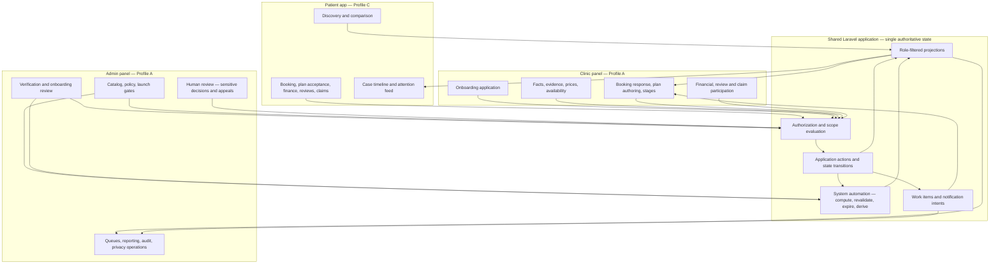
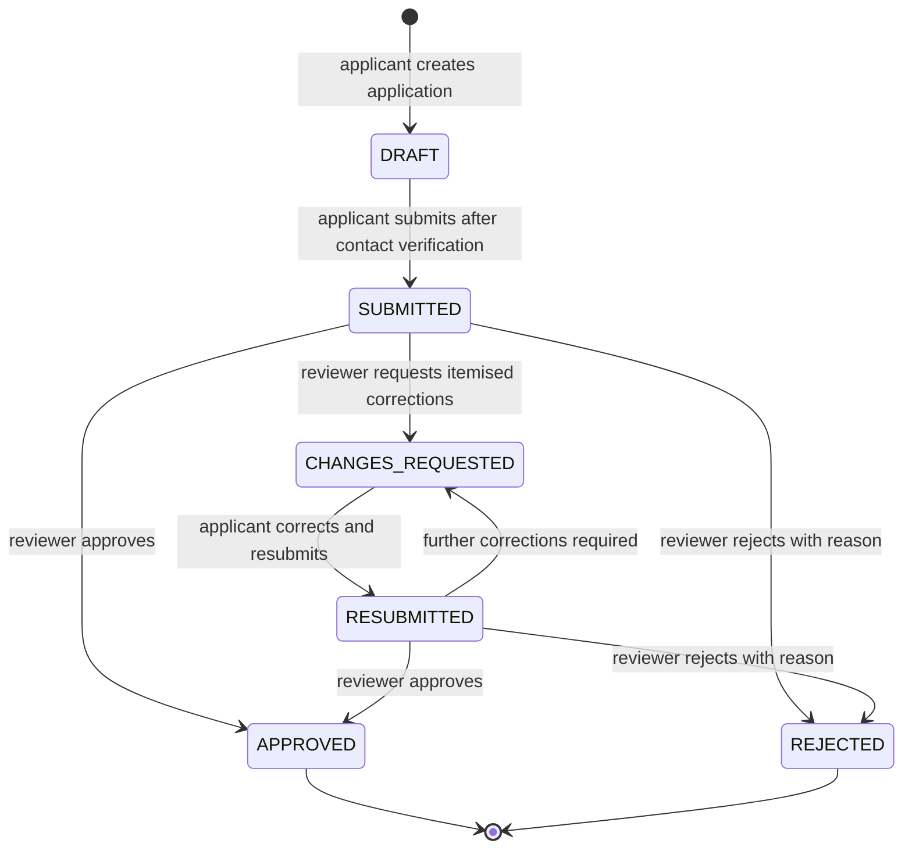
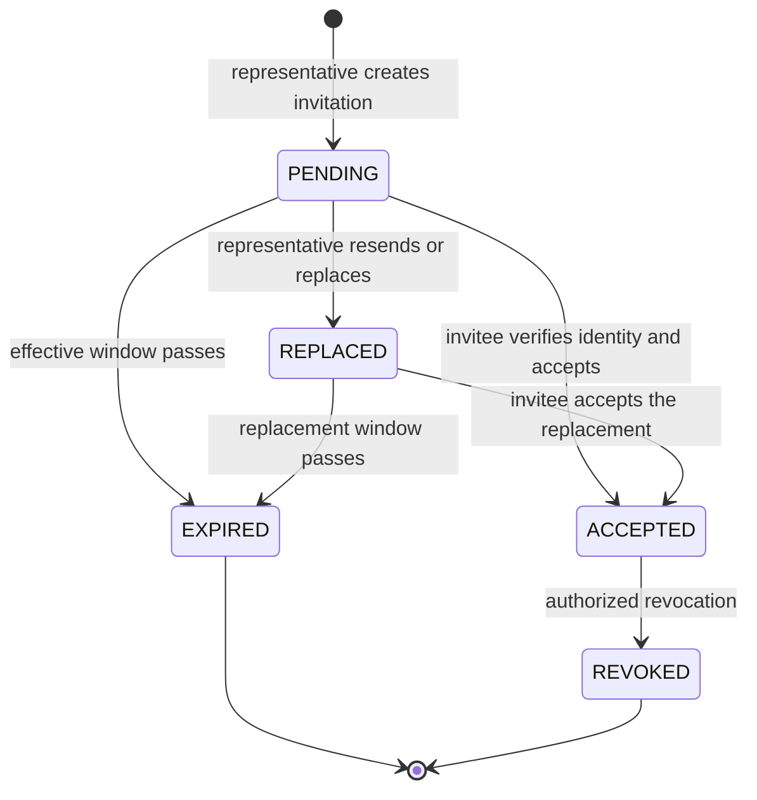

# UberTib Information Architecture

**Phase:** UX 1 — Discovery, Information Architecture and User Flows
**Baseline:** 2026-08-25
**Input mode:** Docs-Partial — no screen inventory existed to inherit; every `SCR-*` here is derived
**Platform profiles:** Patient = C · Clinic/Doctor = A · Admin = A
**Screens defined:** 162 — Patient 47 · Clinic 56 · Admin 59
**Registry:** `docs/README.md` — `SCR-*` allocations appended by this phase

## 1. Purpose and Authority

This document owns the screen model, the sitemap, the navigation model and the labelling taxonomy for all three UberTib platforms.

It does not restate authorization rules, lifecycle transitions, API behavior or business rules. Those remain owned by `docs/domain/PERMISSIONS_MATRIX.md`, `docs/domain/STATE_MACHINES.md`, `docs/api/API_CONTRACTS.md`, `docs/domain/STAFF_INTERACTION_CONTRACTS.md` and `docs/PRD.md` and are referenced by ID.

No visual design appears here. No layout, no region, no component, no colour, no type, no copy.

### 1.1 Why every screen is derived

`docs/README.md` records `docs/ux/SCREEN_INVENTORY.md` as **omitted** because no authoritative business UI exists. This was verified directly against the repository rather than assumed:

- `app/Filament/` does not exist — there are zero Filament resources, pages or widgets;
- the only Filament artifact is `app/Providers/Filament/AdminPanelProvider.php`, a panel shell registering stock pages and widgets only;
- `routes/api.php` exposes exactly one route, `GET /api/v1/catalog/service-groups`;
- no React Native application or repository path is verified anywhere.

Therefore no screen is inherited and none is classified `Existing`. Every screen is `New`, and every route or resource path is `(Proposed)`.

### 1.2 Screen definition rule

A screen is distinct when it owns a route, or when a role sees a materially different version of one.

Modals, drawers, sheets and wizard steps are screens when they own state or actions. They are not screens when they only display data already present on the parent. Applying that rule removed four candidates during derivation, recorded here so the reasoning is not lost:

| Rejected candidate | Why it is not a screen |
|---|---|
| Booking submitted confirmation | Displays only what the submit action returned. It is a success state of `SCR-BOOKING-002`. |
| Accepted plan read-only view | Same contract and same content as `SCR-CLINICAL-003`, differing only by lifecycle state. It is a state variant, not a screen. |
| Comparison tray | Holds selection state but displays data already present on `SCR-ELIG-002`. It is an owned region of the results screen; the comparison itself is `SCR-ELIG-005`. |
| Claim decision view | `API-CLAIMS-004` returns the decision as part of claim detail. It is a section of `SCR-CLAIMS-004`. |

### 1.3 Classification vocabulary

| Value | Meaning here |
|---|---|
| **New** | No implementation exists. Applies to all 162 screens. |
| **Existing** | Implemented business UI. Zero screens qualify. |
| **Change required** | Existing UI needing modification. Zero screens qualify. |

`Derived or inherited` carries a second axis:

| Value | Meaning |
|---|---|
| `Derived — pending confirmation` | Derived from requirements, permissions, state machines and contracts. Default for this phase. |
| `Derived — confirmed by PO-UX-02` | Clinic and provider onboarding screens, confirmed product behavior under `.spec/decisions/PO-2026-08-25-ux-gap-resolution.md`. |
| `Derived — confirmed by PO-UX-03` | Clinic staff invitation and scoped-grant screens, same decision. |
| `Derived — confirmed by PO-UX-04` | Patient provider comparison, same decision. |

### 1.4 Data and action contract rule

Per `PO-UX-05` and `docs/domain/STAFF_INTERACTION_CONTRACTS.md` section 8, every screen names at least one of:

- an `API-*` contract when it consumes external or mobile REST behavior — Patient app only;
- an `SDC-*` staff interaction contract when it reads or mutates in-process staff behavior — Clinic and Admin panels;
- an explicit background or system requirement when the screen only observes a resulting state.

`SDC-*` is a documentation identifier for an in-process Laravel query or application action. It is not an HTTP route, and no internal REST endpoint is invented for Filament.

## 2. Platform Separation

The three platforms do not share an information architecture. This is a requirement, not a preference.

`docs/implementation/CLINIC_IMPLEMENTATION_PLAN.md` section 1 states the Clinic panel "is not an extension of the Admin navigation and it does not grant administrative governance powers." `docs/implementation/ADMIN_IMPLEMENTATION_PLAN.md` section 1 states the Admin platform "is not a universal override console."

Two independent findings in `UX_FOUNDATION.md` section 4.2 reinforce it:

- no patient *feature* is daily-and-blocking, while four Admin jobs and four Clinic jobs are;
- the patient is episodic and never becomes fluent, while staff work the same queue every day and benefit from stability.

Consequence: attention-driven prominence is correct for the Patient app and wrong for the panels. Stable, learnable navigation is correct for the panels and wrong for the Patient app.

### 2.1 Section ownership across platforms

Where the same domain appears on more than one platform, the screens are different by responsibility, not translations of each other.

| Domain | Patient owns | Clinic owns | Admin owns |
|---|---|---|---|
| IDENTITY | own identity, representation grants | onboarding application, staff invitations, context | onboarding review, staff grants, provider registry, guardian oversight |
| CATALOG | browse and understand services | — | definition versions, gates, publication |
| ELIG | discovery, decision card, explanation, comparison | activation, prices, own status and blockers | verification, decision inspection, policy inputs, suspension ops |
| BOOKING | request, respond to alternative, cancel | availability, response, schedule, no-show | exception oversight |
| CLINICAL | read plan, accept, follow case | author plan, stages, evidence, follow-up | purpose-scoped oversight only |
| FINANCE | own terms, own assertions and responses | clinic assertions and responses | dispute review, execution tracking |
| REVIEWS | submit review, appeal where policy permits | see reviews, appeal | integrity and appeal decisions |
| CLAIMS | submit, supply evidence, appeal | respond, supply evidence, appeal | intake, deadlines, sensitive decisions, appeals |
| OPS | — | own work feed | queues, reports, launch readiness |
| POLICY | — | — | version lifecycle, historical reproduction |
| AUDIT | — | — | audit explorer, integrity exceptions |
| PLATFORM | home, pending submissions | dashboard | dashboard, privileged auth, evidence access, retention, health |

## 3. Navigation Model — Patient App (Profile C)

The platform paradigm is native mobile. No web sidebar is ported. No hover state exists anywhere.

### 3.1 Structure

**Primary navigation — persistent, four destinations.** Chosen because the patient's recurring needs collapse to exactly four: what needs me now, find care, my treatment, and me.

| Destination | Landing screen | Rationale |
|---|---|---|
| Home | `SCR-PLATFORM-001` | Principle 3 — the attention surface is the patient's real entry point |
| Discover | `SCR-CATALOG-001` | The discovery job chain begins at the catalog, not at search, because the patient must first name what they need |
| My care | `SCR-CLINICAL-001` | Cases are the container for plans, timeline, finance, reviews and claims |
| Profile | `SCR-IDENTITY-004` | Identity, representation, and pending submissions |

**No fifth destination.** `PO-UX-09` confirmed the notification centre and explicitly declined a fifth primary tab for it. The reasoning holds up against the confirmed patient context: an episodic user who cannot rely on learned navigation is served better by *what needs me now* on Home than by a tab whose position they would have to remember. A notification tab would also compete with Home for the same job while carrying weaker information — a list of what happened rather than a list of what is required.

**Secondary navigation** is contextual: within a case, within a booking, within a claim. Finance, reviews and claims are reached through their case rather than as top-level destinations, because every one of them is case-scoped in the data model and a top-level entry would require the patient to pick a case first anyway.

**Utility** is reached from two places. From the app chrome: `SCR-PLATFORM-009` the notification centre, via a persistent bell available on every screen. From Profile: representation grants including `SCR-IDENTITY-037` add dependent, active patient context, and pending or failed submissions.

### 3.2 Landing screen per role

| Role | Landing | Note |
|---|---|---|
| Public visitor | `SCR-IDENTITY-001` | Discovery is reachable unauthenticated; every action beyond it gates to `SCR-IDENTITY-002` |
| Patient | `SCR-PLATFORM-001` | |
| Guardian | `SCR-PLATFORM-001` | With the active subject continuously evident per `FR-IDENTITY-003` |

### 3.3 Unauthenticated behavior and return

A public visitor may reach `SCR-CATALOG-001`, `SCR-CATALOG-002`, `SCR-ELIG-001`, `SCR-ELIG-002`, `SCR-ELIG-003`, `SCR-ELIG-004` and `SCR-ELIG-005`. Every one is read-only and audience-safe.

Attempting any authenticated action routes to `SCR-IDENTITY-002` and, on success, returns to the exact originating screen with its context intact — including a comparison selection set. This matters because losing a search and a comparison to a sign-in wall is the most likely abandonment point in the discovery chain.

`ERR-IDENTITY-001` is the authoritative trigger for this route.

### 3.4 Back, deep link and resume

Back follows the platform paradigm and unwinds the task, not the history of tabs.

Deep links resolve to `SCR-BOOKING-004`, `SCR-CLINICAL-002`, `SCR-CLINICAL-003`, `SCR-CLAIMS-004` and `SCR-FINANCE-002`. Every deep link re-fetches authoritative state before rendering an action, per `CROSS_PLATFORM_BEHAVIOR` section 20.2 — a link that arrived hours ago cannot be trusted to describe a current deadline or a current eligibility state.

On resume or reconnect after an unknown mutation outcome, the app reconciles through authoritative list and detail reads before offering any new command (`CROSS_PLATFORM_BEHAVIOR` section 20.3). `SCR-PLATFORM-002` is where an unresolved outcome becomes visible rather than silent.

### 3.5 Guardian context

Active subject is a global app context surfaced on `SCR-IDENTITY-008`. Switching it changes what is displayed and grants nothing — every request re-evaluates the grant server-side (`FR-IDENTITY-003`).

## 4. Navigation Model — Clinic / Doctor Panel (Profile A)

Filament supplies the shell: navigation, groups, tables, forms, notifications and authorization hooks. This section documents what the framework gives and specifies only deviations.

### 4.1 Framework-owned

Panel chrome, sidebar navigation with groups, global search where enabled, notification area, user menu, table and form scaffolding, and the login route. Panel id `clinic`, path `/clinic` — both `(Proposed)` per `CLINIC_IMPLEMENTATION_PLAN.md` section 2, which records that no Clinic panel currently exists.

The Clinic panel must not discover Admin resources.

### 4.2 Navigation groups

Ordered by the frequency-by-criticality plot, not by domain alphabet.

| Group | Screens | Why here |
|---|---|---|
| *(ungrouped root)* | `SCR-PLATFORM-003` dashboard, `SCR-OPS-001` work feed | `JTBD-OPS-001` is daily-and-blocking for this actor |
| Bookings | `SCR-BOOKING-008` through `SCR-BOOKING-013`, `SCR-BOOKING-007`, `SCR-BOOKING-017` | `JTBD-BOOKING-004` is daily-and-blocking and deadline-bound; `JTBD-BOOKING-008` reschedule is monthly but belongs with the booking it changes |
| Cases and treatment | `SCR-CLINICAL-008` through `SCR-CLINICAL-017` | `JTBD-CLINICAL-001` and `JTBD-CLINICAL-003` are daily-and-blocking |
| Services and eligibility | `SCR-ELIG-006` through `SCR-ELIG-013`, `SCR-ELIG-021` | Daily while activating, then change-driven. `SCR-ELIG-021` sits here rather than under Bookings because its cause is an eligibility suspension and its remedy is a dependency fix |
| Financial records | `SCR-FINANCE-006` through `SCR-FINANCE-009` | Weekly |
| Reviews and claims | `SCR-REVIEWS-005`, `SCR-REVIEWS-006`, `SCR-CLAIMS-006` through `SCR-CLAIMS-008` | Rare |
| Clinic settings | `SCR-IDENTITY-021` through `SCR-IDENTITY-024`, `SCR-IDENTITY-026` | Rare, and correctly buried |

The public onboarding portal — `SCR-IDENTITY-009` through `SCR-IDENTITY-018` — sits **outside** the authenticated panel navigation entirely. It is a pre-authentication surface, and `SCR-IDENTITY-025` invitation acceptance is likewise reached only by invitation, never from panel navigation.

### 4.3 Landing screen per role

| Role | Landing | Note |
|---|---|---|
| Prospective provider applicant | `SCR-IDENTITY-009` | Public. Returning verified applicant lands on `SCR-IDENTITY-012`. |
| Invited clinic staff member (pre-acceptance) | `SCR-IDENTITY-025` | Reached by invitation only |
| Clinic / provider representative | `SCR-PLATFORM-003` | With the post-approval checklist prominent until complete |
| Treating dentist | `SCR-PLATFORM-003` | |

### 4.4 Provider and branch context

`SCR-IDENTITY-020` owns the active provider and branch context, and it is panel-global rather than per-screen. This is a deviation from stock Filament worth stating: `JTBD-IDENTITY-011` is daily-and-blocking, and a wrong-branch action is an authorization and operational failure, so the active context must be continuously evident rather than confirmed per form.

Only granted contexts are selectable. Switching creates no authority (`SDC-IDENTITY-004`).

### 4.5 Access revocation while a page is open

A stale panel page cannot continue operating after a grant is revoked. The next protected read or action fails authorization with `ERR-IDENTITY-002` semantics (`CROSS_PLATFORM_BEHAVIOR` section 6.1). Every Clinic screen therefore carries a permission-denied state; it is not an assumed impossibility.

## 5. Navigation Model — Admin Panel (Profile A)

Panel id `admin`, path `/admin` — both verified in `app/Providers/Filament/AdminPanelProvider.php`. The shell exists; every domain screen is new.

### 5.1 Navigation groups

| Group | Screens | Why here |
|---|---|---|
| *(ungrouped root)* | `SCR-PLATFORM-004` dashboard, `SCR-OPS-002` work queue, `SCR-OPS-003` work item | `JTBD-OPS-001` is the daily-and-blocking home for six staff roles |
| Onboarding and providers | `SCR-IDENTITY-027` through `SCR-IDENTITY-032`, `SCR-IDENTITY-036` | `JTBD-IDENTITY-009` is daily-and-blocking |
| Verification and eligibility | `SCR-ELIG-014` through `SCR-ELIG-020`, `SCR-ELIG-022` | `JTBD-ELIG-007` is daily-and-blocking. `SCR-ELIG-022` is rare but deadline-bound and safety-critical, so it is reachable from the queue as well as from this group |
| Claims and disputes | `SCR-CLAIMS-009` through `SCR-CLAIMS-013` | `JTBD-CLAIMS-005` is daily-and-blocking |
| Financial records | `SCR-FINANCE-010` through `SCR-FINANCE-012` | `JTBD-FINANCE-005` is daily |
| Bookings and cases | `SCR-BOOKING-014`, `SCR-BOOKING-015`, `SCR-CLINICAL-018`, `SCR-CLINICAL-019` | Daily to weekly oversight |
| Reviews | `SCR-REVIEWS-007` through `SCR-REVIEWS-009` | Weekly |
| Catalog and launch | `SCR-CATALOG-003` through `SCR-CATALOG-009`, `SCR-OPS-006` | Rare, and rare-and-blocking — needs to be discoverable, not memorised |
| Policy | `SCR-POLICY-001` through `SCR-POLICY-004` | Rare |
| Audit and integrity | `SCR-AUDIT-001` through `SCR-AUDIT-004` | Rare, urgent when used |
| Access and staff | `SCR-IDENTITY-033` through `SCR-IDENTITY-035`, `SCR-IDENTITY-038` | Weekly. `SCR-IDENTITY-038` legal-representation verification is rare and reached primarily from the work queue |
| Reporting | `SCR-OPS-004`, `SCR-OPS-005` | Weekly |
| Platform operations | `SCR-PLATFORM-006` through `SCR-PLATFORM-008` | Weekly to monthly |

`SCR-PLATFORM-005` privileged authentication sits outside panel navigation as a pre-authentication surface.

### 5.2 Landing screen per role

All eleven Admin roles land on `SCR-PLATFORM-004`. What that dashboard contains differs by role because navigation visibility follows the actor's active grants (`PERMISSIONS_MATRIX` section 14 — queue filtered to role, organization, branch, subject and workflow scope).

| Role | Primary working screen after landing |
|---|---|
| Verification staff | `SCR-IDENTITY-027`, `SCR-ELIG-014` |
| Licensed clinical reviewer | `SCR-CATALOG-006`, `SCR-ELIG-015`, `SCR-CLAIMS-012` |
| Review integrity reviewer | `SCR-REVIEWS-007` |
| Claim / dispute reviewer | `SCR-CLAIMS-009` |
| Finance reviewer | `SCR-FINANCE-010` |
| Policy owner / reviewer | `SCR-POLICY-001`, `SCR-CATALOG-004` |
| Product / operations owner | `SCR-OPS-004`, `SCR-OPS-006` |
| Legal accountable owner | `SCR-CATALOG-006` |
| Technical accountable owner | `SCR-CATALOG-006`, `SCR-PLATFORM-008` |
| Operations staff | `SCR-OPS-002` |
| System administrator | `SCR-IDENTITY-033` |
| Authorized auditor | `SCR-AUDIT-001` |

Twelve rows for eleven roles: the authorized auditor is listed separately because `PERMISSIONS_MATRIX` treats audit access as a distinct scoped purpose rather than a job title.

### 5.3 What must never appear in Admin navigation

Derived from `ADMIN_IMPLEMENTATION_PLAN.md` section 10 and `PERMISSIONS_MATRIX` sections 5, 8, 9, 10, 11:

- any control that sets final `S`, `P`, `H`, `I` or eligibility;
- any clinical authoring surface — Admin oversight never authors a diagnosis or treatment plan;
- any generic hard-delete on an immutable or append-only record;
- any pay, wallet, balance, transfer, settle or platform-refund affordance;
- any booking-state override or force-confirm;
- any surface implying a `super_admin` bypass of clinical, financial, claim, evidence or audit scope.

## 6. Sitemaps

Four `flowchart TD` diagrams. Node IDs use underscores; display text is in quoted labels; no HTML and no styling directives, per convention C11.

### 6.1 Patient app sitemap

```mermaid
flowchart TD
    subgraph PUBLIC["Public — unauthenticated"]
        SCR_IDENTITY_001["SCR-IDENTITY-001 Patient entry"]
        SCR_CATALOG_001["SCR-CATALOG-001 Service groups"]
        SCR_CATALOG_002["SCR-CATALOG-002 Service detail"]
        SCR_ELIG_001["SCR-ELIG-001 Provider search"]
        SCR_ELIG_002["SCR-ELIG-002 Provider results"]
        SCR_ELIG_003["SCR-ELIG-003 Provider decision card"]
        SCR_ELIG_004["SCR-ELIG-004 Eligibility explanation"]
        SCR_ELIG_005["SCR-ELIG-005 Provider comparison"]
    end
    subgraph AUTHGATE["Identity"]
        SCR_IDENTITY_002["SCR-IDENTITY-002 Phone and OTP request"]
        SCR_IDENTITY_003["SCR-IDENTITY-003 OTP verification"]
    end
    subgraph HOME["Home"]
        SCR_PLATFORM_001["SCR-PLATFORM-001 Needs attention"]
    end
    subgraph UTIL["Utility — app chrome"]
        SCR_PLATFORM_009["SCR-PLATFORM-009 Notification centre"]
    end
    subgraph BOOK["Booking"]
        SCR_BOOKING_001["SCR-BOOKING-001 Slot selection"]
        SCR_BOOKING_002["SCR-BOOKING-002 Request review and submit"]
        SCR_BOOKING_003["SCR-BOOKING-003 My bookings"]
        SCR_BOOKING_004["SCR-BOOKING-004 Booking detail"]
        SCR_BOOKING_005["SCR-BOOKING-005 Alternative decision"]
        SCR_BOOKING_006["SCR-BOOKING-006 Cancel booking"]
        SCR_BOOKING_016["SCR-BOOKING-016 Reschedule request"]
    end
    subgraph CARE["My care"]
        SCR_CLINICAL_001["SCR-CLINICAL-001 My cases"]
        SCR_CLINICAL_002["SCR-CLINICAL-002 Case summary"]
        SCR_CLINICAL_003["SCR-CLINICAL-003 Treatment plan"]
        SCR_CLINICAL_004["SCR-CLINICAL-004 Plan acceptance"]
        SCR_CLINICAL_005["SCR-CLINICAL-005 Case timeline"]
        SCR_CLINICAL_006["SCR-CLINICAL-006 Stage detail"]
        SCR_CLINICAL_007["SCR-CLINICAL-007 Follow-ups"]
    end
    subgraph MONEY["Financial records"]
        SCR_FINANCE_001["SCR-FINANCE-001 Accepted terms"]
        SCR_FINANCE_002["SCR-FINANCE-002 Financial timeline"]
        SCR_FINANCE_003["SCR-FINANCE-003 Report payment"]
        SCR_FINANCE_004["SCR-FINANCE-004 Event response"]
        SCR_FINANCE_005["SCR-FINANCE-005 Report refund execution"]
    end
    subgraph VOICE["Reviews and claims"]
        SCR_REVIEWS_001["SCR-REVIEWS-001 Reviewable experiences"]
        SCR_REVIEWS_002["SCR-REVIEWS-002 Submit review"]
        SCR_REVIEWS_003["SCR-REVIEWS-003 My review"]
        SCR_REVIEWS_004["SCR-REVIEWS-004 Review appeal"]
        SCR_CLAIMS_001["SCR-CLAIMS-001 My claims"]
        SCR_CLAIMS_002["SCR-CLAIMS-002 Refund request"]
        SCR_CLAIMS_003["SCR-CLAIMS-003 Protection claim"]
        SCR_CLAIMS_004["SCR-CLAIMS-004 Claim detail"]
        SCR_CLAIMS_005["SCR-CLAIMS-005 Claim appeal"]
    end
    subgraph ME["Profile"]
        SCR_IDENTITY_004["SCR-IDENTITY-004 Patient profile"]
        SCR_IDENTITY_005["SCR-IDENTITY-005 Family and representation"]
        SCR_IDENTITY_006["SCR-IDENTITY-006 Create grant"]
        SCR_IDENTITY_007["SCR-IDENTITY-007 Grant detail"]
        SCR_IDENTITY_008["SCR-IDENTITY-008 Active patient context"]
        SCR_PLATFORM_002["SCR-PLATFORM-002 Pending submissions"]
        SCR_IDENTITY_037["SCR-IDENTITY-037 Add dependent"]
    end
    SCR_IDENTITY_001 --> SCR_CATALOG_001
    SCR_IDENTITY_001 --> SCR_IDENTITY_002
    SCR_CATALOG_001 --> SCR_CATALOG_002
    SCR_CATALOG_002 --> SCR_ELIG_001
    SCR_ELIG_001 --> SCR_ELIG_002
    SCR_ELIG_002 --> SCR_ELIG_003
    SCR_ELIG_002 --> SCR_ELIG_005
    SCR_ELIG_003 --> SCR_ELIG_004
    SCR_ELIG_003 --> SCR_BOOKING_001
    SCR_ELIG_005 --> SCR_ELIG_003
    SCR_ELIG_005 --> SCR_BOOKING_001
    SCR_IDENTITY_002 --> SCR_IDENTITY_003
    SCR_IDENTITY_003 --> SCR_PLATFORM_001
    SCR_PLATFORM_001 --> SCR_BOOKING_004
    SCR_PLATFORM_001 --> SCR_CLINICAL_003
    SCR_PLATFORM_001 --> SCR_CLAIMS_004
    SCR_PLATFORM_001 --> SCR_FINANCE_004
    SCR_PLATFORM_001 --> SCR_CLINICAL_007
    SCR_PLATFORM_001 --> SCR_CATALOG_001
    SCR_PLATFORM_001 --> SCR_CLINICAL_001
    SCR_PLATFORM_001 --> SCR_IDENTITY_004
    SCR_BOOKING_001 --> SCR_BOOKING_002
    SCR_BOOKING_002 --> SCR_BOOKING_003
    SCR_BOOKING_003 --> SCR_BOOKING_004
    SCR_BOOKING_004 --> SCR_BOOKING_005
    SCR_BOOKING_004 --> SCR_BOOKING_006
    SCR_BOOKING_004 --> SCR_CLINICAL_002
    SCR_CLINICAL_001 --> SCR_CLINICAL_002
    SCR_CLINICAL_002 --> SCR_CLINICAL_003
    SCR_CLINICAL_002 --> SCR_CLINICAL_005
    SCR_CLINICAL_002 --> SCR_CLINICAL_007
    SCR_CLINICAL_002 --> SCR_FINANCE_001
    SCR_CLINICAL_002 --> SCR_REVIEWS_001
    SCR_CLINICAL_002 --> SCR_CLAIMS_001
    SCR_CLINICAL_003 --> SCR_CLINICAL_004
    SCR_CLINICAL_005 --> SCR_CLINICAL_006
    SCR_FINANCE_001 --> SCR_FINANCE_002
    SCR_FINANCE_002 --> SCR_FINANCE_003
    SCR_FINANCE_002 --> SCR_FINANCE_004
    SCR_FINANCE_002 --> SCR_FINANCE_005
    SCR_REVIEWS_001 --> SCR_REVIEWS_002
    SCR_REVIEWS_002 --> SCR_REVIEWS_003
    SCR_REVIEWS_003 --> SCR_REVIEWS_004
    SCR_CLAIMS_001 --> SCR_CLAIMS_002
    SCR_CLAIMS_001 --> SCR_CLAIMS_003
    SCR_CLAIMS_001 --> SCR_CLAIMS_004
    SCR_CLAIMS_004 --> SCR_CLAIMS_005
    SCR_IDENTITY_004 --> SCR_IDENTITY_005
    SCR_IDENTITY_004 --> SCR_PLATFORM_002
    SCR_IDENTITY_005 --> SCR_IDENTITY_006
    SCR_IDENTITY_005 --> SCR_IDENTITY_007
    SCR_IDENTITY_005 --> SCR_IDENTITY_008
    SCR_IDENTITY_005 --> SCR_IDENTITY_037
    SCR_BOOKING_004 --> SCR_BOOKING_016
    SCR_PLATFORM_001 --> SCR_PLATFORM_009
    SCR_PLATFORM_009 --> SCR_BOOKING_004
    SCR_PLATFORM_009 --> SCR_BOOKING_016
    SCR_PLATFORM_009 --> SCR_CLINICAL_003
    SCR_PLATFORM_009 --> SCR_REVIEWS_004
```

### 6.2 Clinic / Doctor panel sitemap

```mermaid
flowchart TD
    subgraph ONBOARD["Public onboarding portal — outside the panel"]
        SCR_IDENTITY_009["SCR-IDENTITY-009 Join UberTib"]
        SCR_IDENTITY_010["SCR-IDENTITY-010 Provider type"]
        SCR_IDENTITY_011["SCR-IDENTITY-011 Applicant contact verification"]
        SCR_IDENTITY_012["SCR-IDENTITY-012 Application workspace"]
        SCR_IDENTITY_013["SCR-IDENTITY-013 Applicant and provider facts"]
        SCR_IDENTITY_014["SCR-IDENTITY-014 Primary branch facts"]
        SCR_IDENTITY_015["SCR-IDENTITY-015 Application evidence"]
        SCR_IDENTITY_016["SCR-IDENTITY-016 Review and submit"]
        SCR_IDENTITY_017["SCR-IDENTITY-017 Status and requested changes"]
        SCR_IDENTITY_018["SCR-IDENTITY-018 Application outcome"]
    end
    subgraph ENTRY["Panel entry"]
        SCR_IDENTITY_019["SCR-IDENTITY-019 Clinic sign-in"]
        SCR_IDENTITY_025["SCR-IDENTITY-025 Invitation acceptance"]
        SCR_PLATFORM_003["SCR-PLATFORM-003 Clinic dashboard"]
        SCR_IDENTITY_020["SCR-IDENTITY-020 Provider and branch context"]
        SCR_OPS_001["SCR-OPS-001 Clinic work feed"]
    end
    subgraph CBOOK["Bookings"]
        SCR_BOOKING_007["SCR-BOOKING-007 Availability and slots"]
        SCR_BOOKING_008["SCR-BOOKING-008 Booking inbox"]
        SCR_BOOKING_009["SCR-BOOKING-009 Request response"]
        SCR_BOOKING_010["SCR-BOOKING-010 Propose alternative"]
        SCR_BOOKING_011["SCR-BOOKING-011 Clinic schedule"]
        SCR_BOOKING_012["SCR-BOOKING-012 Provider cancellation"]
        SCR_BOOKING_013["SCR-BOOKING-013 Record no-show"]
        SCR_BOOKING_017["SCR-BOOKING-017 Reschedule proposals"]
    end
    subgraph CCASE["Cases and treatment"]
        SCR_CLINICAL_008["SCR-CLINICAL-008 Clinic cases"]
        SCR_CLINICAL_009["SCR-CLINICAL-009 Case workspace"]
        SCR_CLINICAL_010["SCR-CLINICAL-010 Plan authoring"]
        SCR_CLINICAL_011["SCR-CLINICAL-011 Stages and pricing"]
        SCR_CLINICAL_012["SCR-CLINICAL-012 Propose plan"]
        SCR_CLINICAL_013["SCR-CLINICAL-013 Plan version history"]
        SCR_CLINICAL_014["SCR-CLINICAL-014 Stage execution and evidence"]
        SCR_CLINICAL_015["SCR-CLINICAL-015 Stage completion"]
        SCR_CLINICAL_016["SCR-CLINICAL-016 Stage reopening"]
        SCR_CLINICAL_017["SCR-CLINICAL-017 Clinic follow-ups"]
    end
    subgraph CELIG["Services and eligibility"]
        SCR_ELIG_006["SCR-ELIG-006 Provider and branch facts"]
        SCR_ELIG_007["SCR-ELIG-007 Activation requests"]
        SCR_ELIG_008["SCR-ELIG-008 Activation questionnaire"]
        SCR_ELIG_009["SCR-ELIG-009 Activation evidence"]
        SCR_ELIG_010["SCR-ELIG-010 Service price"]
        SCR_ELIG_011["SCR-ELIG-011 Eligibility status"]
        SCR_ELIG_012["SCR-ELIG-012 Blocker detail"]
        SCR_ELIG_013["SCR-ELIG-013 Suspension notice"]
        SCR_ELIG_021["SCR-ELIG-021 Bookings on eligibility hold"]
    end
    subgraph CMONEY["Financial records"]
        SCR_FINANCE_006["SCR-FINANCE-006 Case financial workspace"]
        SCR_FINANCE_007["SCR-FINANCE-007 Report payment"]
        SCR_FINANCE_008["SCR-FINANCE-008 Event response"]
        SCR_FINANCE_009["SCR-FINANCE-009 Report refund execution"]
    end
    subgraph CVOICE["Reviews and claims"]
        SCR_REVIEWS_005["SCR-REVIEWS-005 Provider reviews"]
        SCR_REVIEWS_006["SCR-REVIEWS-006 Review appeal"]
        SCR_CLAIMS_006["SCR-CLAIMS-006 Clinic claims"]
        SCR_CLAIMS_007["SCR-CLAIMS-007 Claim response and evidence"]
        SCR_CLAIMS_008["SCR-CLAIMS-008 Clinic claim appeal"]
    end
    subgraph CSET["Clinic settings"]
        SCR_IDENTITY_021["SCR-IDENTITY-021 Onboarding checklist"]
        SCR_IDENTITY_022["SCR-IDENTITY-022 People and grants"]
        SCR_IDENTITY_023["SCR-IDENTITY-023 Create invitation"]
        SCR_IDENTITY_024["SCR-IDENTITY-024 Invitation detail"]
        SCR_IDENTITY_026["SCR-IDENTITY-026 Staff grant detail"]
    end
    SCR_IDENTITY_009 --> SCR_IDENTITY_010
    SCR_IDENTITY_010 --> SCR_IDENTITY_011
    SCR_IDENTITY_011 --> SCR_IDENTITY_012
    SCR_IDENTITY_012 --> SCR_IDENTITY_013
    SCR_IDENTITY_012 --> SCR_IDENTITY_014
    SCR_IDENTITY_012 --> SCR_IDENTITY_015
    SCR_IDENTITY_012 --> SCR_IDENTITY_016
    SCR_IDENTITY_016 --> SCR_IDENTITY_017
    SCR_IDENTITY_017 --> SCR_IDENTITY_013
    SCR_IDENTITY_017 --> SCR_IDENTITY_014
    SCR_IDENTITY_017 --> SCR_IDENTITY_015
    SCR_IDENTITY_017 --> SCR_IDENTITY_018
    SCR_IDENTITY_018 --> SCR_IDENTITY_019
    SCR_IDENTITY_025 --> SCR_IDENTITY_019
    SCR_IDENTITY_019 --> SCR_PLATFORM_003
    SCR_PLATFORM_003 --> SCR_IDENTITY_020
    SCR_PLATFORM_003 --> SCR_OPS_001
    SCR_PLATFORM_003 --> SCR_IDENTITY_021
    SCR_PLATFORM_003 --> SCR_BOOKING_008
    SCR_PLATFORM_003 --> SCR_CLINICAL_008
    SCR_PLATFORM_003 --> SCR_ELIG_011
    SCR_OPS_001 --> SCR_BOOKING_009
    SCR_OPS_001 --> SCR_ELIG_012
    SCR_OPS_001 --> SCR_CLAIMS_007
    SCR_OPS_001 --> SCR_CLINICAL_017
    SCR_IDENTITY_021 --> SCR_ELIG_006
    SCR_IDENTITY_021 --> SCR_IDENTITY_023
    SCR_IDENTITY_021 --> SCR_ELIG_007
    SCR_IDENTITY_021 --> SCR_BOOKING_007
    SCR_BOOKING_008 --> SCR_BOOKING_009
    SCR_BOOKING_009 --> SCR_BOOKING_010
    SCR_BOOKING_011 --> SCR_BOOKING_012
    SCR_BOOKING_011 --> SCR_BOOKING_013
    SCR_BOOKING_011 --> SCR_BOOKING_017
    SCR_ELIG_013 --> SCR_ELIG_021
    SCR_ELIG_021 --> SCR_ELIG_012
    SCR_BOOKING_011 --> SCR_CLINICAL_009
    SCR_PLATFORM_003 --> SCR_BOOKING_011
    SCR_CLINICAL_008 --> SCR_CLINICAL_009
    SCR_CLINICAL_009 --> SCR_CLINICAL_010
    SCR_CLINICAL_009 --> SCR_CLINICAL_013
    SCR_CLINICAL_009 --> SCR_CLINICAL_014
    SCR_CLINICAL_009 --> SCR_FINANCE_006
    SCR_CLINICAL_009 --> SCR_CLAIMS_006
    SCR_CLINICAL_010 --> SCR_CLINICAL_011
    SCR_CLINICAL_011 --> SCR_CLINICAL_012
    SCR_CLINICAL_014 --> SCR_CLINICAL_015
    SCR_CLINICAL_014 --> SCR_CLINICAL_016
    SCR_ELIG_006 --> SCR_ELIG_007
    SCR_ELIG_007 --> SCR_ELIG_008
    SCR_ELIG_008 --> SCR_ELIG_009
    SCR_ELIG_008 --> SCR_ELIG_010
    SCR_ELIG_011 --> SCR_ELIG_012
    SCR_ELIG_011 --> SCR_ELIG_013
    SCR_ELIG_012 --> SCR_ELIG_009
    SCR_ELIG_013 --> SCR_ELIG_012
    SCR_FINANCE_006 --> SCR_FINANCE_007
    SCR_FINANCE_006 --> SCR_FINANCE_008
    SCR_FINANCE_006 --> SCR_FINANCE_009
    SCR_REVIEWS_005 --> SCR_REVIEWS_006
    SCR_PLATFORM_003 --> SCR_REVIEWS_005
    SCR_CLAIMS_006 --> SCR_CLAIMS_007
    SCR_CLAIMS_007 --> SCR_CLAIMS_008
    SCR_IDENTITY_022 --> SCR_IDENTITY_023
    SCR_IDENTITY_022 --> SCR_IDENTITY_024
    SCR_IDENTITY_022 --> SCR_IDENTITY_026
    SCR_IDENTITY_020 --> SCR_IDENTITY_022
    SCR_IDENTITY_023 --> SCR_IDENTITY_024
```

### 6.3 Admin panel sitemap

```mermaid
flowchart TD
    subgraph AENTRY["Panel entry"]
        SCR_PLATFORM_005["SCR-PLATFORM-005 Privileged sign-in"]
        SCR_PLATFORM_004["SCR-PLATFORM-004 Admin dashboard"]
        SCR_OPS_002["SCR-OPS-002 Work queue"]
        SCR_OPS_003["SCR-OPS-003 Work item detail"]
    end
    subgraph AONB["Onboarding and providers"]
        SCR_IDENTITY_027["SCR-IDENTITY-027 Application queue"]
        SCR_IDENTITY_028["SCR-IDENTITY-028 Application review"]
        SCR_IDENTITY_029["SCR-IDENTITY-029 Fact and evidence verification"]
        SCR_IDENTITY_030["SCR-IDENTITY-030 Request changes"]
        SCR_IDENTITY_031["SCR-IDENTITY-031 Approve application"]
        SCR_IDENTITY_032["SCR-IDENTITY-032 Reject application"]
        SCR_IDENTITY_036["SCR-IDENTITY-036 Providers and branches"]
    end
    subgraph AVER["Verification and eligibility"]
        SCR_ELIG_014["SCR-ELIG-014 Verification workbench"]
        SCR_ELIG_015["SCR-ELIG-015 Activation request review"]
        SCR_ELIG_016["SCR-ELIG-016 Source fact verification"]
        SCR_ELIG_017["SCR-ELIG-017 Evidence verification"]
        SCR_ELIG_018["SCR-ELIG-018 Decision inspector"]
        SCR_ELIG_019["SCR-ELIG-019 Eligibility policy inputs"]
        SCR_ELIG_020["SCR-ELIG-020 Suspension operations"]
        SCR_ELIG_022["SCR-ELIG-022 Booking eligibility review"]
    end
    subgraph ACLM["Claims and disputes"]
        SCR_CLAIMS_009["SCR-CLAIMS-009 Claims queue"]
        SCR_CLAIMS_010["SCR-CLAIMS-010 Claim review"]
        SCR_CLAIMS_011["SCR-CLAIMS-011 Evidence and deadlines"]
        SCR_CLAIMS_012["SCR-CLAIMS-012 Sensitive decision"]
        SCR_CLAIMS_013["SCR-CLAIMS-013 Appeal decision"]
    end
    subgraph AFIN["Financial records"]
        SCR_FINANCE_010["SCR-FINANCE-010 Records operations"]
        SCR_FINANCE_011["SCR-FINANCE-011 Dispute review"]
        SCR_FINANCE_012["SCR-FINANCE-012 External execution tracking"]
    end
    subgraph AOVR["Bookings and cases"]
        SCR_BOOKING_014["SCR-BOOKING-014 Booking operations"]
        SCR_BOOKING_015["SCR-BOOKING-015 Booking oversight"]
        SCR_CLINICAL_018["SCR-CLINICAL-018 Case oversight"]
        SCR_CLINICAL_019["SCR-CLINICAL-019 Case oversight detail"]
    end
    subgraph AREV["Reviews"]
        SCR_REVIEWS_007["SCR-REVIEWS-007 Integrity queue"]
        SCR_REVIEWS_008["SCR-REVIEWS-008 Integrity decision"]
        SCR_REVIEWS_009["SCR-REVIEWS-009 Appeal decision"]
    end
    subgraph ACAT["Catalog and launch"]
        SCR_CATALOG_003["SCR-CATALOG-003 Groups and services"]
        SCR_CATALOG_004["SCR-CATALOG-004 Definition versions"]
        SCR_CATALOG_005["SCR-CATALOG-005 Definition editor"]
        SCR_CATALOG_006["SCR-CATALOG-006 Launch gates"]
        SCR_CATALOG_007["SCR-CATALOG-007 Record gate decision"]
        SCR_CATALOG_008["SCR-CATALOG-008 Publish definition"]
        SCR_CATALOG_009["SCR-CATALOG-009 Reviewer credentials"]
        SCR_OPS_006["SCR-OPS-006 Launch readiness overview"]
    end
    subgraph APOL["Policy"]
        SCR_POLICY_001["SCR-POLICY-001 Policy versions"]
        SCR_POLICY_002["SCR-POLICY-002 Version editor"]
        SCR_POLICY_003["SCR-POLICY-003 Review and scheduling"]
        SCR_POLICY_004["SCR-POLICY-004 Historical reproduction"]
    end
    subgraph AAUD["Audit and integrity"]
        SCR_AUDIT_001["SCR-AUDIT-001 Audit explorer"]
        SCR_AUDIT_002["SCR-AUDIT-002 Audit event detail"]
        SCR_AUDIT_003["SCR-AUDIT-003 Integrity exceptions"]
        SCR_AUDIT_004["SCR-AUDIT-004 Idempotency conflicts"]
    end
    subgraph AACC["Access and staff"]
        SCR_IDENTITY_033["SCR-IDENTITY-033 Staff accounts and roles"]
        SCR_IDENTITY_034["SCR-IDENTITY-034 Staff scope grant"]
        SCR_IDENTITY_035["SCR-IDENTITY-035 Guardian grant oversight"]
        SCR_IDENTITY_038["SCR-IDENTITY-038 Legal representation verification"]
    end
    subgraph AREP["Reporting and platform operations"]
        SCR_OPS_004["SCR-OPS-004 Operational reports"]
        SCR_OPS_005["SCR-OPS-005 Drill-down and export"]
        SCR_PLATFORM_006["SCR-PLATFORM-006 Evidence access log"]
        SCR_PLATFORM_007["SCR-PLATFORM-007 Retention and legal hold"]
        SCR_PLATFORM_008["SCR-PLATFORM-008 Operational health"]
    end
    SCR_PLATFORM_005 --> SCR_PLATFORM_004
    SCR_PLATFORM_004 --> SCR_OPS_002
    SCR_OPS_002 --> SCR_OPS_003
    SCR_OPS_003 --> SCR_IDENTITY_028
    SCR_OPS_003 --> SCR_ELIG_015
    SCR_OPS_003 --> SCR_CLAIMS_010
    SCR_OPS_003 --> SCR_FINANCE_011
    SCR_OPS_003 --> SCR_REVIEWS_008
    SCR_OPS_003 --> SCR_ELIG_020
    SCR_OPS_003 --> SCR_ELIG_022
    SCR_OPS_003 --> SCR_IDENTITY_038
    SCR_PLATFORM_004 --> SCR_IDENTITY_027
    SCR_IDENTITY_027 --> SCR_IDENTITY_028
    SCR_IDENTITY_028 --> SCR_IDENTITY_029
    SCR_IDENTITY_028 --> SCR_IDENTITY_030
    SCR_IDENTITY_028 --> SCR_IDENTITY_031
    SCR_IDENTITY_028 --> SCR_IDENTITY_032
    SCR_IDENTITY_031 --> SCR_IDENTITY_036
    SCR_PLATFORM_004 --> SCR_ELIG_014
    SCR_ELIG_014 --> SCR_ELIG_015
    SCR_ELIG_015 --> SCR_ELIG_016
    SCR_ELIG_015 --> SCR_ELIG_017
    SCR_ELIG_015 --> SCR_ELIG_018
    SCR_ELIG_018 --> SCR_ELIG_019
    SCR_ELIG_018 --> SCR_ELIG_020
    SCR_ELIG_020 --> SCR_ELIG_022
    SCR_PLATFORM_004 --> SCR_CLAIMS_009
    SCR_CLAIMS_009 --> SCR_CLAIMS_010
    SCR_CLAIMS_010 --> SCR_CLAIMS_011
    SCR_CLAIMS_010 --> SCR_CLAIMS_012
    SCR_CLAIMS_012 --> SCR_CLAIMS_013
    SCR_CLAIMS_012 --> SCR_FINANCE_012
    SCR_PLATFORM_004 --> SCR_FINANCE_010
    SCR_FINANCE_010 --> SCR_FINANCE_011
    SCR_FINANCE_010 --> SCR_FINANCE_012
    SCR_PLATFORM_004 --> SCR_BOOKING_014
    SCR_BOOKING_014 --> SCR_BOOKING_015
    SCR_PLATFORM_004 --> SCR_CLINICAL_018
    SCR_CLINICAL_018 --> SCR_CLINICAL_019
    SCR_CLINICAL_019 --> SCR_FINANCE_010
    SCR_PLATFORM_004 --> SCR_REVIEWS_007
    SCR_REVIEWS_007 --> SCR_REVIEWS_008
    SCR_REVIEWS_008 --> SCR_REVIEWS_009
    SCR_PLATFORM_004 --> SCR_CATALOG_003
    SCR_CATALOG_003 --> SCR_CATALOG_004
    SCR_CATALOG_004 --> SCR_CATALOG_005
    SCR_CATALOG_004 --> SCR_CATALOG_006
    SCR_CATALOG_006 --> SCR_CATALOG_007
    SCR_CATALOG_006 --> SCR_CATALOG_009
    SCR_CATALOG_006 --> SCR_CATALOG_008
    SCR_OPS_006 --> SCR_CATALOG_006
    SCR_PLATFORM_004 --> SCR_OPS_006
    SCR_PLATFORM_004 --> SCR_POLICY_001
    SCR_POLICY_001 --> SCR_POLICY_002
    SCR_POLICY_002 --> SCR_POLICY_003
    SCR_POLICY_001 --> SCR_POLICY_004
    SCR_PLATFORM_004 --> SCR_AUDIT_001
    SCR_AUDIT_001 --> SCR_AUDIT_002
    SCR_AUDIT_001 --> SCR_AUDIT_003
    SCR_AUDIT_003 --> SCR_AUDIT_004
    SCR_AUDIT_003 --> SCR_POLICY_004
    SCR_PLATFORM_004 --> SCR_IDENTITY_033
    SCR_IDENTITY_033 --> SCR_IDENTITY_034
    SCR_PLATFORM_004 --> SCR_IDENTITY_035
    SCR_IDENTITY_035 --> SCR_IDENTITY_038
    SCR_PLATFORM_004 --> SCR_OPS_004
    SCR_OPS_004 --> SCR_OPS_005
    SCR_PLATFORM_004 --> SCR_PLATFORM_008
    SCR_PLATFORM_006 --> SCR_AUDIT_001
    SCR_PLATFORM_004 --> SCR_PLATFORM_006
    SCR_PLATFORM_004 --> SCR_PLATFORM_007
```

### 6.4 Global system information architecture

How the three platforms connect conceptually. This is not a navigation diagram — no user traverses it. It shows where authoritative state is created and which surfaces observe it.

Three rules this diagram encodes, from `CROSS_PLATFORM_BEHAVIOR` sections 2, 3.1 and 3.3:

1. no platform holds its own copy of a shared record — one booking, one case, one claim, one financial event stream;
2. a change made on one platform is observed by the others through reads, never through a second write;
3. work items and notification intents are operational projections; they never substitute for the source record.

## 7. Depth Per Screen

**Depth** is the minimum number of user navigation actions from that role's landing screen. Depth 0 is the landing screen itself; a primary navigation destination is depth 1.

### 7.1 Patient app — landing `SCR-PLATFORM-001`

| Depth | Screens | Count |
|---:|---|---:|
| 0 | `SCR-PLATFORM-001` | 1 |
| 1 | `SCR-CATALOG-001`, `SCR-CLINICAL-001`, `SCR-IDENTITY-004`, `SCR-BOOKING-003`, `SCR-BOOKING-004`, `SCR-CLINICAL-003`, `SCR-CLINICAL-007`, `SCR-CLAIMS-004`, `SCR-FINANCE-004` | 9 |
| 2 | `SCR-CATALOG-002`, `SCR-ELIG-001`, `SCR-CLINICAL-002`, `SCR-IDENTITY-005`, `SCR-PLATFORM-002`, `SCR-BOOKING-005`, `SCR-BOOKING-006`, `SCR-CLINICAL-004`, `SCR-CLAIMS-005` | 9 |
| 3 | `SCR-ELIG-002`, `SCR-CLINICAL-005`, `SCR-FINANCE-001`, `SCR-REVIEWS-001`, `SCR-CLAIMS-001`, `SCR-IDENTITY-006`, `SCR-IDENTITY-007`, `SCR-IDENTITY-008` | 8 |
| 4 | `SCR-ELIG-003`, `SCR-ELIG-005`, `SCR-CLINICAL-006`, `SCR-FINANCE-002`, `SCR-REVIEWS-002`, `SCR-CLAIMS-002`, `SCR-CLAIMS-003`, `SCR-BOOKING-001` | 8 |
| 5 | `SCR-ELIG-004`, `SCR-BOOKING-002`, `SCR-FINANCE-003`, `SCR-FINANCE-005`, `SCR-REVIEWS-003` | 5 |
| 6 | `SCR-REVIEWS-004` | 1 |
| — | `SCR-IDENTITY-001`, `SCR-IDENTITY-002`, `SCR-IDENTITY-003` | 3 |

The last row is the pre-authentication chain, which has its own landing at `SCR-IDENTITY-001` (depth 0 public) and is not reachable from the authenticated landing.

### 7.2 Clinic panel — landing `SCR-PLATFORM-003`

| Depth | Screens | Count |
|---:|---|---:|
| 0 | `SCR-PLATFORM-003` | 1 |
| 1 | `SCR-OPS-001`, `SCR-IDENTITY-020`, `SCR-IDENTITY-021`, `SCR-BOOKING-008`, `SCR-BOOKING-011`, `SCR-CLINICAL-008`, `SCR-ELIG-011`, `SCR-REVIEWS-005` | 8 |
| 2 | `SCR-BOOKING-009`, `SCR-BOOKING-007`, `SCR-BOOKING-012`, `SCR-BOOKING-013`, `SCR-CLINICAL-009`, `SCR-ELIG-006`, `SCR-ELIG-007`, `SCR-ELIG-012`, `SCR-ELIG-013`, `SCR-CLAIMS-007`, `SCR-CLINICAL-017`, `SCR-REVIEWS-006`, `SCR-IDENTITY-022`, `SCR-IDENTITY-023` | 14 |
| 3 | `SCR-BOOKING-010`, `SCR-CLINICAL-010`, `SCR-CLINICAL-013`, `SCR-CLINICAL-014`, `SCR-ELIG-008`, `SCR-ELIG-009`, `SCR-FINANCE-006`, `SCR-CLAIMS-006`, `SCR-CLAIMS-008`, `SCR-IDENTITY-024`, `SCR-IDENTITY-026` | 11 |
| 4 | `SCR-CLINICAL-011`, `SCR-CLINICAL-015`, `SCR-CLINICAL-016`, `SCR-ELIG-010`, `SCR-FINANCE-007`, `SCR-FINANCE-008`, `SCR-FINANCE-009` | 7 |
| 5 | `SCR-CLINICAL-012` | 1 |
| — | `SCR-IDENTITY-009` through `SCR-IDENTITY-019`, `SCR-IDENTITY-025` | 12 |

The last row is the public onboarding portal and the invitation-acceptance surface, which sit outside authenticated panel navigation by design. Their own landing is `SCR-IDENTITY-009` (depth 0 public).

### 7.3 Admin panel — landing `SCR-PLATFORM-004`

| Depth | Screens | Count |
|---:|---|---:|
| 0 | `SCR-PLATFORM-004` | 1 |
| 1 | `SCR-OPS-002`, `SCR-OPS-004`, `SCR-OPS-006`, `SCR-IDENTITY-027`, `SCR-IDENTITY-033`, `SCR-IDENTITY-035`, `SCR-ELIG-014`, `SCR-CLAIMS-009`, `SCR-FINANCE-010`, `SCR-BOOKING-014`, `SCR-CLINICAL-018`, `SCR-REVIEWS-007`, `SCR-CATALOG-003`, `SCR-POLICY-001`, `SCR-AUDIT-001`, `SCR-PLATFORM-006`, `SCR-PLATFORM-007`, `SCR-PLATFORM-008` | 18 |
| 2 | `SCR-OPS-003`, `SCR-OPS-005`, `SCR-IDENTITY-028`, `SCR-IDENTITY-034`, `SCR-ELIG-015`, `SCR-CLAIMS-010`, `SCR-FINANCE-011`, `SCR-FINANCE-012`, `SCR-BOOKING-015`, `SCR-CLINICAL-019`, `SCR-REVIEWS-008`, `SCR-CATALOG-004`, `SCR-CATALOG-006`, `SCR-POLICY-002`, `SCR-POLICY-004`, `SCR-AUDIT-002`, `SCR-AUDIT-003` | 17 |
| 3 | `SCR-IDENTITY-029`, `SCR-IDENTITY-030`, `SCR-IDENTITY-031`, `SCR-IDENTITY-032`, `SCR-ELIG-016`, `SCR-ELIG-017`, `SCR-ELIG-018`, `SCR-ELIG-020`, `SCR-CLAIMS-011`, `SCR-CLAIMS-012`, `SCR-REVIEWS-009`, `SCR-CATALOG-005`, `SCR-CATALOG-007`, `SCR-CATALOG-008`, `SCR-CATALOG-009`, `SCR-POLICY-003`, `SCR-AUDIT-004` | 17 |
| 4 | `SCR-IDENTITY-036`, `SCR-ELIG-019`, `SCR-CLAIMS-013` | 3 |
| — | `SCR-PLATFORM-005` | 1 |

### 7.4 Depth findings

**Finding 1 — the patient booking chain is deep, and part of that depth is required, not chosen.** The canonical discovery path is `SCR-CATALOG-001` → `SCR-CATALOG-002` → `SCR-ELIG-001` → `SCR-ELIG-002` → `SCR-ELIG-003` → `SCR-BOOKING-001` → `SCR-BOOKING-002` — seven hops. `API-ELIG-001` requires `service_code` as a mandatory query parameter, so the patient genuinely cannot search before naming a service. That constraint is a requirement, not an IA choice.

Two design decisions reduce the shortest path to four hops, recorded here so UX Phase 2 inherits them:

1. the catalog root offers a direct search affordance, so `SCR-ELIG-001` is reachable at depth 2 rather than 3;
2. `API-ELIG-001` already returns full decision-card data per result, so `SCR-ELIG-002` rows carry everything `SCR-ELIG-003` shows. Booking proceeds directly from a result row, making `SCR-ELIG-003` an optional deepening rather than a mandatory step.

Shortest authenticated path to submit a booking: `SCR-PLATFORM-001` → `SCR-ELIG-001` → `SCR-ELIG-002` → `SCR-BOOKING-001` → `SCR-BOOKING-002`.

**Finding 2 — no daily-and-blocking job sits deeper than two levels.** Verified against the section 4.1 plot in `UX_FOUNDATION.md`:

| Daily+ blocking job | Deepest required screen | Depth |
|---|---|---:|
| JTBD-IDENTITY-003 | `SCR-IDENTITY-008` | 3 — context indicator is global chrome; the screen is only for switching |
| JTBD-IDENTITY-009 | `SCR-IDENTITY-028` | 2 |
| JTBD-IDENTITY-011 | `SCR-IDENTITY-020` | 1 |
| JTBD-ELIG-005 | `SCR-ELIG-012` | 2 |
| JTBD-ELIG-007 | `SCR-ELIG-015` | 2 |
| JTBD-BOOKING-004 | `SCR-BOOKING-009` | 2 |
| JTBD-CLINICAL-001 | `SCR-CLINICAL-010` | 3 — see finding 3 |
| JTBD-CLINICAL-003 | `SCR-CLINICAL-014` | 3 — see finding 3 |
| JTBD-CLAIMS-005 | `SCR-CLAIMS-012` | 3 — see finding 3 |
| JTBD-OPS-001 | `SCR-OPS-002` / `SCR-OPS-001` | 1 |
| JTBD-PLATFORM-001 | `SCR-PLATFORM-002` | 2 |

**Finding 3 — three daily-and-blocking jobs reach depth 3 by their canonical path, and the queue is what fixes them.** `SCR-CLINICAL-010`, `SCR-CLINICAL-014` and `SCR-CLAIMS-012` are three hops through their browse hierarchy. All three are reachable at depth 2 from the work queue — `SCR-OPS-001` → the case or claim, and `SCR-OPS-003` → the claim decision. This is the concrete reason the queue is the landing surface for staff rather than a report: it is the depth-reduction mechanism for the panels' highest-frequency work.

**Finding 4 — `SCR-CLINICAL-012` at depth 5 is the deepest Clinic screen and it is a commit step, not browsing.** Author → stages and pricing → propose is an intentional sequence with an irreversible outcome at the end: proposing a plan makes it visible to the patient for acceptance. Depth here is a deliberate friction that the frequency-by-criticality plot supports, since the job is daily but the individual proposal is a considered act.

**Finding 5 — Admin depth is flat by design.** 18 of 59 screens sit at depth 1 and 35 at depth 1 or 2. Eleven roles land on the same dashboard and each needs its own working surface within one or two hops. The alternative — a role-specific landing screen per role — was rejected because navigation visibility already follows active grants, so a shared dashboard with grant-filtered content achieves the same result without eleven near-duplicate screens.

## 8. Labelling and Taxonomy

Navigation labels are drawn from the canonical glossary in `docs/README.md`. Where a navigation label must differ from the canonical term, it is recorded here as a deliberate audience translation, not a stylistic choice. A label that contradicts the glossary is a `CONFLICT-*`, and one such case was found.

### 8.1 Canonical terms and their audience translations

| Canonical term (`docs/README.md`) | Admin and Clinic label | Patient label | Basis for translation |
|---|---|---|---|
| Evaluation Catalog | Evaluation catalog | not shown to patients | `Q-CATALOG-001` — provisional records must never appear as production content |
| Production Ready | Production ready | not shown | Internal governance concept |
| Scientific Grade / `S` | Scientific grade | practical eligibility meaning only | `BP-11`, `FR-ELIG-016` — no universal doctor score to the patient |
| `PENDING_EVALUATION` | Pending evaluation | still being assessed | `BP-05`, `FR-ELIG-008` — must be visibly distinct from grade `F` |
| Pricing Class / `P` | Pricing class | expected price or price range | `FR-ELIG-009` — `P` is never presented as a quality grade |
| Protection Level / `H` | Protection level | what is and is not covered | `FR-ELIG-010` — never insurance, reimbursement or a guaranteed result |
| Risk Profile / `I` | restricted; authorized internal roles only | never shown in any form | `PERMISSIONS_MATRIX` section 5 — raw `I` denied to patient, public and ordinary provider actors |
| Confidence `K` / `EU` | authorized internal roles only | never shown | `PO-UX-04` prohibition |
| External Financial Event | External financial event | payment recorded outside UberTib | `FR-FINANCE-007`, `NFR-FINANCE-001` — must not imply platform custody |
| Financial Terms Snapshot | Financial terms snapshot | what you agreed to pay | `FR-FINANCE-001` — immutability communicated as permanence, not as jargon |
| Policy Version | Policy version | not shown | Internal governance concept |

Patient-facing labels above state *required meaning*, not final strings. Final Arabic wording is a UX Phase 3 `TXT-*` allocation.

### 8.2 Terms this chain introduces, and why each is not a glossary conflict

| Term | Where used | Why it is not a new product concept |
|---|---|---|
| Needs attention | `SCR-PLATFORM-001` | A composition of requirement-backed reads, not a new entity. Every item traces to `FR-BOOKING-003`, `FR-CLINICAL-002`, `FR-CLINICAL-004`, `FR-CLAIMS-003` or `FR-FINANCE-003`. |
| Comparison | `SCR-ELIG-005` | Confirmed by `PO-UX-04`. Transient UI state over `API-ELIG-001` results, not a stored entity and not a ranking. |
| Work feed | `SCR-OPS-001` | The Clinic-scoped view of `work_items`, named in `CLINIC_IMPLEMENTATION_PLAN.md` section 6 as "Work Feed". |
| Application | `SCR-IDENTITY-009` through `SCR-IDENTITY-018` | Confirmed by `PO-UX-02` and `SDC-IDENTITY-001`, which name the states directly. |
| Onboarding checklist | `SCR-IDENTITY-021` | Named by `PO-UX-02` approval effect 6 and `SDC-IDENTITY-004` projection. |
| Pending submissions | `SCR-PLATFORM-002` | The user-visible face of `NFR-PLATFORM-006` pending, failed, retrying and completed states plus `idempotency_records`. |

### 8.3 Terminology conflict — resolved

**`CONFLICT-BOOKING-001` is resolved.** Phase 1 found that `API-IDENTITY-005` (revoke a guardian grant) referenced `ERR-BOOKING-002`, which is labelled "Booking action invalid for current state" and carries the machine code `BOOKING_ACTION_NOT_ALLOWED`. Surfacing a booking-domain error and a booking-domain recovery path on a representation-management screen would have been wrong domain, wrong mental model, wrong next action.

`PO-UX-11` removed the reference rather than renaming the error, and did so by settling the underlying product question: **a guardian grant may always be revoked immediately, and no booking state may block it.** The conflict was therefore a symptom of an unresolved rule, not a labelling accident. `SCR-IDENTITY-007` now documents an unconditional revocation, and continuity of care is handled by an operational work item instead of by refusing the patient's request.

### 8.4 Naming rules for the remaining phases

- Never present a machine code, enum value, hash, database identifier or internal symbol as a user-facing label (`NFR-PLATFORM-005`: 100% of production labels avoid untranslated internal codes).
- Never encode eligibility, protection, urgency, status or error meaning in colour alone (`NFR-PLATFORM-005`).
- One action role keeps one label across all three platforms. A destructive action reads as destructive everywhere it appears, including in its own confirmation.
- Never name an action in a way that implies UberTib moved money.

## 9. Role Sweep

For every role: can it reach every action it is permitted to perform, does it have a landing screen, and is anything visible it should not see?

Authorization rules are not restated — `PERMISSIONS_MATRIX.md` owns them. This sweep only checks reachability and exposure.

### 9.1 Landing screen coverage

| # | Role | Landing screen | Result |
|---:|---|---|---|
| 1 | Public visitor | `SCR-IDENTITY-001` | Pass |
| 2 | Patient | `SCR-PLATFORM-001` | Pass |
| 3 | Guardian / family grantee | `SCR-PLATFORM-001` | Pass |
| 4 | Prospective provider applicant | `SCR-IDENTITY-009`, returning `SCR-IDENTITY-012` | Pass |
| 5 | Invited clinic staff member | `SCR-IDENTITY-025` pre-acceptance, `SCR-PLATFORM-003` after | Pass |
| 6 | Treating dentist | `SCR-PLATFORM-003` | Pass |
| 7 | Clinic / provider representative | `SCR-PLATFORM-003` | Pass |
| 8 | Verification staff | `SCR-PLATFORM-004` | Pass |
| 9 | Licensed clinical reviewer | `SCR-PLATFORM-004` | Pass |
| 10 | Review integrity reviewer | `SCR-PLATFORM-004` | Pass |
| 11 | Claim / dispute reviewer | `SCR-PLATFORM-004` | Pass |
| 12 | Finance reviewer | `SCR-PLATFORM-004` | Pass |
| 13 | Policy owner / reviewer | `SCR-PLATFORM-004` | Pass |
| 14 | Product / operations owner | `SCR-PLATFORM-004` | Pass |
| 15 | Legal accountable owner | `SCR-PLATFORM-004` | Pass |
| 16 | Technical accountable owner | `SCR-PLATFORM-004` | Pass |
| 17 | Operations staff | `SCR-PLATFORM-004` | Pass |
| 18 | System administrator | `SCR-PLATFORM-004` | Pass |
| 19 | Authorized auditor | `SCR-PLATFORM-004` | Pass |

**19 of 19 roles have a landing screen. Zero missing.**

System automation is excluded — it is depicted in flows and owns no screen. External regulators, external auditors, developers, testers and infrastructure administrators are excluded because `PERMISSIONS_MATRIX` section 22 establishes no standing production access for them; designing a screen for them would be inventing product behavior.

### 9.2 Permitted actions with no screen

Every `Allow` and `Conditional` row in `PERMISSIONS_MATRIX.md` sections 6 through 15 was checked for a reachable screen.

| Permitted action | Screen | Result |
|---|---|---|
| Request patient OTP | `SCR-IDENTITY-002` | Reachable |
| Verify OTP, activate identity | `SCR-IDENTITY-003` | Reachable |
| Read own patient identity | `SCR-IDENTITY-004` | Reachable |
| Create representation grant | `SCR-IDENTITY-006` | Reachable |
| Revoke representation grant | `SCR-IDENTITY-007` | Reachable |
| Act for patient as guardian | `SCR-IDENTITY-008` plus every patient screen | Reachable |
| Manage coarse staff roles | `SCR-IDENTITY-033` | Reachable |
| Create or change scoped staff grant | `SCR-IDENTITY-034`, and `SCR-IDENTITY-023` for clinic-delegated scope | Reachable |
| View visible service catalog | `SCR-CATALOG-001`, `SCR-CATALOG-002`, `SCR-CATALOG-003` | Reachable |
| Edit draft policy or service-definition content | `SCR-CATALOG-005`, `SCR-POLICY-002` | Reachable |
| Review policy or definition version | `SCR-CATALOG-004`, `SCR-POLICY-003` | Reachable |
| Schedule policy or definition version | `SCR-POLICY-003` | Reachable |
| Record medical launch approval | `SCR-CATALOG-007` | Reachable |
| Record legal launch decision | `SCR-CATALOG-007` | Reachable |
| Record operational launch decision | `SCR-CATALOG-007` | Reachable |
| Record technical launch decision | `SCR-CATALOG-007` | Reachable |
| Publish scheduled production definition | `SCR-CATALOG-008` | Reachable |
| Retire active policy or version | `SCR-POLICY-003`, `SCR-CATALOG-004` | Reachable |
| Reproduce historical decision | `SCR-POLICY-004` | Reachable |
| Submit service activation request | `SCR-ELIG-008` | Reachable |
| Supply questionnaire source facts | `SCR-ELIG-006`, `SCR-ELIG-008` | Reachable |
| Submit activation evidence | `SCR-ELIG-009` | Reachable |
| Verify source facts and evidence | `SCR-ELIG-016`, `SCR-ELIG-017`, `SCR-IDENTITY-029` | Reachable |
| Make required medical evidence decision | `SCR-ELIG-015`, `SCR-ELIG-017` | Reachable |
| Search eligible providers | `SCR-ELIG-001`, `SCR-ELIG-002` | Reachable |
| View patient-safe eligibility explanation | `SCR-ELIG-004` | Reachable |
| View internal eligibility evidence and reasons | `SCR-ELIG-018` | Reachable |
| Create booking request for self | `SCR-BOOKING-002` | Reachable |
| Create booking request for represented patient | `SCR-BOOKING-002` under `SCR-IDENTITY-008` context | Reachable |
| Accept provider booking request | `SCR-BOOKING-009` | Reachable |
| Reject provider booking request | `SCR-BOOKING-009` | Reachable |
| Propose alternative appointment | `SCR-BOOKING-010` | Reachable |
| Accept alternative appointment | `SCR-BOOKING-005` | Reachable |
| Cancel own booking | `SCR-BOOKING-006` | Reachable |
| Cancel provider-side booking | `SCR-BOOKING-012` | Reachable |
| Record patient no-show | `SCR-BOOKING-013` | Reachable |
| View own case summary and timeline | `SCR-CLINICAL-002`, `SCR-CLINICAL-005` | Reachable |
| View assigned case | `SCR-CLINICAL-009` | Reachable |
| Author treatment plan | `SCR-CLINICAL-010`, `SCR-CLINICAL-011` | Reachable |
| Read proposed treatment plan | `SCR-CLINICAL-003` | Reachable |
| Accept treatment plan | `SCR-CLINICAL-004` | Reachable |
| Submit or attach stage evidence | `SCR-CLINICAL-014` | Reachable |
| Declare treatment stage complete | `SCR-CLINICAL-015` | Reachable |
| Manage assigned follow-up work | `SCR-CLINICAL-007`, `SCR-CLINICAL-017` | Reachable |
| View accepted financial terms | `SCR-FINANCE-001`, `SCR-FINANCE-006` | Reachable |
| Report external payment | `SCR-FINANCE-003`, `SCR-FINANCE-007` | Reachable |
| Confirm external payment assertion | `SCR-FINANCE-004`, `SCR-FINANCE-008` | Reachable |
| Dispute external payment assertion | `SCR-FINANCE-004`, `SCR-FINANCE-008` | Reachable |
| Review financial dispute | `SCR-FINANCE-011` | Reachable |
| Record external refund execution | `SCR-FINANCE-005`, `SCR-FINANCE-009` | Reachable |
| Confirm or dispute refund execution | `SCR-FINANCE-004`, `SCR-FINANCE-008`, `SCR-FINANCE-012` | Reachable |
| View case financial timeline | `SCR-FINANCE-002`, `SCR-FINANCE-006`, `SCR-FINANCE-010` | Reachable |
| Submit review | `SCR-REVIEWS-002` | Reachable |
| Appeal review eligibility or policy decision | `SCR-REVIEWS-004`, `SCR-REVIEWS-006` | Reachable |
| Decide review publication or integrity appeal | `SCR-REVIEWS-008`, `SCR-REVIEWS-009` | Reachable |
| Submit refund request | `SCR-CLAIMS-002` | Reachable |
| Submit protection claim | `SCR-CLAIMS-003` | Reachable |
| Supply claim evidence | `SCR-CLAIMS-004`, `SCR-CLAIMS-007` | Reachable |
| Validate claim evidence completeness | `SCR-CLAIMS-011` | Reachable |
| Pause or extend claim deadline | `SCR-CLAIMS-011` | Reachable |
| Decide sensitive claim | `SCR-CLAIMS-012` | Reachable |
| Appeal claim or dispute decision | `SCR-CLAIMS-005`, `SCR-CLAIMS-008` | Reachable |
| Decide claim appeal | `SCR-CLAIMS-013` | Reachable |
| View operational work queue | `SCR-OPS-002`, `SCR-OPS-001` | Reachable |
| Claim or assign work item | `SCR-OPS-003` | Reachable |
| Reassign or escalate work item | `SCR-OPS-003` | Reachable |
| View operational report | `SCR-OPS-004` | Reachable |
| Export report data | `SCR-OPS-005` | Reachable |
| View sensitive audit trail | `SCR-AUDIT-001`, `SCR-AUDIT-002` | Reachable |
| Review integrity or reproduction exception | `SCR-AUDIT-003`, `SCR-AUDIT-004`, `SCR-POLICY-004` | Reachable |
| Upload evidence | `SCR-IDENTITY-015`, `SCR-IDENTITY-037`, `SCR-ELIG-009`, `SCR-CLINICAL-014`, `SCR-CLAIMS-004`, `SCR-CLAIMS-007` | Reachable — transfer states fixed by `API-PLATFORM-001`, section 10.15 |
| View or download evidence | `SCR-ELIG-017`, `SCR-IDENTITY-029`, `SCR-PLATFORM-006` | Reachable |
| Process retention deletion | `SCR-PLATFORM-007` | Reachable |
| Submit provider onboarding application | `SCR-IDENTITY-016` | Reachable |
| Review, approve or reject onboarding application | `SCR-IDENTITY-028`, `SCR-IDENTITY-031`, `SCR-IDENTITY-032` | Reachable |
| Request onboarding changes | `SCR-IDENTITY-030` | Reachable |
| Invite clinic staff with scoped grant | `SCR-IDENTITY-023` | Reachable |
| Accept clinic staff invitation | `SCR-IDENTITY-025` | Reachable |
| Revoke clinic staff grant | `SCR-IDENTITY-026` | Reachable |
| Switch active provider or branch context | `SCR-IDENTITY-020` | Reachable |

**Permitted actions with no screen: none.**

### 9.3 Actions visible that should not be

Checked against every `Deny` row in `PERMISSIONS_MATRIX.md`.

| Denied action | Where it could have leaked | Structural guarantee |
|---|---|---|
| Directly set final `S`, `P`, `H`, `I` or eligibility | `SCR-ELIG-008`, `SCR-ELIG-016`, `SCR-ELIG-018`, `SCR-ELIG-019` | No screen in the model carries such a control. `SCR-ELIG-018` is an inspector; `SCR-ELIG-019` edits versioned policy inputs, which is a governed policy change, not an outcome override. |
| Patient or provider sees raw internal `I` | `SCR-ELIG-002`, `SCR-ELIG-003`, `SCR-ELIG-004`, `SCR-ELIG-005`, `SCR-ELIG-011` | Field filtering at the projection, not at the screen. `SCR-ELIG-005` comparison explicitly excludes it per `PO-UX-04`. |
| Composite best-doctor score | `SCR-ELIG-002`, `SCR-ELIG-005` | No screen computes or displays one. `PO-UX-04` prohibition recorded on both. |
| Execute, capture, hold, transfer, settle or refund money | every FINANCE screen | No pay, wallet, balance, top-up, withdraw or platform-refund affordance exists anywhere in the model. |
| Maintain platform wallet or balance | every FINANCE screen | No such screen exists. |
| Admin authors a diagnosis or treatment plan | `SCR-CLINICAL-018`, `SCR-CLINICAL-019` | Both are read-only oversight. No authoring affordance. |
| Non-treating clinic staff authors clinical plan | `SCR-CLINICAL-010`, `SCR-CLINICAL-011`, `SCR-CLINICAL-012` | Treating-clinician scope per `SDC-CLINICAL-001`; the screens exist for the treating dentist only. |
| Modify an already accepted snapshot | `SCR-CLINICAL-003`, `SCR-CLINICAL-013`, `SCR-FINANCE-001` | No edit affordance on an accepted snapshot. Amendment routes to a new version via `SCR-CLINICAL-010`. |
| Edit or delete an original financial assertion | `SCR-FINANCE-002`, `SCR-FINANCE-006`, `SCR-FINANCE-010` | No edit or delete affordance. Correction is an appended event. |
| Rewrite an immutable historical record | every screen showing an immutable entity | Section 5.1 of `UX_FOUNDATION.md` lists the nine immutable or append-only entities; no screen offers a generic edit or delete on any of them. |
| Modify or delete a sensitive audit event | `SCR-AUDIT-001`, `SCR-AUDIT-002` | Read and search only. |
| Force booking confirmation despite failed revalidation | `SCR-BOOKING-009`, `SCR-BOOKING-014`, `SCR-BOOKING-015` | No override affordance. `SCR-BOOKING-015` is oversight only. |
| Mark no-show before the policy threshold | `SCR-BOOKING-013` | The action is unavailable before the threshold; this is a designed state, not a validation message. |
| Create a second active review for one experience | `SCR-REVIEWS-001`, `SCR-REVIEWS-002` | `SCR-REVIEWS-001` lists only experiences with no active review. |
| Submit a protection claim without accepted protection | `SCR-CLAIMS-003` | Entry is gated on the accepted snapshot containing applicable active protection. |
| Approve one's own originated decision where separation of duties forbids it | `SCR-CLAIMS-012`, `SCR-CLAIMS-013`, `SCR-CATALOG-007` | Assignment-scoped; separation of duties enforced server-side and surfaced as a permission-denied state. |
| Use a clinical credential on a non-medical gate | `SCR-CATALOG-007` | Gate-type scoped. |
| Administrator bypasses domain scope | every Admin screen | No `super_admin` surface exists in the model. |
| Guardian action masquerades as patient action | every patient screen under representation | Acting identity remains the guardian; `SCR-IDENTITY-008` makes both identities evident. |
| Delete evidence under legal hold | `SCR-PLATFORM-007` | Legal hold blocks the action; surfaced as a blocked state with reason. |

**Actions visible that should not be: none.**

### 9.4 Algorithm-hiding sweep

The brief requires an explicit check that internal classification mechanics have not leaked into patient tasks.

| Internal concept | Patient exposure in this model | Verdict |
|---|---|---|
| `S` scientific grade | None as a symbol. Practical eligibility meaning only, on `SCR-ELIG-003`, `SCR-ELIG-004`, `SCR-ELIG-005`. | Pass |
| `P` pricing class | None. Expected or actual price only. | Pass |
| `H` protection level | None as a symbol. Practical protection meaning, explicitly not insurance or a funded guarantee. | Pass |
| `I` internal risk | None in any form on any patient surface. | Pass |
| `K`, `EU` confidence | None. | Pass |
| Grade cap and its reason | None. | Pass |
| `PENDING_EVALUATION` versus `F` | Both surface only as distinct practical meanings on `SCR-ELIG-004`. Never as enum values, and never conflated. | Pass |
| Gate results and controlling gate | None as internal structure. `SCR-ELIG-004` presents patient-safe reasons only. | Pass |
| Policy version identifiers | None. | Pass |
| Composite score | Does not exist anywhere in the model. | Pass |

**Zero patient screens require the patient to understand or manipulate an internal classification concept. Zero patient screens contain a control that selects one.**

The same check applied to the Clinic panel, because `FR-ELIG-007` extends the prohibition there: `SCR-ELIG-008` captures questionnaire answers and facts only, and `SCR-ELIG-011` and `SCR-ELIG-012` present computed status and actionable blockers with no override control. `SCR-ELIG-011` may show safe scientific-grade meaning where authorized per `SDC-ELIG-003`, and excludes raw `I`.

## 10. Lifecycle Sweep

For every status in every canonical state machine: which actor sees it, which screen displays it, what actions are permitted from it, what must be explained, what comes next, whether the user can recover, and whether it generates work or a notification intent.

**82 statuses across 18 machines.** Sixteen machines are owned by `docs/domain/STATE_MACHINES.md`. Two — the onboarding application and the staff invitation — are owned by `PO-UX-02`, `PO-UX-03` and `docs/domain/STAFF_INTERACTION_CONTRACTS.md`, which name their states directly.

No transition is invented. Every transition below has a canonical owner; the two branches Phase 1 originally left bounded were resolved by `PO-UX-12` and `PO-UX-13` and are now drawn to their defined outcomes.

**On labels:** the `Must be communicated` column states required *meaning*, not final wording. Every user-facing string is a UX Phase 3 `TXT-*` allocation against `CONTENT_GUIDE.md`; canonical Arabic error text already exists in `docs/api/ERROR_CATALOG.md`.

### 10.1 Onboarding application — `SDC-IDENTITY-001`, `PO-UX-02`

| Status | Visible to | Screens | Permitted actions | Disabled | Must be communicated | Next | Recovery | Work / notification |
|---|---|---|---|---|---|---|---|---|
| `DRAFT` | Applicant | `SCR-IDENTITY-012`, `SCR-IDENTITY-013`, `SCR-IDENTITY-014`, `SCR-IDENTITY-015`, `SCR-IDENTITY-016` | Edit any section, attach or remove evidence, save, submit, withdraw | Submit while required facts, verified contact or required evidence are absent | Saved and resumable; what remains before submission | `SUBMITTED` | Fully — a draft is resumable by the same verified applicant | None until submission |
| `SUBMITTED` | Applicant; Verification staff | `SCR-IDENTITY-017`; `SCR-IDENTITY-027`, `SCR-IDENTITY-028` | Applicant: withdraw where policy allows. Reviewer: verify items, request changes, approve, reject | Applicant editing | Under review; nothing is required from the applicant now | `CHANGES_REQUESTED`, `APPROVED`, `REJECTED` | Withdraw only | Verification work item created |
| `CHANGES_REQUESTED` | Applicant; Verification staff | `SCR-IDENTITY-017`, then the itemised sections; `SCR-IDENTITY-028` | Applicant: edit only the requested items, resubmit | Editing sections not marked for correction; approving while corrections are outstanding | Exactly which items, the reason for each, and that nothing else is editable | `RESUBMITTED` | Fully | Applicant notification intent; reviewer work item remains open |
| `RESUBMITTED` | Applicant; Verification staff | `SCR-IDENTITY-017`; `SCR-IDENTITY-028` | Reviewer: verify, request further changes, approve, reject | Applicant editing | Corrections received and under review | `CHANGES_REQUESTED`, `APPROVED`, `REJECTED` | Withdraw only | Reviewer work item updated |
| `APPROVED` | Applicant; Verification staff; Operations | `SCR-IDENTITY-018`, `SCR-IDENTITY-021`; `SCR-IDENTITY-028`, `SCR-IDENTITY-036` | Applicant: proceed to Clinic panel. Nobody: edit the application | All application editing — approved applications are immutable except later audit or correction events | Access granted, and explicitly what approval does **not** grant: no service is active, no grade assigned, no `P`, `H` or `I` set, provider not publicly discoverable, not production-ready | terminal | n/a | Applicant notification intent; onboarding checklist work items created |
| `REJECTED` | Applicant; Verification staff | `SCR-IDENTITY-018`; `SCR-IDENTITY-028` | Start a new application unless an explicit compliance restriction exists | Editing the rejected application | The reason, and that a new application is possible | terminal | A new application, not a revival of this one | Applicant notification intent |

**The approval boundary is the most important thing this machine communicates.** `PO-UX-02` lists six atomic approval effects and five explicit non-effects. `SCR-IDENTITY-018` and `SCR-IDENTITY-021` must both make the non-effects unmistakable, because an applicant who believes approval made them bookable will discover otherwise only when no patient ever arrives.

### 10.2 Staff invitation and scoped grant — `SDC-IDENTITY-003`, `PO-UX-03`

| Status | Visible to | Screens | Permitted actions | Disabled | Must be communicated | Next | Recovery | Work / notification |
|---|---|---|---|---|---|---|---|---|
| `PENDING` | Representative; Invitee | `SCR-IDENTITY-022`, `SCR-IDENTITY-024`; `SCR-IDENTITY-025` | Representative: resend, replace, cancel. Invitee: verify identity and accept | Any clinic action by the invitee | Provider, branches, capability and effective period being offered; that acceptance grants exactly that and nothing more | `ACCEPTED`, `EXPIRED`, `REPLACED` | Resend or replace | Invitee notification intent |
| `ACCEPTED` | Representative; Staff member | `SCR-IDENTITY-022`, `SCR-IDENTITY-026`; `SCR-PLATFORM-003` | Representative: revoke. Staff: work inside the grant | Anything outside the granted branches or capabilities | The exact active scope; and for a dentist invitation, that clinical authoring still requires professional verification and a case relationship | `REVOKED` | n/a | Grant recorded and audited |
| `EXPIRED` | Representative; Invitee | `SCR-IDENTITY-024`; `SCR-IDENTITY-025` | Representative: issue a new invitation | Acceptance | That it can no longer be accepted and a new invitation is required | terminal | New invitation only | None required |
| `REVOKED` | Representative; Staff member | `SCR-IDENTITY-022`, `SCR-IDENTITY-026` | Representative: issue a new invitation if appropriate | All subsequent access, immediately, including from an already-open page | That access ended and when; historical attribution is preserved | terminal | New invitation only | Affected staff notification intent; audit event |

### 10.3 Eligibility outcome — `STATE_MACHINES` section 7

| Status | Visible to | Screens | Permitted actions | Disabled | Must be communicated | Next | Recovery | Work / notification |
|---|---|---|---|---|---|---|---|---|
| `PENDING_EVALUATION` | Patient (safe); Clinic; Admin | `SCR-ELIG-004`; `SCR-ELIG-011`, `SCR-ELIG-012`; `SCR-ELIG-018` | Clinic: resolve blockers via facts or evidence. Admin: verify inputs | Booking this scope; any outcome override | **Still being assessed — never grade `F`.** For the clinic, each actionable blocker. For the patient, that assessment is incomplete, not that the provider failed | `ELIGIBLE`, `NOT_ELIGIBLE` | Yes — supply the missing inputs | Work item where clinic or admin action is required |
| `ELIGIBLE` | Patient; Clinic; Admin | `SCR-ELIG-002`, `SCR-ELIG-003`, `SCR-ELIG-005`; `SCR-ELIG-011`; `SCR-ELIG-018` | Patient: book. Clinic: maintain facts | Any manual outcome change | Practical availability and last assessment time | `SUSPENDED`, `NOT_ELIGIBLE` | n/a | Related evaluation work closes |
| `SUSPENDED` | Patient (as unavailable); Clinic; Admin | `SCR-ELIG-004`; `SCR-ELIG-013`, `SCR-ELIG-012`; `SCR-ELIG-020` | Clinic: resolve the invalid dependency. Admin: operate the suspension | New bookings in the affected scope, immediately | The exact affected provider, service and branch scope, and the controlling dependency | `ELIGIBLE`, `NOT_ELIGIBLE` | Yes — restore the dependency, which produces a new decision | Clinic notification intent; Admin work item |
| `NOT_ELIGIBLE` | Patient (as unavailable); Clinic; Admin | `SCR-ELIG-004`; `SCR-ELIG-011`, `SCR-ELIG-012`; `SCR-ELIG-018` | Clinic: address the controlling gate | Booking; any override | The controlling gate. **This is an eligibility outcome, not scientific grade `F`** | `ELIGIBLE`, `PENDING_EVALUATION` | Yes — change the governed source facts or policy | Work item where action is required |

**Existing bookings in a suspended scope — resolved.** `PO-UX-13` defined the review workflow that `STATE_MACHINES` section 7 and `CROSS_PLATFORM_BEHAVIOR` section 9.2 previously left open. Affected `CONFIRMED` bookings move to `ELIGIBILITY_REVIEW` (section 10.4), reach either restoration or a no-penalty cancellation, and are worked on `SCR-ELIG-022`. `SCR-BOOKING-014` and `SCR-BOOKING-015` still display authoritative state and still offer no override, because the fail-closed rule survives the resolution: no role can make a suspended-scope appointment attendable.

### 10.4 Booking — `STATE_MACHINES` section 8

| Status | Visible to | Screens | Permitted actions | Disabled | Must be communicated | Next | Recovery | Work / notification |
|---|---|---|---|---|---|---|---|---|
| `REQUESTED` | Patient; Clinic; Admin | `SCR-BOOKING-003`, `SCR-BOOKING-004`; `SCR-BOOKING-008`, `SCR-BOOKING-009`; `SCR-BOOKING-014` | Patient: cancel. Clinic: accept, reject, propose alternative, cancel | Clinic response after the deadline; forced confirmation | Awaiting the clinic; the response deadline; to the clinic, remaining time | `CONFIRMED`, `REJECTED`, `ALTERNATIVE_PROPOSED`, `CANCELLED` | Cancel and request again | Clinic notification intent and booking work item |
| `ALTERNATIVE_PROPOSED` | Patient; Clinic; Admin | `SCR-BOOKING-004`, `SCR-BOOKING-005`; `SCR-BOOKING-009`; `SCR-BOOKING-014` | Patient: accept the alternative, decline it, cancel. Clinic: cancel | Acceptance after the deadline | The proposed time, the deadline, and that inaction closes the request without penalty | `CONFIRMED`, or `CANCELLED` reason `ALTERNATIVE_DECLINED` / `ALTERNATIVE_EXPIRED` | Accept while the deadline holds; otherwise request again | Patient notification intent |
| `CONFIRMED` | Patient; Clinic; Admin | `SCR-BOOKING-004`, `SCR-BOOKING-016`; `SCR-BOOKING-011`, `SCR-BOOKING-017`; `SCR-BOOKING-014` | Patient: cancel, propose a reschedule. Clinic: cancel, propose a reschedule, record no-show after threshold, complete | No-show before the policy threshold; direct status editing; any generic edit of date, provider or service | Confirmed time, place, and what to bring or expect; any pending reschedule proposal and that the original slot still stands | `CANCELLED`, `NO_SHOW`, `COMPLETED`, `ELIGIBILITY_REVIEW` | Cancel per policy; propose a reschedule | Patient notification intent |
| `ELIGIBILITY_REVIEW` | Patient; Clinic; Admin | `SCR-BOOKING-004`, `SCR-PLATFORM-009`; `SCR-ELIG-021`, `SCR-BOOKING-011`; `SCR-ELIG-022`, `SCR-OPS-001` | Admin: work the review to its outcome. Patient: cancel | Attending; clinic start and complete; recording a no-show; any attendance override at any role; creating a reschedule proposal | That the appointment is on hold pending a check, with no penalty language and no instruction to attend; to staff, the controlling dependency and the review due time | `CONFIRMED` on a new `ELIGIBLE` evaluation, or `CANCELLED` reason `PROVIDER_ELIGIBILITY_SUSPENDED` | Restoration returns the appointment; deadline expiry closes it without penalty | Urgent Admin work item; patient and clinic notification intents |
| `REJECTED` | Patient; Clinic; Admin | `SCR-BOOKING-004`; `SCR-BOOKING-011`; `SCR-BOOKING-014` | Patient: search again | Any revival of this booking | The safe reason, and a path back to eligible alternatives | terminal | New booking request | Patient notification intent; response work closes |
| `CANCELLED` | Patient; Clinic; Admin | `SCR-BOOKING-004`; `SCR-BOOKING-011`; `SCR-BOOKING-014` | Patient: search again | Any revival; hard delete | Who cancelled, the safe reason, and any policy consequence | terminal | New booking request | Counterparty notification intent |
| `NO_SHOW` | Patient; Clinic; Admin | `SCR-BOOKING-004`; `SCR-BOOKING-011`; `SCR-BOOKING-015` | Patient: search again | Any revival; hard delete | That it was recorded, when, and the policy consequence — **and never that money moved** | terminal | New booking request | Patient notification intent where consequence requires awareness |
| `COMPLETED` | Patient; Clinic; Admin | `SCR-BOOKING-004`, `SCR-CLINICAL-002`; `SCR-BOOKING-011`; `SCR-BOOKING-014` | Patient: review if eligible; raise a claim if entitled | Editing completion history | Completion, and what is now available — review, follow-up, claim | terminal for booking; enables review and claim | n/a | May enable review and follow-up workflows |

`ALTERNATIVE_PROPOSED` closure and `ELIGIBILITY_REVIEW` are the two states whose engineering label and user-facing meaning diverge most, and both were resolved by `PO-UX-12` and `PO-UX-13`.

An alternative that is declined or expires becomes `CANCELLED`, but it is an **unconfirmed request closure with no penalty**. Presenting it in the same punitive language as cancelling a confirmed appointment would tell the patient something false about a consequence that does not exist, so `SCR-BOOKING-004` must read as "the appointment was not confirmed" and offer a fresh request. The reason code carries the distinction the interface has to honour.

`ELIGIBILITY_REVIEW` is where the fail-closed rule becomes a structural obligation rather than a validation message: `SCR-ELIG-021` **omits** start and complete rather than disabling them, and no screen at any role offers an attendance override, because none exists.

**Reschedule proposal — `STATE_MACHINES` section 8.3.** A separate record with its own lifecycle, kept in this section because the booking is its subject.

| Status | Visible to | Screens | Permitted actions | Disabled | Must be communicated | Next | Recovery | Work / notification |
|---|---|---|---|---|---|---|---|---|
| `PENDING` | Patient; Clinic; Admin | `SCR-BOOKING-016`, `SCR-BOOKING-004`; `SCR-BOOKING-017`, `SCR-BOOKING-011`; `SCR-BOOKING-014` | Counterparty: accept, decline. Initiator: withdraw | Responding to one's own proposal; a second concurrent proposal; proposing against `ELIGIBILITY_REVIEW` | **That the original appointment still stands**, the proposed slot, and the response deadline | `ACCEPTED`, `DECLINED`, `EXPIRED`, `WITHDRAWN` | Withdraw, or let it expire harmlessly | Counterparty notification intent |
| `ACCEPTED` | Patient; Clinic; Admin | `SCR-BOOKING-004`; `SCR-BOOKING-011`; `SCR-BOOKING-014` | none — the booking now carries the change | Any further edit of the moved booking outside a new proposal | The new confirmed time, and that the old slot was released | terminal | New proposal | Both parties notified |
| `DECLINED` | Patient; Clinic; Admin | `SCR-BOOKING-016`; `SCR-BOOKING-017` | Propose again | Treating the decline as a cancellation | That the original appointment is unchanged | terminal | New proposal | Initiator notification intent |
| `EXPIRED` | Patient; Clinic; Admin | `SCR-BOOKING-016`; `SCR-BOOKING-017` | Propose again | Treating expiry as acceptance or as a cancellation | That the original appointment is unchanged | terminal | New proposal | Initiator notification intent |
| `WITHDRAWN` | Patient; Clinic; Admin | `SCR-BOOKING-016`; `SCR-BOOKING-017` | Propose again | — | That the original appointment is unchanged | terminal | New proposal | Counterparty notification intent |

Four of the five terminal states mean *nothing happened to the appointment*, and that is the design point. A patient or clinic that ignores a proposal keeps the slot they already had, so silence is always safe. The presentation risk runs the other way: rendering the proposed slot as the appointment while the proposal is `PENDING` would make a request look like a commitment, which is why the original slot must stay visibly authoritative on both platforms.

### 10.5 Treatment plan — `STATE_MACHINES` section 9

| Status | Visible to | Screens | Permitted actions | Disabled | Must be communicated | Next | Recovery | Work / notification |
|---|---|---|---|---|---|---|---|---|
| `DRAFT` | Treating dentist only | `SCR-CLINICAL-010`, `SCR-CLINICAL-011` | Dentist: edit, propose | Patient visibility of any kind; proposing while required information is absent | Not yet shared with the patient; what is still required | `PROPOSED` | Fully — a draft is freely revisable | None |
| `PROPOSED` | Patient; Clinic; Admin | `SCR-CLINICAL-003`; `SCR-CLINICAL-012`, `SCR-CLINICAL-013`; `SCR-CLINICAL-019` | Patient: accept. Dentist: revise into a new version | Silent replacement of a version the patient has viewed | Author is the treating dentist, not UberTib; stages, prices, inclusions, exclusions, terms and protection state; **the remaining validity window** | `ACCEPTED`, `EXPIRED` | Patient can decline by not accepting; dentist can propose a new version | Patient notification intent |
| `EXPIRED` | Patient; Clinic; Admin | `SCR-CLINICAL-003`, `SCR-CLINICAL-004`; `SCR-CLINICAL-013`; `SCR-CLINICAL-019` | Dentist: issue a new plan version | Acceptance of any kind | That the proposal is no longer acceptable and why — the validity window elapsed, or a named governing fact changed; never that the patient erred | new version via `DRAFT` | Only through a new version from the clinician | Clinic notification intent to reissue |
| `ACCEPTED` | Patient; Clinic; Admin | `SCR-CLINICAL-003`, `SCR-FINANCE-001`; `SCR-CLINICAL-013`; `SCR-CLINICAL-019` | Dentist: propose an amendment as a new version | Any edit to the accepted version or its snapshots | That this is permanent and governs what follows; the immutable financial terms | new version via `DRAFT` | Amendment only, never edit | Clinic notification intent |

Acceptance failure is a designed path, not an exception: `ERR-CLINICAL-001` covers a stale, expired or incomplete plan, and `SCR-CLINICAL-004` must show the current plan state rather than implying the patient did something wrong.

`PO-UX-16` set the validity policy — a V1 default of 7 calendar days, held as versioned policy data rather than a constant. Two consequences bind the interface. The remaining window must be visible while the plan is still acceptable, because a patient who reads a plan on day six and returns on day eight needs to have been warned. And a proposal can go stale **before** its expiry if a governing fact changes, so the reason shown must name what changed rather than defaulting to "expired" — a price change and a lapsed window are different facts and the patient's next step differs. An accepted snapshot is never invalidated by a later expiry.

### 10.6 Treatment stage — `STATE_MACHINES` section 10

| Status | Visible to | Screens | Permitted actions | Disabled | Must be communicated | Next | Recovery | Work / notification |
|---|---|---|---|---|---|---|---|---|
| `INCOMPLETE` | Patient; Clinic; Admin | `SCR-CLINICAL-005`, `SCR-CLINICAL-006`; `SCR-CLINICAL-014` | Dentist: record progress and evidence, declare complete | Completion while any mandatory field, acknowledgment or evidence item is absent or invalid | To the patient, where treatment stands. To the dentist, exactly what completion still requires | `COMPLETED` | Fully | Follow-up work where applicable |
| `COMPLETED` | Patient; Clinic; Admin | `SCR-CLINICAL-005`, `SCR-CLINICAL-006`; `SCR-CLINICAL-014` | Authorized clinician: reopen with a reason | Deleting completion history | Completed, when, and what follows | `REOPENED` | Reopen, never delete | Patient notification intent where stage progress is patient-relevant |
| `REOPENED` | Patient; Clinic; Admin | `SCR-CLINICAL-005`, `SCR-CLINICAL-006`; `SCR-CLINICAL-016` | Dentist: complete again | Erasing the prior completion | That it was reopened, why, and that prior completion remains in history | `COMPLETED` | Fully | Patient notification where it affects patient action; work item as needed |

### 10.7 External financial event — `STATE_MACHINES` section 11

| Status | Visible to | Screens | Permitted actions | Disabled | Must be communicated | Next | Recovery | Work / notification |
|---|---|---|---|---|---|---|---|---|
| `REPORTED_UNCONFIRMED` | Both case parties; Admin | `SCR-FINANCE-002`, `SCR-FINANCE-004`; `SCR-FINANCE-006`, `SCR-FINANCE-008`; `SCR-FINANCE-010` | Counterparty: confirm or dispute | Editing or deleting the original assertion | An assertion awaiting the other party — visibly not a confirmed fact, and **never that UberTib received or moved money** | `CONFIRMED`, `DISPUTED` | Counterparty response | Counterparty notification intent |
| `CONFIRMED` | Both case parties; Admin | `SCR-FINANCE-002`; `SCR-FINANCE-006`; `SCR-FINANCE-010` | Authorized correction as a new appended event | Editing or deleting history | Both parties agree this happened outside UberTib | derived projection after later events | Correction event only | Originator notification intent |
| `DISPUTED` | Both case parties; Admin | `SCR-FINANCE-002`; `SCR-FINANCE-006`; `SCR-FINANCE-011` | Finance reviewer: resolve within scope; parties: supply correction events | Editing or deleting history | The dispute, its safe reason, and that resolution is under review | derived projection after later events | Resolution event | Originator notification intent; finance dispute work item |

No status in this machine may be presented as funds held, captured, settled, a wallet balance, or a platform-executed refund (`STATE_MACHINES` section 11).

### 10.8 Review and review appeal — `STATE_MACHINES` sections 12, 13, 13.1

| Status | Visible to | Screens | Permitted actions | Disabled | Must be communicated | Next | Recovery | Work / notification |
|---|---|---|---|---|---|---|---|---|
| Review `ACTIVE` | Patient; Clinic; Admin | `SCR-REVIEWS-003`; `SCR-REVIEWS-005`; `SCR-REVIEWS-007` | Affected party: appeal on policy grounds | A second active review for the same experience; clinic editing the rating | Published state; that `R` is independent of scientific classification | `RETIRED` | Appeal only | Integrity work only when needed |
| Review `RETIRED` | Patient; Clinic; Admin | `SCR-REVIEWS-003`; `SCR-REVIEWS-005`; `SCR-REVIEWS-008` | Affected party: appeal where the window permits | Silent rating edits | Current visibility state and the governed reason | terminal | Appeal | Affected-party notification intent |
| Appeal `SUBMITTED` | Appellant; other party (safe); Admin | `SCR-REVIEWS-004`; `SCR-REVIEWS-006`; `SCR-REVIEWS-007` | Reviewer: decide | Rewriting the review or its rating | Under independent review; the original review is unchanged | `DECIDED` | n/a | Integrity work item; reviewer notification intent |
| Appeal `DECIDED` | Appellant; other party (safe); Admin | `SCR-REVIEWS-004`; `SCR-REVIEWS-006`; `SCR-REVIEWS-009` | none | Rewriting the original review | The reasoned outcome, and that the original review record persists | terminal | n/a | Affected-party notification intent |

### 10.9 Claim, refund request and claim appeal — `STATE_MACHINES` sections 14, 15

| Status | Visible to | Screens | Permitted actions | Disabled | Must be communicated | Next | Recovery | Work / notification |
|---|---|---|---|---|---|---|---|---|
| Claim `SUBMITTED` | Claimant; Clinic (scoped); Admin | `SCR-CLAIMS-001`, `SCR-CLAIMS-004`; `SCR-CLAIMS-006`; `SCR-CLAIMS-009` | Parties: supply evidence. Reviewer: validate, route | Any promise of a monetary outcome | Received; the governing terms and policy snapshot; the response deadline | `EVIDENCE_INCOMPLETE`, `UNDER_REVIEW` | Supply evidence | Counterparty notification intent; Admin claim work item |
| Claim `EVIDENCE_INCOMPLETE` | Claimant; Clinic (scoped); Admin | `SCR-CLAIMS-004`; `SCR-CLAIMS-007`; `SCR-CLAIMS-011` | Responsible party: supply or correct the named items | Decision progression | **Exactly which items are missing, rejected or expired, why, and the remaining time** — each state distinguishable | `UNDER_REVIEW` | Yes, while the deadline holds | Notification to whichever party must act; evidence work item |
| Claim `UNDER_REVIEW` | Claimant; Clinic (scoped); Admin | `SCR-CLAIMS-004`; `SCR-CLAIMS-007`; `SCR-CLAIMS-010` | Reviewer: decide within subject scope | Autonomous system decision; prohibited self-approval | Under human review; nothing further required unless requested | `DECIDED`, `EVIDENCE_INCOMPLETE` | n/a | Sensitive-decision work item for a qualified human reviewer |
| Claim `DECIDED` | Claimant; Clinic (scoped); Admin | `SCR-CLAIMS-004`; `SCR-CLAIMS-007`; `SCR-CLAIMS-012` | Eligible party: appeal within the window | Rewriting the decision | The reasoned outcome, the accountable human reviewer, any external action due, and the appeal window | `CLOSED` | Appeal only | Affected-party notification intent |
| Claim `CLOSED` | Claimant; Clinic (scoped); Admin | `SCR-CLAIMS-004`; `SCR-CLAIMS-006`; `SCR-CLAIMS-010` | none | Deleting the claim | Closed and why; complete history remains available | terminal | n/a | Work closes |
| Appeal `SUBMITTED` | Appellant; other party (safe); Admin | `SCR-CLAIMS-005`; `SCR-CLAIMS-008`; `SCR-CLAIMS-009` | Operations: assign an independent reviewer | Assignment violating separation of duties | Received; the original decision stands meanwhile | `UNDER_REVIEW` | n/a | Independent appeal work item |
| Appeal `UNDER_REVIEW` | Appellant; other party (safe); Admin | `SCR-CLAIMS-005`; `SCR-CLAIMS-008`; `SCR-CLAIMS-013` | Independent reviewer: decide | Original decision editing | Under independent review | `DECIDED` | n/a | Assignment audited |
| Appeal `DECIDED` | Appellant; other party (safe); Admin | `SCR-CLAIMS-005`; `SCR-CLAIMS-008`; `SCR-CLAIMS-013` | none | Rewriting the original decision | The appeal outcome, and that the original decision remains in history | terminal | n/a | Affected-party notification intent |

**Deadline behavior is a UX obligation, not only a rule.** Original deadlines are retained; authorized pauses and extensions append a reasoned event and never silently replace the original (`STATE_MACHINES` section 14). `SCR-CLAIMS-004` and `SCR-CLAIMS-011` show the effective deadline *and* its history. An expired window is rejected, not extended — so remaining time must be visible well before it is critical.

### 10.10 Service definition — `STATE_MACHINES` section 3

| Status | Visible to | Screens | Permitted actions | Disabled | Must be communicated | Next | Recovery | Work / notification |
|---|---|---|---|---|---|---|---|---|
| `draft` | Policy owner; Admin | `SCR-CATALOG-004`, `SCR-CATALOG-005` | Edit, submit for review, delete | Patient or production visibility | Not visible to anyone outside governance | `reviewed` | Fully; draft is the only deletable state | Review work on submission |
| `reviewed` | Policy owner; reviewers | `SCR-CATALOG-004` | Return for changes, schedule | Direct activation | Reviewed, awaiting scheduling | `draft`, `scheduled` | Return to draft | — |
| `scheduled` | Policy owner; reviewers; Admin | `SCR-CATALOG-004`, `SCR-CATALOG-006` | Return for review, publish once gates pass | Publication while any required gate is missing, expired, revoked or rejected | Scheduled; which gates remain outstanding | `reviewed`, `active` | Return to review | Launch-readiness work |
| `active` | All, audience-filtered | `SCR-CATALOG-003`, `SCR-CATALOG-004`; `SCR-CATALOG-001` for patients where production-visible | Retire; publish a higher replacement | Editing activated content | Live, and for which audience — evaluation content must never read as production | `retired`, `superseded` | New version only | Publication audited |
| `retired` | Policy owner; Admin | `SCR-CATALOG-004` | none | Any lifecycle change; editing | Retired; historical cases keep their captured version | terminal | New version only | Work where dependent scopes need review |
| `superseded` | Policy owner; Admin | `SCR-CATALOG-004` | none | Any lifecycle change; editing | Replaced by a newer version, with history intact | terminal | n/a | — |

### 10.11 Service launch gate effective state — `STATE_MACHINES` section 4

| Status | Visible to | Screens | Permitted actions | Disabled | Must be communicated | Next | Recovery | Work / notification |
|---|---|---|---|---|---|---|---|---|
| `pending` | Accountable reviewers; Admin | `SCR-CATALOG-006`, `SCR-OPS-006` | Accountable reviewer: approve or reject | Publication; approval by an actor outside the gate's accountable role | No qualifying decision yet — an absence, not a decision | `approved`, `rejected` | n/a | Launch-readiness work |
| `approved` | Accountable reviewers; Admin | `SCR-CATALOG-006`, `SCR-OPS-006` | Revoke | Editing the prior decision | Approved, by whom, with what evidence, and when it expires | `revoked`, `expired` | New decision only | Readiness updated |
| `rejected` | Accountable reviewers; Admin | `SCR-CATALOG-006` | Later approve once conditions are satisfied | Publication | Rejected and why | `approved` | Later approval appends | Readiness fails closed |
| `revoked` | Accountable reviewers; Admin | `SCR-CATALOG-006` | Later approve | Publication | Revoked and why; readiness fails closed | `approved` | Later approval appends | Readiness fails closed |
| `expired` | Accountable reviewers; Admin | `SCR-CATALOG-006`, `SCR-OPS-006` | Later approve | Publication; new bookings in the affected scope | **Expired, not rejected** — the approval lapsed and readiness now fails closed | `approved` | Re-approval | Readiness fails closed; operational alert |

`expired` is the one that will be misread. `SCR-OPS-006` must show it as a lapse requiring re-approval, distinct from a reviewer having decided against the content.

### 10.12 Clinical reviewer credential — `STATE_MACHINES` section 5

| Status | Visible to | Screens | Permitted actions | Disabled | Must be communicated | Next | Recovery | Work / notification |
|---|---|---|---|---|---|---|---|---|
| `verified` | Admin | `SCR-CATALOG-009` | Support a medical launch approval | Use on a non-medical gate | Current, and the expiry date | `revoked`, `expired` | n/a | — |
| `revoked` | Admin | `SCR-CATALOG-009` | Reverify as a new snapshot | Supporting any current approval | Revoked; approvals relying on a current credential now fail closed | new `verified` snapshot | New snapshot only | Readiness exception |
| `expired` | Admin | `SCR-CATALOG-009`, `SCR-OPS-006` | Renew as a new snapshot | Supporting any current approval | Lapsed, and which readiness now fails closed | new `verified` snapshot | Renewal | Readiness exception; operational alert |

### 10.13 Policy version — `STATE_MACHINES` section 6

The same six states as the service definition machine, with each policy domain able to impose additional required reviewers.

| Status | Visible to | Screens | Permitted actions | Disabled | Must be communicated | Next | Recovery |
|---|---|---|---|---|---|---|---|
| `draft` | Policy owner | `SCR-POLICY-001`, `SCR-POLICY-002` | Edit, submit for review | Any effect on live decisions | No effect on anything yet | `reviewed` | Fully |
| `reviewed` | Policy owner; reviewers | `SCR-POLICY-001`, `SCR-POLICY-003` | Return for changes, schedule | Direct activation | Reviewed, not yet effective | `draft`, `scheduled` | Return to draft |
| `scheduled` | Policy owner; reviewers | `SCR-POLICY-003` | Return for review, activate | Overlapping effectiveness for the same key, scope and instant | When it takes effect, and that it applies prospectively only | `reviewed`, `active` | Return to review |
| `active` | Policy owner; Admin | `SCR-POLICY-001` | Retire; supersede | Editing activated content; retroactive application | Effective now, and that historical decisions keep their captured version | `retired`, `superseded` | New version only |
| `retired` | Policy owner; Admin | `SCR-POLICY-001` | none | Any change | Retired; history unaffected | terminal | New version only |
| `superseded` | Policy owner; Admin | `SCR-POLICY-001`, `SCR-POLICY-004` | Reproduce a historical decision against it | Any change | Replaced, and still governing the decisions that used it | terminal | n/a |

### 10.14 Operational work item — `STATE_MACHINES` section 20

| Status | Visible to | Screens | Permitted actions | Disabled | Must be communicated | Next | Recovery | Work / notification |
|---|---|---|---|---|---|---|---|---|
| `OPEN` | Authorized staff within scope | `SCR-OPS-001`, `SCR-OPS-002` | Claim or assign | Acting on the linked resource without its own authorization | Unclaimed; the responsibility scope and due time | `ASSIGNED` | Fully — nothing is committed | The item itself is the work signal |
| `ASSIGNED` | Assignee; supervisors within scope | `SCR-OPS-001`, `SCR-OPS-002` | Start; reassign or escalate where granted | Starting an item assigned to someone else | Who holds it and since when | `IN_PROGRESS` | Reassign | Escalation may change priority or assignee |
| `IN_PROGRESS` | Assignee; supervisors within scope | `SCR-OPS-001`, `SCR-OPS-002`, `SCR-OPS-003` | Move to waiting with a named blocking reason; complete with an outcome | Completing while the domain condition is unresolved | The underlying condition, not merely the item | `WAITING`, `COMPLETED` | Waiting, or reassignment | May carry escalated and overdue flags independently |
| `WAITING` | Assignee; supervisors within scope | `SCR-OPS-001`, `SCR-OPS-003` | Resume | Completing straight from waiting | **The named external dependency** — a blocked item with no stated blocker is the failure this state exists to prevent | `IN_PROGRESS` | Resume at any time | Overdue is still derived while waiting |
| `COMPLETED` | Staff within scope; auditors | `SCR-OPS-001`, `SCR-OPS-003`, `SCR-AUDIT-002` | Reopen where policy permits | Editing the completion record | The recorded outcome and who recorded it | `OPEN` or `ASSIGNED` on reopen | Reopen preserves the prior completion | Closes the work signal |

`PO-UX-08` resolved `Q-OPS-002`, and the resolution carries one presentation rule that matters more than the states themselves. **Escalated and overdue are flags, not states.** An item can be `IN_PROGRESS`, escalated and overdue simultaneously, so `SCR-OPS-001` must render all three independently and must not collapse them into a single status column — a queue that shows one value per row cannot express the case that most needs attention. Deadline breach is derived from `due_at`, not stored, so it changes without a transition.

Completing an item whose domain condition is unresolved is refused by the contract, which means the queue is a routing surface and never a place where a resolution can be asserted into existence.

### 10.15 Evidence transfer session — `STATE_MACHINES` section 21.1

| Status | Visible to | Screens | Permitted actions | Disabled | Must be communicated | Next | Recovery | Work / notification |
|---|---|---|---|---|---|---|---|---|
| `SELECTED` | The uploading actor | any screen carrying an evidence item | Begin transfer; remove | — | Nothing has been sent yet | `UPLOADING` | Fully | None |
| `UPLOADING` | The uploading actor | same | Pause | Submitting the owning form as though the file were accepted | Progress, and that leaving may interrupt it | `PAUSED`, `FAILED_RETRYABLE`, `UPLOADED` | Pause and resume | None |
| `PAUSED` | The uploading actor | same | Resume; remove | — | That it is resumable, **not** that it must restart | `UPLOADING` | Resume | None |
| `FAILED_RETRYABLE` | The uploading actor | same | Retry | Treating it as a rejection | That this is a transfer problem, not a problem with the file | `UPLOADING` | Retry on the same session | None |
| `UPLOADED` | The uploading actor; reviewers | same | Wait | Referencing it as accepted evidence | Received but **not yet accepted** | `VALIDATING_SCANNING` | n/a | None |
| `VALIDATING_SCANNING` | The uploading actor; reviewers | same | Wait | Referencing it as accepted evidence | That a required check is running and the item is quarantined | `ACCEPTED`, `REJECTED` | n/a | May create operational work on scan backlog |
| `ACCEPTED` | The uploading actor; reviewers | same | Reference in the owning submission | — | That it now counts as evidence | terminal | n/a | None |
| `REJECTED` | The uploading actor; reviewers | same | Replace or correct the file | Referencing it in any submission | A safe actionable reason via `ERR-PLATFORM-005` — never scanner internals, vendor detail or private paths | terminal | Replace the file | None |

`PO-UX-17` fixed these states without naming a vendor, which is what lets Phase 2 draw the upload interaction while the storage and scanner decisions stay open under `Q-OPS-001`.

Three distinctions here are interaction requirements rather than labels. `UPLOADED` is **not** `ACCEPTED`, so no owning form may treat a transferred file as evidence before validation and scanning pass. `FAILED_RETRYABLE` is **not** `REJECTED`, and conflating them tells a patient on a weak connection that their document was refused when the network merely dropped — the single most likely evidence failure in this product's conditions. And resumption is a stated capability, so an interrupted upload must offer resume rather than silently requiring a restart.

### 10.16 Lifecycle sweep result

| Machine | Statuses | Displayed on a screen | Actions reachable | Gaps |
|---|---:|---:|---:|---|
| Onboarding application | 6 | 6 | 6 | none |
| Staff invitation and grant | 4 | 4 | 4 | none |
| Eligibility outcome | 4 | 4 | 4 | none |
| Booking | 8 | 8 | 8 | none |
| Reschedule proposal | 5 | 5 | 5 | none |
| Treatment plan | 4 | 4 | 4 | none |
| Treatment stage | 3 | 3 | 3 | none |
| External financial event | 3 | 3 | 3 | none |
| Review | 2 | 2 | 2 | none |
| Review appeal | 2 | 2 | 2 | none |
| Claim / refund request | 5 | 5 | 5 | none |
| Claim appeal | 3 | 3 | 3 | none |
| Service definition | 6 | 6 | 6 | none |
| Service launch gate | 5 | 5 | 5 | none |
| Clinical reviewer credential | 3 | 3 | 3 | none |
| Policy version | 6 | 6 | 6 | none |
| Operational work item | 5 | 5 | 5 | none |
| Evidence transfer session | 8 | 8 | 8 | none |
| **Total** | **82** | **82** | **82** | none |

**Lifecycle statuses never displayed: none. 82 of 82 statuses have a screen and every action valid from them is reachable.**

**No bounded branches remain.** The two that Phase 1 originally reported were resolved on 2026-08-25:

1. `ALTERNATIVE_PROPOSED` on decline or expiry now closes as `CANCELLED` with reason `ALTERNATIVE_DECLINED` or `ALTERNATIVE_EXPIRED` — `PO-UX-12`, section 10.4.
2. Existing bookings when eligibility becomes `SUSPENDED` now move to `ELIGIBILITY_REVIEW` with two defined outcomes — `PO-UX-13`, section 10.4.

### 10.17 What the sources still decline to finalize

`STATE_MACHINES` section 21 still declines to finalize two vocabularies, and neither blocks Phase 1 or Phase 2:

1. **Notification provider delivery lifecycle** beyond provider-neutral queued, attempted, success and failure operational metadata. This is deliberately separate from the durable patient-facing entry, which `FR-PLATFORM-001` now owns and section 10.16 of the flows document exercises. Delivery telemetry is an operations concern surfaced on `SCR-PLATFORM-008`, not a patient-facing status.
2. **Provider and clinic verification sub-state vocabulary.** The onboarding application machine in section 10.1 is authoritative for what the applicant and reviewer see; any finer internal verification sub-state remains unenumerated and no screen displays one.

## 11. Screen Catalog

162 screens. Every one is `New` — no business UI exists to inherit. Every route or resource path is `(Proposed)`; paths are allocated in UX Phase 5, not here.

`Roles` references `docs/domain/PERMISSIONS_MATRIX.md` rather than restating any rule. `Contract` names the `API-*` or `SDC-*` owner per `PO-UX-05`.

### 11.1 Patient app — 47 screens

### SCR-IDENTITY-001 — Patient entry
**Platform:** Patient (C) · **Classification:** New · **Derived:** pending confirmation
**Purpose:** Let an unauthenticated visitor understand what UberTib does and reach either discovery or identity verification.
**Serves:** JTBD-CATALOG-001, JTBD-IDENTITY-001
**Requirements:** FR-CATALOG-001, FR-IDENTITY-002
**Contract:** API-CATALOG-001
**Roles:** Public visitor — per `PERMISSIONS_MATRIX` section 5
**Entry points:** cold app launch; sign-out; session expiry
**Exits:** `SCR-CATALOG-001` to browse without an account; `SCR-IDENTITY-002` to verify
**Lifecycle statuses shown:** none
**Notes:** Must not imply UberTib diagnoses, treats, insures or holds money. Discovery before identity is deliberate — the patient can evaluate the product before committing a phone number.

### SCR-IDENTITY-002 — Phone entry and code request
**Platform:** Patient (C) · **Classification:** New · **Derived:** pending confirmation
**Purpose:** Collect and normalize the patient contact number and request a verification challenge.
**Serves:** JTBD-IDENTITY-001
**Requirements:** FR-IDENTITY-002
**Contract:** API-IDENTITY-001
**Roles:** Public pre-authentication actor
**Entry points:** `SCR-IDENTITY-001`; any authenticated action attempted by a visitor (`ERR-IDENTITY-001`)
**Exits:** `SCR-IDENTITY-003` on challenge creation; back to the originating screen on abandon
**Lifecycle statuses shown:** none
**Notes:** Send throttling is three per fifteen minutes per phone, account and address combination (`ERR-IDENTITY-003`). Remaining wait must be visible at the resend affordance. Never reveals whether a number belongs to an existing protected account.

### SCR-IDENTITY-003 — Code verification
**Platform:** Patient (C) · **Classification:** New · **Derived:** pending confirmation
**Purpose:** Verify the challenge code and activate or resume the patient identity.
**Serves:** JTBD-IDENTITY-001
**Requirements:** FR-IDENTITY-002
**Contract:** API-IDENTITY-002
**Roles:** Challenge holder
**Entry points:** `SCR-IDENTITY-002`
**Exits:** `SCR-PLATFORM-001` on success, or the screen that triggered the gate with its context restored
**Lifecycle statuses shown:** none
**Notes:** Five-minute expiry, five verification attempts, single use. `ERR-IDENTITY-004` covers invalid, expired, consumed and attempts-exhausted as one code with distinct recovery guidance. Resend invalidates the prior code without resetting accumulated failures. Repeated activation must not create a duplicate active identity.

### SCR-PLATFORM-001 — Needs attention
**Platform:** Patient (C) · **Classification:** New · **Derived:** confirmed by PO-UX-09
**Purpose:** Show the patient what their care needs from them right now, and nothing else.
**Serves:** JTBD-CLINICAL-004, JTBD-BOOKING-002, JTBD-CLAIMS-003, JTBD-FINANCE-003, JTBD-CLINICAL-006
**Requirements:** FR-PLATFORM-001, FR-CLINICAL-005, FR-BOOKING-003, FR-CLINICAL-002, FR-CLINICAL-004, FR-CLAIMS-003, FR-FINANCE-003
**Contract:** API-PLATFORM-002, API-BOOKING-002, API-CLINICAL-001, API-CLAIMS-003, API-FINANCE-005
**Roles:** Patient; Guardian within grant scope
**Entry points:** post-verification; primary navigation; app resume
**Exits:** `SCR-BOOKING-004`, `SCR-CLINICAL-003`, `SCR-CLAIMS-004`, `SCR-FINANCE-004`, `SCR-CLINICAL-007`, and the three other primary destinations
**Lifecycle statuses shown:** `ALTERNATIVE_PROPOSED`, `PROPOSED`, `EVIDENCE_INCOMPLETE`, `REPORTED_UNCONFIRMED`, follow-up due
**Notes:** The landing screen and the design realization of principle 3. Composition is a design decision; every item traces to a requirement-backed read. Deadline-bearing items must show remaining time. With no active case the screen is near-empty and says so plainly. Confirmed as the attention surface by `PO-UX-09`, which closed both `Q-PLATFORM-005` and `ASM-PLATFORM-001` and created `FR-PLATFORM-001`. Deadline-bound and action-required items appear here as well as in `SCR-PLATFORM-009`, which is precisely what makes push, SMS and email optional adapters rather than load-bearing infrastructure.

### SCR-PLATFORM-002 — Pending submissions
**Platform:** Patient (C) · **Classification:** New · **Derived:** pending confirmation
**Purpose:** Make interrupted or unresolved submissions visible and safely resolvable.
**Serves:** JTBD-PLATFORM-001
**Requirements:** FR-AUDIT-003
**Contract:** API-BOOKING-002, API-CLAIMS-003, API-FINANCE-005
**Roles:** Patient; Guardian within grant scope
**Entry points:** `SCR-IDENTITY-004`; app resume after an unknown outcome
**Exits:** the authoritative record once reconciled; the originating screen to retry
**Lifecycle statuses shown:** pending, failed, retrying, completed per `NFR-PLATFORM-006`
**Notes:** Retry reuses the original idempotency key — a new key is a new intent, never an automatic retry (`ERR-AUDIT-001`). Reconciles through authoritative reads before offering a new command. This is the user-visible face of the idempotency contract and the reason a timeout never becomes a duplicate booking.

### SCR-CATALOG-001 — Service groups
**Platform:** Patient (C) · **Classification:** New · **Derived:** pending confirmation
**Purpose:** Let the patient find the dental service they need in plain Arabic.
**Serves:** JTBD-CATALOG-001
**Requirements:** FR-CATALOG-001
**Contract:** API-CATALOG-001
**Roles:** Public visitor; Patient; Guardian
**Entry points:** `SCR-IDENTITY-001`; Discover navigation
**Exits:** `SCR-CATALOG-002`; direct search affordance to `SCR-ELIG-001`
**Lifecycle statuses shown:** production-visible definitions only
**Notes:** Four groups G01 to G04. Never requires knowledge of `S`, `P`, `H`, `I`, `K`, `EU` or any internal code. Evaluation-mode content must never render as production content (`Q-CATALOG-001`). Empty production catalog is a real state and means services are not available yet, never that no dentistry exists in Aleppo.

### SCR-CATALOG-002 — Service detail
**Platform:** Patient (C) · **Classification:** New · **Derived:** pending confirmation
**Purpose:** Explain one service's practical purpose so the patient can confirm it is what they need.
**Serves:** JTBD-CATALOG-001
**Requirements:** FR-CATALOG-001
**Contract:** API-CATALOG-001
**Roles:** Public visitor; Patient; Guardian
**Entry points:** `SCR-CATALOG-001`
**Exits:** `SCR-ELIG-001` with the service context carried
**Lifecycle statuses shown:** clinical review state where it affects availability meaning
**Notes:** Non-diagnostic purpose text only. Must not recommend treatment or imply a clinical opinion. Carries `service_code` forward, which `API-ELIG-001` requires.

### SCR-ELIG-001 — Provider search
**Platform:** Patient (C) · **Classification:** New · **Derived:** pending confirmation
**Purpose:** Let the patient set the service, area and timing criteria for finding an eligible provider.
**Serves:** JTBD-ELIG-001
**Requirements:** FR-ELIG-001, FR-ELIG-006
**Contract:** API-ELIG-001
**Roles:** Public visitor; Patient; Guardian
**Entry points:** `SCR-CATALOG-002`; direct affordance on `SCR-CATALOG-001`; `SCR-PLATFORM-001`
**Exits:** `SCR-ELIG-002`
**Lifecycle statuses shown:** none
**Notes:** `service_code` is mandatory — the patient cannot search without naming a service, which is a requirement of `API-ELIG-001`, not an IA choice. Aleppo only, so area is a within-city filter and never a city selector.

### SCR-ELIG-002 — Provider results
**Platform:** Patient (C) · **Classification:** New · **Derived:** pending confirmation
**Purpose:** Present currently eligible provider-service-branch options as decision cards and let the patient select up to three for comparison.
**Serves:** JTBD-ELIG-001, JTBD-ELIG-003
**Requirements:** FR-ELIG-001, FR-ELIG-005, FR-ELIG-016
**Contract:** API-ELIG-001
**Roles:** Public visitor; Patient; Guardian
**Entry points:** `SCR-ELIG-001`
**Exits:** `SCR-ELIG-003`; `SCR-ELIG-005` with two or three selections; `SCR-BOOKING-001` directly from a row
**Lifecycle statuses shown:** `ELIGIBLE` only — failing and pending scopes are absent from bookable results
**Notes:** Every row is a full decision card scoped to one doctor, service and branch. No universal doctor score, no composite ranking, no raw `I`. Owns the comparison selection region, capped at three per `PO-UX-04`; the tray is a region here, not a separate screen. Empty-filtered and empty-no-data are distinct states with different recovery.

### SCR-ELIG-003 — Provider decision card
**Platform:** Patient (C) · **Classification:** New · **Derived:** pending confirmation
**Purpose:** Give the patient everything needed to choose one provider, service and branch combination.
**Serves:** JTBD-ELIG-001, JTBD-ELIG-002
**Requirements:** FR-ELIG-016, FR-ELIG-009, FR-ELIG-010
**Contract:** API-ELIG-001
**Roles:** Public visitor; Patient; Guardian
**Entry points:** `SCR-ELIG-002`; `SCR-ELIG-005`
**Exits:** `SCR-ELIG-004`; `SCR-BOOKING-001`
**Lifecycle statuses shown:** practical eligibility meaning; assessment time
**Notes:** Scoped to one doctor, service and branch — never a provider profile spanning services, because eligibility is contextual per `BP-02`. Price is expected or actual, never `P` as a quality grade. Protection is presented as its meaning with funded protection disabled, never as insurance or a guarantee. Optional in the booking path: a result row already carries this data, so this screen deepens rather than gates.

### SCR-ELIG-004 — Eligibility explanation
**Platform:** Patient (C) · **Classification:** New · **Derived:** pending confirmation
**Purpose:** Explain in patient-safe terms why this provider, service and branch is or is not currently available.
**Serves:** JTBD-ELIG-002
**Requirements:** FR-ELIG-017, FR-ELIG-008
**Contract:** API-ELIG-002
**Roles:** Public visitor; Patient; Guardian
**Entry points:** `SCR-ELIG-003`; `SCR-ELIG-005`; an unavailable option surfaced during booking
**Exits:** back to the card; `SCR-ELIG-001` to find alternatives
**Lifecycle statuses shown:** `ELIGIBLE`, `PENDING_EVALUATION`, `SUSPENDED`, `NOT_ELIGIBLE` — as practical meanings, never as enum values
**Notes:** The most sensitive patient explanation in the product. Still-being-assessed must be visibly distinct from assessed-and-failed (`BP-05`). Excludes confidential evidence, reviewer detail and raw `I` entirely. States the exact service and branch and the assessment date, because a stale assessment is itself information.

### SCR-ELIG-005 — Provider comparison
**Platform:** Patient (C) · **Classification:** New · **Derived:** confirmed by PO-UX-04
**Purpose:** Let the patient compare two or three eligible options for the same requested service side by side.
**Serves:** JTBD-ELIG-003
**Requirements:** FR-ELIG-016, FR-ELIG-017
**Contract:** API-ELIG-001
**Roles:** Public visitor; Patient; Guardian
**Entry points:** `SCR-ELIG-002` with two or three selections
**Exits:** `SCR-ELIG-003` for one option; `SCR-ELIG-004`; `SCR-BOOKING-001` for the chosen option
**Lifecycle statuses shown:** practical eligibility and availability meaning per option; assessment time per option
**Notes:** Confirmed V1 behavior. Two or three options, same requested service context — a cross-service comparison is not allowed. Transient session state; no saved or favourited comparison exists in V1. Compares provider identity, exact branch and area, selected service, practical eligibility and availability meaning, last assessment where applicable, actual or expected price, patient-safe protection meaning, verified review rating and count where available, and nearest appointment where available. Must not compute or display a composite best-doctor score, expose raw `I`, `K`, `EU` or any formula, or imply price or reviews change scientific eligibility. An option that stops being eligible is marked unavailable and loses its booking action rather than silently remaining bookable. Booking enters the ordinary path and performs the normal booking-time revalidation — comparison never bypasses it.

### SCR-BOOKING-001 — Slot selection
**Platform:** Patient (C) · **Classification:** New · **Derived:** pending confirmation
**Purpose:** Let the patient choose an available appointment slot at the chosen branch.
**Serves:** JTBD-BOOKING-001
**Requirements:** FR-BOOKING-001
**Contract:** API-ELIG-001
**Roles:** Patient; Guardian with booking authority
**Entry points:** `SCR-ELIG-002`, `SCR-ELIG-003`, `SCR-ELIG-005`
**Exits:** `SCR-BOOKING-002`
**Lifecycle statuses shown:** slot availability
**Notes:** Availability here is advisory. Capacity is resolved atomically at submission, so a slot can disappear between display and submit — `ERR-BOOKING-001` is a designed path, not an anomaly. An unauthenticated patient reaching this point gates to `SCR-IDENTITY-002` and returns with the slot context intact.

### SCR-BOOKING-002 — Request review and submit
**Platform:** Patient (C) · **Classification:** New · **Derived:** pending confirmation
**Purpose:** Let the patient confirm what they are requesting and submit it exactly once.
**Serves:** JTBD-BOOKING-001
**Requirements:** FR-BOOKING-001, FR-AUDIT-003
**Contract:** API-BOOKING-001
**Roles:** Patient; Guardian with booking authority
**Entry points:** `SCR-BOOKING-001`
**Exits:** `SCR-BOOKING-004` on success; `SCR-ELIG-002` on an eligibility or capacity failure
**Lifecycle statuses shown:** `REQUESTED` on success; the response deadline
**Notes:** Idempotency key required. Revalidates publication, eligibility, branch readiness and slot capacity inside the transaction — `ERR-ELIG-001`, `ERR-ELIG-002` and `ERR-BOOKING-001` are all reachable here and each needs a distinct recovery. Success is a state of this screen, not a separate screen. Under principle 2 the request is never shown as submitted before the server commits. When acting as guardian, the acting and subject identities are both evident.

### SCR-BOOKING-003 — My bookings
**Platform:** Patient (C) · **Classification:** New · **Derived:** pending confirmation
**Purpose:** List the patient's bookings with their authoritative state and any action required.
**Serves:** JTBD-BOOKING-001, JTBD-BOOKING-002, JTBD-BOOKING-003
**Requirements:** FR-BOOKING-001, FR-BOOKING-002, FR-BOOKING-003
**Contract:** API-BOOKING-002
**Roles:** Patient; Guardian within grant scope
**Entry points:** My care navigation; `SCR-BOOKING-002`
**Exits:** `SCR-BOOKING-004`
**Lifecycle statuses shown:** all seven booking states
**Notes:** Guardian scope isolation is a correctness requirement, not a filter convenience. Deadline-bearing states surface remaining time in the list, not only in detail.

### SCR-BOOKING-004 — Booking detail
**Platform:** Patient (C) · **Classification:** New · **Derived:** pending confirmation
**Purpose:** Show one booking's authoritative state, history and permitted next actions.
**Serves:** JTBD-BOOKING-001, JTBD-BOOKING-002, JTBD-BOOKING-003
**Requirements:** FR-BOOKING-001, FR-BOOKING-002, FR-BOOKING-003
**Contract:** API-BOOKING-003
**Roles:** Patient; Guardian within grant scope
**Entry points:** `SCR-BOOKING-003`; `SCR-PLATFORM-001`; deep link
**Exits:** `SCR-BOOKING-005`, `SCR-BOOKING-006`, `SCR-CLINICAL-002`
**Lifecycle statuses shown:** all seven booking states; alternative proposal; cancellation and no-show history
**Notes:** Re-fetches authoritative state on entry — a deep link that arrived hours ago cannot be trusted about a deadline. Shows only actions currently permitted by state and policy; `ERR-BOOKING-002` should be unreachable through the interface and is still designed for.

### SCR-BOOKING-005 — Alternative appointment decision
**Platform:** Patient (C) · **Classification:** New · **Derived:** pending confirmation
**Purpose:** Let the patient accept a provider-proposed alternative appointment before its deadline.
**Serves:** JTBD-BOOKING-002
**Requirements:** FR-BOOKING-003
**Contract:** API-BOOKING-004
**Roles:** Patient; Guardian with booking authority
**Entry points:** `SCR-BOOKING-004`; `SCR-PLATFORM-001`
**Exits:** `SCR-BOOKING-004` with the outcome
**Lifecycle statuses shown:** `ALTERNATIVE_PROPOSED`; `CONFIRMED` on success
**Notes:** Idempotency key required; revalidates deadline, capacity and current eligibility. Declining is an explicit action here, and the screen offers it without a second confirmation — declining an unwanted proposal is not destructive. On decline or expiry the booking closes as `CANCELLED` with reason `ALTERNATIVE_DECLINED` or `ALTERNATIVE_EXPIRED` (`PO-UX-12`). **The screen must read as "the appointment was not confirmed" and offer a fresh request; punitive cancellation language would assert a penalty that does not exist.** `ERR-BOOKING-003` on a late acceptance, plus `ERR-BOOKING-001` and `ERR-ELIG-001`, are also reachable.

### SCR-BOOKING-006 — Cancel booking
**Platform:** Patient (C) · **Classification:** New · **Derived:** pending confirmation
**Purpose:** Let the patient cancel with a reason and understand the consequence before committing.
**Serves:** JTBD-BOOKING-003
**Requirements:** FR-BOOKING-002
**Contract:** API-BOOKING-005
**Roles:** Patient; Guardian with cancellation authority
**Entry points:** `SCR-BOOKING-004`
**Exits:** `SCR-BOOKING-004` with `CANCELLED`
**Lifecycle statuses shown:** `CANCELLED`
**Notes:** Idempotency key required. Policy-derived downstream consequence must be stated before confirming, not after. Never moves money and never implies a charge. Repeated cancellation creates no duplicate consequence.

### SCR-CLINICAL-001 — My cases
**Platform:** Patient (C) · **Classification:** New · **Derived:** pending confirmation
**Purpose:** List the patient's treatment cases as the container for everything case-scoped.
**Serves:** JTBD-CLINICAL-004
**Requirements:** FR-CLINICAL-005
**Contract:** API-CLINICAL-001
**Roles:** Patient; Guardian within grant scope
**Entry points:** My care navigation
**Exits:** `SCR-CLINICAL-002`
**Lifecycle statuses shown:** case status; accepted plan presence; outstanding patient action
**Notes:** Cases are the navigation container for plans, timeline, finance, reviews and claims, because every one of those is case-scoped in the data model. Empty state guides toward discovery rather than showing an empty list.

### SCR-CLINICAL-002 — Case summary
**Platform:** Patient (C) · **Classification:** New · **Derived:** pending confirmation
**Purpose:** Give the patient one place to understand a case's current state and what it needs from them.
**Serves:** JTBD-CLINICAL-004
**Requirements:** FR-CLINICAL-005, FR-CLINICAL-001, FR-CLINICAL-002
**Contract:** API-CLINICAL-001
**Roles:** Patient; Guardian within grant scope
**Entry points:** `SCR-CLINICAL-001`; `SCR-BOOKING-004`; deep link
**Exits:** `SCR-CLINICAL-003`, `SCR-CLINICAL-005`, `SCR-CLINICAL-007`, `SCR-FINANCE-001`, `SCR-REVIEWS-001`, `SCR-CLAIMS-001`
**Lifecycle statuses shown:** case status; current accepted plan version; next follow-up; outstanding patient actions
**Notes:** The hub for every case-scoped patient job. Role-safe fields only.

### SCR-CLINICAL-003 — Treatment plan
**Platform:** Patient (C) · **Classification:** New · **Derived:** pending confirmation
**Purpose:** Let the patient read the exact clinician-authored plan version, proposed or accepted.
**Serves:** JTBD-CLINICAL-002
**Requirements:** FR-CLINICAL-001, FR-CLINICAL-002, FR-FINANCE-001
**Contract:** API-CLINICAL-002
**Roles:** Patient; Guardian within grant scope
**Entry points:** `SCR-CLINICAL-002`; `SCR-PLATFORM-001`; deep link
**Exits:** `SCR-CLINICAL-004` when proposed; `SCR-FINANCE-001` when accepted
**Lifecycle statuses shown:** `PROPOSED`, `ACCEPTED`
**Notes:** Serves both lifecycle states because the content and contract are identical and only the available action differs — a state variant, not two screens. Must identify the treating dentist as author and must never imply platform diagnosis. An accepted version carries no edit affordance of any kind.

### SCR-CLINICAL-004 — Plan acceptance
**Platform:** Patient (C) · **Classification:** New · **Derived:** pending confirmation
**Purpose:** Let the patient accept one exact plan version and create the immutable accepted snapshots.
**Serves:** JTBD-CLINICAL-002
**Requirements:** FR-CLINICAL-002, FR-FINANCE-001
**Contract:** API-CLINICAL-003
**Roles:** Patient; Guardian with acceptance authority
**Entry points:** `SCR-CLINICAL-003`
**Exits:** `SCR-CLINICAL-003` with `ACCEPTED`; `SCR-FINANCE-001`
**Lifecycle statuses shown:** `ACCEPTED`
**Notes:** The highest-consequence patient action in the product. Idempotency key required; concurrent acceptance cannot produce two accepted outcomes. Acceptance atomically creates the accepted clinical and financial snapshots. `ERR-CLINICAL-001` covers a stale or incomplete version and must present as the plan needing updating, not as patient error. A failed acceptance creates no partial snapshot. The permanence of what is being accepted must be evident before the action, not explained after it.

### SCR-CLINICAL-005 — Case timeline
**Platform:** Patient (C) · **Classification:** New · **Derived:** pending confirmation
**Purpose:** Show one ordered history of everything that has happened in the case.
**Serves:** JTBD-CLINICAL-004
**Requirements:** FR-CLINICAL-005
**Contract:** API-CLINICAL-004
**Roles:** Patient; Guardian within grant scope
**Entry points:** `SCR-CLINICAL-002`
**Exits:** `SCR-CLINICAL-006`, `SCR-FINANCE-002`, `SCR-CLAIMS-004`, `SCR-REVIEWS-003`
**Lifecycle statuses shown:** booking, stage, follow-up, financial, review and claim events
**Notes:** Spans booking, accepted terms, stages, evidence status, follow-ups, reviews, claims and external financial records. Corrections and reversals appear as later events and never erase earlier ones. Role-based field filtering applies. Dozens of events is the realistic volume and must be navigable.

### SCR-CLINICAL-006 — Stage detail
**Platform:** Patient (C) · **Classification:** New · **Derived:** pending confirmation
**Purpose:** Show one treatment stage's status and patient-safe evidence state.
**Serves:** JTBD-CLINICAL-004
**Requirements:** FR-CLINICAL-003
**Contract:** API-CLINICAL-004
**Roles:** Patient; Guardian within grant scope
**Entry points:** `SCR-CLINICAL-005`
**Exits:** back to timeline
**Lifecycle statuses shown:** `INCOMPLETE`, `COMPLETED`, `REOPENED`
**Notes:** Patient-safe status only — never private clinical evidence, never storage paths, never signed links. Reopening must read as a recorded correction with its reason, not as an error or a reversal of history.

### SCR-CLINICAL-007 — Follow-ups
**Platform:** Patient (C) · **Classification:** New · **Derived:** pending confirmation
**Purpose:** Show the patient which follow-ups are due and what each requires.
**Serves:** JTBD-CLINICAL-006
**Requirements:** FR-CLINICAL-004
**Contract:** API-CLINICAL-001, API-CLINICAL-004
**Roles:** Patient; Guardian within grant scope
**Entry points:** `SCR-CLINICAL-002`; `SCR-PLATFORM-001`
**Exits:** `SCR-ELIG-001` where a follow-up needs a new booking
**Lifecycle statuses shown:** follow-up due state
**Notes:** Derived from the accepted plan and effective communication policy. A failed delivery must not duplicate or cancel the obligation, and the due state remains authoritative whether or not any notification arrived.

### SCR-FINANCE-001 — Accepted financial terms
**Platform:** Patient (C) · **Classification:** New · **Derived:** pending confirmation
**Purpose:** Show the patient exactly what they agreed to pay, permanently.
**Serves:** JTBD-FINANCE-001
**Requirements:** FR-FINANCE-001
**Contract:** API-FINANCE-001
**Roles:** Patient; Guardian within grant scope
**Entry points:** `SCR-CLINICAL-002`; `SCR-CLINICAL-003` when accepted
**Exits:** `SCR-FINANCE-002`
**Lifecycle statuses shown:** snapshot version; protection state
**Notes:** Immutable. Shows service, stages, amounts, currency, due structure, cancellation and refund terms, protection terms and governing policy versions. When an amendment exists, the historical snapshot remains reachable because it governs earlier events. No edit affordance. No language implying UberTib collects or holds the money.

### SCR-FINANCE-002 — Financial timeline
**Platform:** Patient (C) · **Classification:** New · **Derived:** pending confirmation
**Purpose:** Show the whole money story for a case, distinguishing what is claimed from what is agreed.
**Serves:** JTBD-FINANCE-004
**Requirements:** FR-FINANCE-006, FR-FINANCE-005
**Contract:** API-FINANCE-005
**Roles:** Patient; Guardian within grant scope
**Entry points:** `SCR-FINANCE-001`; `SCR-CLINICAL-005`
**Exits:** `SCR-FINANCE-003`, `SCR-FINANCE-004`, `SCR-FINANCE-005`, `SCR-CLAIMS-002`
**Lifecycle statuses shown:** `REPORTED_UNCONFIRMED`, `CONFIRMED`, `DISPUTED`; agreed, refunded and pending-external-execution values
**Notes:** Agreed, reported, confirmed, disputed, refunded and pending-external-execution must be visibly distinct — an unconfirmed assertion must never read as a settled fact. Every amount derives from the immutable snapshot plus ordered events. Wording must never imply platform custody or settlement; `NFR-FINANCE-001` makes copy verification part of its measurement.

### SCR-FINANCE-003 — Report external payment
**Platform:** Patient (C) · **Classification:** New · **Derived:** pending confirmation
**Purpose:** Let the patient record a payment they made outside UberTib.
**Serves:** JTBD-FINANCE-002
**Requirements:** FR-FINANCE-002, FR-FINANCE-005
**Contract:** API-FINANCE-002
**Roles:** Patient; Guardian with financial action authority
**Entry points:** `SCR-FINANCE-002`
**Exits:** `SCR-FINANCE-002` with the appended event
**Lifecycle statuses shown:** `REPORTED_UNCONFIRMED`
**Notes:** Idempotency key required — exactly one event per identical command. Records the terms snapshot, amount, currency, external method category and occurrence time. Payer identity derives from the authenticated context, not from a field. `ERR-FINANCE-001` covers a mismatch against the governing terms and must never read as a failed payment, because no payment was attempted. Evidence attachment is bounded by the vendor decision in `Q-OPS-001`.

### SCR-FINANCE-004 — Financial event response
**Platform:** Patient (C) · **Classification:** New · **Derived:** pending confirmation
**Purpose:** Let the patient confirm or dispute a financial event the clinic recorded.
**Serves:** JTBD-FINANCE-003
**Requirements:** FR-FINANCE-003, FR-FINANCE-005
**Contract:** API-FINANCE-003
**Roles:** Patient as authorized counterparty; Guardian with financial action authority
**Entry points:** `SCR-FINANCE-002`; `SCR-PLATFORM-001`
**Exits:** `SCR-FINANCE-002` with the appended response
**Lifecycle statuses shown:** `REPORTED_UNCONFIRMED` before, `CONFIRMED` or `DISPUTED` after
**Notes:** Idempotency key required. A dispute requires a reason. Appends a response event and never edits the original assertion. Also handles refund-execution responses. The consequence of disputing — that it routes to finance review — should be evident before committing.

### SCR-FINANCE-005 — Report refund execution
**Platform:** Patient (C) · **Classification:** New · **Derived:** pending confirmation
**Purpose:** Let the patient record that an approved refund was actually executed outside UberTib.
**Serves:** JTBD-FINANCE-006
**Requirements:** FR-FINANCE-004, FR-FINANCE-007
**Contract:** API-FINANCE-004
**Roles:** Patient as authorized asserting party; Guardian with financial action authority
**Entry points:** `SCR-FINANCE-002`; `SCR-CLAIMS-004` after an approved refund decision
**Exits:** `SCR-FINANCE-002` with the appended assertion
**Lifecycle statuses shown:** `REPORTED_UNCONFIRMED`
**Notes:** References an approved refund decision with exact amount and currency. Remains an assertion until the counterparty responds. No platform refund is executed and no copy may suggest otherwise.

### SCR-REVIEWS-001 — Reviewable experiences
**Platform:** Patient (C) · **Classification:** New · **Derived:** pending confirmation
**Purpose:** Show which completed experiences the patient may review.
**Serves:** JTBD-REVIEWS-001
**Requirements:** FR-REVIEWS-001
**Contract:** API-CLINICAL-001
**Roles:** Patient; Guardian with review authority
**Entry points:** `SCR-CLINICAL-002`
**Exits:** `SCR-REVIEWS-002`; `SCR-REVIEWS-003` where a review exists
**Lifecycle statuses shown:** eligibility for review; review window
**Notes:** Lists only verified completed experiences with no active review, which structurally prevents a second active review rather than relying on a validation message. Remaining review window must be visible.

### SCR-REVIEWS-002 — Submit review
**Platform:** Patient (C) · **Classification:** New · **Derived:** pending confirmation
**Purpose:** Let the patient submit one verified review for one completed experience.
**Serves:** JTBD-REVIEWS-001
**Requirements:** FR-REVIEWS-001
**Contract:** API-REVIEWS-001
**Roles:** Patient; Guardian with review authority
**Entry points:** `SCR-REVIEWS-001`
**Exits:** `SCR-REVIEWS-003`
**Lifecycle statuses shown:** `ACTIVE` on success
**Notes:** Idempotency key required. `ERR-REVIEWS-001` covers ineligible experience, an existing active review, and an expired window — three conditions with different recovery. Must convey that the review is tied to a verified experience and that `R` is independent of scientific eligibility.

### SCR-REVIEWS-003 — My review
**Platform:** Patient (C) · **Classification:** New · **Derived:** pending confirmation
**Purpose:** Show the patient their submitted review, its current publication state, and any appeal affecting it.
**Serves:** JTBD-REVIEWS-001
**Requirements:** FR-REVIEWS-001, FR-REVIEWS-002
**Contract:** API-REVIEWS-001
**Roles:** Patient; Guardian within grant scope
**Entry points:** `SCR-REVIEWS-001`; `SCR-CLINICAL-005`
**Exits:** `SCR-REVIEWS-004` where policy grants the patient an appeal
**Lifecycle statuses shown:** `ACTIVE`, `RETIRED`; appeal `SUBMITTED`, `DECIDED`
**Notes:** A retirement decision must be shown with its governed reason, not as a silent disappearance. Patient appeal exists only where policy grants the patient that action, per the traceability matrix note on `FR-REVIEWS-002`.

### SCR-REVIEWS-004 — Review appeal
**Platform:** Patient (C) · **Classification:** New · **Derived:** confirmed by PO-UX-10
**Purpose:** Let the authoring patient contest a decision that rejected, retired or unpublished their review.
**Serves:** JTBD-REVIEWS-004, JTBD-REVIEWS-001
**Requirements:** FR-REVIEWS-002
**Contract:** API-REVIEWS-002
**Roles:** Authoring patient; Guardian within grant scope — per `PERMISSIONS_MATRIX` section 12
**Entry points:** `SCR-REVIEWS-003`; a decision entry in `SCR-PLATFORM-009`
**Exits:** `SCR-REVIEWS-003` with appeal state
**Lifecycle statuses shown:** appeal `SUBMITTED`, `DECIDED`
**Notes:** Confirmed as a real patient surface by `PO-UX-10`, which closed `Q-REVIEWS-001` — the authoring patient is an authorized affected party, not merely a possible one. Idempotency key required. **The screen must state the scope of an appeal before the patient writes anything**: eligibility, verification and policy compliance are contestable, the rating and review text are not. A patient who simply disagrees with the outcome needs to learn that before investing effort, not after submitting. Decided by an independent Review Integrity Reviewer who did not make the original decision. `ERR-REVIEWS-001` covers an out-of-window or unauthorized appeal.

### SCR-CLAIMS-001 — My claims
**Platform:** Patient (C) · **Classification:** New · **Derived:** pending confirmation
**Purpose:** List the patient's refund requests and protection claims with state and deadline.
**Serves:** JTBD-CLAIMS-001, JTBD-CLAIMS-002, JTBD-CLAIMS-003
**Requirements:** FR-CLAIMS-001, FR-CLAIMS-002, FR-CLAIMS-003
**Contract:** API-CLAIMS-003
**Roles:** Patient; Guardian within grant scope
**Entry points:** `SCR-CLINICAL-002`
**Exits:** `SCR-CLAIMS-002`, `SCR-CLAIMS-003`, `SCR-CLAIMS-004`
**Lifecycle statuses shown:** all five claim states; missing evidence counts; deadlines; appeal eligibility
**Notes:** Deadlines are unrecoverable once expired, so remaining time belongs in the list and not only in detail. Refund requests and protection claims share this surface but have different entitlement rules.

### SCR-CLAIMS-002 — Refund request
**Platform:** Patient (C) · **Classification:** New · **Derived:** pending confirmation
**Purpose:** Let the patient request a refund against the accepted terms.
**Serves:** JTBD-CLAIMS-001
**Requirements:** FR-CLAIMS-001, FR-FINANCE-007
**Contract:** API-CLAIMS-001
**Roles:** Patient; Guardian with claim authority
**Entry points:** `SCR-CLAIMS-001`; `SCR-FINANCE-002`
**Exits:** `SCR-CLAIMS-004`
**Lifecycle statuses shown:** `SUBMITTED`; response deadline
**Notes:** Idempotency key required. Validated against the accepted financial terms snapshot and deadline policy. `ERR-CLAIMS-001` covers ineligibility and an expired window; `ERR-CLAIMS-002` covers incomplete evidence. Approval can record an amount due for external execution and never a platform payment — the copy must make that explicit at submission, not at decision.

### SCR-CLAIMS-003 — Protection claim
**Platform:** Patient (C) · **Classification:** New · **Derived:** pending confirmation
**Purpose:** Let an entitled patient submit a protection claim.
**Serves:** JTBD-CLAIMS-002
**Requirements:** FR-CLAIMS-002, FR-ELIG-010
**Contract:** API-CLAIMS-002
**Roles:** Patient; Guardian with claim authority
**Entry points:** `SCR-CLAIMS-001`
**Exits:** `SCR-CLAIMS-004`
**Lifecycle statuses shown:** `SUBMITTED`; evidence status; deadlines
**Notes:** Reachable only when the immutable accepted terms contain applicable active protection — entitlement gates entry rather than failing at submission. Must never promise or imply a monetary outcome, insurance, or a guaranteed result. `ERR-CLAIMS-001` covers a missing entitlement.

### SCR-CLAIMS-004 — Claim detail
**Platform:** Patient (C) · **Classification:** New · **Derived:** pending confirmation
**Purpose:** Show one claim's state, required evidence, deadlines, decision and appeal status in one place.
**Serves:** JTBD-CLAIMS-003, JTBD-CLAIMS-006
**Requirements:** FR-CLAIMS-003, FR-CLAIMS-004, FR-CLAIMS-005
**Contract:** API-CLAIMS-004
**Roles:** Patient; Guardian within grant scope
**Entry points:** `SCR-CLAIMS-001`; `SCR-PLATFORM-001`; deep link
**Exits:** `SCR-CLAIMS-005`; `SCR-FINANCE-005` after an approved refund
**Lifecycle statuses shown:** all five claim states; evidence item states; original and effective deadlines; decision; appeal status
**Notes:** Carries the decision as a section rather than a separate screen, matching `API-CLAIMS-004`. Missing, rejected, expired and accepted evidence must be individually distinguishable with reasons. Shows the effective deadline and its history, because pauses and extensions append rather than replace. A decision must name the accountable human reviewer and any external action due. Reviewer-only findings remain filtered out. Evidence supply is bounded by the vendor decision in `Q-OPS-001`.

### SCR-CLAIMS-005 — Claim appeal
**Platform:** Patient (C) · **Classification:** New · **Derived:** pending confirmation
**Purpose:** Let the patient appeal a claim or dispute decision within the governing window.
**Serves:** JTBD-CLAIMS-006
**Requirements:** FR-CLAIMS-005
**Contract:** API-CLAIMS-005
**Roles:** Patient; Guardian with claim authority
**Entry points:** `SCR-CLAIMS-004`
**Exits:** `SCR-CLAIMS-004` with appeal state
**Lifecycle statuses shown:** appeal `SUBMITTED`, `UNDER_REVIEW`, `DECIDED`
**Notes:** Idempotency key required. Uses the policy snapshot governing the original decision, so the window is historical rather than current. The original decision remains intact and visible. `ERR-CLAIMS-001` covers an expired appeal window, which is not retryable.

### SCR-IDENTITY-004 — Patient profile
**Platform:** Patient (C) · **Classification:** New · **Derived:** pending confirmation
**Purpose:** Give the patient their identity, representation settings and utility surfaces.
**Serves:** JTBD-IDENTITY-001, JTBD-IDENTITY-002
**Requirements:** FR-IDENTITY-002, FR-IDENTITY-003
**Contract:** API-IDENTITY-003
**Roles:** Patient; Guardian
**Entry points:** Profile navigation
**Exits:** `SCR-IDENTITY-005`, `SCR-PLATFORM-002`
**Lifecycle statuses shown:** verified contact state; active representation context
**Notes:** Safe identity fields only — no authorization internals. When a representation context is active it is evident here as well as in global chrome.

### SCR-IDENTITY-005 — Family and representation
**Platform:** Patient (C) · **Classification:** New · **Derived:** pending confirmation
**Purpose:** Show grants the patient has given and grants they hold over others.
**Serves:** JTBD-IDENTITY-002, JTBD-IDENTITY-003
**Requirements:** FR-IDENTITY-003
**Contract:** API-IDENTITY-003
**Roles:** Patient as grantor; Guardian as grantee
**Entry points:** `SCR-IDENTITY-004`
**Exits:** `SCR-IDENTITY-006`, `SCR-IDENTITY-007`, `SCR-IDENTITY-008`
**Lifecycle statuses shown:** grant active, expired, revoked
**Notes:** Two directions on one screen because the patient is both grantor and potential grantee and the distinction must never be ambiguous. Expired and revoked grants remain visible as history.

### SCR-IDENTITY-006 — Create grant
**Platform:** Patient (C) · **Classification:** New · **Derived:** pending confirmation
**Purpose:** Let an authorized grantor create an explicitly scoped representation grant.
**Serves:** JTBD-IDENTITY-002
**Requirements:** FR-IDENTITY-003
**Contract:** API-IDENTITY-004
**Roles:** Patient as grantor; authorized legal-basis workflow
**Entry points:** `SCR-IDENTITY-005`
**Exits:** `SCR-IDENTITY-007`
**Lifecycle statuses shown:** grant effective status on creation
**Notes:** Captures subject patient, grantee, actions, data scope, purpose, effective period and legal or grant basis. Idempotency required to prevent duplicate equivalent grants. `PERMISSIONS_MATRIX` permits creation by "patient or authorized legal-basis workflow" but that second path has no defined actor or surface — recorded as `Q-IDENTITY-001`, which affects a dependent who cannot self-grant.

### SCR-IDENTITY-007 — Grant detail
**Platform:** Patient (C) · **Classification:** New · **Derived:** pending confirmation
**Purpose:** Show one grant's exact scope and let an authorized actor revoke it.
**Serves:** JTBD-IDENTITY-002
**Requirements:** FR-IDENTITY-003
**Contract:** API-IDENTITY-005
**Roles:** Grantor; actor authorized by the governing legal-basis workflow
**Entry points:** `SCR-IDENTITY-005`
**Exits:** `SCR-IDENTITY-005` after revocation
**Lifecycle statuses shown:** grant active, expired, revoked
**Notes:** Revocation takes effect immediately for future actions while historical attribution is preserved. Repeated revocation is safe. **Revocation is unconditional — no booking or case state may block it, and no booking-domain error appears on this screen** (`PO-UX-11`, which closed `CONFLICT-BOOKING-001`). Revoking does not cancel or delete the patient's existing bookings or case; where continuity of care needs follow-up, the system raises an operational work item rather than refusing the patient.

### SCR-IDENTITY-008 — Active patient context
**Platform:** Patient (C) · **Classification:** New · **Derived:** pending confirmation
**Purpose:** Let a guardian select which represented patient they are acting for.
**Serves:** JTBD-IDENTITY-003
**Requirements:** FR-IDENTITY-003
**Contract:** API-IDENTITY-003
**Roles:** Guardian holding one or more active grants
**Entry points:** `SCR-IDENTITY-005`; global context affordance
**Exits:** returns to the prior screen with the new context applied
**Lifecycle statuses shown:** active grant per selectable subject
**Notes:** Switching changes what is displayed and grants nothing — every request re-evaluates the grant server-side. Only subjects with an active grant are selectable. The acting identity remains the guardian; masquerading as the patient is denied. Because a wrong-subject action is a clinical and authorization failure, the active subject belongs in persistent chrome, not only on this screen.

### SCR-PLATFORM-009 — Notification centre
**Platform:** Patient (C) · **Classification:** New · **Derived:** confirmed by PO-UX-09
**Purpose:** Give the patient the durable record of what changed, separate from whether a push, SMS or email ever arrived.
**Serves:** JTBD-PLATFORM-004
**Requirements:** FR-PLATFORM-001
**Contract:** API-PLATFORM-002
**Roles:** Patient; Guardian filtered to active grant scope
**Entry points:** app chrome bell from any screen; `SCR-PLATFORM-001` attention summaries; delivered notification deep link
**Exits:** the linked authoritative screen for each entry
**Lifecycle statuses shown:** per-entry read/unread and action-required; no business status is owned here
**Notes:** A utility destination, not a fifth primary tab — the four tabs stay Home, Discover, My Care, Profile. Every entry links to the authoritative resource and is re-read on open, because an entry written hours ago cannot be trusted to describe a current deadline. Marking read changes no business state, so no control here may read as accepting or acknowledging anything. Deadline-bearing items also appear on `SCR-PLATFORM-001`, which is what makes delivery optional rather than load-bearing.

### SCR-BOOKING-016 — Reschedule request
**Platform:** Patient (C) · **Classification:** New · **Derived:** confirmed by PO-UX-15
**Purpose:** Let the patient propose a different time for a confirmed appointment, or respond to a clinic proposal, without risking the appointment they already hold.
**Serves:** JTBD-BOOKING-008
**Requirements:** FR-BOOKING-004
**Contract:** API-BOOKING-006, API-BOOKING-007
**Roles:** Patient; Guardian where the grant covers booking actions — per `PERMISSIONS_MATRIX` section 9
**Entry points:** `SCR-BOOKING-004`; a reschedule entry in `SCR-PLATFORM-009`
**Exits:** `SCR-BOOKING-004`
**Lifecycle statuses shown:** proposal `PENDING`, `ACCEPTED`, `DECLINED`, `EXPIRED`, `WITHDRAWN`; the booking's own `CONFIRMED` state alongside
**Notes:** Two entry modes — proposing, and responding to a clinic proposal — because the content is the same pair of slots either way. The screen must state that the **original appointment still stands** while a proposal is pending; showing the proposed time as though it were the appointment is the specific failure this screen exists to prevent. A party cannot respond to its own proposal, so the response controls appear only for the counterparty. Unavailable against a booking in `ELIGIBILITY_REVIEW`.

### SCR-IDENTITY-037 — Add dependent
**Platform:** Patient (C) · **Classification:** New · **Derived:** confirmed by PO-UX-14
**Purpose:** Let a guardian request representation for someone who cannot grant it themselves, and make plain that a human decision stands between the request and any access.
**Serves:** JTBD-IDENTITY-012
**Requirements:** FR-IDENTITY-003
**Contract:** API-IDENTITY-006
**Roles:** Authenticated guardian applicant — per `PERMISSIONS_MATRIX` section 6
**Entry points:** `SCR-IDENTITY-005`
**Exits:** `SCR-IDENTITY-005` on approval; remains here while under review
**Lifecycle statuses shown:** request draft, submitted, changes requested, approved, rejected
**Notes:** The screen must never read as granting access. Submission creates a request under verification, and the guardian cannot self-authorize by entering a dependent — that denial is a permission rule, not a UI choice. Evidence items use the transfer states in `STATE_MACHINES` section 21.1, so a rejected file shows a safe actionable reason rather than a generic failure. Distinct from the consent path an adult patient drives on `SCR-IDENTITY-004`, because the evidence burden and the wait differ entirely.

### 11.2 Clinic / Doctor panel — 56 screens

Panel id `clinic`, path `/clinic` — both `(Proposed)`. All 56 are `New`; no Clinic panel exists.

`SCR-IDENTITY-009` through `SCR-IDENTITY-018` are the public onboarding portal and sit outside authenticated panel navigation. `SCR-IDENTITY-025` is reached by invitation only.

### SCR-IDENTITY-009 — Join UberTib
**Platform:** Clinic (A) · **Build type:** Custom · **Classification:** New · **Derived:** confirmed by PO-UX-02
**Purpose:** Let a prospective dentist or clinic understand what joining involves and begin an application.
**Serves:** JTBD-IDENTITY-004
**Requirements:** FR-IDENTITY-001
**Contract:** SDC-IDENTITY-001
**Roles:** Public, unauthenticated
**Entry points:** public entry to the Clinic portal; a returning applicant link
**Exits:** `SCR-IDENTITY-010` to begin; `SCR-IDENTITY-011` for a returning applicant to resume
**Lifecycle statuses shown:** none
**Notes:** Confirmed V1 behavior. Pre-authentication surface outside the panel — Filament supplies almost nothing here, so this is a custom public view. Must state what the application requires before the applicant starts, and must not imply that approval activates services or makes the provider bookable.

### SCR-IDENTITY-010 — Provider type
**Platform:** Clinic (A) · **Build type:** Custom · **Classification:** New · **Derived:** confirmed by PO-UX-02
**Purpose:** Capture whether the applicant is an individual dentist or a clinic / dental centre.
**Serves:** JTBD-IDENTITY-004
**Requirements:** FR-IDENTITY-001
**Contract:** SDC-IDENTITY-001
**Roles:** Public, unauthenticated
**Entry points:** `SCR-IDENTITY-009`
**Exits:** `SCR-IDENTITY-011`
**Lifecycle statuses shown:** none
**Notes:** The two types are the only options `PO-UX-02` establishes. This choice determines which source facts and evidence the rest of the application requires, so it is a distinct step rather than a field. Consequences of each choice must be evident before selecting.

### SCR-IDENTITY-011 — Applicant contact verification
**Platform:** Clinic (A) · **Build type:** Custom · **Classification:** New · **Derived:** confirmed by PO-UX-02
**Purpose:** Verify the applicant's primary contact so the application is bound to a real, reachable identity.
**Serves:** JTBD-IDENTITY-004
**Requirements:** FR-IDENTITY-001
**Contract:** SDC-IDENTITY-001
**Roles:** Public pre-authentication applicant
**Entry points:** `SCR-IDENTITY-010`; `SCR-IDENTITY-009` for a returning applicant
**Exits:** `SCR-IDENTITY-012`
**Lifecycle statuses shown:** contact verification state
**Notes:** `PO-UX-02` requires the primary contact to be verified before final submission. Verifying here rather than at submission is a design decision that makes draft save and resume possible, since a draft is resumable only by the same verified applicant. `ERR-IDENTITY-003` and `ERR-IDENTITY-004` semantics apply. Privileged production access later requires a non-SMS second factor per `NFR-IDENTITY-002`, which is a panel-access concern rather than an application concern.

### SCR-IDENTITY-012 — Application workspace
**Platform:** Clinic (A) · **Build type:** Custom · **Classification:** New · **Derived:** confirmed by PO-UX-02
**Purpose:** Give the applicant one place to see what the application needs, what is done, and what remains.
**Serves:** JTBD-IDENTITY-004
**Requirements:** FR-IDENTITY-001
**Contract:** SDC-IDENTITY-001
**Roles:** Verified applicant, own applications only
**Entry points:** `SCR-IDENTITY-011`; returning-applicant resume
**Exits:** `SCR-IDENTITY-013`, `SCR-IDENTITY-014`, `SCR-IDENTITY-015`, `SCR-IDENTITY-016`
**Lifecycle statuses shown:** `DRAFT`; per-section completeness; validation issues; last saved
**Notes:** The resume point. A one-time applicant will never become fluent, so this screen must make the whole shape of the task visible rather than hiding it behind a linear wizard. Sections are independently completable in any order; only submission is gated on completeness.

### SCR-IDENTITY-013 — Applicant and provider facts
**Platform:** Clinic (A) · **Build type:** Custom · **Classification:** New · **Derived:** confirmed by PO-UX-02
**Purpose:** Capture the applicant's and provider's identifying source facts.
**Serves:** JTBD-IDENTITY-004
**Requirements:** FR-IDENTITY-001
**Contract:** SDC-IDENTITY-001
**Roles:** Verified applicant, own application only
**Entry points:** `SCR-IDENTITY-012`; `SCR-IDENTITY-017` when this section is flagged for correction
**Exits:** `SCR-IDENTITY-012`
**Lifecycle statuses shown:** section completeness; per-field validation issues; requested-change items
**Notes:** Captures applicant full and legal name, verified contact, provider type, professional, license and registration identifiers, clinic or centre legal and display name where applicable, and the applicant's relationship to the provider — owner, authorized representative, or dentist. **Facts only.** No control anywhere selects a scientific grade, `P`, `H`, `I` or service eligibility, and no service-specific eligibility questionnaire appears here; that is service activation, a separate post-approval workflow.

### SCR-IDENTITY-014 — Primary branch facts
**Platform:** Clinic (A) · **Build type:** Custom · **Classification:** New · **Derived:** confirmed by PO-UX-02
**Purpose:** Capture the primary Aleppo branch identity, location and contact details.
**Serves:** JTBD-IDENTITY-004
**Requirements:** FR-IDENTITY-001
**Contract:** SDC-IDENTITY-001
**Roles:** Verified applicant, own application only
**Entry points:** `SCR-IDENTITY-012`; `SCR-IDENTITY-017` when flagged
**Exits:** `SCR-IDENTITY-012`
**Lifecycle statuses shown:** section completeness; validation issues; requested-change items
**Notes:** One primary Aleppo branch is required by `PO-UX-02`. Aleppo only, so area is a within-city value and never a city selector. Additional branches are post-approval work, not part of the application. On approval this becomes the primary branch context.

### SCR-IDENTITY-015 — Application evidence
**Platform:** Clinic (A) · **Build type:** Custom · **Classification:** New · **Derived:** confirmed by PO-UX-02
**Purpose:** Let the applicant supply the required identity, license, registration and authorization evidence.
**Serves:** JTBD-IDENTITY-004
**Requirements:** FR-IDENTITY-001
**Contract:** SDC-IDENTITY-001
**Roles:** Verified applicant, own application only
**Entry points:** `SCR-IDENTITY-012`; `SCR-IDENTITY-017` when flagged
**Exits:** `SCR-IDENTITY-012`
**Lifecycle statuses shown:** per-item evidence status including quarantined-until-scan; validation issues; requested-change items
**Notes:** Which items are required depends on the provider type chosen at `SCR-IDENTITY-010`. Evidence remains quarantined until the required scan succeeds and cannot be treated as satisfying a requirement before then, per `NFR-PLATFORM-003`. **The binary transfer mechanism is bounded by the vendor decision in `Q-OPS-001`** — this screen defines the requirement, the per-item status and the recovery, and stops at the transfer boundary. `Q-OPS-001` remains an upstream question and is not reopened by this phase.

### SCR-IDENTITY-016 — Review and submit
**Platform:** Clinic (A) · **Build type:** Custom · **Classification:** New · **Derived:** confirmed by PO-UX-02
**Purpose:** Let the applicant check the whole application and submit it for review.
**Serves:** JTBD-IDENTITY-004
**Requirements:** FR-IDENTITY-001, FR-AUDIT-001
**Contract:** SDC-IDENTITY-001
**Roles:** Verified applicant, own application only
**Entry points:** `SCR-IDENTITY-012`
**Exits:** `SCR-IDENTITY-017` on submission
**Lifecycle statuses shown:** `DRAFT` before, `SUBMITTED` after
**Notes:** Submission is unavailable while any required fact, the verified contact, or any required evidence item is absent or invalid — a designed state showing exactly what remains, not a validation error on attempt. After submission the applicant cannot edit; that must be evident before committing. Submission creates the verification work item.

### SCR-IDENTITY-017 — Status and requested changes
**Platform:** Clinic (A) · **Build type:** Custom · **Classification:** New · **Derived:** confirmed by PO-UX-02
**Purpose:** Show the application's review status and, when changes are requested, exactly what must be corrected.
**Serves:** JTBD-IDENTITY-005
**Requirements:** FR-IDENTITY-001
**Contract:** SDC-IDENTITY-001
**Roles:** Verified applicant, own application only
**Entry points:** `SCR-IDENTITY-016`; returning-applicant resume; notification intent
**Exits:** `SCR-IDENTITY-013`, `SCR-IDENTITY-014`, `SCR-IDENTITY-015` for flagged sections only; `SCR-IDENTITY-018` once decided
**Lifecycle statuses shown:** `SUBMITTED`, `CHANGES_REQUESTED`, `RESUBMITTED`
**Notes:** In `CHANGES_REQUESTED`, only the itemised sections are editable and each carries its reviewer reason. Everything else is visibly locked, which is the whole point of itemised corrections — the applicant does not redo the form. Resubmission returns the application to review and is available only when every flagged item has been addressed.

### SCR-IDENTITY-018 — Application outcome
**Platform:** Clinic (A) · **Build type:** Custom · **Classification:** New · **Derived:** confirmed by PO-UX-02
**Purpose:** Communicate approval or rejection and what it does and does not mean.
**Serves:** JTBD-IDENTITY-004
**Requirements:** FR-IDENTITY-001
**Contract:** SDC-IDENTITY-001
**Roles:** Verified applicant, own application only
**Entry points:** `SCR-IDENTITY-017`; notification intent
**Exits:** `SCR-IDENTITY-019` on approval; a new application on rejection where no compliance restriction exists
**Lifecycle statuses shown:** `APPROVED`, `REJECTED`
**Notes:** **The approval boundary is the critical content on this screen.** Approval grants the provider and clinic record, the applicant identity, the primary branch context, a scoped provider-representative capability, Clinic-panel access, and the onboarding checklist. Approval does **not** activate any dental service, assign a scientific grade, set `P`, `H` or `I`, make the provider publicly discoverable, or make the provider production-ready. An applicant who misreads this will wait for patients who cannot arrive. Rejection states the reason and that a new application is possible.

### SCR-IDENTITY-019 — Clinic sign-in
**Platform:** Clinic (A) · **Build type:** Stock · **Classification:** New · **Derived:** pending confirmation
**Purpose:** Authenticate a user into the Clinic panel.
**Serves:** JTBD-IDENTITY-011
**Requirements:** FR-IDENTITY-001
**Contract:** SDC-IDENTITY-004
**Roles:** Any identity holding an active clinic grant
**Entry points:** `/clinic` unauthenticated; `SCR-IDENTITY-018` after approval; `SCR-IDENTITY-025` after acceptance
**Exits:** `SCR-PLATFORM-003`
**Lifecycle statuses shown:** none
**Notes:** Filament's stock login. `ERR-IDENTITY-001` semantics apply in-process. A user with no active grant is denied rather than shown an empty panel.

### SCR-PLATFORM-003 — Clinic dashboard
**Platform:** Clinic (A) · **Build type:** Extended · **Classification:** New · **Derived:** pending confirmation
**Purpose:** Give the clinic user their landing surface with the state of their current obligations.
**Serves:** JTBD-OPS-001, JTBD-IDENTITY-011
**Requirements:** FR-OPS-001, FR-IDENTITY-001
**Contract:** SDC-IDENTITY-004, SDC-OPS-001
**Roles:** Clinic / provider representative; Treating dentist; Invited staff within grant
**Entry points:** `SCR-IDENTITY-019`
**Exits:** `SCR-OPS-001`, `SCR-IDENTITY-020`, `SCR-IDENTITY-021`, `SCR-BOOKING-008`, `SCR-BOOKING-011`, `SCR-CLINICAL-008`, `SCR-ELIG-011`, `SCR-REVIEWS-005`
**Lifecycle statuses shown:** pending onboarding checklist count; booking requests awaiting response with remaining time; eligibility blockers; overdue follow-ups
**Notes:** Filament Dashboard page with domain widgets. The response deadline is the sharpest thing on this screen, because `JTBD-BOOKING-004` is daily-and-blocking under a hard deadline. Content is filtered to active grants, so what a treating dentist sees differs from a representative. The onboarding checklist stays prominent until complete.

### SCR-IDENTITY-020 — Provider and branch context
**Platform:** Clinic (A) · **Build type:** Custom · **Classification:** New · **Derived:** pending confirmation
**Purpose:** Let a multi-context user select which provider and branch they are acting in.
**Serves:** JTBD-IDENTITY-011
**Requirements:** FR-IDENTITY-001
**Contract:** SDC-IDENTITY-004
**Roles:** Any clinic user with more than one granted context
**Entry points:** `SCR-PLATFORM-003`; global panel affordance
**Exits:** returns to the prior screen with the new context applied
**Lifecycle statuses shown:** effective capabilities per selectable context
**Notes:** Panel-global rather than per-screen, which is a deliberate deviation from stock Filament: `JTBD-IDENTITY-011` is daily-and-blocking and a wrong-branch action is an authorization failure, so active context belongs in persistent chrome. Only granted contexts are selectable and switching creates no authority.

### SCR-IDENTITY-021 — Onboarding checklist
**Platform:** Clinic (A) · **Build type:** Custom · **Classification:** New · **Derived:** confirmed by PO-UX-02
**Purpose:** Guide a newly approved provider through what remains before they can receive patients.
**Serves:** JTBD-IDENTITY-004, JTBD-ELIG-004
**Requirements:** FR-IDENTITY-001, FR-ELIG-007
**Contract:** SDC-IDENTITY-004
**Roles:** Clinic / provider representative
**Entry points:** `SCR-PLATFORM-003`; `SCR-IDENTITY-018` after approval
**Exits:** `SCR-ELIG-006`, `SCR-ELIG-007`, `SCR-BOOKING-007`, `SCR-IDENTITY-023`
**Lifecycle statuses shown:** per-item checklist state derived from work items
**Notes:** Created by the approval action per `PO-UX-02` effect 6. This is where the approval boundary becomes actionable: the provider is in the system but not yet bookable, and the checklist names the remaining path — branch facts, staff invitations, service activation, prices, evidence, availability. It must not imply that completing the checklist guarantees eligibility, which is computed from verified facts and effective policy.

### SCR-IDENTITY-022 — People and grants
**Platform:** Clinic (A) · **Build type:** Extended · **Classification:** New · **Derived:** confirmed by PO-UX-03
**Purpose:** Show who has access to this clinic, with what scope, and let an authorized representative manage it.
**Serves:** JTBD-IDENTITY-006, JTBD-IDENTITY-008
**Requirements:** FR-IDENTITY-001, FR-AUDIT-001
**Contract:** SDC-IDENTITY-003
**Roles:** Clinic owner / provider representative with delegation authority
**Entry points:** `SCR-IDENTITY-020`; Clinic settings navigation
**Exits:** `SCR-IDENTITY-023`, `SCR-IDENTITY-024`, `SCR-IDENTITY-026`
**Lifecycle statuses shown:** invitation `PENDING`, `ACCEPTED`, `EXPIRED`, `REVOKED`; grant effective period
**Notes:** One surface for active grants and outstanding invitations, because they are the same question from the representative's point of view. Revoked and expired entries remain visible as history — historical actor attribution is never deleted.

### SCR-IDENTITY-023 — Create invitation
**Platform:** Clinic (A) · **Build type:** Custom · **Classification:** New · **Derived:** confirmed by PO-UX-03
**Purpose:** Let an authorized representative invite a staff member with an explicit scope.
**Serves:** JTBD-IDENTITY-006
**Requirements:** FR-IDENTITY-001
**Contract:** SDC-IDENTITY-003
**Roles:** Clinic owner / provider representative with delegation authority
**Entry points:** `SCR-IDENTITY-022`; `SCR-IDENTITY-021`
**Exits:** `SCR-IDENTITY-024`
**Lifecycle statuses shown:** `PENDING` on creation
**Notes:** Captures the invited identity or contact, provider, allowed branches, capability or role, and any required effective period. **The inviter can only offer capabilities and branches they are themselves authorized to delegate** — that is a scope constraint on what this screen can even present, not a validation message. Staff do not self-attach by searching for a clinic. Inviting someone as a treating dentist does not confer clinical authoring authority; professional verification and a case relationship still apply, and that must be evident here so the representative is not misled about what they granted.

### SCR-IDENTITY-024 — Invitation detail
**Platform:** Clinic (A) · **Build type:** Extended · **Classification:** New · **Derived:** confirmed by PO-UX-03
**Purpose:** Show one invitation's scope and state and let the representative resend, replace or cancel it.
**Serves:** JTBD-IDENTITY-006
**Requirements:** FR-IDENTITY-001
**Contract:** SDC-IDENTITY-003
**Roles:** Clinic owner / provider representative with delegation authority
**Entry points:** `SCR-IDENTITY-022`, `SCR-IDENTITY-023`
**Exits:** `SCR-IDENTITY-022`
**Lifecycle statuses shown:** `PENDING`, `ACCEPTED`, `EXPIRED`, `REVOKED`
**Notes:** An expired invitation cannot be accepted and requires a new one — resend or replace, never revive. That must be stated rather than implied by a disabled action.

### SCR-IDENTITY-025 — Invitation acceptance
**Platform:** Clinic (A) · **Build type:** Custom · **Classification:** New · **Derived:** confirmed by PO-UX-03
**Purpose:** Let an invited person verify their identity and accept a scoped clinic grant.
**Serves:** JTBD-IDENTITY-007
**Requirements:** FR-IDENTITY-001
**Contract:** SDC-IDENTITY-003
**Roles:** Invited staff member, pre-authentication then authenticated
**Entry points:** invitation link only — never panel navigation
**Exits:** `SCR-IDENTITY-019`, then `SCR-PLATFORM-003`
**Lifecycle statuses shown:** `PENDING` before, `ACCEPTED` after, `EXPIRED` when the window has passed
**Notes:** Identity and contact verification precedes acceptance. The exact scope being accepted — provider, branches, capability, effective period — must be visible before accepting, because acceptance creates the grant. Acceptance grants exactly that scope and nothing more; access is deny-by-default outside it. An expired or revoked invitation grants nothing and states that a new invitation is required.

### SCR-IDENTITY-026 — Staff grant detail
**Platform:** Clinic (A) · **Build type:** Extended · **Classification:** New · **Derived:** confirmed by PO-UX-03
**Purpose:** Show one active grant's exact scope and let an authorized representative revoke it.
**Serves:** JTBD-IDENTITY-008
**Requirements:** FR-IDENTITY-001, FR-AUDIT-001
**Contract:** SDC-IDENTITY-003
**Roles:** Clinic owner / provider representative with delegation authority
**Entry points:** `SCR-IDENTITY-022`
**Exits:** `SCR-IDENTITY-022` after revocation
**Lifecycle statuses shown:** grant active or revoked; effective period
**Notes:** Revocation stops subsequent access immediately, including from a page that user already has open. Historical attribution is preserved and no action they performed is deleted. Because this is urgent when it happens, the action must be reachable without hunting — `JTBD-IDENTITY-008` is rare but blocking.

### SCR-OPS-001 — Clinic work feed
**Platform:** Clinic (A) · **Build type:** Extended · **Classification:** New · **Derived:** pending confirmation
**Purpose:** Show the clinic user everything currently requiring their action, ordered by urgency.
**Serves:** JTBD-OPS-001
**Requirements:** FR-OPS-001
**Contract:** SDC-OPS-001
**Roles:** Clinic / provider representative; Treating dentist; Invited staff within grant
**Entry points:** `SCR-PLATFORM-003`; Clinic navigation
**Exits:** `SCR-BOOKING-009`, `SCR-ELIG-012`, `SCR-CLAIMS-007`, `SCR-CLINICAL-017`, `SCR-CLINICAL-014`
**Lifecycle statuses shown:** work item type, linked resource, priority, due time, blocking reason
**Notes:** The depth-reduction mechanism for the panel — it brings three otherwise depth-3 daily-blocking jobs to depth 2. Filtered to the actor's active grants. Completing a work item never changes the source record; only an authorized domain action does. **The work-item state vocabulary is not finalized upstream (`Q-OPS-002`)**, so this screen is defined structurally and its state labels and filters are deferred.

### SCR-ELIG-006 — Provider and branch facts
**Platform:** Clinic (A) · **Build type:** Extended · **Classification:** New · **Derived:** pending confirmation
**Purpose:** Let the clinic maintain the provider and branch source facts that verification depends on.
**Serves:** JTBD-ELIG-004
**Requirements:** FR-ELIG-007, FR-ELIG-008
**Contract:** SDC-ELIG-001
**Roles:** Clinic / provider representative; Treating dentist within scope
**Entry points:** `SCR-IDENTITY-021`; Services navigation
**Exits:** `SCR-ELIG-007`
**Lifecycle statuses shown:** per-fact verification state; approved-fact provenance
**Notes:** Facts only. Correcting an approved fact creates governed new truth and triggers reevaluation; it does not rewrite decisions that used the old fact. Additional branches beyond the primary one are created here, post-approval.

### SCR-ELIG-007 — Activation requests
**Platform:** Clinic (A) · **Build type:** Stock · **Classification:** New · **Derived:** pending confirmation
**Purpose:** List the clinic's service activation requests and their current state.
**Serves:** JTBD-ELIG-004
**Requirements:** FR-ELIG-007
**Contract:** SDC-ELIG-001
**Roles:** Clinic / provider representative; Treating dentist within scope
**Entry points:** `SCR-IDENTITY-021`; `SCR-ELIG-006`; Services navigation
**Exits:** `SCR-ELIG-008`
**Lifecycle statuses shown:** request state; blockers; latest evaluation state
**Notes:** One request per provider, service-definition version and branch. Empty state guides toward the first activation, which is the gating step between approval and being bookable.

### SCR-ELIG-008 — Activation questionnaire
**Platform:** Clinic (A) · **Build type:** Custom · **Classification:** New · **Derived:** pending confirmation
**Purpose:** Let the provider answer the versioned service questionnaire for one service at one branch.
**Serves:** JTBD-ELIG-004
**Requirements:** FR-ELIG-007, FR-ELIG-008
**Contract:** SDC-ELIG-001
**Roles:** Treating dentist; Clinic / provider representative within scope
**Entry points:** `SCR-ELIG-007`
**Exits:** `SCR-ELIG-009`, `SCR-ELIG-010`, `SCR-ELIG-011`
**Lifecycle statuses shown:** request state; missing or invalid evidence summary; evaluation state
**Notes:** Bound to one dentist, one service-definition version and one branch. **Captures facts and evidence only — no field accepts A, B, C, D, F, `P`, `H` or `I`, and none accepts a final eligibility value.** Idempotency required; identical retry returns the original request. `ERR-ELIG-002` covers insufficient inputs and must present as assessment pending, never as grade `F`.

### SCR-ELIG-009 — Activation evidence
**Platform:** Clinic (A) · **Build type:** Custom · **Classification:** New · **Derived:** pending confirmation
**Purpose:** Let the provider supply and track the evidence an activation request requires.
**Serves:** JTBD-ELIG-004, JTBD-ELIG-005
**Requirements:** FR-ELIG-007
**Contract:** SDC-ELIG-001
**Roles:** Treating dentist; Clinic / provider representative within scope
**Entry points:** `SCR-ELIG-008`; `SCR-ELIG-012`
**Exits:** `SCR-ELIG-008`
**Lifecycle statuses shown:** per-item evidence state including quarantined, accepted, rejected, expired
**Notes:** Rejected and expired evidence must state what to do next, not merely that it failed. Quarantined evidence does not satisfy a requirement until the scan succeeds. Transfer bounded by the vendor decision in `Q-OPS-001`.

### SCR-ELIG-010 — Service price
**Platform:** Clinic (A) · **Build type:** Extended · **Classification:** New · **Derived:** pending confirmation
**Purpose:** Let the provider record their actual price for a service at a branch.
**Serves:** JTBD-ELIG-006
**Requirements:** FR-ELIG-009, FR-ELIG-014
**Contract:** SDC-ELIG-001
**Roles:** Clinic / provider representative; Treating dentist within scope
**Entry points:** `SCR-ELIG-008`; `SCR-ELIG-011`
**Exits:** `SCR-ELIG-011`
**Lifecycle statuses shown:** effective price period; derived pricing meaning where authorized
**Notes:** Price is a source fact. `P` is computed from it against versioned bands and is never editable here and never shown as a quality grade. A currency or scope mismatch prevents calculation with an explicit reason. Changes apply prospectively and never alter an accepted historical snapshot.

### SCR-ELIG-011 — Eligibility status
**Platform:** Clinic (A) · **Build type:** Custom · **Classification:** New · **Derived:** pending confirmation
**Purpose:** Show the provider their current eligibility across services and branches.
**Serves:** JTBD-ELIG-005
**Requirements:** FR-ELIG-002, FR-ELIG-005, FR-ELIG-008
**Contract:** SDC-ELIG-003
**Roles:** Clinic / provider representative; Treating dentist within scope
**Entry points:** `SCR-PLATFORM-003`; Services navigation
**Exits:** `SCR-ELIG-012`, `SCR-ELIG-013`, `SCR-ELIG-010`
**Lifecycle statuses shown:** `PENDING_EVALUATION`, `ELIGIBLE`, `SUSPENDED`, `NOT_ELIGIBLE` per service and branch; last evaluation time
**Notes:** Eligibility is contextual per service and branch — there is no single provider status, per `BP-02`. May show safe scientific-grade meaning where `SDC-ELIG-003` permits; **excludes raw internal `I` entirely.** No control changes an outcome. Still-being-assessed must be visibly distinct from grade `F`.

### SCR-ELIG-012 — Blocker detail
**Platform:** Clinic (A) · **Build type:** Custom · **Classification:** New · **Derived:** pending confirmation
**Purpose:** Tell the provider exactly what is blocking a service and branch and what action resolves it.
**Serves:** JTBD-ELIG-005
**Requirements:** FR-ELIG-008, FR-ELIG-003, FR-ELIG-002
**Contract:** SDC-ELIG-003
**Roles:** Clinic / provider representative; Treating dentist within scope
**Entry points:** `SCR-ELIG-011`, `SCR-ELIG-013`, `SCR-OPS-001`
**Exits:** `SCR-ELIG-009`, `SCR-ELIG-006`, `SCR-ELIG-010`
**Lifecycle statuses shown:** controlling gate; per-blocker state; reevaluation status
**Notes:** The most important clinic-side explanation in the product — a provider who cannot tell what to fix cannot become bookable. Each blocker names the missing or invalid item and links to the action that resolves it. Reevaluation status must be visible so a provider who has already fixed something does not resubmit. No override control exists.

### SCR-ELIG-013 — Suspension notice
**Platform:** Clinic (A) · **Build type:** Custom · **Classification:** New · **Derived:** pending confirmation
**Purpose:** Tell the provider that eligibility was automatically suspended, for which scope, and why.
**Serves:** JTBD-ELIG-005
**Requirements:** FR-ELIG-003
**Contract:** SDC-ELIG-003
**Roles:** Clinic / provider representative; Treating dentist within scope
**Entry points:** `SCR-ELIG-011`; `SCR-PLATFORM-003`; notification intent
**Exits:** `SCR-ELIG-012`
**Lifecycle statuses shown:** `SUSPENDED`; affected provider, service and branch scope; controlling dependency
**Notes:** Only dependent scopes are suspended, so the screen must be precise about which combinations are affected and which are unaffected. New bookings in the affected scope stop immediately. **Existing bookings enter a review workflow whose actor, state effect, deadline and outcome are unresolved under `Q-BOOKING-002`** — this screen states that existing bookings are under review and does not assert an outcome.

### SCR-BOOKING-007 — Availability and slots
**Platform:** Clinic (A) · **Build type:** Custom · **Classification:** New · **Derived:** pending confirmation
**Purpose:** Let the clinic manage appointment slots and capacity for authorized branches and services.
**Serves:** JTBD-BOOKING-005
**Requirements:** FR-BOOKING-001
**Contract:** SDC-BOOKING-001
**Roles:** Clinic / provider representative within branch scope
**Entry points:** `SCR-IDENTITY-021`; `SCR-BOOKING-011`; Bookings navigation
**Exits:** `SCR-BOOKING-011`
**Lifecycle statuses shown:** slot capacity and consumption
**Notes:** Configured capacity is enforced atomically at booking time, so reducing capacity below existing confirmed bookings needs an explicit answer rather than silent acceptance. Availability accuracy directly determines whether the clinic receives requests it cannot serve.

### SCR-BOOKING-008 — Booking inbox
**Platform:** Clinic (A) · **Build type:** Extended · **Classification:** New · **Derived:** pending confirmation
**Purpose:** Show every booking request awaiting a response, ordered by remaining time.
**Serves:** JTBD-BOOKING-004
**Requirements:** FR-BOOKING-003, FR-BOOKING-001
**Contract:** SDC-BOOKING-001
**Roles:** Clinic / provider representative; Treating dentist within scope
**Entry points:** `SCR-PLATFORM-003`; `SCR-OPS-001`; Bookings navigation
**Exits:** `SCR-BOOKING-009`
**Lifecycle statuses shown:** `REQUESTED`, `ALTERNATIVE_PROPOSED`; response deadline per item
**Notes:** The deadline is 12 hours or two hours before the appointment, whichever is earlier. Remaining time is the primary ordering signal, and it must never rely on colour alone per `NFR-PLATFORM-005`. Scoped strictly to granted provider and branch combinations.

### SCR-BOOKING-009 — Request response
**Platform:** Clinic (A) · **Build type:** Custom · **Classification:** New · **Derived:** pending confirmation
**Purpose:** Let the clinic accept, reject or begin proposing an alternative for one booking request.
**Serves:** JTBD-BOOKING-004
**Requirements:** FR-BOOKING-003, FR-BOOKING-001
**Contract:** SDC-BOOKING-001
**Roles:** Clinic / provider representative within exact branch scope
**Entry points:** `SCR-BOOKING-008`; `SCR-OPS-001`
**Exits:** `SCR-BOOKING-010` to propose; `SCR-BOOKING-008` after accepting or rejecting
**Lifecycle statuses shown:** `REQUESTED` before; `CONFIRMED`, `REJECTED` or `ALTERNATIVE_PROPOSED` after
**Notes:** Acceptance revalidates eligibility, readiness and capacity — it can legitimately fail with `ERR-ELIG-001` or `ERR-BOOKING-001` and there is no override. Rejection requires a reason, which the patient will see in safe form. Actions become unavailable after the deadline (`ERR-BOOKING-003`). One action resolves the request, because this is the most time-pressured recurring task in the product.

### SCR-BOOKING-010 — Propose alternative
**Platform:** Clinic (A) · **Build type:** Custom · **Classification:** New · **Derived:** pending confirmation
**Purpose:** Let the clinic offer the patient a different appointment slot.
**Serves:** JTBD-BOOKING-004
**Requirements:** FR-BOOKING-003
**Contract:** SDC-BOOKING-001
**Roles:** Clinic / provider representative within exact branch scope
**Entry points:** `SCR-BOOKING-009`
**Exits:** `SCR-BOOKING-008`
**Lifecycle statuses shown:** `ALTERNATIVE_PROPOSED`; proposal deadline
**Notes:** The proposal needs a valid alternative appointment context and records its own deadline. The original requested facts are never silently overwritten. After proposing, the clinic waits — that state must be evident so the same request is not worked twice.

### SCR-BOOKING-011 — Clinic schedule
**Platform:** Clinic (A) · **Build type:** Custom · **Classification:** New · **Derived:** pending confirmation
**Purpose:** Show the clinic's confirmed appointments and let staff act on the day's bookings.
**Serves:** JTBD-BOOKING-005, JTBD-BOOKING-006
**Requirements:** FR-BOOKING-001, FR-BOOKING-002
**Contract:** SDC-BOOKING-001
**Roles:** Clinic / provider representative; Treating dentist within scope
**Entry points:** `SCR-PLATFORM-003`; Bookings navigation
**Exits:** `SCR-BOOKING-012`, `SCR-BOOKING-013`, `SCR-CLINICAL-009`, `SCR-BOOKING-007`
**Lifecycle statuses shown:** `CONFIRMED`, `CANCELLED`, `NO_SHOW`, `COMPLETED`
**Notes:** The operational day view and the bridge from a confirmed booking into the clinical case. No generic edit affordance on a booking — changes go through canonical transitions only.

### SCR-BOOKING-012 — Provider cancellation
**Platform:** Clinic (A) · **Build type:** Custom · **Classification:** New · **Derived:** pending confirmation
**Purpose:** Let an authorized provider representative cancel a booking with a reason.
**Serves:** JTBD-BOOKING-006
**Requirements:** FR-BOOKING-002
**Contract:** SDC-BOOKING-001
**Roles:** Clinic / provider representative where state and policy permit
**Entry points:** `SCR-BOOKING-011`; `SCR-BOOKING-009`
**Exits:** `SCR-BOOKING-011`
**Lifecycle statuses shown:** `CANCELLED`
**Notes:** Records actor, reason, prior state and governing policy snapshot. The patient sees the cancellation with a safe reason. Never moves money. Hard delete does not exist.

### SCR-BOOKING-013 — Record no-show
**Platform:** Clinic (A) · **Build type:** Custom · **Classification:** New · **Derived:** pending confirmation
**Purpose:** Let the clinic record that a patient did not attend, once policy permits it.
**Serves:** JTBD-BOOKING-006
**Requirements:** FR-BOOKING-002
**Contract:** SDC-BOOKING-001
**Roles:** Clinic / provider representative within scope
**Entry points:** `SCR-BOOKING-011`
**Exits:** `SCR-BOOKING-011`
**Lifecycle statuses shown:** `NO_SHOW`
**Notes:** **Unavailable before the policy-defined threshold** — that is a designed state showing when it becomes available, not a validation message on attempt. Records actor, time and policy. Derives policy consequences transparently and never moves money.

### SCR-CLINICAL-008 — Clinic cases
**Platform:** Clinic (A) · **Build type:** Stock · **Classification:** New · **Derived:** pending confirmation
**Purpose:** List the cases this user is authorized to see.
**Serves:** JTBD-CLINICAL-001, JTBD-CLINICAL-003
**Requirements:** FR-CLINICAL-005, FR-CLINICAL-001
**Contract:** SDC-CLINICAL-001
**Roles:** Treating dentist for assigned cases; authorized clinic staff for non-clinical scope
**Entry points:** `SCR-PLATFORM-003`; Cases navigation
**Exits:** `SCR-CLINICAL-009`
**Lifecycle statuses shown:** case status; plan state; outstanding clinical action
**Notes:** Scoped by treating relationship and branch grant. A clinic user cannot reach a case by altering a record identifier.

### SCR-CLINICAL-009 — Case workspace
**Platform:** Clinic (A) · **Build type:** Custom · **Classification:** New · **Derived:** pending confirmation
**Purpose:** Give the treating clinician one working surface for a case.
**Serves:** JTBD-CLINICAL-001, JTBD-CLINICAL-003
**Requirements:** FR-CLINICAL-001, FR-CLINICAL-005
**Contract:** SDC-CLINICAL-001
**Roles:** Treating dentist; authorized clinic staff per exact action
**Entry points:** `SCR-CLINICAL-008`; `SCR-BOOKING-011`
**Exits:** `SCR-CLINICAL-010`, `SCR-CLINICAL-013`, `SCR-CLINICAL-014`, `SCR-FINANCE-006`, `SCR-CLAIMS-006`
**Lifecycle statuses shown:** case status; plan versions; accepted snapshot; stage states; follow-up state
**Notes:** Action availability differs by relationship: a treating dentist authors clinical content, other authorized staff record non-clinical facts only. That distinction is enforced server-side and must be legible here so staff are not offered actions they cannot complete.

### SCR-CLINICAL-010 — Plan authoring
**Platform:** Clinic (A) · **Build type:** Custom · **Classification:** New · **Derived:** pending confirmation
**Purpose:** Let the treating dentist author a treatment plan draft.
**Serves:** JTBD-CLINICAL-001, JTBD-CLINICAL-005
**Requirements:** FR-CLINICAL-001
**Contract:** SDC-CLINICAL-001
**Roles:** Treating dentist for the exact case
**Entry points:** `SCR-CLINICAL-009`; `SCR-CLINICAL-013` to amend
**Exits:** `SCR-CLINICAL-011`
**Lifecycle statuses shown:** `DRAFT`
**Notes:** Only an authorized treating clinician may author. A draft is invisible to the patient and freely revisable. Amending an accepted plan starts a new version here and never edits the accepted snapshot. The platform does not generate or suggest a diagnosis or plan.

### SCR-CLINICAL-011 — Stages and pricing
**Platform:** Clinic (A) · **Build type:** Custom · **Classification:** New · **Derived:** pending confirmation
**Purpose:** Let the dentist define the plan's clinical stages, stage prices, inclusions, exclusions and terms.
**Serves:** JTBD-CLINICAL-001
**Requirements:** FR-CLINICAL-001, FR-FINANCE-001
**Contract:** SDC-CLINICAL-001
**Roles:** Treating dentist for the exact case
**Entry points:** `SCR-CLINICAL-010`
**Exits:** `SCR-CLINICAL-012`
**Lifecycle statuses shown:** `DRAFT`; per-section completeness
**Notes:** Missing required service, stage, price, terms or policy information blocks proposal and later acceptance (`ERR-CLINICAL-001`), so completeness must be visible while authoring rather than discovered at acceptance. What the patient will see should be evident to the author.

### SCR-CLINICAL-012 — Propose plan
**Platform:** Clinic (A) · **Build type:** Custom · **Classification:** New · **Derived:** pending confirmation
**Purpose:** Let the dentist put an exact plan version in front of the patient for acceptance.
**Serves:** JTBD-CLINICAL-001
**Requirements:** FR-CLINICAL-001
**Contract:** SDC-CLINICAL-001
**Roles:** Treating dentist for the exact case
**Entry points:** `SCR-CLINICAL-011`
**Exits:** `SCR-CLINICAL-009`
**Lifecycle statuses shown:** `DRAFT` before, `PROPOSED` after
**Notes:** The deepest Clinic screen and deliberately so — proposing makes the plan patient-visible and starts the acceptance path. Unavailable while required information is absent. A proposed version the patient has viewed must not be silently replaced; a change is a new version.

### SCR-CLINICAL-013 — Plan version history
**Platform:** Clinic (A) · **Build type:** Extended · **Classification:** New · **Derived:** pending confirmation
**Purpose:** Show every plan version for a case and which is accepted.
**Serves:** JTBD-CLINICAL-005
**Requirements:** FR-CLINICAL-002
**Contract:** SDC-CLINICAL-001
**Roles:** Treating dentist; authorized clinic staff read-only
**Entry points:** `SCR-CLINICAL-009`
**Exits:** `SCR-CLINICAL-010` to create an amendment
**Lifecycle statuses shown:** `DRAFT`, `PROPOSED`, `ACCEPTED` per version
**Notes:** Accepted versions carry no edit affordance. The version chain is how amendment history stays readable; an accepted snapshot governs the events that occurred under it even after a newer version is accepted.

### SCR-CLINICAL-014 — Stage execution and evidence
**Platform:** Clinic (A) · **Build type:** Custom · **Classification:** New · **Derived:** pending confirmation
**Purpose:** Let the clinician record stage progress and attach the required clinical evidence.
**Serves:** JTBD-CLINICAL-003
**Requirements:** FR-CLINICAL-003
**Contract:** SDC-CLINICAL-001
**Roles:** Treating dentist; authorized clinic staff per exact action
**Entry points:** `SCR-CLINICAL-009`; `SCR-OPS-001`
**Exits:** `SCR-CLINICAL-015`, `SCR-CLINICAL-016`
**Lifecycle statuses shown:** `INCOMPLETE`, `COMPLETED`, `REOPENED`; per-item evidence state
**Notes:** Required evidence and acknowledgments resolve from the accepted snapshot, so requirements differ per case and must be shown per stage rather than generically. Evidence is private, never a public link. Transfer bounded by the vendor decision in `Q-OPS-001`.

### SCR-CLINICAL-015 — Stage completion
**Platform:** Clinic (A) · **Build type:** Custom · **Classification:** New · **Derived:** pending confirmation
**Purpose:** Let the treating dentist declare a stage complete.
**Serves:** JTBD-CLINICAL-003
**Requirements:** FR-CLINICAL-003
**Contract:** SDC-CLINICAL-001
**Roles:** Treating dentist for the exact case and stage
**Entry points:** `SCR-CLINICAL-014`
**Exits:** `SCR-CLINICAL-014`
**Lifecycle statuses shown:** `COMPLETED`
**Notes:** **Unavailable while any mandatory stage field, acknowledgment or evidence item is absent or invalid** — a designed state naming exactly what remains. Records actor, time, reason or context and the evidence set evaluated. Completion is never local-only; it is authoritative or it did not happen.

### SCR-CLINICAL-016 — Stage reopening
**Platform:** Clinic (A) · **Build type:** Custom · **Classification:** New · **Derived:** pending confirmation
**Purpose:** Let an authorized clinician reopen a completed stage with a recorded reason.
**Serves:** JTBD-CLINICAL-003
**Requirements:** FR-CLINICAL-003
**Contract:** SDC-CLINICAL-001
**Roles:** Authorized treating dentist or governed reopening workflow
**Entry points:** `SCR-CLINICAL-014`
**Exits:** `SCR-CLINICAL-014`
**Lifecycle statuses shown:** `REOPENED`
**Notes:** Requires an authorized reason. Appends reopening history; the prior completion remains historical and is never erased. The patient sees the reopened state, so the reason must be safe to surface.

### SCR-CLINICAL-017 — Clinic follow-ups
**Platform:** Clinic (A) · **Build type:** Extended · **Classification:** New · **Derived:** pending confirmation
**Purpose:** Show the clinic which follow-ups are due or overdue and let staff act.
**Serves:** JTBD-CLINICAL-006
**Requirements:** FR-CLINICAL-004
**Contract:** SDC-CLINICAL-001, SDC-OPS-001
**Roles:** Treating dentist; authorized clinic staff; operations within scope
**Entry points:** `SCR-PLATFORM-003`; `SCR-OPS-001`
**Exits:** `SCR-CLINICAL-009`
**Lifecycle statuses shown:** follow-up due and overdue state
**Notes:** Derived from the accepted plan and effective policy. A failed delivery does not duplicate or discharge the obligation. Overdue items may create operational work; the clinical state is unaffected by delivery outcome.

### SCR-FINANCE-006 — Case financial workspace
**Platform:** Clinic (A) · **Build type:** Custom · **Classification:** New · **Derived:** pending confirmation
**Purpose:** Give the clinic the accepted terms and the full external financial event history for a case.
**Serves:** JTBD-FINANCE-001, JTBD-FINANCE-004
**Requirements:** FR-FINANCE-001, FR-FINANCE-006, FR-FINANCE-005
**Contract:** SDC-FINANCE-001
**Roles:** Authorized clinic case party
**Entry points:** `SCR-CLINICAL-009`
**Exits:** `SCR-FINANCE-007`, `SCR-FINANCE-008`, `SCR-FINANCE-009`
**Lifecycle statuses shown:** `REPORTED_UNCONFIRMED`, `CONFIRMED`, `DISPUTED`; agreed, refunded and pending-external-execution values
**Notes:** Immutable snapshot plus append-only events. No edit or delete on any event. No pay, wallet, balance, transfer or platform-refund affordance exists. Wording must never suggest UberTib holds or moves money.

### SCR-FINANCE-007 — Report payment
**Platform:** Clinic (A) · **Build type:** Custom · **Classification:** New · **Derived:** pending confirmation
**Purpose:** Let the clinic record a payment received outside UberTib.
**Serves:** JTBD-FINANCE-002
**Requirements:** FR-FINANCE-002, FR-FINANCE-005
**Contract:** SDC-FINANCE-001
**Roles:** Authorized clinic case party
**Entry points:** `SCR-FINANCE-006`
**Exits:** `SCR-FINANCE-006`
**Lifecycle statuses shown:** `REPORTED_UNCONFIRMED`
**Notes:** Idempotency required. `ERR-FINANCE-001` covers a conflict with the governing terms and must not read as a failed payment. The patient becomes the counterparty who confirms or disputes, so the clinic should understand that recording is an assertion, not a settled fact.

### SCR-FINANCE-008 — Event response
**Platform:** Clinic (A) · **Build type:** Custom · **Classification:** New · **Derived:** pending confirmation
**Purpose:** Let the clinic confirm or dispute a financial event the patient recorded.
**Serves:** JTBD-FINANCE-003
**Requirements:** FR-FINANCE-003, FR-FINANCE-005
**Contract:** SDC-FINANCE-001
**Roles:** Authorized clinic counterparty
**Entry points:** `SCR-FINANCE-006`; `SCR-OPS-001`
**Exits:** `SCR-FINANCE-006`
**Lifecycle statuses shown:** `CONFIRMED` or `DISPUTED` after
**Notes:** Idempotency required; a dispute requires a reason. Appends a response and never edits the original. Also handles refund-execution responses. Disputing routes to finance review, which should be evident before committing.

### SCR-FINANCE-009 — Report refund execution
**Platform:** Clinic (A) · **Build type:** Custom · **Classification:** New · **Derived:** pending confirmation
**Purpose:** Let the clinic record that an approved refund was executed outside UberTib.
**Serves:** JTBD-FINANCE-006
**Requirements:** FR-FINANCE-004, FR-FINANCE-007
**Contract:** SDC-FINANCE-001
**Roles:** Authorized clinic asserting party
**Entry points:** `SCR-FINANCE-006`; `SCR-CLAIMS-007` after an approved decision
**Exits:** `SCR-FINANCE-006`
**Lifecycle statuses shown:** `REPORTED_UNCONFIRMED`
**Notes:** References the approved refund decision with exact amount and currency. Remains an assertion until the counterparty responds. No platform refund exists; the copy must not imply the platform executed anything.

### SCR-REVIEWS-005 — Provider reviews
**Platform:** Clinic (A) · **Build type:** Extended · **Classification:** New · **Derived:** pending confirmation
**Purpose:** Show the provider the verified reviews associated with them.
**Serves:** JTBD-REVIEWS-002
**Requirements:** FR-REVIEWS-001
**Contract:** SDC-REVIEWS-001
**Roles:** Clinic / provider representative; Treating dentist within scope
**Entry points:** `SCR-PLATFORM-003`; Reviews navigation
**Exits:** `SCR-REVIEWS-006`
**Lifecycle statuses shown:** review `ACTIVE`, `RETIRED`; appeal window and status
**Notes:** Read-only. **The clinic cannot edit a rating or its text.** Must convey that `R` is independent of scientific eligibility, so a poor review does not read as an eligibility threat. Appeal windows must be visible before they close.

### SCR-REVIEWS-006 — Review appeal
**Platform:** Clinic (A) · **Build type:** Custom · **Classification:** New · **Derived:** pending confirmation
**Purpose:** Let the provider appeal a review on eligibility or policy grounds.
**Serves:** JTBD-REVIEWS-002
**Requirements:** FR-REVIEWS-002
**Contract:** SDC-REVIEWS-001
**Roles:** Authorized clinic / provider appellant
**Entry points:** `SCR-REVIEWS-005`
**Exits:** `SCR-REVIEWS-005`
**Lifecycle statuses shown:** appeal `SUBMITTED`, `DECIDED`
**Notes:** Records appellant, review, policy-grounded reason, evidence and time. Concerns eligibility and policy compliance only — it cannot change rating content, and the form must make that boundary obvious so the appeal is not written as a rebuttal of the opinion.

### SCR-CLAIMS-006 — Clinic claims
**Platform:** Clinic (A) · **Build type:** Extended · **Classification:** New · **Derived:** pending confirmation
**Purpose:** List claims and refund requests where this clinic is a party.
**Serves:** JTBD-CLAIMS-004
**Requirements:** FR-CLAIMS-001, FR-CLAIMS-002
**Contract:** SDC-CLAIMS-001
**Roles:** Authorized clinic case party
**Entry points:** `SCR-CLINICAL-009`; Claims navigation
**Exits:** `SCR-CLAIMS-007`
**Lifecycle statuses shown:** claim state; deadlines; items assigned to the clinic
**Notes:** The same claim the patient and Admin see — no duplicate clinic-side record exists. Scoped to claims where the clinic is genuinely a party.

### SCR-CLAIMS-007 — Claim response and evidence
**Platform:** Clinic (A) · **Build type:** Custom · **Classification:** New · **Derived:** pending confirmation
**Purpose:** Let the clinic respond to a claim and supply the evidence assigned to it.
**Serves:** JTBD-CLAIMS-004
**Requirements:** FR-CLAIMS-003
**Contract:** SDC-CLAIMS-001
**Roles:** Authorized clinic case party
**Entry points:** `SCR-CLAIMS-006`; `SCR-OPS-001`
**Exits:** `SCR-CLAIMS-008`; `SCR-FINANCE-009` after an approved refund
**Lifecycle statuses shown:** claim state; per-item evidence state; effective deadline and its history
**Notes:** Shows only requirements assigned to the clinic — not the patient's private evidence. Appends to the same claim. Deadline pauses and extensions append and never replace the original. Transfer bounded by the vendor decision in `Q-OPS-001`.

### SCR-CLAIMS-008 — Clinic claim appeal
**Platform:** Clinic (A) · **Build type:** Custom · **Classification:** New · **Derived:** pending confirmation
**Purpose:** Let the clinic appeal a claim decision where it is an eligible affected party.
**Serves:** JTBD-CLAIMS-006
**Requirements:** FR-CLAIMS-005
**Contract:** SDC-CLAIMS-001
**Roles:** Authorized clinic case party where the appeal window permits
**Entry points:** `SCR-CLAIMS-007`
**Exits:** `SCR-CLAIMS-007`
**Lifecycle statuses shown:** appeal `SUBMITTED`, `UNDER_REVIEW`, `DECIDED`
**Notes:** Uses the policy snapshot governing the original decision, so the window is historical. The original decision remains intact. Separation of duties governs who reviews it, and the clinic cannot self-adjudicate.

### SCR-BOOKING-017 — Reschedule proposals
**Platform:** Clinic (A) · **Classification:** New · **Derived:** confirmed by PO-UX-15
**Purpose:** Let the clinic propose a different time for a confirmed appointment and respond to patient proposals, in one place with the response deadline visible.
**Serves:** JTBD-BOOKING-008
**Requirements:** FR-BOOKING-004
**Contract:** SDC-BOOKING-002
**Roles:** Authorized clinic/provider representative within exact provider and branch scope — per `PERMISSIONS_MATRIX` section 9
**Entry points:** `SCR-BOOKING-011`; the booking work queue
**Exits:** `SCR-BOOKING-011`
**Lifecycle statuses shown:** proposal `PENDING`, `ACCEPTED`, `DECLINED`, `EXPIRED`, `WITHDRAWN`; booking `CONFIRMED`
**Notes:** Front-desk work is interruption-heavy, so the pending proposal, its deadline and the still-authoritative original slot must all be readable without opening anything further. The original slot stays presented as the appointment until acceptance commits. No generic edit of date, provider or service is offered anywhere on this screen. A clinic party cannot accept its own proposal.

### SCR-ELIG-021 — Bookings on eligibility hold
**Platform:** Clinic (A) · **Classification:** New · **Derived:** confirmed by PO-UX-13
**Purpose:** Show the clinic which confirmed appointments cannot be attended because their eligibility scope is suspended, and why.
**Serves:** JTBD-ELIG-005
**Requirements:** FR-ELIG-003, FR-BOOKING-002
**Contract:** SDC-ELIG-003, SDC-BOOKING-001
**Roles:** Authorized clinic/provider representative within provider and branch scope
**Entry points:** `SCR-ELIG-013` suspension notice; `SCR-BOOKING-011`
**Exits:** `SCR-ELIG-012` for the controlling dependency; `FLOW-ELIG-011` remediation
**Lifecycle statuses shown:** booking `ELIGIBILITY_REVIEW`; the owning eligibility scope's `SUSPENDED` state
**Notes:** Start and complete are **absent, not merely disabled with an error on submit** — the appointment is not attendable while the suspension stands. The screen names the controlling dependency and the review due time so the clinic can act on the cause rather than the symptom. It offers no override, because none exists at any role.

### 11.3 Admin panel — 59 screens

Panel id `admin`, path `/admin` — both verified in `app/Providers/Filament/AdminPanelProvider.php`. The shell exists; all 59 domain screens are `New`.

### SCR-PLATFORM-005 — Privileged sign-in
**Platform:** Admin (A) · **Build type:** Extended · **Classification:** New · **Derived:** pending confirmation
**Purpose:** Authenticate staff into the Admin panel with the second factor privileged roles require.
**Serves:** JTBD-IDENTITY-010
**Requirements:** FR-IDENTITY-001
**Contract:** SDC-IDENTITY-004
**Roles:** Any staff identity with an active grant
**Entry points:** `/admin` unauthenticated
**Exits:** `SCR-PLATFORM-004`
**Lifecycle statuses shown:** none
**Notes:** Privileged production roles require a non-SMS second factor per `NFR-IDENTITY-002`; an SMS-only factor is denied for those roles. Extends Filament's stock login. Concrete provider selection is bounded by the vendor decision in `Q-OPS-001`. An identity with no active grant is denied rather than shown an empty panel.

### SCR-PLATFORM-004 — Admin dashboard
**Platform:** Admin (A) · **Build type:** Extended · **Classification:** New · **Derived:** pending confirmation
**Purpose:** Give every staff role one landing surface showing what their scope requires.
**Serves:** JTBD-OPS-001, JTBD-OPS-002
**Requirements:** FR-OPS-001, FR-OPS-002
**Contract:** SDC-OPS-001, SDC-OPS-002
**Roles:** All eleven Admin role categories plus the authorized auditor
**Entry points:** `SCR-PLATFORM-005`
**Exits:** every group root — `SCR-OPS-002`, `SCR-IDENTITY-027`, `SCR-ELIG-014`, `SCR-CLAIMS-009`, `SCR-FINANCE-010`, `SCR-CATALOG-003`, `SCR-POLICY-001`, `SCR-AUDIT-001`, `SCR-OPS-004`, `SCR-OPS-006`, and the remaining group roots
**Lifecycle statuses shown:** scoped queue counts; deadline breaches; readiness exceptions
**Notes:** One dashboard for eleven roles, with content filtered by active grants. Eleven near-duplicate role landing screens were rejected because navigation visibility already follows grants. Provisional and disputed figures must be visibly distinct from confirmed facts, and every metric declares its population, window and last-refreshed time.

### SCR-IDENTITY-027 — Application queue
**Platform:** Admin (A) · **Build type:** Extended · **Classification:** New · **Derived:** confirmed by PO-UX-02
**Purpose:** Show onboarding applications awaiting review, ordered by priority and age.
**Serves:** JTBD-IDENTITY-009, JTBD-OPS-001
**Requirements:** FR-IDENTITY-001
**Contract:** SDC-IDENTITY-002, SDC-OPS-001
**Roles:** Verification staff within assigned onboarding scope
**Entry points:** `SCR-PLATFORM-004`; Onboarding navigation
**Exits:** `SCR-IDENTITY-028`
**Lifecycle statuses shown:** `SUBMITTED`, `CHANGES_REQUESTED`, `RESUBMITTED`
**Notes:** Scoped to assigned or authorized onboarding work only. `JTBD-IDENTITY-009` is daily-and-blocking, so this sits at depth 1. Resubmitted applications must be distinguishable from first submissions, because the reviewer's task differs — checking corrections rather than assessing afresh.

### SCR-IDENTITY-028 — Application review
**Platform:** Admin (A) · **Build type:** Custom · **Classification:** New · **Derived:** confirmed by PO-UX-02
**Purpose:** Give the reviewer everything needed to decide one onboarding application.
**Serves:** JTBD-IDENTITY-009
**Requirements:** FR-IDENTITY-001, FR-AUDIT-001
**Contract:** SDC-IDENTITY-002
**Roles:** Verification staff within assigned scope
**Entry points:** `SCR-IDENTITY-027`; `SCR-OPS-003`
**Exits:** `SCR-IDENTITY-029`, `SCR-IDENTITY-030`, `SCR-IDENTITY-031`, `SCR-IDENTITY-032`
**Lifecycle statuses shown:** `SUBMITTED`, `CHANGES_REQUESTED`, `RESUBMITTED`, `APPROVED`, `REJECTED`
**Notes:** Shows submitted source facts, evidence verification state, duplicate or matching provider candidates, branch facts, applicant relationship evidence, review history and outstanding corrections. Duplicate-candidate surfacing matters because approval creates or links a provider organization — linking the wrong one is hard to undo. Claim or assign happens here where work-queue policy requires it.

### SCR-IDENTITY-029 — Fact and evidence verification
**Platform:** Admin (A) · **Build type:** Custom · **Classification:** New · **Derived:** confirmed by PO-UX-02
**Purpose:** Let the reviewer verify or reject each submitted fact and evidence item individually.
**Serves:** JTBD-IDENTITY-009
**Requirements:** FR-IDENTITY-001, FR-AUDIT-001
**Contract:** SDC-IDENTITY-002
**Roles:** Verification staff within competence and assigned scope
**Entry points:** `SCR-IDENTITY-028`
**Exits:** `SCR-IDENTITY-028`
**Lifecycle statuses shown:** per-item verification outcome and provenance; evidence quarantine state
**Notes:** Per-item outcomes with provenance, because approval is not a single judgement but the sum of verified facts. Evidence cannot be used before the required scan succeeds. Viewing or downloading evidence requires fresh authorization for the exact purpose and is audited. Never exposes raw storage paths or scanner internals.

### SCR-IDENTITY-030 — Request changes
**Platform:** Admin (A) · **Build type:** Custom · **Classification:** New · **Derived:** confirmed by PO-UX-02
**Purpose:** Let the reviewer return the application with itemised corrections and reasons.
**Serves:** JTBD-IDENTITY-009
**Requirements:** FR-IDENTITY-001
**Contract:** SDC-IDENTITY-002
**Roles:** Verification staff within assigned scope
**Entry points:** `SCR-IDENTITY-028`
**Exits:** `SCR-IDENTITY-027`
**Lifecycle statuses shown:** `CHANGES_REQUESTED`
**Notes:** Corrections are itemised per section or item with a reason each — that structure is what lets `SCR-IDENTITY-017` lock everything else. A vague global request would force the applicant to redo the form, which `PO-UX-02` explicitly avoids. The reviewer work item stays open.

### SCR-IDENTITY-031 — Approve application
**Platform:** Admin (A) · **Build type:** Custom · **Classification:** New · **Derived:** confirmed by PO-UX-02
**Purpose:** Let the reviewer approve an application and trigger the atomic approval effects.
**Serves:** JTBD-IDENTITY-009
**Requirements:** FR-IDENTITY-001, FR-AUDIT-001
**Contract:** SDC-IDENTITY-002
**Roles:** Verification staff within assigned scope
**Entry points:** `SCR-IDENTITY-028`
**Exits:** `SCR-IDENTITY-036`; `SCR-IDENTITY-027`
**Lifecycle statuses shown:** `APPROVED`
**Notes:** Approval atomically creates or links the provider organization, creates or links the applicant identity, creates the primary branch context from approved facts, grants the scoped provider-representative capability, activates Clinic-panel access, and creates the onboarding checklist work items. **It must not activate any service, assign a scientific grade, set `P`, `H` or `I`, publish the provider, or make the provider production-ready** — the confirmation must state both what approval does and what it does not, because a reviewer who believes approval publishes a provider will approve differently. Approved applications become immutable except for later audit or correction events.

### SCR-IDENTITY-032 — Reject application
**Platform:** Admin (A) · **Build type:** Custom · **Classification:** New · **Derived:** confirmed by PO-UX-02
**Purpose:** Let the reviewer reject an application with a required reason.
**Serves:** JTBD-IDENTITY-009
**Requirements:** FR-IDENTITY-001, FR-AUDIT-001
**Contract:** SDC-IDENTITY-002
**Roles:** Verification staff within assigned scope
**Entry points:** `SCR-IDENTITY-028`
**Exits:** `SCR-IDENTITY-027`
**Lifecycle statuses shown:** `REJECTED`
**Notes:** A reason is required and reaches the applicant. Rejection closes this application but does not bar a later new application unless an explicit compliance restriction exists — the reviewer should know which case they are creating.

### SCR-IDENTITY-033 — Staff accounts and roles
**Platform:** Admin (A) · **Build type:** Stock · **Classification:** New · **Derived:** pending confirmation
**Purpose:** Let an administrator manage staff accounts and coarse role assignment.
**Serves:** JTBD-IDENTITY-010
**Requirements:** FR-IDENTITY-001, FR-AUDIT-001
**Contract:** SDC-IDENTITY-004
**Roles:** System administrator
**Entry points:** `SCR-PLATFORM-004`; Access navigation
**Exits:** `SCR-IDENTITY-034`
**Lifecycle statuses shown:** account state; assigned coarse capabilities
**Notes:** A coarse role is not the authorization model. Assigning one grants no business data access on its own, and this screen must not read as if it does. Changes are audited. No `super_admin` bypass exists.

### SCR-IDENTITY-034 — Staff scope grant
**Platform:** Admin (A) · **Build type:** Custom · **Classification:** New · **Derived:** pending confirmation
**Purpose:** Let an administrator create or change an explicitly scoped staff grant.
**Serves:** JTBD-IDENTITY-010
**Requirements:** FR-IDENTITY-001
**Contract:** SDC-IDENTITY-004
**Roles:** System administrator or authorized access administrator
**Entry points:** `SCR-IDENTITY-033`
**Exits:** `SCR-IDENTITY-033`
**Lifecycle statuses shown:** grant effective period; revocation state
**Notes:** Captures organization, branch, capability, subject-matter scope, purpose and effective period explicitly. An over-broad grant is a direct authorization breach across every interface, so the scope being granted must be legible before committing. An administrator cannot self-grant a scope to bypass a policy requiring another accountable reviewer.

### SCR-IDENTITY-035 — Guardian grant oversight
**Platform:** Admin (A) · **Build type:** Extended · **Classification:** New · **Derived:** pending confirmation
**Purpose:** Let authorized staff inspect representation grants and their audit history.
**Serves:** JTBD-IDENTITY-010, JTBD-AUDIT-001
**Requirements:** FR-IDENTITY-003, FR-AUDIT-001
**Contract:** SDC-IDENTITY-004, SDC-AUDIT-001
**Roles:** Authorized staff within an explicit purpose and scope
**Entry points:** `SCR-PLATFORM-004`; Access navigation
**Exits:** `SCR-AUDIT-002`
**Lifecycle statuses shown:** grant active, expired, revoked
**Notes:** Oversight and audit only. Revocation by an administrator is permitted only where the governing legal-basis workflow authorizes it — this is not a general administrative power. Guardian actions remain attributed to the guardian throughout history.

### SCR-IDENTITY-036 — Providers and branches
**Platform:** Admin (A) · **Build type:** Stock · **Classification:** New · **Derived:** confirmed by PO-UX-02
**Purpose:** Show the registry of provider organizations, providers and branches created through onboarding.
**Serves:** JTBD-IDENTITY-009
**Requirements:** FR-IDENTITY-001
**Contract:** SDC-IDENTITY-002
**Roles:** Authorized staff within scope
**Entry points:** `SCR-IDENTITY-031`; Onboarding navigation
**Exits:** `SCR-ELIG-014`
**Lifecycle statuses shown:** provider and branch existence; approved-fact provenance
**Notes:** Records created by onboarding approval. **Existence here does not mean eligible, discoverable or production-ready** — that distinction is the whole point of `PO-UX-02`'s approval boundary and must be legible on this screen, since a registry naturally reads as a directory of live providers.

### SCR-CATALOG-003 — Groups and services
**Platform:** Admin (A) · **Build type:** Stock · **Classification:** New · **Derived:** pending confirmation
**Purpose:** Let governance staff see the service group and service structure.
**Serves:** JTBD-CATALOG-002
**Requirements:** FR-CATALOG-001
**Contract:** SDC-CATALOG-001
**Roles:** Policy owner and reviewers within owned domain
**Entry points:** `SCR-PLATFORM-004`; Catalog navigation
**Exits:** `SCR-CATALOG-004`
**Lifecycle statuses shown:** service existence; active definition presence
**Notes:** Four groups G01 to G04 and 26 provisional service records. **These are provisional evaluation records, not clinically approved production content (`Q-CATALOG-001`)** — the screen must say so, because a catalog naturally reads as approved.

### SCR-CATALOG-004 — Definition versions
**Platform:** Admin (A) · **Build type:** Extended · **Classification:** New · **Derived:** pending confirmation
**Purpose:** Show every service-definition version and its lifecycle state.
**Serves:** JTBD-CATALOG-002
**Requirements:** FR-CATALOG-001, FR-POLICY-001
**Contract:** SDC-CATALOG-001
**Roles:** Policy owner and reviewers within owned domain
**Entry points:** `SCR-CATALOG-003`
**Exits:** `SCR-CATALOG-005`, `SCR-CATALOG-006`
**Lifecycle statuses shown:** `draft`, `reviewed`, `scheduled`, `active`, `retired`, `superseded`; audience
**Notes:** Only a draft is deletable. Activated, retired and superseded content is immutable. Evaluation and production audience must be unmistakable, since publishing evaluation content as production is the failure this governance exists to prevent. Historical cases keep their captured version regardless of what is active.

### SCR-CATALOG-005 — Definition editor
**Platform:** Admin (A) · **Build type:** Custom · **Classification:** New · **Derived:** pending confirmation
**Purpose:** Let a policy owner edit draft service-definition content.
**Serves:** JTBD-CATALOG-002
**Requirements:** FR-CATALOG-001, FR-POLICY-001
**Contract:** SDC-CATALOG-001
**Roles:** Policy owner within owned catalog scope
**Entry points:** `SCR-CATALOG-004`
**Exits:** `SCR-CATALOG-004`
**Lifecycle statuses shown:** `draft`; required-card completeness
**Notes:** Draft only. Publication requires a complete production card, so completeness must be visible while editing. Patient-facing content must be understandable without any internal classification symbol per `FR-CATALOG-001`.

### SCR-CATALOG-006 — Launch gates
**Platform:** Admin (A) · **Build type:** Custom · **Classification:** New · **Derived:** pending confirmation
**Purpose:** Show the four accountable launch gates for a definition and their current effective state.
**Serves:** JTBD-CATALOG-003, JTBD-OPS-003
**Requirements:** FR-OPS-003
**Contract:** SDC-CATALOG-001
**Roles:** Licensed clinical reviewer; Legal, Product and operations, and Technical accountable owners; authorized staff read-only
**Entry points:** `SCR-CATALOG-004`; `SCR-OPS-006`
**Exits:** `SCR-CATALOG-007`, `SCR-CATALOG-008`, `SCR-CATALOG-009`
**Lifecycle statuses shown:** `pending`, `approved`, `rejected`, `revoked`, `expired` per gate; expiry dates
**Notes:** Four gate types — medical, legal, operational, technical. **`expired` must be visibly distinct from `rejected`**: one is a lapse needing re-approval, the other is a decision against the content, and conflating them wastes the rarest actors' time. Each accountable owner sees only their own gate as actionable. The medical gate additionally requires a current verified dental credential.

### SCR-CATALOG-007 — Record gate decision
**Platform:** Admin (A) · **Build type:** Custom · **Classification:** New · **Derived:** pending confirmation
**Purpose:** Let an accountable reviewer record their approval or rejection with reason and evidence.
**Serves:** JTBD-CATALOG-003
**Requirements:** FR-OPS-003
**Contract:** SDC-CATALOG-001
**Roles:** The accountable owner for that exact gate type
**Entry points:** `SCR-CATALOG-006`
**Exits:** `SCR-CATALOG-006`
**Lifecycle statuses shown:** `approved`, `rejected` on the appended decision
**Notes:** Append-only and bound to the exact content hash. Reason, evidence and a future expiry where applicable are required. **A clinical credential cannot be used on a non-medical gate, and an expired or revoked credential cannot support a medical approval** — both fail closed. Because the legal and technical owners use this perhaps twice a year, the path must be guided rather than memorised. Prior decisions are never edited.

### SCR-CATALOG-008 — Publish definition
**Platform:** Admin (A) · **Build type:** Custom · **Classification:** New · **Derived:** pending confirmation
**Purpose:** Let the governed publication action activate a scheduled production definition.
**Serves:** JTBD-CATALOG-002, JTBD-OPS-003
**Requirements:** FR-CATALOG-001, FR-OPS-003
**Contract:** SDC-CATALOG-001
**Roles:** Authorized publication workflow
**Entry points:** `SCR-CATALOG-006`
**Exits:** `SCR-CATALOG-004`
**Lifecycle statuses shown:** `scheduled` before, `active` after; prior version `superseded`
**Notes:** **Unavailable while any required gate is missing, expired, revoked or rejected** — a designed state naming the outstanding gate, not an error on attempt. Requires a complete production card, the non-funded boundary to pass, and a version higher than the active one. Supersession is atomic; no older ready version is silently substituted. Direct activation bypassing gates does not exist.

### SCR-CATALOG-009 — Reviewer credentials
**Platform:** Admin (A) · **Build type:** Extended · **Classification:** New · **Derived:** pending confirmation
**Purpose:** Show clinical reviewer credential snapshots and their effective state.
**Serves:** JTBD-CATALOG-003
**Requirements:** FR-OPS-003
**Contract:** SDC-CATALOG-001
**Roles:** Authorized verification staff; authorized governance staff
**Entry points:** `SCR-CATALOG-006`; Catalog navigation
**Exits:** `SCR-CATALOG-006`
**Lifecycle statuses shown:** `verified`, `revoked`, `expired`
**Notes:** Immutable snapshots; renewal or correction creates a new snapshot rather than editing. An approaching expiry is operationally important because medical readiness fails closed when it lapses, so upcoming expiry must be visible before it happens.

### SCR-ELIG-014 — Verification workbench
**Platform:** Admin (A) · **Build type:** Extended · **Classification:** New · **Derived:** pending confirmation
**Purpose:** Show service activation requests awaiting verification.
**Serves:** JTBD-ELIG-007, JTBD-OPS-001
**Requirements:** FR-ELIG-007, FR-ELIG-008
**Contract:** SDC-ELIG-002, SDC-OPS-001
**Roles:** Verification staff; Licensed clinical reviewer where clinical judgement is required
**Entry points:** `SCR-PLATFORM-004`; `SCR-IDENTITY-036`; Verification navigation
**Exits:** `SCR-ELIG-015`
**Lifecycle statuses shown:** request state; blockers; assigned work
**Notes:** `JTBD-ELIG-007` is daily-and-blocking, so this sits at depth 1. Scoped to assigned work and subject-matter competence. Items requiring a licensed clinical reviewer must be distinguishable from items ordinary verification staff can complete, since routing the wrong reviewer wastes the scarcest capacity.

### SCR-ELIG-015 — Activation request review
**Platform:** Admin (A) · **Build type:** Custom · **Classification:** New · **Derived:** pending confirmation
**Purpose:** Give the verifier one surface for an activation request and its supporting facts and evidence.
**Serves:** JTBD-ELIG-007
**Requirements:** FR-ELIG-007, FR-ELIG-008, FR-AUDIT-001
**Contract:** SDC-ELIG-002
**Roles:** Verification staff; Licensed clinical reviewer within competence
**Entry points:** `SCR-ELIG-014`; `SCR-OPS-003`
**Exits:** `SCR-ELIG-016`, `SCR-ELIG-017`, `SCR-ELIG-018`
**Lifecycle statuses shown:** request state; per-fact and per-evidence state; computed evaluation summary after approved inputs
**Notes:** Shows the policy and service-definition references that govern the assessment, the verification provenance, and the evaluation summary once inputs are approved. **No control edits a computed final `S`, `P`, `H`, `I` or eligibility.** Reevaluation is requeued after approved changes rather than triggered as an outcome override.

### SCR-ELIG-016 — Source fact verification
**Platform:** Admin (A) · **Build type:** Custom · **Classification:** New · **Derived:** pending confirmation
**Purpose:** Let the verifier verify, reject or request correction on each submitted source fact.
**Serves:** JTBD-ELIG-007
**Requirements:** FR-ELIG-007, FR-AUDIT-001
**Contract:** SDC-ELIG-002
**Roles:** Verification staff within competence and assigned scope
**Entry points:** `SCR-ELIG-015`
**Exits:** `SCR-ELIG-015`
**Lifecycle statuses shown:** per-fact outcome and provenance
**Notes:** Approving a fact creates or activates governed truth with provenance. A fact already used by a decision is not silently edited — correction creates new truth and a new evaluation. Rejection must state what the provider needs to do, since that reason becomes their blocker.

### SCR-ELIG-017 — Evidence verification
**Platform:** Admin (A) · **Build type:** Custom · **Classification:** New · **Derived:** pending confirmation
**Purpose:** Let the verifier assess evidence items and record an outcome for each.
**Serves:** JTBD-ELIG-007
**Requirements:** FR-ELIG-007, FR-AUDIT-001
**Contract:** SDC-ELIG-002
**Roles:** Verification staff; Licensed clinical reviewer where clinical judgement is required
**Entry points:** `SCR-ELIG-015`
**Exits:** `SCR-ELIG-015`
**Lifecycle statuses shown:** per-item evidence state including quarantined, accepted, rejected, expired
**Notes:** Evidence cannot be used before the required scan succeeds. Viewing or downloading requires fresh authorization for the exact purpose and every download is audited. Authorization is short-lived and cannot be reused after expiry. Never exposes raw storage paths, filenames or scanner internals.

### SCR-ELIG-018 — Decision inspector
**Platform:** Admin (A) · **Build type:** Custom · **Classification:** New · **Derived:** pending confirmation
**Purpose:** Let authorized staff inspect an eligibility decision, its gate results and its provenance.
**Serves:** JTBD-ELIG-007, JTBD-AUDIT-001
**Requirements:** FR-ELIG-002, FR-ELIG-005, FR-ELIG-011, FR-ELIG-012, FR-ELIG-015
**Contract:** SDC-ELIG-002
**Roles:** Authorized verification, operations or reviewer staff within scope
**Entry points:** `SCR-ELIG-015`; `SCR-AUDIT-002`
**Exits:** `SCR-ELIG-019`, `SCR-ELIG-020`, `SCR-POLICY-004`
**Lifecycle statuses shown:** decision outcome; every evaluated gate result; controlling gate; evaluation time; policy version
**Notes:** **Read-only. This is the one screen where internal components including `I`, `K`, `EU`, the uncapped result and the applied-cap reason may appear — and only to explicitly authorized internal roles within scope.** Immutable: a correction changes governed source facts or policy and produces a new decision. Never a control that edits an outcome.

### SCR-ELIG-019 — Eligibility policy inputs
**Platform:** Admin (A) · **Build type:** Custom · **Classification:** New · **Derived:** pending confirmation
**Purpose:** Let a policy owner manage the versioned classification and eligibility policy inputs.
**Serves:** JTBD-POLICY-001
**Requirements:** FR-ELIG-011, FR-ELIG-013, FR-ELIG-014, FR-POLICY-001
**Contract:** SDC-POLICY-001, SDC-ELIG-002
**Roles:** Policy owner within owned domain; Licensed clinical reviewer for clinical criteria
**Entry points:** `SCR-ELIG-018`; `SCR-POLICY-001`
**Exits:** `SCR-POLICY-003`
**Lifecycle statuses shown:** policy version lifecycle state; effective period
**Notes:** Editing versioned policy is a governed policy change, not an outcome override — the distinction must be explicit here because this is the screen closest to looking like a score editor. Changes apply prospectively; historical decisions keep their captured version. **Production formulas, weights, thresholds and bands require licensed clinical approval (`Q-ELIG-001`)**, so current values are provisional evaluation configuration and the screen must say so.

### SCR-ELIG-020 — Suspension operations
**Platform:** Admin (A) · **Build type:** Custom · **Classification:** New · **Derived:** pending confirmation
**Purpose:** Let operations see automatic suspensions and recalculation exceptions and drive them to resolution.
**Serves:** JTBD-ELIG-008
**Requirements:** FR-ELIG-003, FR-ELIG-004, FR-ELIG-006
**Contract:** SDC-ELIG-002, SDC-OPS-001
**Roles:** Operations staff; Verification staff within scope
**Entry points:** `SCR-ELIG-018`; `SCR-OPS-003`
**Exits:** `SCR-ELIG-015`, `SCR-BOOKING-014`
**Lifecycle statuses shown:** `SUSPENDED` scopes; controlling dependency; recalculation retry and exception state
**Notes:** Shows the exact affected provider, service and branch scopes and the invalid dependency. A failed or delayed background reevaluation is an observable exception, never treated as success. **Existing bookings in a suspended scope are visible here as authoritative state only — the review workflow's actor, deadline, state effect and outcome are unresolved under `Q-BOOKING-002`, so no screen offers an outcome for them.** No override of a computed decision exists.

### SCR-BOOKING-014 — Booking operations
**Platform:** Admin (A) · **Build type:** Extended · **Classification:** New · **Derived:** pending confirmation
**Purpose:** Let operations find bookings needing attention across providers and branches.
**Serves:** JTBD-BOOKING-007
**Requirements:** FR-BOOKING-001, FR-OPS-001
**Contract:** SDC-OPS-001
**Roles:** Operations staff within scope
**Entry points:** `SCR-PLATFORM-004`; `SCR-ELIG-020`; Bookings navigation
**Exits:** `SCR-BOOKING-015`
**Lifecycle statuses shown:** all eight booking states including `ELIGIBILITY_REVIEW`; deadline breaches; suspended-scope bookings
**Notes:** Oversight only. **No force-confirm, no state override, no generic edit, and no attendance override for a booking in `ELIGIBILITY_REVIEW`.** Suspended-scope bookings appear with their authoritative state; their outcome is reached on `SCR-ELIG-022` through the governed review, never asserted from this screen.

### SCR-BOOKING-015 — Booking oversight
**Platform:** Admin (A) · **Build type:** Custom · **Classification:** New · **Derived:** pending confirmation
**Purpose:** Let operations inspect one booking's full history and provenance.
**Serves:** JTBD-BOOKING-007
**Requirements:** FR-BOOKING-002, FR-BOOKING-003, FR-AUDIT-001
**Contract:** SDC-OPS-001, SDC-AUDIT-001
**Roles:** Operations staff within scope
**Entry points:** `SCR-BOOKING-014`
**Exits:** `SCR-AUDIT-002`; `SCR-CLINICAL-019`
**Lifecycle statuses shown:** all seven booking states; append-only booking events; deadline history
**Notes:** Read-only with full provenance — actor, prior and resulting state, reason, time, policy snapshot. Operations receive no general booking-state override from current requirements; any future exception workflow needs an explicit requirement and an auditable transition.

### SCR-CLINICAL-018 — Case oversight
**Platform:** Admin (A) · **Build type:** Extended · **Classification:** New · **Derived:** pending confirmation
**Purpose:** Let authorized staff find cases relevant to an operational or review purpose.
**Serves:** JTBD-CLINICAL-007
**Requirements:** FR-CLINICAL-005
**Contract:** SDC-OPS-001
**Roles:** Operations staff; Claim or dispute reviewer within purpose scope
**Entry points:** `SCR-PLATFORM-004`; Cases navigation
**Exits:** `SCR-CLINICAL-019`
**Lifecycle statuses shown:** case status; plan state; outstanding workflow
**Notes:** Purpose-scoped. Access requires a legitimate operational, clinical, legal, financial, support or audit purpose — not merely holding an Admin account.

### SCR-CLINICAL-019 — Case oversight detail
**Platform:** Admin (A) · **Build type:** Custom · **Classification:** New · **Derived:** pending confirmation
**Purpose:** Let authorized staff inspect a case's timeline and clinical state for a legitimate purpose.
**Serves:** JTBD-CLINICAL-007
**Requirements:** FR-CLINICAL-001, FR-CLINICAL-005, FR-AUDIT-001
**Contract:** SDC-OPS-001
**Roles:** Operations staff; Claim or dispute reviewer within purpose scope
**Entry points:** `SCR-CLINICAL-018`; `SCR-BOOKING-015`; `SCR-CLAIMS-010`
**Exits:** `SCR-FINANCE-010`, `SCR-AUDIT-002`
**Lifecycle statuses shown:** case, plan version, accepted snapshot, stage and follow-up states
**Notes:** **Read-only oversight. Admin never authors a diagnosis or treatment plan and this screen carries no authoring affordance of any kind.** Role-based field filtering applies; protected clinical information outside the authorized purpose is not returned. Every sensitive read is audited.

### SCR-FINANCE-010 — Records operations
**Platform:** Admin (A) · **Build type:** Extended · **Classification:** New · **Derived:** pending confirmation
**Purpose:** Let finance and operations staff work the external financial record estate.
**Serves:** JTBD-FINANCE-004, JTBD-FINANCE-005
**Requirements:** FR-FINANCE-005, FR-FINANCE-006
**Contract:** SDC-FINANCE-001
**Roles:** Finance reviewer; Operations staff within scope
**Entry points:** `SCR-PLATFORM-004`; `SCR-CLINICAL-019`; Financial navigation
**Exits:** `SCR-FINANCE-011`, `SCR-FINANCE-012`
**Lifecycle statuses shown:** `REPORTED_UNCONFIRMED`, `CONFIRMED`, `DISPUTED`; pending external execution
**Notes:** Every displayed amount derives from immutable terms plus ordered events. **No command here authorizes, captures, holds, transfers, settles or refunds money, and no wording may imply otherwise.** Unconfirmed assertions must be visibly distinct from confirmed facts.

### SCR-FINANCE-011 — Dispute review
**Platform:** Admin (A) · **Build type:** Custom · **Classification:** New · **Derived:** pending confirmation
**Purpose:** Let a finance reviewer resolve a disputed external financial record.
**Serves:** JTBD-FINANCE-005
**Requirements:** FR-FINANCE-003, FR-FINANCE-005
**Contract:** SDC-FINANCE-001, SDC-OPS-001
**Roles:** Finance reviewer within explicit case or work-item scope
**Entry points:** `SCR-FINANCE-010`; `SCR-OPS-003`
**Exits:** `SCR-FINANCE-010`
**Lifecycle statuses shown:** `DISPUTED` before; derived projection after the appended resolution
**Notes:** Resolution appends a reasoned event. **No earlier record is edited or deleted.** No funds move. The reviewer sees both parties' assertions and any evidence they are authorized to see.

### SCR-FINANCE-012 — External execution tracking
**Platform:** Admin (A) · **Build type:** Custom · **Classification:** New · **Derived:** pending confirmation
**Purpose:** Let finance operations track approved refunds and compensation awaiting off-platform execution.
**Serves:** JTBD-FINANCE-006
**Requirements:** FR-FINANCE-004, FR-CLAIMS-001, FR-FINANCE-007
**Contract:** SDC-FINANCE-001
**Roles:** Finance reviewer; Operations staff within scope
**Entry points:** `SCR-FINANCE-010`; `SCR-CLAIMS-012`
**Exits:** `SCR-FINANCE-010`
**Lifecycle statuses shown:** obligation recorded; execution asserted; execution confirmed or disputed
**Notes:** An approved remedy creates an obligation for external execution and nothing more. **The platform never executes it.** Entitlement and decision must remain visibly separate from execution as distinct states and times, which is what `SC-06` requires.

### SCR-REVIEWS-007 — Integrity queue
**Platform:** Admin (A) · **Build type:** Extended · **Classification:** New · **Derived:** pending confirmation
**Purpose:** Show reviews and appeals awaiting an integrity decision.
**Serves:** JTBD-REVIEWS-003, JTBD-OPS-001
**Requirements:** FR-REVIEWS-001, FR-REVIEWS-002
**Contract:** SDC-REVIEWS-001, SDC-OPS-001
**Roles:** Review integrity reviewer within assigned scope
**Entry points:** `SCR-PLATFORM-004`; Reviews navigation
**Exits:** `SCR-REVIEWS-008`, `SCR-REVIEWS-009`
**Lifecycle statuses shown:** review `ACTIVE`, `RETIRED`; appeal `SUBMITTED`, `DECIDED`
**Notes:** Scoped to assigned integrity work. Reviews needing an eligibility decision and appeals needing a decision are different tasks and must be distinguishable.

### SCR-REVIEWS-008 — Integrity decision
**Platform:** Admin (A) · **Build type:** Custom · **Classification:** New · **Derived:** pending confirmation
**Purpose:** Let the integrity reviewer decide a review's eligibility or publication state with reasons.
**Serves:** JTBD-REVIEWS-003
**Requirements:** FR-REVIEWS-001, FR-REVIEWS-002
**Contract:** SDC-REVIEWS-001
**Roles:** Review integrity reviewer within assigned scope
**Entry points:** `SCR-REVIEWS-007`; `SCR-OPS-003`
**Exits:** `SCR-REVIEWS-009`; `SCR-REVIEWS-007`
**Lifecycle statuses shown:** review `ACTIVE`, `RETIRED`; recorded findings
**Notes:** Decides eligibility and policy compliance only. **Cannot edit rating content, and `R` never feeds `S`, `P`, `H` or `I`** — no affordance on this screen may suggest a classification consequence. Findings and reason are required. Separation of duties applies where the governing policy requires it.

### SCR-REVIEWS-009 — Appeal decision
**Platform:** Admin (A) · **Build type:** Custom · **Classification:** New · **Derived:** pending confirmation
**Purpose:** Let an authorized reviewer decide a review appeal.
**Serves:** JTBD-REVIEWS-003
**Requirements:** FR-REVIEWS-002
**Contract:** SDC-REVIEWS-001
**Roles:** Review integrity reviewer within assigned scope, subject to separation of duties
**Entry points:** `SCR-REVIEWS-008`; `SCR-REVIEWS-007`
**Exits:** `SCR-REVIEWS-007`
**Lifecycle statuses shown:** appeal `SUBMITTED` before, `DECIDED` after
**Notes:** The reasoned decision is recorded and the original review record is not directly rewritten by the appeal. Both parties see a safe result.

### SCR-CLAIMS-009 — Claims queue
**Platform:** Admin (A) · **Build type:** Extended · **Classification:** New · **Derived:** pending confirmation
**Purpose:** Show claims, refund requests and appeals awaiting operational action.
**Serves:** JTBD-CLAIMS-005, JTBD-OPS-001
**Requirements:** FR-CLAIMS-001, FR-CLAIMS-002, FR-OPS-001
**Contract:** SDC-CLAIMS-001, SDC-OPS-001
**Roles:** Claim or dispute reviewer; Operations staff within scope
**Entry points:** `SCR-PLATFORM-004`; Claims navigation
**Exits:** `SCR-CLAIMS-010`, `SCR-CLAIMS-013`
**Lifecycle statuses shown:** all five claim states; appeal states; deadlines; missing evidence counts
**Notes:** `JTBD-CLAIMS-005` is daily-and-blocking, so this sits at depth 1. Scoped to assigned work and subject-matter competence. Claims needing a medically sensitive decision must be distinguishable, because deciding one without the required clinical competence is denied.

### SCR-CLAIMS-010 — Claim review
**Platform:** Admin (A) · **Build type:** Custom · **Classification:** New · **Derived:** pending confirmation
**Purpose:** Give the reviewer one surface for a claim's facts, evidence, deadlines and party responses.
**Serves:** JTBD-CLAIMS-005
**Requirements:** FR-CLAIMS-003, FR-CLAIMS-004
**Contract:** SDC-CLAIMS-001
**Roles:** Claim or dispute reviewer within assigned and subject-matter scope
**Entry points:** `SCR-CLAIMS-009`; `SCR-OPS-003`
**Exits:** `SCR-CLAIMS-011`, `SCR-CLAIMS-012`, `SCR-CLINICAL-019`
**Lifecycle statuses shown:** all five claim states; governing snapshots; evidence states; deadline history; party responses
**Notes:** Shows the governing accepted terms and policy snapshot — the historical entitlement, not current configuration. Both parties' responses and the evidence the reviewer is authorized to see. Reviewer-only findings stay filtered from party-visible projections.

### SCR-CLAIMS-011 — Evidence and deadlines
**Platform:** Admin (A) · **Build type:** Custom · **Classification:** New · **Derived:** pending confirmation
**Purpose:** Let the reviewer validate evidence completeness and manage deadlines with reasons.
**Serves:** JTBD-CLAIMS-005
**Requirements:** FR-CLAIMS-003
**Contract:** SDC-CLAIMS-001
**Roles:** Verification or claim staff within assigned scope
**Entry points:** `SCR-CLAIMS-010`
**Exits:** `SCR-CLAIMS-010`
**Lifecycle statuses shown:** `EVIDENCE_INCOMPLETE`; per-item evidence state; original and effective deadlines
**Notes:** Required evidence and deadlines resolve from the versioned policy snapshot. Missing, rejected, expired and accepted states are individually distinguishable with reasons. **An authorized pause or extension appends a reasoned event and never replaces the original deadline** — both must be visible. Silently replacing a deadline is denied.

### SCR-CLAIMS-012 — Sensitive decision
**Platform:** Admin (A) · **Build type:** Custom · **Classification:** New · **Derived:** pending confirmation
**Purpose:** Let an appropriately scoped human reviewer record a reasoned decision on a sensitive claim.
**Serves:** JTBD-CLAIMS-005
**Requirements:** FR-CLAIMS-004
**Contract:** SDC-CLAIMS-001
**Roles:** Claim or dispute reviewer with the required role, organization and subject-matter scope; Licensed clinical reviewer for medically sensitive claims
**Entry points:** `SCR-CLAIMS-010`
**Exits:** `SCR-FINANCE-012` where a remedy is approved; `SCR-CLAIMS-009`
**Lifecycle statuses shown:** `UNDER_REVIEW` before, `DECIDED` after
**Notes:** **Reserved for humans by requirement — system automation cannot close a sensitive claim.** Requires role, organization and subject-matter scope; a medically sensitive decision without the required clinical competence is denied. Prohibited self-approval is denied under separation of duties. Retains findings, reasons, evidence references, policy, actor, time and required external actions. An approved monetary remedy records an obligation for external execution and moves no money. The decision is immutable — only an appeal follows it, and the reviewer should know that before committing.

### SCR-CLAIMS-013 — Appeal decision
**Platform:** Admin (A) · **Build type:** Custom · **Classification:** New · **Derived:** pending confirmation
**Purpose:** Let an independent reviewer decide a claim appeal.
**Serves:** JTBD-CLAIMS-007
**Requirements:** FR-CLAIMS-005, FR-CLAIMS-004
**Contract:** SDC-CLAIMS-001
**Roles:** Independent claim or dispute reviewer satisfying separation of duties
**Entry points:** `SCR-CLAIMS-009`; `SCR-OPS-003`
**Exits:** `SCR-CLAIMS-009`
**Lifecycle statuses shown:** appeal `SUBMITTED`, `UNDER_REVIEW`, `DECIDED`
**Notes:** Assignment must satisfy separation of duties — the original decision-maker cannot decide the appeal. Uses the policy snapshot governing the original decision. **The original decision is preserved and never rewritten**; the appeal decision is appended.

### SCR-OPS-002 — Work queue
**Platform:** Admin (A) · **Build type:** Extended · **Classification:** New · **Derived:** pending confirmation
**Purpose:** Give every staff role one scoped, prioritised list of what to work on next.
**Serves:** JTBD-OPS-001
**Requirements:** FR-OPS-001
**Contract:** SDC-OPS-001
**Roles:** Operations, verification, finance, claim, integrity and policy staff within active grants
**Entry points:** `SCR-PLATFORM-004`
**Exits:** `SCR-OPS-003`
**Lifecycle statuses shown:** work item type, linked resource, priority, due time, responsibility scope, blocking reason
**Notes:** The home screen for six staff roles and the depth-reduction mechanism for the panel's highest-frequency work. Filtered to the actor's role, organization, branch, subject-matter and workflow scope. **The work-item state vocabulary is not finalized upstream (`Q-OPS-002`)**, so state labels and filters are deferred; the structure, scope, due time, blocking reason and commands are defined. Work assignment never grants source-data access.

### SCR-OPS-003 — Work item detail
**Platform:** Admin (A) · **Build type:** Custom · **Classification:** New · **Derived:** pending confirmation
**Purpose:** Let staff claim, work and resolve one work item and reach its source record.
**Serves:** JTBD-OPS-001
**Requirements:** FR-OPS-001, FR-AUDIT-001
**Contract:** SDC-OPS-001
**Roles:** Authorized operations or queue actor; supervisors for reassignment and escalation
**Entry points:** `SCR-OPS-002`
**Exits:** `SCR-IDENTITY-028`, `SCR-ELIG-015`, `SCR-ELIG-020`, `SCR-CLAIMS-010`, `SCR-CLAIMS-013`, `SCR-FINANCE-011`, `SCR-REVIEWS-008`
**Lifecycle statuses shown:** assignment, priority, due time, blocking reason, escalation history
**Notes:** **Completing a work item does not change the source domain record** — only an authorized domain action does, and this screen must not imply otherwise. Source-resource authorization is enforced independently of the assignment. Assignment, escalation, completion, reopening and deadline breach are audited transitions.

### SCR-OPS-004 — Operational reports
**Platform:** Admin (A) · **Build type:** Custom · **Classification:** New · **Derived:** pending confirmation
**Purpose:** Give operations and the product owner scoped metrics on how operations are performing.
**Serves:** JTBD-OPS-002
**Requirements:** FR-OPS-002
**Contract:** SDC-OPS-002
**Roles:** Product and operations owner; Operations staff within scope
**Entry points:** `SCR-PLATFORM-004`; Reporting navigation
**Exits:** `SCR-OPS-005`
**Lifecycle statuses shown:** metric freshness; provisional versus confirmed distinction
**Notes:** Every metric declares its population, time window, status rules and last-refreshed time. **Provisional and disputed data must be visibly distinct from confirmed facts** — this is a requirement, not a presentation nicety. Covers queues, deadlines, exceptions, eligibility, evidence completeness, bookings, treatment progress and external financial cases.

### SCR-OPS-005 — Drill-down and export
**Platform:** Admin (A) · **Build type:** Custom · **Classification:** New · **Derived:** pending confirmation
**Purpose:** Let an authorized actor drill into a metric's underlying records or export them.
**Serves:** JTBD-OPS-002
**Requirements:** FR-OPS-002, FR-AUDIT-001
**Contract:** SDC-OPS-002
**Roles:** Authorized reporting actor within source-data scope
**Entry points:** `SCR-OPS-004`
**Exits:** the relevant domain screen for a drilled record
**Lifecycle statuses shown:** none
**Notes:** Drill-down and export carry the same or stricter authorization as the source data — a report is not a way around row-level scope. Sensitive exports are audited, and the export itself is attributable. Drill-down preserves the filter and time window so the numbers stay reconcilable.

### SCR-OPS-006 — Launch readiness overview
**Platform:** Admin (A) · **Build type:** Custom · **Classification:** New · **Derived:** pending confirmation
**Purpose:** Show whether every required approval for a launch scope is currently valid.
**Serves:** JTBD-OPS-003
**Requirements:** FR-OPS-003
**Contract:** SDC-CATALOG-001
**Roles:** Product and operations owner; accountable owners for their own gate; authorized staff read-only
**Entry points:** `SCR-PLATFORM-004`
**Exits:** `SCR-CATALOG-006`, `SCR-CATALOG-009`
**Lifecycle statuses shown:** per-gate effective state; credential expiry; blocked scopes
**Notes:** Rare-and-blocking, so it must be discoverable rather than memorised. Each required gate shows accountable role, decision, evidence, expiry and current effective state. **A missing, expired, revoked or rejected mandatory approval blocks public discoverability and new bookings for that scope, and `expired` must read as a lapse needing re-approval rather than a rejection.** Provisional evaluation data is never equivalent to production medical approval (`Q-CATALOG-001`).

### SCR-POLICY-001 — Policy versions
**Platform:** Admin (A) · **Build type:** Extended · **Classification:** New · **Derived:** pending confirmation
**Purpose:** Show every policy key, scope and version with its lifecycle state.
**Serves:** JTBD-POLICY-001
**Requirements:** FR-POLICY-001
**Contract:** SDC-POLICY-001
**Roles:** Policy owner and reviewers within owned domain
**Entry points:** `SCR-PLATFORM-004`; Policy navigation
**Exits:** `SCR-POLICY-002`, `SCR-POLICY-004`, `SCR-ELIG-019`
**Lifecycle statuses shown:** `draft`, `reviewed`, `scheduled`, `active`, `retired`, `superseded`; effective periods
**Notes:** Covers classification, eligibility, deadline, evidence, financial and launch policies. At most one version effective per key, scope and instant unless explicit precedence resolves an overlap — overlaps must be surfaced, not silently ordered.

### SCR-POLICY-002 — Version editor
**Platform:** Admin (A) · **Build type:** Custom · **Classification:** New · **Derived:** pending confirmation
**Purpose:** Let a policy owner edit a draft policy version.
**Serves:** JTBD-POLICY-001
**Requirements:** FR-POLICY-001
**Contract:** SDC-POLICY-001
**Roles:** Policy owner within owned domain
**Entry points:** `SCR-POLICY-001`
**Exits:** `SCR-POLICY-003`
**Lifecycle statuses shown:** `draft`
**Notes:** Draft only. Activated and historical versions are immutable. Because a policy change silently alters future outcomes, the editor must make the prospective-only effect and the scope of what changes explicit before submission.

### SCR-POLICY-003 — Review and scheduling
**Platform:** Admin (A) · **Build type:** Custom · **Classification:** New · **Derived:** pending confirmation
**Purpose:** Let authorized reviewers advance a policy version through review, scheduling, retirement or supersession.
**Serves:** JTBD-POLICY-001
**Requirements:** FR-POLICY-001
**Contract:** SDC-POLICY-001
**Roles:** Authorized policy reviewers for that domain
**Entry points:** `SCR-POLICY-002`; `SCR-POLICY-001`; `SCR-ELIG-019`
**Exits:** `SCR-POLICY-001`
**Lifecycle statuses shown:** `reviewed`, `scheduled`, `active`, `retired`, `superseded`; effective dates; overlap conflicts
**Notes:** Each policy domain may require additional reviewers, so the outstanding approvals must be visible. Direct activation bypassing required review does not exist. Activation and retirement never mutate historical cases or decisions.

### SCR-POLICY-004 — Historical reproduction
**Platform:** Admin (A) · **Build type:** Custom · **Classification:** New · **Derived:** pending confirmation
**Purpose:** Let an authorized actor reproduce a past decision from its captured inputs and policy snapshot.
**Serves:** JTBD-POLICY-002
**Requirements:** FR-POLICY-002, FR-AUDIT-002
**Contract:** SDC-POLICY-001, SDC-AUDIT-001
**Roles:** Authorized auditor; Policy owner within scope
**Entry points:** `SCR-POLICY-001`; `SCR-ELIG-018`; `SCR-AUDIT-003`
**Exits:** `SCR-AUDIT-003` on a mismatch
**Lifecycle statuses shown:** reproduction result; integrity match or mismatch
**Notes:** Uses historical snapshots rather than current configuration, and the result must match stored history. **A mismatch raises an auditable integrity exception rather than being silently corrected.** Protected payload remains purpose and scope restricted. Reproduction never rewrites the original decision.

### SCR-AUDIT-001 — Audit explorer
**Platform:** Admin (A) · **Build type:** Custom · **Classification:** New · **Derived:** pending confirmation
**Purpose:** Let an authorized auditor search sensitive action history within an explicit purpose and scope.
**Serves:** JTBD-AUDIT-001
**Requirements:** FR-AUDIT-001, FR-AUDIT-002
**Contract:** SDC-AUDIT-001
**Roles:** Authorized auditor or compliance actor with an explicit purpose
**Entry points:** `SCR-PLATFORM-004`; `SCR-PLATFORM-006`; Audit navigation
**Exits:** `SCR-AUDIT-002`, `SCR-AUDIT-003`
**Lifecycle statuses shown:** none — audit events are facts, not lifecycles
**Notes:** Rare but urgent, so search must be effective without prior familiarity. **Audit search must not become a way to read unrelated protected payload** — scope and purpose bound the results. Audit records cannot be edited or deleted by anyone.

### SCR-AUDIT-002 — Audit event detail
**Platform:** Admin (A) · **Build type:** Custom · **Classification:** New · **Derived:** pending confirmation
**Purpose:** Show one audit event's full attributable detail and let the auditor trace to its source.
**Serves:** JTBD-AUDIT-001
**Requirements:** FR-AUDIT-001, FR-AUDIT-002
**Contract:** SDC-AUDIT-001
**Roles:** Authorized auditor within purpose and target scope
**Entry points:** `SCR-AUDIT-001`; `SCR-BOOKING-015`; `SCR-CLINICAL-019`; `SCR-IDENTITY-035`
**Exits:** `SCR-ELIG-018`, `SCR-POLICY-004`
**Lifecycle statuses shown:** recorded outcome — success, rejected, failed
**Notes:** Shows actor, effective role and scope, action, resource, time, outcome, correlation and required reason. Distinguishes the patient from the acting guardian where they differ. **Never exposes protected payload, credentials, one-time codes, private filenames or signed links.** Traces classification and financial outcomes back to their inputs, snapshots and policy versions.

### SCR-AUDIT-003 — Integrity exceptions
**Platform:** Admin (A) · **Build type:** Custom · **Classification:** New · **Derived:** pending confirmation
**Purpose:** Show integrity and reproduction exceptions and let authorized staff resolve them.
**Serves:** JTBD-AUDIT-002
**Requirements:** FR-AUDIT-003, FR-POLICY-002
**Contract:** SDC-AUDIT-001
**Roles:** Authorized policy, audit or technical owner within scope
**Entry points:** `SCR-AUDIT-001`; `SCR-POLICY-004`; `SCR-OPS-003`
**Exits:** `SCR-AUDIT-004`, `SCR-POLICY-004`
**Lifecycle statuses shown:** exception state; affected record and policy references
**Notes:** **Resolution is a later auditable action, never a silent change to history.** An inconsistent stored history is reported rather than repaired in place. Requires explicit workflow assignment and subject scope.

### SCR-AUDIT-004 — Idempotency conflicts
**Platform:** Admin (A) · **Build type:** Custom · **Classification:** New · **Derived:** pending confirmation
**Purpose:** Let technical operations inspect idempotency key conflicts and duplicate-command attempts.
**Serves:** JTBD-AUDIT-002
**Requirements:** FR-AUDIT-003
**Contract:** SDC-AUDIT-001
**Roles:** Technical accountable owner; Operations staff within scope
**Entry points:** `SCR-AUDIT-003`
**Exits:** `SCR-AUDIT-002`
**Lifecycle statuses shown:** conflict occurrence; affected operation and scope
**Notes:** A conflict creates no business side effect, which is the point — this screen confirms that rather than offering a fix. Shows the operation, actor and scope without exposing protected request payload. `ERR-AUDIT-001` is the client-facing counterpart.

### SCR-PLATFORM-006 — Evidence access log
**Platform:** Admin (A) · **Build type:** Custom · **Classification:** New · **Derived:** pending confirmation
**Purpose:** Let authorized staff review who accessed private evidence, when and for what purpose.
**Serves:** JTBD-AUDIT-001, JTBD-PLATFORM-002
**Requirements:** FR-AUDIT-001
**Contract:** SDC-AUDIT-001
**Roles:** Authorized audit, compliance or privacy actor within purpose scope
**Entry points:** `SCR-PLATFORM-004`; Platform operations navigation
**Exits:** `SCR-AUDIT-001`, `SCR-AUDIT-002`
**Lifecycle statuses shown:** evidence quarantine, accepted, rejected, expired; access and download events
**Notes:** Every download is audited. Access requires fresh authorization for the exact evidence, resource and purpose, and short-lived authorization cannot be reused after expiry. **Never exposes raw storage paths, opaque filenames or scanner internals.** Storage administration is not a business authorization.

### SCR-PLATFORM-007 — Retention and legal hold
**Platform:** Admin (A) · **Build type:** Custom · **Classification:** New · **Derived:** pending confirmation
**Purpose:** Let privacy operations manage retention outcomes and legal holds.
**Serves:** JTBD-PLATFORM-002
**Requirements:** FR-AUDIT-001
**Contract:** SDC-AUDIT-001
**Roles:** Authorized privacy or compliance actor
**Entry points:** `SCR-PLATFORM-004`; Platform operations navigation
**Exits:** `SCR-AUDIT-002`
**Lifecycle statuses shown:** retention eligibility; legal hold active; destruction outcome
**Notes:** **No deletion occurs while an active legal hold exists — the action is blocked with its reason, not merely validated.** Every destruction is audited and failures surface as operational exceptions. Final retention and deletion periods await legal validation (`Q-PLATFORM-002`), so current values are provisional policy and the screen must say so.

### SCR-PLATFORM-008 — Operational health
**Platform:** Admin (A) · **Build type:** Custom · **Classification:** New · **Derived:** pending confirmation
**Purpose:** Show the operational signals that indicate whether the platform is degrading.
**Serves:** JTBD-PLATFORM-003
**Requirements:** FR-OPS-002
**Contract:** SDC-OPS-002
**Roles:** Technical accountable owner; Operations staff within scope
**Entry points:** `SCR-PLATFORM-004`
**Exits:** `SCR-OPS-002`, `SCR-ELIG-020`
**Lifecycle statuses shown:** per-signal threshold state
**Notes:** Covers queue age, retry and failure counts, deadline breaches, scan backlog, notification failures, eligibility recalculation delay and backup status. **Delayed background work must never be presented as a completed business outcome.** Each signal carries a defined threshold, and no signal may rely on colour alone.

<!-- APPEND-MARK -->

### SCR-IDENTITY-038 — Legal representation verification
**Platform:** Admin (A) · **Classification:** New · **Derived:** confirmed by PO-UX-14
**Purpose:** Let verification staff assess a legal-basis representation request and decide it, because approval is the only thing that can create the grant.
**Serves:** JTBD-IDENTITY-012
**Requirements:** FR-IDENTITY-003, FR-AUDIT-001
**Contract:** SDC-IDENTITY-005
**Roles:** Authorized verification staff or admin within assigned review scope — per `PERMISSIONS_MATRIX` section 6
**Entry points:** `SCR-OPS-001` work queue; `SCR-IDENTITY-030`
**Exits:** `SCR-OPS-001`; the created grant on `SCR-IDENTITY-032`
**Lifecycle statuses shown:** request submitted, changes requested, approved, rejected; resulting grant effective period
**Notes:** Approval writes an explicit grant recording patient, grantee, actions, data scope, purpose, effective period, evidence and the approving reviewer — the reviewer is part of the record, not an implicit actor. Changes requested returns only the named items. Rejection requires a stated reason. Evidence is read under the quarantine rules, never as a public or signed URL.

### SCR-ELIG-022 — Booking eligibility review
**Platform:** Admin (A) · **Classification:** New · **Derived:** confirmed by PO-UX-13
**Purpose:** Work the confirmed appointments held by an eligibility suspension to their outcome before the review deadline.
**Serves:** JTBD-ELIG-005, JTBD-BOOKING-002
**Requirements:** FR-ELIG-003, FR-BOOKING-002, FR-OPS-001
**Contract:** SDC-ELIG-004, SDC-OPS-001
**Roles:** Authorized verification/operations staff; licensed clinical reviewer where the suspension reason requires clinical judgment
**Entry points:** `SCR-OPS-001` urgent work item; `SCR-ELIG-020`
**Exits:** `SCR-BOOKING-014`; `SCR-ELIG-020`
**Lifecycle statuses shown:** booking `ELIGIBILITY_REVIEW`, then `CONFIRMED` or `CANCELLED` reason `PROVIDER_ELIGIBILITY_SUSPENDED`; work item lifecycle state with escalated and overdue as separate flags
**Notes:** The screen sorts by review due time because that time is never later than two hours before the appointment and may be immediately due. Whether a licensed clinical reviewer is required is a property of the suspension reason, so the screen states it rather than leaving it to the reviewer's judgment. **It offers exactly two outcomes and no attendance override** — the fail-closed rule is structural here, not a validation message.
