# UberTib User Flows

**Phase:** UX 1 — Discovery, Information Architecture and User Flows
**Baseline:** 2026-08-25
**Flows defined:** 103 — including 8 cross-platform lifecycle flows
**Platform profiles:** Patient = C · Clinic/Doctor = A · Admin = A

## 1. Reading This Document

One `FLOW-*` per job that spans more than a single screen-action. Every flow carries its failure paths, its abandon path and its re-entry behavior, because a flow without those is half a flow and the happy path is rarely where products fail.

### 1.1 Conventions

**Friction count** is `screens / actions / required fields` on the happy path. It is checked against the frequency-by-criticality plot in `UX_FOUNDATION.md` section 4.1; flows over budget for their frequency are named in section 13.

**Actors** distinguish three kinds of participant, per the brief's requirement that automatic and human action never be conflated:

| Marker | Meaning |
|---|---|
| **User** | Patient, Guardian, Applicant, Clinic user, or Admin staff performing an action |
| **System** | Deterministic automation — compute, revalidate, expire, derive, create work or notification intent |
| **Human review** | A decision the requirements reserve for an accountable person and forbid automating |

**Mermaid conventions** follow C11: `flowchart TD` or `stateDiagram-v2` only, alphanumeric node IDs with underscores, display text in quoted labels, no HTML and no styling directives.

**Contracts** name the `API-*` owner for Patient-app behavior and the `SDC-*` owner for Clinic and Admin in-process behavior, per `PO-UX-05`.

### 1.2 No deliberately incomplete branches

Phase 1 originally stopped two flows where their destination was undefined upstream. Both were resolved on 2026-08-25 and now run to a defined outcome:

- `FLOW-BOOKING-007` — a declined or expired alternative closes the booking as `CANCELLED` with reason `ALTERNATIVE_DECLINED` or `ALTERNATIVE_EXPIRED`, with no patient penalty (`PO-UX-12`).
- `FLOW-ELIG-012` — existing bookings in a newly suspended scope move to `ELIGIBILITY_REVIEW` and hand off to `FLOW-ELIG-015`, which owns the two permitted outcomes (`PO-UX-13`).

Every flow in this document now reaches a defined outcome. Where a flow still ends in an open decision it is a **product** choice awaiting an owner, not a gap in this model, and section 13 lists those explicitly.

### 1.3 Universal failure paths

Rather than repeat them in all 100 flows, these apply everywhere and each flow names only its own additions:

| Condition | Behavior | Owner |
|---|---|---|
| Not authenticated | Route to the platform's sign-in, return to origin with context intact | `ERR-IDENTITY-001` |
| Outside authorized scope | Permission-denied state; or not-found where acknowledging existence would leak it | `ERR-IDENTITY-002`, `ERR-PLATFORM-002` |
| Validation failure | Inline where field-attributable, otherwise action-level | `ERR-PLATFORM-001` |
| Rate limited | Action-level message with the retry window; context preserved | `ERR-PLATFORM-003` |
| Unexpected server failure | Safe generic message with retry; diagnostics are log-only | `ERR-PLATFORM-004` |
| Retry with a reused key and a different payload | Rejected with no side effect; client stops automatic retries | `ERR-AUDIT-001` |
| Grant revoked while a page is open | Next protected read or action is denied; no stale mutation | `CROSS_PLATFORM_BEHAVIOR` 6.1 |
| Connection lost mid-submission | Outcome unknown; reconcile through authoritative reads before any new command | `NFR-PLATFORM-006` |

## 2. IDENTITY Flows

### FLOW-IDENTITY-001 — Patient identity verification and activation
**Platform:** Patient (C) · **Serves:** JTBD-IDENTITY-001 · **Frequency:** Rare / blocking
**Actors:** User — Patient. System — challenge issue, throttle, activation.
**Trigger:** The patient attempts an authenticated action, or chooses to sign in from entry.
**Success criterion:** An active patient identity exists bound to a verified contact, with no duplicate active identity created by any retry.
**Screens:** `SCR-IDENTITY-001` → `SCR-IDENTITY-002` → `SCR-IDENTITY-003` → `SCR-PLATFORM-001`
**Contracts:** API-IDENTITY-001, API-IDENTITY-002
**Steps:**
1. User enters the phone number → System normalizes it, checks send throttling, issues a challenge and queues delivery.
2. User enters the six-digit code → System validates the code, attempts and expiry, then activates or links the identity.
3. System commits → returns identity and session bootstrap.
**Decision points:** Throttle exceeded → remain on `SCR-IDENTITY-002` with the wait window. Code invalid, expired, consumed or attempts exhausted → remain on `SCR-IDENTITY-003` with recovery guidance. Gate entered from another screen → return there rather than to home.
**Failure paths:** `ERR-IDENTITY-003` send throttled — three per fifteen minutes; show remaining wait at the resend affordance. `ERR-IDENTITY-004` covers four distinct conditions with different recovery: wrong code and attempts remain, wrong code and attempts exhausted, expired, already consumed. `ERR-PLATFORM-001` malformed number. `ERR-PLATFORM-004` on delivery-subsystem failure — the user must not be told a code was sent when it was not.
**Abandon path:** Leaving before verification preserves nothing beyond the challenge, which expires in five minutes. No account is created — an unverified identity cannot become active. Any screen context that triggered the gate is preserved for the return.
**Re-entry:** Restart at `SCR-IDENTITY-002`. A resend invalidates the prior code without resetting accumulated failures, which must be evident so the user does not believe attempts were restored.
**Friction:** 3 screens / 3 actions / 2 required fields
**Notes:** Concrete delivery vendor unresolved (`Q-OPS-001`); the flow is provider-neutral. Repeated activation for the same verified identity must not create a second active patient identity.

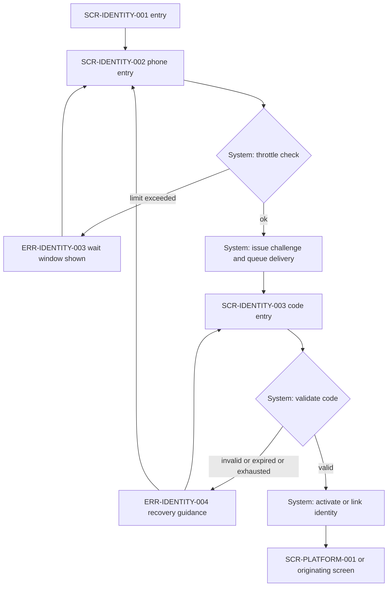
```mermaid
flowchart TD
    A["SCR-IDENTITY-001 entry"] --> B["SCR-IDENTITY-002 phone entry"]
    B --> C{"System: throttle check"}
    C -->|"limit exceeded"| B2["ERR-IDENTITY-003 wait window shown"]
    B2 --> B
    C -->|"ok"| D["System: issue challenge and queue delivery"]
    D --> E["SCR-IDENTITY-003 code entry"]
    E --> F{"System: validate code"}
    F -->|"invalid or expired or exhausted"| G["ERR-IDENTITY-004 recovery guidance"]
    G --> E
    G --> B
    F -->|"valid"| H["System: activate or link identity"]
    H --> I["SCR-PLATFORM-001 or originating screen"]
```

### FLOW-IDENTITY-002 — Create representation grant
**Platform:** Patient (C) · **Serves:** JTBD-IDENTITY-002 · **Frequency:** Rare / blocking
**Actors:** User — Patient as grantor. System — grant creation, audit.
**Trigger:** A patient needs someone else to act for them, or an authorized legal-basis workflow establishes representation.
**Success criterion:** A grant exists naming subject patient, grantee, actions, data scope, purpose, effective period and legal basis, and the grantee can perform exactly those actions.
**Screens:** `SCR-IDENTITY-004` → `SCR-IDENTITY-005` → `SCR-IDENTITY-006` → `SCR-IDENTITY-007`
**Contracts:** API-IDENTITY-004
**Steps:**
1. User opens representation → System returns grants given and held.
2. User specifies subject, grantee, actions, data scope, purpose, effective period and basis → System validates the relationship and basis.
3. System commits with idempotency → returns the grant and its effective status.
**Decision points:** Grantee identity not resolvable → validation failure, not silent creation. Effective period open-ended versus bounded → both permitted; the choice must be explicit rather than defaulted, because an unbounded grant over another person's clinical data is a material decision.
**Failure paths:** `ERR-PLATFORM-001` incomplete scope or invalid period. `ERR-IDENTITY-002` the actor is not an authorized grantor for this subject. `ERR-AUDIT-001` duplicate equivalent grant attempted with a reused key.
**Abandon path:** Leaving before commit creates nothing. No partial grant exists — a half-specified scope would be an authorization hole, so there is no draft state here.
**Re-entry:** Restart at `SCR-IDENTITY-006`. Existing grants remain listed on `SCR-IDENTITY-005`.
**Friction:** 3 screens / 2 actions / 6 required fields
**Notes:** This flow is the **consent** path: an adult patient with capacity grants access themselves. The legal-basis path, for a minor or a patient who cannot consent, is a separate journey with an Admin verification step — see `FLOW-IDENTITY-021`. `PO-UX-14` defined it and closed `Q-IDENTITY-001`. Keeping the two apart matters because the evidence burden and the waiting period differ completely, and a single merged flow would either over-burden the consenting patient or under-verify the dependent case.

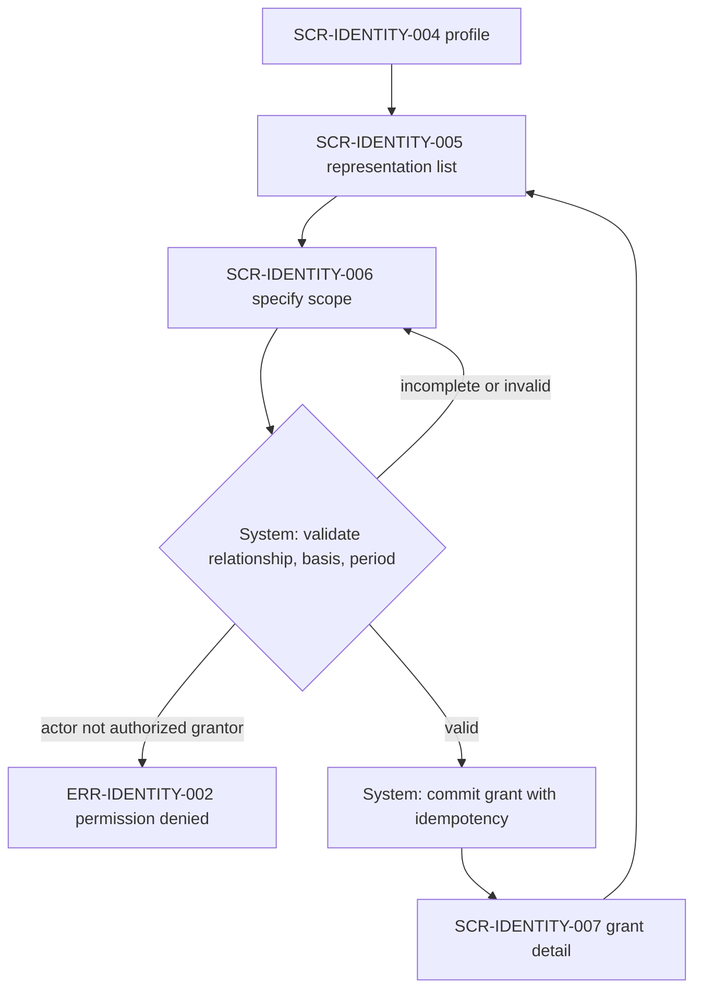
```mermaid
flowchart TD
    A["SCR-IDENTITY-004 profile"] --> B["SCR-IDENTITY-005 representation list"]
    B --> C["SCR-IDENTITY-006 specify scope"]
    C --> D{"System: validate relationship, basis, period"}
    D -->|"incomplete or invalid"| C
    D -->|"actor not authorized grantor"| E["ERR-IDENTITY-002 permission denied"]
    D -->|"valid"| F["System: commit grant with idempotency"]
    F --> G["SCR-IDENTITY-007 grant detail"]
    G --> B
```

### FLOW-IDENTITY-003 — Act as a represented patient
**Platform:** Patient (C) · **Serves:** JTBD-IDENTITY-003 · **Frequency:** Daily+ / blocking
**Actors:** User — Guardian. System — grant re-evaluation on every request.
**Trigger:** A guardian holding one or more active grants needs to act for a specific patient.
**Success criterion:** The guardian performs a permitted action for the intended subject, attributed to the guardian, with both identities continuously evident.
**Screens:** `SCR-IDENTITY-008` → any patient screen the grant permits
**Contracts:** API-IDENTITY-003, plus the contract of the action performed
**Steps:**
1. User selects the subject patient → System returns only subjects with an active grant.
2. Interface applies the context → System grants nothing; display changes only.
3. User performs an action → System re-evaluates the active grant for that exact action and data scope before mutating.
**Decision points:** Grant covers the attempted action → proceed. Does not cover it → the action is unavailable rather than failing after the attempt. Multiple grants held → subject selection is mandatory, never inferred.
**Failure paths:** `ERR-IDENTITY-002` the grant does not cover this action, data scope or purpose. `ERR-IDENTITY-002` again if the grant expired or was revoked between screen load and action — which is the realistic case, since revocation takes effect immediately.
**Abandon path:** Switching subject or leaving changes nothing authoritative. No action is queued against the previous subject, which matters because a queued wrong-subject action would be a clinical error.
**Re-entry:** Active context persists for the session and is re-verified server-side on every request. It is never trusted from local state.
**Friction:** 1 screen / 1 action / 0 required fields — before the underlying task begins
**Notes:** Daily-and-blocking. A wrong-subject action is both a clinical and an authorization failure, so the active subject belongs in persistent chrome rather than only on `SCR-IDENTITY-008`. Masquerading as the patient is denied — the acting identity remains the guardian throughout history.

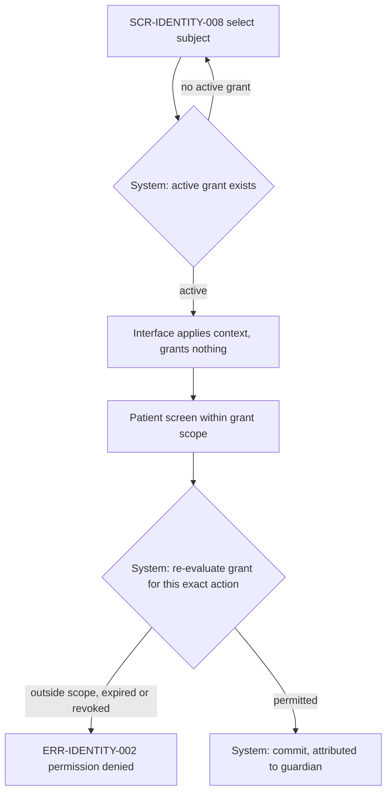
```mermaid
flowchart TD
    A["SCR-IDENTITY-008 select subject"] --> B{"System: active grant exists"}
    B -->|"no active grant"| A
    B -->|"active"| C["Interface applies context, grants nothing"]
    C --> D["Patient screen within grant scope"]
    D --> E{"System: re-evaluate grant for this exact action"}
    E -->|"outside scope, expired or revoked"| F["ERR-IDENTITY-002 permission denied"]
    E -->|"permitted"| G["System: commit, attributed to guardian"]
```

### FLOW-IDENTITY-004 — Revoke representation grant
**Platform:** Patient (C) · **Serves:** JTBD-IDENTITY-002 · **Frequency:** Rare / blocking
**Actors:** User — grantor or an actor authorized by the governing legal-basis workflow. System — immediate authorization effect, audit.
**Trigger:** Representation should end.
**Success criterion:** The grantee's next protected action is denied while every historical action they performed remains attributed to them.
**Screens:** `SCR-IDENTITY-005` → `SCR-IDENTITY-007` → `SCR-IDENTITY-005`
**Contracts:** API-IDENTITY-005
**Steps:**
1. User opens the grant → System returns its exact scope and effective state.
2. User revokes, with a reason where policy requires → System ends authorization immediately and audits it.
3. System retains the historical grant record.
**Decision points:** **Revocation is unconditional.** No booking state, case state or protected transition may block it (`PO-UX-11`). Repeated revocation is safe, with no duplicate effect. Where continuity of care needs follow-up, the system raises an operational work item rather than refusing the patient's request.
**Failure paths:** `ERR-IDENTITY-002` the actor is not authorized to revoke. `ERR-PLATFORM-002` the grant is not addressable. **No booking-domain error is reachable from this screen** — `PO-UX-11` removed `ERR-BOOKING-002` from `API-IDENTITY-005` and closed `CONFLICT-BOOKING-001`. Universal failure paths per section 1.3.
**Abandon path:** Leaving before confirming changes nothing; the grant stays active. Because the consequence is immediate and irreversible, the scope being ended must be visible in the confirmation rather than only the grantee's name.
**Re-entry:** Not applicable — revocation is atomic. A new grant is required to restore access.
**Friction:** 2 screens / 2 actions / 0 to 1 required fields
**Notes:** An already-open grantee session cannot continue mutating. See `FLOW-IDENTITY-019` for the cross-platform view.

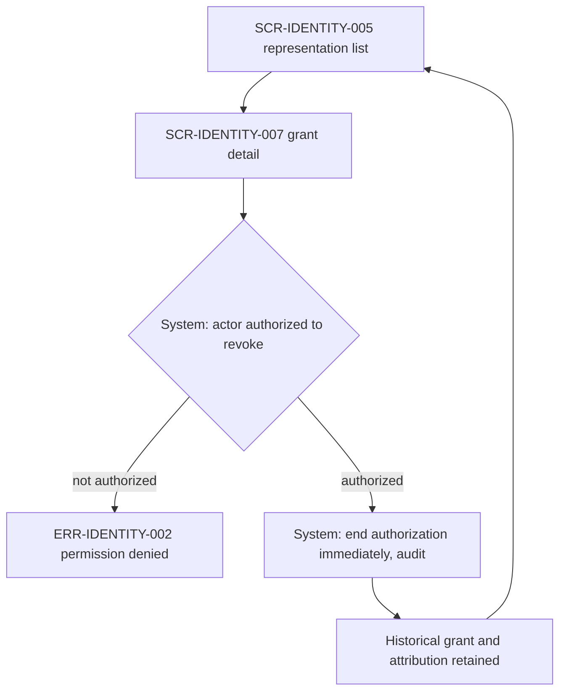
```mermaid
flowchart TD
    A["SCR-IDENTITY-005 representation list"] --> B["SCR-IDENTITY-007 grant detail"]
    B --> C{"System: actor authorized to revoke"}
    C -->|"not authorized"| D["ERR-IDENTITY-002 permission denied"]
    C -->|"authorized"| F["System: end authorization immediately, audit"]
    F --> G["Historical grant and attribution retained"]
    G --> A
```

### FLOW-IDENTITY-005 — Join UberTib and start a provider application
**Platform:** Clinic (A), public · **Serves:** JTBD-IDENTITY-004 · **Frequency:** Rare / blocking
**Actors:** User — prospective provider applicant. System — challenge issue, draft creation.
**Trigger:** A dentist or clinic decides to offer services through UberTib.
**Success criterion:** A verified applicant holds a resumable draft application of the correct provider type.
**Screens:** `SCR-IDENTITY-009` → `SCR-IDENTITY-010` → `SCR-IDENTITY-011` → `SCR-IDENTITY-012`
**Contracts:** SDC-IDENTITY-001
**Steps:**
1. User reads what the application requires → System presents scope, not marketing.
2. User selects individual dentist or clinic / dental centre → System determines which facts and evidence the application will require.
3. User verifies the primary contact → System issues and validates a challenge.
4. System creates the draft → returns the workspace with per-section completeness.
**Decision points:** Provider type determines the entire downstream requirement set, so it is a distinct step rather than a field. Returning applicant → verify contact and resume the existing draft instead of creating a second one.
**Failure paths:** `ERR-IDENTITY-003` contact-verification send throttled. `ERR-IDENTITY-004` code invalid, expired, consumed or attempts exhausted. `ERR-PLATFORM-001` malformed contact.
**Abandon path:** Abandoning before contact verification leaves nothing — no draft exists, because a draft is resumable only by a verified applicant. Abandoning after verification leaves a resumable draft and no submitted record.
**Re-entry:** Return through `SCR-IDENTITY-009`, verify the contact, and resume at `SCR-IDENTITY-012`. This is why verification precedes rather than follows the form.
**Friction:** 4 screens / 4 actions / 2 required fields — before application content begins
**Notes:** Confirmed V1 behavior under `PO-UX-02`. The applicant is a permanent novice, so `SCR-IDENTITY-012` must expose the whole shape of the task rather than hiding it behind a linear wizard.

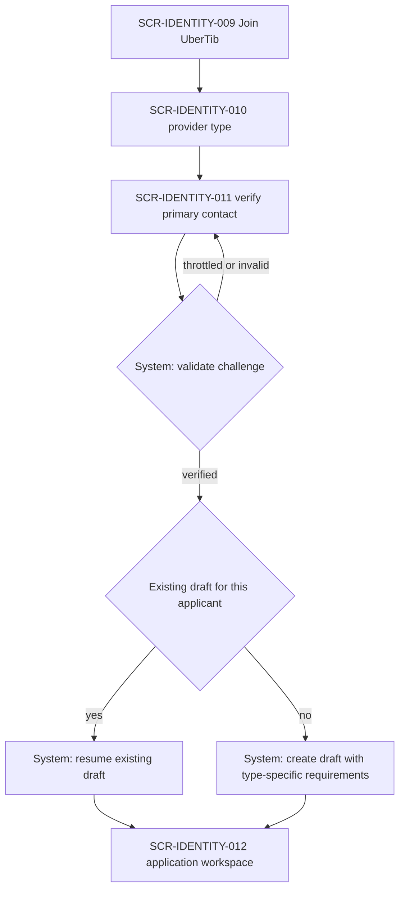
```mermaid
flowchart TD
    A["SCR-IDENTITY-009 Join UberTib"] --> B["SCR-IDENTITY-010 provider type"]
    B --> C["SCR-IDENTITY-011 verify primary contact"]
    C --> D{"System: validate challenge"}
    D -->|"throttled or invalid"| C
    D -->|"verified"| E{"Existing draft for this applicant"}
    E -->|"yes"| F["System: resume existing draft"]
    E -->|"no"| G["System: create draft with type-specific requirements"]
    F --> H["SCR-IDENTITY-012 application workspace"]
    G --> H
```

### FLOW-IDENTITY-006 — Complete, save and resume an application draft
**Platform:** Clinic (A), public · **Serves:** JTBD-IDENTITY-004 · **Frequency:** Rare / blocking
**Actors:** User — verified applicant. System — persistence, per-section validation, evidence intake.
**Trigger:** A verified applicant works through the application, usually across more than one sitting.
**Success criterion:** All required facts, branch details and evidence are present and valid, so submission becomes available.
**Screens:** `SCR-IDENTITY-012` → `SCR-IDENTITY-013`, `SCR-IDENTITY-014`, `SCR-IDENTITY-015` → `SCR-IDENTITY-012`
**Contracts:** SDC-IDENTITY-001
**Steps:**
1. User opens a section → System returns current values and outstanding issues.
2. User enters applicant and provider facts → System validates and saves.
3. User enters primary Aleppo branch identity, address, area and contact → System validates and saves.
4. User attaches required identity, license, registration and authorization evidence → System records each item and its intake state; items remain quarantined until the required scan succeeds.
5. System recomputes completeness → submission becomes available only when every requirement is satisfied.
**Decision points:** Sections are completable in any order, because a permanent novice benefits from seeing the whole task. Required evidence differs by provider type. Quarantined evidence does not satisfy a requirement.
**Failure paths:** `ERR-PLATFORM-001` invalid or missing field values, attributed to the field. Evidence rejected by type, size or count validation — the allowlist is PDF, JPEG and PNG with per-file and per-action limits. Evidence quarantined pending scan is not a failure but must not read as accepted. **Binary transfer failure is bounded by the vendor decision in `Q-OPS-001`**, so the flow defines requirement, per-item status and recovery and stops at the transfer boundary.
**Abandon path:** Everything saved persists as `DRAFT`. Nothing is submitted, no reviewer work exists, and nothing is visible to Admin. This is the deliberate consequence of verifying contact first.
**Re-entry:** `FLOW-IDENTITY-005` resume path returns the applicant to `SCR-IDENTITY-012` with completeness intact.
**Friction:** 4 screens / variable actions / approximately 14 to 20 required fields plus 3 to 6 evidence items depending on provider type
**Notes:** Facts only throughout. No control anywhere selects a scientific grade, `P`, `H`, `I` or service eligibility, and no service-specific eligibility questionnaire appears — that is service activation, a separate post-approval flow.

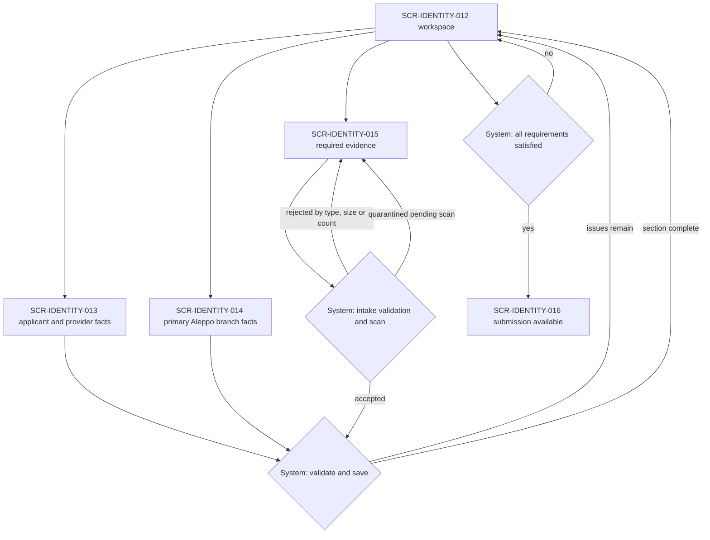
```mermaid
flowchart TD
    A["SCR-IDENTITY-012 workspace"] --> B["SCR-IDENTITY-013 applicant and provider facts"]
    A --> C["SCR-IDENTITY-014 primary Aleppo branch facts"]
    A --> D["SCR-IDENTITY-015 required evidence"]
    B --> E{"System: validate and save"}
    C --> E
    D --> F{"System: intake validation and scan"}
    F -->|"rejected by type, size or count"| D
    F -->|"quarantined pending scan"| D
    F -->|"accepted"| E
    E -->|"issues remain"| A
    E -->|"section complete"| A
    A --> G{"System: all requirements satisfied"}
    G -->|"no"| A
    G -->|"yes"| H["SCR-IDENTITY-016 submission available"]
```

### FLOW-IDENTITY-007 — Submit a provider application
**Platform:** Clinic (A), public · **Serves:** JTBD-IDENTITY-004 · **Frequency:** Rare / blocking
**Actors:** User — verified applicant. System — final validation, state transition, work item creation.
**Trigger:** The applicant believes the application is complete.
**Success criterion:** The application is `SUBMITTED`, editing is closed, and a verification work item exists.
**Screens:** `SCR-IDENTITY-012` → `SCR-IDENTITY-016` → `SCR-IDENTITY-017`
**Contracts:** SDC-IDENTITY-001
**Steps:**
1. User reviews the whole application → System presents every section with its state.
2. User submits → System revalidates completeness, verified contact and evidence state.
3. System transitions to `SUBMITTED`, closes applicant editing, and creates the verification work item.
**Decision points:** Any requirement unsatisfied → submission is unavailable with the outstanding items named, rather than failing on attempt. Withdrawal before decision is permitted where policy allows.
**Failure paths:** `ERR-PLATFORM-001` a requirement became invalid since last save — for example evidence that expired while the draft sat. Evidence still quarantined at submission blocks it, because unscanned evidence cannot satisfy a requirement.
**Abandon path:** Leaving the review screen without submitting keeps the application in `DRAFT` with everything preserved. Nothing reaches Admin.
**Re-entry:** After submission the applicant cannot edit — that must be evident before committing. Re-entry is read-only via `SCR-IDENTITY-017` until a decision or a change request arrives.
**Friction:** 2 screens / 1 action / 0 new required fields
**Notes:** Submission is the point of no return for editing, and a permanent novice will not expect that. The consequence belongs in the confirmation.

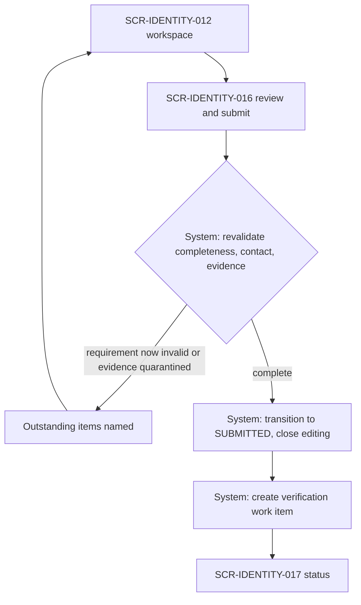
```mermaid
flowchart TD
    A["SCR-IDENTITY-012 workspace"] --> B["SCR-IDENTITY-016 review and submit"]
    B --> C{"System: revalidate completeness, contact, evidence"}
    C -->|"requirement now invalid or evidence quarantined"| D["Outstanding items named"]
    D --> A
    C -->|"complete"| E["System: transition to SUBMITTED, close editing"]
    E --> F["System: create verification work item"]
    F --> G["SCR-IDENTITY-017 status"]
```

### FLOW-IDENTITY-008 — Admin reviews a submitted application
**Platform:** Admin (A) · **Serves:** JTBD-IDENTITY-009 · **Frequency:** Daily+ / blocking
**Actors:** User — verification staff. Human review — the fact and evidence judgement. System — provenance, duplicate detection, audit.
**Trigger:** An application reaches `SUBMITTED` or `RESUBMITTED` and appears in the queue.
**Success criterion:** Every submitted fact and evidence item carries a verification outcome with provenance, and the reviewer has reached approve, request changes, or reject.
**Screens:** `SCR-IDENTITY-027` → `SCR-IDENTITY-028` → `SCR-IDENTITY-029` → `SCR-IDENTITY-028`
**Contracts:** SDC-IDENTITY-002
**Steps:**
1. User opens the queue → System returns applications within the reviewer's assigned scope.
2. User claims or is assigned the item where queue policy requires → System records the assignment.
3. User reviews facts, branch details, applicant relationship evidence, duplicate provider candidates and review history → System surfaces matching provider candidates.
4. User verifies or rejects each fact and evidence item → System records each outcome with provenance.
5. User proceeds to approve, request changes, or reject.
**Decision points:** Duplicate or matching provider candidate found → link rather than create, because approval creates or links the provider organization and the wrong link is hard to undo. Clinical judgement required → route to a licensed clinical reviewer. Corrections needed → `FLOW-IDENTITY-009`. Otherwise approve or reject.
**Failure paths:** `ERR-IDENTITY-002` outside assigned scope or subject-matter competence. `ERR-PLATFORM-002` application not addressable. Evidence not yet scanned cannot be used — the reviewer waits rather than assessing it. Fresh authorization is required for each evidence view and every download is audited.
**Abandon path:** Per-item verification outcomes persist. The application stays in its current state and the work item stays open and assigned. Another reviewer picks it up without redoing verified items — which is why outcomes are per item rather than one overall judgement.
**Re-entry:** Return through `SCR-IDENTITY-027` or the work item. Prior outcomes and their provenance are intact.
**Friction:** 3 screens / variable actions / 0 required fields until a decision
**Notes:** Daily-and-blocking, at depth 2. Resubmitted applications are a different task from first submissions and must be distinguishable in the queue.

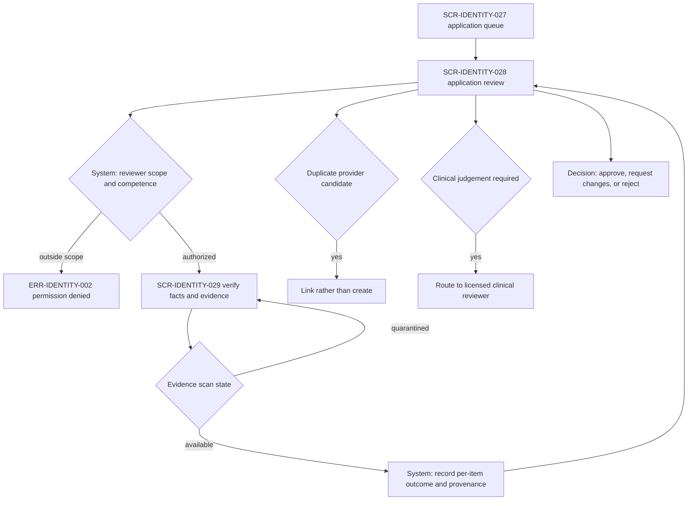
```mermaid
flowchart TD
    A["SCR-IDENTITY-027 application queue"] --> B["SCR-IDENTITY-028 application review"]
    B --> C{"System: reviewer scope and competence"}
    C -->|"outside scope"| D["ERR-IDENTITY-002 permission denied"]
    C -->|"authorized"| E["SCR-IDENTITY-029 verify facts and evidence"]
    E --> F{"Evidence scan state"}
    F -->|"quarantined"| E
    F -->|"available"| G["System: record per-item outcome and provenance"]
    G --> B
    B --> H{"Duplicate provider candidate"}
    H -->|"yes"| I["Link rather than create"]
    B --> J{"Clinical judgement required"}
    J -->|"yes"| K["Route to licensed clinical reviewer"]
    B --> L["Decision: approve, request changes, or reject"]
```

### FLOW-IDENTITY-009 — Admin requests itemised changes
**Platform:** Admin (A) → Clinic (A) · **Serves:** JTBD-IDENTITY-009 · **Frequency:** Daily+ / blocking
**Actors:** User — verification staff. System — state transition, notification intent.
**Trigger:** The reviewer finds specific correctable problems rather than grounds for rejection.
**Success criterion:** The application is `CHANGES_REQUESTED` with only the identified items marked, each carrying a reason, and the applicant has been notified.
**Screens:** `SCR-IDENTITY-028` → `SCR-IDENTITY-030` → `SCR-IDENTITY-027`
**Contracts:** SDC-IDENTITY-002
**Steps:**
1. User marks each item or section needing correction and states the reason → System records the itemised request.
2. User submits the change request → System transitions to `CHANGES_REQUESTED` and creates the applicant notification intent.
3. System keeps the reviewer work item open.
**Decision points:** Itemised versus global request — itemised is required, because a global request forces the applicant to redo the whole form, which is exactly what `PO-UX-02` avoids. Approving while corrections are outstanding is unavailable.
**Failure paths:** `ERR-PLATFORM-001` a change request with no items or a missing reason is rejected — an unexplained correction request is unactionable. `ERR-IDENTITY-002` outside assigned scope.
**Abandon path:** Marked items persist as reviewer working state without being sent. The application stays `SUBMITTED` and the applicant sees nothing, so a half-composed change request never reaches them.
**Re-entry:** Return through the work item; marked items and reasons are intact.
**Friction:** 2 screens / 2 actions / 1 required field per flagged item
**Notes:** The itemisation is what makes `FLOW-IDENTITY-010` cheap for the applicant. Notification delivery failure does not change the state — the applicant sees it on next visit to `SCR-IDENTITY-017`.

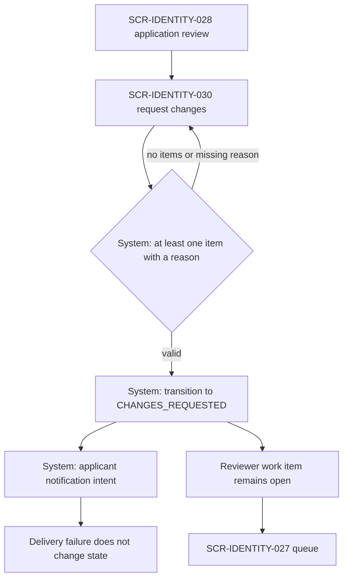
```mermaid
flowchart TD
    A["SCR-IDENTITY-028 application review"] --> B["SCR-IDENTITY-030 request changes"]
    B --> C{"System: at least one item with a reason"}
    C -->|"no items or missing reason"| B
    C -->|"valid"| D["System: transition to CHANGES_REQUESTED"]
    D --> E["System: applicant notification intent"]
    D --> F["Reviewer work item remains open"]
    E --> G["Delivery failure does not change state"]
    F --> H["SCR-IDENTITY-027 queue"]
```

### FLOW-IDENTITY-010 — Applicant corrects and resubmits
**Platform:** Clinic (A), public · **Serves:** JTBD-IDENTITY-005 · **Frequency:** Rare / blocking
**Actors:** User — verified applicant. System — scoped editability, revalidation, state transition.
**Trigger:** The applicant learns that changes were requested.
**Success criterion:** Every flagged item is addressed and the application is `RESUBMITTED` for review.
**Screens:** `SCR-IDENTITY-017` → the flagged sections among `SCR-IDENTITY-013`, `SCR-IDENTITY-014`, `SCR-IDENTITY-015` → `SCR-IDENTITY-017`
**Contracts:** SDC-IDENTITY-001
**Steps:**
1. User opens the status screen → System lists each requested item with its reason.
2. User edits only the flagged items → System permits editing on those items alone; everything else stays visibly locked.
3. User resubmits → System revalidates and transitions to `RESUBMITTED`.
4. System updates the reviewer work item.
**Decision points:** Every flagged item addressed → resubmission becomes available. Any outstanding → unavailable with the remainder named.
**Failure paths:** `ERR-PLATFORM-001` a corrected value is still invalid. Replacement evidence quarantined pending scan blocks resubmission. Attempting to edit an unflagged section is not offered rather than rejected.
**Abandon path:** Corrections persist. The application stays `CHANGES_REQUESTED` and nothing returns to review, so a partial correction never reaches a reviewer.
**Re-entry:** Return through `SCR-IDENTITY-009` and contact verification, then resume at `SCR-IDENTITY-017`.
**Friction:** 2 to 4 screens / variable actions / only the flagged fields
**Notes:** The locked-section behavior is the visible payoff of itemised change requests, and it must be legible — an applicant who cannot tell what is editable will assume the whole form reopened. The loop may repeat; each cycle preserves prior history.

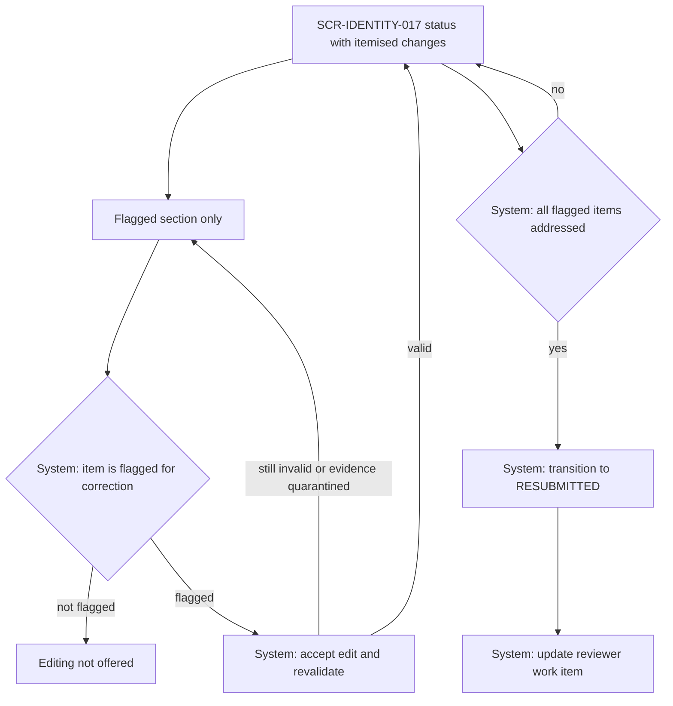
```mermaid
flowchart TD
    A["SCR-IDENTITY-017 status with itemised changes"] --> B["Flagged section only"]
    B --> C{"System: item is flagged for correction"}
    C -->|"not flagged"| D["Editing not offered"]
    C -->|"flagged"| E["System: accept edit and revalidate"]
    E -->|"still invalid or evidence quarantined"| B
    E -->|"valid"| A
    A --> F{"System: all flagged items addressed"}
    F -->|"no"| A
    F -->|"yes"| G["System: transition to RESUBMITTED"]
    G --> H["System: update reviewer work item"]
```

### FLOW-IDENTITY-011 — Admin approves and hands off to the Clinic dashboard
**Platform:** Admin (A) → Clinic (A) · **Serves:** JTBD-IDENTITY-009 · **Frequency:** Rare / blocking
**Actors:** User — verification staff. Human review — the approval decision. System — six atomic effects, audit, notification intent.
**Trigger:** The reviewer is satisfied that every required fact and evidence item is verified.
**Success criterion:** The provider exists with a primary branch and a scoped representative grant, Clinic-panel access works, the onboarding checklist exists, and **no service is active and the provider is not discoverable**.
**Screens:** `SCR-IDENTITY-028` → `SCR-IDENTITY-031` → `SCR-IDENTITY-036`; applicant continues at `SCR-IDENTITY-018` → `SCR-IDENTITY-019` → `SCR-PLATFORM-003` → `SCR-IDENTITY-021`
**Contracts:** SDC-IDENTITY-002, SDC-IDENTITY-004
**Steps:**
1. User approves → System revalidates that every required verification outcome is present.
2. System atomically creates or links the provider and clinic organization; creates or links the applicant identity; creates the primary branch context from approved facts; grants the scoped provider-representative capability; activates Clinic-panel access; creates the onboarding checklist work items.
3. System audits the decision and creates the applicant notification intent.
4. Applicant signs in and lands on the dashboard with the checklist prominent.
**Decision points:** Provider organization matched a duplicate candidate → link rather than create. Any required verification outcome missing → approval is unavailable, not merely warned against.
**Failure paths:** `ERR-IDENTITY-002` outside assigned scope. `ERR-PLATFORM-001` outstanding corrections or missing verification outcomes. Partial approval must be impossible — the six effects are atomic, so a failure mid-way leaves the application still awaiting decision rather than a provider with no branch or access.
**Abandon path:** Leaving the approval confirmation without committing changes nothing; the application stays under review. Because approval is irreversible and creates real access, the confirmation must state both what it grants and what it does not.
**Re-entry:** Not applicable to the approval itself. The applicant's post-approval journey resumes at `SCR-IDENTITY-021` whenever they return.
**Friction:** Admin 2 screens / 1 action / 0 required fields · Applicant 3 screens / 2 actions
**Notes:** **The approval boundary is the most important content in this flow.** Approval does not activate a dental service, assign a scientific grade, set `P`, `H` or `I`, publish the provider, or make it production-ready. Both `SCR-IDENTITY-031` and `SCR-IDENTITY-018` must state that, because both actors will otherwise assume approval means bookable. Service activation and eligibility are `FLOW-ELIG-007` and `FLOW-ELIG-010`.

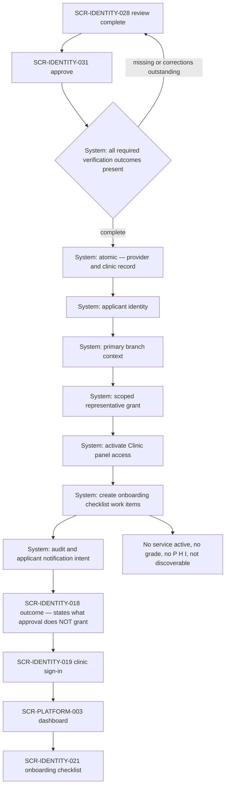
```mermaid
flowchart TD
    A["SCR-IDENTITY-028 review complete"] --> B["SCR-IDENTITY-031 approve"]
    B --> C{"System: all required verification outcomes present"}
    C -->|"missing or corrections outstanding"| A
    C -->|"complete"| D["System: atomic — provider and clinic record"]
    D --> E["System: applicant identity"]
    E --> F["System: primary branch context"]
    F --> G["System: scoped representative grant"]
    G --> H["System: activate Clinic panel access"]
    H --> I["System: create onboarding checklist work items"]
    I --> J["System: audit and applicant notification intent"]
    J --> K["SCR-IDENTITY-018 outcome — states what approval does NOT grant"]
    K --> L["SCR-IDENTITY-019 clinic sign-in"]
    L --> M["SCR-PLATFORM-003 dashboard"]
    M --> N["SCR-IDENTITY-021 onboarding checklist"]
    I --> O["No service active, no grade, no P H I, not discoverable"]
```

### FLOW-IDENTITY-012 — Admin rejects an application
**Platform:** Admin (A) → Clinic (A) · **Serves:** JTBD-IDENTITY-009 · **Frequency:** Rare / blocking
**Actors:** User — verification staff. Human review — the rejection decision. System — state transition, audit, notification intent.
**Trigger:** The reviewer concludes the application cannot be approved and correction would not resolve it.
**Success criterion:** The application is `REJECTED` with a reason the applicant can read, and a later new application remains possible unless a compliance restriction exists.
**Screens:** `SCR-IDENTITY-028` → `SCR-IDENTITY-032` → `SCR-IDENTITY-027`; applicant sees `SCR-IDENTITY-018`
**Contracts:** SDC-IDENTITY-002
**Steps:**
1. User rejects with a required reason → System validates that a reason is present.
2. System transitions to `REJECTED`, audits the decision, and creates the applicant notification intent.
3. System closes the reviewer work item.
**Decision points:** Correctable problem → `FLOW-IDENTITY-009` instead. Compliance restriction bars reapplication → that must be recorded, since it changes what the applicant is told.
**Failure paths:** `ERR-PLATFORM-001` no reason supplied. `ERR-IDENTITY-002` outside assigned scope.
**Abandon path:** Leaving without committing keeps the application under review.
**Re-entry:** The rejected application is immutable. The applicant may start a new one via `FLOW-IDENTITY-005` unless restricted.
**Friction:** 2 screens / 1 action / 1 required field
**Notes:** Rejection closes this application, not the relationship. `SCR-IDENTITY-018` must distinguish those two things clearly.

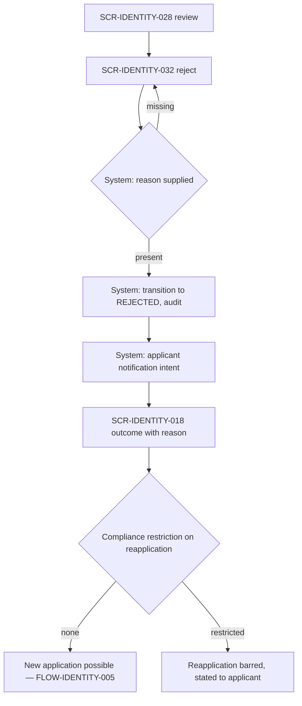
```mermaid
flowchart TD
    A["SCR-IDENTITY-028 review"] --> B["SCR-IDENTITY-032 reject"]
    B --> C{"System: reason supplied"}
    C -->|"missing"| B
    C -->|"present"| D["System: transition to REJECTED, audit"]
    D --> E["System: applicant notification intent"]
    E --> F["SCR-IDENTITY-018 outcome with reason"]
    F --> G{"Compliance restriction on reapplication"}
    G -->|"none"| H["New application possible — FLOW-IDENTITY-005"]
    G -->|"restricted"| I["Reapplication barred, stated to applicant"]
```

### FLOW-IDENTITY-013 — Work the post-approval onboarding checklist
**Platform:** Clinic (A) · **Serves:** JTBD-IDENTITY-004, JTBD-ELIG-004 · **Frequency:** Rare / blocking
**Actors:** User — clinic / provider representative. System — checklist derivation from work items.
**Trigger:** A newly approved provider signs in for the first time.
**Success criterion:** The representative understands and completes what remains before patients can book — branch facts, staff access, service activation, prices, evidence, availability.
**Screens:** `SCR-PLATFORM-003` → `SCR-IDENTITY-021` → `SCR-ELIG-006`, `SCR-IDENTITY-023`, `SCR-ELIG-007`, `SCR-BOOKING-007`
**Contracts:** SDC-IDENTITY-004, SDC-OPS-001
**Steps:**
1. User opens the checklist → System returns items derived from the work items approval created.
2. User completes branch facts, invites staff, submits service activation, records prices, supplies evidence, configures availability → each routes into its own flow.
3. System updates item state as underlying conditions resolve.
**Decision points:** Which items apply depends on provider type and on how many branches and services the provider intends. Order is the user's choice; only eligibility has genuine prerequisites.
**Failure paths:** Each item's failures belong to its own flow. `ERR-IDENTITY-002` where the representative lacks the capability for an item — for example inviting staff without delegation authority.
**Abandon path:** Progress persists as work item state. The provider remains approved and non-bookable indefinitely, which is a legitimate resting state rather than an error.
**Re-entry:** The checklist stays prominent on `SCR-PLATFORM-003` until complete.
**Friction:** 2 screens / variable actions / 0 required fields at the checklist level
**Notes:** **Completing the checklist does not guarantee eligibility.** Eligibility is computed from verified facts and effective policy, so the screen must not read as a progress bar toward being bookable.

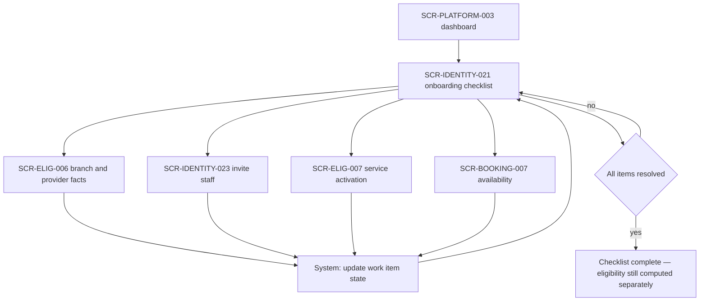
```mermaid
flowchart TD
    A["SCR-PLATFORM-003 dashboard"] --> B["SCR-IDENTITY-021 onboarding checklist"]
    B --> C["SCR-ELIG-006 branch and provider facts"]
    B --> D["SCR-IDENTITY-023 invite staff"]
    B --> E["SCR-ELIG-007 service activation"]
    B --> F["SCR-BOOKING-007 availability"]
    C --> G["System: update work item state"]
    D --> G
    E --> G
    F --> G
    G --> B
    B --> H{"All items resolved"}
    H -->|"no"| B
    H -->|"yes"| I["Checklist complete — eligibility still computed separately"]
```

### FLOW-IDENTITY-014 — Invite a clinic staff member with a scoped grant
**Platform:** Clinic (A) · **Serves:** JTBD-IDENTITY-006 · **Frequency:** Rare / important
**Actors:** User — clinic owner or provider representative with delegation authority. System — delegation-limit enforcement, notification intent.
**Trigger:** The clinic needs another person working in UberTib.
**Success criterion:** A pending invitation exists naming provider, branches, capability and effective period, all within what the inviter may delegate.
**Screens:** `SCR-IDENTITY-022` → `SCR-IDENTITY-023` → `SCR-IDENTITY-024`
**Contracts:** SDC-IDENTITY-003
**Steps:**
1. User opens people and grants → System returns active grants and outstanding invitations.
2. User specifies the invited identity or contact, provider, allowed branches, capability and any effective period → System offers only capabilities and branches the inviter is authorized to delegate.
3. System creates the invitation and the invitee notification intent.
**Decision points:** The inviter's own scope bounds what can be offered — that is a constraint on what the screen presents, not a validation on submit. Inviting as a treating dentist does not confer clinical authoring authority.
**Failure paths:** `ERR-IDENTITY-002` the inviter lacks delegation authority for a requested capability or branch. `ERR-PLATFORM-001` incomplete scope. `ERR-AUDIT-001` duplicate invitation with a reused key.
**Abandon path:** Leaving before commit creates nothing. There is no partial invitation, because a half-specified scope would be an authorization hole.
**Re-entry:** Restart at `SCR-IDENTITY-023`. Existing invitations remain on `SCR-IDENTITY-022`.
**Friction:** 3 screens / 2 actions / 4 required fields
**Notes:** Staff never self-attach by searching for a clinic. The dentist caveat must be visible at invitation time so the representative is not misled about what they granted.

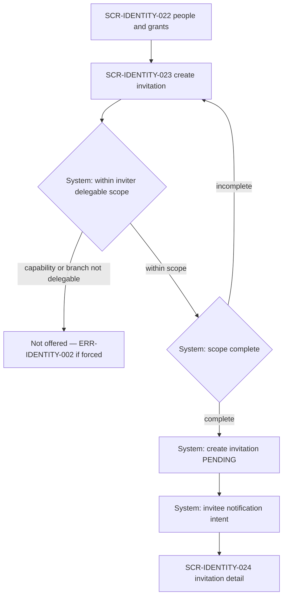
```mermaid
flowchart TD
    A["SCR-IDENTITY-022 people and grants"] --> B["SCR-IDENTITY-023 create invitation"]
    B --> C{"System: within inviter delegable scope"}
    C -->|"capability or branch not delegable"| D["Not offered — ERR-IDENTITY-002 if forced"]
    C -->|"within scope"| E{"System: scope complete"}
    E -->|"incomplete"| B
    E -->|"complete"| F["System: create invitation PENDING"]
    F --> G["System: invitee notification intent"]
    G --> H["SCR-IDENTITY-024 invitation detail"]
```

### FLOW-IDENTITY-015 — Staff member accepts an invitation
**Platform:** Clinic (A) · **Serves:** JTBD-IDENTITY-007 · **Frequency:** Rare / blocking
**Actors:** User — invited staff member. System — identity verification, grant creation.
**Trigger:** The invitee opens the invitation.
**Success criterion:** Identity verified, invitation accepted, an explicit scoped grant created, and Clinic access limited to exactly that scope.
**Screens:** `SCR-IDENTITY-025` → `SCR-IDENTITY-019` → `SCR-PLATFORM-003`
**Contracts:** SDC-IDENTITY-003
**Steps:**
1. User opens the invitation → System presents the exact scope being offered and its validity.
2. User verifies identity and contact → System validates the challenge.
3. User accepts → System creates the explicit scoped grant.
4. User signs in and lands on the dashboard filtered to that grant.
**Decision points:** Invitation expired or revoked → acceptance is unavailable and a new invitation is required. Scope shown before acceptance, because acceptance creates the grant.
**Failure paths:** Expired or revoked invitation grants nothing and states that a new one is needed. `ERR-IDENTITY-003` and `ERR-IDENTITY-004` on contact verification. `ERR-IDENTITY-002` if the grant no longer resolves at sign-in — for example the inviter's own scope was revoked meanwhile.
**Abandon path:** The invitation stays `PENDING` until its window passes. Nothing is granted. Verification progress is not preserved across abandonment.
**Re-entry:** Reopen the invitation link while the window holds. After expiry, only a new invitation works.
**Friction:** 3 screens / 3 actions / 2 required fields
**Notes:** Reached by invitation only, never from panel navigation. Acceptance grants exactly the stated scope; access is deny-by-default outside it. Being invited as a treating dentist still requires professional verification and a case relationship before clinical authoring.

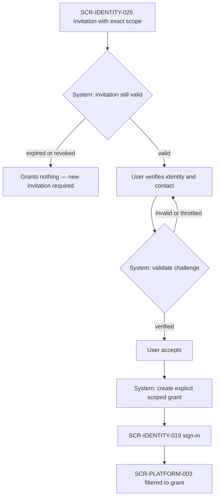
```mermaid
flowchart TD
    A["SCR-IDENTITY-025 invitation with exact scope"] --> B{"System: invitation still valid"}
    B -->|"expired or revoked"| C["Grants nothing — new invitation required"]
    B -->|"valid"| D["User verifies identity and contact"]
    D --> E{"System: validate challenge"}
    E -->|"invalid or throttled"| D
    E -->|"verified"| F["User accepts"]
    F --> G["System: create explicit scoped grant"]
    G --> H["SCR-IDENTITY-019 sign-in"]
    H --> I["SCR-PLATFORM-003 filtered to grant"]
```

### FLOW-IDENTITY-016 — Revoke a clinic staff grant
**Platform:** Clinic (A) · **Serves:** JTBD-IDENTITY-008 · **Frequency:** Rare / blocking
**Actors:** User — clinic owner or provider representative with delegation authority. System — immediate authorization effect, audit.
**Trigger:** A staff member leaves or changes role.
**Success criterion:** Their next protected read or action is denied, including from a page already open, while all historical attribution is preserved.
**Screens:** `SCR-IDENTITY-022` → `SCR-IDENTITY-026` → `SCR-IDENTITY-022`
**Contracts:** SDC-IDENTITY-003
**Steps:**
1. User opens the grant → System returns its exact scope and effective period.
2. User revokes → System ends authorization immediately and audits it.
3. System retains the historical grant and every action attributed to that person.
**Decision points:** Revoke the whole grant or replace it with a narrower one — replacement is a new invitation, not an edit, because a grant's scope is what was accepted.
**Failure paths:** `ERR-IDENTITY-002` the actor lacks delegation authority over this grant. `ERR-PLATFORM-002` grant not addressable.
**Abandon path:** Leaving before confirming keeps the grant active. Since this is urgent when it happens, the action must be reachable without hunting.
**Re-entry:** Not applicable — revocation is atomic. Restoring access needs a new invitation via `FLOW-IDENTITY-014`.
**Friction:** 2 screens / 2 actions / 0 required fields
**Notes:** An open Clinic page cannot continue mutating after revocation. See `FLOW-IDENTITY-019`.

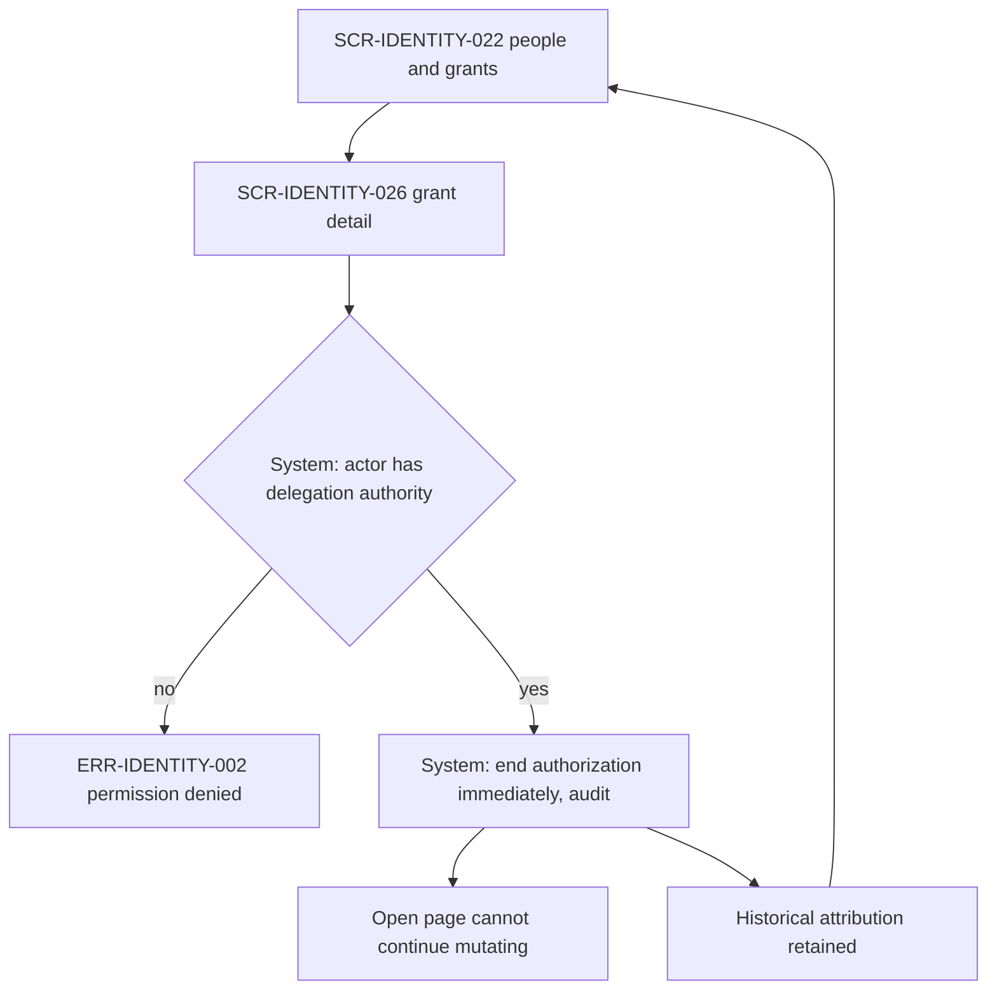
```mermaid
flowchart TD
    A["SCR-IDENTITY-022 people and grants"] --> B["SCR-IDENTITY-026 grant detail"]
    B --> C{"System: actor has delegation authority"}
    C -->|"no"| D["ERR-IDENTITY-002 permission denied"]
    C -->|"yes"| E["System: end authorization immediately, audit"]
    E --> F["Open page cannot continue mutating"]
    E --> G["Historical attribution retained"]
    G --> A
```

### FLOW-IDENTITY-017 — Administer a staff scope grant
**Platform:** Admin (A) · **Serves:** JTBD-IDENTITY-010 · **Frequency:** Weekly / blocking
**Actors:** User — system administrator or authorized access administrator. System — grant persistence, audit.
**Trigger:** Staff need access, or their scope must change.
**Success criterion:** Each grant states organization, branch, capability, subject scope, purpose and effective period, and the change is audited.
**Screens:** `SCR-PLATFORM-004` → `SCR-IDENTITY-033` → `SCR-IDENTITY-034` → `SCR-IDENTITY-033`
**Contracts:** SDC-IDENTITY-004
**Steps:**
1. User opens staff accounts → System returns accounts and coarse capabilities within administrative scope.
2. User creates or changes a scoped grant, stating every dimension explicitly → System validates and records it.
3. System audits the change.
**Decision points:** Coarse role versus scoped grant — assigning a role grants no business data access on its own, and the interface must not imply otherwise. Effective period bounded or open — an explicit choice.
**Failure paths:** `ERR-PLATFORM-001` incomplete scope dimensions. `ERR-IDENTITY-002` the administrator attempts to self-grant a scope that would bypass a policy requiring another accountable reviewer.
**Abandon path:** Leaving before commit changes nothing. No partial grant exists.
**Re-entry:** Restart at `SCR-IDENTITY-034`.
**Friction:** 3 screens / 2 actions / 6 required fields
**Notes:** An over-broad grant is a direct authorization breach across every interface, so the scope being granted must be legible before committing. No `super_admin` bypass exists.

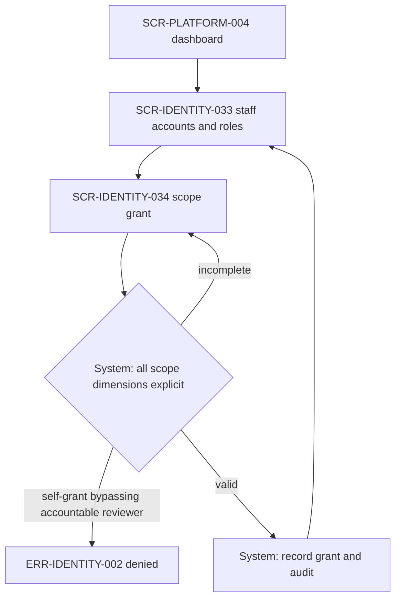
```mermaid
flowchart TD
    A["SCR-PLATFORM-004 dashboard"] --> B["SCR-IDENTITY-033 staff accounts and roles"]
    B --> C["SCR-IDENTITY-034 scope grant"]
    C --> D{"System: all scope dimensions explicit"}
    D -->|"incomplete"| C
    D -->|"self-grant bypassing accountable reviewer"| E["ERR-IDENTITY-002 denied"]
    D -->|"valid"| F["System: record grant and audit"]
    F --> B
```

### FLOW-IDENTITY-018 — Privileged staff authentication
**Platform:** Admin (A) and Clinic (A) · **Serves:** JTBD-IDENTITY-010, JTBD-IDENTITY-011 · **Frequency:** Daily+ / blocking
**Actors:** User — staff identity. System — factor enforcement, grant resolution.
**Trigger:** A staff member opens the Admin or Clinic panel.
**Success criterion:** The user is authenticated with the factors their role requires and lands on a panel filtered to their active grants.
**Screens:** `SCR-PLATFORM-005` or `SCR-IDENTITY-019` → `SCR-PLATFORM-004` or `SCR-PLATFORM-003`
**Contracts:** SDC-IDENTITY-004
**Steps:**
1. User authenticates → System validates credentials.
2. System evaluates whether the role requires a second factor → privileged production roles require a non-SMS factor.
3. System resolves active grants → panel navigation and content are filtered accordingly.
**Decision points:** Privileged role → second factor required, and an SMS-only factor is denied. No active grant → denied rather than shown an empty panel, because an empty panel reads as a system fault.
**Failure paths:** `ERR-IDENTITY-001` authentication failure. `ERR-IDENTITY-002` no active grant, or an SMS-only factor on a role requiring otherwise. `ERR-PLATFORM-003` on repeated attempts.
**Abandon path:** Leaving before completing authentication grants nothing. No partial session exists.
**Re-entry:** Restart authentication. Session expiry mid-work returns here and then to the originating screen where safe.
**Friction:** 1 to 2 screens / 2 to 3 actions / 2 to 3 required fields
**Notes:** Concrete second-factor vendor unresolved (`Q-OPS-001`); the flow is provider-neutral. A stale session cannot survive a grant revocation.

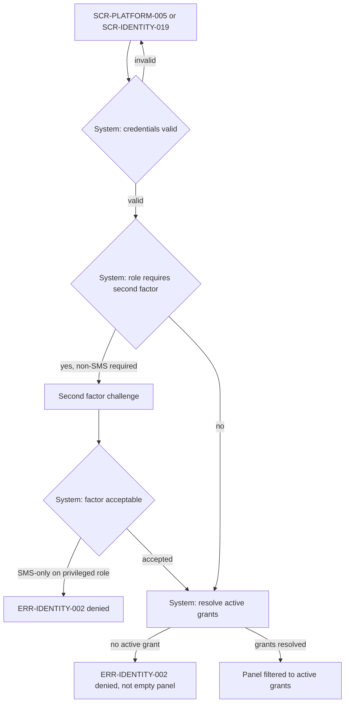
```mermaid
flowchart TD
    A["SCR-PLATFORM-005 or SCR-IDENTITY-019"] --> B{"System: credentials valid"}
    B -->|"invalid"| A
    B -->|"valid"| C{"System: role requires second factor"}
    C -->|"yes, non-SMS required"| D["Second factor challenge"]
    D --> E{"System: factor acceptable"}
    E -->|"SMS-only on privileged role"| F["ERR-IDENTITY-002 denied"]
    E -->|"accepted"| G["System: resolve active grants"]
    C -->|"no"| G
    G -->|"no active grant"| H["ERR-IDENTITY-002 denied, not empty panel"]
    G -->|"grants resolved"| I["Panel filtered to active grants"]
```

### FLOW-IDENTITY-019 — Cross-platform access revocation lifecycle
**Platform:** Cross-platform · **Serves:** JTBD-IDENTITY-008, JTBD-IDENTITY-002 · **Frequency:** Rare / blocking
**Actors:** User — grantor, clinic representative or access administrator. System — immediate authorization effect on every adapter, audit.
**Trigger:** A guardian grant or a staff scope grant is revoked or expires.
**Success criterion:** Every adapter denies the next protected action by that identity, no committed business state changes merely because access ended, and all historical attribution is preserved.
**Screens:** `SCR-IDENTITY-007` or `SCR-IDENTITY-026` or `SCR-IDENTITY-034` → effects observed on `SCR-PLATFORM-001`, `SCR-PLATFORM-003`, `SCR-IDENTITY-035`
**Contracts:** API-IDENTITY-005, SDC-IDENTITY-003, SDC-IDENTITY-004
**Steps:**
1. User revokes, or the effective period lapses → System ends authorization immediately.
2. System records the revocation or expiry as an audited event.
3. Patient app: a guardian's next request for that subject is denied; the subject's own access is unaffected.
4. Clinic panel: the staff member's next protected read or action is denied, including from an already-open page.
5. Admin panel: the revocation and its provenance are visible; no domain record changed.
**Decision points:** Guardian grant versus staff grant — different surfaces, identical immediacy. Expiry versus explicit revocation — both take effect immediately; only the audit reason differs.
**Failure paths:** `ERR-IDENTITY-002` on every subsequent protected action by the revoked identity. A notification-delivery failure to the affected person does not delay or soften the revocation — access has already ended.
**Abandon path:** Not applicable once committed. Before committing, no partial revocation exists.
**Re-entry:** A new grant or invitation is required. The revoked grant is never revived.
**Friction:** 2 screens / 2 actions on the revoking side
**Notes:** This is the clearest case of the rule that a stale open page is not an authorization context. Nothing the revoked identity previously did is deleted or reattributed.

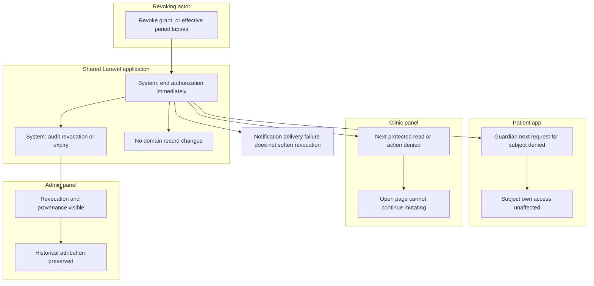
```mermaid
flowchart TD
    subgraph ACT["Revoking actor"]
        A["Revoke grant, or effective period lapses"]
    end
    subgraph CORE["Shared Laravel application"]
        B["System: end authorization immediately"]
        C["System: audit revocation or expiry"]
        D["No domain record changes"]
    end
    subgraph P["Patient app"]
        E["Guardian next request for subject denied"]
        F["Subject own access unaffected"]
    end
    subgraph C2["Clinic panel"]
        G["Next protected read or action denied"]
        H["Open page cannot continue mutating"]
    end
    subgraph AD["Admin panel"]
        I["Revocation and provenance visible"]
        J["Historical attribution preserved"]
    end
    A --> B
    B --> C
    B --> D
    B --> E
    B --> G
    C --> I
    E --> F
    G --> H
    I --> J
    B --> K["Notification delivery failure does not soften revocation"]
```

### FLOW-IDENTITY-020 — Cross-platform clinic onboarding lifecycle
**Platform:** Cross-platform · **Serves:** JTBD-IDENTITY-004, JTBD-IDENTITY-005, JTBD-IDENTITY-009 · **Frequency:** Rare / blocking
**Actors:** User — applicant, verification staff. Human review — fact and evidence verification, and the approval or rejection decision. System — validation, six atomic approval effects, work items, notification intents.
**Trigger:** A dentist or clinic applies to join UberTib.
**Success criterion:** An approved provider exists with a primary branch, a scoped representative grant, working Clinic access and an onboarding checklist — and is explicitly not yet activated, classified, published or production-ready.
**Screens:** `SCR-IDENTITY-009` through `SCR-IDENTITY-018` on the applicant side; `SCR-IDENTITY-027` through `SCR-IDENTITY-032` and `SCR-IDENTITY-036` on the Admin side; `SCR-PLATFORM-003` and `SCR-IDENTITY-021` after handoff
**Contracts:** SDC-IDENTITY-001, SDC-IDENTITY-002, SDC-IDENTITY-004
**Steps:**
1. Applicant applies and verifies contact → System creates a resumable draft.
2. Applicant supplies facts, primary branch and evidence → System validates and holds evidence quarantined until scanned.
3. Applicant submits → System transitions to `SUBMITTED` and creates the verification work item.
4. Verification staff review; human review verifies each fact and evidence item → System records outcomes with provenance.
5. Reviewer requests changes → applicant corrects only flagged items and resubmits; the loop may repeat.
6. Human review approves or rejects → System performs the six atomic approval effects, or records the rejection with its reason.
7. System notifies the applicant and creates the onboarding checklist work items.
8. Applicant signs in to the Clinic panel and works the checklist.
**Decision points:** Approve, request changes, or reject at step 6. Duplicate provider candidate → link rather than create. Clinical judgement required → licensed clinical reviewer. Rejection → new application possible unless restricted.
**Failure paths:** Every constituent flow's failures apply. Two matter at lifecycle level: the six approval effects are atomic, so a partial approval cannot leave a provider without a branch or without access; and a notification-delivery failure never changes the application state — the applicant sees the outcome on `SCR-IDENTITY-017` or `SCR-IDENTITY-018` regardless.
**Abandon path:** Abandonment at any pre-submission point leaves a resumable draft and no Admin-visible record. Abandonment after submission leaves the application in the reviewer queue; the applicant may withdraw where policy allows.
**Re-entry:** Applicant re-enters through `SCR-IDENTITY-009` and contact verification at every stage. Reviewer re-enters through the queue or the work item with per-item outcomes intact.
**Friction:** Applicant approximately 9 screens across the full lifecycle · Admin 4 to 5 screens per review cycle
**Notes:** **The approval boundary is the lifecycle's defining constraint.** Approval creates the provider, identity, branch, grant, access and checklist. It does not activate a service, assign A, B, C, D or F, set `P`, `H` or `I`, publish the provider, or make it production-ready. Service activation, pricing, evidence and eligibility are separate downstream flows — `FLOW-ELIG-006` through `FLOW-ELIG-010`.

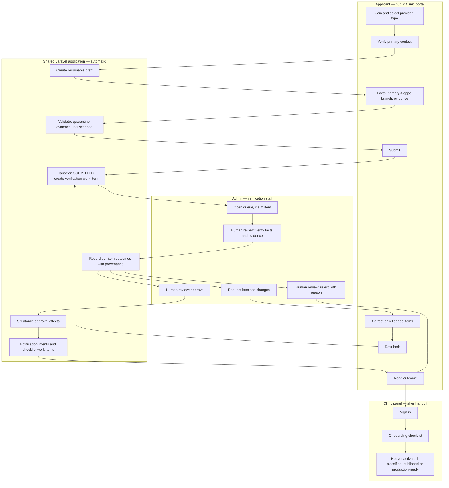
```mermaid
flowchart TD
    subgraph APP["Applicant — public Clinic portal"]
        A1["Join and select provider type"]
        A2["Verify primary contact"]
        A3["Facts, primary Aleppo branch, evidence"]
        A4["Submit"]
        A5["Correct only flagged items"]
        A6["Resubmit"]
        A7["Read outcome"]
    end
    subgraph SYS["Shared Laravel application — automatic"]
        S1["Create resumable draft"]
        S2["Validate, quarantine evidence until scanned"]
        S3["Transition SUBMITTED, create verification work item"]
        S4["Record per-item outcomes with provenance"]
        S5["Six atomic approval effects"]
        S6["Notification intents and checklist work items"]
    end
    subgraph ADM["Admin — verification staff"]
        D1["Open queue, claim item"]
        D2["Human review: verify facts and evidence"]
        D3["Request itemised changes"]
        D4["Human review: approve"]
        D5["Human review: reject with reason"]
    end
    subgraph CLIN["Clinic panel — after handoff"]
        C1["Sign in"]
        C2["Onboarding checklist"]
        C3["Not yet activated, classified, published or production-ready"]
    end
    A1 --> A2
    A2 --> S1
    S1 --> A3
    A3 --> S2
    S2 --> A4
    A4 --> S3
    S3 --> D1
    D1 --> D2
    D2 --> S4
    S4 --> D3
    S4 --> D4
    S4 --> D5
    D3 --> A5
    A5 --> A6
    A6 --> S3
    D4 --> S5
    S5 --> S6
    S6 --> A7
    D5 --> A7
    A7 --> C1
    C1 --> C2
    C2 --> C3
```

### FLOW-IDENTITY-021 — Establish representation on a legal basis
**Platform:** Patient (C) → Admin (A) · **Serves:** JTBD-IDENTITY-012 · **Frequency:** Rare / blocking
**Actors:** User — guardian applicant. Human review — verification staff or authorized admin. System — request creation, work item, grant creation on approval.
**Trigger:** A guardian needs access to a dependent's care where the subject patient cannot legally or self-consensually grant it — typically a minor.
**Success criterion:** The guardian gains exactly the approved scope, and only after a human verified the relationship and legal basis. Submission alone grants nothing.
**Screens:** `SCR-IDENTITY-037` → `SCR-IDENTITY-038` and `SCR-OPS-001` on the Admin side → `SCR-IDENTITY-005`
**Contracts:** API-IDENTITY-006, SDC-IDENTITY-005, SDC-OPS-001, API-PLATFORM-002
**Steps:**
1. User starts an Add Dependent request on `SCR-IDENTITY-037` from their own authenticated profile.
2. User identifies the subject patient or dependent.
3. User declares the relationship and the legal basis.
4. User supplies the required identity and legal evidence.
5. User submits. System creates a **request under verification, not a grant**, plus a verification work item.
6. Human review opens the request on `SCR-IDENTITY-038`, assesses the evidence, and accepts, requests changes with itemised reasons, or rejects with a required reason.
7. On approval System creates the `LEGAL_BASIS` grant recording patient, grantee, actions, data scope, purpose, effective period, evidence and the approving reviewer.
8. User sees the dependent appear in `SCR-IDENTITY-005` with the approved scope.
**Decision points:** **The guardian cannot self-authorize.** Nothing on `SCR-IDENTITY-037` may read as granting access, and the submitted state must say plainly that a human decision is pending. Changes requested returns only the named items for correction, not the whole submission.
**Failure paths:** `ERR-PLATFORM-001` incomplete declaration. `ERR-PLATFORM-005` rejected evidence file with a safe actionable reason. `ERR-IDENTITY-002` acting on the dependent before approval. Rejection closes the request with a stated reason and does not silently permit a retry loop without new facts. Universal failure paths per section 1.3.
**Abandon path:** A draft request is resumable by the same authenticated applicant. Abandoning after submission leaves the request in the verification queue; the applicant is never left believing they have access they do not have.
**Re-entry:** `SCR-IDENTITY-037` shows the current request state; the notification entry links back to it.
**Friction:** Patient 3 to 4 screens · Admin 2 screens
**Notes:** This is the second of the two representation paths. `FLOW-IDENTITY-004` remains the consent path an adult patient drives themselves. The distinction must be visible in the interface, because the evidence burden and the waiting period differ entirely. Historical guardian actions stay attributed to the guardian even after the grant ends. Resolved by `PO-UX-14`.

```mermaid
flowchart TD
    A["SCR-IDENTITY-005 own profile"] --> B["User: start Add Dependent request"]
    B --> C["SCR-IDENTITY-037 identify subject patient"]
    C --> D["User: declare relationship and legal basis"]
    D --> E["User: supply identity and legal evidence"]
    E --> F{"Evidence accepted by validation"}
    F -->|"no"| G["ERR-PLATFORM-005 safe actionable reason, correct the file"]
    G --> E
    F -->|"yes"| H["User: submit"]
    H --> I["System: REQUEST created under verification, no grant"]
    I --> J["System: verification work item"]
    J --> K["SCR-IDENTITY-038 human review assesses evidence"]
    K --> L{"Human decision"}
    L -->|"request changes"| M["Named items returned for correction"]
    M --> E
    L -->|"reject with reason"| N["Request closed, no access granted"]
    L -->|"approve"| O["System: LEGAL_BASIS grant with explicit scope, evidence and reviewer"]
    O --> P["SCR-IDENTITY-005 dependent visible within approved scope"]
```

## 3. CATALOG Flows

### FLOW-CATALOG-001 — Patient service discovery
**Platform:** Patient (C) · **Serves:** JTBD-CATALOG-001 · **Frequency:** Weekly / convenience
**Actors:** User — public visitor or patient. System — audience filtering.
**Trigger:** The patient has a dental problem and does not yet know what service they need.
**Success criterion:** The patient can name the service they want in plain Arabic, without knowing any internal classification symbol.
**Screens:** `SCR-CATALOG-001` → `SCR-CATALOG-002` → `SCR-ELIG-001`
**Contracts:** API-CATALOG-001
**Steps:**
1. User opens the catalog → System returns production-visible groups and service families for the configured audience.
2. User opens a family → System returns its non-diagnostic practical purpose.
3. User proceeds to search → System carries `service_code` forward, which `API-ELIG-001` requires.
**Decision points:** Production mode with no publishable service → an honest unavailable state, not an empty list. Groups with no visible services are omitted rather than rendered empty.
**Failure paths:** `ERR-PLATFORM-003` rate limited — action-level message with the retry window, cached content preserved where a documented cache policy allows. `ERR-PLATFORM-004` server failure — retry affordance, no server detail exposed. A malformed or partial response fails safely as unavailable rather than enabling actions from incomplete data.
**Abandon path:** Nothing to lose — the whole flow is read-only and creates no state.
**Re-entry:** Any point, freely. Content may change between visits as definitions publish or retire; stable service codes preserve list identity where useful.
**Friction:** 3 screens / 2 actions / 0 required fields
**Notes:** Four groups leading to patient-facing service families. The number of families is governed catalog data, not a design constant, so the flow must read correctly whether a group holds one family or thirty. **Detailed professional procedure items are never part of this flow** — the patient chooses a family and meets procedure detail only inside a clinician-authored plan after examination (`FR-CATALOG-002`). **The seeded records are evaluation content, not clinically approved production content (`Q-CATALOG-001`)** and evaluation context must never render as a real-patient production experience. Copy must not recommend treatment or imply a clinical opinion.

```mermaid
flowchart TD
    A["SCR-CATALOG-001 service groups"] --> B{"System: production-visible content exists"}
    B -->|"none publishable"| C["Unavailable state, not an empty list"]
    B -->|"available"| D["SCR-CATALOG-002 service detail"]
    D --> E["SCR-ELIG-001 search with service_code carried"]
    A --> F{"Rate limited or server failure"}
    F -->|"ERR-PLATFORM-003 or 004"| G["Retry with preserved context"]
    G --> A
```

### FLOW-CATALOG-002 — Author and review a service definition version
**Platform:** Admin (A) · **Serves:** JTBD-CATALOG-002 · **Frequency:** Rare / important
**Actors:** User — policy owner and authorized reviewers. System — version lifecycle enforcement.
**Trigger:** Service content must change, or a new service needs a definition.
**Success criterion:** A version reaches `scheduled` through permitted transitions with activated historical content untouched.
**Screens:** `SCR-CATALOG-003` → `SCR-CATALOG-004` → `SCR-CATALOG-005` → `SCR-CATALOG-004`
**Contracts:** SDC-CATALOG-001
**Steps:**
1. User opens the service → System returns its version history and the active version.
2. User edits the draft → System validates production-card completeness as they work.
3. User submits for review → System transitions `draft` to `reviewed`.
4. Authorized reviewer schedules it → System transitions `reviewed` to `scheduled`.
**Decision points:** Reviewer returns for changes → back to `draft`, editable again. Scheduled version returned for further review → back to `reviewed`, with no active version affected.
**Failure paths:** `ERR-PLATFORM-001` incomplete production card blocks scheduling. `ERR-IDENTITY-002` outside the owned catalog or policy domain. Invalid transitions are rejected without changing state — `draft` to `scheduled`, `draft` to `active`, `reviewed` to `active`, and any change to `retired` or `superseded` content.
**Abandon path:** Draft edits persist. The version stays `draft` and nothing patient-visible or production-visible changes.
**Re-entry:** Any point in the lifecycle the current state permits. Only a draft is deletable.
**Friction:** 4 screens / 3 actions / variable fields
**Notes:** Evaluation and production audience must be unmistakable throughout, since publishing evaluation content as production is the failure this governance exists to prevent. Historical cases keep their captured version regardless of what becomes active.

```mermaid
flowchart TD
    A["SCR-CATALOG-003 groups and services"] --> B["SCR-CATALOG-004 version history"]
    B --> C["SCR-CATALOG-005 edit draft"]
    C --> D{"System: production card complete"}
    D -->|"incomplete"| C
    D -->|"complete"| E["System: draft to reviewed"]
    E --> F{"Reviewer decision"}
    F -->|"return for changes"| C
    F -->|"schedule"| G["System: reviewed to scheduled"]
    G --> H{"Return for further review"}
    H -->|"yes"| E
    H -->|"no"| I["Awaiting gates — FLOW-CATALOG-003"]
```

### FLOW-CATALOG-003 — Record a launch-gate decision
**Platform:** Admin (A) · **Serves:** JTBD-CATALOG-003 · **Frequency:** Rare / blocking
**Actors:** User — the accountable owner for that gate type. Human review — the gate decision itself. System — credential validation, append-only decision, readiness recomputation.
**Trigger:** A scheduled definition needs medical, legal, operational or technical approval.
**Success criterion:** An append-only decision exists bound to the exact content, with reason, evidence and expiry where applicable, and readiness reflects it.
**Screens:** `SCR-CATALOG-006` → `SCR-CATALOG-007` → `SCR-CATALOG-006`
**Contracts:** SDC-CATALOG-001
**Steps:**
1. User opens launch gates → System returns the four gate types and their effective states.
2. User opens their own gate → System offers the decision only for that gate type.
3. Human review records approval or rejection with reason, evidence and a future expiry where applicable → System validates the credential for a medical gate.
4. System appends the decision bound to the content hash and recomputes readiness.
**Decision points:** Approve or reject. Medical gate → a current verified dental credential is mandatory. A previously rejected, revoked or expired gate can be approved later by appending a higher-sequence decision.
**Failure paths:** `ERR-IDENTITY-002` using a clinical credential on a non-medical gate, or deciding a gate outside the actor's accountable role — both fail closed. An expired or revoked credential cannot support a medical approval. `ERR-PLATFORM-001` missing reason, evidence or expiry where required. Prior decisions are never editable.
**Abandon path:** Leaving before recording changes nothing; the gate keeps its current effective state and readiness is unaffected.
**Re-entry:** Any time. Because the legal and technical owners use this perhaps twice a year, the path must be guided rather than memorised.
**Friction:** 2 screens / 1 action / 3 required fields
**Notes:** `expired` must read as a lapse needing re-approval, distinct from `rejected` — conflating them wastes the rarest actors' time. Production clinical approval remains governed by `Q-CATALOG-001` and `Q-ELIG-001`.

```mermaid
flowchart TD
    A["SCR-CATALOG-006 launch gates"] --> B{"System: actor is accountable for this gate type"}
    B -->|"wrong gate type or clinical credential misuse"| C["ERR-IDENTITY-002 fail closed"]
    B -->|"authorized"| D["SCR-CATALOG-007 record decision"]
    D --> E{"Medical gate"}
    E -->|"yes"| F{"System: current verified credential"}
    F -->|"expired or revoked"| G["Cannot support approval — fail closed"]
    F -->|"current"| H["Human review: approve or reject"]
    E -->|"no"| H
    H --> I{"System: reason, evidence, expiry present"}
    I -->|"missing"| D
    I -->|"complete"| J["System: append decision bound to content hash"]
    J --> K["System: recompute readiness"]
    K --> A
```

### FLOW-CATALOG-004 — Publish a production definition
**Platform:** Admin (A) · **Serves:** JTBD-CATALOG-002, JTBD-OPS-003 · **Frequency:** Rare / blocking
**Actors:** User — authorized publication actor. System — gate revalidation, atomic activation and supersession.
**Trigger:** A scheduled definition has all required gates approved.
**Success criterion:** The new version is `active`, any prior active version is `superseded` atomically, and the service becomes production-visible.
**Screens:** `SCR-CATALOG-006` → `SCR-CATALOG-008` → `SCR-CATALOG-004`
**Contracts:** SDC-CATALOG-001
**Steps:**
1. User opens publication → System revalidates every required gate, production-card completeness, the non-funded boundary and version ordering.
2. User publishes → System locks the definition and service, activates the new version and supersedes the prior active one atomically.
3. System sets effective times and audits the publication.
**Decision points:** Any required gate missing, expired, revoked or rejected → publication is unavailable with the outstanding gate named, not merely warned. Version not higher than the active one → rejected.
**Failure paths:** `ERR-PLATFORM-001` incomplete production card or a funded-protection value, which V1 rejects. `ERR-IDENTITY-002` unauthorized actor. Concurrent publication must not create two effective active versions for the same service and instant. **No older ready version is silently substituted when the highest production version is unready** — the service simply does not appear.
**Abandon path:** Leaving before publishing changes nothing. The definition stays `scheduled` and remains invisible to patients.
**Re-entry:** Any time, provided the gates are still current — an approval may have expired in the interim, which is why gates are revalidated at publication rather than trusted from the earlier decision.
**Friction:** 2 screens / 1 action / 0 required fields
**Notes:** Direct activation bypassing gates does not exist for any actor. Publication becomes patient-visible on the next fresh read of `API-CATALOG-001`, subject to its cache policy.

```mermaid
flowchart TD
    A["SCR-CATALOG-006 launch gates"] --> B["SCR-CATALOG-008 publish"]
    B --> C{"System: all required gates current"}
    C -->|"missing, expired, revoked or rejected"| D["Unavailable, outstanding gate named"]
    D --> A
    C -->|"all current"| E{"System: card complete, non-funded, version higher"}
    E -->|"fails"| D
    E -->|"passes"| F["System: lock, activate, supersede prior atomically"]
    F --> G["System: set effective times and audit"]
    G --> H["SCR-CATALOG-004 version history"]
    G --> I["Patient-visible on next fresh catalog read"]
```

### FLOW-CATALOG-005 — Retire or supersede a definition
**Platform:** Admin (A) · **Serves:** JTBD-CATALOG-002 · **Frequency:** Rare / important
**Actors:** User — authorized policy owner workflow. System — state transition, dependent-scope work.
**Trigger:** A service should stop being offered as new, or a replacement version supersedes it.
**Success criterion:** The version is `retired` or `superseded`, historical cases keep their captured version, and dependent scopes are reviewed where required.
**Screens:** `SCR-CATALOG-004` → `SCR-CATALOG-004`
**Contracts:** SDC-CATALOG-001
**Steps:**
1. User retires the active version, or publishes a higher replacement → System validates that retirement is permitted.
2. System transitions to `retired`, or sets the effective end atomically with the replacement's activation.
3. System creates operational work where dependent scopes need review.
**Decision points:** Retire outright versus supersede with a replacement — different downstream consequences for providers who had activated the service.
**Failure paths:** `ERR-IDENTITY-002` outside the owned domain. Any lifecycle change on already `retired` or `superseded` content is rejected — both are terminal.
**Abandon path:** Leaving before committing changes nothing; the version stays `active`.
**Re-entry:** Not applicable — the transition is atomic and terminal.
**Friction:** 1 screen / 1 action / 0 required fields
**Notes:** A current catalog change never rewrites a previously accepted treatment or financial snapshot, nor the policy version an earlier eligibility or claim decision used. Providers holding activation for a retired service see the consequence through `FLOW-ELIG-012`.

```mermaid
flowchart TD
    A["SCR-CATALOG-004 active version"] --> B{"Retire or supersede"}
    B -->|"retire"| C{"System: retirement permitted"}
    C -->|"not permitted"| A
    C -->|"permitted"| D["System: transition to retired"]
    B -->|"supersede"| E["System: effective end set atomically with replacement"]
    D --> F["System: operational work for dependent scopes"]
    E --> F
    F --> G["Historical accepted snapshots and captured versions unchanged"]
```

### FLOW-CATALOG-006 — Change catalog content and procedure mapping as governed data
**Platform:** Admin (A) · **Serves:** JTBD-CATALOG-004 · **Frequency:** Weekly at launch, monthly after / important
**Actors:** User — catalog / product administrator; licensed clinical reviewer where the change is clinically meaningful. System — identity stability, effective dating, propagation.
**Trigger:** A service family must be added, renamed, regrouped, merged, split or retired, or a detailed procedure must be created, remapped or retired.
**Success criterion:** The change is made entirely through governed data with no code release, history still resolves the version and mapping it was authored against, and a clinically meaningful change reached production only through the licensed reviewer.
**Screens:** `SCR-CATALOG-003` → `SCR-CATALOG-010` → `SCR-CATALOG-005` → `SCR-CATALOG-006` → `SCR-CATALOG-004`
**Contracts:** SDC-CATALOG-002, SDC-CATALOG-003
**Steps:**
1. User opens the catalog structure → System shows groups, families and the procedures mapped into each, with audience marked.
2. User makes the change — create, rename, regroup, retire, or map a procedure to a family with an effective date → System validates that a referenced identity is superseded rather than repurposed and that the mapping's effective period does not contradict an existing one.
3. Where the change touches clinical content, User drafts the procedure definition version → System routes it to the licensed clinical reviewer and refuses activation on the drafter's authority.
4. Reviewer approves and the launch gates pass → System activates prospectively from the effective date.
5. System propagates to discovery, plan authoring and staff surfaces; historical plan lines and decisions keep the version and mapping they captured.
**Decision points:** Rename versus supersede — a rename keeps the identity and its history, superseding creates a new one and retires the old, and the wrong choice silently breaks historical resolution. Retire versus remap — retiring removes a procedure from new authoring, remapping only changes which families offer it. Whether the change is clinically meaningful decides whether the licensed reviewer is required, and that is a property of the field changed, not the administrator's judgment.
**Failure paths:** `ERR-IDENTITY-002` outside the owned catalog scope, or a catalog administrator attempting the clinical activation. `ERR-PLATFORM-001` a mapping whose effective period overlaps an existing one for the same family and procedure, or a retirement that would orphan a procedure referenced by an in-flight draft. An attempt to reach production by toggling audience, visibility or an effective date is not an available action — the launch gates are the only route. Any lifecycle change on already `retired` or `superseded` content is rejected.
**Abandon path:** Leaving before committing changes nothing; drafts stay invisible outside governance and the currently active structure stands. Nothing partially propagates.
**Re-entry:** Any time through `SCR-CATALOG-003` or `SCR-CATALOG-010`. A draft is resumable by anyone holding the same catalog scope.
**Friction:** 3 to 5 screens / 2 to 4 actions / change-dependent fields
**Notes:** This flow exists so that ordinary catalog change never waits for a deployment, which is the whole point of `FR-CATALOG-002`. What it deliberately does not do is let configurability erode approval: the values moved into data, the clinical authority did not (`FR-CATALOG-003`). The imported candidate procedure dataset enters here on the evaluation audience and is subject to exactly this flow before any of it is production. No count in this flow is a design constant.

```mermaid
flowchart TD
    A["SCR-CATALOG-003 groups, families, mapped procedures"] --> B["SCR-CATALOG-010 procedure catalog and mapping"]
    B --> C{"System: identity superseded not repurposed, effective periods consistent"}
    C -->|"ERR-PLATFORM-001 overlap or orphan"| B
    C -->|"valid"| D{"Change is clinically meaningful"}
    D -->|"no"| H["System: activate prospectively from effective date"]
    D -->|"yes"| E["SCR-CATALOG-005 draft clinical definition"]
    E --> F{"System: drafter cannot approve own draft"}
    F -->|"same actor"| G["ERR-IDENTITY-002, activation not offered"]
    F -->|"licensed reviewer"| I["SCR-CATALOG-006 launch gates"]
    I --> H
    H --> J["SCR-CATALOG-004 version history"]
    H --> K["Historical plan lines and decisions keep captured version and mapping"]
```

### FLOW-CATALOG-007 — Govern the commercial options a clinic may select
**Platform:** Admin (A) · **Serves:** JTBD-CATALOG-005 · **Frequency:** Monthly to rare / important
**Actors:** User — commercial / pricing administrator. System — category enforcement, prospective effect.
**Trigger:** The approved set of price display modes, material upgrades, third-party cost categories or quantity rules must change.
**Success criterion:** The option set a clinic can select from is updated prospectively, every option carries a category and a patient-visible meaning, and accepted plans keep the option they referenced.
**Screens:** `SCR-PLATFORM-004` → `SCR-CATALOG-011` → `SCR-POLICY-001`
**Contracts:** SDC-POLICY-002
**Steps:**
1. User opens the commercial options → System shows each option, its category, its patient-visible meaning and whether a clinic can currently select it.
2. User adds or retires an option, choosing one of the four governed categories and writing the meaning a patient will read → System requires both before the option can become selectable.
3. System applies the change from its effective date forward.
4. System leaves every accepted plan line pointing at the option version it referenced.
**Decision points:** Which of the four categories the option belongs to — an additional clinical service, a material or option upgrade, an identifiable third-party cost, or a quantity change — because the category decides how it must be explained and what it may not be used for. **Adding a genuinely new clinical service is not a decision available here**: it means adding a catalog procedure through `FLOW-CATALOG-006` under clinical review.
**Failure paths:** `ERR-IDENTITY-002` outside the commercial scope, and any attempt to edit a clinical field from this surface. `ERR-PLATFORM-001` an option with no category or no patient-visible meaning. **There is no uncategorized or other category to select** — the absence is the enforcement, not a validation message. Retiring an option that an in-flight draft references warns rather than silently invalidating the draft; the draft's clinic sees `ERR-CLINICAL-002` at proposal.
**Abandon path:** Leaving before committing changes nothing; the currently effective option set stands.
**Re-entry:** Any time. Changes apply prospectively only.
**Friction:** 2 screens / 1 to 2 actions / 3 required fields
**Notes:** This is the flow that makes billing integrity structural rather than advisory (`FR-CLINICAL-006`). Nothing here moves money, sets a price, publishes a tariff or recommends an amount — it defines what kinds of amounts may legitimately appear on a plan and how each must be explained. Commercial authority is separate from clinical authority by design, so this flow can never produce a clinical activation.

```mermaid
flowchart TD
    A["SCR-PLATFORM-004 admin landing"] --> B["SCR-CATALOG-011 commercial options"]
    B --> C{"Add or retire an option"}
    C -->|"add"| D{"System: one of four categories plus patient-visible meaning"}
    D -->|"ERR-PLATFORM-001 missing category or meaning"| B
    D -->|"complete"| E["System: selectable from effective date forward"]
    C -->|"retire"| F["System: leaves new authoring, accepted plans keep referenced version"]
    B --> G{"Attempt to add a clinical service or edit a clinical field"}
    G -->|"not available here"| H["Route to FLOW-CATALOG-006 under clinical review"]
    E --> I["SCR-POLICY-001 policy versions"]
    F --> I
```

## 4. ELIG Flows

### FLOW-ELIG-001 — Search currently eligible providers
**Platform:** Patient (C) · **Serves:** JTBD-ELIG-001 · **Frequency:** Rare / important
**Actors:** User — public visitor or patient. System — eligibility filtering, privacy filtering.
**Trigger:** The patient knows which service they need.
**Success criterion:** Every returned option currently passes all mandatory gates; nothing failing a gate is offered as bookable.
**Screens:** `SCR-ELIG-001` → `SCR-ELIG-002`
**Contracts:** API-ELIG-001
**Steps:**
1. User sets service, area and any availability criteria → System validates that `service_code` is present.
2. System evaluates currently effective eligibility per provider, service and branch → returns only passing combinations as decision cards.
3. System excludes raw internal `I` and every reviewer-only field from the response.
**Decision points:** No results at all versus none matching the filters → two different states with different recovery, since one means try elsewhere and the other means widen the filter.
**Failure paths:** `ERR-PLATFORM-001` missing or invalid service code. `ERR-PLATFORM-003` rate limited. `ERR-PLATFORM-004` server failure. Provider search has the loosest latency budget in the product at the 95th percentile within one second, so slow search must show progress rather than appearing stalled.
**Abandon path:** Nothing to lose — read-only, no state created. A comparison selection set is session state and is preserved across a sign-in gate.
**Re-entry:** Any time. Results are a point-in-time projection: booking revalidates rather than trusting them, which is why a card can be shown and then fail at submission.
**Friction:** 2 screens / 2 actions / 1 required field
**Notes:** Results must never present a universal doctor score or a composite ranking. Eligibility is contextual per provider, service and branch (`BP-02`).

```mermaid
flowchart TD
    A["SCR-ELIG-001 search criteria"] --> B{"System: service_code present"}
    B -->|"missing"| A
    B -->|"present"| C["System: evaluate current eligibility per provider, service, branch"]
    C --> D["System: exclude raw I and reviewer-only fields"]
    D --> E{"Results"}
    E -->|"none at all"| F["Empty-no-data state"]
    E -->|"none matching filters"| G["Empty-filtered state, clear filter"]
    E -->|"passing combinations"| H["SCR-ELIG-002 decision cards"]
    G --> A
```

### FLOW-ELIG-002 — Read a provider decision card
**Platform:** Patient (C) · **Serves:** JTBD-ELIG-001 · **Frequency:** Rare / important
**Actors:** User — public visitor or patient. System — patient-safe projection.
**Trigger:** The patient wants detail on one option.
**Success criterion:** The patient has everything needed to choose one provider, service and branch combination.
**Screens:** `SCR-ELIG-002` → `SCR-ELIG-003`
**Contracts:** API-ELIG-001
**Steps:**
1. User opens a result → System returns the card scoped to one doctor, service and branch.
2. System presents practical eligibility meaning, actual or expected price, protection meaning, verified review rating and count where available, branch and area, nearest appointment where available, and the assessment time.
**Decision points:** Proceed to book, ask why via explanation, or add to comparison.
**Failure paths:** `ERR-PLATFORM-002` the combination is no longer addressable — for example the provider was suspended since the search. `ERR-PLATFORM-004` server failure with retry.
**Abandon path:** Nothing to lose — read-only.
**Re-entry:** Any time. The assessment date is itself information, because a stale assessment tells the patient something.
**Friction:** 1 screen / 1 action / 0 required fields
**Notes:** Scoped to one combination, never a provider profile spanning services. Price is never `P` as a quality grade. Protection is never insurance or a guarantee. Raw `I` never appears.

```mermaid
flowchart TD
    A["SCR-ELIG-002 results"] --> B["SCR-ELIG-003 decision card"]
    B --> C{"System: combination still addressable"}
    C -->|"no longer eligible"| D["ERR-PLATFORM-002 with path to alternatives"]
    D --> A
    C -->|"available"| E["Practical eligibility, price, protection, rating, branch, nearest slot, assessment time"]
    E --> F["SCR-BOOKING-001 book"]
    E --> G["SCR-ELIG-004 why"]
    E --> H["SCR-ELIG-005 compare"]
```

### FLOW-ELIG-003 — Request an eligibility explanation
**Platform:** Patient (C) · **Serves:** JTBD-ELIG-002 · **Frequency:** Rare / important
**Actors:** User — public visitor or patient. System — patient-safe reason projection.
**Trigger:** The patient wants to know why an option is or is not available.
**Success criterion:** The patient reads a practical reason and the assessment date, can tell still-being-assessed from assessed-and-failed, and sees no confidential detail.
**Screens:** `SCR-ELIG-003` or `SCR-ELIG-005` → `SCR-ELIG-004`
**Contracts:** API-ELIG-002
**Steps:**
1. User asks why → System returns the exact service and branch, practical eligibility state, last assessment time and a patient-safe reason summary.
2. System excludes confidential evidence, reviewer detail and raw internal `I`.
**Decision points:** `PENDING_EVALUATION` → described as insufficient information still being assessed, **never as grade `F`**. `SUSPENDED` or `NOT_ELIGIBLE` → described with a safe practical reason and a path to alternatives.
**Failure paths:** `ERR-PLATFORM-002` combination not addressable. `ERR-ELIG-002` eligibility cannot currently be confirmed — surfaced as pending with actionable guidance only where the actor is authorized to see it. `ERR-PLATFORM-004` server failure.
**Abandon path:** Nothing to lose — read-only.
**Re-entry:** Any time.
**Friction:** 1 screen / 1 action / 0 required fields
**Notes:** The most sensitive patient explanation in the product. Conflating pending with `F` is a requirement violation (`BP-05`, `FR-ELIG-008`, `FR-ELIG-013`), not a wording preference.

```mermaid
flowchart TD
    A["SCR-ELIG-003 or SCR-ELIG-005"] --> B["SCR-ELIG-004 explanation"]
    B --> C{"System: current eligibility state"}
    C -->|"PENDING_EVALUATION"| D["Still being assessed — never grade F"]
    C -->|"SUSPENDED or NOT_ELIGIBLE"| E["Safe practical reason plus path to alternatives"]
    C -->|"ELIGIBLE"| F["Available, with assessment date"]
    C -->|"not addressable"| G["ERR-PLATFORM-002"]
    D --> H["Excludes evidence, reviewer detail, raw I"]
    E --> H
    F --> H
```

### FLOW-ELIG-004 — Compare two or three eligible options
**Platform:** Patient (C) · **Serves:** JTBD-ELIG-003 · **Frequency:** Rare / convenience
**Actors:** User — public visitor or patient. System — same-service validation, staleness detection.
**Trigger:** Several options look reasonable and the patient wants them side by side.
**Success criterion:** Two or three options from the same requested service are compared on patient-safe attributes, with no composite score and no stale option left bookable.
**Screens:** `SCR-ELIG-002` → `SCR-ELIG-005`
**Contracts:** API-ELIG-001
**Steps:**
1. User selects two or three results → System enforces the cap and the same-service constraint.
2. User opens the comparison → System presents the already-returned decision-card data side by side.
3. System re-checks currency of each option and marks any that is no longer eligible.
**Decision points:** Fewer than two selected → comparison is unavailable. A fourth selection attempted → refused or replaces an existing one, decided in UX Phase 2; the cap of three is fixed by `PO-UX-04`. A compared option becomes ineligible → marked unavailable and loses its booking action.
**Failure paths:** Attempting to compare across different services is not offered — the constraint is structural, not a validation message. `ERR-PLATFORM-002` an option is no longer addressable, which marks that column rather than failing the whole comparison. `ERR-PLATFORM-004` server failure with retry.
**Abandon path:** The comparison is transient session state. Leaving discards it and nothing persists — V1 has no saved or favourited comparison, by decision.
**Re-entry:** Reselect from results. The selection set survives a sign-in gate so a patient does not lose their comparison to authentication.
**Friction:** 2 screens / 2 to 3 actions / 0 required fields
**Notes:** Confirmed V1 behavior under `PO-UX-04`. Compares provider identity, exact branch and area, selected service, practical eligibility and availability meaning, last assessment where applicable, actual or expected price, patient-safe protection meaning, verified review rating and count where available, and nearest appointment where available. **Must not compute or display a composite best-doctor score, expose raw `I`, `K`, `EU` or formulas, or imply price or reviews change scientific eligibility.** Derived from `API-ELIG-001`; no separate ranking API exists.

```mermaid
flowchart TD
    A["SCR-ELIG-002 results"] --> B{"System: selection count and same service"}
    B -->|"fewer than two"| A
    B -->|"cross-service"| C["Not offered — structural constraint"]
    B -->|"two or three, same service"| D["SCR-ELIG-005 comparison"]
    D --> E["Patient-safe attributes side by side"]
    E --> F{"System: each option still eligible"}
    F -->|"option stale"| G["Mark unavailable, remove booking action, prompt refresh"]
    F -->|"current"| H["SCR-BOOKING-001 for chosen option"]
    G --> A
    E --> I["No composite score, no raw I, no K or EU, no formulas"]
```

### FLOW-ELIG-005 — Book from a comparison
**Platform:** Patient (C) · **Serves:** JTBD-ELIG-003, JTBD-BOOKING-001 · **Frequency:** Rare / blocking
**Actors:** User — patient or guardian with booking authority. System — full booking-time revalidation.
**Trigger:** The patient has chosen one option from the comparison.
**Success criterion:** The chosen option enters the ordinary booking path and the backend performs the same required booking-time revalidation.
**Screens:** `SCR-ELIG-005` → `SCR-BOOKING-001` → `SCR-BOOKING-002` → `SCR-BOOKING-004`
**Contracts:** API-ELIG-001, API-BOOKING-001
**Steps:**
1. User selects Book on one compared option → System discards the comparison as session state.
2. User selects a slot and reviews the request → the ordinary booking path applies without shortcut.
3. System revalidates publication, eligibility, branch readiness and slot capacity inside the transaction.
**Decision points:** Unauthenticated → gate to `SCR-IDENTITY-002` and return with both the comparison and the chosen option intact. Option stale at selection → booking action already removed by `FLOW-ELIG-004`.
**Failure paths:** `ERR-ELIG-001` the combination is no longer eligible at submission. `ERR-ELIG-002` eligibility cannot be confirmed. `ERR-BOOKING-001` slot capacity exhausted. Each returns the patient to results or comparison to choose again. **Comparison never bypasses revalidation** — a compared option is not a reservation.
**Abandon path:** Abandoning before submission discards the comparison and creates no booking.
**Re-entry:** Re-search and reselect. Nothing about the comparison is persisted.
**Friction:** 4 screens / 3 actions / 0 additional required fields beyond the ordinary booking path
**Notes:** The only thing comparison changes about booking is where the patient came from. Every safety check is identical to `FLOW-BOOKING-001`.

```mermaid
flowchart TD
    A["SCR-ELIG-005 comparison"] --> B["User selects Book on one option"]
    B --> C{"Authenticated"}
    C -->|"no"| D["SCR-IDENTITY-002 gate, return with context"]
    D --> E["SCR-BOOKING-001 slot selection"]
    C -->|"yes"| E
    E --> F["SCR-BOOKING-002 review and submit"]
    F --> G{"System: revalidate publication, eligibility, readiness, capacity"}
    G -->|"ERR-ELIG-001 or ERR-ELIG-002"| A
    G -->|"ERR-BOOKING-001 capacity"| E
    G -->|"all pass"| H["SCR-BOOKING-004 REQUESTED"]
```

### FLOW-ELIG-006 — Submit provider and branch source facts
**Platform:** Clinic (A) · **Serves:** JTBD-ELIG-004 · **Frequency:** Weekly / blocking
**Actors:** User — clinic representative or treating dentist within scope. System — validation, reevaluation triggering.
**Trigger:** The provider must supply or correct the facts verification depends on, or add a branch beyond the primary one.
**Success criterion:** Facts are recorded with provenance and any dependent eligibility is queued for reevaluation.
**Screens:** `SCR-IDENTITY-021` or Services navigation → `SCR-ELIG-006` → `SCR-ELIG-007`
**Contracts:** SDC-ELIG-001
**Steps:**
1. User opens provider and branch facts → System returns current values and per-fact verification state.
2. User enters or corrects facts → System validates and records them for verification.
3. System queues reevaluation for scopes that depend on a changed approved fact.
**Decision points:** New fact versus correction of an approved one — a correction creates governed new truth and a new evaluation rather than editing the decision that used the old fact.
**Failure paths:** `ERR-PLATFORM-001` invalid values. `ERR-IDENTITY-002` outside provider or branch scope — a clinic user cannot reach another clinic's facts by altering an identifier.
**Abandon path:** Saved facts persist as submitted values awaiting verification. Nothing about eligibility changes until verification approves them.
**Re-entry:** Any time. Verification state per fact is visible so the user does not resubmit what is already approved.
**Friction:** 2 to 3 screens / variable actions / variable fields
**Notes:** Facts only, with no outcome control. A historical fact used by a decision is never silently edited.

```mermaid
flowchart TD
    A["SCR-IDENTITY-021 or Services navigation"] --> B["SCR-ELIG-006 provider and branch facts"]
    B --> C{"System: validate values and scope"}
    C -->|"invalid"| B
    C -->|"outside scope"| D["ERR-IDENTITY-002 denied"]
    C -->|"valid"| E{"New fact or correction of an approved fact"}
    E -->|"new"| F["System: record awaiting verification"]
    E -->|"correction"| G["System: create governed new truth, preserve prior"]
    G --> H["System: queue reevaluation of dependent scopes"]
    F --> I["SCR-ELIG-007 activation requests"]
```

### FLOW-ELIG-007 — Submit a service activation request with evidence
**Platform:** Clinic (A) · **Serves:** JTBD-ELIG-004 · **Frequency:** Weekly / blocking
**Actors:** User — treating dentist or clinic representative within scope. System — questionnaire versioning, evidence intake, work item creation.
**Trigger:** The provider wants to offer a specific service at a specific branch.
**Success criterion:** A request exists bound to one dentist, one service-definition version and one branch, containing facts and evidence only, and verification work exists.
**Screens:** `SCR-ELIG-007` → `SCR-ELIG-008` → `SCR-ELIG-009` → `SCR-ELIG-008`
**Contracts:** SDC-ELIG-001
**Steps:**
1. User creates a request for one service at one branch → System binds it to the current service-definition version and returns the versioned questionnaire.
2. User answers the source-fact questions → System validates and saves.
3. User attaches required evidence → System records intake state; items stay quarantined until scanned.
4. User submits → System validates completeness, creates the request and the verification work item.
**Decision points:** Required evidence differs by service definition version. Quarantined evidence does not satisfy a requirement. Insufficient inputs at evaluation → `PENDING_EVALUATION`, which is a legitimate outcome rather than a failure.
**Failure paths:** `ERR-PLATFORM-001` invalid or missing answers. `ERR-ELIG-002` insufficient inputs for evaluation — presented as assessment pending, **never as grade `F`**. `ERR-AUDIT-001` duplicate submission with a reused key and a different payload; an identical retry returns the original request. `ERR-IDENTITY-002` outside provider, service or branch scope. Evidence transfer bounded by the vendor decision in `Q-OPS-001`.
**Abandon path:** Answers and attached evidence persist on the unsubmitted request. No verification work exists and Admin sees nothing.
**Re-entry:** Reopen the request from `SCR-ELIG-007` with everything intact.
**Friction:** 3 screens / variable actions / questionnaire-dependent fields
**Notes:** **No field accepts A, B, C, D, F, `P`, `H`, `I` or a final eligibility value** — `FR-ELIG-007` binds the Clinic panel here, not only the Patient app.

```mermaid
flowchart TD
    A["SCR-ELIG-007 activation requests"] --> B["SCR-ELIG-008 versioned questionnaire"]
    B --> C{"System: validate answers"}
    C -->|"invalid"| B
    C -->|"valid"| D["SCR-ELIG-009 required evidence"]
    D --> E{"System: intake and scan"}
    E -->|"rejected or quarantined"| D
    E -->|"accepted"| F{"System: completeness for submission"}
    F -->|"incomplete"| B
    F -->|"complete"| G["System: create request with idempotency"]
    G --> H["System: create verification work item"]
    H --> I["Evaluation may return PENDING_EVALUATION — not grade F"]
```

### FLOW-ELIG-008 — Submit a service price
**Platform:** Clinic (A) · **Serves:** JTBD-ELIG-006 · **Frequency:** Rare / important
**Actors:** User — clinic representative or treating dentist within scope. System — price fact recording, `P` computation.
**Trigger:** The provider sets or changes their price for a service at a branch.
**Success criterion:** The price is stored with catalog scope, branch, governed display mode, currency, amount or bounds, effective period and provenance, and `P` is derived prospectively where calibration permits.
**Screens:** `SCR-ELIG-008` or `SCR-ELIG-011` → `SCR-ELIG-010` → `SCR-ELIG-011`
**Contracts:** SDC-ELIG-005
**Steps:**
1. User picks the governed display mode — free, fixed, from, range or requires-a-plan — from the approved commercial options, then enters the amount or bounds, currency and effective period → System validates the combination against the mode and the applicable price-policy scope.
2. System records the price fact with provenance, superseding any previous fact for the same scope rather than overwriting it.
3. System computes `P` against the effective market-calibrated versioned bands and retains the calculation snapshot, or records a non-final `pricing_class_state` and no class.
**Decision points:** The mode governs what the amount means, so a free service and a missing price are different outcomes and a zero amount is valid. Currency or scope mismatch against the price policy, or a scope whose calibration is not `FINAL`, prevents classification with an explicit reason rather than producing a wrong one — in either case the price itself is recorded and the patient still sees it.
**Failure paths:** `ERR-PLATFORM-001` invalid amount, bounds, currency, period or a combination the chosen mode forbids, such as a range with one bound. A retired or out-of-scope display mode is not selectable. A currency or market-scope mismatch, or insufficient market evidence, prevents `P` calculation with a stated reason — the price is still recorded as a fact. `ERR-IDENTITY-002` outside scope.
**Abandon path:** Leaving before commit changes nothing. The prior effective price stands.
**Re-entry:** Any time. Changes apply prospectively.
**Friction:** 2 screens / 1 action / 3 required fields
**Notes:** Price is a source fact; `P` is computed, never editable here, never offered as a menu of grades, and never shown to the provider as a quality grade. The provider is also never shown where their price sits relative to the market corpus. A change never alters an accepted historical financial snapshot (`FR-ELIG-018`, `FR-ELIG-019`).

```mermaid
flowchart TD
    A["SCR-ELIG-008 or SCR-ELIG-011"] --> B["SCR-ELIG-010 price entry"]
    B --> C{"System: validate amount, currency, period"}
    C -->|"invalid"| B
    C -->|"valid"| D["System: record price fact with provenance"]
    D --> E{"System: currency and market scope match band policy"}
    E -->|"mismatch"| F["P calculation prevented with explicit reason"]
    E -->|"match"| G["System: compute P, retain calculation snapshot"]
    F --> H["SCR-ELIG-011 eligibility status"]
    G --> H
    G --> I["Accepted historical snapshots unchanged"]
```

### FLOW-ELIG-009 — Verify submitted facts and evidence
**Platform:** Admin (A) · **Serves:** JTBD-ELIG-007 · **Frequency:** Daily+ / blocking
**Actors:** User — verification staff. Human review — clinical evidence judgement where policy requires it. System — provenance, reevaluation requeue.
**Trigger:** An activation request or a corrected fact reaches the verification queue.
**Success criterion:** Every fact and evidence item carries an outcome with provenance, and evaluation is requeued after approved changes.
**Screens:** `SCR-ELIG-014` → `SCR-ELIG-015` → `SCR-ELIG-016`, `SCR-ELIG-017` → `SCR-ELIG-015`
**Contracts:** SDC-ELIG-002
**Steps:**
1. User opens the workbench → System returns work within assigned scope and competence.
2. User opens the request → System returns facts, evidence metadata, provenance, and the governing policy and definition references.
3. User verifies, rejects or requests correction per item → System records each outcome with provenance.
4. Human review decides items requiring clinical judgement.
5. System requeues governed evaluation after approved changes.
**Decision points:** Clinical judgement required → route to a licensed clinical reviewer rather than deciding it. Rejected item → its reason becomes the provider's blocker, so it must be actionable.
**Failure paths:** `ERR-IDENTITY-002` outside assigned scope or subject-matter competence. Evidence still quarantined cannot be assessed. Evidence view requires fresh authorization for the exact purpose and every download is audited; a reused expired authorization is denied.
**Abandon path:** Per-item outcomes persist. The request keeps its state and the work item stays open, so another verifier continues without redoing approved items.
**Re-entry:** Through the workbench or the work item, with outcomes intact.
**Friction:** 3 to 4 screens / variable actions / 1 required reason per rejection
**Notes:** **No control edits a computed final `S`, `P`, `H`, `I` or eligibility.** Requeueing evaluation is not an outcome override — it re-runs the computation against newly approved inputs.

```mermaid
flowchart TD
    A["SCR-ELIG-014 verification workbench"] --> B["SCR-ELIG-015 request review"]
    B --> C{"System: scope and competence"}
    C -->|"outside"| D["ERR-IDENTITY-002 denied"]
    C -->|"authorized"| E["SCR-ELIG-016 facts"]
    C -->|"authorized"| F["SCR-ELIG-017 evidence"]
    F --> G{"Evidence scan state and fresh authorization"}
    G -->|"quarantined or authorization expired"| F
    G -->|"available"| H["System: record outcome with provenance, audit download"]
    E --> H
    H --> I{"Clinical judgement required"}
    I -->|"yes"| J["Human review: licensed clinical reviewer"]
    I -->|"no"| K["System: requeue governed evaluation"]
    J --> K
    K --> B
```

### FLOW-ELIG-010 — Eligibility evaluation and decision inspection
**Platform:** Admin (A) with System automation · **Serves:** JTBD-ELIG-007, JTBD-AUDIT-001 · **Frequency:** Daily+ / blocking
**Actors:** System — the entire computation. User — authorized staff inspecting the result.
**Trigger:** Approved inputs change, a schedule fires, a material domain event occurs, or a booking confirmation demands synchronous revalidation.
**Success criterion:** An immutable decision exists recording policy version, facts, component outcomes, final result, reasons and evaluation time, and authorized staff can inspect it.
**Screens:** `SCR-ELIG-015` → `SCR-ELIG-018` → `SCR-ELIG-019` or `SCR-POLICY-004`
**Contracts:** SDC-ELIG-002
**Steps:**
1. System evaluates using approved facts, evidence and the effective versioned policy.
2. System derives the final result from the most restrictive applicable gate and persists an immutable decision with every gate result.
3. User inspects the decision → System returns outcome, gate results, controlling gate, evaluation time and policy version.
**Decision points:** Mandatory inputs insufficient → `PENDING_EVALUATION`. All mandatory gates pass → `ELIGIBLE`. Any mandatory gate fails with evaluable facts → `NOT_ELIGIBLE`. **A favourable component score can never override a failing or pending mandatory gate.**
**Failure paths:** `ERR-IDENTITY-002` inspection outside authorized scope. A failed or delayed background evaluation enters observable retry and exception handling and is **never treated as success** — `FLOW-ELIG-013` handles that. `ERR-PLATFORM-002` decision not addressable.
**Abandon path:** Not applicable — the computation is system-owned and the inspection is read-only.
**Re-entry:** Inspection any time. Each evaluation creates a new immutable decision; prior decisions remain.
**Friction:** 2 to 3 screens / 1 action / 0 required fields
**Notes:** **`SCR-ELIG-018` is the one surface where internal components including `I`, `K`, `EU`, the uncapped result and the applied-cap reason may appear — read-only, to explicitly authorized internal roles within scope.** No human sets a final value anywhere. Production formulas and thresholds await licensed clinical approval (`Q-ELIG-001`).

```mermaid
flowchart TD
    A["Trigger: approved input change, schedule, event, or booking revalidation"] --> B["System: evaluate with approved facts and effective policy"]
    B --> C{"System: mandatory inputs sufficient"}
    C -->|"no"| D["PENDING_EVALUATION with blockers"]
    C -->|"yes"| E{"System: most restrictive applicable gate"}
    E -->|"all mandatory pass"| F["ELIGIBLE"]
    E -->|"a mandatory gate fails"| G["NOT_ELIGIBLE with controlling gate"]
    D --> H["System: persist immutable decision and all gate results"]
    F --> H
    G --> H
    H --> I["SCR-ELIG-018 decision inspector — authorized internal roles only"]
    I --> J["SCR-ELIG-019 policy inputs"]
    I --> K["SCR-POLICY-004 historical reproduction"]
```

### FLOW-ELIG-011 — Resolve pending-evaluation blockers
**Platform:** Clinic (A) · **Serves:** JTBD-ELIG-005 · **Frequency:** Daily+ / blocking
**Actors:** User — clinic representative or treating dentist. System — blocker projection, reevaluation.
**Trigger:** A service and branch is `PENDING_EVALUATION` or `NOT_ELIGIBLE` and the provider wants to fix it.
**Success criterion:** The provider knows exactly what to supply, supplies it, and a new evaluation runs.
**Screens:** `SCR-ELIG-011` → `SCR-ELIG-012` → `SCR-ELIG-009`, `SCR-ELIG-006` or `SCR-ELIG-010` → `SCR-ELIG-011`
**Contracts:** SDC-ELIG-003, SDC-ELIG-001, SDC-ELIG-005
**Steps:**
1. User opens eligibility status → System returns state per service and branch with last evaluation time.
2. User opens a blocker → System names each missing or invalid item, the controlling gate, and reevaluation status.
3. User supplies the missing fact, evidence or price → routes into the owning flow.
4. System verifies, then requeues evaluation; a new immutable decision results.
**Decision points:** Blocker is evidence, a fact, or a price → three different destinations. Reevaluation already in progress → the provider should not resubmit, so that state must be visible.
**Failure paths:** `ERR-ELIG-002` the outcome remains pending after the change, because another mandatory input is still missing — the interface must show what is *now* blocking rather than repeating the old list. `ERR-IDENTITY-002` outside scope.
**Abandon path:** Supplied items persist. The scope stays non-bookable, which is a legitimate resting state.
**Re-entry:** Any time. Reevaluation status prevents duplicate effort.
**Friction:** 3 to 4 screens / variable actions / blocker-dependent fields
**Notes:** The most important clinic-side explanation in the product. **Still-being-assessed must be visibly distinct from grade `F`.** Raw `I` is excluded. No override control exists.

```mermaid
flowchart TD
    A["SCR-ELIG-011 eligibility status per service and branch"] --> B["SCR-ELIG-012 blocker detail"]
    B --> C{"Blocker type"}
    C -->|"evidence"| D["SCR-ELIG-009 supply evidence"]
    C -->|"fact"| E["SCR-ELIG-006 supply or correct fact"]
    C -->|"price"| F["SCR-ELIG-010 record price"]
    D --> G["System: verification — FLOW-ELIG-009"]
    E --> G
    F --> G
    G --> H["System: requeue evaluation, new immutable decision"]
    H --> I{"Outcome"}
    I -->|"still pending on another input"| B
    I -->|"eligible"| A
    B --> J["PENDING_EVALUATION shown distinctly from grade F; raw I excluded"]
```

### FLOW-ELIG-012 — Automatic suspension and provider remediation
**Platform:** System → Clinic (A) → Admin (A) · **Serves:** JTBD-ELIG-005, JTBD-ELIG-008 · **Frequency:** Weekly / blocking
**Actors:** System — dependency invalidation detection, suspension, notification and work creation. User — clinic remediation, operations oversight.
**Trigger:** A required credential, approved fact, evidence item or policy condition becomes invalid, expired, revoked or unavailable.
**Success criterion:** New bookings in the affected scope stop immediately, the provider knows the exact scope and dependency, and operations can drive it to resolution.
**Screens:** `SCR-ELIG-013` → `SCR-ELIG-012` → remediation; `SCR-ELIG-020` and `SCR-BOOKING-014` on the Admin side
**Contracts:** SDC-ELIG-003, SDC-ELIG-002, SDC-OPS-001
**Steps:**
1. System detects the invalid dependency → persists a new `SUSPENDED` decision for only the dependent provider, service and branch scopes.
2. System blocks new bookings in that scope immediately.
3. System creates the clinic notification intent and the Admin work item.
4. Clinic sees the suspension, the affected scope and the controlling dependency; remediates through `FLOW-ELIG-011`.
5. System reevaluates on restoration; a new passing decision can return the scope to `ELIGIBLE`.
6. Operations track the exception and the affected existing bookings.
**Decision points:** Only dependent scopes are affected — unaffected combinations remain usable, and the interface must be precise about which is which. Dependency restored → a new decision, never a revival of the old one.
**Failure paths:** `ERR-ELIG-001` a patient attempting to book the suspended scope. `ERR-IDENTITY-002` remediation outside scope. Existing `CONFIRMED` bookings in the suspended scope move to `ELIGIBILITY_REVIEW` and hand off to `FLOW-ELIG-015`, which owns their outcome. Universal failure paths per section 1.3.
**Abandon path:** The suspension persists regardless of whether anyone acts. It is not a notification the provider can dismiss away — the scope stays non-bookable until a new passing evaluation.
**Re-entry:** Any time through `SCR-ELIG-011` or the work item.
**Friction:** Clinic 2 to 4 screens · Admin 1 to 2 screens
**Notes:** An earlier eligible decision remains in history. Reactivation never edits it. This is the clearest case where the interface must show an automatic system action rather than implying a human judged the provider.

```mermaid
flowchart TD
    A["System: required dependency invalid, expired, revoked or unavailable"] --> B["System: new SUSPENDED decision for dependent scopes only"]
    B --> C["System: block new bookings in that scope immediately"]
    B --> D["System: clinic notification intent"]
    B --> E["System: Admin work item"]
    D --> F["SCR-ELIG-013 suspension notice with exact scope and dependency"]
    F --> G["SCR-ELIG-012 blocker detail"]
    G --> H["Remediation — FLOW-ELIG-011"]
    H --> I["System: reevaluate on restoration"]
    I --> J["New passing decision may return scope to ELIGIBLE"]
    E --> K["SCR-ELIG-020 suspension operations"]
    K --> L["SCR-BOOKING-014 existing bookings shown as authoritative state"]
    L --> M["Confirmed bookings move to ELIGIBILITY_REVIEW — FLOW-ELIG-015"]
    C --> N["Patient booking attempt returns ERR-ELIG-001"]
```

### FLOW-ELIG-013 — Handle a recalculation exception
**Platform:** Admin (A) · **Serves:** JTBD-ELIG-008, JTBD-PLATFORM-003 · **Frequency:** Weekly / important
**Actors:** System — retry and exception surfacing. User — operations or technical investigation.
**Trigger:** A scheduled or event-driven reevaluation fails or is delayed beyond its threshold.
**Success criterion:** The exception is visible, retried or investigated, and never presented as a completed evaluation.
**Screens:** `SCR-PLATFORM-008` or `SCR-OPS-002` → `SCR-OPS-003` → `SCR-ELIG-020`
**Contracts:** SDC-OPS-001, SDC-ELIG-002, SDC-OPS-002
**Steps:**
1. System detects the failure or delay → surfaces it as an observable exception and creates work.
2. User opens the work item → System returns the affected scope and failure context.
3. User retries or investigates → System requeues the governed evaluation.
**Decision points:** Transient failure → retry. Persistent → escalate to technical. **Neither path permits inventing an eligibility outcome.**
**Failure paths:** `ERR-IDENTITY-002` outside operational or technical scope. A repeated failure escalates rather than silently retrying forever. **Delayed background work must never be represented as a completed business outcome** (`NFR-PLATFORM-008`).
**Abandon path:** The exception persists and the affected scope keeps its last authoritative decision — which may be stale, and must be shown as such rather than as current.
**Re-entry:** Through the work queue or health signals.
**Friction:** 3 screens / 2 actions / 0 required fields
**Notes:** The eligibility outcome is never fabricated to clear an exception. This is why `FLOW-ELIG-010` records evaluation time — a stale decision is detectable.

```mermaid
flowchart TD
    A["System: reevaluation fails or exceeds delay threshold"] --> B["System: observable exception plus work item"]
    B --> C["SCR-PLATFORM-008 health signals or SCR-OPS-002 queue"]
    C --> D["SCR-OPS-003 work item detail"]
    D --> E{"Failure nature"}
    E -->|"transient"| F["System: requeue governed evaluation"]
    E -->|"persistent"| G["Escalate to technical owner"]
    F --> H{"Succeeds"}
    H -->|"no"| G
    H -->|"yes"| I["New immutable decision"]
    G --> J["SCR-ELIG-020 affected scope, last decision shown as stale"]
    J --> K["No eligibility outcome is ever invented to clear the exception"]
```

### FLOW-ELIG-014 — Cross-platform eligibility change lifecycle
**Platform:** Cross-platform · **Serves:** JTBD-ELIG-001, JTBD-ELIG-005, JTBD-ELIG-007, JTBD-ELIG-008 · **Frequency:** Daily+ / blocking
**Actors:** System — computation, suspension, propagation, work and notification. User — clinic supplies facts, verification staff verifies. Human review — clinical evidence judgement where policy requires it.
**Trigger:** Any influential change — a submitted fact, a verification outcome, an expiring credential, a policy version activation, or a scheduled reevaluation.
**Success criterion:** One immutable decision underlies three role-filtered projections; the patient sees availability, the clinic sees actionable blockers, and Admin sees scoped detail with provenance.
**Screens:** `SCR-ELIG-006` through `SCR-ELIG-013` on the Clinic side; `SCR-ELIG-014` through `SCR-ELIG-020` on the Admin side; `SCR-ELIG-002` through `SCR-ELIG-005` on the Patient side
**Contracts:** SDC-ELIG-001, SDC-ELIG-002, SDC-ELIG-003, API-ELIG-001, API-ELIG-002
**Steps:**
1. Clinic submits facts, evidence and prices → System records them awaiting verification.
2. Verification staff verify each item; human review decides clinical items → System records outcomes with provenance.
3. System computes eligibility from approved inputs and the effective versioned policy, taking the most restrictive applicable gate, and persists an immutable decision.
4. System propagates through reads: patient discovery includes or excludes the scope, the clinic sees its status and blockers, Admin sees the decision and its provenance.
5. On invalidation, System suspends only dependent scopes, blocks new bookings immediately, and creates clinic notification and Admin work.
6. On restoration, System produces a new passing decision; the scope can reappear in discovery.
**Decision points:** `PENDING_EVALUATION`, `ELIGIBLE`, `SUSPENDED` or `NOT_ELIGIBLE`. **No human sets any of them.** Patient sees practical meaning; clinic sees safe status and blockers without raw `I`; only authorized internal Admin roles see internal components.
**Failure paths:** `ERR-ELIG-001` and `ERR-ELIG-002` at the patient boundary. `ERR-IDENTITY-002` at every staff boundary. A failed background evaluation is an observable exception, never a success. Existing bookings after suspension move to `ELIGIBILITY_REVIEW` and are worked to one of two outcomes in `FLOW-ELIG-015` (`PO-UX-13`).
**Abandon path:** Not applicable at lifecycle level. Each constituent flow's abandon behavior holds, and none of them leaves eligibility in an indeterminate state — the last immutable decision always stands.
**Re-entry:** Every surface re-reads authoritative state on entry. A cached provider card may be stale, and booking revalidates rather than trusting it.
**Friction:** Not meaningful at lifecycle level; see constituent flows.
**Notes:** The clearest illustration of the one-record-many-projections rule. Patient and Clinic can never edit `S`, `P`, `H`, `I` or eligibility. Corrections change governed source facts or policy and cause a new evaluation.

```mermaid
flowchart TD
    subgraph CL["Clinic panel"]
        C1["Submit facts, evidence, prices"]
        C2["See status and actionable blockers, no raw I"]
        C3["Remediate suspension"]
    end
    subgraph AD["Admin panel"]
        D1["Verify facts and evidence"]
        D2["Human review: clinical evidence judgement"]
        D3["Inspect decision with provenance and internal components"]
        D4["Operate suspension and exceptions"]
    end
    subgraph SY["System automation"]
        S1["Record inputs awaiting verification"]
        S2["Compute from approved inputs and effective policy"]
        S3["Most restrictive applicable gate"]
        S4["Persist immutable decision and gate results"]
        S5["Suspend dependent scopes only, block new bookings"]
        S6["Notification intents and work items"]
    end
    subgraph PT["Patient app"]
        P1["Discovery includes only passing combinations"]
        P2["Practical eligibility explanation"]
        P3["Booking revalidates, never trusts the card"]
    end
    C1 --> S1
    S1 --> D1
    D1 --> D2
    D2 --> S2
    D1 --> S2
    S2 --> S3
    S3 --> S4
    S4 --> P1
    S4 --> C2
    S4 --> D3
    S4 --> S5
    S5 --> S6
    S6 --> C3
    S6 --> D4
    C3 --> S2
    P1 --> P2
    P1 --> P3
    D4 --> E["Existing confirmed bookings move to ELIGIBILITY_REVIEW — FLOW-ELIG-015"]
```

### FLOW-ELIG-015 — Resolve a confirmed booking held for eligibility review
**Platform:** System → Admin (A) → Clinic (A) and Patient (C) · **Serves:** JTBD-ELIG-005, JTBD-BOOKING-002 · **Frequency:** Rare / safety-critical
**Actors:** System — state move, work creation, deadline. Human review — verification staff, and a licensed clinical reviewer where the suspension reason requires clinical judgment.
**Trigger:** A provider, service or branch owning a `CONFIRMED` booking becomes `SUSPENDED`, per `FLOW-ELIG-012`.
**Success criterion:** The appointment is prevented from being attended while its eligibility is invalid, and it reaches either restoration or a no-penalty cancellation before the deadline — with a human accountable for the outcome.
**Screens:** `SCR-ELIG-022` and `SCR-OPS-001` on the Admin side; `SCR-ELIG-021` and `SCR-BOOKING-011` on the Clinic side; `SCR-BOOKING-004` and `SCR-PLATFORM-009` on the Patient side
**Contracts:** SDC-ELIG-004, SDC-OPS-001, SDC-BOOKING-001, API-BOOKING-003, API-PLATFORM-002
**Steps:**
1. System moves the booking `CONFIRMED` → `ELIGIBILITY_REVIEW`, preserving the reserved slot.
2. System sets the review due time — never later than two hours before the appointment, and immediately due if the suspension falls inside that window.
3. System creates the urgent Admin work item and sends safe status notifications to patient and clinic.
4. Clinic sees the booking as not attendable on `SCR-ELIG-021`; start and complete are unavailable.
5. Human review works the remediation on `SCR-ELIG-022`, adding the licensed clinical reviewer when the controlling reason requires clinical judgment.
6. System reevaluates. A new authoritative `ELIGIBLE` decision before the deadline returns the booking to `CONFIRMED`.
7. If the suspension is unresolved at the deadline, System closes the booking as `CANCELLED` with reason `PROVIDER_ELIGIBILITY_SUSPENDED`, no penalty, history preserved.
**Decision points:** Whether clinical judgment is required is a property of the suspension reason, not a reviewer preference. The two outcomes are the only two available — **there is no override that makes the appointment attendable while the scope is still `SUSPENDED`**, and the interface must offer no control that implies one.
**Failure paths:** `ERR-BOOKING-002` on any attempt to start, complete or record a no-show against the held booking. `ERR-IDENTITY-002` for review outside scope. Universal failure paths per section 1.3.
**Abandon path:** Deadline expiry is a real outcome, not a stall — it produces the no-penalty cancellation. Nobody abandoning the work leaves the patient attending an ineligible appointment, which is the point of the design.
**Re-entry:** Admin through the work item or `SCR-ELIG-022`; patient through `SCR-BOOKING-004` or the notification centre.
**Friction:** Admin 2 to 3 screens · Clinic 1 screen · Patient 1 screen
**Notes:** The patient-facing copy must convey a hold pending a check, never a provider accusation and never an instruction to attend. Cancellation here never auto-transfers the patient to another provider; rebooking is the patient's choice through `FLOW-ELIG-001`. Resolved by `PO-UX-13`.

```mermaid
flowchart TD
    A["System: owning eligibility scope becomes SUSPENDED"] --> B["System: CONFIRMED to ELIGIBILITY_REVIEW, slot preserved"]
    B --> C["System: review due no later than two hours before appointment"]
    B --> D["System: urgent Admin work item"]
    B --> E["System: safe status notification to patient and clinic"]
    D --> F["SCR-ELIG-022 human review of remediation"]
    F --> G{"Suspension reason requires clinical judgment"}
    G -->|"yes"| H["Human review: licensed clinical reviewer included"]
    G -->|"no"| I["Human review: verification staff only"]
    H --> J["System: reevaluate eligibility"]
    I --> J
    J --> K{"New authoritative decision is ELIGIBLE before deadline"}
    K -->|"yes"| L["System: back to CONFIRMED, appointment attendable"]
    K -->|"no, deadline expires"| M["System: CANCELLED reason PROVIDER_ELIGIBILITY_SUSPENDED, no penalty"]
    E --> N["SCR-ELIG-021 clinic sees not attendable, start and complete unavailable"]
    N --> O["Start or complete attempt returns ERR-BOOKING-002"]
    M --> P["Patient returns to eligible discovery — FLOW-ELIG-001"]
```

### FLOW-ELIG-016 — Record market observations and read calibration state
**Platform:** Admin (A) · **Serves:** JTBD-ELIG-009 · **Frequency:** Weekly during calibration, monthly after / important
**Actors:** User — commercial / pricing administrator. System — append-only recording, sample and confidence evaluation, prospective recalculation.
**Trigger:** New market price evidence is available for a locality and catalog scope, or the calibration state of a scope must be checked before trusting its internal classification.
**Success criterion:** Observations are recorded with full provenance and confidence, the calibration state of each locality and scope is legible against the effective policy's own rules, and no patient or clinic surface changes as a result.
**Screens:** `SCR-ELIG-023` → `SCR-ELIG-019` or `SCR-POLICY-002`
**Contracts:** SDC-POLICY-002
**Steps:**
1. User opens the calibration surface for a locality and scope → System shows the effective policy's window, locality scope, minimum sample and confidence rules against the actual sample, and the resulting calibration state.
2. User records an observation with its catalog scope, locality, amount and currency, date observed, source type and reference, whether material or laboratory cost is included, verification state and confidence → System appends it and never edits an earlier one.
3. User corrects an earlier observation → System appends a superseding observation with a reason; the original remains readable.
4. System recomputes the derived basis prospectively where the sample now satisfies the policy, and leaves it non-final where it does not.
5. System recalculates internal `P` prospectively for affected scopes; every historical decision keeps the policy version and basis it was computed under.
**Decision points:** Whether the sample supports classifying at all. Below the effective minimum the honest outcome is `CALIBRATING` and no class, not a weak class — and that choice is the reason the flow exists. Whether the policy itself is approved production calibration or provisional evaluation configuration, which is what separates `FINAL` from `PROVISIONAL`. Whether a scope's price mode makes classification meaningless, which is `NOT_APPLICABLE`.
**Failure paths:** `ERR-IDENTITY-002` outside the commercial scope, and a clinic actor holding the scope may not approve a band that classifies their own price without the independent approval the policy requires. `ERR-PLATFORM-001` an observation missing its locality, catalog scope, source, date or currency — an unattributed number cannot be judged later and is refused rather than stored. An in-place edit of a recorded observation is not an available action. A recalculation failure is an observable exception on `SCR-AUDIT-003`, never a silent success.
**Abandon path:** Leaving before recording changes nothing. Existing observations, the effective policy and every provider price stand exactly as they were.
**Re-entry:** Any time through `SCR-ELIG-023`, or from `SCR-ELIG-018` when inspecting why a decision carries no class.
**Friction:** 1 to 2 screens / 1 to 2 actions / 8 required fields per observation
**Notes:** **Internal end to end.** No patient or clinic screen reads anything in this flow, no provider is shown where their price sits in the distribution, and a non-final calibration state suppresses internal `P` while leaving the provider's own displayed price untouched (`FR-ELIG-019`). Nothing recorded here is a market average, a city average or a tariff — it is evidence of a distribution, and the honest label is whatever the sample supports. Production calibration minimums still require licensed clinical approval (`Q-ELIG-001`), so current values are provisional.

```mermaid
flowchart TD
    A["SCR-ELIG-023 observations and calibration"] --> B{"System: window, locality, minimum sample, confidence vs actual sample"}
    B -->|"below minimum"| C["CALIBRATING — no class produced"]
    B -->|"policy is provisional"| D["PROVISIONAL — no production class"]
    B -->|"mode makes it meaningless"| E["NOT_APPLICABLE"]
    B -->|"satisfied"| F["FINAL — basis derived"]
    A --> G{"Record or correct an observation"}
    G -->|"missing provenance"| H["ERR-PLATFORM-001, not stored"]
    G -->|"complete"| I["System: append only, correction supersedes with reason"]
    I --> B
    F --> J["System: recalculate internal P prospectively"]
    J --> K["Historical decisions keep captured policy version and basis"]
    J --> L["Patient and clinic surfaces unchanged; provider price untouched"]
```

## 5. BOOKING Flows

### FLOW-BOOKING-001 — Submit a booking request
**Platform:** Patient (C) · **Serves:** JTBD-BOOKING-001 · **Frequency:** Weekly / blocking
**Actors:** User — patient or guardian with booking authority. System — synchronous revalidation, atomic capacity resolution, work and notification creation.
**Trigger:** The patient has chosen a provider, service and branch.
**Success criterion:** Exactly one `REQUESTED` booking exists after any number of retries, with its response deadline visible.
**Screens:** `SCR-ELIG-002` or `SCR-ELIG-003` or `SCR-ELIG-005` → `SCR-BOOKING-001` → `SCR-BOOKING-002` → `SCR-BOOKING-004`
**Contracts:** API-BOOKING-001
**Steps:**
1. User selects a slot → System returns current availability, which is advisory only.
2. User reviews and submits with an idempotency key → System revalidates service publication, provider-service-branch eligibility, branch readiness and slot capacity inside the transaction.
3. System creates the booking, audits it, and after commit creates the clinic work item and notification intent.
**Decision points:** Unauthenticated at submission → gate to `SCR-IDENTITY-002` and return with the slot context intact. Acting as guardian → both identities remain evident and the grant must cover booking.
**Failure paths:** `ERR-ELIG-001` no longer eligible — return to results with a path to alternatives. `ERR-ELIG-002` eligibility cannot be confirmed. `ERR-BOOKING-001` capacity exhausted between display and submit — return to slot selection, which is the expected case rather than an anomaly. `ERR-IDENTITY-002` guardian grant does not cover booking. `ERR-AUDIT-001` reused key with a different payload. **A forced confirmation despite failed revalidation does not exist for any actor.**
**Abandon path:** Abandoning before submit creates nothing — no held slot, no partial booking, no reservation. Slot selection is not a claim on capacity, and the interface must not imply it is.
**Re-entry:** Re-search or reselect. After an unknown outcome, reconcile through `SCR-PLATFORM-002` and retry with the same key rather than submitting again.
**Friction:** 3 screens / 2 actions / 0 required fields beyond slot choice
**Notes:** Under principle 2 the request is never shown as submitted before the server commits. 100 concurrent attempts on one slot must never exceed configured capacity.

```mermaid
flowchart TD
    A["SCR-ELIG-002, 003 or 005"] --> B["SCR-BOOKING-001 slot selection"]
    B --> C["SCR-BOOKING-002 review and submit"]
    C --> D{"Authenticated and grant covers booking"}
    D -->|"not authenticated"| E["SCR-IDENTITY-002 gate, return with context"]
    E --> C
    D -->|"grant lacks booking"| F["ERR-IDENTITY-002"]
    D -->|"authorized"| G{"System: revalidate publication, eligibility, readiness, capacity"}
    G -->|"ERR-ELIG-001 or ERR-ELIG-002"| A
    G -->|"ERR-BOOKING-001 capacity"| B
    G -->|"all pass"| H["System: create REQUESTED booking, audit"]
    H --> I["System: clinic work item and notification intent after commit"]
    I --> J["SCR-BOOKING-004 with response deadline"]
```

### FLOW-BOOKING-002 — Manage availability and slots
**Platform:** Clinic (A) · **Serves:** JTBD-BOOKING-005 · **Frequency:** Daily+ / important
**Actors:** User — clinic representative within branch scope. System — capacity persistence.
**Trigger:** The clinic's schedule changes.
**Success criterion:** Configured capacity reflects reality, so the clinic does not receive requests it cannot serve.
**Screens:** `SCR-PLATFORM-003` or `SCR-IDENTITY-021` → `SCR-BOOKING-007` → `SCR-BOOKING-011`
**Contracts:** SDC-BOOKING-001
**Steps:**
1. User opens availability for an authorized branch and service → System returns current slots and their consumption.
2. User adds, changes or removes slots and capacity → System validates against existing confirmed bookings.
3. System persists the configuration.
**Decision points:** Reducing capacity below existing confirmed bookings → requires an explicit answer rather than silent acceptance, because the alternative is overbooking the clinic created itself.
**Failure paths:** `ERR-PLATFORM-001` invalid slot or capacity values. `ERR-IDENTITY-002` outside branch or service scope. A reduction that would invalidate confirmed bookings is blocked with the affected count named.
**Abandon path:** Unsaved changes are discarded; existing availability stands. Nothing patient-visible changes until saved.
**Re-entry:** Any time.
**Friction:** 2 to 3 screens / variable actions / 2 to 3 required fields per slot
**Notes:** Availability shown to patients is advisory; capacity is resolved atomically at booking time. Accuracy here directly determines request quality.

```mermaid
flowchart TD
    A["SCR-PLATFORM-003 or SCR-IDENTITY-021"] --> B["SCR-BOOKING-007 availability and slots"]
    B --> C{"System: valid values and branch scope"}
    C -->|"invalid"| B
    C -->|"outside scope"| D["ERR-IDENTITY-002"]
    C -->|"valid"| E{"Reduction below existing confirmed bookings"}
    E -->|"yes"| F["Blocked with affected count named"]
    F --> B
    E -->|"no"| G["System: persist configuration"]
    G --> H["SCR-BOOKING-011 schedule"]
```

### FLOW-BOOKING-003 — Clinic accepts a booking request
**Platform:** Clinic (A) · **Serves:** JTBD-BOOKING-004 · **Frequency:** Daily+ / blocking
**Actors:** User — clinic representative within exact branch scope. System — confirmation-time revalidation, atomic capacity commit, notification.
**Trigger:** A request appears in the booking inbox within its response deadline.
**Success criterion:** The booking is `CONFIRMED` with capacity durably committed, and the patient is notified.
**Screens:** `SCR-PLATFORM-003` or `SCR-OPS-001` → `SCR-BOOKING-008` → `SCR-BOOKING-009` → `SCR-BOOKING-008`
**Contracts:** SDC-BOOKING-001
**Steps:**
1. User opens the inbox → System returns scoped requests ordered by remaining time.
2. User opens the request → System returns service, patient-safe context, branch, requested slot, deadline and capacity summary.
3. User accepts → System revalidates readiness, eligibility and capacity, then commits `CONFIRMED` and reserves capacity atomically.
4. System creates the patient notification intent after commit and closes the response work.
**Decision points:** Accept, reject, or propose an alternative — one action resolves the request, because this is the most time-pressured recurring task in the product. Past the deadline → all three become unavailable.
**Failure paths:** `ERR-ELIG-001` eligibility failed at confirmation, which can legitimately happen after the request was made. `ERR-BOOKING-001` capacity exhausted. `ERR-BOOKING-003` deadline expired. `ERR-BOOKING-002` invalid for the current state — for example the patient cancelled meanwhile. `ERR-IDENTITY-002` outside branch scope. **No override exists for any of these.**
**Abandon path:** Leaving without acting changes nothing; the request stays `REQUESTED` and the deadline keeps running. That is the real risk in this flow, so remaining time must be unmissable in the inbox rather than only in detail.
**Re-entry:** Through the inbox or the work item while the deadline holds.
**Friction:** 3 screens / 2 actions / 0 required fields
**Notes:** Deadline is 12 hours or two hours before the appointment, whichever is earlier. Remaining time must not rely on colour alone. Success never reports before capacity is durably committed.

```mermaid
flowchart TD
    A["SCR-PLATFORM-003 or SCR-OPS-001"] --> B["SCR-BOOKING-008 inbox ordered by remaining time"]
    B --> C["SCR-BOOKING-009 request response"]
    C --> D{"System: within response deadline"}
    D -->|"expired"| E["ERR-BOOKING-003, actions unavailable"]
    D -->|"within"| F{"System: revalidate readiness, eligibility, capacity"}
    F -->|"ERR-ELIG-001"| G["Cannot confirm, no override"]
    F -->|"ERR-BOOKING-001 capacity"| G
    F -->|"ERR-BOOKING-002 state changed"| G
    F -->|"all pass"| H["System: commit CONFIRMED, reserve capacity atomically"]
    H --> I["System: patient notification intent after commit"]
    I --> J["System: close response work"]
```

### FLOW-BOOKING-004 — Clinic rejects a booking request
**Platform:** Clinic (A) · **Serves:** JTBD-BOOKING-004 · **Frequency:** Daily+ / blocking
**Actors:** User — clinic representative within exact branch scope. System — transition, notification.
**Trigger:** The clinic cannot serve the request and has no alternative to offer.
**Success criterion:** The booking is `REJECTED` with a reason the patient can read in safe form, and the patient has a path to alternatives.
**Screens:** `SCR-BOOKING-008` → `SCR-BOOKING-009` → `SCR-BOOKING-008`
**Contracts:** SDC-BOOKING-001
**Steps:**
1. User rejects with a required reason → System validates the reason is present and the deadline holds.
2. System records actor, branch, prior and resulting state, reason and time.
3. System creates the patient notification intent and closes the response work.
**Decision points:** Reject versus propose an alternative — proposing keeps the patient, so rejection should be the considered choice rather than the default one.
**Failure paths:** `ERR-PLATFORM-001` no reason supplied. `ERR-BOOKING-003` deadline expired. `ERR-BOOKING-002` invalid for the current state. `ERR-IDENTITY-002` outside branch scope.
**Abandon path:** Leaving without acting keeps the request `REQUESTED` with the deadline running.
**Re-entry:** Not applicable — rejection is terminal for this booking. The patient starts a new request.
**Friction:** 2 screens / 2 actions / 1 required field
**Notes:** The reason reaches the patient in safe form, so it must be written for that audience. The booking is never hard-deleted; rejection is history.

```mermaid
flowchart TD
    A["SCR-BOOKING-008 inbox"] --> B["SCR-BOOKING-009 request response"]
    B --> C{"Reject or propose alternative"}
    C -->|"propose"| D["FLOW-BOOKING-005"]
    C -->|"reject"| E{"System: reason present and deadline holds"}
    E -->|"no reason"| B
    E -->|"ERR-BOOKING-003 expired"| F["Actions unavailable"]
    E -->|"valid"| G["System: record actor, branch, states, reason, time"]
    G --> H["System: patient notification intent, close work"]
    H --> I["Patient sees rejection with safe reason and path to alternatives"]
```

### FLOW-BOOKING-005 — Clinic proposes an alternative appointment
**Platform:** Clinic (A) · **Serves:** JTBD-BOOKING-004 · **Frequency:** Daily+ / blocking
**Actors:** User — clinic representative within exact branch scope. System — proposal persistence, deadline, notification.
**Trigger:** The clinic can serve the patient but not at the requested time.
**Success criterion:** The booking is `ALTERNATIVE_PROPOSED` with a valid alternative and its own deadline, and the patient is notified.
**Screens:** `SCR-BOOKING-009` → `SCR-BOOKING-010` → `SCR-BOOKING-008`
**Contracts:** SDC-BOOKING-001
**Steps:**
1. User selects an alternative slot → System validates the alternative appointment context.
2. User proposes → System records the proposal and its deadline and transitions to `ALTERNATIVE_PROPOSED`.
3. System creates the patient notification intent after commit.
**Decision points:** Which alternative to offer — availability constrains it. After proposing, the clinic waits, and that waiting state must be evident so the same request is not worked twice.
**Failure paths:** `ERR-PLATFORM-001` invalid alternative context. `ERR-BOOKING-003` original deadline expired before proposing. `ERR-BOOKING-001` the alternative slot has no capacity. `ERR-IDENTITY-002` outside scope.
**Abandon path:** Leaving before proposing keeps the request `REQUESTED` with its deadline running.
**Re-entry:** Through the inbox while the original deadline holds.
**Friction:** 2 screens / 2 actions / 1 required field
**Notes:** The original requested facts are never silently overwritten. The proposal carries its own deadline, which the patient did not choose — that is why `FLOW-BOOKING-006` has the weakest re-entry path in the product.

```mermaid
flowchart TD
    A["SCR-BOOKING-009 request response"] --> B["SCR-BOOKING-010 propose alternative"]
    B --> C{"System: valid alternative context and capacity"}
    C -->|"invalid or no capacity"| B
    C -->|"original deadline expired"| D["ERR-BOOKING-003, unavailable"]
    C -->|"valid"| E["System: record proposal with its own deadline"]
    E --> F["System: transition ALTERNATIVE_PROPOSED"]
    F --> G["System: patient notification intent after commit"]
    G --> H["Clinic shows waiting-for-patient state"]
```

### FLOW-BOOKING-006 — Patient accepts an alternative appointment
**Platform:** Patient (C) · **Serves:** JTBD-BOOKING-002 · **Frequency:** Rare / blocking
**Actors:** User — patient or guardian with booking authority. System — deadline, capacity and eligibility revalidation.
**Trigger:** The clinic proposed a different time.
**Success criterion:** The booking is `CONFIRMED` at the alternative slot, or the patient understands why it could not be.
**Screens:** `SCR-PLATFORM-001` or `SCR-BOOKING-003` → `SCR-BOOKING-004` → `SCR-BOOKING-005` → `SCR-BOOKING-004`
**Contracts:** API-BOOKING-004
**Steps:**
1. User opens the booking → System re-fetches authoritative state, because a proposal's deadline may have passed since the notification.
2. User reviews the proposed time, its deadline and the consequence of inaction → System presents all three.
3. User accepts with an idempotency key → System revalidates the deadline, capacity and current eligibility, then commits `CONFIRMED`.
4. System creates the clinic notification intent and resolves the waiting work.
**Decision points:** Accept while the deadline holds → confirmation attempt. Do nothing → see `FLOW-BOOKING-007`.
**Failure paths:** `ERR-BOOKING-003` deadline expired — acceptance is disabled and the authoritative current state is shown. `ERR-BOOKING-001` the alternative slot filled meanwhile. `ERR-ELIG-001` the combination is no longer eligible. `ERR-BOOKING-002` invalid for the current state. `ERR-AUDIT-001` reused key with a different payload.
**Abandon path:** Leaving without accepting keeps the proposal open until its deadline. Nothing is committed, and the deadline continues running whether or not the patient is in the app.
**Re-entry:** Through `SCR-PLATFORM-001` or the booking. **This is the weakest re-entry path in the product**: the deadline is externally set and the patient did not choose it. `FR-PLATFORM-001` now guarantees a durable entry and an attention item for it, which is what keeps the deadline visible without depending on delivery. The attention feed on `SCR-PLATFORM-001` is the only re-entry that does not depend on delivery.
**Friction:** 3 screens / 2 actions / 0 required fields
**Notes:** A deep link that arrived hours ago cannot be trusted about the deadline, which is why state is re-fetched on entry.

```mermaid
flowchart TD
    A["SCR-PLATFORM-001 attention or SCR-BOOKING-003"] --> B["SCR-BOOKING-004 booking detail, state re-fetched"]
    B --> C["SCR-BOOKING-005 alternative decision"]
    C --> D{"System: deadline still holds"}
    D -->|"expired"| E["ERR-BOOKING-003, acceptance disabled, authoritative state shown"]
    D -->|"holds"| F{"System: revalidate capacity and eligibility"}
    F -->|"ERR-BOOKING-001 or ERR-ELIG-001"| G["Cannot confirm, reason shown"]
    F -->|"pass"| H["System: commit CONFIRMED at alternative slot"]
    H --> I["System: clinic notification intent, resolve waiting work"]
    I --> B
```

### FLOW-BOOKING-007 — An alternative is declined or expires
**Platform:** System → Patient (C) and Clinic (A) · **Serves:** JTBD-BOOKING-002 · **Frequency:** Rare / blocking
**Actors:** System — deadline expiry. User — patient declining, or simply not acting.
**Trigger:** The patient explicitly declines the proposed alternative, or its acceptance deadline passes.
**Success criterion:** The booking request closes as `CANCELLED` with the correct reason, the patient is told plainly that the appointment was not confirmed and is offered a fresh request, and no penalty is applied.
**Screens:** `SCR-BOOKING-005` and `SCR-BOOKING-004` on the Patient side; `SCR-BOOKING-008` and `SCR-BOOKING-011` on the Clinic side; `SCR-BOOKING-014` on the Admin side
**Contracts:** API-BOOKING-003, API-BOOKING-004, SDC-BOOKING-001
**Steps:**
1. User declines on `SCR-BOOKING-005`, or System reaches the versioned acceptance deadline.
2. System closes the booking as `CANCELLED` with reason `ALTERNATIVE_DECLINED` or `ALTERNATIVE_EXPIRED`.
3. System preserves the full proposal, decline and expiry history and rejects any late acceptance.
4. System applies **no patient penalty** — this is an unconfirmed request closure, not a cancellation of a confirmed appointment.
5. Patient sees "the appointment was not confirmed" on `SCR-BOOKING-004` with a direct action to choose another time or provider.
6. Clinic and Admin see the same closure and reason.
**Decision points:** Decline is explicit and immediate; expiry is automatic. Both reach the same state, and the reason code is the only difference the interface must preserve. The patient is never asked to confirm a decline twice — declining a proposal they did not want is not a destructive act.
**Failure paths:** `ERR-BOOKING-003` on any late acceptance attempt, which now names the authoritative `CANCELLED` state and its reason rather than leaving the outcome open. Universal failure paths per section 1.3.
**Abandon path:** Not acting **is** the expiry route, and it is the ordinary case rather than an exception. The patient who walks away lands in exactly the same state as the patient who declines, and neither is penalised.
**Re-entry:** `FLOW-BOOKING-001` for a new request. The closed proposal is never revived.
**Friction:** Patient 1 to 2 screens · declining is a single action from the proposal screen
**Notes:** The copy obligation is the substance of this flow. `CANCELLED` is the engineering state, but a punitive cancellation message here would be wrong and would misinform the patient about a penalty that does not exist. `TXT-*` in Phase 3 owns the exact Arabic wording; the requirement is that it reads as a non-event, not as a loss. Resolved by `PO-UX-12`.

```mermaid
flowchart TD
    A["ALTERNATIVE_PROPOSED"] --> B{"Patient declines or deadline reached"}
    B -->|"patient declines"| C["System: CANCELLED reason ALTERNATIVE_DECLINED"]
    B -->|"deadline reached"| D["System: CANCELLED reason ALTERNATIVE_EXPIRED"]
    C --> E["System: preserve proposal and closure history"]
    D --> E
    E --> F["System: no patient penalty applied"]
    F --> G["SCR-BOOKING-004 shows appointment was not confirmed"]
    F --> H["Clinic sees closure and reason"]
    F --> I["Admin sees closure and reason"]
    E --> J["Late acceptance rejected with ERR-BOOKING-003"]
    G --> K["Patient chooses another time or provider — FLOW-BOOKING-001"]
```

### FLOW-BOOKING-008 — Patient cancels a booking
**Platform:** Patient (C) · **Serves:** JTBD-BOOKING-003 · **Frequency:** Rare / important
**Actors:** User — patient or guardian with cancellation authority. System — policy evaluation, capacity release, notification.
**Trigger:** The patient's plans change.
**Success criterion:** The booking is `CANCELLED` with actor, reason, prior state and governing policy recorded, and the patient understood the consequence before committing.
**Screens:** `SCR-BOOKING-004` → `SCR-BOOKING-006` → `SCR-BOOKING-004`
**Contracts:** API-BOOKING-005
**Steps:**
1. User chooses to cancel → System returns the policy-derived consequence for the current state and timing.
2. User confirms with a reason and an idempotency key → System validates that state and policy permit cancellation.
3. System commits the transition, releases capacity, and creates the clinic notification intent.
**Decision points:** Cancellation permitted by state and policy → proceed. Consequence exists — for example a policy-derived effect on the case — → it must be stated before confirming rather than after.
**Failure paths:** `ERR-BOOKING-002` cancellation not allowed from the current state. `ERR-IDENTITY-002` guardian grant does not cover cancellation. `ERR-PLATFORM-001` missing reason. `ERR-AUDIT-001` reused key with a different payload. Repeated cancellation is safe and creates no duplicate consequence.
**Abandon path:** Leaving the confirmation without committing keeps the booking active. Since the consequence may be material, showing it before the commit is what makes the abandon path meaningful.
**Re-entry:** Not applicable — cancellation is terminal. A new request is a new booking.
**Friction:** 2 screens / 2 actions / 1 required field
**Notes:** **Never moves money and must never imply a charge.** Cancellation replaces delete semantics entirely; the booking remains in history.

```mermaid
flowchart TD
    A["SCR-BOOKING-004 booking detail"] --> B["SCR-BOOKING-006 cancel"]
    B --> C["System: policy-derived consequence shown before confirming"]
    C --> D{"System: state and policy permit cancellation"}
    D -->|"ERR-BOOKING-002"| E["Not allowed from current state"]
    D -->|"grant lacks authority"| F["ERR-IDENTITY-002"]
    D -->|"permitted"| G["System: commit CANCELLED with actor, reason, prior state, policy"]
    G --> H["System: release capacity"]
    H --> I["System: clinic notification intent"]
    I --> A
    G --> J["No money movement, no implied charge"]
```

### FLOW-BOOKING-009 — Clinic cancels a booking
**Platform:** Clinic (A) · **Serves:** JTBD-BOOKING-006 · **Frequency:** Rare / important
**Actors:** User — clinic representative where state and policy permit. System — policy evaluation, capacity release, notification.
**Trigger:** The clinic cannot honour a confirmed booking.
**Success criterion:** The booking is `CANCELLED` with full provenance, and the patient sees it with a safe reason.
**Screens:** `SCR-BOOKING-011` or `SCR-BOOKING-009` → `SCR-BOOKING-012` → `SCR-BOOKING-011`
**Contracts:** SDC-BOOKING-001
**Steps:**
1. User chooses to cancel → System returns the policy context.
2. User confirms with a required reason → System validates authority, state and policy.
3. System commits, releases capacity, and creates the patient notification intent.
**Decision points:** Cancel versus propose an alternative for a confirmed booking — the sources define no reschedule action, so cancellation plus a new request is the available path.
**Failure paths:** `ERR-BOOKING-002` not allowed from the current state. `ERR-PLATFORM-001` missing reason. `ERR-IDENTITY-002` outside branch scope or lacking cancellation authority.
**Abandon path:** Leaving without confirming keeps the booking active.
**Re-entry:** Not applicable — terminal.
**Friction:** 2 screens / 2 actions / 1 required field
**Notes:** No silent date or status edit exists. A confirmed booking must not expose a generic edit action; changes use canonical transitions only.

```mermaid
flowchart TD
    A["SCR-BOOKING-011 schedule or SCR-BOOKING-009"] --> B["SCR-BOOKING-012 provider cancellation"]
    B --> C{"System: authority, state and policy permit"}
    C -->|"ERR-BOOKING-002 or ERR-IDENTITY-002"| D["Not permitted"]
    C -->|"reason missing"| B
    C -->|"permitted"| E["System: commit CANCELLED with provenance"]
    E --> F["System: release capacity"]
    F --> G["System: patient notification intent with safe reason"]
    G --> A
```

### FLOW-BOOKING-010 — Record a no-show
**Platform:** Clinic (A) · **Serves:** JTBD-BOOKING-006 · **Frequency:** Weekly / important
**Actors:** User — clinic representative within scope. System — threshold enforcement, consequence derivation.
**Trigger:** The patient did not attend a confirmed appointment and the policy threshold has passed.
**Success criterion:** `NO_SHOW` is recorded with actor, time and policy, and any consequence is derived transparently.
**Screens:** `SCR-BOOKING-011` → `SCR-BOOKING-013` → `SCR-BOOKING-011`
**Contracts:** SDC-BOOKING-001
**Steps:**
1. User opens the appointment → System indicates whether the no-show action is yet available.
2. User records the no-show once the threshold has passed → System validates the threshold and authority.
3. System appends the event and derives policy consequences.
**Decision points:** Before the threshold → the action is unavailable, showing when it becomes available. That is a designed state, not a validation message on attempt.
**Failure paths:** A no-show attempted before the policy threshold is rejected — the threshold is mandatory for every actor. `ERR-BOOKING-002` invalid for the current state. `ERR-IDENTITY-002` outside scope.
**Abandon path:** Leaving without recording keeps the booking `CONFIRMED`. Nothing is inferred from non-attendance alone.
**Re-entry:** Any time after the threshold.
**Friction:** 2 screens / 1 action / 0 to 1 required fields
**Notes:** **Never moves money.** The consequence is derived from versioned policy and must be visible, since it affects the patient and they will see the resulting status.

```mermaid
flowchart TD
    A["SCR-BOOKING-011 schedule"] --> B{"System: policy threshold passed"}
    B -->|"not yet"| C["Action unavailable, states when it becomes available"]
    B -->|"passed"| D["SCR-BOOKING-013 record no-show"]
    D --> E{"System: authority and current state valid"}
    E -->|"ERR-BOOKING-002 or ERR-IDENTITY-002"| F["Rejected"]
    E -->|"valid"| G["System: append NO_SHOW with actor, time, policy"]
    G --> H["System: derive policy consequence transparently"]
    H --> I["No money movement"]
```

### FLOW-BOOKING-011 — Booking exception operations
**Platform:** Admin (A) · **Serves:** JTBD-BOOKING-007 · **Frequency:** Daily+ / important
**Actors:** User — operations staff within scope. System — exception detection, work creation.
**Trigger:** A deadline breach, an unresolved request, or a booking in a suspended scope.
**Success criterion:** The exception is investigated and escalated where needed, with no override of any safety-critical check.
**Screens:** `SCR-PLATFORM-004` or `SCR-OPS-002` → `SCR-BOOKING-014` → `SCR-BOOKING-015` → `SCR-AUDIT-002`
**Contracts:** SDC-OPS-001, SDC-AUDIT-001
**Steps:**
1. User opens booking operations → System returns bookings needing attention across granted scopes.
2. User opens one → System returns full state, append-only event history, deadline history and provenance.
3. User investigates or escalates → System records the operational action.
**Decision points:** Escalate, or resolve through a legitimate domain action performed by the authorized party. **Operations receive no general booking-state override from current requirements.**
**Failure paths:** `ERR-IDENTITY-002` outside operational scope. Attempting a force-confirm does not exist as an affordance. Bookings in a suspended scope show authoritative state here and no outcome is available on this surface — the outcome is reached through the governed review of `FLOW-ELIG-015`.
**Abandon path:** The exception persists as work. The booking keeps its authoritative state; nothing is inferred from operations having looked at it.
**Re-entry:** Through the queue or booking operations.
**Friction:** 3 to 4 screens / 2 actions / 0 required fields
**Notes:** Read-only with respect to booking state. Any future exception workflow needs an explicit requirement and an auditable transition rather than an operations override.

```mermaid
flowchart TD
    A["SCR-PLATFORM-004 or SCR-OPS-002"] --> B["SCR-BOOKING-014 booking operations"]
    B --> C["SCR-BOOKING-015 oversight detail with full provenance"]
    C --> D{"Resolution path"}
    D -->|"escalate"| E["System: record escalation, audited"]
    D -->|"legitimate domain action by authorized party"| F["Owning flow performs the transition"]
    D -->|"force-confirm"| G["Does not exist as an affordance"]
    C --> H["SCR-AUDIT-002 audit event detail"]
    B --> I["Suspended-scope bookings: ELIGIBILITY_REVIEW, outcome owned by FLOW-ELIG-015"]
```

### FLOW-BOOKING-012 — Cross-platform booking lifecycle
**Platform:** Cross-platform · **Serves:** JTBD-BOOKING-001 through JTBD-BOOKING-007 · **Frequency:** Daily+ / blocking
**Actors:** User — patient or guardian, clinic representative, operations. System — revalidation, capacity, deadline expiry, work and notification intents.
**Trigger:** A patient requests an appointment.
**Success criterion:** One authoritative booking is acted on by both parties and inspected by operations, with no duplicate record and no state change caused by a failed notification.
**Screens:** `SCR-BOOKING-001` through `SCR-BOOKING-006` on the Patient side; `SCR-BOOKING-007` through `SCR-BOOKING-013` on the Clinic side; `SCR-BOOKING-014` and `SCR-BOOKING-015` on the Admin side
**Contracts:** API-BOOKING-001 through API-BOOKING-005, SDC-BOOKING-001
**Steps:**
1. Patient submits → System revalidates and creates one `REQUESTED` booking, then creates the clinic work item and notification intent after commit.
2. Clinic accepts, rejects or proposes an alternative within the deadline → System revalidates on confirmation and commits the transition.
3. On a proposal, the patient accepts within its deadline → System revalidates again and commits `CONFIRMED`.
4. Either party may cancel where state and policy permit; the clinic may record a no-show after the threshold.
5. Completion enables review and follow-up workflows.
6. Operations inspect throughout without overriding anything.
**Decision points:** Accept, reject, propose alternative; patient accept, decline or not act; reschedule by proposal; cancel; no-show; complete. A declined or expired alternative closes as `CANCELLED` with its reason and no penalty (`PO-UX-12`). A suspended owning scope moves a confirmed booking to `ELIGIBILITY_REVIEW` (`PO-UX-13`).
**Failure paths:** `ERR-ELIG-001`, `ERR-ELIG-002`, `ERR-BOOKING-001`, `ERR-BOOKING-002`, `ERR-BOOKING-003` at their respective points. **A notification-delivery failure never reverts a committed booking** — the booking stays `CONFIRMED` and all three platforms read `CONFIRMED` on their next authoritative fetch.
**Abandon path:** Patient abandons before submit → nothing exists. Clinic abandons within the deadline → the request stays `REQUESTED` and the deadline runs. Patient abandons a proposal → `FLOW-BOOKING-007`.
**Re-entry:** Every platform re-fetches authoritative state on entry, on refocus, on explicit refresh and after its own mutations. No platform manufactures the next state locally.
**Friction:** Not meaningful at lifecycle level; see constituent flows.
**Notes:** One booking, three authorized projections. No `updatePatientBookingStatus` write follows a clinic action. Capacity is protected under 100 concurrent attempts on a single slot.

```mermaid
flowchart TD
    subgraph PT["Patient app"]
        P1["Submit request"]
        P2["See authoritative state"]
        P3["Accept alternative within its deadline"]
        P4["Cancel where permitted"]
    end
    subgraph SY["System automation"]
        S1["Revalidate publication, eligibility, readiness, capacity"]
        S2["Create one REQUESTED booking, audit"]
        S3["Clinic work item and notification intent after commit"]
        S4["Revalidate again at confirmation"]
        S5["Commit transition atomically"]
        S6["Expire response and proposal windows"]
        S7["Patient or clinic notification intent after commit"]
    end
    subgraph CL["Clinic panel"]
        C1["Booking inbox with remaining time"]
        C2["Accept"]
        C3["Reject with reason"]
        C4["Propose alternative"]
        C5["Cancel or record no-show"]
    end
    subgraph AD["Admin panel"]
        A1["Booking operations oversight"]
        A2["Deadline breach and exception work"]
        A3["No override, no force-confirm"]
    end
    P1 --> S1
    S1 --> S2
    S2 --> S3
    S3 --> C1
    C1 --> C2
    C1 --> C3
    C1 --> C4
    C2 --> S4
    S4 --> S5
    C3 --> S5
    C4 --> S5
    S5 --> S7
    S7 --> P2
    C4 --> P3
    P3 --> S4
    P4 --> S5
    C5 --> S5
    S6 --> Q["Alternative declined or expired: CANCELLED with reason, no penalty"]
    S5 --> A1
    A1 --> A2
    A2 --> A3
    S7 --> R["Delivery failure never reverts a committed booking"]
```

### FLOW-BOOKING-013 — Patient proposes a reschedule
**Platform:** Patient (C) → Clinic (A) · **Serves:** JTBD-BOOKING-008 · **Frequency:** Monthly / non-blocking
**Actors:** User — patient or guardian proposing, clinic party responding. System — revalidation, atomic move, notification.
**Trigger:** The patient needs a confirmed appointment at a different time and does not want to lose it by cancelling.
**Success criterion:** The appointment moves only after the clinic accepts and revalidation passes, and until then the original appointment is untouched.
**Screens:** `SCR-BOOKING-004` → `SCR-BOOKING-016` → `SCR-BOOKING-017` on the Clinic side → back to `SCR-BOOKING-004`
**Contracts:** API-BOOKING-006, API-BOOKING-007, SDC-BOOKING-002, API-PLATFORM-002
**Steps:**
1. User opens the confirmed booking on `SCR-BOOKING-004` and chooses to propose a new time.
2. User picks a target slot on `SCR-BOOKING-016` and submits.
3. System creates a `PENDING` proposal and **leaves the booking `CONFIRMED` on its original slot**.
4. System notifies the clinic; the proposal appears on `SCR-BOOKING-017`.
5. User on the clinic side accepts or declines within the response deadline.
6. On acceptance System revalidates eligibility and new-slot capacity, then atomically moves the booking, releases the old slot, appends history and notifies both parties.
7. On decline, expiry or withdrawal the proposal closes and the original appointment is unchanged.
**Decision points:** The patient must understand that proposing is not moving — the screen states the original appointment still stands. Withdrawal is available while the proposal is pending. The patient cannot accept their own proposal.
**Failure paths:** `ERR-BOOKING-001` target slot taken during the wait. `ERR-ELIG-001` or `ERR-ELIG-002` eligibility changed before acceptance, leaving both records unchanged. `ERR-BOOKING-002` a second concurrent proposal, or a proposal against a booking in `ELIGIBILITY_REVIEW`. `ERR-BOOKING-003` a response after the deadline. Universal failure paths per section 1.3.
**Abandon path:** Abandoning `SCR-BOOKING-016` before submitting costs nothing. Abandoning a pending proposal lets it expire, which leaves the original appointment intact — the safe default.
**Re-entry:** `SCR-BOOKING-004` always shows any pending proposal and its deadline.
**Friction:** Patient 2 to 3 screens · Clinic 1 to 2 screens
**Notes:** The design hazard is showing the proposed time as if it were the appointment. Both platforms must render the original slot as authoritative while a proposal is pending, and the proposed slot as a request. Resolved by `PO-UX-15`.

```mermaid
flowchart TD
    A["SCR-BOOKING-004 confirmed booking"] --> B["User: propose a new time"]
    B --> C["SCR-BOOKING-016 pick target slot"]
    C --> D["System: PENDING proposal created"]
    D --> E["System: booking stays CONFIRMED on the ORIGINAL slot"]
    D --> F["System: notify clinic"]
    F --> G["SCR-BOOKING-017 clinic reviews proposal"]
    G --> H{"Clinic response within deadline"}
    H -->|"accept"| I["System: revalidate eligibility and new-slot capacity"]
    I --> J{"Revalidation passes"}
    J -->|"yes"| K["System: atomic move, release old slot, append history, notify both"]
    J -->|"no"| L["ERR-ELIG-001 or ERR-BOOKING-001, both records unchanged"]
    H -->|"decline"| M["Proposal closes, original appointment unchanged"]
    H -->|"no response, deadline passes"| N["Proposal EXPIRED, original appointment unchanged"]
    K --> O["SCR-BOOKING-004 shows the new slot"]
    M --> O
    N --> O
```

### FLOW-BOOKING-014 — Clinic proposes a reschedule
**Platform:** Clinic (A) → Patient (C) · **Serves:** JTBD-BOOKING-008 · **Frequency:** Monthly / non-blocking
**Actors:** User — clinic party proposing, patient or guardian responding. System — revalidation, atomic move, notification.
**Trigger:** The clinic needs to move a confirmed appointment, for example a clinician schedule change, without cancelling it outright.
**Success criterion:** The patient decides. The appointment moves only on the patient's acceptance with revalidation, and a patient who does not respond keeps the original appointment.
**Screens:** `SCR-BOOKING-011` → `SCR-BOOKING-017` → `SCR-PLATFORM-009` and `SCR-BOOKING-016` on the Patient side
**Contracts:** SDC-BOOKING-002, API-BOOKING-007, API-BOOKING-003, API-PLATFORM-002
**Steps:**
1. User on the clinic side opens the confirmed booking and proposes a target slot on `SCR-BOOKING-017`.
2. System creates a `PENDING` proposal and leaves the booking `CONFIRMED` on its original slot.
3. System notifies the patient; a durable entry appears in `SCR-PLATFORM-009` and on the attention surface.
4. User on the patient side reviews the proposal on `SCR-BOOKING-016` and accepts or declines.
5. On acceptance System revalidates and performs the atomic move, old-slot release, history append and notifications.
6. On decline or expiry the proposal closes and the original appointment stands.
**Decision points:** The patient is never opted in by silence. Expiry preserves the original appointment rather than cancelling it, which is the conservative default the patient would choose. The clinic cannot accept its own proposal.
**Failure paths:** `ERR-BOOKING-001` target slot taken. `ERR-ELIG-001` or `ERR-ELIG-002` eligibility changed, both records unchanged. `ERR-BOOKING-002` clinic attempting to respond to its own proposal, or a proposal against an `ELIGIBILITY_REVIEW` booking. `ERR-BOOKING-003` a late response. `ERR-IDENTITY-002` outside branch scope. Universal failure paths per section 1.3.
**Abandon path:** The patient ignoring the proposal is safe by construction — the original appointment survives. This is the deliberate asymmetry: an unanswered clinic proposal must never cost the patient their slot.
**Re-entry:** The durable notification entry and `SCR-BOOKING-004` both persist until the proposal closes.
**Friction:** Clinic 1 to 2 screens · Patient 2 screens
**Notes:** A clinic-initiated proposal is the case where the interruption-heavy clinic environment meets the episodic patient. Because the patient may not open the app for days, the response deadline and the surviving original appointment must both be stated in the notification entry, not only in the app. Resolved by `PO-UX-15`.

```mermaid
flowchart TD
    A["SCR-BOOKING-011 clinic booking detail"] --> B["User: propose target slot on SCR-BOOKING-017"]
    B --> C["System: PENDING proposal, booking stays CONFIRMED on original slot"]
    C --> D["System: notify patient"]
    D --> E["SCR-PLATFORM-009 durable entry plus attention surface"]
    E --> F["SCR-BOOKING-016 patient reviews proposal"]
    F --> G{"Patient response within deadline"}
    G -->|"accept"| H["System: revalidate eligibility and capacity"]
    H --> I{"Revalidation passes"}
    I -->|"yes"| J["System: atomic move, release old slot, notify both"]
    I -->|"no"| K["ERR-ELIG-001 or ERR-BOOKING-001, both records unchanged"]
    G -->|"decline"| L["Proposal closes, original appointment stands"]
    G -->|"no response"| M["Proposal EXPIRED, original appointment stands"]
    J --> N["Both platforms show the new slot"]
    L --> O["Both platforms show the unchanged original slot"]
    M --> O
```

## 6. CLINICAL Flows

### FLOW-CLINICAL-001 — Author and propose a treatment plan
**Platform:** Clinic (A) · **Serves:** JTBD-CLINICAL-001 · **Frequency:** Daily+ / blocking
**Actors:** User — treating dentist for the exact case. System — completeness validation, version freeze, notification.
**Trigger:** The dentist has examined the patient and has a treatment proposal.
**Success criterion:** A versioned plan is `PROPOSED` naming service, stages, structured lines with quantities, units and amounts, categorized modifiers with reasons, inclusions, exclusions and terms, attributed to the dentist as author.
**Screens:** `SCR-CLINICAL-008` → `SCR-CLINICAL-009` → `SCR-CLINICAL-010` → `SCR-CLINICAL-011` → `SCR-CLINICAL-012`
**Contracts:** SDC-CLINICAL-001
**Steps:**
1. User opens the case → System confirms the treating relationship.
2. User creates a draft → System stores clinician authorship.
3. User defines stages, then the lines within them — procedure item and its active definition version, quantity and unit, unit and line amount, inclusions and exclusions — and attaches any material upgrade, third-party cost or quantity change to its line as a categorized modifier chosen from the approved commercial options with a reason → System validates completeness and commercial integrity as they work.
4. User proposes → System freezes the version as the current offer and transitions to `PROPOSED`.
5. System creates the patient notification intent after commit.
**Decision points:** Draft remains invisible to the patient and freely revisable. Proposing is the irreversible step — it makes the version patient-visible and starts the acceptance path.
**Failure paths:** `ERR-IDENTITY-002` the actor is not the authorized treating clinician — clinic staff without treating authority cannot author clinical content. `ERR-PLATFORM-001` required service, stage, line, price, terms or policy information missing, which blocks proposal. `ERR-CLINICAL-002` a line whose commercial option is uncategorized, retired or out of scope, or a modifier that charges a component already inside the line's inclusions — both block proposal rather than reaching the patient. `ERR-CLINICAL-001` at the patient's acceptance if the version later becomes stale or incomplete.
**Abandon path:** The draft persists and stays invisible to the patient. Nothing is proposed and no notification is sent, so an unfinished clinical thought never reaches the patient.
**Re-entry:** Any time through `SCR-CLINICAL-009` or `SCR-CLINICAL-013`.
**Friction:** 5 screens / 4 actions / stage-dependent fields
**Notes:** **The platform never generates a diagnosis or treatment plan.** The dentist is identified as author on every patient-facing surface. Depth 5 for the propose step is deliberate friction on an irreversible act. **There is no free-text charge field anywhere in this flow** (`FR-CLINICAL-006`): every amount the patient will read belongs to a governed category and carries a reason and a patient-visible meaning, which is what makes a hidden charge structurally impossible rather than merely forbidden. Adding a genuinely new clinical service means adding a catalog procedure under clinical review, not inventing a line here.

```mermaid
flowchart TD
    A["SCR-CLINICAL-008 clinic cases"] --> B["SCR-CLINICAL-009 case workspace"]
    B --> C{"System: treating relationship confirmed"}
    C -->|"not treating clinician"| D["ERR-IDENTITY-002, authoring not offered"]
    C -->|"treating"| E["SCR-CLINICAL-010 draft with clinician authorship"]
    E --> F["SCR-CLINICAL-011 stages, lines, modifiers, inclusions, exclusions, terms"]
    F --> F2{"System: every line has a governed option, reason and no duplicate inclusion"}
    F2 -->|"ERR-CLINICAL-002"| F
    F2 -->|"integrity holds"| G{"System: required information complete"}
    G -->|"incomplete"| F
    G -->|"complete"| H["SCR-CLINICAL-012 propose"]
    H --> I["System: freeze version, transition PROPOSED"]
    I --> J["System: patient notification intent after commit"]
```

### FLOW-CLINICAL-002 — Patient reviews and accepts a plan
**Platform:** Patient (C) · **Serves:** JTBD-CLINICAL-002 · **Frequency:** Weekly / blocking
**Actors:** User — patient or guardian with acceptance authority. System — version currency check, atomic snapshot creation, notification.
**Trigger:** The dentist proposed a plan.
**Success criterion:** Immutable accepted clinical and financial snapshots exist exactly once, created atomically.
**Screens:** `SCR-PLATFORM-001` or `SCR-CLINICAL-002` → `SCR-CLINICAL-003` → `SCR-CLINICAL-004` → `SCR-FINANCE-001`
**Contracts:** API-CLINICAL-002, API-CLINICAL-003
**Steps:**
1. User opens the plan → System returns the exact proposed version with the dentist named as author.
2. User reads stages, the lines within them with their quantities, units and amounts, every categorized modifier with its reason, inclusions, exclusions, terms and protection state, and — when this version supersedes an earlier one — the stated delta and price difference → System presents all of it, with no internal classification symbol.
3. User accepts with an idempotency key → System validates that the version is current and complete.
4. System atomically creates the accepted clinical snapshot and the `FinancialTermsSnapshot`, and audits the acceptance.
5. System creates the clinic notification intent.
**Decision points:** Accept or not act. **There is no partial acceptance** — the plan is accepted whole or not at all.
**Failure paths:** `ERR-CLINICAL-001` the version is stale, not in an acceptable state, or missing required information. `ERR-CLINICAL-002` a line references a commercial option that is uncategorized, retired or out of scope. Both must present as the plan needing correction by the clinic, **not as the patient having done something wrong.** `ERR-IDENTITY-002` guardian grant lacks acceptance authority. `ERR-AUDIT-001` reused key with a different payload. Concurrent acceptance cannot produce two accepted outcomes. **A failed acceptance creates no partial snapshot.**
**Abandon path:** Leaving without accepting keeps the plan `PROPOSED` indefinitely — there is no acceptance deadline in the sources. Nothing is created, and the dentist sees the awaiting state.
**Re-entry:** Through `SCR-PLATFORM-001` or the case. If the dentist proposed a newer version meanwhile, the patient sees that version rather than the one they left.
**Friction:** 3 screens / 2 actions / 0 to 1 required fields
**Notes:** **The highest-consequence patient action in the product.** The permanence of what is being accepted must be evident before the action, not explained after it. The accepted snapshot governs every later financial and claim decision.

```mermaid
flowchart TD
    A["SCR-PLATFORM-001 or SCR-CLINICAL-002"] --> B["SCR-CLINICAL-003 exact proposed version, dentist named as author"]
    B --> C["SCR-CLINICAL-004 acceptance"]
    C --> D{"System: version current and complete"}
    D -->|"ERR-CLINICAL-001 stale or incomplete"| E["Plan needs updating — not patient error"]
    E --> B
    D -->|"grant lacks acceptance authority"| F["ERR-IDENTITY-002"]
    D -->|"valid"| G["System: atomically create accepted clinical snapshot"]
    G --> H["System: atomically create FinancialTermsSnapshot"]
    H --> I["System: audit and clinic notification intent"]
    I --> J["SCR-FINANCE-001 accepted terms"]
    D -->|"failure"| K["No partial snapshot exists"]
```

### FLOW-CLINICAL-003 — Amend a plan after acceptance
**Platform:** Clinic (A) → Patient (C) · **Serves:** JTBD-CLINICAL-005 · **Frequency:** Rare / important
**Actors:** User — treating dentist, then patient. System — new version creation, new snapshot on acceptance.
**Trigger:** Treatment must change after the patient already accepted.
**Success criterion:** A new plan version is proposed with a disclosed amendment summary and accepted, creating a new immutable snapshot, while the prior accepted snapshot remains untouched and still governs earlier events.
**Screens:** `SCR-CLINICAL-013` → `SCR-CLINICAL-010` → `SCR-CLINICAL-011` → `SCR-CLINICAL-012`; then patient `SCR-CLINICAL-003` → `SCR-CLINICAL-004`
**Contracts:** SDC-CLINICAL-001, API-CLINICAL-002, API-CLINICAL-003
**Steps:**
1. User opens version history → System returns every version and which is accepted.
2. User creates an amendment → System creates a new draft version linked to the one it supersedes; the accepted snapshot is not touched.
3. User states what changed, why, which lines are affected and the price difference → System requires the summary before the version can be proposed.
4. User proposes the new version → System transitions it to `PROPOSED` and notifies the patient.
5. Patient reads the delta and accepts → System creates a new immutable accepted snapshot linked to the new version.
**Decision points:** Amend versus start a new case — amendment keeps the case and its history. The prior accepted version stays historical rather than being replaced. **A material change requires a new version and the patient's acceptance; it is never applied to the accepted one** (`FR-CLINICAL-007`), so until the patient accepts, the earlier terms remain the only thing in force.
**Failure paths:** `ERR-IDENTITY-002` non-treating actor. Any attempt to edit the accepted version or its snapshots is denied — amendment is the only route. `ERR-PLATFORM-001` the amendment summary is missing or does not state the price difference, which blocks proposal. `ERR-CLINICAL-002` an added line uses an uncategorized, retired or out-of-scope commercial option. `ERR-CLINICAL-001` at acceptance if the new version is incomplete.
**Abandon path:** The amendment draft persists and stays invisible. The previously accepted version remains in force, which is the safe resting state.
**Re-entry:** Through version history.
**Friction:** Clinic 4 screens / 3 actions · Patient 2 screens / 2 actions
**Notes:** **An accepted version is never returned to draft.** The old snapshot remains accessible because it governs the financial events and claims that occurred under it. **An unaccepted amendment governs nothing on any platform** — not the clinic's schedule, not the financial timeline, not a claim — and no price the patient already accepted changes retroactively. The disclosure is the point of the flow: an amendment the patient cannot read a reason and a price difference for is a defect, not a formatting choice.

```mermaid
flowchart TD
    A["SCR-CLINICAL-013 version history"] --> B{"System: actor is treating clinician"}
    B -->|"no"| C["ERR-IDENTITY-002"]
    B -->|"yes"| D["SCR-CLINICAL-010 new amendment version"]
    D --> E["SCR-CLINICAL-011 stages, lines and amendment summary"]
    E --> E2{"System: summary states what changed, why, which lines, price difference"}
    E2 -->|"missing"| E
    E2 -->|"stated"| F["SCR-CLINICAL-012 propose new version"]
    F --> G["System: prior accepted snapshot untouched"]
    F --> H["Patient SCR-CLINICAL-003 reads new version and its delta"]
    H --> I["SCR-CLINICAL-004 accept"]
    I --> J["System: new immutable accepted snapshot linked to new version"]
    J --> K["Prior snapshot still governs earlier events"]
```

### FLOW-CLINICAL-004 — Record stage progress and evidence
**Platform:** Clinic (A) · **Serves:** JTBD-CLINICAL-003 · **Frequency:** Daily+ / blocking
**Actors:** User — treating dentist, or authorized clinic staff for non-clinical facts. System — requirement resolution from the accepted snapshot, evidence intake.
**Trigger:** Treatment work has been performed on a stage.
**Success criterion:** Stage progress and the required evidence are recorded against the correct stage, with requirements resolved from the accepted snapshot.
**Screens:** `SCR-CLINICAL-009` or `SCR-OPS-001` → `SCR-CLINICAL-014`
**Contracts:** SDC-CLINICAL-001
**Steps:**
1. User opens the stage → System resolves required facts, acknowledgments and evidence from the accepted snapshot for this case.
2. User records progress and attaches evidence → System validates intake and holds items quarantined until scanned.
3. System binds each evidence item to the exact stage.
**Decision points:** Requirements differ per case because they come from that case's accepted snapshot, so they must be shown per stage rather than generically. Clinical versus non-clinical facts → different actors are authorized.
**Failure paths:** `ERR-IDENTITY-002` outside case, stage or treating scope. Evidence rejected by type, size or count validation. Quarantined evidence does not satisfy a requirement. **Transfer bounded by the vendor decision in `Q-OPS-001`.**
**Abandon path:** Recorded progress and accepted evidence persist. The stage stays `INCOMPLETE`, and the patient sees no completion.
**Re-entry:** Any time through the case or the work feed.
**Friction:** 2 screens / variable actions / snapshot-dependent fields
**Notes:** Evidence is private — never a public link, never a raw storage path. The patient sees only patient-safe stage and evidence status.

```mermaid
flowchart TD
    A["SCR-CLINICAL-009 or SCR-OPS-001"] --> B["SCR-CLINICAL-014 stage execution"]
    B --> C["System: resolve requirements from this case accepted snapshot"]
    C --> D{"System: actor authorized for this fact type"}
    D -->|"outside scope"| E["ERR-IDENTITY-002"]
    D -->|"authorized"| F["Record progress, attach evidence"]
    F --> G{"System: evidence intake validation and scan"}
    G -->|"rejected by type, size or count"| F
    G -->|"quarantined"| H["Does not satisfy the requirement yet"]
    G -->|"accepted"| I["System: bind evidence to exact stage"]
    H --> B
    I --> B
```

### FLOW-CLINICAL-005 — Complete a treatment stage
**Platform:** Clinic (A) · **Serves:** JTBD-CLINICAL-003 · **Frequency:** Daily+ / blocking
**Actors:** User — treating dentist for the exact case and stage. System — mandatory-requirement validation, event append, notification.
**Trigger:** The dentist considers a stage finished.
**Success criterion:** `COMPLETED` is recorded with actor, time, reason or context and the evidence set evaluated.
**Screens:** `SCR-CLINICAL-014` → `SCR-CLINICAL-015` → `SCR-CLINICAL-014`
**Contracts:** SDC-CLINICAL-001
**Steps:**
1. User opens completion → System indicates whether every mandatory field, acknowledgment and evidence item is present and valid.
2. User declares complete → System revalidates against the accepted snapshot.
3. System appends the completion with actor, time, reason and the evaluated evidence set, and creates the patient notification intent where stage progress is patient-relevant.
**Decision points:** **Completion is unavailable while any mandatory requirement is absent or invalid** — a designed state naming exactly what remains, not a validation error on attempt.
**Failure paths:** Completion rejected while any mandatory stage, field, acknowledgment or evidence item is absent or invalid. `ERR-IDENTITY-002` non-treating actor. Completion is never local-only — it is authoritative or it did not happen.
**Abandon path:** Leaving keeps the stage `INCOMPLETE` with progress intact.
**Re-entry:** Any time once requirements are satisfied.
**Friction:** 2 screens / 1 action / 0 to 1 required fields
**Notes:** Completion cannot be deleted. A correction uses reopening (`FLOW-CLINICAL-006`), which preserves the prior completion in history.

```mermaid
flowchart TD
    A["SCR-CLINICAL-014 stage execution"] --> B{"System: all mandatory requirements present and valid"}
    B -->|"outstanding"| C["Completion unavailable, remaining items named"]
    C --> A
    B -->|"satisfied"| D["SCR-CLINICAL-015 declare complete"]
    D --> E{"System: revalidate against accepted snapshot"}
    E -->|"fails"| C
    E -->|"passes"| F["System: append COMPLETED with actor, time, reason, evidence set"]
    F --> G["System: patient notification intent where patient-relevant"]
    G --> A
```

### FLOW-CLINICAL-006 — Reopen a completed stage
**Platform:** Clinic (A) · **Serves:** JTBD-CLINICAL-003 · **Frequency:** Rare / important
**Actors:** User — authorized treating dentist or governed reopening workflow. System — event append, notification.
**Trigger:** A completed stage needs further work or was completed in error.
**Success criterion:** `REOPENED` is recorded with a reason while the prior completion remains in history.
**Screens:** `SCR-CLINICAL-014` → `SCR-CLINICAL-016` → `SCR-CLINICAL-014`
**Contracts:** SDC-CLINICAL-001
**Steps:**
1. User opens reopening → System requires an authorized reason.
2. User reopens → System appends the reopening event.
3. System notifies the patient where the reopened status affects patient action.
**Decision points:** Reopen versus record a new stage — reopening applies to the same stage and preserves its history.
**Failure paths:** `ERR-PLATFORM-001` no reason supplied. `ERR-IDENTITY-002` outside authorized reopening scope. **Erasing the prior completion is not possible.**
**Abandon path:** Leaving keeps the stage `COMPLETED`.
**Re-entry:** Any time.
**Friction:** 2 screens / 1 action / 1 required field
**Notes:** The patient sees the reopened state, so the reason must be safe to surface. Reopening must read as a recorded correction rather than a reversal of history.

```mermaid
flowchart TD
    A["SCR-CLINICAL-014 completed stage"] --> B["SCR-CLINICAL-016 reopen"]
    B --> C{"System: authorized reason supplied"}
    C -->|"missing reason"| B
    C -->|"outside scope"| D["ERR-IDENTITY-002"]
    C -->|"valid"| E["System: append REOPENED, prior completion retained"]
    E --> F["System: patient notification where it affects patient action"]
    F --> A
```

### FLOW-CLINICAL-007 — Follow-up becomes due and is completed
**Platform:** System → Clinic (A) and Patient (C) · **Serves:** JTBD-CLINICAL-006 · **Frequency:** Weekly / important
**Actors:** System — obligation derivation, due-state projection, work and reminder intents. User — clinic staff, patient.
**Trigger:** The accepted plan and effective policy establish a follow-up obligation that becomes due.
**Success criterion:** The responsible party sees the due follow-up and acts, without the obligation being duplicated or discharged by a delivery outcome.
**Screens:** `SCR-CLINICAL-017` and `SCR-OPS-001` on the Clinic side; `SCR-CLINICAL-007` and `SCR-PLATFORM-001` on the Patient side
**Contracts:** SDC-CLINICAL-001, SDC-OPS-001, API-CLINICAL-001, API-CLINICAL-004
**Steps:**
1. System derives the obligation from the accepted plan and policy snapshot.
2. System sets the due state and creates the clinic work item and the reminder intents.
3. Clinic sees the due or overdue follow-up and acts; the patient sees it in their case and attention feed.
4. Overdue items may create additional operational work.
**Decision points:** Follow-up requires a new booking → routes into `FLOW-BOOKING-001`. Reschedule or cancel the follow-up → prior history and reason are retained.
**Failure paths:** Delivery failure enters retry and exception handling **without duplicating the follow-up and without discharging it.** The due state remains authoritative whether or not any reminder arrived. `ERR-IDENTITY-002` outside case scope.
**Abandon path:** An unactioned follow-up stays due and becomes overdue. It does not silently expire, because the obligation comes from the accepted plan rather than from the reminder.
**Re-entry:** Through the case, the attention feed, or the work feed.
**Friction:** Patient 2 screens / 1 action · Clinic 2 screens / 1 action
**Notes:** Reminder delivery is not the obligation. `Q-OPS-001` leaves the delivery vendor unresolved, and the patient's durable notification surface is confirmed as `FR-PLATFORM-001` — which is why the attention feed carries it.

```mermaid
flowchart TD
    A["System: derive obligation from accepted plan and policy snapshot"] --> B["System: set due state"]
    B --> C["System: clinic work item"]
    B --> D["System: reminder intents"]
    C --> E["SCR-CLINICAL-017 clinic follow-ups"]
    D --> F["SCR-CLINICAL-007 patient follow-ups"]
    D --> G["SCR-PLATFORM-001 attention feed"]
    E --> H{"Action required"}
    H -->|"needs new booking"| I["FLOW-BOOKING-001"]
    H -->|"complete or reschedule"| J["System: retain prior history and reason"]
    D --> K["Delivery failure: retry, no duplication, no discharge"]
    B --> L["Unactioned follow-up becomes overdue, never silently expires"]
```

### FLOW-CLINICAL-008 — Patient follows the case timeline
**Platform:** Patient (C) · **Serves:** JTBD-CLINICAL-004 · **Frequency:** Weekly / important
**Actors:** User — patient or guardian within grant scope. System — ordered projection, role filtering.
**Trigger:** The patient wants to know where their treatment stands.
**Success criterion:** One ordered history spanning booking, terms, stages, follow-ups, finance, reviews and claims, where corrections appear as later events.
**Screens:** `SCR-CLINICAL-001` → `SCR-CLINICAL-002` → `SCR-CLINICAL-005` → `SCR-CLINICAL-006`
**Contracts:** API-CLINICAL-001, API-CLINICAL-004
**Steps:**
1. User opens the case → System returns status, current accepted plan version, next follow-up and outstanding patient actions.
2. User opens the timeline → System returns ordered events with type, time, safe actor attribution and links to authorized detail.
3. User opens a stage or event → System returns patient-safe detail.
**Decision points:** Which events are visible depends on role-based field filtering, so a guardian and the patient may see different detail.
**Failure paths:** `ERR-IDENTITY-002` outside grant scope. `ERR-PLATFORM-002` case not addressable. A partial response fails safely rather than presenting an incomplete history as complete, because a missing event reads as something that did not happen.
**Abandon path:** Nothing to lose — read-only.
**Re-entry:** Any time. Dozens of ordered events is the realistic volume and must remain navigable.
**Friction:** 3 to 4 screens / 3 actions / 0 required fields
**Notes:** **Corrections and reversals appear as later events and never erase earlier ones.** This is the product's main trust surface, so a gap or reordering damages more than a cosmetic defect would.

```mermaid
flowchart TD
    A["SCR-CLINICAL-001 my cases"] --> B["SCR-CLINICAL-002 case summary"]
    B --> C["SCR-CLINICAL-005 timeline, ordered and source-attributed"]
    C --> D["SCR-CLINICAL-006 stage detail, patient-safe"]
    C --> E["SCR-FINANCE-002 financial timeline"]
    C --> F["SCR-CLAIMS-004 claim detail"]
    C --> G["SCR-REVIEWS-003 my review"]
    C --> H{"System: role-based field filtering"}
    H -->|"outside grant scope"| I["ERR-IDENTITY-002"]
    C --> J["Corrections appear as later events, never erase history"]
    C --> K["Partial response fails safely rather than implying completeness"]
```

### FLOW-CLINICAL-009 — Admin case oversight
**Platform:** Admin (A) · **Serves:** JTBD-CLINICAL-007 · **Frequency:** Weekly / important
**Actors:** User — operations staff or claim reviewer within purpose scope. System — purpose-scoped projection, access audit.
**Trigger:** An operational, claim or audit purpose requires looking into a case.
**Success criterion:** The staff member sees what their purpose authorizes and nothing more, with the access audited.
**Screens:** `SCR-PLATFORM-004` → `SCR-CLINICAL-018` → `SCR-CLINICAL-019` → `SCR-FINANCE-010` or `SCR-AUDIT-002`
**Contracts:** SDC-OPS-001, SDC-AUDIT-001
**Steps:**
1. User opens case oversight → System returns cases within the authorized purpose scope.
2. User opens a case → System returns the timeline and clinical state with role-based field filtering.
3. System audits the sensitive read.
**Decision points:** None affecting the case — this flow is read-only by design.
**Failure paths:** `ERR-IDENTITY-002` no legitimate purpose, or outside scope. Holding an Admin account is not itself a purpose. `ERR-PLATFORM-002` case not addressable.
**Abandon path:** Nothing changes. The access itself is audited whether or not the staff member acted.
**Re-entry:** Any time within an authorized purpose.
**Friction:** 3 to 4 screens / 2 actions / 0 required fields
**Notes:** **Admin oversight never authors a diagnosis or treatment plan, and no authoring affordance exists on either screen.** Protected clinical information outside the authorized purpose is not returned at all rather than returned and hidden.

```mermaid
flowchart TD
    A["SCR-PLATFORM-004 dashboard"] --> B["SCR-CLINICAL-018 case oversight"]
    B --> C{"System: legitimate purpose and scope"}
    C -->|"no purpose or outside scope"| D["ERR-IDENTITY-002 — an Admin account is not a purpose"]
    C -->|"authorized"| E["SCR-CLINICAL-019 oversight detail, role-filtered"]
    E --> F["System: audit sensitive read"]
    E --> G["SCR-FINANCE-010 financial records"]
    E --> H["SCR-AUDIT-002 audit event detail"]
    E --> I["Read-only — no clinical authoring affordance exists"]
```

### FLOW-CLINICAL-010 — Cross-platform treatment plan lifecycle
**Platform:** Cross-platform · **Serves:** JTBD-CLINICAL-001 through JTBD-CLINICAL-007 · **Frequency:** Daily+ / blocking
**Actors:** User — treating dentist, patient or guardian, operations. System — completeness validation, atomic snapshot creation, notification and work intents.
**Trigger:** A dentist authors a treatment proposal.
**Success criterion:** One versioned plan is authored by the clinician, read by the patient in the exact proposed version, accepted once atomically into immutable clinical and financial snapshots, and visible to authorized oversight.
**Screens:** `SCR-CLINICAL-010` through `SCR-CLINICAL-013` on the Clinic side; `SCR-CLINICAL-003`, `SCR-CLINICAL-004`, `SCR-FINANCE-001` on the Patient side; `SCR-CLINICAL-019` on the Admin side
**Contracts:** SDC-CLINICAL-001, API-CLINICAL-002, API-CLINICAL-003, API-FINANCE-001
**Steps:**
1. Dentist drafts the plan → System stores authorship; the draft is invisible to the patient.
2. Dentist proposes → System freezes the version and notifies the patient.
3. Patient reads the exact proposed version → System presents it with the dentist named as author.
4. Patient accepts → System atomically creates the accepted clinical snapshot and the `FinancialTermsSnapshot`, then notifies the clinic.
5. Stages proceed with evidence; completion and reopening append events; the patient timeline reflects them.
6. Amendment creates a new version and, on acceptance, a new snapshot; the prior snapshot remains.
7. Operations may inspect within an authorized purpose without authoring anything.
**Decision points:** Propose or keep revising. Accept or not act. Amend or not. **`ACCEPTED` is never returned to draft.**
**Failure paths:** `ERR-CLINICAL-001` stale or incomplete version at acceptance — no accepted snapshot is created and the clinic still sees the awaiting state. `ERR-IDENTITY-002` non-treating authoring attempt, or a guardian without acceptance authority. `ERR-AUDIT-001` on a mismatched retry. **A duplicate acceptance retry creates no second acceptance.**
**Abandon path:** Draft abandoned → invisible, nothing sent. Proposal not accepted → stays `PROPOSED` indefinitely; the sources set no acceptance deadline. Stage work abandoned → stage stays `INCOMPLETE`.
**Re-entry:** Patient re-enters through the attention feed or the case; the dentist through the case or version history. Both always see the current authoritative version.
**Friction:** Not meaningful at lifecycle level; see constituent flows.
**Notes:** **The platform is never the author.** System automation may validate and support workflow but cannot create the authoritative diagnosis or plan. Admin oversight has no authoring capability at any point.

```mermaid
flowchart TD
    subgraph CL["Clinic panel — treating dentist"]
        C1["Draft plan, invisible to patient"]
        C2["Stages, prices, inclusions, exclusions, terms"]
        C3["Propose exact version"]
        C4["Stage evidence, completion, reopening"]
        C5["Amend as a new version"]
    end
    subgraph SY["System automation"]
        S1["Store clinician authorship"]
        S2["Validate completeness"]
        S3["Freeze version, notify patient"]
        S4["Atomically create accepted clinical and financial snapshots"]
        S5["Notify clinic, append stage events"]
        S6["Prior snapshot preserved on amendment"]
    end
    subgraph PT["Patient app"]
        P1["Read exact proposed version, dentist named as author"]
        P2["Accept once, idempotent"]
        P3["Accepted terms and case timeline"]
    end
    subgraph AD["Admin panel"]
        A1["Purpose-scoped oversight"]
        A2["No authoring capability at any point"]
    end
    C1 --> S1
    S1 --> C2
    C2 --> S2
    S2 --> C3
    C3 --> S3
    S3 --> P1
    P1 --> P2
    P2 --> S4
    S4 --> S5
    S5 --> P3
    S5 --> C4
    C4 --> S5
    C5 --> S2
    S4 --> S6
    S5 --> A1
    A1 --> A2
    P2 --> X["ERR-CLINICAL-001 stale or incomplete: no snapshot, clinic still awaiting"]
```

## 7. FINANCE Flows

Every flow in this section records activity performed outside UberTib. **No step in any of them authorizes, captures, holds, transfers, settles or refunds money**, and no copy on any screen may imply otherwise (`FR-FINANCE-007`, `NFR-FINANCE-001`).

### FLOW-FINANCE-001 — Review accepted financial terms
**Platform:** Patient (C) and Clinic (A) · **Serves:** JTBD-FINANCE-001 · **Frequency:** Rare / important
**Actors:** User — patient, guardian, or authorized clinic case party. System — immutable snapshot projection.
**Trigger:** A party wants to know what was agreed.
**Success criterion:** The immutable accepted terms are visible with service, stages, amounts, currency, due structure, cancellation and refund terms, protection state and governing policy versions.
**Screens:** `SCR-CLINICAL-002` → `SCR-FINANCE-001` → `SCR-FINANCE-002`; Clinic reaches the same content via `SCR-CLINICAL-009` → `SCR-FINANCE-006`
**Contracts:** API-FINANCE-001, SDC-FINANCE-001
**Steps:**
1. User opens accepted terms → System returns the immutable snapshot for the accepted version.
2. Where an amendment exists, System keeps the historical snapshot reachable because it governs earlier events.
**Decision points:** Which snapshot version — the current one, or the historical one that governs a specific earlier event.
**Failure paths:** `ERR-IDENTITY-002` outside case relationship or grant scope. `ERR-PLATFORM-002` snapshot not addressable.
**Abandon path:** Nothing to lose — read-only. The snapshot cannot be changed by anyone.
**Re-entry:** Any time. Content never changes, which is the point.
**Friction:** 2 screens / 1 action / 0 required fields
**Notes:** **No edit affordance exists for any actor.** No wording may suggest UberTib collects or holds the money.

```mermaid
flowchart TD
    A["SCR-CLINICAL-002 or SCR-CLINICAL-009"] --> B["SCR-FINANCE-001 or SCR-FINANCE-006"]
    B --> C{"System: case relationship and role scope"}
    C -->|"outside scope"| D["ERR-IDENTITY-002"]
    C -->|"authorized"| E["Immutable snapshot: service, stages, amounts, currency, due structure, terms, protection, policy versions"]
    E --> F{"Amendment exists"}
    F -->|"yes"| G["Historical snapshot remains reachable, governs earlier events"]
    E --> H["SCR-FINANCE-002 financial timeline"]
    E --> I["No edit affordance for any actor"]
```

### FLOW-FINANCE-002 — Patient reports an external payment
**Platform:** Patient (C) · **Serves:** JTBD-FINANCE-002 · **Frequency:** Rare / important
**Actors:** User — patient or guardian with financial action authority. System — validation against governing terms, append-only event, counterparty routing.
**Trigger:** The patient paid the clinic outside UberTib.
**Success criterion:** Exactly one `REPORTED_UNCONFIRMED` assertion is appended per identical command, awaiting the clinic's response.
**Screens:** `SCR-FINANCE-002` → `SCR-FINANCE-003` → `SCR-FINANCE-002`
**Contracts:** API-FINANCE-002
**Steps:**
1. User records the amount, currency, external method category and occurrence time → System validates against the governing immutable terms snapshot.
2. User submits with an idempotency key → System appends the assertion; payer identity derives from the authenticated context, not a field.
3. System routes the counterparty review and creates the clinic notification intent.
**Decision points:** Which terms snapshot governs — a case with an amendment has more than one, and the wrong one produces a mismatch.
**Failure paths:** `ERR-FINANCE-001` the event conflicts with the governing terms, currency or amount rules. **This must never read as a failed payment, because no payment was attempted.** `ERR-PLATFORM-001` invalid values. `ERR-IDENTITY-002` grant lacks financial action authority. `ERR-AUDIT-001` reused key with a different payload. Evidence attachment bounded by the vendor decision in `Q-OPS-001`.
**Abandon path:** Leaving before submit creates nothing. No partial event exists — an append-only stream cannot hold a draft.
**Re-entry:** Through the financial timeline. After an unknown outcome, reconcile via `SCR-PLATFORM-002` and retry with the same key.
**Friction:** 2 screens / 2 actions / 4 required fields
**Notes:** An assertion is not a settled fact and the interface must keep that distinction visible until the counterparty responds.

```mermaid
flowchart TD
    A["SCR-FINANCE-002 financial timeline"] --> B["SCR-FINANCE-003 report payment"]
    B --> C{"System: validate against governing terms snapshot"}
    C -->|"ERR-FINANCE-001 conflict"| D["Not a failed payment — no payment was attempted"]
    D --> B
    C -->|"grant lacks authority"| E["ERR-IDENTITY-002"]
    C -->|"valid"| F["System: append REPORTED_UNCONFIRMED, payer from auth context"]
    F --> G["System: route counterparty review, clinic notification intent"]
    G --> A
    F --> H["Assertion, not a settled fact, until counterparty responds"]
```

### FLOW-FINANCE-003 — Clinic reports an external payment
**Platform:** Clinic (A) · **Serves:** JTBD-FINANCE-002 · **Frequency:** Rare / important
**Actors:** User — authorized clinic case party. System — validation, append-only event, counterparty routing.
**Trigger:** The clinic received payment outside UberTib.
**Success criterion:** One `REPORTED_UNCONFIRMED` assertion is appended, awaiting the patient's response.
**Screens:** `SCR-CLINICAL-009` → `SCR-FINANCE-006` → `SCR-FINANCE-007` → `SCR-FINANCE-006`
**Contracts:** SDC-FINANCE-001
**Steps:**
1. User records amount, currency, method category and occurrence time → System validates against the governing terms snapshot.
2. User submits with idempotency → System appends the assertion.
3. System creates the patient notification intent and routes the counterparty response.
**Decision points:** Same as `FLOW-FINANCE-002` — which snapshot governs.
**Failure paths:** `ERR-FINANCE-001` conflict with governing terms. `ERR-PLATFORM-001` invalid values. `ERR-IDENTITY-002` not an authorized case party. `ERR-AUDIT-001` mismatched retry.
**Abandon path:** Nothing created.
**Re-entry:** Through the case financial workspace.
**Friction:** 3 screens / 2 actions / 4 required fields
**Notes:** The clinic should understand it is recording an assertion the patient will confirm or dispute, not booking a settled receipt.

```mermaid
flowchart TD
    A["SCR-CLINICAL-009 case workspace"] --> B["SCR-FINANCE-006 financial workspace"]
    B --> C["SCR-FINANCE-007 report payment"]
    C --> D{"System: validate against governing terms snapshot"}
    D -->|"ERR-FINANCE-001"| C
    D -->|"not an authorized case party"| E["ERR-IDENTITY-002"]
    D -->|"valid"| F["System: append REPORTED_UNCONFIRMED"]
    F --> G["System: patient notification intent, route response"]
    G --> B
```

### FLOW-FINANCE-004 — Counterparty confirms or disputes an event
**Platform:** Patient (C) or Clinic (A) · **Serves:** JTBD-FINANCE-003 · **Frequency:** Weekly / important
**Actors:** User — the authorized counterparty for that event. System — append-only response, derived status.
**Trigger:** The other party recorded a financial event.
**Success criterion:** A response event is appended and the derived status becomes `CONFIRMED` or `DISPUTED`, with the original assertion unchanged.
**Screens:** `SCR-PLATFORM-001` or `SCR-FINANCE-002` → `SCR-FINANCE-004`; Clinic uses `SCR-OPS-001` or `SCR-FINANCE-006` → `SCR-FINANCE-008`
**Contracts:** API-FINANCE-003, SDC-FINANCE-001
**Steps:**
1. User opens the event → System returns the assertion and the response options.
2. User confirms, or disputes with a required reason → System validates counterparty authority.
3. System appends the response event and derives the new status.
4. System creates the originator notification intent, and a finance dispute work item on a dispute.
**Decision points:** Confirm or dispute. **Disputing routes to finance review, which must be evident before committing** — the patient or clinic should know they are opening a review rather than registering a disagreement.
**Failure paths:** `ERR-IDENTITY-002` not the authorized counterparty. `ERR-FINANCE-001` the response conflicts with append-only event-state rules. `ERR-PLATFORM-001` dispute with no reason. `ERR-PLATFORM-002` event not addressable. `ERR-AUDIT-001` mismatched retry. **The original assertion is never edited.**
**Abandon path:** Leaving keeps the event `REPORTED_UNCONFIRMED`. An unanswered assertion leaves the case financially ambiguous, which is why it surfaces in the attention feed and the work feed rather than waiting silently.
**Re-entry:** Through the timeline, the attention feed, or the work feed.
**Friction:** 2 screens / 2 actions / 0 to 1 required fields
**Notes:** Also handles refund-execution responses. Concurrent contradictory responses follow state and policy rules and cannot rewrite history.

```mermaid
flowchart TD
    A["SCR-PLATFORM-001, SCR-FINANCE-002, SCR-OPS-001 or SCR-FINANCE-006"] --> B["SCR-FINANCE-004 or SCR-FINANCE-008"]
    B --> C{"System: actor is authorized counterparty"}
    C -->|"no"| D["ERR-IDENTITY-002"]
    C -->|"yes"| E{"Confirm or dispute"}
    E -->|"dispute without reason"| B
    E -->|"confirm"| F["System: append confirmation, derive CONFIRMED"]
    E -->|"dispute with reason"| G["System: append dispute, derive DISPUTED"]
    G --> H["System: finance dispute work item"]
    F --> I["System: originator notification intent"]
    G --> I
    F --> J["Original assertion never edited"]
    G --> J
```

### FLOW-FINANCE-005 — Finance reviewer resolves a disputed record
**Platform:** Admin (A) · **Serves:** JTBD-FINANCE-005 · **Frequency:** Daily / important
**Actors:** User — finance reviewer within explicit case or work-item scope. Human review — the resolution judgement. System — append-only resolution event.
**Trigger:** A financial event was disputed.
**Success criterion:** A reasoned resolution event is appended, the case's financial history is unambiguous, and no earlier record was edited.
**Screens:** `SCR-OPS-002` or `SCR-FINANCE-010` → `SCR-FINANCE-011` → `SCR-FINANCE-010`
**Contracts:** SDC-FINANCE-001, SDC-OPS-001
**Steps:**
1. User opens the dispute → System returns both parties' assertions, the governing terms and any authorized evidence.
2. Human review reaches a resolution → System validates scope and policy.
3. System appends the resolution event and derives the new projection.
**Decision points:** Resolution direction, within what the governing financial policy permits.
**Failure paths:** `ERR-IDENTITY-002` outside case or work-item scope, or where policy does not permit reviewer involvement. `ERR-FINANCE-001` the proposed resolution conflicts with append-only rules. **No funds move under any outcome.**
**Abandon path:** The dispute persists as work. The event stays `DISPUTED` and the case remains ambiguous until resolved, which is why this is daily work.
**Re-entry:** Through the queue or financial operations.
**Friction:** 3 screens / 2 actions / 1 required field
**Notes:** Resolution is an appended event, never an edit. The reviewer sees only evidence they are authorized to see.

```mermaid
flowchart TD
    A["SCR-OPS-002 or SCR-FINANCE-010"] --> B["SCR-FINANCE-011 dispute review"]
    B --> C{"System: case and work-item scope, policy permits reviewer"}
    C -->|"outside scope"| D["ERR-IDENTITY-002"]
    C -->|"authorized"| E["Both assertions, governing terms, authorized evidence"]
    E --> F["Human review: resolution"]
    F --> G{"System: consistent with append-only rules"}
    G -->|"ERR-FINANCE-001"| B
    G -->|"valid"| H["System: append resolution event, derive projection"]
    H --> I["No funds move under any outcome"]
```

### FLOW-FINANCE-006 — Report and confirm an external refund execution
**Platform:** Patient (C) or Clinic (A), then counterparty · **Serves:** JTBD-FINANCE-006 · **Frequency:** Rare / important
**Actors:** User — authorized asserting party, then the counterparty. System — decision reference validation, append-only events.
**Trigger:** An approved refund was actually paid outside UberTib.
**Success criterion:** The execution assertion references the approved decision with exact amount and currency, and remains an assertion until the counterparty responds.
**Screens:** `SCR-CLAIMS-004` or `SCR-FINANCE-002` → `SCR-FINANCE-005`; or `SCR-CLAIMS-007` → `SCR-FINANCE-009`; then `FLOW-FINANCE-004`
**Contracts:** API-FINANCE-004, SDC-FINANCE-001
**Steps:**
1. User records the execution against the approved refund decision with amount, currency and occurrence time → System validates the reference and the amount.
2. User submits with idempotency → System appends the execution assertion.
3. System routes the counterparty confirmation or dispute.
**Decision points:** Which approved decision the execution satisfies — an amount mismatch against it is a validation failure rather than a partial execution.
**Failure paths:** `ERR-FINANCE-001` no approved refund decision, or an amount or currency mismatch. `ERR-PLATFORM-001` invalid values. `ERR-AUDIT-001` mismatched retry. Evidence bounded by the vendor decision in `Q-OPS-001`.
**Abandon path:** Nothing created. The approved obligation remains outstanding and visible in external execution tracking.
**Re-entry:** Through the claim or the financial timeline.
**Friction:** 2 screens / 2 actions / 3 required fields
**Notes:** **No platform refund exists.** Entitlement, decision and execution stay visibly separate as distinct states and times, which is what success criterion `SC-06` requires.

```mermaid
flowchart TD
    A["SCR-CLAIMS-004, SCR-FINANCE-002 or SCR-CLAIMS-007"] --> B["SCR-FINANCE-005 or SCR-FINANCE-009"]
    B --> C{"System: approved refund decision referenced, amount and currency match"}
    C -->|"ERR-FINANCE-001 no decision or mismatch"| B
    C -->|"valid"| D["System: append execution assertion"]
    D --> E["System: route counterparty response — FLOW-FINANCE-004"]
    E --> F["Confirmed or disputed by counterparty"]
    D --> G["No platform refund executed; entitlement, decision and execution stay separate"]
```

### FLOW-FINANCE-007 — Read the case financial timeline
**Platform:** Patient (C), Clinic (A) and Admin (A) · **Serves:** JTBD-FINANCE-004 · **Frequency:** Weekly / important
**Actors:** User — authorized case party or scoped finance staff. System — derived projection from immutable terms plus ordered events.
**Trigger:** A party needs to understand the money position of a case.
**Success criterion:** Agreed, reported, confirmed, disputed, refunded and pending-external-execution values are visibly distinct and every one derives from the snapshot plus ordered events.
**Screens:** `SCR-FINANCE-002`, `SCR-FINANCE-006` or `SCR-FINANCE-010`
**Contracts:** API-FINANCE-005, SDC-FINANCE-001
**Steps:**
1. User opens the timeline → System returns ordered events and the derived amounts and statuses.
2. System applies role and scope field filtering.
**Decision points:** None — read-only. Which fields are visible depends on role and case relationship.
**Failure paths:** `ERR-IDENTITY-002` outside case relationship or scope. `ERR-PLATFORM-002` case not addressable. A partial response fails safely rather than presenting an incomplete money history as complete.
**Abandon path:** Nothing to lose — read-only.
**Re-entry:** Any time. The derivation is reproducible from ordered events, so the same inputs always produce the same figures.
**Friction:** 1 screen / 1 action / 0 required fields
**Notes:** **An unconfirmed assertion must never read as a settled fact.** Wording must never imply platform custody or settlement; `NFR-FINANCE-001` makes copy verification part of its measurement method.

```mermaid
flowchart TD
    A["SCR-FINANCE-002, SCR-FINANCE-006 or SCR-FINANCE-010"] --> B{"System: case relationship and role scope"}
    B -->|"outside scope"| C["ERR-IDENTITY-002"]
    B -->|"authorized"| D["System: derive from immutable terms plus ordered events"]
    D --> E["Agreed, reported, confirmed, disputed, refunded, pending external execution — visibly distinct"]
    E --> F["Role and scope field filtering applied"]
    D --> G["Partial response fails safely rather than implying completeness"]
    E --> H["No wording implying platform custody or settlement"]
```

### FLOW-FINANCE-008 — Cross-platform external financial-event lifecycle
**Platform:** Cross-platform · **Serves:** JTBD-FINANCE-001 through JTBD-FINANCE-006 · **Frequency:** Weekly / important
**Actors:** User — patient or guardian, clinic case party, finance reviewer. Human review — dispute resolution and any approved remedy. System — append-only event stream, derived projections, work and notification intents.
**Trigger:** Terms are accepted, then money moves outside UberTib.
**Success criterion:** All three platforms derive the same financial position from one immutable snapshot and one append-only event stream, and **no platform ever moves money.**
**Screens:** `SCR-FINANCE-001` through `SCR-FINANCE-005` on the Patient side; `SCR-FINANCE-006` through `SCR-FINANCE-009` on the Clinic side; `SCR-FINANCE-010` through `SCR-FINANCE-012` on the Admin side
**Contracts:** API-FINANCE-001 through API-FINANCE-005, SDC-FINANCE-001
**Steps:**
1. Patient accepts a plan → System atomically creates the immutable `FinancialTermsSnapshot`.
2. Either party reports an external payment → System appends `REPORTED_UNCONFIRMED` and routes the counterparty.
3. The counterparty confirms or disputes → System appends the response and derives the status.
4. A dispute creates finance work; human review appends a reasoned resolution.
5. An approved claim remedy records an external obligation; System tracks it as pending external execution.
6. A party reports the execution; the counterparty confirms or disputes it.
7. Every correction is another appended event; nothing earlier is edited.
**Decision points:** Confirm or dispute at each assertion. Resolution direction under human review. **No decision anywhere authorizes a transfer.**
**Failure paths:** `ERR-FINANCE-001` at every validation boundary, and it must never read as a failed payment. `ERR-IDENTITY-002` at every scope boundary. `ERR-AUDIT-001` on mismatched retries. **A delivery failure never changes the event stream** — the recorded facts stand and the counterparty sees them on next read.
**Abandon path:** An unanswered assertion stays `REPORTED_UNCONFIRMED` indefinitely. That is a legitimate state, surfaced as attention and work rather than resolved by assumption.
**Re-entry:** Every platform re-reads the ordered stream. Derived figures are reproducible, so the three surfaces cannot disagree.
**Friction:** Not meaningful at lifecycle level; see constituent flows.
**Notes:** **There is no delete-payment or delete-refund action anywhere in the product.** A wrong assertion is corrected by a subsequent correction, dispute or reversal event, which keeps all three platforms aligned on one history.

```mermaid
flowchart TD
    subgraph PT["Patient app"]
        P1["Accept plan"]
        P2["Report external payment"]
        P3["Confirm or dispute clinic assertion"]
        P4["Report refund execution"]
        P5["Read financial timeline"]
    end
    subgraph SY["System automation"]
        S1["Atomically create immutable FinancialTermsSnapshot"]
        S2["Append REPORTED_UNCONFIRMED, route counterparty"]
        S3["Append response, derive status"]
        S4["Finance dispute work item"]
        S5["Track approved obligation as pending external execution"]
        S6["Never authorizes, captures, holds, transfers, settles or refunds"]
    end
    subgraph CL["Clinic panel"]
        C1["Read accepted terms"]
        C2["Report external payment"]
        C3["Confirm or dispute patient assertion"]
        C4["Report refund execution"]
    end
    subgraph AD["Admin panel"]
        A1["Records operations"]
        A2["Human review: dispute resolution"]
        A3["External execution tracking"]
    end
    P1 --> S1
    S1 --> C1
    S1 --> P5
    P2 --> S2
    C2 --> S2
    S2 --> C3
    S2 --> P3
    P3 --> S3
    C3 --> S3
    S3 --> S4
    S4 --> A2
    A2 --> S3
    A2 --> S5
    S5 --> A3
    S5 --> P4
    S5 --> C4
    P4 --> S2
    C4 --> S2
    S3 --> A1
    S1 --> S6
    S3 --> T["Correction is another appended event; no delete action exists"]
```

## 8. REVIEWS Flows

### FLOW-REVIEWS-001 — Submit a verified review
**Platform:** Patient (C) · **Serves:** JTBD-REVIEWS-001 · **Frequency:** Rare / convenience
**Actors:** User — patient or guardian with review authority. System — eligibility gating, uniqueness enforcement.
**Trigger:** A completed experience becomes eligible for review.
**Success criterion:** Exactly one active review exists for that verified completed experience, inside the review window.
**Screens:** `SCR-CLINICAL-002` → `SCR-REVIEWS-001` → `SCR-REVIEWS-002` → `SCR-REVIEWS-003`
**Contracts:** API-REVIEWS-001
**Steps:**
1. User opens reviewable experiences → System lists only verified completed experiences with no active review.
2. User writes and submits with an idempotency key → System validates eligibility, the window and uniqueness.
3. System creates the review and updates the derived rating aggregate.
**Decision points:** Which experience to review — the list itself enforces one active review per experience, so a duplicate is structurally prevented rather than validated away.
**Failure paths:** `ERR-REVIEWS-001` covers three distinct conditions with different recovery: the experience is not a verified completed eligible one, an active review already exists, or the window has expired. An expired window is not solved by retrying. `ERR-IDENTITY-002` grant lacks review authority. `ERR-AUDIT-001` mismatched retry.
**Abandon path:** Leaving before submit creates nothing. The experience stays reviewable while the window holds, so remaining window time must be visible.
**Re-entry:** Through the case or reviewable experiences, while the window holds.
**Friction:** 3 screens / 2 actions / rating plus content fields per product policy
**Notes:** **`R` is independent of `S`, `P`, `H` and `I` and never feeds classification.** The review is tied to a verified experience, which is what makes it meaningful.

```mermaid
flowchart TD
    A["SCR-CLINICAL-002 case summary"] --> B["SCR-REVIEWS-001 reviewable experiences"]
    B --> C["SCR-REVIEWS-002 submit review"]
    C --> D{"System: verified completed experience, within window, no active review"}
    D -->|"ERR-REVIEWS-001 ineligible, duplicate or expired"| E["Distinct recovery per condition"]
    D -->|"grant lacks review authority"| F["ERR-IDENTITY-002"]
    D -->|"valid"| G["System: create one active review, update derived aggregate"]
    G --> H["SCR-REVIEWS-003 my review"]
    G --> I["R never feeds S, P, H or I"]
```

### FLOW-REVIEWS-002 — Provider submits a review appeal
**Platform:** Clinic (A) · **Serves:** JTBD-REVIEWS-002 · **Frequency:** Rare / important
**Actors:** User — authorized clinic or provider appellant. System — appeal creation, integrity work.
**Trigger:** A review about the provider appears to breach policy or eligibility rules.
**Success criterion:** An appeal exists recording appellant, review, policy-grounded reason, evidence and time, without changing the rating.
**Screens:** `SCR-PLATFORM-003` → `SCR-REVIEWS-005` → `SCR-REVIEWS-006` → `SCR-REVIEWS-005`
**Contracts:** SDC-REVIEWS-001
**Steps:**
1. User opens provider reviews → System returns associated reviews and appeal windows.
2. User submits an appeal with policy-grounded reasons and evidence → System validates eligibility and the window.
3. System creates the appeal and the integrity work item.
**Decision points:** Policy grounds versus disagreement with the opinion — the form must make that boundary obvious, since an appeal written as a rebuttal will fail.
**Failure paths:** `ERR-REVIEWS-001` appeal outside the applicable window or otherwise ineligible. `ERR-PLATFORM-001` no policy-grounded reason. `ERR-IDENTITY-002` not an authorized appellant. Evidence bounded by the vendor decision in `Q-OPS-001`.
**Abandon path:** Nothing created. The review remains published and the window continues running, so window visibility matters.
**Re-entry:** Through provider reviews while the window holds.
**Friction:** 3 screens / 2 actions / 1 required field plus optional evidence
**Notes:** **Concerns eligibility and policy compliance only — it cannot rewrite rating content**, and `R` never changes scientific eligibility either way.

```mermaid
flowchart TD
    A["SCR-PLATFORM-003 dashboard"] --> B["SCR-REVIEWS-005 provider reviews, read-only"]
    B --> C["SCR-REVIEWS-006 submit appeal"]
    C --> D{"System: eligibility and window"}
    D -->|"ERR-REVIEWS-001 outside window or ineligible"| B
    D -->|"no policy-grounded reason"| C
    D -->|"valid"| E["System: create appeal, record appellant, review, grounds, evidence, time"]
    E --> F["System: integrity work item"]
    E --> G["Cannot rewrite rating content; R never changes eligibility"]
```

### FLOW-REVIEWS-003 — Integrity reviewer decides a review's state
**Platform:** Admin (A) · **Serves:** JTBD-REVIEWS-003 · **Frequency:** Weekly / important
**Actors:** User — review integrity reviewer within assigned scope. Human review — the eligibility and publication judgement. System — state transition, notification.
**Trigger:** A review's eligibility or policy compliance is questioned.
**Success criterion:** A reasoned decision changes publication or eligibility only, with findings recorded.
**Screens:** `SCR-REVIEWS-007` → `SCR-REVIEWS-008` → `SCR-REVIEWS-007`
**Contracts:** SDC-REVIEWS-001, SDC-OPS-001
**Steps:**
1. User opens the integrity queue → System returns assigned integrity work.
2. User reviews the verified-experience linkage, publication state and safe evidence metadata.
3. Human review records the decision with findings and reason → System transitions the review state where applicable.
4. System notifies affected parties where visibility changed.
**Decision points:** Retire the review, or leave it active. Separation of duties applies where the governing policy requires it.
**Failure paths:** `ERR-PLATFORM-001` no findings or reason supplied. `ERR-IDENTITY-002` outside assigned scope, or a separation-of-duties conflict. **Editing rating content is not offered to anyone.**
**Abandon path:** The integrity work persists; the review keeps its current state. Nothing changes because a reviewer looked at it.
**Re-entry:** Through the queue.
**Friction:** 2 screens / 2 actions / 2 required fields
**Notes:** **Decides eligibility and policy compliance only.** `R` never feeds `S`, `P`, `H` or `I`, so no affordance may suggest a classification consequence. Retirement must be shown to the patient with its governed reason rather than as a silent disappearance.

```mermaid
flowchart TD
    A["SCR-REVIEWS-007 integrity queue"] --> B["SCR-REVIEWS-008 integrity decision"]
    B --> C{"System: assigned scope and separation of duties"}
    C -->|"outside scope or conflict"| D["ERR-IDENTITY-002"]
    C -->|"authorized"| E["Verified-experience linkage, publication state, safe evidence metadata"]
    E --> F["Human review: findings and reason"]
    F --> G{"System: findings and reason present"}
    G -->|"missing"| B
    G -->|"present"| H["System: transition publication or eligibility state only"]
    H --> I["System: notify affected parties where visibility changed"]
    H --> J["Rating content unchanged; R never feeds classification"]
```

### FLOW-REVIEWS-004 — Integrity reviewer decides an appeal
**Platform:** Admin (A) · **Serves:** JTBD-REVIEWS-003 · **Frequency:** Weekly / important
**Actors:** User — review integrity reviewer within assigned scope. Human review — the appeal decision. System — decision append, notification.
**Trigger:** A review appeal is submitted.
**Success criterion:** A reasoned appeal decision is recorded and the original review record is not directly rewritten.
**Screens:** `SCR-REVIEWS-007` or `SCR-REVIEWS-008` → `SCR-REVIEWS-009` → `SCR-REVIEWS-007`
**Contracts:** SDC-REVIEWS-001
**Steps:**
1. User opens the appeal → System returns the appeal, its grounds and evidence, and the original review.
2. Human review decides → System records the reasoned decision.
3. System notifies affected parties with a safe result.
**Decision points:** Uphold or reject the appeal, within what policy permits.
**Failure paths:** `ERR-PLATFORM-001` no reason supplied. `ERR-IDENTITY-002` outside scope or a separation-of-duties conflict. **The appeal record does not directly rewrite the original review.**
**Abandon path:** The appeal stays `SUBMITTED` as open work.
**Re-entry:** Through the queue.
**Friction:** 2 screens / 1 action / 1 required field
**Notes:** Both parties see a safe result. The original review and its history persist regardless of outcome.

```mermaid
flowchart TD
    A["SCR-REVIEWS-007 or SCR-REVIEWS-008"] --> B["SCR-REVIEWS-009 appeal decision"]
    B --> C{"System: scope and separation of duties"}
    C -->|"conflict or outside scope"| D["ERR-IDENTITY-002"]
    C -->|"authorized"| E["Appeal grounds, evidence, original review"]
    E --> F["Human review: decision with reason"]
    F --> G{"System: reason present"}
    G -->|"missing"| B
    G -->|"present"| H["System: record appeal decision"]
    H --> I["System: notify parties with safe result"]
    H --> J["Original review record not rewritten"]
```

### FLOW-REVIEWS-005 — Cross-platform review lifecycle
**Platform:** Cross-platform · **Serves:** JTBD-REVIEWS-001, JTBD-REVIEWS-002, JTBD-REVIEWS-003 · **Frequency:** Weekly / important
**Actors:** User — patient or guardian, provider appellant. Human review — integrity and appeal decisions. System — eligibility verification, uniqueness, aggregate derivation, work and notification.
**Trigger:** A booking reaches a completed verified experience.
**Success criterion:** One verified review exists per eligible experience, its publication state is governed, appeals are recorded separately, and `R` never touches classification.
**Screens:** `SCR-REVIEWS-001` through `SCR-REVIEWS-004` on the Patient side; `SCR-REVIEWS-005` and `SCR-REVIEWS-006` on the Clinic side; `SCR-REVIEWS-007` through `SCR-REVIEWS-009` on the Admin side
**Contracts:** API-REVIEWS-001, API-REVIEWS-002, SDC-REVIEWS-001
**Steps:**
1. System verifies the completed experience → the review becomes eligible within its window.
2. Patient submits one review → System binds it to the verified experience and updates the derived aggregate.
3. Provider sees the review and may appeal on policy grounds → System creates integrity work.
4. Human review decides eligibility, publication, and any appeal → System records reasoned decisions.
5. All parties see the current safe state.
**Decision points:** Submit or not. Appeal or not. Retire or leave active. Uphold or reject the appeal. **No decision anywhere changes `S`, `P`, `H` or `I`.**
**Failure paths:** `ERR-REVIEWS-001` at every eligibility and window boundary. `ERR-IDENTITY-002` at every scope boundary. `ERR-AUDIT-001` on mismatched retries. A clinic notification failure does not affect correctness — the review stands regardless.
**Abandon path:** An unreviewed eligible experience simply expires its window. An unappealed review stays published. Neither is an error state.
**Re-entry:** Patient through the case; provider through provider reviews; reviewer through the integrity queue.
**Friction:** Not meaningful at lifecycle level; see constituent flows.
**Notes:** **`R` remains entirely separate from classification, at every step and for every actor.** The clinic can never edit a rating; only governed integrity decisions change publication.

```mermaid
flowchart TD
    subgraph SY["System automation"]
        S1["Verify completed experience, open review window"]
        S2["Bind review to verified experience, enforce uniqueness"]
        S3["Update derived rating aggregate"]
        S4["Integrity work item"]
        S5["R never feeds S, P, H or I"]
    end
    subgraph PT["Patient app"]
        P1["Submit one verified review"]
        P2["See review state and any appeal"]
        P3["Appeal where policy grants the patient that action"]
    end
    subgraph CL["Clinic panel"]
        C1["See associated reviews, read-only"]
        C2["Appeal on policy grounds"]
    end
    subgraph AD["Admin panel"]
        A1["Integrity queue"]
        A2["Human review: publication and eligibility decision"]
        A3["Human review: appeal decision"]
    end
    S1 --> P1
    P1 --> S2
    S2 --> S3
    S2 --> C1
    C1 --> C2
    C2 --> S4
    P3 --> S4
    S4 --> A1
    A1 --> A2
    A2 --> A3
    A2 --> P2
    A3 --> P2
    A2 --> C1
    S3 --> S5
```

### FLOW-REVIEWS-006 — Patient appeals a decision about their own review
**Platform:** Patient (C) → Admin (A) · **Serves:** JTBD-REVIEWS-004 · **Frequency:** Rare / non-blocking
**Actors:** User — authoring patient or guardian. Human review — independent Review Integrity Reviewer. System — appeal record, work item.
**Trigger:** A decision rejects, retires or unpublishes the patient's own review.
**Success criterion:** The patient can contest the eligibility, verification or policy basis of the decision, and an independent reviewer who did not make the original decision decides it.
**Screens:** `SCR-REVIEWS-004` → `SCR-REVIEWS-008` and `SCR-OPS-001` on the Admin side
**Contracts:** API-REVIEWS-002, SDC-REVIEWS-001, SDC-OPS-001, API-PLATFORM-002
**Steps:**
1. System notifies the patient that their review was rejected, retired or unpublished, with the policy ground.
2. User opens `SCR-REVIEWS-004` and sees the decision, its stated ground, and the appeal window.
3. User submits policy-grounded appeal reasons and any supporting evidence.
4. System creates the appeal record and the integrity work item, preserving the original review and decision.
5. Human review decides on `SCR-REVIEWS-008`, recording findings and reason.
6. User sees the decision and its reason.
**Decision points:** The screen must make the **scope of an appeal** clear before the patient writes anything: eligibility, verification and policy compliance are contestable; the rating and the review text are not editable through an appeal. A patient who simply disagrees with the outcome needs to know that before investing effort, not after submitting.
**Failure paths:** `ERR-REVIEWS-001` outside the appeal window, not an authorized affected party, or an appeal seeking to edit rating content. `ERR-PLATFORM-001` missing grounds. `ERR-PLATFORM-005` rejected evidence. `ERR-AUDIT-001` duplicate submission on a reused key. Universal failure paths per section 1.3.
**Abandon path:** An unsubmitted appeal is discarded; the original decision stands and the window continues to run. The window's remaining time must be visible so abandoning is an informed choice.
**Re-entry:** `SCR-REVIEWS-004` from the review history or the durable notification entry.
**Friction:** Patient 2 to 3 screens · Admin 1 to 2 screens
**Notes:** `FLOW-REVIEWS-004` remains the provider-side appeal. Both sides reach the same independent reviewer, and the interface must not suggest that the platform advocates for either party. The appeal never rewrites the original review. Resolved by `PO-UX-10`.

```mermaid
flowchart TD
    A["System: review rejected, retired or unpublished"] --> B["System: durable notification with policy ground"]
    B --> C["SCR-REVIEWS-004 decision, ground and appeal window"]
    C --> D{"Patient contests eligibility, verification or policy"}
    D -->|"no, only dislikes outcome"| E["Screen states an appeal cannot edit rating content"]
    D -->|"yes"| F["User: submit grounds and evidence"]
    F --> G{"Within window and authorized affected party"}
    G -->|"no"| H["ERR-REVIEWS-001 with the reason"]
    G -->|"yes"| I["System: appeal record plus integrity work item"]
    I --> J["Original review and decision preserved"]
    I --> K["SCR-REVIEWS-008 independent Review Integrity Reviewer decides"]
    K --> L["System: findings and reason recorded"]
    L --> M["Patient sees decision and reason"]
```

## 9. CLAIMS Flows

### FLOW-CLAIMS-001 — Submit a refund request
**Platform:** Patient (C) · **Serves:** JTBD-CLAIMS-001 · **Frequency:** Rare / blocking
**Actors:** User — patient or guardian with claim authority. System — terms and deadline validation, work creation.
**Trigger:** The patient believes they are owed money back.
**Success criterion:** A `SUBMITTED` refund request exists validated against the accepted terms snapshot and deadline policy, with its governing snapshot captured.
**Screens:** `SCR-CLAIMS-001` or `SCR-FINANCE-002` → `SCR-CLAIMS-002` → `SCR-CLAIMS-004`
**Contracts:** API-CLAIMS-001
**Steps:**
1. User states the requested amount, currency, reason, occurrence context and evidence → System validates against the accepted `FinancialTermsSnapshot` and the deadline policy.
2. User submits with an idempotency key → System creates the claim and captures the governing snapshot.
3. System creates the Admin claim work item and the counterparty notification intent.
**Decision points:** Refund request versus protection claim — different entitlement rules, so the choice matters and must be explained rather than left to the patient to guess.
**Failure paths:** `ERR-CLAIMS-001` outside the policy window or otherwise ineligible — **an expired window is not retryable.** `ERR-CLAIMS-002` required evidence incomplete or invalid. `ERR-PLATFORM-001` invalid amount or currency. `ERR-IDENTITY-002` grant lacks claim authority. `ERR-AUDIT-001` mismatched retry.
**Abandon path:** Leaving before submit creates nothing. The deadline continues running, which is the real risk — an abandoned draft is indistinguishable from having decided not to claim.
**Re-entry:** Through claims while the window holds.
**Friction:** 2 screens / 2 actions / 4 required fields plus evidence
**Notes:** **Approval can record an amount due for external execution and never a platform payment** — that must be explicit at submission rather than revealed at decision.

```mermaid
flowchart TD
    A["SCR-CLAIMS-001 or SCR-FINANCE-002"] --> B["SCR-CLAIMS-002 refund request"]
    B --> C{"System: accepted terms snapshot and deadline policy"}
    C -->|"ERR-CLAIMS-001 outside window — not retryable"| D["Window expired, no recovery"]
    C -->|"ERR-CLAIMS-002 evidence incomplete"| B
    C -->|"grant lacks claim authority"| E["ERR-IDENTITY-002"]
    C -->|"valid"| F["System: create SUBMITTED claim, capture governing snapshot"]
    F --> G["System: Admin claim work item, counterparty notification intent"]
    G --> H["SCR-CLAIMS-004 claim detail"]
    F --> I["Approval records external obligation only, never a platform payment"]
```

### FLOW-CLAIMS-002 — Submit a protection claim
**Platform:** Patient (C) · **Serves:** JTBD-CLAIMS-002 · **Frequency:** Rare / blocking
**Actors:** User — eligible patient or guardian. System — entitlement gating, work creation.
**Trigger:** Something went wrong and the accepted terms included applicable protection.
**Success criterion:** A `SUBMITTED` protection claim exists, allowed only because the immutable accepted terms contain applicable active protection.
**Screens:** `SCR-CLAIMS-001` → `SCR-CLAIMS-003` → `SCR-CLAIMS-004`
**Contracts:** API-CLAIMS-002
**Steps:**
1. System checks the accepted snapshot for applicable active protection → entry is available only if it exists.
2. User states claim type, requested remedy, narrative and evidence → System validates against the protection snapshot.
3. User submits with idempotency → System creates the claim, the work item and the evidence-deadline workflow.
**Decision points:** Entitlement gates entry rather than failing at submission, because discovering at submit that you were never covered is the worst possible moment.
**Failure paths:** `ERR-CLAIMS-001` no applicable entitlement in the accepted snapshot, or outside the window. `ERR-CLAIMS-002` required evidence incomplete or invalid. `ERR-IDENTITY-002` grant lacks claim authority. `ERR-AUDIT-001` mismatched retry.
**Abandon path:** Nothing created; the deadline continues.
**Re-entry:** Through claims while the window holds.
**Friction:** 2 screens / 2 actions / 3 required fields plus evidence
**Notes:** **Must never promise or imply a monetary outcome, insurance, reimbursement or a guaranteed result.** Entitlement comes from the historical snapshot, not from current configuration.

```mermaid
flowchart TD
    A["SCR-CLAIMS-001 my claims"] --> B{"System: accepted snapshot contains applicable active protection"}
    B -->|"no entitlement"| C["Entry unavailable — gated, not failed at submit"]
    B -->|"entitled"| D["SCR-CLAIMS-003 protection claim"]
    D --> E{"System: validate against protection snapshot and window"}
    E -->|"ERR-CLAIMS-001 or ERR-CLAIMS-002"| D
    E -->|"valid"| F["System: create SUBMITTED claim"]
    F --> G["System: work item and evidence-deadline workflow"]
    G --> H["SCR-CLAIMS-004 claim detail"]
    F --> I["No promise of monetary outcome, insurance or guaranteed result"]
```

### FLOW-CLAIMS-003 — Supply claim evidence before the deadline
**Platform:** Patient (C) · **Serves:** JTBD-CLAIMS-003 · **Frequency:** Rare / blocking
**Actors:** User — patient or guardian. System — requirement resolution from the versioned policy, evidence intake.
**Trigger:** The claim requires evidence, or previously supplied evidence was rejected or expired.
**Success criterion:** Required evidence is accepted so the claim can progress to review, before the deadline.
**Screens:** `SCR-PLATFORM-001` or `SCR-CLAIMS-001` → `SCR-CLAIMS-004`
**Contracts:** API-CLAIMS-004
**Steps:**
1. User opens the claim → System returns each required item with its state and the effective deadline.
2. User supplies or replaces items → System validates intake; items stay quarantined until scanned.
3. System progresses the claim to `UNDER_REVIEW` once required evidence is sufficient.
**Decision points:** Which items to supply — missing, rejected, expired and accepted must be individually distinguishable with reasons, because "evidence incomplete" alone is unactionable.
**Failure paths:** `ERR-CLAIMS-002` items still missing, rejected, expired or invalid for the claim type. Evidence rejected by type, size or count. Quarantined evidence does not satisfy a requirement. **Transfer bounded by the vendor decision in `Q-OPS-001`.** An expired deadline is rejected rather than silently extended.
**Abandon path:** Supplied items persist. The claim stays `EVIDENCE_INCOMPLETE` and **the deadline continues running — this is the least recoverable abandon path in the product**, which is why remaining time must be visible well before it is critical.
**Re-entry:** Through the attention feed or claims.
**Friction:** 2 screens / variable actions / policy-dependent evidence items
**Notes:** Requirements and deadlines resolve from the versioned policy snapshot governing this claim, not from current configuration.

```mermaid
flowchart TD
    A["SCR-PLATFORM-001 or SCR-CLAIMS-001"] --> B["SCR-CLAIMS-004 claim detail"]
    B --> C["System: per-item requirements from versioned policy, effective deadline"]
    C --> D{"Item state"}
    D -->|"missing, rejected or expired — each with a reason"| E["User supplies or replaces"]
    E --> F{"System: intake validation and scan"}
    F -->|"rejected by type, size or count"| E
    F -->|"quarantined"| G["Does not satisfy requirement yet"]
    F -->|"accepted"| H{"System: required evidence sufficient"}
    H -->|"no"| B
    H -->|"yes"| I["System: progress to UNDER_REVIEW"]
    C --> J["Expired deadline rejected, never silently extended"]
```

### FLOW-CLAIMS-004 — Clinic responds to a claim
**Platform:** Clinic (A) · **Serves:** JTBD-CLAIMS-004 · **Frequency:** Rare / important
**Actors:** User — authorized clinic case party. System — scoped requirement projection, evidence intake.
**Trigger:** A claim names the clinic as a party.
**Success criterion:** The clinic's response and its assigned evidence are appended to the same claim.
**Screens:** `SCR-OPS-001` or `SCR-CLAIMS-006` → `SCR-CLAIMS-007`
**Contracts:** SDC-CLAIMS-001
**Steps:**
1. User opens the claim → System returns only the requirements assigned to the clinic, plus the claim context it is authorized to see.
2. User responds and supplies evidence → System validates intake and appends to the same claim.
3. System updates the reviewer work item.
**Decision points:** What to contest and what to concede, within the requirements assigned to the clinic.
**Failure paths:** `ERR-CLAIMS-002` assigned evidence incomplete or invalid. `ERR-IDENTITY-002` not an authorized case party. Evidence bounded by the vendor decision in `Q-OPS-001`. The patient's private evidence is not returned to the clinic at all.
**Abandon path:** Supplied items persist. The claim keeps its state and the deadline runs.
**Re-entry:** Through the work feed or clinic claims.
**Friction:** 2 screens / variable actions / assigned evidence items
**Notes:** **No duplicate clinic-side claim record is created** — it is the same claim the patient and Admin see, with a different authorized projection.

```mermaid
flowchart TD
    A["SCR-OPS-001 or SCR-CLAIMS-006"] --> B["SCR-CLAIMS-007 claim response and evidence"]
    B --> C{"System: authorized case party"}
    C -->|"no"| D["ERR-IDENTITY-002"]
    C -->|"yes"| E["Only requirements assigned to the clinic; patient private evidence not returned"]
    E --> F["Respond and supply evidence"]
    F --> G{"System: intake validation"}
    G -->|"ERR-CLAIMS-002"| F
    G -->|"accepted"| H["System: append to the same claim, no duplicate record"]
    H --> I["System: update reviewer work item"]
```

### FLOW-CLAIMS-005 — Claim intake, evidence and deadline control
**Platform:** Admin (A) · **Serves:** JTBD-CLAIMS-005 · **Frequency:** Daily+ / blocking
**Actors:** User — verification or claim staff within assigned scope. System — requirement resolution, deadline event append.
**Trigger:** A claim needs its evidence validated or its deadline managed.
**Success criterion:** Evidence completeness is assessed per item and any deadline change is an appended reasoned event that preserves the original.
**Screens:** `SCR-CLAIMS-009` or `SCR-OPS-003` → `SCR-CLAIMS-010` → `SCR-CLAIMS-011` → `SCR-CLAIMS-010`
**Contracts:** SDC-CLAIMS-001
**Steps:**
1. User opens the claim → System returns the governing snapshots, evidence states, deadline history and party responses.
2. User validates evidence per item → System records outcomes and progresses or holds the claim state.
3. Where policy permits, user pauses or extends the deadline with a reason → System appends the event.
**Decision points:** Request more evidence, or route to decision. Pause or extend the deadline where the versioned policy permits it.
**Failure paths:** `ERR-CLAIMS-002` evidence still insufficient, which blocks decision progression. `ERR-IDENTITY-002` outside assigned scope or subject-matter permission. **Silently replacing the original deadline is denied** — pauses and extensions append.
**Abandon path:** Per-item outcomes persist. The claim keeps its state and the effective deadline stands.
**Re-entry:** Through the claims queue or the work item.
**Friction:** 3 to 4 screens / variable actions / 1 required reason per deadline event
**Notes:** Requirements and deadlines come from the versioned policy snapshot governing this claim. Both the original and effective deadlines remain visible to every authorized party.

```mermaid
flowchart TD
    A["SCR-CLAIMS-009 or SCR-OPS-003"] --> B["SCR-CLAIMS-010 claim review"]
    B --> C["SCR-CLAIMS-011 evidence and deadlines"]
    C --> D{"System: assigned scope and subject-matter permission"}
    D -->|"outside"| E["ERR-IDENTITY-002"]
    D -->|"authorized"| F["Per-item evidence outcome recorded"]
    F --> G{"Evidence sufficient"}
    G -->|"no"| H["ERR-CLAIMS-002 blocks decision progression"]
    G -->|"yes"| I["Claim progresses to UNDER_REVIEW"]
    C --> J{"Pause or extend deadline"}
    J -->|"policy permits, reason supplied"| K["System: append reasoned deadline event, original preserved"]
    J -->|"silent replacement"| L["Denied"]
```

### FLOW-CLAIMS-006 — Sensitive human claim decision
**Platform:** Admin (A) · **Serves:** JTBD-CLAIMS-005 · **Frequency:** Daily+ / blocking
**Actors:** User — claim or dispute reviewer with the required subject-matter scope; licensed clinical reviewer for medically sensitive claims. Human review — the decision itself. System — scope and separation-of-duties enforcement, immutable decision.
**Trigger:** A claim reaches `UNDER_REVIEW` with sufficient evidence.
**Success criterion:** An immutable reasoned decision exists with findings, evidence references, policy, actor, time and any required external actions.
**Screens:** `SCR-CLAIMS-009` → `SCR-CLAIMS-010` → `SCR-CLAIMS-012` → `SCR-FINANCE-012` or `SCR-CLAIMS-009`
**Contracts:** SDC-CLAIMS-001
**Steps:**
1. User opens the claim → System returns the governing snapshots, both parties' responses and the authorized evidence.
2. System validates the reviewer's role, organization and subject-matter scope and checks separation of duties.
3. Human review records the decision with findings and reasons → System commits it immutably.
4. Where a remedy is approved, System records an external obligation and routes execution tracking.
5. System notifies affected parties with a safe result.
**Decision points:** Approve, reject, or approve in part, within what the governing policy permits. **A medically sensitive claim requires clinical competence; without it the decision is denied rather than warned against.**
**Failure paths:** `ERR-IDENTITY-002` insufficient role, organization or subject-matter scope; or prohibited self-approval under separation of duties. `ERR-CLAIMS-002` required evidence insufficient. **System automation cannot make this decision at all.** **An approved remedy cannot trigger UberTib money movement.**
**Abandon path:** The claim stays `UNDER_REVIEW` as open work. No partial decision exists — a half-formed sensitive decision would be worse than none.
**Re-entry:** Through the claims queue or the work item.
**Friction:** 3 screens / 2 actions / 3 required fields
**Notes:** **Reserved for humans by requirement.** The decision is immutable — only an appeal follows it, and the reviewer must know that before committing. An approved monetary remedy records an obligation for external execution, tracked by `FLOW-FINANCE-006`.

```mermaid
flowchart TD
    A["SCR-CLAIMS-009 claims queue"] --> B["SCR-CLAIMS-010 claim review"]
    B --> C{"System: role, organization and subject-matter scope"}
    C -->|"medically sensitive without clinical competence"| D["ERR-IDENTITY-002 denied"]
    C -->|"prohibited self-approval"| E["ERR-IDENTITY-002 separation of duties"]
    C -->|"authorized"| F{"System: evidence sufficient"}
    F -->|"ERR-CLAIMS-002"| B
    F -->|"sufficient"| G["SCR-CLAIMS-012 sensitive decision"]
    G --> H["Human review: findings, reasons, evidence references, policy"]
    H --> I["System: commit immutable decision"]
    I --> J{"Remedy approved"}
    J -->|"yes"| K["System: record external obligation, route execution tracking"]
    K --> L["SCR-FINANCE-012 external execution tracking"]
    I --> M["System: notify parties with safe result"]
    I --> N["No platform money movement; only an appeal follows"]
```

### FLOW-CLAIMS-007 — Submit a claim appeal
**Platform:** Patient (C) or Clinic (A) · **Serves:** JTBD-CLAIMS-006 · **Frequency:** Rare / important
**Actors:** User — authorized affected case party. System — historical window validation, appeal creation.
**Trigger:** A decision went against the party and they believe it is wrong.
**Success criterion:** An appeal exists referencing the original decision with grounds and evidence, using the governing historical policy snapshot, with the original decision intact.
**Screens:** `SCR-CLAIMS-004` → `SCR-CLAIMS-005`; or `SCR-CLAIMS-007` → `SCR-CLAIMS-008`
**Contracts:** API-CLAIMS-005, SDC-CLAIMS-001
**Steps:**
1. User opens the decision → System returns it with the appeal window derived from the governing policy snapshot.
2. User states grounds and supplies evidence → System validates eligibility and the window.
3. User submits with idempotency → System creates the appeal and the independent review work item.
**Decision points:** Appeal or accept the decision. The window comes from the historical snapshot, not current configuration, so it may differ from what a party expects.
**Failure paths:** `ERR-CLAIMS-001` outside the appeal window or otherwise ineligible — **an expired window is not retryable.** `ERR-CLAIMS-002` required evidence incomplete. `ERR-IDENTITY-002` not an authorized affected party. `ERR-AUDIT-001` mismatched retry.
**Abandon path:** Nothing created; the decision stands and the window continues running.
**Re-entry:** Through the claim while the window holds.
**Friction:** 2 screens / 2 actions / 1 required field plus optional evidence
**Notes:** **The original decision remains immutable and visible.** The appeal is a separate record, not a revision.

```mermaid
flowchart TD
    A["SCR-CLAIMS-004 or SCR-CLAIMS-007"] --> B["SCR-CLAIMS-005 or SCR-CLAIMS-008"]
    B --> C{"System: appeal window from governing historical snapshot"}
    C -->|"ERR-CLAIMS-001 expired — not retryable"| D["No recovery"]
    C -->|"ERR-CLAIMS-002 evidence incomplete"| B
    C -->|"not an authorized affected party"| E["ERR-IDENTITY-002"]
    C -->|"eligible"| F["System: create appeal referencing original decision"]
    F --> G["System: independent review work item"]
    F --> H["Original decision immutable and still visible"]
```

### FLOW-CLAIMS-008 — Independent appeal decision
**Platform:** Admin (A) · **Serves:** JTBD-CLAIMS-007 · **Frequency:** Weekly / important
**Actors:** User — independent claim reviewer satisfying separation of duties. Human review — the appeal decision. System — assignment validation, immutable decision.
**Trigger:** A claim appeal is submitted.
**Success criterion:** An immutable appeal decision is appended by a reviewer who did not make the original decision, and the original decision is unchanged.
**Screens:** `SCR-CLAIMS-009` or `SCR-OPS-003` → `SCR-CLAIMS-013` → `SCR-CLAIMS-009`
**Contracts:** SDC-CLAIMS-001
**Steps:**
1. Operations assign an independent reviewer → System validates separation of duties.
2. User opens the appeal → System returns the appeal, the original decision, the governing policy snapshot and the evidence.
3. Human review decides → System appends the immutable appeal decision.
4. System notifies affected parties with a safe result.
**Decision points:** Uphold or overturn, within the governing policy snapshot. **The original decision-maker cannot decide the appeal.**
**Failure paths:** `ERR-IDENTITY-002` separation-of-duties conflict, or insufficient subject-matter scope. `ERR-PLATFORM-001` no reasons supplied. **Rewriting the original decision is denied.**
**Abandon path:** The appeal stays open work. The original decision remains in force meanwhile.
**Re-entry:** Through the claims queue or the work item.
**Friction:** 2 screens / 2 actions / 2 required fields
**Notes:** Uses the policy snapshot governing the original decision, so the standard applied is the historical one.

```mermaid
flowchart TD
    A["SCR-CLAIMS-009 or SCR-OPS-003"] --> B{"System: separation of duties on assignment"}
    B -->|"original decision-maker"| C["ERR-IDENTITY-002 denied"]
    B -->|"independent"| D["SCR-CLAIMS-013 appeal decision"]
    D --> E["Appeal, original decision, governing policy snapshot, evidence"]
    E --> F["Human review: decision with reasons"]
    F --> G{"System: reasons present"}
    G -->|"missing"| D
    G -->|"present"| H["System: append immutable appeal decision"]
    H --> I["System: notify parties with safe result"]
    H --> J["Original decision never rewritten"]
```

### FLOW-CLAIMS-009 — Cross-platform claim lifecycle
**Platform:** Cross-platform · **Serves:** JTBD-CLAIMS-001 through JTBD-CLAIMS-007 · **Frequency:** Daily+ / blocking
**Actors:** User — patient or guardian, clinic case party, operations. Human review — the sensitive decision and any appeal. System — entitlement and deadline validation, evidence workflow, work and notification intents.
**Trigger:** A patient raises a refund request or a protection claim.
**Success criterion:** One claim record carries the whole workflow, the sensitive decision is made by a qualified human under separation of duties, an approved remedy is an external obligation only, and the full history is reproducible.
**Screens:** `SCR-CLAIMS-001` through `SCR-CLAIMS-005` on the Patient side; `SCR-CLAIMS-006` through `SCR-CLAIMS-008` on the Clinic side; `SCR-CLAIMS-009` through `SCR-CLAIMS-013` and `SCR-FINANCE-012` on the Admin side
**Contracts:** API-CLAIMS-001 through API-CLAIMS-005, SDC-CLAIMS-001, SDC-FINANCE-001
**Steps:**
1. Patient submits → System validates entitlement and deadline against the accepted snapshot, creates the claim and Admin work.
2. System resolves required evidence from the versioned policy; parties supply what is assigned to them.
3. Evidence sufficient → System routes to human review.
4. Human review decides with the required subject-matter scope and under separation of duties → System commits an immutable decision.
5. An approved remedy records an external obligation; execution is asserted and confirmed off-platform.
6. An eligible party appeals; an independent reviewer decides; the original decision persists.
**Decision points:** Refund request or protection claim. Supply evidence or let the deadline pass. Approve, reject, or approve in part. Appeal or accept. **System automation cannot make the sensitive decision, and no decision moves money.**
**Failure paths:** `ERR-CLAIMS-001` and `ERR-CLAIMS-002` at their boundaries. `ERR-IDENTITY-002` on scope and separation-of-duties failures. An expired window is not retryable at any point. **A notification failure never changes claim state** — parties see it on next read.
**Abandon path:** An unsupplied evidence requirement lets the deadline pass, which is the least recoverable outcome in the product. An unappealed decision becomes final when its window closes.
**Re-entry:** Patient through the attention feed or claims; clinic through the work feed; reviewer through the queue.
**Friction:** Not meaningful at lifecycle level; see constituent flows.
**Notes:** **Closing, rejecting or deciding a claim never deletes it.** Deadline pauses and extensions append and preserve the original. The complete workflow stays reproducible from immutable records.

```mermaid
flowchart TD
    subgraph PT["Patient app"]
        P1["Submit refund request or protection claim"]
        P2["Supply assigned evidence before deadline"]
        P3["See decision and appeal window"]
        P4["Appeal"]
        P5["Report refund execution"]
    end
    subgraph SY["System automation"]
        S1["Validate entitlement and deadline against accepted snapshot"]
        S2["Resolve required evidence from versioned policy"]
        S3["Route to human review when evidence sufficient"]
        S4["Append reasoned deadline events, preserve original"]
        S5["Record external obligation on approved remedy"]
        S6["Work items and notification intents"]
        S7["Cannot decide, cannot move money"]
    end
    subgraph CL["Clinic panel"]
        C1["See scoped claim context"]
        C2["Respond and supply assigned evidence"]
        C3["Appeal if eligible affected party"]
    end
    subgraph AD["Admin panel"]
        A1["Claims queue and intake"]
        A2["Evidence and deadline control"]
        A3["Human review: sensitive decision, scoped and separation-controlled"]
        A4["Human review: independent appeal decision"]
        A5["External execution tracking"]
    end
    P1 --> S1
    S1 --> S2
    S2 --> S6
    S6 --> A1
    S6 --> C1
    S2 --> P2
    S2 --> C2
    C2 --> A2
    P2 --> A2
    A2 --> S4
    A2 --> S3
    S3 --> A3
    A3 --> S5
    S5 --> A5
    A5 --> P5
    A5 --> C2
    A3 --> P3
    P3 --> P4
    C1 --> C3
    P4 --> A4
    C3 --> A4
    A4 --> P3
    S3 --> S7
```

## 10. OPS Flows

### FLOW-OPS-001 — Staff work queue triage
**Platform:** Admin (A) · **Serves:** JTBD-OPS-001 · **Frequency:** Daily+ / blocking
**Actors:** User — operations, verification, finance, claim or integrity staff. System — scope filtering, priority ordering, audited transitions.
**Trigger:** A staff member begins work.
**Success criterion:** The staff member works the highest-priority item within their scope and the underlying domain condition is actually resolved.
**Screens:** `SCR-PLATFORM-004` → `SCR-OPS-002` → `SCR-OPS-003` → the owning domain screen
**Contracts:** SDC-OPS-001
**Steps:**
1. User opens the queue → System returns work filtered to their role, organization, branch, subject-matter and workflow scope, ordered by policy priority and deadline.
2. User claims or is assigned an item → System records the assignment.
3. User opens the item → System returns type, linked resource, state, due time and blocking reason.
4. User resolves it by performing the authorized domain action on the owning screen.
5. User completes the work item → System records the audited transition.
**Decision points:** Claim, start, complete, escalate or reopen. **Completing the work item does not resolve the domain condition; only the domain action does.**
**Failure paths:** `ERR-IDENTITY-002` outside active scope — a work assignment never grants source-data access, so the item may be visible while its source is not. Completing an item whose source condition is unresolved should be prevented or surfaced as inconsistent.
**Abandon path:** The item stays assigned and open. Work does not silently return to the pool, so an assigned-but-abandoned item is itself an operational signal.
**Re-entry:** Through the queue.
**Friction:** 3 to 4 screens / 3 actions / 0 required fields
**Notes:** The home screen for six roles. The work-item states are `OPEN`, `ASSIGNED`, `IN_PROGRESS`, `WAITING` and `COMPLETED` (`PO-UX-08`, which closed `Q-OPS-002`). **Escalated and overdue are flags, not states**, so the queue must show them independently of the lifecycle state — an item can be `IN_PROGRESS`, escalated and overdue at once, and that is precisely the row a supervisor most needs to find. Collapsing the three into one status column would hide it.

```mermaid
flowchart TD
    A["SCR-PLATFORM-004 dashboard"] --> B["SCR-OPS-002 work queue, scope-filtered and priority-ordered"]
    B --> C["SCR-OPS-003 work item detail"]
    C --> D{"System: source-resource authorization, evaluated independently"}
    D -->|"outside scope"| E["ERR-IDENTITY-002 — assignment grants no data access"]
    D -->|"authorized"| F["Owning domain screen performs the authorized action"]
    F --> G["System: domain condition resolved"]
    G --> H["User completes work item"]
    H --> I["System: audited transition"]
    C --> J{"Complete without resolving source condition"}
    J -->|"attempted"| K["Prevented or surfaced as inconsistent"]
```

### FLOW-OPS-002 — Clinic work feed handling
**Platform:** Clinic (A) · **Serves:** JTBD-OPS-001 · **Frequency:** Daily+ / blocking
**Actors:** User — clinic representative, treating dentist or invited staff within grant. System — scope filtering, priority ordering.
**Trigger:** A clinic user begins work.
**Success criterion:** The user reaches the item needing action fastest, with deadline-bearing items first.
**Screens:** `SCR-PLATFORM-003` → `SCR-OPS-001` → `SCR-BOOKING-009`, `SCR-ELIG-012`, `SCR-CLAIMS-007`, `SCR-CLINICAL-017` or `SCR-CLINICAL-014`
**Contracts:** SDC-OPS-001
**Steps:**
1. User opens the work feed → System returns work filtered to active grants, ordered by urgency.
2. User opens an item → routes into the owning flow.
3. The owning flow's domain action resolves the condition.
**Decision points:** Which item first — booking responses have hard external deadlines and dominate ordering.
**Failure paths:** `ERR-IDENTITY-002` outside active grants. An item whose deadline passed while queued becomes non-actionable, which must be visible rather than discovered on attempt.
**Abandon path:** Items persist. Booking deadlines continue running whether or not the feed was opened — the feed does not hold them.
**Re-entry:** Through the dashboard or the feed.
**Friction:** 2 to 3 screens / 2 actions / 0 required fields
**Notes:** This is the depth-reduction mechanism for the Clinic panel, bringing three otherwise depth-3 daily-blocking jobs to depth 2. Work-item states and the flag-versus-state rule are as `FLOW-OPS-001`.

```mermaid
flowchart TD
    A["SCR-PLATFORM-003 dashboard"] --> B["SCR-OPS-001 work feed, grant-filtered and urgency-ordered"]
    B --> C{"Item type"}
    C -->|"booking response, hard deadline"| D["SCR-BOOKING-009"]
    C -->|"eligibility blocker"| E["SCR-ELIG-012"]
    C -->|"claim evidence"| F["SCR-CLAIMS-007"]
    C -->|"follow-up"| G["SCR-CLINICAL-017"]
    C -->|"stage evidence"| H["SCR-CLINICAL-014"]
    B --> I{"Deadline passed while queued"}
    I -->|"yes"| J["Non-actionable, shown as such rather than on attempt"]
    B --> K{"Outside active grants"}
    K -->|"yes"| L["ERR-IDENTITY-002"]
```

### FLOW-OPS-003 — Operational report and drill-down
**Platform:** Admin (A) · **Serves:** JTBD-OPS-002 · **Frequency:** Weekly / important
**Actors:** User — product and operations owner, or operations staff. System — metric derivation, authorization on drill-down and export.
**Trigger:** Someone accountable needs to know how operations are performing.
**Success criterion:** Metrics are interpretable — population, window, status rules and last-refreshed time are stated, and provisional data is distinct from confirmed.
**Screens:** `SCR-PLATFORM-004` → `SCR-OPS-004` → `SCR-OPS-005` → the owning domain screen
**Contracts:** SDC-OPS-002
**Steps:**
1. User opens reports → System returns scoped metrics with their definitions.
2. User drills into a metric → System applies the same or stricter authorization as the source data and preserves the filter and window.
3. User exports where authorized → System audits the export and attributes it.
**Decision points:** Drill down or export. Both are bounded by source-data authorization rather than by report access.
**Failure paths:** `ERR-IDENTITY-002` the report is visible but the underlying rows are not — a report is never a way around row-level scope. Export denied where the actor lacks source authorization.
**Abandon path:** Nothing changes; reports are read-only.
**Re-entry:** Any time. Metrics carry their refresh time so a stale figure is detectable.
**Friction:** 3 to 4 screens / 2 actions / 0 required fields
**Notes:** **Provisional and disputed data must be visibly distinct from confirmed facts** — a requirement, not a presentation preference. Drill-down preserves filters and window so figures stay reconcilable.

```mermaid
flowchart TD
    A["SCR-PLATFORM-004 dashboard"] --> B["SCR-OPS-004 operational reports"]
    B --> C["Each metric states population, window, status rules, last refreshed"]
    C --> D["Provisional and disputed visibly distinct from confirmed"]
    B --> E["SCR-OPS-005 drill-down and export"]
    E --> F{"System: same or stricter authorization as source data"}
    F -->|"lacks source authorization"| G["ERR-IDENTITY-002 — report access is not row access"]
    F -->|"authorized"| H["Owning domain screen, filter and window preserved"]
    E --> I{"Export"}
    I -->|"authorized"| J["System: audit and attribute the export"]
```

### FLOW-OPS-004 — Launch readiness review
**Platform:** Admin (A) · **Serves:** JTBD-OPS-003 · **Frequency:** Rare / blocking
**Actors:** User — product and operations owner; accountable owners for their own gates. System — readiness derivation, fail-closed enforcement.
**Trigger:** A launch scope is being considered, or a gate or credential is approaching expiry.
**Success criterion:** Every required approval's current effective state is visible, and any missing, expired, revoked or rejected gate visibly blocks the scope.
**Screens:** `SCR-PLATFORM-004` → `SCR-OPS-006` → `SCR-CATALOG-006` or `SCR-CATALOG-009`
**Contracts:** SDC-CATALOG-001
**Steps:**
1. User opens readiness → System derives per-gate effective state including expiry.
2. User inspects a gate or the supporting credential → routes into `FLOW-CATALOG-003`.
3. System blocks discoverability and new bookings for any scope with an unsatisfied mandatory gate.
**Decision points:** Which gate to pursue. **`expired` needs re-approval; `rejected` needs the underlying content addressed** — conflating them wastes the rarest actors' time.
**Failure paths:** `ERR-IDENTITY-002` a non-accountable actor attempting a gate decision. Readiness fails closed on any missing, expired, revoked or rejected mandatory gate — there is no partial readiness.
**Abandon path:** Nothing changes; the scope stays blocked. That is the safe default.
**Re-entry:** Any time. Because this is used perhaps twice a year, it must be discoverable rather than memorised.
**Friction:** 2 to 3 screens / 2 actions / 0 required fields
**Notes:** **Provisional evaluation data is never equivalent to production medical approval** (`Q-CATALOG-001`). Upcoming credential expiry must be visible before it lapses, because medical readiness fails closed when it does.

```mermaid
flowchart TD
    A["SCR-PLATFORM-004 dashboard"] --> B["SCR-OPS-006 launch readiness"]
    B --> C["System: derive per-gate effective state including expiry"]
    C --> D{"Gate state"}
    D -->|"expired"| E["Lapse — needs re-approval"]
    D -->|"rejected"| F["Decision against content — needs content addressed"]
    D -->|"missing or revoked"| G["Readiness fails closed"]
    D -->|"all approved and current"| H["Scope may publish — FLOW-CATALOG-004"]
    E --> I["SCR-CATALOG-006 launch gates"]
    F --> I
    G --> I
    B --> J["SCR-CATALOG-009 credential expiry visible before it lapses"]
    G --> K["Discoverability and new bookings blocked for the scope"]
```

## 11. POLICY Flows

### FLOW-POLICY-001 — Policy version lifecycle
**Platform:** Admin (A) · **Serves:** JTBD-POLICY-001 · **Frequency:** Rare / important
**Actors:** User — policy owner and required reviewers. System — lifecycle enforcement, overlap detection.
**Trigger:** A classification, eligibility, deadline, evidence, financial or launch policy must change.
**Success criterion:** A new version becomes effective prospectively with at most one version effective per key, scope and instant, and no historical decision altered.
**Screens:** `SCR-POLICY-001` → `SCR-POLICY-002` → `SCR-POLICY-003` → `SCR-POLICY-001`
**Contracts:** SDC-POLICY-001
**Steps:**
1. User opens policy versions → System returns keys, scopes, versions and effective periods.
2. User edits a draft → System validates and shows the prospective-only scope of the change.
3. User submits for review; required reviewers approve → System advances the state.
4. User schedules or activates → System checks for effective overlap and sets the effective period.
**Decision points:** Retire versus supersede. Each policy domain may require additional reviewers, so outstanding approvals must be visible.
**Failure paths:** `ERR-IDENTITY-002` outside the owned domain, or a reviewer who is not required for it. `ERR-PLATFORM-001` effective overlap for the same key, scope and instant without an explicit precedence rule — surfaced rather than silently ordered. Editing activated content is denied.
**Abandon path:** Draft edits persist. The currently active version stays in force, which is the safe resting state.
**Re-entry:** Any time the state permits.
**Friction:** 4 screens / 3 actions / variable fields
**Notes:** **Activation and retirement never mutate historical cases or decisions.** Because a policy change silently alters future outcomes, the prospective-only effect must be explicit before submission. Production classification values remain governed by `Q-ELIG-001`.

```mermaid
flowchart TD
    A["SCR-POLICY-001 policy versions"] --> B["SCR-POLICY-002 edit draft"]
    B --> C["System: show prospective-only scope of the change"]
    C --> D{"System: valid and within owned domain"}
    D -->|"outside domain"| E["ERR-IDENTITY-002"]
    D -->|"valid"| F["System: draft to reviewed"]
    F --> G["SCR-POLICY-003 review and scheduling"]
    G --> H{"Required reviewers approved"}
    H -->|"outstanding"| G
    H -->|"complete"| I{"System: effective overlap for same key, scope, instant"}
    I -->|"overlap without precedence"| J["Surfaced, not silently ordered"]
    I -->|"no overlap"| K["System: schedule or activate, set effective period"]
    K --> L["Historical cases and decisions unchanged"]
```

### FLOW-POLICY-002 — Reproduce a historical decision
**Platform:** Admin (A) · **Serves:** JTBD-POLICY-002 · **Frequency:** Rare / important
**Actors:** User — authorized auditor or policy owner. System — reproduction from captured inputs, integrity comparison.
**Trigger:** A past decision is questioned, or an integrity check is required.
**Success criterion:** The reproduction uses historical snapshots and matches stored history, or raises an auditable integrity exception.
**Screens:** `SCR-POLICY-001` or `SCR-ELIG-018` or `SCR-AUDIT-003` → `SCR-POLICY-004`
**Contracts:** SDC-POLICY-001, SDC-AUDIT-001
**Steps:**
1. User selects the decision → System returns its captured inputs and policy snapshot.
2. User invokes reproduction → System recomputes from historical snapshots, not current configuration.
3. System compares the result to stored history.
**Decision points:** Match → the decision is confirmed reproducible. Mismatch → an auditable integrity exception is raised.
**Failure paths:** `ERR-IDENTITY-002` outside audit or policy scope, or without an explicit purpose. **A mismatch is reported as an exception rather than silently corrected.** Protected payload remains purpose and scope restricted.
**Abandon path:** Nothing changes; reproduction is read-only and never rewrites the original.
**Re-entry:** Any time within an authorized purpose.
**Friction:** 2 screens / 2 actions / 0 required fields
**Notes:** This is what makes `FR-POLICY-002` real in the interface — the ability to show why a past decision was correct under the rules that governed it.

```mermaid
flowchart TD
    A["SCR-POLICY-001, SCR-ELIG-018 or SCR-AUDIT-003"] --> B["SCR-POLICY-004 historical reproduction"]
    B --> C{"System: audit or policy scope with explicit purpose"}
    C -->|"no purpose or outside scope"| D["ERR-IDENTITY-002"]
    C -->|"authorized"| E["System: recompute from captured inputs and historical policy snapshot"]
    E --> F{"System: compare to stored history"}
    F -->|"match"| G["Decision confirmed reproducible"]
    F -->|"mismatch"| H["System: raise auditable integrity exception"]
    H --> I["SCR-AUDIT-003 integrity exceptions"]
    E --> J["Original decision never rewritten"]
```

## 12. AUDIT and PLATFORM Flows

### FLOW-AUDIT-001 — Audit investigation
**Platform:** Admin (A) · **Serves:** JTBD-AUDIT-001 · **Frequency:** Rare / important
**Actors:** User — authorized auditor with an explicit purpose. System — scoped search, access audit.
**Trigger:** A sensitive action is questioned, or a compliance enquiry arrives.
**Success criterion:** The auditor establishes who did what, when, in what scope and with what outcome, without gaining unrelated protected access.
**Screens:** `SCR-PLATFORM-004` or `SCR-PLATFORM-006` → `SCR-AUDIT-001` → `SCR-AUDIT-002` → `SCR-ELIG-018` or `SCR-POLICY-004`
**Contracts:** SDC-AUDIT-001
**Steps:**
1. User searches within an explicit purpose and target scope → System returns matching events bounded by that scope.
2. User opens an event → System returns actor, effective role and scope, action, resource, time, outcome, correlation and required reason.
3. User traces to the underlying decision or reproduction where authorized.
**Decision points:** Which trail to follow — classification outcomes lead to the decision inspector, historical questions to reproduction.
**Failure paths:** `ERR-IDENTITY-002` no explicit purpose, or outside target scope. **Audit search must never become a route to unrelated protected payload.** Protected content, credentials, one-time codes, private filenames and signed links are never exposed.
**Abandon path:** Nothing changes. The audit access itself is recorded whether or not the auditor concluded anything.
**Re-entry:** Any time within an authorized purpose.
**Friction:** 3 to 4 screens / 3 actions / 1 required purpose
**Notes:** Rare but urgent, so search must be effective without prior familiarity. **Audit records cannot be edited or deleted by any actor.** The distinction between the patient and an acting guardian is preserved throughout.

```mermaid
flowchart TD
    A["SCR-PLATFORM-004 or SCR-PLATFORM-006"] --> B["SCR-AUDIT-001 audit explorer"]
    B --> C{"System: explicit purpose and target scope"}
    C -->|"no purpose or outside scope"| D["ERR-IDENTITY-002"]
    C -->|"authorized"| E["SCR-AUDIT-002 event detail"]
    E --> F["Actor, effective role and scope, action, resource, time, outcome, correlation, reason"]
    F --> G["Patient versus acting guardian preserved"]
    E --> H["SCR-ELIG-018 decision inspector"]
    E --> I["SCR-POLICY-004 historical reproduction"]
    E --> J["Never exposes protected payload, credentials, codes, filenames or signed links"]
    B --> K["Audit records cannot be edited or deleted"]
```

### FLOW-AUDIT-002 — Resolve an integrity or retry exception
**Platform:** Admin (A) · **Serves:** JTBD-AUDIT-002 · **Frequency:** Weekly / important
**Actors:** User — authorized policy, audit or technical owner. System — exception surfacing, later auditable resolution.
**Trigger:** A reproduction mismatch, an integrity inconsistency, or an idempotency key conflict.
**Success criterion:** The exception is understood and resolved as a later auditable action, with no stored record rewritten.
**Screens:** `SCR-AUDIT-001` or `SCR-OPS-003` → `SCR-AUDIT-003` → `SCR-AUDIT-004` or `SCR-POLICY-004`
**Contracts:** SDC-AUDIT-001
**Steps:**
1. User opens integrity exceptions → System returns the exception, the affected record and policy references.
2. User investigates; for a retry conflict, opens the idempotency detail → System shows the operation, actor and scope without protected request payload.
3. User resolves through an authorized later action → System records it as auditable history.
**Decision points:** Resolve through a governed later action, or escalate. **Silently changing history is not an available option.**
**Failure paths:** `ERR-IDENTITY-002` without explicit workflow assignment and subject scope. An inconsistent stored history is **reported rather than repaired in place.** An idempotency conflict creates no business side effect, so there is nothing to undo.
**Abandon path:** The exception persists and stays visible. It does not age out, because an unresolved integrity question is exactly what must not be forgotten.
**Re-entry:** Through the audit explorer or the queue.
**Friction:** 3 screens / 2 actions / 1 required reason
**Notes:** `ERR-AUDIT-001` is the client-facing counterpart of the retry conflict. The conflict itself is a correctness success — it prevented a duplicate.

```mermaid
flowchart TD
    A["SCR-AUDIT-001 or SCR-OPS-003"] --> B["SCR-AUDIT-003 integrity exceptions"]
    B --> C{"System: workflow assignment and subject scope"}
    C -->|"outside scope"| D["ERR-IDENTITY-002"]
    C -->|"authorized"| E{"Exception type"}
    E -->|"idempotency conflict"| F["SCR-AUDIT-004 — operation, actor, scope, no protected payload"]
    E -->|"reproduction mismatch"| G["SCR-POLICY-004 historical reproduction"]
    F --> H["No business side effect occurred — nothing to undo"]
    G --> I["Inconsistency reported, not repaired in place"]
    B --> J["Resolution is a later auditable action"]
    J --> K["No stored record rewritten"]
```

### FLOW-PLATFORM-001 — Private evidence intake
**Platform:** Patient (C), Clinic (A) and Admin (A) · **Serves:** JTBD-ELIG-004, JTBD-CLAIMS-003, JTBD-CLINICAL-003 · **Frequency:** Daily+ / blocking
**Actors:** User — any actor authorized by the owning domain action. System — intake validation, quarantine, scan, authorization on access.
**Trigger:** A domain action requires evidence.
**Success criterion:** Each item is validated, quarantined until its scan succeeds, bound to its owning resource and purpose, and accessible only under fresh authorization.
**Screens:** `SCR-IDENTITY-015`, `SCR-ELIG-009`, `SCR-CLINICAL-014`, `SCR-CLAIMS-004`, `SCR-CLAIMS-007`; review on `SCR-ELIG-017`, `SCR-IDENTITY-029`, `SCR-PLATFORM-006`
**Contracts:** SDC-IDENTITY-001, SDC-ELIG-001, SDC-CLINICAL-001, SDC-CLAIMS-001, SDC-ELIG-002, SDC-AUDIT-001
**Steps:**
1. User attaches an item within a domain action → System validates the allowlist of PDF, JPEG and PNG plus size, count and type checks.
2. System stores it under an opaque name with an immutable digest and holds it quarantined.
3. System releases it for use only after the required scan succeeds.
4. An authorized reviewer requests access → System issues short-lived authorization for that exact resource and purpose and audits the download.
**Decision points:** Item accepted, rejected, or quarantined pending scan — three distinct states with different meaning for the requirement.
**Failure paths:** Rejected by extension, magic bytes, MIME, decode, size or count. **Quarantined items do not satisfy a requirement.** Reusing an expired access authorization is denied. Deleting an item under an active legal hold is denied. `ERR-IDENTITY-002` access outside the exact purpose or resource. **The transfer states are fixed by `API-PLATFORM-001` and `STATE_MACHINES` section 21.1, so this flow runs through selection, transfer, resume, validation, scanning and acceptance or rejection. Only the storage and scanner vendor remains open under `Q-OPS-001`, and it does not change any state above.**
**Abandon path:** Accepted and quarantined items persist against the owning record. The domain requirement stays unsatisfied until a scan succeeds, which the interface must show rather than implying the upload was enough.
**Re-entry:** Through the owning domain screen.
**Friction:** Embedded in the owning flow; not separately meaningful.
**Notes:** **No public URL, no raw storage path, no filename and no scanner internals are ever exposed to any actor.** Every download is audited.

```mermaid
flowchart TD
    A["Owning domain screen attaches an item"] --> B{"System: allowlist PDF, JPEG, PNG plus size, count, type, decode"}
    B -->|"rejected"| C["Rejected with reason, requirement unsatisfied"]
    B -->|"accepted"| D["System: opaque name, immutable digest, quarantine"]
    D --> E{"System: required scan"}
    E -->|"pending"| F["Quarantined — does not satisfy the requirement"]
    E -->|"succeeds"| G["Released for use by the owning domain action"]
    G --> H{"Reviewer requests access"}
    H --> I{"System: fresh authorization for exact resource and purpose"}
    I -->|"expired reuse or wrong purpose"| J["Denied"]
    I -->|"authorized"| K["Short-lived access, download audited"]
    D --> L{"Deletion attempted under active legal hold"}
    L -->|"yes"| M["Denied"]
    G --> N["Transfer states fixed by API-PLATFORM-001; vendor open under Q-OPS-001"]
```

### FLOW-PLATFORM-002 — Weak-connectivity submission recovery
**Platform:** Patient (C) · **Serves:** JTBD-PLATFORM-001 · **Frequency:** Daily+ / blocking
**Actors:** User — patient or guardian. System — idempotency, authoritative reconciliation.
**Trigger:** A connection drops during or after a submission, leaving the outcome unknown.
**Success criterion:** The user learns the real outcome and no duplicate booking, evidence, claim, review or financial event is created.
**Screens:** any submitting screen → `SCR-PLATFORM-002` → the authoritative record
**Contracts:** API-BOOKING-002, API-CLAIMS-003, API-FINANCE-005, API-CLINICAL-001
**Steps:**
1. Connection fails after submission → the outcome is unknown to the client.
2. System exposes the submission as pending, failed or retrying rather than guessing.
3. On resume or reconnect, the app reconciles through authoritative list and detail reads before offering any new command.
4. The user retries with the original idempotency key → System returns the original committed result if one exists.
**Decision points:** Committed already → surface the real state. Not committed → retry with the same key. **A new key is a new intent, never an automatic retry.**
**Failure paths:** `ERR-AUDIT-001` a reused key with a materially different payload — rejected with no side effect, and the client must stop automatic retries. `ERR-PLATFORM-004` persistent server failure, retried with backoff.
**Abandon path:** Abandoning while a submission is unresolved leaves it visible on `SCR-PLATFORM-002` rather than lost. **Eligible in-progress data must be recoverable without creating a submitted record** — that distinction is the whole point of this flow.
**Re-entry:** Through pending submissions, which is where an unresolved outcome becomes visible rather than silent.
**Friction:** 2 screens / 1 action / 0 required fields
**Notes:** Weak connectivity is an established condition of use, not an edge case. Under principle 2 no safety-critical state is ever optimistically claimed.

```mermaid
flowchart TD
    A["Submitting screen, connection fails"] --> B["System: expose pending, failed or retrying — never a guess"]
    B --> C["SCR-PLATFORM-002 pending submissions"]
    C --> D["System: reconcile through authoritative list and detail reads"]
    D --> E{"Was the command committed"}
    E -->|"committed"| F["Surface the real authoritative state"]
    E -->|"not committed"| G["Retry with the ORIGINAL idempotency key"]
    G --> H{"System: same key, same payload"}
    H -->|"different payload"| I["ERR-AUDIT-001, no side effect, stop automatic retries"]
    H -->|"identical"| J["Original committed result returned, no duplicate"]
    B --> K["In-progress data recoverable without creating a submitted record"]
```

### FLOW-PLATFORM-003 — Retention, deletion and legal hold
**Platform:** Admin (A) · **Serves:** JTBD-PLATFORM-002 · **Frequency:** Monthly / important
**Actors:** User — authorized privacy or compliance actor. System — retention evaluation, legal-hold enforcement, destruction audit.
**Trigger:** A record reaches retention eligibility, or a legal hold is placed or lifted.
**Success criterion:** Destruction happens only where lawful and is audited; nothing is destroyed under an active hold.
**Screens:** `SCR-PLATFORM-004` → `SCR-PLATFORM-007` → `SCR-AUDIT-002`
**Contracts:** SDC-AUDIT-001
**Steps:**
1. System evaluates retention eligibility against the approved policy.
2. User reviews eligible records and any active legal holds → System shows both.
3. User proceeds where lawful → System destroys and audits, or blocks with the hold reason.
4. Failures surface as operational exceptions.
**Decision points:** Destroy, or block under hold. **A legal hold always wins.**
**Failure paths:** **Deletion under an active legal hold is denied and blocked with its reason, not merely validated against.** `ERR-IDENTITY-002` outside privacy or compliance scope. A destruction failure becomes an operational exception rather than being retried silently.
**Abandon path:** Nothing is destroyed. Records persist, which is the safe default for this flow.
**Re-entry:** Any time.
**Friction:** 2 to 3 screens / 2 actions / 0 to 1 required fields
**Notes:** **Final retention and deletion periods await legal validation (`Q-PLATFORM-002`)**, so current values are provisional policy and the screen must say so. Every destruction is audited and attributable.

```mermaid
flowchart TD
    A["SCR-PLATFORM-004 dashboard"] --> B["SCR-PLATFORM-007 retention and legal hold"]
    B --> C["System: evaluate retention eligibility against approved policy"]
    C --> D{"Active legal hold"}
    D -->|"yes"| E["Deletion blocked with hold reason — hold always wins"]
    D -->|"no"| F{"System: privacy or compliance scope"}
    F -->|"outside"| G["ERR-IDENTITY-002"]
    F -->|"authorized"| H["System: destroy and audit"]
    H --> I{"Destruction succeeds"}
    I -->|"no"| J["Operational exception, not silent retry"]
    I -->|"yes"| K["SCR-AUDIT-002 audited destruction record"]
    B --> L["Retention periods provisional pending Q-PLATFORM-002"]
```

### FLOW-PLATFORM-004 — Return to the app and find what changed
**Platform:** Patient (C) · **Serves:** JTBD-PLATFORM-004 · **Frequency:** Every session / non-blocking
**Actors:** User — patient or guardian. System — durable entry creation, authoritative re-read.
**Trigger:** The patient opens or resumes the app, or taps a notification.
**Success criterion:** The patient learns what changed and what needs them, and every action they take from there is validated against current authoritative state rather than the state the entry described.
**Screens:** `SCR-PLATFORM-001` and `SCR-PLATFORM-009` → the linked authoritative screen
**Contracts:** API-PLATFORM-002, API-BOOKING-002, API-CLINICAL-001, API-CLAIMS-003, API-FINANCE-005
**Steps:**
1. User opens the app, or taps a delivered push, SMS or email.
2. System presents the attention surface `SCR-PLATFORM-001` with everything currently awaiting the patient.
3. User optionally opens `SCR-PLATFORM-009` from the app chrome for the full durable history.
4. User opens an entry. System **re-reads the authoritative resource** before rendering any action.
5. User acts on the authoritative screen, or marks the entry read, which changes no business state.
**Decision points:** Reading is not responding. Marking read, dismissing, or simply opening an entry must never be interpreted as an acknowledgement, an acceptance, or a deadline response — and the interface must not offer a control that blurs the two. Where an entry has gone stale, the authoritative screen governs and the entry defers to it.
**Failure paths:** A stale entry whose underlying deadline has passed shows the current authoritative state and withdraws the action rather than failing on submit. `ERR-PLATFORM-002` for a resource the guardian's grant no longer covers. `ERR-IDENTITY-001` when the session lapsed, returning to the entry after re-authentication. Universal failure paths per section 1.3.
**Abandon path:** Unread entries persist. Nothing expires because the patient did not read it, and no obligation depends on delivery having succeeded — the attention surface carries the same item independently.
**Re-entry:** This flow **is** the re-entry path. It is reachable from the app chrome on every screen.
**Friction:** Patient 1 to 2 screens to any actionable item
**Notes:** Four primary tabs stay as they are — Home, Discover, My Care, Profile. The notification centre is a utility destination from the chrome bell and from Home attention summaries, not a fifth tab, because episodic patients navigate by what needs them rather than by a learned tab position. Push, SMS and email remain optional adapters: correctness lives in the durable entry and the attention surface. Resolved by `PO-UX-09`, which also closed `ASM-PLATFORM-001`.

```mermaid
flowchart TD
    A{"How the patient arrives"} -->|"opens or resumes app"| B["SCR-PLATFORM-001 attention surface"]
    A -->|"taps push, SMS or email"| C["Deep link"]
    A -->|"taps chrome bell"| D["SCR-PLATFORM-009 notification centre"]
    B --> D
    C --> E["System: re-read authoritative resource"]
    D --> F["User: open a durable entry"]
    F --> E
    B --> E
    E --> G{"Entry still matches authoritative state"}
    G -->|"yes"| H["Linked screen offers the action"]
    G -->|"no, stale"| I["Current state shown, action withdrawn, no failed submit"]
    F --> J["User: mark read"]
    J --> K["System: read flag only, no business state change"]
    H --> L["User acts on the authoritative screen"]
```

## 13. Cross-Flow Checks and Friction Budget

### 13.1 What carries across flow boundaries

Where flows intersect, state must survive the handoff. This is where multi-step products break and nobody notices until integration.

| Boundary | What must carry | Why |
|---|---|---|
| `FLOW-ELIG-001` → sign-in gate → back | Search criteria, results and the comparison selection set | Losing a search and a comparison to an authentication wall is the most likely abandonment point in the discovery chain |
| `FLOW-ELIG-004` → `FLOW-ELIG-005` | The chosen option's provider, service, branch and service context | Booking must revalidate the same combination that was compared |
| `FLOW-ELIG-005` → `FLOW-BOOKING-001` | Nothing privileged — comparison confers no reservation | Comparison must not become an implicit hold on capacity |
| `FLOW-IDENTITY-005` → `FLOW-IDENTITY-006` | Verified applicant identity and provider type | The type determines the entire downstream requirement set; a draft is resumable only by the same verified applicant |
| `FLOW-IDENTITY-009` → `FLOW-IDENTITY-010` | The itemised flag set and each reason | Without itemisation the applicant redoes the whole form |
| `FLOW-IDENTITY-011` → `FLOW-IDENTITY-013` | Provider, branch, grant and checklist work items | All six approval effects are atomic; a partial handoff would leave a provider without access |
| `FLOW-CLINICAL-002` → `FLOW-FINANCE-001` | The accepted `FinancialTermsSnapshot` identity | Every later financial and claim decision resolves against this exact snapshot |
| `FLOW-CLAIMS-006` → `FLOW-FINANCE-006` | The approved refund decision reference, amount and currency | An execution assertion with no decision reference is invalid |
| `FLOW-OPS-001` → owning domain flow | Work item context, but **no authorization** | Assignment never grants source-data access |
| `FLOW-ELIG-012` → `FLOW-ELIG-015` | Affected scope, the controlling dependency, and the review due time | The outcome is reached by governed review; no role may make a suspended-scope appointment attendable |
| `FLOW-BOOKING-013` / `FLOW-BOOKING-014` → the booking | The accepted slot, atomically, with the old slot released | A proposal that is not accepted must leave the original appointment untouched |
| Any flow → `FLOW-PLATFORM-002` | The original idempotency key | A new key is a new intent and would create a duplicate |
| `FLOW-CATALOG-006` → `FLOW-CLINICAL-001` | The procedure item, its active definition version and its family mapping as of authoring time | A plan line captures the version it was authored against; a later remapping or retirement must not silently redefine what the patient accepted |
| `FLOW-CATALOG-007` → `FLOW-CLINICAL-001` | The selectable option set with each option's category and patient-visible meaning | A clinic can only compose from approved options, which is what makes an unexplained charge impossible rather than merely forbidden |
| `FLOW-ELIG-016` → `FLOW-ELIG-010` | The effective price policy version, the derived basis and the calibration state | A non-final state must suppress internal `P` rather than produce a weak one, and the decision must record which basis it used |
| `FLOW-ELIG-016` → `FLOW-ELIG-008` | **Nothing.** No calibration output reaches the Clinic surface | A provider who could see the distribution could price against it, which would corrupt the evidence the classification rests on |
| `FLOW-ELIG-008` → `FLOW-ELIG-001` | The price fact and its governed display mode, never the class | The patient reads a price and its mode; `P` is internal and a from-amount must not read as a quoted total |
| `FLOW-CLINICAL-003` → `FLOW-CLINICAL-002` | The superseded version reference and the amendment summary with its price difference | Acceptance of an amendment is only meaningful if the patient can read what changed and what it costs |
| `FLOW-CLINICAL-002` → `FLOW-FINANCE-001` | The agreed currency alongside the amount | A later rate, rounding or currency-policy change must never recompute an accepted amount |

### 13.2 Filter and selection persistence

Filters on `SCR-ELIG-001`, `SCR-OPS-002`, `SCR-OPS-001` and `SCR-CLAIMS-009` persist for the session. Drill-down from `SCR-OPS-004` preserves the filter and time window so reported figures stay reconcilable with the rows behind them. Whether any filter persists across sessions is a UX Phase 3 `IX-*` decision, not settled here.

### 13.3 Friction budget check

Flows are checked against their frequency-by-criticality placement. Named below are the ones over budget for their frequency, per the requirement to say plainly which flows are too long.

| Flow | Frequency / criticality | Friction | Verdict |
|---|---|---|---|
| `FLOW-BOOKING-001` | Weekly / blocking | 3 screens / 2 actions | Within budget |
| `FLOW-ELIG-005` | Rare / blocking | 4 screens / 3 actions | Within budget for a rare guided task |
| `FLOW-BOOKING-003` | Daily+ / blocking | 3 screens / 2 actions | **Over budget.** A daily-and-blocking deadline-bound task should be one action from the landing surface. Mitigated by the dashboard and work feed reaching `SCR-BOOKING-009` at depth 2, but the inbox-then-detail-then-act sequence is still three steps under time pressure. Flagged for UX Phase 2. |
| `FLOW-CLINICAL-001` | Daily+ / blocking | 5 screens / 4 actions | **Over budget on raw count, accepted deliberately.** Proposing a plan is irreversible and patient-visible; the sequence is considered friction, not accidental depth. |
| `FLOW-CLINICAL-005` | Daily+ / blocking | 2 screens / 1 action | Within budget |
| `FLOW-CLAIMS-006` | Daily+ / blocking | 3 screens / 2 actions | Within budget for an immutable human decision |
| `FLOW-OPS-001` | Daily+ / blocking | 3 to 4 screens / 3 actions | **Over budget.** The queue-to-item-to-domain-screen-to-complete sequence is inherent to work items referencing rather than replacing source records, so the cost is structural. Flagged for UX Phase 2 to compress where the framework allows. |
| `FLOW-IDENTITY-003` | Daily+ / blocking | 1 screen / 1 action | Within budget |
| `FLOW-PLATFORM-002` | Daily+ / blocking | 2 screens / 1 action | Within budget |
| `FLOW-IDENTITY-006` | Rare / blocking | 4 screens / ~20 fields | Within budget for a one-time high-stakes application |
| `FLOW-CLAIMS-003` | Rare / blocking | 2 screens / variable | Within budget, but **the deadline is the real risk, not the friction** |
| `FLOW-CATALOG-006` | Weekly to monthly / important | 3 to 5 screens / 2 to 4 actions | Within budget. The clinical branch is longer than the structural one on purpose: a rename should be quick and a clinical redefinition should not be |
| `FLOW-CATALOG-007` | Monthly to rare / important | 2 screens / 1 to 2 actions | Within budget |
| `FLOW-ELIG-016` | Weekly to monthly / important | 1 to 2 screens / 1 to 2 actions | Within budget on navigation, but **8 required fields per observation is the real cost.** Every one of them is what makes the observation judgeable later, so the fields stay; `SCR-ELIG-023` is flagged for UX Phase 2 to make repeated entry fast rather than shorter |

**Three flows are over budget: `FLOW-BOOKING-003`, `FLOW-CLINICAL-001` and `FLOW-OPS-001`.** One is deliberate friction on an irreversible clinical act. Two are carried into UX Phase 2 as compression targets.

The three flows added by the 2026-08-25 catalog and pricing reconciliation are all within navigation budget, and one — `FLOW-ELIG-016` — carries a field cost rather than a depth cost. Its fields are not trimmable: an observation without its locality, source, date or currency cannot be judged when a later decision depends on it. UX Phase 2 inherits it as an entry-speed problem, not a field-count problem.

One friction change lands on an existing flow. `FLOW-CLINICAL-001` now authors structured lines and categorized modifiers rather than a stage price, which adds fields without adding screens. It was already over budget on screen count for deliberate reasons, and this does not change the verdict — but it does raise the stakes of the Phase 2 compression work, because the daily-and-blocking job now carries more required input than it did.

